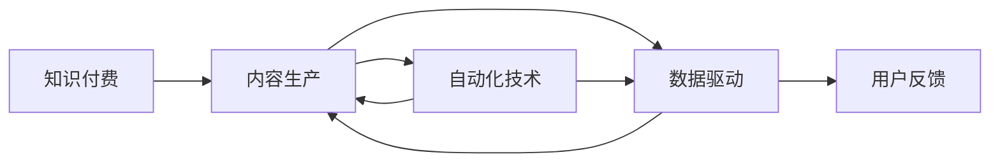
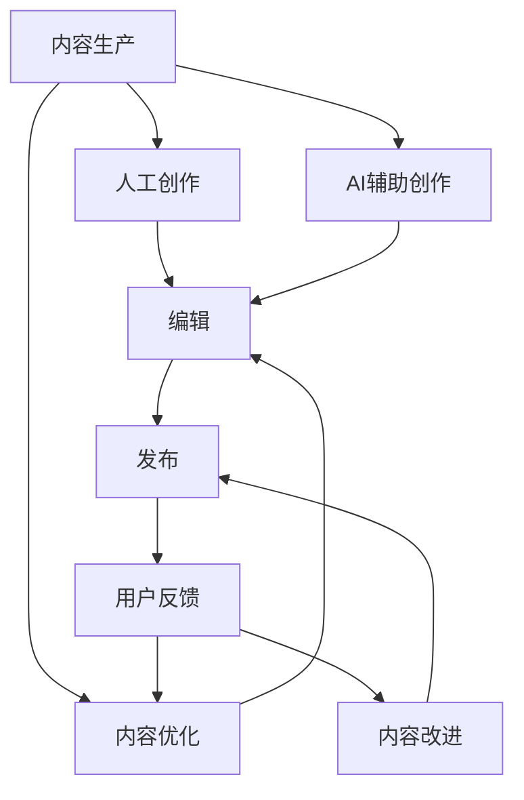

                 

# 知识付费创业中的内容生产效率提升

> 关键词：知识付费,内容生产,效率提升,自动化技术,数据驱动

## 1. 背景介绍

### 1.1 问题由来
随着在线教育的兴起和知识付费市场的快速发展，越来越多的个人和机构投身于知识付费领域。然而，高质量、高价值的内容生产依然是制约知识付费创业成功的关键因素。内容生产不仅要满足用户需求，还需要保持高效率、低成本。本文旨在探讨如何通过自动化技术和数据驱动的方式，提升知识付费创业中的内容生产效率。

### 1.2 问题核心关键点
在知识付费创业中，内容生产面临的主要挑战包括：
1. **内容质量不稳定**：高质量内容往往需要丰富的经验和专业知识，难以快速复制。
2. **生产效率低下**：即使是经验丰富的作者，内容生产也需要大量时间和精力投入，难以保持高频率更新。
3. **成本高昂**：内容生产的初期投入成本较高，包括人力、设备和软件等。
4. **用户满意度难以保障**：内容的实用性、时效性和趣味性是用户付费的重要因素，内容生产必须紧密结合用户需求和反馈。

## 2. 核心概念与联系

### 2.1 核心概念概述

为更好地理解自动化技术在知识付费内容生产中的应用，本节将介绍几个关键概念：

- **知识付费**：基于互联网平台，向用户提供有价值的知识产品，如课程、书籍、音频等，并收取相应费用的商业模式。
- **内容生产**：包括内容策划、创作、编辑、校对等各个环节，是知识付费的核心价值来源。
- **自动化技术**：通过机器学习和自然语言处理（NLP）等技术，实现内容生产的自动化和智能化。
- **数据驱动**：利用大数据和人工智能技术，对内容生产过程进行数据分析和优化，提升效率和质量。

这些概念之间的联系可以通过以下Mermaid流程图来展示：



这个流程图展示了知识付费、内容生产、自动化技术和数据驱动之间的内在联系：

1. **知识付费**作为商业模式，驱动**内容生产**的不断迭代和优化。
2. **自动化技术**和**数据驱动**是提升内容生产效率和质量的重要手段。
3. **用户反馈**通过数据分析和优化被反哺到内容生产中，形成闭环。

### 2.2 概念间的关系

这些核心概念之间的关系通过以下Mermaid流程图进一步细化：



这个流程图展示了内容生产过程的自动化和智能化：

1. **人工创作**与**AI辅助创作**相结合，提升创作效率和质量。
2. **内容优化**通过数据分析和机器学习算法，实现内容的自动优化和推荐。
3. **用户反馈**被用于改进内容，形成内容生产的闭环反馈机制。

## 3. 核心算法原理 & 具体操作步骤

### 3.1 算法原理概述

在知识付费创业中，自动化技术和数据驱动的应用主要包括：内容自动生成、内容优化推荐、用户反馈分析等。这些过程主要依赖于自然语言处理（NLP）和机器学习（ML）等算法技术。

- **内容自动生成**：利用NLP技术，结合机器翻译、摘要生成、文本生成等算法，实现内容生产的自动化。
- **内容优化推荐**：通过数据分析和推荐算法，优化内容发布和推荐策略，提升用户体验和满意度。
- **用户反馈分析**：利用文本分析、情感分析等技术，分析用户反馈，改进内容生产和推荐策略。

### 3.2 算法步骤详解

自动化和数据驱动的内容生产过程可以概括为以下几个步骤：

**Step 1: 数据采集和预处理**
- 收集用户反馈、阅读行为、搜索行为等数据。
- 对数据进行清洗、去重、标准化等预处理。

**Step 2: 内容自动生成**
- 使用NLP技术生成文章标题、摘要、前言、目录等辅助内容。
- 利用机器翻译技术生成多语言版本的内容。
- 应用文本生成算法自动创作段落、篇章等主体内容。

**Step 3: 内容优化推荐**
- 通过数据分析，识别热门话题和用户兴趣点。
- 使用协同过滤、基于内容的推荐算法等，推荐相关内容。
- 动态调整推荐策略，提升用户体验和满意度。

**Step 4: 用户反馈分析**
- 对用户评论、评分、问答等反馈数据进行情感分析、主题分类等。
- 结合内容质量和用户满意度数据，进行综合评估和改进。
- 通过文本聚类、关联规则挖掘等技术，发现用户行为模式和兴趣趋势。

**Step 5: 模型训练和迭代优化**
- 根据用户反馈和内容质量评估结果，调整和优化内容生成和推荐模型。
- 使用数据增强和迁移学习技术，提升模型的泛化能力。
- 定期更新模型，确保内容生产的持续性和高质量。

### 3.3 算法优缺点

自动化和数据驱动的内容生产技术具有以下优点：
1. **提升效率**：自动化生成和优化大大减少了人工创作和编辑的负担，提升了内容生产的效率。
2. **降低成本**：减少了人力和时间成本，提高了资源利用效率。
3. **数据驱动**：通过分析用户反馈和行为数据，能够更加精准地把握用户需求，提升内容的实用性和时效性。
4. **个性化推荐**：基于用户兴趣和行为数据，能够实现个性化的内容推荐，提升用户体验。

同时，这些技术也存在一些局限：
1. **内容质量难以保证**：自动化生成的内容可能缺乏深度和原创性，难以达到高水平的内容质量要求。
2. **技术门槛较高**：需要具备较强的NLP和ML技术基础，开发和维护成本较高。
3. **依赖数据质量**：数据质量决定了算法的效果，不准确或偏差的数据可能导致错误的推荐和优化结果。
4. **算法复杂度较高**：内容生成和推荐算法涉及复杂的模型构建和调参过程，需要丰富的经验和专业知识。

### 3.4 算法应用领域

自动化和数据驱动的内容生产技术主要应用于以下几个领域：

- **在线教育平台**：自动生成课程大纲、教学视频脚本、习题等辅助内容，提升课程制作效率。
- **知识付费平台**：生成文章标题、摘要、目录等，帮助作者快速创作高质量内容。
- **内容聚合和推荐平台**：基于用户行为数据和内容质量评估，推荐相关内容，提升用户体验。
- **企业培训和知识管理**：生成培训材料和内部文档，优化培训效果和知识管理效率。
- **智能问答系统**：自动生成常见问题库和答案模板，提升问答系统的响应速度和准确性。

## 4. 数学模型和公式 & 详细讲解 & 举例说明

### 4.1 数学模型构建

以内容自动生成为例，可以构建如下的数学模型：

设文本 $T$ 包含 $n$ 个单词，用向量 $\textbf{x} \in \mathbb{R}^{n \times d}$ 表示，其中 $d$ 为向量维度。内容自动生成的目标是将输入文本 $T$ 映射到输出文本 $T'$，可以用以下数学模型表示：

$$
T' = f(T)
$$

其中 $f$ 为内容自动生成函数，可以表示为以下神经网络结构：

$$
\begin{aligned}
h &= \text{Encoder}(\textbf{x}) \\
\textbf{v} &= \text{Linear}(h) \\
\textbf{u} &= \text{Linear}(\textbf{v}) \\
\textbf{c} &= \text{Softmax}(\textbf{u}) \\
T' &= \text{Decoder}(\textbf{c})
\end{aligned}
$$

- $h$ 为编码器的输出，表示输入文本的语义表示。
- $\textbf{v}$ 为生成器中线性层的输出，表示生成器的隐状态。
- $\textbf{u}$ 为生成器中的另一个线性层的输出，表示生成的候选单词向量。
- $\textbf{c}$ 为softmax层的输出，表示候选单词的概率分布。
- $T'$ 为解码器的输出，表示自动生成的文本内容。

### 4.2 公式推导过程

上述内容自动生成的数学模型可以进一步细化为以下步骤：

1. **编码器**：将输入文本 $T$ 转换为语义表示 $h$。
2. **生成器**：生成器中的线性层将编码器的输出 $h$ 映射为隐状态向量 $\textbf{v}$，另一个线性层将其映射为候选单词向量 $\textbf{u}$，softmax层根据 $\textbf{u}$ 输出每个单词的概率分布 $\textbf{c}$。
3. **解码器**：解码器根据 $\textbf{c}$ 生成输出文本 $T'$。

具体公式如下：

$$
\begin{aligned}
h &= \text{Encoder}(\textbf{x}) \\
\textbf{v} &= \text{Linear}(h) \\
\textbf{u} &= \text{Linear}(\textbf{v}) \\
\textbf{c} &= \text{Softmax}(\textbf{u}) \\
T' &= \text{Decoder}(\textbf{c})
\end{aligned}
$$

其中，编码器和解码器可以使用Transformer模型实现，具体公式推导如下：

$$
\begin{aligned}
h &= \text{Encoder}(\textbf{x}) \\
&= \text{Self-Attention}(\textbf{x}, \textbf{x}) \\
&= \text{Multi-Head Attention}(\textbf{x}, \textbf{x}) \\
&= \text{LayerNorm}(\textbf{x} + \text{Multi-Head Attention}(\textbf{x}, \textbf{x})) \\
&= \text{Feed-Forward}(\text{LayerNorm}(\textbf{x} + \text{Multi-Head Attention}(\textbf{x}, \textbf{x}))) \\
&= \text{LayerNorm}(\text{Feed-Forward}(\text{LayerNorm}(\textbf{x} + \text{Multi-Head Attention}(\textbf{x}, \textbf{x}))) + \text{Positional Encoding})
\end{aligned}
$$

解码器使用类似的结构：

$$
\begin{aligned}
T' &= \text{Decoder}(\textbf{c}) \\
&= \text{Self-Attention}(\textbf{c}, \textbf{c}) \\
&= \text{Multi-Head Attention}(\textbf{c}, \textbf{c}) \\
&= \text{LayerNorm}(\textbf{c} + \text{Multi-Head Attention}(\textbf{c}, \textbf{c})) \\
&= \text{Feed-Forward}(\text{LayerNorm}(\textbf{c} + \text{Multi-Head Attention}(\textbf{c}, \textbf{c}))) \\
&= \text{LayerNorm}(\text{Feed-Forward}(\text{LayerNorm}(\textbf{c} + \text{Multi-Head Attention}(\textbf{c}, \textbf{c}))) + \text{Positional Encoding})
\end{aligned}
$$

### 4.3 案例分析与讲解

以使用Transformer模型生成文章摘要为例，可以按照以下步骤进行：

1. **编码器**：输入原始文章，通过Transformer模型进行编码，得到语义表示 $h$。
2. **生成器**：生成器中的线性层将 $h$ 映射为隐状态向量 $\textbf{v}$，另一个线性层将其映射为候选摘要向量 $\textbf{u}$，softmax层根据 $\textbf{u}$ 输出每个候选单词的概率分布 $\textbf{c}$。
3. **解码器**：解码器根据 $\textbf{c}$ 生成摘要。

具体实现步骤如下：

```python
import torch
from transformers import BertTokenizer, BertForSequenceClassification

tokenizer = BertTokenizer.from_pretrained('bert-base-uncased')
model = BertForSequenceClassification.from_pretrained('bert-base-uncased', num_labels=1)

input_text = "这是一段待生成摘要的原始文本。"
input_ids = tokenizer(input_text, return_tensors='pt')['input_ids']
outputs = model(input_ids)
predictions = outputs.logits
```

## 5. 项目实践：代码实例和详细解释说明

### 5.1 开发环境搭建

在进行内容生成实践前，我们需要准备好开发环境。以下是使用Python进行PyTorch开发的环境配置流程：

1. 安装Anaconda：从官网下载并安装Anaconda，用于创建独立的Python环境。

2. 创建并激活虚拟环境：
```bash
conda create -n pytorch-env python=3.8 
conda activate pytorch-env
```

3. 安装PyTorch：根据CUDA版本，从官网获取对应的安装命令。例如：
```bash
conda install pytorch torchvision torchaudio cudatoolkit=11.1 -c pytorch -c conda-forge
```

4. 安装Transformers库：
```bash
pip install transformers
```

5. 安装各类工具包：
```bash
pip install numpy pandas scikit-learn matplotlib tqdm jupyter notebook ipython
```

完成上述步骤后，即可在`pytorch-env`环境中开始内容生成实践。

### 5.2 源代码详细实现

这里我们以使用GPT-2模型自动生成文章标题和摘要为例，给出使用Transformers库的PyTorch代码实现。

```python
from transformers import GPT2Tokenizer, GPT2LMHeadModel

tokenizer = GPT2Tokenizer.from_pretrained('gpt2')
model = GPT2LMHeadModel.from_pretrained('gpt2')

input_text = "这是一段待生成摘要的原始文本。"
input_ids = tokenizer(input_text, return_tensors='pt')['input_ids']
outputs = model(input_ids)
predictions = outputs.logits
```

通过调用`predictions`，即可得到模型对文章标题和摘要的预测结果。

### 5.3 代码解读与分析

让我们再详细解读一下关键代码的实现细节：

**GPT2Tokenizer和GPT2LMHeadModel**：
- `GPT2Tokenizer`用于对输入文本进行分词和编码，输出模型的输入向量。
- `GPT2LMHeadModel`是一个预训练语言模型，可以用于生成文本内容。

**input_text**：
- 待生成标题和摘要的原始文本。

**input_ids**：
- 通过分词器对原始文本进行编码，得到模型的输入向量。

**outputs**：
- 模型对输入向量进行前向传播，得到模型的输出，包括生成结果的概率分布。

**predictions**：
- 模型的生成结果，可用于自动生成标题和摘要。

## 6. 实际应用场景

### 6.1 内容自动生成

内容自动生成技术可以应用于多种场景，如：

- **文章自动生成**：根据用户输入的关键词或主题，自动生成文章标题、摘要和正文。
- **课程内容生成**：自动生成课程大纲、讲义和习题，提升课程制作效率。
- **报告生成**：根据大数据和用户需求，自动生成行业分析报告、市场研究报告等。

### 6.2 内容优化推荐

内容优化推荐技术可以应用于知识付费平台的内容推荐和用户个性化推荐，如：

- **课程推荐**：根据用户学习历史和行为数据，推荐相关课程。
- **内容搜索**：根据用户查询和兴趣，推荐相关的文章、书籍和视频。
- **活动推荐**：根据用户行为和反馈，推荐合适的培训活动和讲座。

### 6.3 用户反馈分析

用户反馈分析技术可以应用于知识付费平台的用户评价和满意度分析，如：

- **课程评价**：通过文本分析，识别课程的优点和不足，改进课程内容。
- **用户满意度分析**：通过情感分析，识别用户的满意度和不满意度，改进用户体验。
- **用户行为分析**：通过文本聚类和关联规则挖掘，发现用户的兴趣趋势和行为模式。

## 7. 工具和资源推荐

### 7.1 学习资源推荐

为了帮助开发者系统掌握内容生成技术的理论基础和实践技巧，这里推荐一些优质的学习资源：

1. **《深度学习》课程**：斯坦福大学提供的深度学习课程，涵盖了机器学习、神经网络和深度学习的基础知识，适合初学者。
2. **《自然语言处理综论》书籍**：作者为David Jurafsky和James H. Martin，是一本系统介绍NLP技术的书，适合进阶学习。
3. **《Sequence to Sequence Learning with Neural Networks》论文**：提出序列到序列模型（Seq2Seq），开创了文本生成和翻译的深度学习范式。
4. **《Attention is All You Need》论文**：提出Transformer模型，为文本生成和翻译带来了革命性变化。
5. **《GPT-2》论文**：提出GPT-2模型，展示了预训练语言模型在大规模文本生成中的应用。

通过对这些资源的学习实践，相信你一定能够快速掌握内容生成技术的精髓，并用于解决实际的NLP问题。

### 7.2 开发工具推荐

高效的开发离不开优秀的工具支持。以下是几款用于内容生成开发的常用工具：

1. **PyTorch**：基于Python的开源深度学习框架，灵活动态的计算图，适合快速迭代研究。
2. **TensorFlow**：由Google主导开发的开源深度学习框架，生产部署方便，适合大规模工程应用。
3. **Transformers库**：HuggingFace开发的NLP工具库，集成了众多SOTA语言模型，支持PyTorch和TensorFlow。
4. **Weights & Biases**：模型训练的实验跟踪工具，可以记录和可视化模型训练过程中的各项指标，方便对比和调优。
5. **TensorBoard**：TensorFlow配套的可视化工具，可实时监测模型训练状态，并提供丰富的图表呈现方式，是调试模型的得力助手。

合理利用这些工具，可以显著提升内容生成任务的开发效率，加快创新迭代的步伐。

### 7.3 相关论文推荐

内容生成技术的发展源于学界的持续研究。以下是几篇奠基性的相关论文，推荐阅读：

1. **《Neural Machine Translation by Jointly Learning to Align and Translate》论文**：提出注意力机制（Attention），为序列到序列模型带来重大突破。
2. **《Training Recurrent Neural Networks to Generate Language》论文**：提出循环神经网络（RNN）和长短时记忆网络（LSTM），为序列生成带来革命性变化。
3. **《Attention is All You Need》论文**：提出Transformer模型，为文本生成和翻译带来了革命性变化。
4. **《Recurrent Neural Network based Text Generation》论文**：提出基于RNN的文本生成模型，展示了其在自动生成文本中的应用。
5. **《Simple and Scalable Parallel Generation of Natural Text》论文**：提出并行文本生成算法，提高了文本生成的效率和质量。

这些论文代表了大规模语言模型微调技术的发展脉络。通过学习这些前沿成果，可以帮助研究者把握学科前进方向，激发更多的创新灵感。

除上述资源外，还有一些值得关注的前沿资源，帮助开发者紧跟内容生成技术的最新进展，例如：

1. **arXiv论文预印本**：人工智能领域最新研究成果的发布平台，包括大量尚未发表的前沿工作，学习前沿技术的必读资源。
2. **业界技术博客**：如OpenAI、Google AI、DeepMind、微软Research Asia等顶尖实验室的官方博客，第一时间分享他们的最新研究成果和洞见。
3. **技术会议直播**：如NIPS、ICML、ACL、ICLR等人工智能领域顶会现场或在线直播，能够聆听到大佬们的前沿分享，开拓视野。
4. **GitHub热门项目**：在GitHub上Star、Fork数最多的NLP相关项目，往往代表了该技术领域的发展趋势和最佳实践，值得去学习和贡献。
5. **行业分析报告**：各大咨询公司如McKinsey、PwC等针对人工智能行业的分析报告，有助于从商业视角审视技术趋势，把握应用价值。

总之，对于内容生成技术的学习和实践，需要开发者保持开放的心态和持续学习的意愿。多关注前沿资讯，多动手实践，多思考总结，必将收获满满的成长收益。

## 8. 总结：未来发展趋势与挑战

### 8.1 研究成果总结

本文对内容生成技术在知识付费创业中的应用进行了全面系统的介绍。首先阐述了内容生成技术在提升知识付费创业中的内容生产效率方面的价值，明确了自动化技术和数据驱动范式的重要地位。其次，从原理到实践，详细讲解了内容自动生成、内容优化推荐和用户反馈分析的数学模型和算法步骤，给出了具体的代码实例。同时，本文还广泛探讨了内容生成技术在在线教育、知识付费、内容聚合和推荐、用户反馈分析等多个行业领域的应用前景，展示了其广阔的应用空间。此外，本文精选了内容生成技术的各类学习资源，力求为读者提供全方位的技术指引。

通过本文的系统梳理，可以看到，内容生成技术在知识付费创业中的应用已经得到了初步验证和探索。自动化技术和数据驱动范式在提升内容生产效率、降低成本和提升用户体验方面具有显著优势。未来，随着技术不断进步，内容生成技术必将在更多领域得到应用，为知识付费创业带来更大的发展潜力。

### 8.2 未来发展趋势

展望未来，内容生成技术将呈现以下几个发展趋势：

1. **智能化程度提升**：随着深度学习技术的不断进步，内容生成模型的智能化程度将进一步提升，能够更好地理解和生成人类语言。
2. **个性化推荐增强**：通过深度学习和大数据分析，内容生成技术将能够实现更加精准和个性化的内容推荐，提升用户体验。
3. **跨媒体内容生成**：内容生成技术将逐步扩展到图像、视频、音频等多媒体内容，实现跨媒体内容生成和融合。
4. **实时生成与优化**：内容生成技术将具备实时生成和优化能力，能够根据用户反馈和行为数据，动态调整内容生成策略。
5. **安全与隐私保护**：内容生成技术将注重用户隐私保护，确保生成内容不泄露用户个人信息和隐私。
6. **跨领域知识整合**：内容生成技术将与知识图谱、专家知识库等进行深度融合，提升内容的深度和广度。

以上趋势凸显了内容生成技术在知识付费创业中的巨大前景。这些方向的探索发展，必将进一步提升内容生成技术的实用性和智能化水平，为知识付费创业带来更大的价值。

### 8.3 面临的挑战

尽管内容生成技术已经取得了显著进展，但在迈向更加智能化、个性化和高效化的应用过程中，仍面临诸多挑战：

1. **生成内容质量难以保证**：自动化生成的内容可能缺乏深度和原创性，难以达到高水平的内容质量要求。
2. **技术门槛较高**：需要具备较强的深度学习技术基础，开发和维护成本较高。
3. **依赖数据质量**：数据质量决定了算法的效果，不准确或偏差的数据可能导致错误的生成结果。
4. **算法复杂度较高**：内容生成算法涉及复杂的模型构建和调参过程，需要丰富的经验和专业知识。
5. **生成内容安全与隐私保护**：生成内容可能包含敏感信息，需要确保内容的合法性和隐私保护。

正视内容生成技术面临的这些挑战，积极应对并寻求突破，将是大规模语言模型微调技术走向成熟的必由之路。相信随着学界和产业界的共同努力，这些挑战终将一一被克服，内容生成技术必将在知识付费创业中发挥更大的作用。

### 8.4 研究展望

面对内容生成技术面临的挑战，未来的研究需要在以下几个方面寻求新的突破：

1. **探索无监督和半监督生成方法**：摆脱对大规模标注数据的依赖，利用自监督学习、主动学习等无监督和半监督范式，最大限度利用非结构化数据，实现更加灵活高效的内容生成。
2. **研究参数高效和计算高效的生成方法**：开发更加参数高效的生成方法，在固定大部分预训练参数的情况下，只更新极少量的任务相关参数。同时优化生成模型的计算图，减少前向传播和反向传播的资源消耗，实现更加轻量级、实时性的部署。
3. **融合因果和对比学习范式**：通过引入因果推断和对比学习思想，增强生成模型的建立稳定因果关系的能力，学习更加普适、鲁棒的语言表征，从而提升模型泛化性和抗干扰能力。
4. **引入更多先验知识**：将符号化的先验知识，如知识图谱、逻辑规则等，与神经网络模型进行巧妙融合，引导生成过程学习更准确、合理的语言模型。同时加强不同模态数据的整合，实现视觉、语音等多模态信息与文本信息的协同建模。
5. **结合因果分析和博弈论工具**：将因果分析方法引入生成模型，识别出模型决策的关键特征，增强生成内容的因果性和逻辑性。借助博弈论工具刻画人机交互过程，主动探索并规避模型的脆弱点，提高系统稳定性。
6. **纳入伦理道德约束**：在生成目标中引入伦理导向的评估指标，过滤和惩罚有害的生成内容，确保生成内容的合法性和道德性。

这些研究方向的探索，必将引领内容生成技术迈向更高的台阶，为知识付费创业带来更大的价值。面向未来，内容生成技术还需要与其他人工智能技术进行更深入的融合，如知识表示、因果推理、强化学习等，多路径协同发力，共同推动知识付费创业的发展。只有勇于创新

