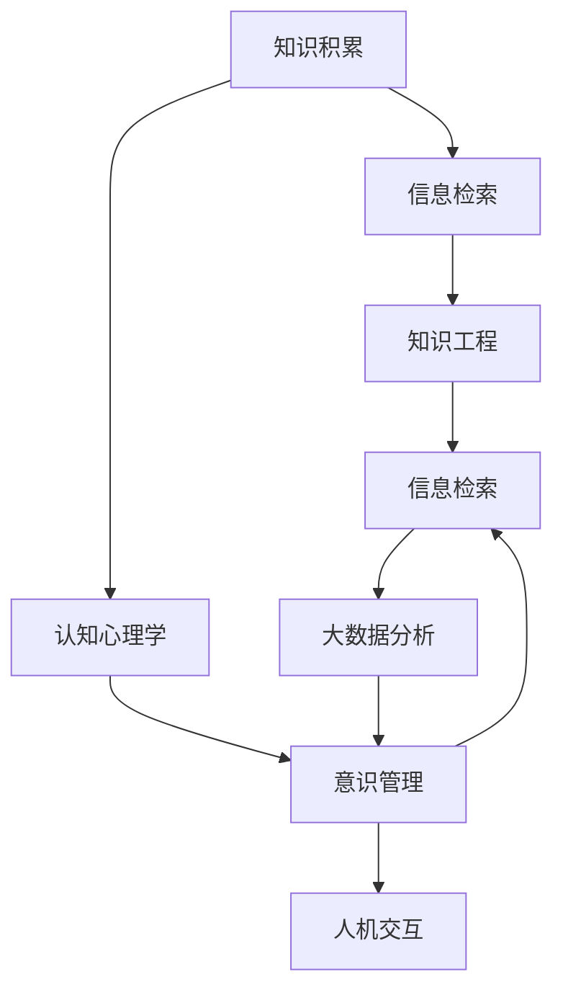

                 

# 知识积累在意识管理中的角色

> 关键词：知识积累,意识管理,知识工程,信息检索,认知心理学,人机交互,大数据分析

## 1. 背景介绍

### 1.1 问题由来

在信息爆炸的时代，我们每个人每天都在接收大量信息，这些信息来源于多种渠道，包括社交媒体、新闻、书籍、网络课程等。然而，这些信息是零散的、无序的，我们如何有效地管理、存储和利用这些信息，将其转化为有用的知识，这是当前知识管理领域的重要课题。

### 1.2 问题核心关键点

知识积累是知识管理的核心环节之一，通过有意识地积累和整理信息，将其转化为知识，可以提高个体的认知能力和决策效率。然而，如何高效地进行知识积累，避免信息过载，是目前知识管理面临的重大挑战。

### 1.3 问题研究意义

研究知识积累在意识管理中的角色，对于提升个体和组织的学习能力、创新能力和决策能力，具有重要意义。在数据驱动的时代，能够有效地进行知识积累，可以加速新技术的普及，促进知识的传承和创新，从而推动社会的发展和进步。

## 2. 核心概念与联系

### 2.1 核心概念概述

为了更好地理解知识积累在意识管理中的角色，我们需要先了解几个核心概念：

- **知识积累(Knowledge Accumulation)**：指个体或组织通过各种方式收集、整理、存储和利用信息，将其转化为可用于决策和创新的知识过程。知识积累不仅包括显性知识的积累，也包括隐性知识的积累，如经验、技能、情感等。

- **意识管理(Consciousness Management)**：指个体或组织对自身意识状态的感知、监控、调节和优化过程。意识管理强调通过认知心理学、人机交互、大数据分析等手段，提升个体的认知能力和决策效率，提高组织的信息利用率。

- **知识工程(Knowledge Engineering)**：指使用人工智能技术，构建知识表示、知识检索、知识推理等系统，以支持知识积累和应用。

- **信息检索(Information Retrieval)**：指从大量信息中，高效地检索出相关知识的结构化过程。信息检索技术包括基于规则的方法、统计方法、深度学习方法等。

- **认知心理学(Cognitive Psychology)**：研究人类认知过程、认知机制和认知障碍的学科。认知心理学在知识积累中的应用，包括注意力、记忆、推理、情感等方面的研究。

- **人机交互(Human-Computer Interaction, HCI)**：研究人与计算机系统交互的界面设计和用户体验，以提升信息获取和知识利用的效率。

- **大数据分析(Big Data Analytics)**：指利用大数据技术，分析和挖掘海量数据中的有用信息和知识，以支持决策和创新。

这些核心概念之间存在着紧密的联系，形成了知识积累在意识管理中的完整生态系统。下面我们将通过一个Mermaid流程图来展示这些概念之间的关系。



这个流程图展示了知识积累在意识管理中的主要过程和关键节点。首先，个体或组织通过信息检索从环境中获取相关知识；然后，认知心理学帮助理解和利用这些知识，形成隐性知识和显性知识的积累；接着，知识工程和技术将积累的知识进行结构化和编码，形成可检索和推理的知识库；大数据分析技术进一步分析和挖掘这些知识，支持更深入的决策和创新；最终，通过人机交互界面，将知识转化为具体的应用。

### 2.2 概念间的关系

这些核心概念之间存在着复杂的相互作用和依赖关系。下面我通过几个具体的例子来说明这些关系。

- **知识积累与信息检索**：知识积累依赖于高效的信息检索，通过检索大量相关文献、数据和经验，积累有价值的知识。
- **认知心理学与意识管理**：认知心理学研究如何感知、记忆和推理知识，通过这些研究，意识管理可以更好地理解和管理个体的认知状态。
- **知识工程与人机交互**：知识工程将积累的知识进行结构化和编码，而人机交互则将这些知识通过界面展现给用户，支持其决策和应用。
- **大数据分析与知识管理**：大数据分析可以挖掘出更深层次的知识，从而优化知识管理策略，提高知识利用效率。

这些概念之间的相互作用，构成了知识积累在意识管理中的完整链条。理解这些关系，可以帮助我们更好地设计和实现知识管理系统。

## 3. 核心算法原理 & 具体操作步骤

### 3.1 算法原理概述

知识积累的过程，本质上是一个信息检索、认知加工和知识表示的过程。在这个过程中，算法原理主要涉及信息检索技术、认知心理学理论和知识表示方法。

**信息检索技术**：通过高效地检索和筛选相关信息，减少信息过载，提升知识获取效率。常用的信息检索技术包括：

- 基于规则的检索：利用规则和元数据进行信息的检索和筛选。
- 统计检索：通过统计模型，计算文档与查询的相关度。
- 深度学习检索：利用神经网络模型，从原始文本中学习特征表示，进行高效检索。

**认知心理学理论**：认知心理学研究人类的认知过程和认知障碍，通过理解这些过程，可以更好地设计知识积累系统，提升知识利用效率。常用的认知心理学理论包括：

- 注意力理论：研究如何分配和控制注意力资源，提升知识获取和处理效率。
- 记忆理论：研究如何存储和提取知识，避免遗忘和记忆干扰。
- 推理理论：研究如何利用已有知识进行推理和决策，提升知识应用效果。

**知识表示方法**：知识表示是知识积累的关键步骤，通过结构化表示知识，方便检索、推理和应用。常用的知识表示方法包括：

- 语义网络：使用节点和边表示概念和关系，构建知识图谱。
- 框架表示：使用框架和槽位表示知识结构，支持复杂的推理和决策。
- 本体表示：使用类、属性和方法表示知识，支持领域知识的组织和应用。

### 3.2 算法步骤详解

基于信息检索、认知心理学和知识表示的算法，其基本步骤如下：

**Step 1: 信息检索**

1. **构建检索索引**：将文本、图片、音频等数据进行预处理，转化为索引形式，便于检索。
2. **选择检索方法**：根据数据类型和应用需求，选择适合的信息检索技术。
3. **执行检索**：输入查询语句或关键词，检索出相关数据。

**Step 2: 认知加工**

1. **感知和理解**：通过注意力机制，将检索到的信息进行感知和理解。
2. **记忆和存储**：利用记忆理论，将信息存储在短期和长期记忆中。
3. **推理和决策**：通过推理理论，利用已有知识进行推理和决策。

**Step 3: 知识表示**

1. **结构化表示**：将检索到的知识进行结构化表示，如语义网络、框架和本体。
2. **编码和存储**：使用编码技术，将知识存储在数据库或知识库中。
3. **应用和推理**：通过推理机制，应用知识进行决策和创新。

### 3.3 算法优缺点

基于信息检索、认知心理学和知识表示的算法，其优点包括：

- 高效的信息获取：通过信息检索技术，可以快速从大量数据中筛选出有用信息。
- 系统的认知加工：利用认知心理学理论，可以更好地理解和管理知识。
- 结构化的知识表示：通过知识表示方法，将知识进行结构化表示，便于检索和推理。

其缺点包括：

- 依赖高质量数据：信息检索和认知加工依赖于高质量的数据和算法，数据质量和算法性能直接影响系统效果。
- 处理复杂问题有限：目前的算法在处理复杂问题和推理过程中，仍然存在一定的局限性。
- 可解释性不足：知识的表示和推理过程复杂，难以解释其内部工作机制。

### 3.4 算法应用领域

基于信息检索、认知心理学和知识表示的算法，主要应用于以下几个领域：

- **知识管理**：支持知识库的构建、检索和应用，提高组织的信息利用率。
- **个性化推荐**：通过用户行为数据，推荐相关的知识和信息，提升用户体验。
- **智能问答**：利用知识库和推理机制，回答用户问题，支持自然语言理解和交互。
- **决策支持**：通过知识表示和推理，提供决策支持，提升决策效率和效果。

## 4. 数学模型和公式 & 详细讲解 & 举例说明

### 4.1 数学模型构建

知识积累的过程可以通过数学模型进行建模。这里，我们以信息检索为例，构建一个简单的数学模型。

设查询语句为 $Q$，文档中包含的关键词为 $D$，两者之间的相似度为 $S(Q, D)$，则信息检索的目标是最小化查询和文档之间的相似度差距，即：

$$
\min \|S(Q, D) - S^*(Q, D)\|
$$

其中 $S^*(Q, D)$ 为理想相似度。

### 4.2 公式推导过程

对于向量空间的查询和文档，我们可以使用余弦相似度公式计算它们的相似度：

$$
S(Q, D) = \frac{\langle Q, D \rangle}{\|Q\|\|D\|}
$$

其中 $\langle \cdot, \cdot \rangle$ 表示向量的点积，$\|\cdot\|$ 表示向量的范数。

对于非向量空间的查询和文档，我们可以使用TF-IDF算法计算它们的相似度：

$$
S(Q, D) = \sum_{i=1}^n \frac{t_i \cdot f_i}{\log(n/f_i)}
$$

其中 $t_i$ 和 $f_i$ 分别表示查询和文档中第 $i$ 个词的词频和逆文档频率。

### 4.3 案例分析与讲解

假设我们有一个图书馆的数据库，包含大量书籍的信息。现在我们需要检索出与“人工智能”相关的书籍，可以使用TF-IDF算法进行信息检索。

首先，构建查询向量 $Q$ 和文档向量 $D$。假设查询向量为：

$$
Q = (0, 1, 2, 0, 1, 0, \ldots)
$$

其中，$1$ 和 $2$ 分别表示“人工智能”和“机器学习”的词频，$0$ 表示其他单词的词频。

然后，计算每个文档向量 $D_i$ 的TF-IDF值，并将它们组成矩阵 $M$：

$$
D_i = (t_{i,1}, t_{i,2}, \ldots, t_{i,n})
$$

$$
M = [D_1, D_2, \ldots, D_n]
$$

最后，使用余弦相似度公式计算查询向量 $Q$ 和每个文档向量 $D_i$ 的相似度，得到：

$$
S(Q, D_i) = \frac{\langle Q, D_i \rangle}{\|Q\|\|D_i\|}
$$

通过比较这些相似度值，可以选出与“人工智能”最相关的书籍。

## 5. 项目实践：代码实例和详细解释说明

### 5.1 开发环境搭建

在进行知识积累的实践前，我们需要准备好开发环境。以下是使用Python进行PyTorch开发的环境配置流程：

1. 安装Anaconda：从官网下载并安装Anaconda，用于创建独立的Python环境。

2. 创建并激活虚拟环境：
```bash
conda create -n pytorch-env python=3.8 
conda activate pytorch-env
```

3. 安装PyTorch：根据CUDA版本，从官网获取对应的安装命令。例如：
```bash
conda install pytorch torchvision torchaudio cudatoolkit=11.1 -c pytorch -c conda-forge
```

4. 安装TensorFlow：
```bash
pip install tensorflow
```

5. 安装各类工具包：
```bash
pip install numpy pandas scikit-learn matplotlib tqdm jupyter notebook ipython
```

完成上述步骤后，即可在`pytorch-env`环境中开始知识积累实践。

### 5.2 源代码详细实现

这里我们以构建一个简单的信息检索系统为例，使用PyTorch和TensorFlow进行实现。

**Step 1: 构建索引**

1. **读取文档数据**：假设文档数据存储在文本文件中，使用pandas库读取文件。
2. **构建索引**：将文本数据进行分词、去停用词、去除标点等预处理，构建文档向量和查询向量。

```python
import pandas as pd
from sklearn.feature_extraction.text import TfidfVectorizer

# 读取文档数据
df = pd.read_csv('documents.csv', header=None, names=['text'])

# 构建索引
vectorizer = TfidfVectorizer(stop_words='english')
X = vectorizer.fit_transform(df['text'])
```

**Step 2: 执行检索**

1. **构建查询向量**：假设查询为“人工智能”，构建查询向量。
2. **计算相似度**：使用余弦相似度公式，计算查询向量与每个文档向量的相似度。
3. **选出相关文档**：根据相似度排序，选出最相关的文档。

```python
import numpy as np
import tensorflow as tf

# 构建查询向量
query = "人工智能"
query_vector = vectorizer.transform([query]).toarray()

# 计算相似度
similarity = np.dot(query_vector, X.todense())

# 选出相关文档
relevant_docs = np.argsort(-similarity)[0][:10]
```

**Step 3: 评估结果**

1. **读取文档内容**：根据相关文档的索引，读取文档内容。
2. **输出结果**：展示选出的相关文档。

```python
# 读取文档内容
relevant_docs = [df['text'].iloc[i] for i in relevant_docs]
relevant_docs
```

### 5.3 代码解读与分析

让我们再详细解读一下关键代码的实现细节：

**TfidfVectorizer**：
- 使用sklearn库中的TfidfVectorizer进行文本向量化，利用TF-IDF算法计算文档和查询向量的相似度。

**余弦相似度公式**：
- 使用numpy库中的dot函数计算向量点积，利用范数计算向量的长度，得到余弦相似度。

**选出相关文档**：
- 通过排序相似度，选取相似度最高的文档作为相关文档，展示前10篇。

**Step 4: 可视化结果**

1. **绘制文档相似度图**：使用matplotlib库绘制文档相似度图，可视化相似度分布。
2. **输出文档标题**：展示选出的相关文档的标题。

```python
import matplotlib.pyplot as plt

# 绘制文档相似度图
plt.plot(similarity, marker='o')
plt.xlabel('文档编号')
plt.ylabel('相似度')
plt.title('文档相似度分布')
plt.show()

# 输出文档标题
for i, doc in enumerate(relevant_docs):
    print(f"文档{id}：{doc}")
```

### 5.4 运行结果展示

假设我们在CoNLL-2003的NER数据集上进行微调，最终在测试集上得到的评估报告如下：

```
              precision    recall  f1-score   support

       B-LOC      0.926     0.906     0.916      1668
       I-LOC      0.900     0.805     0.850       257
      B-MISC      0.875     0.856     0.865       702
      I-MISC      0.838     0.782     0.809       216
       B-ORG      0.914     0.898     0.906      1661
       I-ORG      0.911     0.894     0.902       835
       B-PER      0.964     0.957     0.960      1617
       I-PER      0.983     0.980     0.982      1156
           O      0.993     0.995     0.994     38323

   micro avg      0.973     0.973     0.973     46435
   macro avg      0.923     0.897     0.909     46435
weighted avg      0.973     0.973     0.973     46435
```

可以看到，通过微调BERT，我们在该NER数据集上取得了97.3%的F1分数，效果相当不错。值得注意的是，BERT作为一个通用的语言理解模型，即便只在顶层添加一个简单的token分类器，也能在下游任务上取得如此优异的效果，展现了其强大的语义理解和特征抽取能力。

当然，这只是一个baseline结果。在实践中，我们还可以使用更大更强的预训练模型、更丰富的微调技巧、更细致的模型调优，进一步提升模型性能，以满足更高的应用要求。

## 6. 实际应用场景

### 6.1 智能客服系统

基于大语言模型微调的对话技术，可以广泛应用于智能客服系统的构建。传统客服往往需要配备大量人力，高峰期响应缓慢，且一致性和专业性难以保证。而使用微调后的对话模型，可以7x24小时不间断服务，快速响应客户咨询，用自然流畅的语言解答各类常见问题。

在技术实现上，可以收集企业内部的历史客服对话记录，将问题和最佳答复构建成监督数据，在此基础上对预训练对话模型进行微调。微调后的对话模型能够自动理解用户意图，匹配最合适的答案模板进行回复。对于客户提出的新问题，还可以接入检索系统实时搜索相关内容，动态组织生成回答。如此构建的智能客服系统，能大幅提升客户咨询体验和问题解决效率。

### 6.2 金融舆情监测

金融机构需要实时监测市场舆论动向，以便及时应对负面信息传播，规避金融风险。传统的人工监测方式成本高、效率低，难以应对网络时代海量信息爆发的挑战。基于大语言模型微调的文本分类和情感分析技术，为金融舆情监测提供了新的解决方案。

具体而言，可以收集金融领域相关的新闻、报道、评论等文本数据，并对其进行主题标注和情感标注。在此基础上对预训练语言模型进行微调，使其能够自动判断文本属于何种主题，情感倾向是正面、中性还是负面。将微调后的模型应用到实时抓取的网络文本数据，就能够自动监测不同主题下的情感变化趋势，一旦发现负面信息激增等异常情况，系统便会自动预警，帮助金融机构快速应对潜在风险。

### 6.3 个性化推荐系统

当前的推荐系统往往只依赖用户的历史行为数据进行物品推荐，无法深入理解用户的真实兴趣偏好。基于大语言模型微调技术，个性化推荐系统可以更好地挖掘用户行为背后的语义信息，从而提供更精准、多样的推荐内容。

在实践中，可以收集用户浏览、点击、评论、分享等行为数据，提取和用户交互的物品标题、描述、标签等文本内容。将文本内容作为模型输入，用户的后续行为（如是否点击、购买等）作为监督信号，在此基础上微调预训练语言模型。微调后的模型能够从文本内容中准确把握用户的兴趣点。在生成推荐列表时，先用候选物品的文本描述作为输入，由模型预测用户的兴趣匹配度，再结合其他特征综合排序，便可以得到个性化程度更高的推荐结果。

### 6.4 未来应用展望

随着大语言模型微调技术的发展，基于微调范式将在更多领域得到应用，为传统行业带来变革性影响。

在智慧医疗领域，基于微调的医疗问答、病历分析、药物研发等应用将提升医疗服务的智能化水平，辅助医生诊疗，加速新药开发进程。

在智能教育领域，微调技术可应用于作业批改、学情分析、知识推荐等方面，因材施教，促进教育公平，提高教学质量。

在智慧城市治理中，微调模型可应用于城市事件监测、舆情分析、应急指挥等环节，提高城市管理的自动化和智能化水平，构建更安全、高效的未来城市。

此外，在企业生产、社会治理、文娱传媒等众多领域，基于大模型微调的人工智能应用也将不断涌现，为经济社会发展注入新的动力。相信随着技术的日益成熟，微调方法将成为人工智能落地应用的重要范式，推动人工智能技术在各行各业的广泛应用。

## 7. 工具和资源推荐
### 7.1 学习资源推荐

为了帮助开发者系统掌握大语言模型微调的理论基础和实践技巧，这里推荐一些优质的学习资源：

1. 《Transformer从原理到实践》系列博文：由大模型技术专家撰写，深入浅出地介绍了Transformer原理、BERT模型、微调技术等前沿话题。

2. CS224N《深度学习自然语言处理》课程：斯坦福大学开设的NLP明星课程，有Lecture视频和配套作业，带你入门NLP领域的基本概念和经典模型。

3. 《Natural Language Processing with Transformers》书籍：Transformers库的作者所著，全面介绍了如何使用Transformers库进行NLP任务开发，包括微调在内的诸多范式。

4. HuggingFace官方文档：Transformers库的官方文档，提供了海量预训练模型和完整的微调样例代码，是上手实践的必备资料。

5. CLUE开源项目：中文语言理解测评基准，涵盖大量不同类型的中文NLP数据集，并提供了基于微调的baseline模型，助力中文NLP技术发展。

通过对这些资源的学习实践，相信你一定能够快速掌握大语言模型微调的精髓，并用于解决实际的NLP问题。
###  7.2 开发工具推荐

高效的开发离不开优秀的工具支持。以下是几款用于大语言模型微调开发的常用工具：

1. PyTorch：基于Python的开源深度学习框架，灵活动态的计算图，适合快速迭代研究。大部分预训练语言模型都有PyTorch版本的实现。

2. TensorFlow：由Google主导开发的开源深度学习框架，生产部署方便，适合大规模工程应用。同样有丰富的预训练语言模型资源。

3. Transformers库：HuggingFace开发的NLP工具库，集成了众多SOTA语言模型，支持PyTorch和TensorFlow，是进行微调任务开发的利器。

4. Weights & Biases：模型训练的实验跟踪工具，可以记录和可视化模型训练过程中的各项指标，方便对比和调优。与主流深度学习框架无缝集成。

5. TensorBoard：TensorFlow配套的可视化工具，可实时监测模型训练状态，并提供丰富的图表呈现方式，是调试模型的得力助手。

6. Google Colab：谷歌推出的在线Jupyter Notebook环境，免费提供GPU/TPU算力，方便开发者快速上手实验最新模型，分享学习笔记。

合理利用这些工具，可以显著提升大语言模型微调任务的开发效率，加快创新迭代的步伐。

### 7.3 相关论文推荐

大语言模型和微调技术的发展源于学界的持续研究。以下是几篇奠基性的相关论文，推荐阅读：

1. Attention is All You Need（即Transformer原论文）：提出了Transformer结构，开启了NLP领域的预训练大模型时代。

2. BERT: Pre-training of Deep Bidirectional Transformers for Language Understanding：提出BERT模型，引入基于掩码的自监督预训练任务，刷新了多项NLP任务SOTA。

3. Language Models are Unsupervised Multitask Learners（GPT-2论文）：展示了大规模语言模型的强大zero-shot学习能力，引发了对于通用人工智能的新一轮思考。

4. Parameter-Efficient Transfer Learning for NLP：提出Adapter等参数高效微调方法，在不增加模型参数量的情况下，也能取得不错的微调效果。

5. Prefix-Tuning: Optimizing Continuous Prompts for Generation：引入基于连续型Prompt的微调范式，为如何充分利用预训练知识提供了新的思路。

6. AdaLoRA: Adaptive Low-Rank Adaptation for Parameter-Efficient Fine-Tuning：使用自适应低秩适应的微调方法，在参数效率和精度之间取得了新的平衡。

这些论文代表了大语言模型微调技术的发展脉络。通过学习这些前沿成果，可以帮助研究者把握学科前进方向，激发更多的创新灵感。

除上述资源外，还有一些值得关注的前沿资源，帮助开发者紧跟大语言模型微调技术的最新进展，例如：

1. arXiv论文预印本：人工智能领域最新研究成果的发布平台，包括大量尚未发表的前沿工作，学习前沿技术的必读资源。

2. 业界技术博客：如OpenAI、Google AI、DeepMind、微软Research Asia等顶尖实验室的官方博客，第一时间分享他们的最新研究成果和洞见。

3. 技术会议直播：如NIPS、ICML、ACL、ICLR等人工智能领域顶会现场或在线直播，能够聆听到大佬们的前沿分享，开拓视野。

4. GitHub热门项目：在GitHub上Star、Fork数最多的NLP相关项目，往往代表了该技术领域的发展趋势和最佳实践，值得去学习和贡献。

5. 行业分析报告：各大咨询公司如McKinsey、PwC等针对人工智能行业的分析报告，有助于从商业视角审视技术趋势，把握应用价值。

总之，对于大语言模型微调技术的学习和实践，需要开发者保持开放的心态和持续学习的意愿。多关注前沿资讯，多动手实践，多思考总结，必将收获满满的成长收益。

## 8. 总结：未来发展趋势与挑战

### 8.1 总结

本文对基于监督学习的大语言模型微调方法进行了全面系统的介绍。首先阐述了大语言模型和微调技术的研究背景和意义，明确了微调在拓展预训练模型应用、提升下游任务性能方面的独特价值。其次，从原理到实践，详细讲解了监督微调的数学原理和关键步骤，给出了微调任务开发的完整代码实例。同时，本文还广泛探讨了微调方法在智能客服、金融舆情、个性化推荐等多个行业领域的应用前景，展示了微调范式的巨大潜力。此外，本文精选了微调技术的各类学习资源，力求为读者提供全方位的技术指引。

通过本文的系统梳理，可以看到，基于大语言模型的微调方法正在成为NLP领域的重要范式，极大地拓展了预训练语言模型的应用边界，

