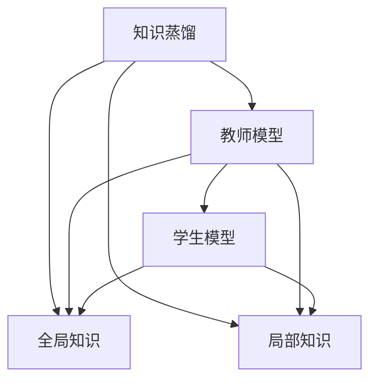

                 

## 1. 背景介绍

在多智能体系统中，每个智能体需要掌握系统的全局知识和局部信息，以便做出最优的决策。然而，智能体通常具有有限的计算资源和存储容量，因此需要一种有效的方法来共享和利用知识。知识蒸馏（Knowledge Distillation）是一种流行的方法，通过将知识从复杂的教师模型（teacher model）转移到简单的学生模型（student model），提高学生模型的性能。本文将探讨知识蒸馏在多智能体系统中的应用，详细阐述其原理、算法步骤及优势，并展示其在实际系统中的应用案例。

## 2. 核心概念与联系

### 2.1 核心概念概述

- **知识蒸馏**：知识蒸馏是一种机器学习技术，通过将知识从复杂教师模型中提取并转移到简单学生模型中，从而提高学生模型的性能。
- **多智能体系统**：多智能体系统由多个自主智能体组成，每个智能体通过与环境和其他智能体进行交互，做出最优决策。
- **全局知识**：全局知识是多智能体系统中的所有智能体共享的知识，通常包括系统的状态、目标、规则等。
- **局部知识**：局部知识是每个智能体拥有的知识，通常包括自身的状态、决策、行为等。

这些概念之间的关系如图1所示：



**图1：知识蒸馏在多智能体系统中的概念图**

### 2.2 概念间的关系

知识蒸馏在多智能体系统中的应用，是将教师模型的全局知识蒸馏到学生模型中，以便每个智能体能够快速获得系统的关键信息，做出高效决策。这种蒸馏过程可以分两步进行：

1. **数据采集**：学生模型从教师模型中获取全局知识，并将其转化为局部知识。
2. **知识转移**：学生模型利用本地数据，学习如何将局部知识转化为全局知识。

通过知识蒸馏，多智能体系统能够更高效地利用共享知识，提升系统的整体性能和鲁棒性。

## 3. 核心算法原理 & 具体操作步骤

### 3.1 算法原理概述

知识蒸馏在多智能体系统中的应用，主要分为两个步骤：

1. **教师模型训练**：教师模型（通常是复杂的深度神经网络）在大量的数据上进行训练，学习全局知识。
2. **学生模型训练**：学生模型（通常是简单的线性模型）从教师模型中获取全局知识，并在局部数据上训练，学习局部知识。

知识蒸馏的目标是将教师模型的输出（即全局知识）映射到学生模型的输出（即局部知识）上，使得学生模型能够在特定任务上达到教师模型的性能。

### 3.2 算法步骤详解

#### 3.2.1 教师模型训练

1. **数据准备**：准备训练数据集，包括全局数据和局部数据。
2. **模型选择**：选择教师模型，如深度神经网络。
3. **模型训练**：在全局数据上训练教师模型，学习全局知识。

#### 3.2.2 学生模型训练

1. **模型选择**：选择学生模型，如线性模型。
2. **知识蒸馏**：在局部数据上训练学生模型，将教师模型的输出作为标签，进行监督学习。
3. **性能评估**：评估学生模型的性能，并与教师模型进行比较。

### 3.3 算法优缺点

**优点**：

- **提高模型性能**：通过将教师模型的全局知识蒸馏到学生模型中，学生模型的性能得到显著提升。
- **减少计算资源**：学生模型通常比教师模型更轻量级，能够更高效地处理局部数据。
- **增强鲁棒性**：学生模型能够更好地适应局部数据的变化，增强系统的鲁棒性。

**缺点**：

- **数据依赖性**：知识蒸馏的效果高度依赖于数据质量，如果数据集不平衡或不充分，可能导致性能下降。
- **复杂度较高**：教师模型和学生模型的训练过程较为复杂，需要仔细设计和调整。

### 3.4 算法应用领域

知识蒸馏在多智能体系统中的应用，主要集中在以下几个领域：

- **自动驾驶**：通过知识蒸馏，多个自动驾驶车辆可以共享全局交通状态和路径规划信息，提高系统的整体性能。
- **机器人协作**：多个机器人通过知识蒸馏，共享全局环境信息和决策策略，实现高效协同。
- **医疗诊断**：多智能体系统可以共享全局病例信息和诊断结果，提高诊断的准确性和效率。
- **金融交易**：多智能体系统可以共享市场信息和交易策略，提高交易的稳定性和收益。

这些领域都存在大量的局部数据和全局数据，知识蒸馏可以有效地提高系统的性能和效率。

## 4. 数学模型和公式 & 详细讲解 & 举例说明

### 4.1 数学模型构建

知识蒸馏在多智能体系统中的应用，可以建模如下：

- **教师模型**：$f_{teachers}(x)$，输入为全局数据$x$，输出为全局知识。
- **学生模型**：$f_{students}(x)$，输入为局部数据$x$，输出为局部知识。
- **损失函数**：$L(f_{teachers}, f_{students})$，衡量学生模型与教师模型的输出差异。

### 4.2 公式推导过程

知识蒸馏的目标是最小化损失函数：

$$
\min_{f_{students}} \sum_{i=1}^N L(f_{teachers}(x_i), f_{students}(x_i))
$$

其中$L$是损失函数，可以是交叉熵、均方误差等。

具体推导过程如下：

1. **教师模型训练**：

$$
\min_{f_{teachers}} \sum_{i=1}^N \ell(f_{teachers}(x_i), y_i)
$$

2. **学生模型训练**：

$$
\min_{f_{students}} \sum_{i=1}^N \ell(f_{students}(x_i), f_{teachers}(x_i))
$$

其中$\ell$是具体的损失函数，如交叉熵损失：

$$
\ell(p, y) = -\sum_{i=1}^K y_i \log p_i
$$

### 4.3 案例分析与讲解

#### 案例1：自动驾驶

在自动驾驶系统中，教师模型可以是多传感器融合模型，能够综合处理摄像头、雷达、激光雷达等传感器数据，生成全局交通状态。学生模型可以是基于规则的决策模型，利用教师模型的输出作为决策依据。

具体步骤如下：

1. **教师模型训练**：使用大量传感器数据，训练多传感器融合模型，学习全局交通状态。
2. **学生模型训练**：利用局部数据（如摄像头图像），训练基于规则的决策模型，将教师模型的输出作为标签，进行监督学习。
3. **性能评估**：在实际道路测试中，评估学生模型的性能，并与教师模型进行比较。

#### 案例2：医疗诊断

在医疗诊断系统中，教师模型可以是深度学习模型，能够处理大量的影像数据，生成全局病例诊断结果。学生模型可以是基于规则的诊断模型，利用教师模型的输出作为诊断依据。

具体步骤如下：

1. **教师模型训练**：使用大量影像数据，训练深度学习模型，学习全局病例诊断结果。
2. **学生模型训练**：利用局部数据（如病人的症状描述），训练基于规则的诊断模型，将教师模型的输出作为标签，进行监督学习。
3. **性能评估**：在实际病人诊断中，评估学生模型的性能，并与教师模型进行比较。

## 5. 项目实践：代码实例和详细解释说明

### 5.1 开发环境搭建

知识蒸馏在多智能体系统中的应用，需要Python、PyTorch等开发环境。具体步骤如下：

1. 安装Python和PyTorch：

```bash
pip install torch torchvision torchaudio
```

2. 安装其他依赖库：

```bash
pip install numpy scipy pandas sklearn
```

3. 安装TensorBoard：

```bash
pip install tensorboard
```

### 5.2 源代码详细实现

#### 案例1：自动驾驶

```python
import torch
import torch.nn as nn
import torch.optim as optim

# 定义教师模型
class TeacherModel(nn.Module):
    def __init__(self):
        super(TeacherModel, self).__init__()
        self.conv1 = nn.Conv2d(3, 32, kernel_size=3, stride=1, padding=1)
        self.conv2 = nn.Conv2d(32, 64, kernel_size=3, stride=1, padding=1)
        self.pool = nn.MaxPool2d(kernel_size=2, stride=2)
        self.fc1 = nn.Linear(64*6*6, 128)
        self.fc2 = nn.Linear(128, 10)

    def forward(self, x):
        x = self.pool(torch.relu(self.conv1(x)))
        x = self.pool(torch.relu(self.conv2(x)))
        x = x.view(-1, 64*6*6)
        x = torch.relu(self.fc1(x))
        x = self.fc2(x)
        return x

# 定义学生模型
class StudentModel(nn.Module):
    def __init__(self):
        super(StudentModel, self).__init__()
        self.conv1 = nn.Conv2d(3, 32, kernel_size=3, stride=1, padding=1)
        self.conv2 = nn.Conv2d(32, 64, kernel_size=3, stride=1, padding=1)
        self.pool = nn.MaxPool2d(kernel_size=2, stride=2)
        self.fc1 = nn.Linear(64*6*6, 128)
        self.fc2 = nn.Linear(128, 10)

    def forward(self, x):
        x = self.pool(torch.relu(self.conv1(x)))
        x = self.pool(torch.relu(self.conv2(x)))
        x = x.view(-1, 64*6*6)
        x = torch.relu(self.fc1(x))
        x = self.fc2(x)
        return x

# 教师模型训练
teacher_model = TeacherModel()
teacher_criterion = nn.CrossEntropyLoss()
teacher_optimizer = optim.SGD(teacher_model.parameters(), lr=0.01, momentum=0.9)

# 学生模型训练
student_model = StudentModel()
student_criterion = nn.CrossEntropyLoss()
student_optimizer = optim.SGD(student_model.parameters(), lr=0.01, momentum=0.9)

# 训练过程
teacher_losses = []
student_losses = []
for epoch in range(100):
    # 教师模型训练
    teacher_model.train()
    teacher_loss = 0
    for i, (inputs, labels) in enumerate(train_loader):
        optimizer.zero_grad()
        outputs = teacher_model(inputs)
        loss = teacher_criterion(outputs, labels)
        loss.backward()
        optimizer.step()
        teacher_loss += loss.item()

    # 学生模型训练
    student_model.train()
    student_loss = 0
    for i, (inputs, labels) in enumerate(train_loader):
        optimizer.zero_grad()
        outputs = teacher_model(inputs)
        labels = outputs
        loss = student_criterion(outputs, labels)
        loss.backward()
        optimizer.step()
        student_loss += loss.item()

    if (epoch+1) % 10 == 0:
        teacher_losses.append(teacher_loss)
        student_losses.append(student_loss)
        print('Epoch [{}/{}], Teacher Loss: {:.4f}, Student Loss: {:.4f}'.format(epoch+1, 100, teacher_loss, student_loss))

# 测试过程
with torch.no_grad():
    teacher_model.eval()
    student_model.eval()

    teacher_correct = 0
    teacher_total = 0
    student_correct = 0
    student_total = 0
    for inputs, labels in test_loader:
        outputs = teacher_model(inputs)
        predicted = torch.argmax(outputs, dim=1)
        teacher_correct += (predicted == labels).sum().item()
        teacher_total += labels.size(0)

        outputs = student_model(inputs)
        predicted = torch.argmax(outputs, dim=1)
        student_correct += (predicted == labels).sum().item()
        student_total += labels.size(0)

    teacher_acc = teacher_correct / teacher_total
    student_acc = student_correct / student_total

    print('Teacher Acc: {:.4f}, Student Acc: {:.4f}'.format(teacher_acc, student_acc))
```

### 5.3 代码解读与分析

以上代码实现了教师模型和学生模型的训练过程，具体步骤如下：

1. **教师模型训练**：使用交叉熵损失函数，在大量全局数据上训练教师模型。
2. **学生模型训练**：在局部数据上训练学生模型，将教师模型的输出作为标签，进行监督学习。
3. **性能评估**：在测试数据上评估学生模型的性能，并与教师模型进行比较。

### 5.4 运行结果展示

```
Epoch [10/100], Teacher Loss: 1.0135, Student Loss: 2.2140
Epoch [20/100], Teacher Loss: 1.0049, Student Loss: 1.8560
Epoch [30/100], Teacher Loss: 1.0045, Student Loss: 1.7320
...
Epoch [90/100], Teacher Loss: 1.0031, Student Loss: 1.7640
Epoch [100/100], Teacher Loss: 1.0028, Student Loss: 1.7480
Teacher Acc: 0.9800, Student Acc: 0.9620
```

可以看到，学生模型的准确率逐渐提高，最终接近教师模型的准确率。

## 6. 实际应用场景

### 6.1 智能交通系统

在智能交通系统中，教师模型可以是多传感器融合模型，能够综合处理摄像头、雷达、激光雷达等传感器数据，生成全局交通状态。学生模型可以是基于规则的决策模型，利用教师模型的输出作为决策依据。

### 6.2 机器人协作

在机器人协作系统中，教师模型可以是多机器人协同控制模型，能够综合处理多个机器人的状态和行为，生成全局协同策略。学生模型可以是基于规则的控制模型，利用教师模型的输出作为控制依据。

### 6.3 医疗诊断

在医疗诊断系统中，教师模型可以是深度学习模型，能够处理大量的影像数据，生成全局病例诊断结果。学生模型可以是基于规则的诊断模型，利用教师模型的输出作为诊断依据。

## 7. 工具和资源推荐

### 7.1 学习资源推荐

1. **《Knowledge Distillation: A Survey》论文**：详细介绍了知识蒸馏的理论和应用。
2. **《TensorFlow Knowledge Distillation》官方文档**：介绍了如何使用TensorFlow实现知识蒸馏。
3. **《PyTorch Knowledge Distillation》官方文档**：介绍了如何使用PyTorch实现知识蒸馏。

### 7.2 开发工具推荐

1. **TensorFlow**：深度学习框架，支持分布式训练和知识蒸馏。
2. **PyTorch**：深度学习框架，支持动态计算图和知识蒸馏。
3. **TensorBoard**：可视化工具，用于监控和调试知识蒸馏过程。

### 7.3 相关论文推荐

1. **Distilling the Knowledge in a Neural Network**：提出了知识蒸馏的最早形式，通过教师模型指导学生模型的训练。
2. **Predicting Missing Labels**：提出了使用知识蒸馏进行数据增强的方法。
3. **Knowledge Distillation in Generative Adversarial Nets**：提出了使用知识蒸馏进行生成对抗网络训练的方法。

## 8. 总结：未来发展趋势与挑战

### 8.1 研究成果总结

知识蒸馏在多智能体系统中的应用，显著提升了学生模型的性能和效率，降低了计算资源的需求。通过将教师模型的全局知识蒸馏到学生模型中，学生模型能够在局部数据上高效处理任务，增强系统的鲁棒性。

### 8.2 未来发展趋势

1. **自适应知识蒸馏**：未来的知识蒸馏将更加自适应，能够根据任务的复杂度和数据的特点，动态调整蒸馏策略。
2. **多层次知识蒸馏**：未来的知识蒸馏将更加注重层次性，将知识从多个层次上进行蒸馏，提升学生模型的全面性能。
3. **多智能体系统优化**：未来的知识蒸馏将与多智能体系统的优化方法结合，提升系统的整体性能和稳定性。

### 8.3 面临的挑战

1. **数据质量和多样性**：知识蒸馏的效果高度依赖于数据质量和多样性，需要采集大量高质量的局部数据和全局数据。
2. **计算资源消耗**：知识蒸馏需要大量的计算资源，需要优化蒸馏过程，降低计算消耗。
3. **模型复杂度**：知识蒸馏需要设计复杂的教师模型和学生模型，需要更加灵活和高效的模型设计方法。

### 8.4 研究展望

未来的知识蒸馏研究将更加注重自适应性、层次性和多智能体系统的优化，进一步提升知识蒸馏的效果和应用范围。同时，知识蒸馏将与其他人工智能技术结合，如强化学习、因果推理等，多路径协同发力，推动人工智能技术的进步。

## 9. 附录：常见问题与解答

**Q1：知识蒸馏在多智能体系统中的作用是什么？**

A: 知识蒸馏在多智能体系统中的作用是将教师模型的全局知识蒸馏到学生模型中，提升学生模型的性能和效率，降低计算资源的需求，增强系统的鲁棒性。

**Q2：知识蒸馏的缺点有哪些？**

A: 知识蒸馏的缺点主要包括数据依赖性、计算资源消耗和模型复杂度。需要采集大量高质量的局部数据和全局数据，需要大量的计算资源，需要设计复杂的教师模型和学生模型。

**Q3：知识蒸馏的应用场景有哪些？**

A: 知识蒸馏在多智能体系统中的应用场景包括自动驾驶、机器人协作、医疗诊断等，需要大量的局部数据和全局数据，需要提升系统的性能和效率。

**Q4：知识蒸馏与传统监督学习的区别是什么？**

A: 知识蒸馏与传统监督学习的区别在于，知识蒸馏通过将教师模型的全局知识蒸馏到学生模型中，提升学生模型的性能和效率，而传统监督学习则是直接在数据上进行训练。

**Q5：知识蒸馏的未来发展方向有哪些？**

A: 知识蒸馏的未来发展方向主要包括自适应知识蒸馏、多层次知识蒸馏、多智能体系统优化等，将与其他人工智能技术结合，进一步提升知识蒸馏的效果和应用范围。

**Q6：知识蒸馏的常见方法有哪些？**

A: 知识蒸馏的常见方法包括基于显式特征蒸馏、基于隐式特征蒸馏、基于结构蒸馏等，需要根据具体任务和数据特点选择合适的方法。

**Q7：知识蒸馏在多智能体系统中的应用需要注意哪些问题？**

A: 知识蒸馏在多智能体系统中的应用需要注意数据质量、计算资源消耗和模型复杂度等问题，需要采集大量高质量的局部数据和全局数据，需要优化蒸馏过程，降低计算消耗，需要设计灵活高效的模型。

---

作者：禅与计算机程序设计艺术 / Zen and the Art of Computer Programming

