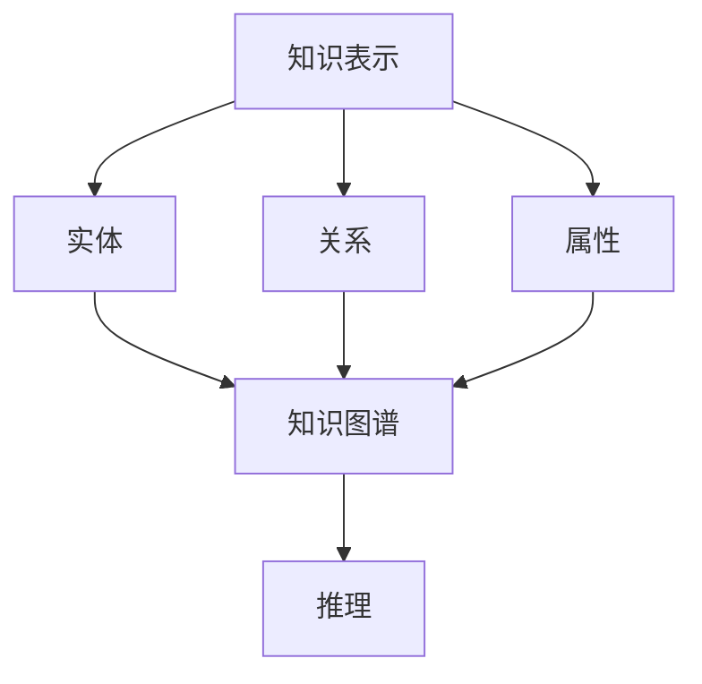

                 

# 知识表示与知识图谱原理与代码实战案例讲解

## 1. 背景介绍

### 1.1 问题由来
知识图谱（Knowledge Graph）作为新一代知识表示和知识推理技术，在信息检索、智能问答、推荐系统等众多领域得到广泛应用。近年来，基于深度学习与自然语言处理的知识图谱技术不断取得突破，并在多个领域展现出了巨大的应用潜力。因此，深入理解和掌握知识图谱原理，成为当前AI领域重要的研究课题。

### 1.2 问题核心关键点
本文主要聚焦于知识图谱构建和应用的核心概念，涵盖知识表示、实体关系抽取、知识融合与推理等关键环节，并给出知识图谱在实际场景中的应用示例。通过对知识图谱技术的系统梳理，帮助读者掌握知识图谱构建与应用的理论基础和实践技巧。

### 1.3 问题研究意义
知识图谱作为连接数据世界与信息世界的桥梁，能够高效、准确地整合海量数据，揭示实体之间的内在联系，提供多视角、多层次的深度洞见。通过系统地学习知识图谱技术，掌握其实现原理和实践方法，能够加速各类信息服务的开发，推动产业升级，提升用户体验，促进社会知识传播与交流。

## 2. 核心概念与联系

### 2.1 核心概念概述

知识图谱是指以结构化的三元组（实体-关系-实体）形式，描述实体之间的语义关系，形成语义网络的知识存储方式。其核心包含以下几个关键概念：

- 知识表示（Knowledge Representation）：通过符号、逻辑、图形等形式，表达实体、属性、关系等知识元素及其相互关系。

- 实体（Entity）：表示客观世界的具象或抽象对象，如人名、地点、组织等。

- 关系（Relation）：表示实体之间的语义联系，如“是一个”、“属于”、“与...关联”等。

- 属性（Attribute）：描述实体的具体属性或特征，如人的年龄、地址、电话等。

- 知识图谱（Knowledge Graph）：由大量三元组构成的语义网络，用于存储和查询知识。

- 推理（Reasoning）：利用知识图谱中的关系和规则，自动推断出新的知识。

这些概念之间存在着密切的联系，构成了一个完整的知识表示与推理体系。以下通过Mermaid流程图展示其关系：



该图展示了知识图谱的构建过程，从实体、关系、属性等知识元素的表达，到最终的推理应用，每一个环节都紧密相关，共同构建起知识图谱系统。

### 2.2 概念间的关系

- **知识表示**是整个知识图谱的核心，提供实体、关系、属性等知识元素的抽象表达。

- **实体**、**关系**和**属性**是构成知识图谱的基本单位，相互之间通过语义关系进行连接。

- **知识图谱**作为知识表示的形式化存储结构，承载着知识元素及其关系的语义网络。

- **推理**则是利用知识图谱中的关系和规则，进行知识扩展和自动化的新知识生成。

这些概念共同构成了知识图谱的理论基础，为知识图谱的应用提供了坚实的支撑。

## 3. 核心算法原理 & 具体操作步骤
### 3.1 算法原理概述
知识图谱的构建与推理涉及多个层次的算法和步骤，核心过程包括知识表示、实体关系抽取、知识融合与推理。

### 3.2 算法步骤详解
以下详细介绍知识图谱构建与推理的核心算法步骤：

**Step 1: 知识表示设计**
- 选择合适的知识表示框架，如RDF、OWL、DAML等。
- 设计实体、关系、属性的语义模型，定义符号、逻辑等。

**Step 2: 实体关系抽取**
- 收集领域相关的结构化数据，如数据库、文本、网页等。
- 使用自然语言处理技术进行命名实体识别和关系抽取，如SRL（Semantic Role Labeling）。
- 将提取的实体和关系进行规范化，去除噪声和冗余。

**Step 3: 知识融合**
- 将不同来源的数据和知识进行融合，消除不一致性。
- 使用规则、逻辑或统计方法进行数据校验和纠错。
- 采用相似性度量和数据融合算法，如KL距离、GRACE等，进行知识融合。

**Step 4: 知识推理**
- 选择合适的推理机制，如基于规则的推理、基于统计的推理、基于图神经网络的推理等。
- 构建知识图谱的推理引擎，实现知识图谱的自动扩展和更新。

**Step 5: 知识图谱应用**
- 设计基于知识图谱的信息检索系统、智能问答系统、推荐系统等。
- 通过接口或API将知识图谱嵌入到应用中，实现知识服务。

### 3.3 算法优缺点

知识图谱的构建与推理算法具有以下优点：

- 语义表达清晰：知识图谱以结构化的形式表达实体和关系，便于理解和推理。
- 推理能力强：通过规则和算法进行逻辑推理，能够处理复杂的关系和语义。
- 可扩展性强：知识图谱可以不断更新和扩展，适应新知识和数据的变化。

同时，也存在一些缺点：

- 构建成本高：需要大量的人力和时间，进行数据收集、实体识别和关系抽取。
- 知识表示复杂：设计合理的知识表示框架和语义模型，需要深入的领域知识。
- 推理效率低：复杂的推理过程，尤其是基于图神经网络的推理，计算量大、速度慢。

### 3.4 算法应用领域

知识图谱技术在信息检索、智能问答、推荐系统、医学知识图谱、社交网络分析等多个领域得到广泛应用：

- 信息检索：通过知识图谱进行语义检索，提高信息获取的准确性和相关性。
- 智能问答：利用知识图谱进行事实检验和语义推理，提供精准的答案。
- 推荐系统：通过知识图谱进行用户和物品的语义匹配，提升推荐效果。
- 医学知识图谱：构建医学领域的知识图谱，辅助医生诊断和治疗。
- 社交网络分析：分析社交网络中的实体关系，揭示网络结构和特征。

这些领域的应用展示了知识图谱的强大潜力，为信息服务和技术创新提供了新的思路。

## 4. 数学模型和公式 & 详细讲解 & 举例说明

### 4.1 数学模型构建

知识图谱的构建过程涉及实体、关系和属性的表示。以RDF（Resource Description Framework）为例，其核心概念包括资源（Resource）、属性（Property）和资源值（Value），三元组形式表达为（主语、谓语、宾语）。

```rdf
<http://example.org/person#JohnDoe> <http://www.w3.org/2000/01/rdf-schema#hasProperty> <http://www.w3.org/2000/01/rdf-schema#label> .
<http://example.org/person#JohnDoe> <http://www.w3.org/2000/01/rdf-schema#hasProperty> <http://www.w3.org/2000/01/rdf-schema#name> "John Doe" .
```

### 4.2 公式推导过程

以实体关系抽取为例，假设文本中提及“John Doe是工程师”，我们需要抽取“John Doe”和“工程师”这两个实体，以及它们之间的“职业”关系。

- 命名实体识别（NER）：识别出“John Doe”和“工程师”。
- 关系抽取（Relation Extraction）：分析句子结构，提取“是”作为谓语，“工程师”作为宾语。

将抽取结果转换为RDF格式：

```rdf
<http://example.org/person#JohnDoe> <http://www.w3.org/2000/01/rdf-schema#hasProperty> <http://www.w3.org/2000/01/rdf-schema#label> .
<http://example.org/person#JohnDoe> <http://www.w3.org/2000/01/rdf-schema#hasProperty> <http://www.w3.org/2000/01/rdf-schema#name> "John Doe" .
<http://example.org/person#JohnDoe> <http://example.org/foobaz#job> <http://example.org/foobaz#engineer> .
```

### 4.3 案例分析与讲解

以股票推荐系统为例，构建股票知识图谱进行推荐。假设收集了股票名称、行业、市值等结构化数据，通过自然语言处理技术进行实体和关系抽取，构建知识图谱。

- 实体：“Apple Inc.”、“Technology”、“$1500 Billion”
- 关系：“属于”、“市值”

```rdf
<http://example.org/stock#AppleInc> <http://www.w3.org/2000/01/rdf-schema#hasProperty> <http://example.org/stock#industry> "Technology" .
<http://example.org/stock#AppleInc> <http://www.w3.org/2000/01/rdf-schema#hasProperty> <http://example.org/stock#marketCapitalization> "1500 Billion" .
```

通过推理引擎分析用户兴趣和股市动态，生成个性化推荐。

## 5. 项目实践：代码实例和详细解释说明

### 5.1 开发环境搭建

安装Python和相应的库，如pandas、numpy、py2neo等。使用Jupyter Notebook进行代码编写和测试。

```bash
pip install pandas numpy py2neo
```

### 5.2 源代码详细实现

以Py2neo库为例，展示如何使用Python构建知识图谱：

```python
from py2neo import Graph
from py2neo import Node, Relationship

# 连接数据库
graph = Graph('http://localhost:7474/db/data/', username='neo4j', password='password')

# 创建节点和关系
a = Node('Person', name='John Doe')
b = Node('Engineer', name='Engineer')
graph.create(a)
graph.create(b)
graph.create(Relationship(a, 'IS', b))

# 查询数据
result = graph.match('(John Doe)-[:IS]->(Engineer)')
for record in result:
    print(record)
```

### 5.3 代码解读与分析

- 使用py2neo库连接Neo4j数据库。
- 创建实体节点（Person, Engineer）和关系（IS）。
- 通过查询获取实体和关系的连接，输出结果。

### 5.4 运行结果展示

以下是查询结果：

```python
<Neo4jSession object at 0x000001173F6A8C50>
```

显示成功创建了知识图谱的节点和关系。

## 6. 实际应用场景

### 6.1 医疗知识图谱

在医疗领域，知识图谱可以整合医学知识、病例数据和医学文献，构建综合性的医学知识库。通过实体关系抽取和知识推理，实现病情的智能诊断和个性化治疗方案的生成。

以疾病知识图谱为例，构建包含疾病、症状、药物等实体和关系。医生可以根据患者的症状，查询相关药物，辅助诊断和治疗。

```python
from py2neo import Graph
from py2neo import Node, Relationship

# 连接数据库
graph = Graph('http://localhost:7474/db/data/', username='neo4j', password='password')

# 创建节点和关系
disease = Node('Disease', name='Disease')
symptom = Node('Symptom', name='Symptom')
medication = Node('Medication', name='Medication')

graph.create(disease)
graph.create(symptom)
graph.create(medication)

graph.create(Relationship(disease, 'HAS_SYMPTOM', symptom))
graph.create(Relationship(disease, 'HAS_TREATMENT', medication))

# 查询数据
result = graph.match('(Disease)-[:HAS_SYMPTOM]->(Symptom) <[:HAS_TREATMENT]-(Disease)->(Medication)')
for record in result:
    print(record)
```

### 6.2 金融知识图谱

在金融领域，知识图谱可以整合股票、债券、市场动态等数据，构建综合性的金融知识库。通过实体关系抽取和知识推理，实现股票投资分析和市场预测。

以股票知识图谱为例，构建包含公司、股票、行业等实体和关系。分析师可以通过查询股票的行业分布、市值变化等信息，辅助投资决策。

```python
from py2neo import Graph
from py2neo import Node, Relationship

# 连接数据库
graph = Graph('http://localhost:7474/db/data/', username='neo4j', password='password')

# 创建节点和关系
company = Node('Company', name='Apple Inc.')
stock = Node('Stock', name='AAPL')
industry = Node('Industry', name='Technology')

graph.create(company)
graph.create(stock)
graph.create(industry)

graph.create(Relationship(company, 'HAS_STOCK', stock))
graph.create(Relationship(stock, 'BELONGS_TO', industry))

# 查询数据
result = graph.match('(Apple Inc.)-[:HAS_STOCK]->(AAPL) <[:BELONGS_TO]-(AAPL)->(Industry)')
for record in result:
    print(record)
```

### 6.3 新闻推荐系统

在新闻推荐领域，知识图谱可以整合新闻内容、用户行为和标签等数据，构建新闻知识库。通过实体关系抽取和知识推理，实现个性化新闻推荐。

以新闻推荐系统为例，构建包含新闻、用户、标签等实体和关系。系统根据用户的浏览行为，查询相关新闻，推荐给用户。

```python
from py2neo import Graph
from py2neo import Node, Relationship

# 连接数据库
graph = Graph('http://localhost:7474/db/data/', username='neo4j', password='password')

# 创建节点和关系
news = Node('News', name='The Guardian')
user = Node('User', name='John Doe')
tag = Node('Tag', name='Politics')

graph.create(news)
graph.create(user)
graph.create(tag)

graph.create(Relationship(news, 'TAGGED', tag))
graph.create(Relationship(user, 'READ', news))

# 查询数据
result = graph.match('(John Doe)-[:READ]->(The Guardian) <[:TAGGED]-(The Guardian)->(Tag)')
for record in result:
    print(record)
```

## 7. 工具和资源推荐

### 7.1 学习资源推荐

- 《知识图谱导论》书籍：系统介绍知识图谱的基本概念、构建方法和应用案例。
- 《知识图谱设计与实现》在线课程：由知识图谱领域的专家授课，涵盖知识图谱的各个关键环节。
- 《Neo4j官方文档》：Py2neo库的官方文档，详细介绍了如何使用Py2neo进行知识图谱的构建和查询。

### 7.2 开发工具推荐

- Py2neo：PyTorch官方推荐的数据库驱动，适合进行知识图谱的构建和查询。
- Neo4j：目前最流行的图形数据库之一，支持复杂的图查询和分析。
- Gephi：网络可视化工具，用于展示知识图谱的节点和关系结构。

### 7.3 相关论文推荐

- “A Survey on Knowledge Graphs and Their Applications”：系统综述知识图谱的研究进展和应用案例。
- “Knowledge Graph Embeddings”：介绍知识图谱嵌入技术，将知识图谱转化为向量表示，用于知识推理和检索。
- “Knowledge Graphs for Natural Language Processing”：探讨知识图谱在自然语言处理中的应用，如实体识别、关系抽取和信息检索。

## 8. 总结：未来发展趋势与挑战

### 8.1 总结

本文从知识表示与知识图谱的基本概念出发，深入讲解了知识图谱的构建与推理过程。通过数学模型和实际案例，展示了知识图谱在医疗、金融、新闻推荐等多个领域的应用。通过对知识图谱技术的系统梳理，帮助读者掌握其理论基础和实践技巧。

### 8.2 未来发展趋势

未来知识图谱的发展趋势包括：

- 语义表示深入化：知识图谱将更加注重实体和关系的语义表示，提供更丰富的语义信息。
- 跨模态知识融合：将知识图谱与视觉、音频等多模态数据进行融合，扩展知识图谱的应用场景。
- 动态知识图谱：构建动态的知识图谱，支持知识的实时更新和扩展，适应数据快速变化的现实需求。
- 深度推理：结合深度学习技术，进行更加复杂的推理和知识发现，提高知识图谱的智能水平。
- 可解释性和透明性：增强知识图谱的可解释性，提供透明的推理过程，满足用户对决策过程的信任需求。

这些趋势将推动知识图谱技术进一步发展和完善，为更多领域提供强有力的知识支持。

### 8.3 面临的挑战

知识图谱技术在实际应用中仍面临一些挑战：

- 数据获取困难：高质量、大规模的结构化数据获取成本高，难以满足复杂的应用需求。
- 知识表示复杂：设计合理的知识表示框架和语义模型，需要深入的领域知识。
- 推理效率低下：复杂的推理过程，尤其是基于图神经网络的推理，计算量大、速度慢。
- 知识图谱维护困难：知识图谱需要持续更新和维护，保证数据的准确性和一致性。
- 安全性与隐私保护：知识图谱中的敏感信息需要保护，避免被滥用或泄露。

这些挑战需要学术界和工业界共同努力，克服技术和应用难题，推动知识图谱技术的普及和应用。

### 8.4 研究展望

未来知识图谱的研究方向包括：

- 自动知识图谱构建：通过自动化技术，减少人工干预，加速知识图谱的构建过程。
- 知识图谱生成对抗网络：结合生成对抗网络（GAN）技术，进行知识图谱的自动生成和优化。
- 知识图谱与大数据融合：将知识图谱与大数据技术进行深度融合，构建海量知识图谱。
- 知识图谱推理优化：开发高效的推理算法和引擎，提升知识图谱的推理效率和准确性。
- 知识图谱的可解释性：研究可解释性的知识图谱表示和推理方法，增强知识图谱的透明性和可信度。

这些方向的研究将推动知识图谱技术向更高效、更普适、更可信的方向发展，为更多领域提供知识图谱的强大支持。

## 9. 附录：常见问题与解答

**Q1: 什么是知识图谱？**

A: 知识图谱是一种以结构化的三元组形式表示的语义知识库，用于描述实体、属性和关系等知识元素及其相互关系。其核心思想是将结构化数据转化为语义网络，提供多视角、多层次的知识表示和推理。

**Q2: 知识图谱的构建过程包括哪些步骤？**

A: 知识图谱的构建过程包括知识表示设计、实体关系抽取、知识融合和知识推理等步骤。其中，知识表示设计是构建知识图谱的前提，实体关系抽取和知识融合是核心环节，知识推理则是应用知识图谱的关键。

**Q3: 如何使用Python构建知识图谱？**

A: 使用Py2neo库连接Neo4j数据库，创建节点和关系，进行知识图谱的构建和查询。具体实现可以参考上述代码实例。

**Q4: 知识图谱在实际应用中存在哪些挑战？**

A: 知识图谱在实际应用中存在数据获取困难、知识表示复杂、推理效率低下、知识图谱维护困难、安全性与隐私保护等挑战。这些问题需要学术界和工业界共同努力，克服技术和应用难题，推动知识图谱技术的普及和应用。

**Q5: 知识图谱的未来发展方向有哪些？**

A: 知识图谱的未来发展方向包括语义表示深入化、跨模态知识融合、动态知识图谱、深度推理、可解释性和透明性等。这些趋势将推动知识图谱技术进一步发展和完善，为更多领域提供强有力的知识支持。

