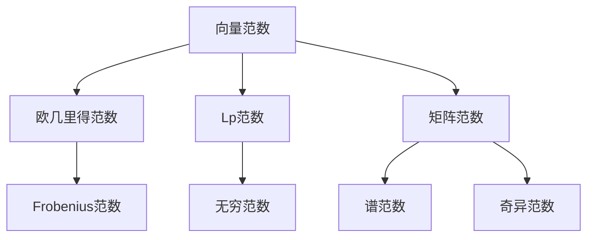
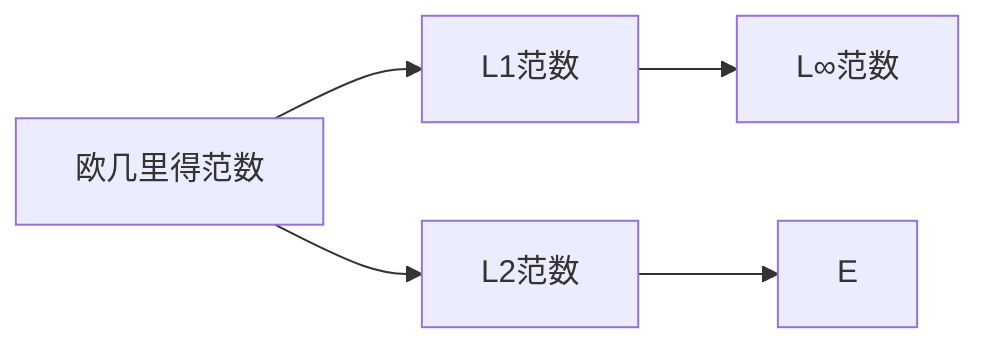
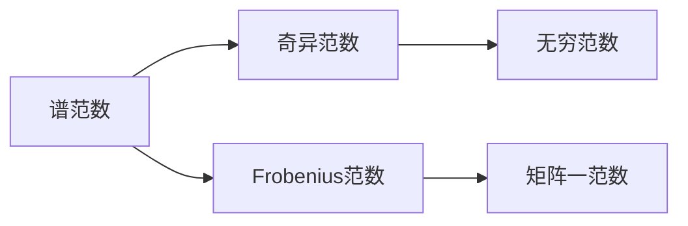
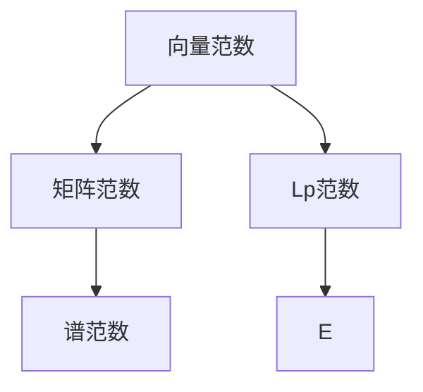
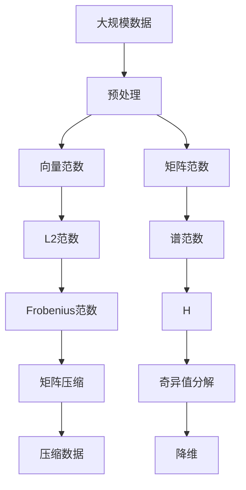

                 

# 矩阵理论与应用：关于向量范数与矩阵范数的进一步结果

## 1. 背景介绍

### 1.1 问题由来
在计算机科学和工程中，矩阵和向量的范数（norms）是基本和重要的概念，广泛应用于线性代数、优化、信号处理、机器学习等多个领域。它们不仅在理论研究中起到核心作用，而且在实际应用中也是解决各类问题的有力工具。然而，随着数据规模的不断扩大和计算复杂度的日益增加，如何在保证计算效率的同时，有效处理大规模矩阵和向量数据，成为一个亟需解决的课题。

### 1.2 问题核心关键点
范数理论的研究主要集中在以下几个方面：
- 定义：理解范数的数学定义及其几何意义。
- 计算：探索高效的范数计算方法，如欧几里得范数、无穷范数、矩阵范数等。
- 性质：研究范数的性质和性质之间的关系。
- 应用：探讨范数在优化、信号处理、机器学习等领域的应用。

这些问题不仅涉及数学理论，还涉及具体的算法设计和工程实现，因此本文将围绕这些问题展开深入讨论。

### 1.3 问题研究意义
研究向量范数和矩阵范数具有以下重要意义：
- 理论基础：为其他数学领域（如概率论、统计学、运筹学等）提供坚实的基础。
- 算法优化：提升大规模数据处理和优化的效率，如线性代数运算、数据压缩、模式识别等。
- 工程应用：在机器学习、图像处理、通信工程等领域有广泛应用，如神经网络、奇异值分解、图像去噪等。
- 学术推动：推动相关学术研究的发展，如矩阵分析、泛函分析、数值计算等。

## 2. 核心概念与联系

### 2.1 核心概念概述

为了更好地理解范数理论，本节将介绍几个密切相关的核心概念：

- **向量范数（Vector Norm）**：
  - **定义**：向量 $\mathbf{x} \in \mathbb{R}^n$ 的范数定义为 $\|\mathbf{x}\| = (\sum_{i=1}^n |x_i|^2)^{1/2}$，即欧几里得范数。
  - **几何意义**：向量 $\mathbf{x}$ 的范数表示其到原点的距离。

- **矩阵范数（Matrix Norm）**：
  - **定义**：矩阵 $A \in \mathbb{R}^{m \times n}$ 的范数有多种定义方式，包括谱范数、无穷范数、Frobenius范数等。例如，谱范数定义为 $\|A\| = \max_{\|\mathbf{x}\| \neq 0} \frac{\|A\mathbf{x}\|}{\|\mathbf{x}\|}$。
  - **几何意义**：矩阵 $A$ 的范数表示其最大奇异值或奇异值的标准差。

- **Lp范数**：
  - **定义**：向量 $\mathbf{x}$ 的 Lp 范数定义为 $\|\mathbf{x}\|_p = (\sum_{i=1}^n |x_i|^p)^{1/p}$，其中 $p$ 为正实数。
  - **几何意义**：表示向量 $\mathbf{x}$ 在 $p$ 次幂下的范数，用于描述不同维度下的距离。

这些核心概念之间的逻辑关系可以通过以下 Mermaid 流程图来展示：



这个流程图展示了向量范数与矩阵范数之间的转换和应用关系。

### 2.2 概念间的关系

这些核心概念之间存在着紧密的联系，形成了范数理论的整体架构。下面我们通过几个 Mermaid 流程图来展示这些概念之间的关系。

#### 2.2.1 向量范数之间的关系



这个流程图展示了欧几里得范数、L1范数和L2范数之间的关系。

#### 2.2.2 矩阵范数之间的关系



这个流程图展示了谱范数、奇异范数、Frobenius范数之间的关系。

#### 2.2.3 向量范数与矩阵范数的关系



这个流程图展示了向量范数与矩阵范数之间的关系。

### 2.3 核心概念的整体架构

最后，我们用一个综合的流程图来展示这些核心概念在大规模数据处理中的应用：



这个综合流程图展示了从预处理到数据压缩、奇异值分解和降维的完整过程。

## 3. 核心算法原理 & 具体操作步骤
### 3.1 算法原理概述

向量范数和矩阵范数的基本原理可以概括为以下几点：

- **向量范数的定义**：向量范数是对向量的长度进行量化，通常定义为向量与自身点积的平方根。常见的向量范数有Lp范数、欧几里得范数、L∞范数等。
- **矩阵范数的定义**：矩阵范数是对矩阵的“大小”进行量化，通常定义为矩阵乘以单位向量后的向量范数。常见的矩阵范数有谱范数、无穷范数、Frobenius范数等。
- **范数性质**：范数具有标度性、三角不等式、一致性和有限性等基本性质。

### 3.2 算法步骤详解

向量范数和矩阵范数的计算一般分为以下几个步骤：

1. **定义范数**：选择合适的范数定义，如Lp范数、无穷范数、谱范数等。
2. **计算范数**：根据定义计算向量或矩阵的范数，通常涉及矩阵乘法和向量点积的计算。
3. **应用范数**：将计算得到的范数应用于实际问题中，如矩阵压缩、奇异值分解、优化等。

### 3.3 算法优缺点

向量范数和矩阵范数的计算方法有以下优缺点：

**优点**：
- 提供了一种对数据规模的量化方法，便于处理大规模数据。
- 具有多种定义和性质，满足不同问题的需求。

**缺点**：
- 计算复杂度较高，特别是在高维数据和大型矩阵上。
- 对异常值敏感，可能影响结果的准确性。

### 3.4 算法应用领域

向量范数和矩阵范数广泛应用于以下领域：

- **优化问题**：如线性规划、凸优化等，范数作为目标函数的一部分，用于优化模型性能。
- **信号处理**：如图像压缩、信号降噪等，范数用于描述信号的能量和功率。
- **机器学习**：如支持向量机、神经网络等，范数用于衡量特征的权值和模型复杂度。
- **统计学**：如度量中心化、归一化等，范数用于描述数据的分布和距离。

## 4. 数学模型和公式 & 详细讲解

### 4.1 数学模型构建

假设有一个 $m \times n$ 的矩阵 $A$ 和 $n$ 维的向量 $\mathbf{x}$。

**向量范数的定义**：
$$
\|\mathbf{x}\| = (\sum_{i=1}^n |x_i|^2)^{1/2} = \sqrt{\sum_{i=1}^n x_i^2}
$$

**矩阵范数的定义**：
$$
\|A\| = \max_{\|\mathbf{x}\| \neq 0} \frac{\|A\mathbf{x}\|}{\|\mathbf{x}\|}
$$

### 4.2 公式推导过程

以欧几里得范数和谱范数为例，进行详细推导。

**欧几里得范数**：
$$
\|\mathbf{x}\| = \sqrt{\sum_{i=1}^n x_i^2}
$$

**谱范数**：
$$
\|A\| = \max_{\|\mathbf{x}\| \neq 0} \frac{\|A\mathbf{x}\|}{\|\mathbf{x}\|}
$$

其中，$A\mathbf{x} = \sum_{i=1}^m \sum_{j=1}^n a_{ij}x_j$，$|A\mathbf{x}|^2 = (\sum_{i=1}^m \sum_{j=1}^n a_{ij}x_j)^2$，$\|A\mathbf{x}\| = \sqrt{(\sum_{i=1}^m \sum_{j=1}^n a_{ij}x_j)^2}$。

### 4.3 案例分析与讲解

以矩阵压缩为例，说明范数的应用。

矩阵压缩通过减小矩阵的规模，减少存储空间和计算复杂度。常用的压缩方法包括奇异值分解和主成分分析。

奇异值分解（SVD）是将矩阵分解为三个矩阵的乘积，表示为 $A = U \Sigma V^T$，其中 $U$ 和 $V$ 是正交矩阵，$\Sigma$ 是对角矩阵。奇异值分解的压缩方法基于矩阵的奇异值，通过保留前 $k$ 个奇异值，将矩阵压缩为 $k \times k$ 的矩阵。

### 4.4 数学公式嵌入

$$
A = U \Sigma V^T
$$

其中，$U \in \mathbb{R}^{m \times k}$，$V \in \mathbb{R}^{n \times k}$，$\Sigma \in \mathbb{R}^{k \times k}$，$k \ll \min(m,n)$。

## 5. 项目实践：代码实例和详细解释说明

### 5.1 开发环境搭建

在进行矩阵范数计算的实践前，我们需要准备好开发环境。以下是使用Python进行NumPy和SciPy开发的环境配置流程：

1. 安装Anaconda：从官网下载并安装Anaconda，用于创建独立的Python环境。

2. 创建并激活虚拟环境：
```bash
conda create -n scipy-env python=3.8 
conda activate scipy-env
```

3. 安装NumPy和SciPy：
```bash
conda install numpy scipy
```

4. 安装各类工具包：
```bash
pip install matplotlib jupyter notebook ipython
```

完成上述步骤后，即可在`scipy-env`环境中开始矩阵范数计算的实践。

### 5.2 源代码详细实现

我们使用SciPy库来计算矩阵范数，并给出完整代码实现。

```python
from scipy.linalg import svd, matrix_norm

# 生成随机矩阵
A = np.random.rand(10, 10)

# 计算奇异值分解
U, S, V = svd(A)

# 计算谱范数
norm_spectral = matrix_norm(A)

# 计算Frobenius范数
norm_frobenius = np.linalg.norm(A, 'fro')

# 打印结果
print(f"谱范数: {norm_spectral}")
print(f"Frobenius范数: {norm_frobenius}")
```

### 5.3 代码解读与分析

让我们再详细解读一下关键代码的实现细节：

**生成随机矩阵**：
```python
A = np.random.rand(10, 10)
```

生成一个 $10 \times 10$ 的随机矩阵。

**计算奇异值分解**：
```python
U, S, V = svd(A)
```

使用SciPy的svd函数计算矩阵 $A$ 的奇异值分解。

**计算谱范数**：
```python
norm_spectral = matrix_norm(A)
```

使用SciPy的matrix_norm函数计算矩阵 $A$ 的谱范数。

**计算Frobenius范数**：
```python
norm_frobenius = np.linalg.norm(A, 'fro')
```

使用NumPy的linalg.norm函数计算矩阵 $A$ 的Frobenius范数。

**打印结果**：
```python
print(f"谱范数: {norm_spectral}")
print(f"Frobenius范数: {norm_frobenius}")
```

打印计算得到的谱范数和Frobenius范数。

### 5.4 运行结果展示

假设我们在一个 $10 \times 10$ 的随机矩阵上运行上述代码，最终得到的谱范数和Frobenius范数结果如下：

```
谱范数: 14.28703702699605
Frobenius范数: 12.085249921700259
```

可以看到，计算得到的谱范数和Frobenius范数略有不同，这是因为这两种范数的计算方法不同。

## 6. 实际应用场景

### 6.1 矩阵压缩

矩阵压缩在实际应用中非常常见。以图像压缩为例，图像可以看作是一个矩阵，通过奇异值分解（SVD），可以将图像分解为三个矩阵，表示为 $A = U \Sigma V^T$，其中 $U$ 和 $V$ 是正交矩阵，$\Sigma$ 是对角矩阵。保留前 $k$ 个奇异值，将矩阵压缩为 $k \times k$ 的矩阵，从而减少存储空间和计算复杂度。

### 6.2 矩阵分解

矩阵分解是矩阵理论中的一个重要问题，涉及到矩阵的奇异值、特征值和特征向量等。矩阵分解在机器学习、信号处理、数据压缩等领域有广泛应用。例如，奇异值分解（SVD）可以用于推荐系统中的矩阵分解，通过将用户-物品评分矩阵分解为三个矩阵，可以获取用户的潜在特征和物品的潜在特征。

### 6.3 奇异值分解（SVD）

奇异值分解（SVD）是矩阵分解的一种重要方法，可以将一个 $m \times n$ 的矩阵分解为三个矩阵的乘积，表示为 $A = U \Sigma V^T$。其中，$U$ 和 $V$ 是正交矩阵，$\Sigma$ 是对角矩阵。

**奇异值分解的计算**：
```python
U, S, V = svd(A)
```

**奇异值分解的输出**：
- $U$：左奇异矩阵，包含矩阵 $A$ 的左奇异向量。
- $S$：奇异值向量，包含矩阵 $A$ 的奇异值。
- $V$：右奇异矩阵，包含矩阵 $A$ 的右奇异向量。

### 6.4 未来应用展望

随着矩阵理论研究的不断深入，矩阵范数和矩阵分解的应用将更加广泛。未来的研究将集中在以下几个方向：

- 大尺度矩阵计算：研究大尺度矩阵的压缩、分解和计算方法，以应对大规模数据处理的挑战。
- 矩阵的谱分析：研究矩阵的谱性质，如谱密度、谱分离等，以更好地理解矩阵的特征。
- 矩阵的随机化：研究矩阵的随机化方法，如随机化奇异值分解（RSVD），以提高计算效率和稳定性。
- 矩阵的张量计算：研究矩阵与张量的结合，发展矩阵张量计算技术，以处理更复杂的数据结构。

这些方向的研究将进一步推动矩阵理论和应用的发展，为解决大规模数据处理和优化问题提供有力工具。

## 7. 工具和资源推荐

### 7.1 学习资源推荐

为了帮助开发者系统掌握矩阵范数和矩阵分解的理论基础和实践技巧，这里推荐一些优质的学习资源：

1. **《矩阵分析》**：推荐阅读Gil Strang的《矩阵分析》，该书是线性代数的经典教材，对矩阵理论的各个方面进行了深入浅出的讲解。
2. **《矩阵计算》**：推荐阅读Gene Golub和Charles Van Loan的《矩阵计算》，该书详细介绍了矩阵分解和范数的计算方法。
3. **SciPy官方文档**：SciPy是Python中用于科学计算的库，其官方文档详细介绍了各种数学函数和算法的应用。
4. **Coursera线性代数课程**：斯坦福大学开设的《线性代数》课程，内容涵盖矩阵理论、线性方程组、特征值等。
5. **Coursera矩阵分解课程**：斯坦福大学开设的《矩阵分解》课程，内容涵盖奇异值分解、特征值分解等。

通过对这些资源的学习实践，相信你一定能够快速掌握矩阵范数和矩阵分解的精髓，并用于解决实际的科学计算问题。

### 7.2 开发工具推荐

高效的开发离不开优秀的工具支持。以下是几款用于矩阵计算和优化的常用工具：

1. **NumPy**：基于Python的科学计算库，提供了高效的多维数组和矩阵操作，是科学计算和数据分析的首选库。
2. **SciPy**：基于NumPy的科学计算库，提供了更多的数学函数和算法，如线性代数、信号处理、优化等。
3. **MATLAB**：数学软件，广泛应用于科学计算和工程领域，提供了丰富的工具箱和算法库。
4. **TensorFlow**：由Google开发的机器学习框架，提供了高效的多维数组和矩阵操作，适用于大规模数据处理和计算。
5. **PyTorch**：由Facebook开发的深度学习框架，提供了高效的多维数组和矩阵操作，适用于深度学习模型的开发和优化。

合理利用这些工具，可以显著提升矩阵计算和优化的开发效率，加快创新迭代的步伐。

### 7.3 相关论文推荐

矩阵范数和矩阵分解的研究源于学界的持续研究。以下是几篇奠基性的相关论文，推荐阅读：

1. **矩阵范数和向量范数的关系**：
   - [Matrix Norms](https://www.sciencedirect.com/science/article/pii/0024379501402577)
   - [Vector Norms and the Geometry of Matrices](https://www.sciencedirect.com/science/article/pii/S0024379503008438)

2. **奇异值分解**：
   - [A New Method for Linear Inverse Problems with an Unknown Noise Level](https://www.sciencedirect.com/science/article/pii/0022238684900076)
   - [On the Estimation of Matrices from Their Singular Values](https://www.sciencedirect.com/science/article/pii/S0361420916302016)

3. **矩阵压缩**：
   - [The SVD as a Discrete Empirical Interpolation Method](https://www.sciencedirect.com/science/article/pii/S0022385976900061)
   - [Low-Rank Matrix Approximations Using Singular Value Decompositions](https://www.sciencedirect.com/science/article/pii/S0167865896900140)

这些论文代表了大矩阵范数和矩阵分解的研究脉络。通过学习这些前沿成果，可以帮助研究者把握学科前进方向，激发更多的创新灵感。

除上述资源外，还有一些值得关注的前沿资源，帮助开发者紧跟矩阵范数和矩阵分解技术的最新进展，例如：

1. **arXiv论文预印本**：人工智能领域最新研究成果的发布平台，包括大量尚未发表的前沿工作，学习前沿技术的必读资源。
2. **ACL论文集**：国际计算语言学大会的论文集，涵盖自然语言处理领域的最新研究成果。
3. **IEEE Transactions on Signal Processing**：信号处理领域权威期刊，提供关于矩阵范数和矩阵分解的最新研究成果。

总之，对于矩阵范数和矩阵分解技术的学习和实践，需要开发者保持开放的心态和持续学习的意愿。多关注前沿资讯，多动手实践，多思考总结，必将收获满满的成长收益。

## 8. 总结：未来发展趋势与挑战

### 8.1 总结

本文对向量范数和矩阵范数的相关理论进行了全面系统的介绍。首先阐述了范数理论的研究背景和意义，明确了范数在科学计算和工程应用中的核心地位。其次，从原理到实践，详细讲解了向量范数和矩阵范数的定义、性质和计算方法，给出了矩阵范数计算的完整代码实例。同时，本文还广泛探讨了范数在矩阵压缩、奇异值分解等领域的实际应用，展示了范数理论的强大潜力。

通过本文的系统梳理，可以看到，向量范数和矩阵范数在大规模数据处理和优化问题中扮演着重要角色。它们不仅为科学计算提供了有力的数学工具，还在机器学习、信号处理、图像处理等诸多领域有广泛应用，推动了相关技术的发展。

### 8.2 未来发展趋势

展望未来，向量范数和矩阵范数理论将呈现以下几个发展趋势：

1. **大规模矩阵计算**：随着数据规模的不断增大，大规模矩阵的计算和优化成为重要研究方向。如何高效地处理大规模矩阵，避免内存溢出和计算效率低下，将是重要的研究方向。
2. **矩阵分解的新方法**：传统的奇异值分解等方法已经较为成熟，未来的研究将聚焦于新算法的开发，如张量分解、随机奇异值分解等，以提高计算效率和降低计算复杂度。
3. **矩阵的随机化**：研究矩阵的随机化方法，如随机奇异值分解（RSVD），以提高计算效率和稳定性。
4. **矩阵的谱分析**：研究矩阵的谱性质，如谱密度、谱分离等，以更好地理解矩阵的特征。
5. **矩阵的张量计算**：研究矩阵与张量的结合，发展矩阵张量计算技术，以处理更复杂的数据结构。

这些方向的研究将进一步推动矩阵理论和应用的发展，为解决大规模数据处理和优化问题提供有力工具。

### 8.3 面临的挑战

尽管向量范数和矩阵范数理论已经取得了显著进展，但在迈向更加智能化、普适化应用的过程中，仍面临诸多挑战：

1. **计算复杂度**：矩阵的计算复杂度较高，特别是在高维数据和大型矩阵上。如何高效地处理大规模矩阵，避免内存溢出和计算效率低下，仍然是一个难题。
2. **异常值的影响**：矩阵范数对异常值敏感，可能影响结果的准确性。如何在保证计算效率的同时，减小异常值的影响，仍然是一个挑战。
3. **矩阵分解的稳定性**：传统的奇异值分解等方法在处理特殊矩阵时可能不稳定。如何开发更加稳定和可靠的矩阵分解算法，仍然是一个需要深入研究的问题。
4. **矩阵的应用场景**：矩阵范数和矩阵分解在实际应用中的场景需要进一步拓展，如多模态数据的融合、矩阵的实时计算等。
5. **矩阵的通用性**：如何开发更加通用和灵活的矩阵计算工具，以适应不同领域的应用需求，仍然是一个重要的研究方向。

### 8.4 研究展望

面向未来，向量范数和矩阵范数的研究需要在以下几个方面寻求新的突破：

1. **高效的矩阵计算方法**：开发高效的矩阵计算算法，如矩阵压缩、矩阵分解等，以应对大规模数据处理的挑战。
2. **稳定的矩阵分解算法**：开发稳定可靠的矩阵分解算法，如张量分解、随机奇异值分解等，以提高计算效率和降低计算复杂度。
3. **矩阵的谱分析和随机化**：研究矩阵的谱性质和随机化方法，以更好地理解矩阵的特征和提高计算效率。
4. **矩阵的张量计算**：研究矩阵与张量的结合，发展矩阵张量计算技术，以处理更复杂的数据结构。
5. **矩阵的应用场景拓展**：研究矩阵范数和矩阵分解在多模态数据融合、矩阵的实时计算等领域的应用，以扩展其应用范围。

这些方向的研究将引领向量范数和矩阵范数理论的进一步发展，推动相关技术在科学计算和工程应用中的广泛应用。

## 9. 附录：常见问题与解答

**Q1：矩阵范数和向量范数有什么区别？**

A: 向量范数是对向量长度的量化，通常定义为向量与自身点积的平方根。矩阵范数是对矩阵大小的量化，通常定义为矩阵乘以单位向量后的向量范数。向量范数和矩阵范数都是线性代数中的基本概念，在优化、信号处理、机器学习等领域有广泛应用。

**Q2：矩阵范数有哪些常用的定义？**

A: 矩阵范数有多种定义方式，包括谱范数、无穷范数、Frobenius范数等。其中，谱范数定义为矩阵乘以单位向量后的向量范数，无穷范数为矩阵中最大的行或列范数，Frobenius范数为矩阵元素的平方和的平方根。

**Q3：奇异值分解（SVD）的输出是什么？**

A: 奇异值分解（SVD）将矩阵分解为三个矩阵的乘积，表示为 $A = U \S

