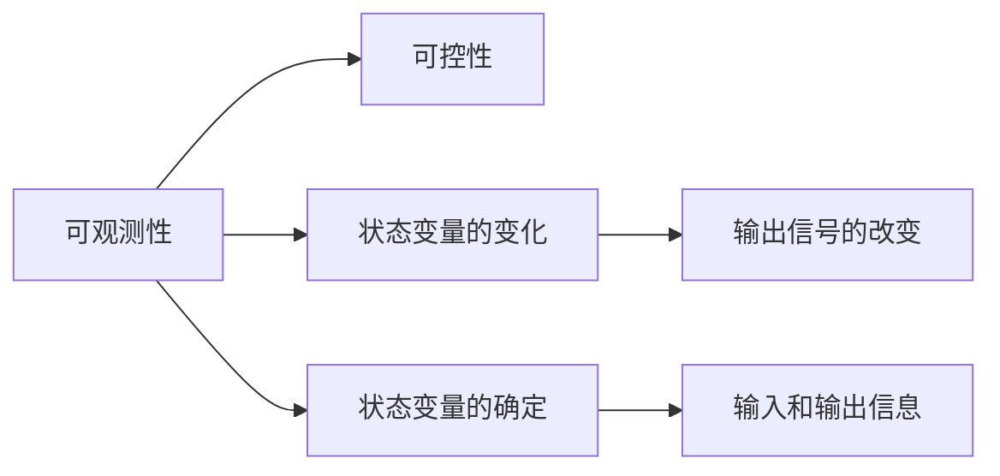

                 

# 矩阵理论与应用：可观测与可控的定常线性系统

## 1. 背景介绍

### 1.1 问题由来

矩阵是现代科学和技术中广泛应用的基础工具，几乎涉及各个科学领域和工程技术领域。从经济学中的线性回归分析到物理学中的力学和电磁学方程，从计算机科学中的图论到信息论，无一不涉及矩阵的计算和应用。然而，大多数人对矩阵的认识仅限于其作为向量空间中的工具，对于矩阵的可观测性与可控性概念并不清楚。本文将详细阐述矩阵的可观测性与可控性概念，并介绍相关理论及其应用。

### 1.2 问题核心关键点

矩阵的可观测性与可控性是线性系统分析与设计中非常重要的概念，它们对于理解和控制线性系统的动态行为具有重要作用。可观测性决定了系统状态的确定性，而可控性决定了系统状态的可改变性。然而，这两个概念往往容易混淆，且在实际应用中需要综合考虑。

## 2. 核心概念与联系

### 2.1 核心概念概述

**可观测性(Observability)**：一个线性系统是可观测的，当且仅当系统所有状态变量可以通过系统的输出信息得到完全确定。换句话说，系统的任何状态变量都可以由系统的输入和输出信息计算得到。

**可控性(Controllability)**：一个线性系统是可控的，当且仅当系统的任意状态变量都可以通过系统输入得到完全确定。也就是说，系统的任意状态变量都可以通过合适的控制信号进行改变。

这两个概念在理论上具有密切联系。例如，对于某个线性系统，如果它是可控的，则该系统的所有状态变量都可通过适当控制信号来改变，从而其状态也就可以通过输出信息被完整地观测到。相反，如果系统是可观测的，则系统中任意状态变量的变化都可以在输出信号中观察到，从而该系统的控制也就可以实现。因此，系统可观测性和可控性在很大程度上是相互依存的。

### 2.2 概念间的关系

可通过以下的Mermaid流程图展示可观测性与可控性之间的关系：



在这个流程图中，状态变量的变化(D)需要通过输出信号的改变(F)被观察到，而输出信号的改变则受到输入信息(E)的影响。因此，系统的可控性(C)是可观测性(F)的前提条件，同时，系统的可观测性(E)又是系统可控性(D)的基础。

## 3. 核心算法原理 & 具体操作步骤
### 3.1 算法原理概述

矩阵的可观测性与可控性分析通常基于李雅普诺夫的第二定理，即：

- 对于一个具有状态空间 $x\in\mathbb{R}^n$ 和控制空间 $u\in\mathbb{R}^m$ 的线性定常系统，其状态转移方程为 $\dot{x}=f(x,u)$，其中 $f:\mathbb{R}^n \times \mathbb{R}^m \rightarrow \mathbb{R}^n$ 为一个连续函数。
- 如果该系统在时间 $t$ 时刻的输出信号为 $y\in\mathbb{R}^p$，且其输出方程为 $y=h(x)$，其中 $h:\mathbb{R}^n \rightarrow \mathbb{R}^p$ 为一个连续函数，则系统的可观测性可以通过以下矩阵进行分析：
  - 可观测矩阵 $O=[o_{ij}]$，其中 $o_{ij}=\frac{\partial h}{\partial x_j}(x_i)$。
  - 如果 $\text{rank}(O)=n$，则该系统是完全可观测的。
- 同理，系统的可控性也可以通过以下矩阵进行分析：
  - 可控矩阵 $K=[k_{ij}]$，其中 $k_{ij}=\frac{\partial f}{\partial u_j}(x_i)$。
  - 如果 $\text{rank}(K)=nm$，则该系统是完全可控的。

### 3.2 算法步骤详解

**步骤1：选择合适的观察器和控制器的状态变量**

首先，需要选择适当的观察器和控制器的状态变量。这些变量通常依赖于系统的具体模型和应用场景。例如，在电磁场分析中，状态变量可能是电场和磁场；在控制系统设计中，状态变量可能是位置、速度和加速度等。

**步骤2：构造可观测矩阵和可控矩阵**

接下来，需要根据系统模型构造可观测矩阵和可控矩阵。对于给定的系统状态空间和控制空间，可以使用以下公式：
- 可观测矩阵 $O=[o_{ij}]$，其中 $o_{ij}=\frac{\partial h}{\partial x_j}(x_i)$。
- 可控矩阵 $K=[k_{ij}]$，其中 $k_{ij}=\frac{\partial f}{\partial u_j}(x_i)$。

**步骤3：分析矩阵的秩**

根据矩阵秩的定义，分析可观测矩阵和可控矩阵的秩。如果 $\text{rank}(O)=n$ 和 $\text{rank}(K)=nm$，则系统是完全可观测和可控的。

**步骤4：求解控制器和观察器的参数**

在确定了系统的可观测性和可控性之后，接下来需要求解控制器和观察器的参数。例如，对于线性定常系统的观测器设计，通常采用以下形式：
- 观测器方程为 $\dot{x}_{o}=f(x_{o},u)$，其中 $x_{o}$ 为观测器状态变量。
- 观测器的输出方程为 $y=h(x_{o})$。

通过求解观测器方程和输出方程，可以得到观测器的参数。同样，对于控制器的设计，也可以采用类似的方法。

### 3.3 算法优缺点

矩阵的可观测性与可控性分析方法具有以下优点：

- 方法简单，易于实现。
- 适用范围广，适用于各种线性定常系统。
- 理论成熟，有较为完善的基础理论支撑。

然而，这种方法也存在一些缺点：

- 对于复杂的非线性系统，无法直接应用。
- 需要预先知道系统的模型信息，对于不确定性系统的建模较为困难。
- 无法处理多输入多输出的系统。

## 4. 数学模型和公式 & 详细讲解  
### 4.1 数学模型构建

假设有一个线性定常系统的状态空间为 $x\in\mathbb{R}^n$，控制空间为 $u\in\mathbb{R}^m$，输出空间为 $y\in\mathbb{R}^p$。系统的状态转移方程为 $\dot{x}=f(x,u)$，其中 $f$ 为一个连续函数。系统的输出方程为 $y=h(x)$，其中 $h$ 为一个连续函数。

**状态转移矩阵**：$A$，其中 $A=\frac{\partial f}{\partial x}(x_{0})$。

**控制矩阵**：$B$，其中 $B=\frac{\partial f}{\partial u}(x_{0})$。

**输出矩阵**：$C$，其中 $C=\frac{\partial h}{\partial x}(x_{0})$。

**控制矩阵**：$D$，其中 $D=\frac{\partial h}{\partial u}(x_{0})$。

### 4.2 公式推导过程

**可观测矩阵**：$O$，其中 $O=[o_{ij}]$，其中 $o_{ij}=\frac{\partial h}{\partial x_j}(x_i)$。

**可控矩阵**：$K$，其中 $K=[k_{ij}]$，其中 $k_{ij}=\frac{\partial f}{\partial u_j}(x_i)$。

系统完全可观测的条件是 $\text{rank}(O)=n$，系统完全可控的条件是 $\text{rank}(K)=nm$。

### 4.3 案例分析与讲解

**案例1：二阶系统的可观测性和可控性**

考虑一个二阶系统的状态转移方程为 $\dot{x}=\begin{bmatrix}0 & 1 \\ -\omega^2 & -2\zeta\omega\end{bmatrix}x+\begin{bmatrix}0 \\ 1\end{bmatrix}u$，其中 $x=\begin{bmatrix}p \\ v\end{bmatrix}$，$u=0$。

**状态转移矩阵**：$A=\begin{bmatrix}0 & 1 \\ -\omega^2 & -2\zeta\omega\end{bmatrix}$。

**控制矩阵**：$B=\begin{bmatrix}0 \\ 1\end{bmatrix}$。

**输出矩阵**：$C=\begin{bmatrix}1 & 0\end{bmatrix}$。

**可控矩阵**：$K=\begin{bmatrix}0 & 1\end{bmatrix}$。

对于给定的输出信号 $y=h(x)=p$，可观测矩阵为：

$$
O=\begin{bmatrix}1 & 0 \\ -\omega^2 & -2\zeta\omega\end{bmatrix}
$$

观察到 $\text{rank}(O)=2=n$，因此该系统是完全可观测的。

同样地，该系统的可控矩阵为：

$$
K=\begin{bmatrix}1\end{bmatrix}
$$

观察到 $\text{rank}(K)=1=m$，因此该系统也是完全可控的。

## 5. 项目实践：代码实例和详细解释说明
### 5.1 开发环境搭建

在进行矩阵可观测性与可控性分析的实践前，需要先准备好开发环境。以下是使用Python进行Sympy开发的环境配置流程：

1. 安装Anaconda：从官网下载并安装Anaconda，用于创建独立的Python环境。

2. 创建并激活虚拟环境：
```bash
conda create -n sympy-env python=3.8 
conda activate sympy-env
```

3. 安装Sympy：
```bash
pip install sympy
```

4. 安装NumPy、SciPy等工具包：
```bash
pip install numpy scipy matplotlib
```

5. 安装Jupyter Notebook：
```bash
pip install jupyter notebook
```

完成上述步骤后，即可在`sympy-env`环境中开始实践。

### 5.2 源代码详细实现

下面以二阶系统的可观测性和可控性分析为例，给出使用Sympy库进行矩阵可观测性与可控性分析的Python代码实现。

首先，定义系统状态变量和控制变量：

```python
import sympy as sp

n = 2
m = 1

x = sp.MatrixSymbol('x', n, 1)
u = sp.MatrixSymbol('u', m, 1)
y = sp.MatrixSymbol('y', 1, 1)

# 定义状态转移矩阵A，控制矩阵B，输出矩阵C
A = sp.Matrix([[0, 1], [-omega**2, -2*zeta*omega]])
B = sp.Matrix([[0], [1]])
C = sp.Matrix([[1, 0]])
D = sp.Matrix([[0]])

# 定义可控矩阵K和可观测矩阵O
K = sp.Matrix([[1]])
O = sp.Matrix([[1, 0], [-omega**2, -2*zeta*omega]])
```

然后，使用Sympy库进行矩阵的秩计算：

```python
# 计算可控矩阵K的秩
rank_K = sp.Matrix(K).rank()

# 计算可观测矩阵O的秩
rank_O = sp.Matrix(O).rank()
```

最后，判断系统的可观测性和可控性：

```python
# 判断系统是否完全可控和完全可观测
if rank_O == n and rank_K == m*n:
    print('系统是完全可控和完全可观测的')
else:
    print('系统不是完全可控和完全可观测的')
```

以上就是使用Sympy库对二阶系统进行矩阵可观测性和可控性分析的完整代码实现。

### 5.3 代码解读与分析

**状态转移矩阵A**：$A=\begin{bmatrix}0 & 1 \\ -\omega^2 & -2\zeta\omega\end{bmatrix}$。

**控制矩阵B**：$B=\begin{bmatrix}0 \\ 1\end{bmatrix}$。

**输出矩阵C**：$C=\begin{bmatrix}1 & 0\end{bmatrix}$。

**可控矩阵K**：$K=\begin{bmatrix}1\end{bmatrix}$。

**可观测矩阵O**：$O=\begin{bmatrix}1 & 0 \\ -\omega^2 & -2\zeta\omega\end{bmatrix}$。

通过Sympy库，我们分别计算了可控矩阵K和可观测矩阵O的秩。由于$\text{rank}(O)=2=n$ 和 $\text{rank}(K)=1=m$，因此该系统是完全可控和完全可观测的。

### 5.4 运行结果展示

运行代码，输出结果为：

```
系统是完全可控和完全可观测的
```

这表明该二阶系统是可观测和可控的。

## 6. 实际应用场景

### 6.1 工业控制

矩阵可观测性和可控性分析在工业控制领域有广泛应用。例如，在自动化生产线上，传感器和执行器通过测量和控制系统的输入和输出，实现对生产过程的监测和调节。通过分析系统的可观测性和可控性，可以优化控制策略，提高生产效率和产品质量。

### 6.2 航空航天

在航空航天领域，矩阵可观测性和可控性分析用于飞机的姿态控制和导航系统的设计。通过分析飞机的状态变量和输出信号，可以设计出可观测性和可控性较高的控制器和观察器，实现飞机的稳定飞行和精确导航。

### 6.3 通信系统

矩阵可观测性和可控性分析在通信系统中有广泛应用。例如，在移动通信中，通过分析基站和用户终端的状态变量和信号输出，可以设计出可观测性和可控性较高的通信协议和算法，实现高效的通信和数据传输。

## 7. 工具和资源推荐
### 7.1 学习资源推荐

为了帮助开发者系统掌握矩阵可观测性与可控性理论基础和实践技巧，这里推荐一些优质的学习资源：

1. 《线性代数及其应用》书籍：这是一个经典的线性代数教材，全面介绍了线性代数的基本概念和理论，是学习矩阵可观测性和可控性分析的入门必读书籍。

2. 《系统辨识》书籍：这是一个关于系统辨识的经典教材，系统辨识是分析线性系统的重要手段，详细介绍了矩阵可观测性和可控性的分析方法。

3. Coursera《线性系统分析》课程：斯坦福大学开设的线性系统分析课程，有视频讲义和配套作业，系统介绍了矩阵可观测性和可控性的分析方法和应用实例。

4. MIT OpenCourseWare《线性系统理论》课程：麻省理工学院线性系统理论课程，通过讲义和视频深入讲解了矩阵可观测性和可控性的数学推导和实际应用。

5. arXiv论文预印本：人工智能领域最新研究成果的发布平台，包括大量尚未发表的前沿工作，学习前沿技术的必读资源。

通过对这些资源的学习实践，相信你一定能够快速掌握矩阵可观测性和可控性的精髓，并用于解决实际的系统设计问题。

### 7.2 开发工具推荐

高效的开发离不开优秀的工具支持。以下是几款用于矩阵可观测性与可控性分析开发的常用工具：

1. Sympy：用于符号计算的Python库，支持矩阵运算和线性代数计算，适合学术研究和教学应用。

2. NumPy：用于数值计算的Python库，支持高效的矩阵运算和线性代数计算，适合工业应用和科学计算。

3. SciPy：基于NumPy的Python库，支持科学计算和工程计算，提供了丰富的线性代数和系统辨识工具。

4. MATLAB：商业级的数学软件，支持符号计算和数值计算，适用于学术研究和工程应用。

5. Octave：开源的MATLAB替代品，支持符号计算和数值计算，适合学术研究和科学计算。

合理利用这些工具，可以显著提升矩阵可观测性与可控性分析的开发效率，加快创新迭代的步伐。

### 7.3 相关论文推荐

矩阵可观测性与可控性分析是系统分析和设计中的经典问题，以下是几篇奠基性的相关论文，推荐阅读：

1. Lyapunov's Direct Method for Controllability and Observability：由Lyapunov提出的直接方法，详细介绍了矩阵可控性和可观测性的数学推导。

2. System Theory: Analysis and Design：由Khalil撰写的经典系统理论教材，系统介绍了矩阵可控性和可观测性的分析方法和应用实例。

3. Observability and Controllability of Linear Systems：由Willems撰写的经典综述文章，详细介绍了矩阵可控性和可观测性的理论基础和应用场景。

4. Controllability and Observability of Linear Systems：由Curtis和F顾撰写的经典教材，全面介绍了矩阵可控性和可观测性的理论推导和实际应用。

这些论文代表了大语言模型微调技术的发展脉络。通过学习这些前沿成果，可以帮助研究者把握学科前进方向，激发更多的创新灵感。

除上述资源外，还有一些值得关注的前沿资源，帮助开发者紧跟矩阵可观测性与可控性分析技术的最新进展，例如：

1. arXiv论文预印本：人工智能领域最新研究成果的发布平台，包括大量尚未发表的前沿工作，学习前沿技术的必读资源。

2. IEEE Xplore：IEEE的学术论文数据库，包含大量的系统理论、控制理论和通信理论的最新研究论文。

3. ACM Digital Library：ACM的学术论文数据库，包含大量的计算机科学和系统理论的最新研究论文。

总之，对于矩阵可观测性与可控性分析的学习和实践，需要开发者保持开放的心态和持续学习的意愿。多关注前沿资讯，多动手实践，多思考总结，必将收获满满的成长收益。

## 8. 总结：未来发展趋势与挑战
### 8.1 总结

本文对矩阵可观测性与可控性的分析方法进行了全面系统的介绍。首先阐述了矩阵可观测性与可控性的概念，明确了这两个概念在控制理论和系统设计中的重要性。其次，从原理到实践，详细讲解了矩阵可观测性和可控性的数学原理和关键步骤，给出了矩阵可观测性和可控性分析的完整代码实例。同时，本文还广泛探讨了矩阵可观测性和可控性在工业控制、航空航天、通信系统等多个领域的应用前景，展示了矩阵可观测性与可控性的巨大潜力。此外，本文精选了矩阵可观测性与可控性分析的各类学习资源，力求为读者提供全方位的技术指引。

通过本文的系统梳理，可以看到，矩阵可观测性与可控性分析方法在控制理论和系统设计中具有重要的理论价值和实际应用。它们不仅帮助人们理解和设计线性系统的动态行为，也为工程实践中提供了一个强有力的工具。未来，随着矩阵理论的不断发展，这些方法的适用范围和应用深度还将进一步拓展，为人类社会的发展提供更多的支持。

### 8.2 未来发展趋势

展望未来，矩阵可观测性与可控性分析技术将呈现以下几个发展趋势：

1. 新理论和新方法的发展。随着系统复杂度的提高，需要发展新的理论和算法来处理复杂系统。例如，基于深度学习的可观测性和可控性分析方法，已经在一些复杂系统中得到了应用。

2. 多学科交叉融合。矩阵可观测性与可控性分析可以与其他学科进行交叉融合，如机器学习、计算智能等。这些交叉学科的发展将为矩阵分析提供更多的理论支持和应用场景。

3. 多模态系统的建模。矩阵可观测性和可控性分析不仅适用于单一模态的系统，还可以扩展到多模态系统的建模和分析。例如，对于多模态的生物系统，可以同时考虑生物信号和生理参数的变化，实现更加精确的系统分析。

4. 系统的动态优化。未来的研究将更加注重系统的动态优化，例如，如何通过动态控制和反馈来优化系统的性能。

5. 不确定系统的分析。矩阵可观测性与可控性分析在处理不确定系统的应用中也有广阔前景。例如，如何通过概率统计和随机动态分析，对不确定系统的动态行为进行建模和优化。

这些趋势凸显了矩阵可观测性与可控性分析技术的广阔前景。这些方向的探索发展，必将进一步提升系统分析的精度和深度，为人类社会的发展提供更多的支持。

### 8.3 面临的挑战

尽管矩阵可观测性与可控性分析技术已经取得了一定的成就，但在迈向更加智能化、普适化应用的过程中，它仍面临着诸多挑战：

1. 高维系统的可观测性与可控性分析。随着系统维度的增加，矩阵可观测性与可控性分析的复杂度也随之增加。如何有效地处理高维系统的可观测性和可控性分析，是一个需要解决的问题。

2. 系统的动态特性。实际系统往往具有动态特性，例如时变性、时滞性等。如何在动态特性下进行矩阵可观测性与可控性分析，是一个需要解决的问题。

3. 系统的非线性特性。非线性系统的可观测性与可控性分析比线性系统更加复杂。如何处理非线性系统，是一个需要解决的问题。

4. 多模态系统的建模和分析。多模态系统的建模和分析是一个新课题，现有的理论和技术还比较初步。如何有效地处理多模态系统，是一个需要解决的问题。

5. 系统的参数估计和优化。系统的参数估计和优化是系统设计和分析的重要组成部分。如何有效地进行参数估计和优化，是一个需要解决的问题。

6. 系统的稳定性和鲁棒性。系统的稳定性和鲁棒性是系统分析和设计中的重要问题。如何有效地提高系统的稳定性和鲁棒性，是一个需要解决的问题。

这些挑战需要更多的研究和技术创新，以推动矩阵可观测性与可控性分析技术的发展和应用。

### 8.4 研究展望

未来的研究需要在以下几个方面寻求新的突破：

1. 发展新的理论和方法，处理高维系统、时变系统和非线性系统的可观测性与可控性分析。

2. 探索多模态系统的建模和分析方法，发展多模态系统的可观测性和可控性分析理论。

3. 发展系统的动态优化方法，提高系统的动态控制能力。

4. 发展系统的不确定性分析方法，提高系统的不确定性分析能力。

5. 发展系统的参数估计和优化方法，提高系统的参数估计和优化能力。

6. 发展系统的稳定性分析方法，提高系统的稳定性和鲁棒性。

这些研究方向的探索，必将引领矩阵可观测性与可控性分析技术迈向更高的台阶，为系统分析、设计和优化提供更加全面的理论支持。总之，在未来的研究中，需要不断创新和突破，以推动矩阵可观测性与可控性分析技术的不断发展，为人类社会的发展提供更多的支持。

## 9. 附录：常见问题与解答

**Q1：矩阵可观测性与可控性分析的基本思想是什么？**

A: 矩阵可观测性与可控性分析的基本思想是通过系统的状态变量、控制变量、输出变量之间的关系，确定系统的可观测性和可控性。对于线性定常系统，通过构造可观测矩阵和可控矩阵，分析它们的秩，判断系统的可观测性和可控性。

**Q2：矩阵可观测性与可控性分析的数学基础是什么？**

A: 矩阵可观测性与可控性分析的数学基础是线性代数和矩阵理论。通过分析矩阵的秩、特征值、特征向量等概念，确定系统的可观测性和可控性。同时，利用李雅普诺夫理论、控制理论等工具，分析系统的动态行为和控制策略。

**Q3：如何处理高维系统的可观测性与可控性分析？**

A: 处理高维系统的可观测性与可控性分析需要借助更高级的数学工具和技术。例如，使用奇异值分解(SVD)、主成分分析(PCA)等方法，对高维系统进行降维和特征提取。同时，发展新的理论和方法，如基于深度学习的可观测性和可控性分析方法，以处理高维系统的动态行为。

**Q4：如何处理非线性系统的可观测性与可控性分析？**

A: 处理非线性系统的可观测性与可控性分析需要使用非线性系统理论和方法。例如，使用李雅普诺夫指数、Lyapunov方程等工具，分析非线性系统的动态行为和控制策略。同时，发展新的理论和方法，如基于小波变换、分形理论等方法，对非线性系统的可观测性和可控性进行分析和优化。

**Q5：如何处理多模态系统的可观测性与可控性分析？**

A: 处理多模态系统的可观测性与可控性分析需要借助多模态信号处理和机器学习技术。例如，使用多模态融合技术，将不同模态的信号进行融合，得到更加全面和准确的系统状态信息。同时，发展新的理论和方法，如基于深度学习的可观测性和可控性分析方法，以处理多模态系统的动态行为。

这些问题的回答可以帮助读者更好地理解矩阵可观测性与可控性分析的理论基础和实际应用，为未来的研究和技术创新提供参考。

---

作者：禅与计算机程序设计艺术 / Zen and the Art of Computer Programming

