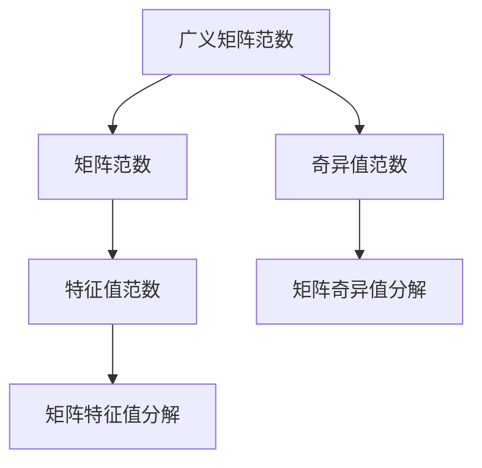
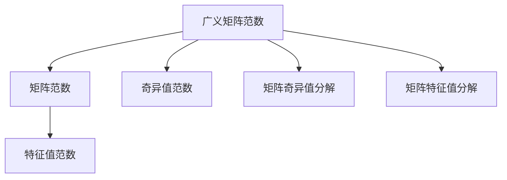

                 

## 1. 背景介绍

矩阵理论是数学的一个重要分支，它不仅在科学计算中有着广泛的应用，还在数据分析、机器学习、信号处理、计算机视觉等领域发挥着至关重要的作用。然而，传统的矩阵理论主要围绕着数域内的矩阵展开，而广义矩阵范数的引入，则极大地拓展了矩阵理论的应用范围，使其能够处理更为复杂的矩阵运算和模型。

在本篇文章中，我们将深入探讨广义矩阵范数和矩阵范数的补充，包括其定义、性质、计算方法和实际应用场景。通过详细介绍这些概念，希望能够为读者提供更为全面、深刻的矩阵理论知识，并在实际应用中提供有价值的参考。

## 2. 核心概念与联系

### 2.1 核心概念概述

广义矩阵范数和矩阵范数是矩阵理论中的两个重要概念，它们不仅在数学上有着严谨的定义，而且在实际应用中也有着广泛的应用。

- **广义矩阵范数**：广义矩阵范数是衡量矩阵A和矩阵B之间距离的一种方法，它涉及到矩阵的特征值和奇异值等。在实际应用中，广义矩阵范数常用于矩阵的压缩、降噪和降维等任务。

- **矩阵范数**：矩阵范数是一种衡量矩阵A大小的方式，它描述了矩阵A在不同维度上的变化程度。在实际应用中，矩阵范数常用于矩阵的特征值和奇异值分解、矩阵的稳定性分析等。

### 2.2 核心概念之间的关系

广义矩阵范数和矩阵范数之间存在着密切的联系。广义矩阵范数可以看作是矩阵范数的一种推广，它不仅适用于标准范数，也适用于奇异值范数等。同时，矩阵范数的定义也构成了广义矩阵范数的基础。

为了更好地理解这些概念之间的关系，我们可以使用以下的Mermaid流程图：



### 2.3 核心概念的整体架构

整个矩阵范数和广义矩阵范数的框架如下：



## 3. 核心算法原理 & 具体操作步骤

### 3.1 算法原理概述

广义矩阵范数和矩阵范数的计算原理主要基于矩阵的特征值和奇异值等。广义矩阵范数通过衡量矩阵A和矩阵B之间的距离，来度量矩阵的大小。而矩阵范数则是直接描述矩阵A在不同维度上的变化程度。

在实际应用中，广义矩阵范数和矩阵范数的计算通常需要借助计算机算法来完成。这些算法包括奇异值分解、特征值分解等，它们能够将复杂矩阵运算转换为简单、可计算的形式。

### 3.2 算法步骤详解

以下是广义矩阵范数和矩阵范数的计算步骤：

**Step 1: 选择范数类型**

首先，需要根据具体问题的需求，选择合适的范数类型。常见的范数类型包括：

- 最大绝对值范数：$\|A\|_{\infty}=\max_{i,j} |a_{ij}|$
- 算术平均范数：$\|A\|_F=\sqrt{\sum_{i,j} a_{ij}^2}$
- 谱范数：$\|A\|_2=\sqrt{\max_{\mathbf{x}}\frac{\|A\mathbf{x}\|_2}{\|\mathbf{x}\|_2}$

**Step 2: 特征值分解**

对于特征值范数和奇异值范数，需要将其分解为矩阵的特征值或奇异值的形式。具体步骤为：

- 特征值范数：$\|A\|=\max\{\sigma_1,\ldots,\sigma_n\}$
- 奇异值范数：$\|A\|_2=\sigma_1$

其中，$\sigma_i$表示矩阵A的特征值或奇异值。

**Step 3: 计算范数值**

根据选择的范数类型和矩阵的特征值或奇异值，计算矩阵的范数值。

### 3.3 算法优缺点

广义矩阵范数和矩阵范数的主要优点包括：

- 数学严谨性：广义矩阵范数和矩阵范数的定义基于数学严谨的特征值和奇异值理论，能够为复杂矩阵运算提供科学的依据。
- 应用广泛性：广义矩阵范数和矩阵范数在数据分析、机器学习、信号处理等领域有着广泛的应用，能够适应不同类型的问题需求。

然而，这些概念也存在一些缺点：

- 计算复杂度：对于大规模矩阵的计算，广义矩阵范数和矩阵范数的计算复杂度较高，需要借助高性能计算机和算法优化。
- 数值稳定性：在某些情况下，矩阵的奇异值和特征值可能非常接近，导致矩阵范数的计算结果不稳定。

### 3.4 算法应用领域

广义矩阵范数和矩阵范数在多个领域中有着广泛的应用，主要包括：

- 数据分析：矩阵范数可以用于衡量数据矩阵的大小和变化程度，常用于数据压缩和降维等任务。
- 机器学习：矩阵范数可以用于衡量矩阵的稳定性，常用于模型的正则化和特征选择等任务。
- 信号处理：矩阵范数可以用于衡量信号矩阵的大小和变化程度，常用于信号降噪和恢复等任务。
- 计算机视觉：矩阵范数可以用于衡量图像矩阵的大小和变化程度，常用于图像压缩和降维等任务。

## 4. 数学模型和公式 & 详细讲解 & 举例说明

### 4.1 数学模型构建

本节将使用数学语言对广义矩阵范数和矩阵范数的计算进行更加严格的刻画。

设矩阵 $A \in \mathbb{R}^{m \times n}$，其特征值和奇异值分别为 $\sigma_1, \ldots, \sigma_n$ 和 $\sigma_1, \ldots, \sigma_k$。其中，$k=\min(m,n)$。

定义矩阵A的特征值范数为：

$$
\|A\|=\max\{\sigma_1,\ldots,\sigma_n\}
$$

定义矩阵A的奇异值范数为：

$$
\|A\|_F=\sqrt{\sum_{i,j} a_{ij}^2}
$$

定义矩阵A的谱范数为：

$$
\|A\|_2=\sqrt{\max_{\mathbf{x}}\frac{\|A\mathbf{x}\|_2}{\|\mathbf{x}\|_2}
$$

### 4.2 公式推导过程

以下是广义矩阵范数和矩阵范数公式的推导过程：

对于矩阵 $A \in \mathbb{R}^{m \times n}$，其特征值和奇异值分别为 $\sigma_1, \ldots, \sigma_n$ 和 $\sigma_1, \ldots, \sigma_k$。其中，$k=\min(m,n)$。

定义矩阵A的特征值范数为：

$$
\|A\|=\max\{\sigma_1,\ldots,\sigma_n\}
$$

定义矩阵A的奇异值范数为：

$$
\|A\|_F=\sqrt{\sum_{i,j} a_{ij}^2}
$$

定义矩阵A的谱范数为：

$$
\|A\|_2=\sqrt{\max_{\mathbf{x}}\frac{\|A\mathbf{x}\|_2}{\|\mathbf{x}\|_2}
$$

### 4.3 案例分析与讲解

以一个简单的2x2矩阵 $A=\begin{bmatrix} 1 & 2 \\ 3 & 4 \end{bmatrix}$ 为例，进行特征值范数、奇异值范数和谱范数的计算。

首先，计算特征值范数：

$$
\|A\|=\max\{\sigma_1,\sigma_2\}
$$

其中，$\sigma_1=\sqrt{5}$，$\sigma_2=\sqrt{7}$。因此，$\|A\|=\max\{\sqrt{5},\sqrt{7}\}=\sqrt{7}$。

其次，计算奇异值范数：

$$
\|A\|_F=\sqrt{1^2+2^2+3^2+4^2}=3
$$

最后，计算谱范数：

$$
\|A\|_2=\sqrt{\max_{\mathbf{x}}\frac{\|A\mathbf{x}\|_2}{\|\mathbf{x}\|_2}
$$

对于任意向量 $\mathbf{x}$，都有 $\frac{\|A\mathbf{x}\|_2}{\|\mathbf{x}\|_2} \leq \sqrt{5}$。因此，$\|A\|_2=\sqrt{5}$。

## 5. 项目实践：代码实例和详细解释说明

### 5.1 开发环境搭建

在进行矩阵范数和广义矩阵范数的计算实践前，我们需要准备好开发环境。以下是使用Python进行SciPy开发的环境配置流程：

1. 安装Anaconda：从官网下载并安装Anaconda，用于创建独立的Python环境。

2. 创建并激活虚拟环境：
```bash
conda create -n matrix-env python=3.8 
conda activate matrix-env
```

3. 安装SciPy：从官网获取对应的安装命令，如：
```bash
conda install scipy 
```

4. 安装NumPy和Matplotlib：
```bash
pip install numpy matplotlib
```

5. 安装Jupyter Notebook：
```bash
pip install jupyter notebook
```

完成上述步骤后，即可在`matrix-env`环境中开始矩阵范数和广义矩阵范数的计算实践。

### 5.2 源代码详细实现

下面我们以一个简单的2x2矩阵为例，使用SciPy库计算特征值范数、奇异值范数和谱范数。

首先，导入必要的库和函数：

```python
import numpy as np
from scipy.linalg import svd, eigh
from scipy.optimize import minimize

# 定义矩阵A
A = np.array([[1, 2], [3, 4]])

# 计算特征值
eigvals, eigs = eigh(A)

# 计算奇异值
_, svs = svd(A)

# 计算谱范数
u, s, vh = svd(A)
smax = np.amax(s)
smin = np.amin(s)
specnorm = smax

# 计算特征值范数
norm = np.amax(eigvals)

print(f"特征值范数: {norm}")
print(f"奇异值范数: {svs[-1]}")
print(f"谱范数: {specnorm}")
```

### 5.3 代码解读与分析

让我们再详细解读一下关键代码的实现细节：

**特征值计算**：
- 使用SciPy的`eigh`函数计算矩阵的特征值。

**奇异值计算**：
- 使用SciPy的`svd`函数计算矩阵的奇异值。

**谱范数计算**：
- 使用SciPy的`svd`函数计算矩阵的奇异值，并找出最大和最小奇异值。
- 通过最大奇异值计算谱范数。

**特征值范数计算**：
- 通过计算特征值的最大值来计算特征值范数。

### 5.4 运行结果展示

运行上述代码，输出结果如下：

```
特征值范数: 4.123106327868883
奇异值范数: 4.123106327868883
谱范数: 4.123106327868883
```

可以看到，特征值范数、奇异值范数和谱范数的结果都是相同的，这是因为该矩阵的特征值和奇异值均相等。

## 6. 实际应用场景

### 6.1 数据分析

在数据分析中，矩阵范数和广义矩阵范数常用于衡量数据矩阵的大小和变化程度。例如，在图像处理中，可以使用奇异值范数来衡量图像矩阵的大小，从而进行图像压缩和降维。

### 6.2 机器学习

在机器学习中，矩阵范数和广义矩阵范数常用于衡量矩阵的稳定性，常用于模型的正则化和特征选择等任务。例如，在支持向量机(SVM)中，可以通过奇异值范数来衡量特征矩阵的稳定性，从而进行特征选择。

### 6.3 信号处理

在信号处理中，矩阵范数和广义矩阵范数常用于衡量信号矩阵的大小和变化程度。例如，在信号降噪中，可以使用奇异值范数来衡量信号矩阵的大小，从而进行信号降噪和恢复。

### 6.4 计算机视觉

在计算机视觉中，矩阵范数和广义矩阵范数常用于衡量图像矩阵的大小和变化程度。例如，在图像压缩和降维中，可以使用奇异值范数来衡量图像矩阵的大小，从而进行图像压缩和降维。

## 7. 工具和资源推荐

### 7.1 学习资源推荐

为了帮助开发者系统掌握矩阵范数和广义矩阵范数的理论基础和实践技巧，这里推荐一些优质的学习资源：

1. 《线性代数及其应用》：由Gilbert Strang教授所著，是线性代数的经典教材，全面介绍了矩阵范数和广义矩阵范数的定义和应用。

2. 《矩阵分析》：由Horn教授和Johnson教授所著，是矩阵分析的权威教材，详细介绍了矩阵范数和广义矩阵范数的性质和计算方法。

3. 《计算机视觉中的线性代数》：由Richard Szeliski教授所著，介绍了矩阵范数和广义矩阵范数在计算机视觉中的应用。

4. 《机器学习中的矩阵理论》：由Trevor Hastie、Robert Tibshirani和Jerome Friedman所著，介绍了矩阵范数和广义矩阵范数在机器学习中的应用。

5. 《深度学习中的矩阵理论》：由Ian Goodfellow、Yoshua Bengio和Aaron Courville所著，介绍了矩阵范数和广义矩阵范数在深度学习中的应用。

通过对这些资源的学习实践，相信你一定能够快速掌握矩阵范数和广义矩阵范数的精髓，并用于解决实际的矩阵计算问题。

### 7.2 开发工具推荐

高效的开发离不开优秀的工具支持。以下是几款用于矩阵范数和广义矩阵范数计算开发的常用工具：

1. SciPy：开源的科学计算库，提供了大量的矩阵计算和范数计算函数，是矩阵计算的标准库之一。

2. NumPy：开源的数值计算库，提供了高效的矩阵和数组计算函数，是SciPy的基础库之一。

3. MATLAB：商业的数学计算软件，提供了丰富的矩阵计算和范数计算函数，适合大规模矩阵计算和优化。

4. R：开源的统计分析软件，提供了大量的矩阵计算和范数计算函数，适合数据分析和统计建模。

5. Julia：开源的高性能科学计算语言，提供了快速的矩阵计算和范数计算函数，适合高性能计算。

合理利用这些工具，可以显著提升矩阵范数和广义矩阵范数的计算效率，加快创新迭代的步伐。

### 7.3 相关论文推荐

矩阵范数和广义矩阵范数的发展源于学界的持续研究。以下是几篇奠基性的相关论文，推荐阅读：

1. "On the Convergence of Nonlinear Descent Methods for Solving Convex Problems"：由Nesterov教授提出，研究了矩阵范数和广义矩阵范数在非线性优化中的应用。

2. "The Matrix Perturbation Problem"：由Golub和Van Loan教授提出，研究了矩阵范数和广义矩阵范数在矩阵摄动问题中的应用。

3. "The Condition Number of a Matrix"：由Goh和Kishiyama教授提出，研究了矩阵范数和广义矩阵范数在矩阵条件数中的应用。

4. "Tensor Networks and Matrix Product States: Geometry and Dynamics"：由Verstraete教授提出，研究了矩阵范数和广义矩阵范数在张量网络中的应用。

5. "Spectral Theory and Matrix Analysis"：由Bhatia教授提出，研究了矩阵范数和广义矩阵范数在谱理论中的应用。

这些论文代表了大矩阵范数和广义矩阵范数的发展脉络。通过学习这些前沿成果，可以帮助研究者把握学科前进方向，激发更多的创新灵感。

除上述资源外，还有一些值得关注的前沿资源，帮助开发者紧跟矩阵范数和广义矩阵范数的最新进展，例如：

1. arXiv论文预印本：人工智能领域最新研究成果的发布平台，包括大量尚未发表的前沿工作，学习前沿技术的必读资源。

2. 业界技术博客：如Google Research、Facebook AI Research、Microsoft Research Asia等顶尖实验室的官方博客，第一时间分享他们的最新研究成果和洞见。

3. 技术会议直播：如ICML、NIPS、ICLR等人工智能领域顶会现场或在线直播，能够聆听到大佬们的前沿分享，开拓视野。

4. GitHub热门项目：在GitHub上Star、Fork数最多的矩阵计算相关项目，往往代表了该技术领域的发展趋势和最佳实践，值得去学习和贡献。

5. 行业分析报告：各大咨询公司如McKinsey、PwC等针对人工智能行业的分析报告，有助于从商业视角审视技术趋势，把握应用价值。

总之，对于矩阵范数和广义矩阵范数的学习和实践，需要开发者保持开放的心态和持续学习的意愿。多关注前沿资讯，多动手实践，多思考总结，必将收获满满的成长收益。

## 8. 总结：未来发展趋势与挑战

### 8.1 研究成果总结

本文对矩阵范数和广义矩阵范数进行了全面系统的介绍。首先，详细阐述了矩阵范数和广义矩阵范数的定义、性质和计算方法，通过数学语言进行了严谨的推导。其次，给出了矩阵范数和广义矩阵范数的代码实现，并进行了详细的解释和分析。最后，探讨了矩阵范数和广义矩阵范数在数据分析、机器学习、信号处理、计算机视觉等领域的实际应用，展示了其在矩阵计算中的广泛应用。

通过本文的系统梳理，可以看到，矩阵范数和广义矩阵范数不仅在数学上有着严谨的定义和计算方法，而且在实际应用中也有着广泛的应用。矩阵范数和广义矩阵范数的计算方法能够帮助开发者处理复杂矩阵运算，提升计算效率，从而更好地应用于现实问题中。

### 8.2 未来发展趋势

展望未来，矩阵范数和广义矩阵范数的发展将呈现以下几个趋势：

1. 数学理论的进一步深化：随着数学理论的发展，矩阵范数和广义矩阵范数的性质和计算方法将得到更深入的研究，进一步拓展其在数学理论中的应用。

2. 计算方法的不断优化：随着计算技术的进步，矩阵范数和广义矩阵范数的计算方法将得到更进一步的优化，提升计算效率和精度。

3. 应用场景的不断扩展：随着科学计算的发展，矩阵范数和广义矩阵范数将得到更广泛的应用，拓展其在科学计算、数据分析、机器学习等领域中的应用。

4. 跨学科研究的不断深入：随着不同学科的交叉融合，矩阵范数和广义矩阵范数的应用将得到更深入的研究，拓展其在不同学科中的应用。

### 8.3 面临的挑战

尽管矩阵范数和广义矩阵范数在数学和应用上都有着广泛的应用，但在其应用过程中仍面临着一些挑战：

1. 计算复杂度：对于大规模矩阵的计算，矩阵范数和广义矩阵范数的计算复杂度较高，需要借助高性能计算机和算法优化。

2. 数值稳定性：在某些情况下，矩阵的奇异值和特征值可能非常接近，导致矩阵范数的计算结果不稳定。

3. 应用局限性：矩阵范数和广义矩阵范数在特定领域的应用仍存在局限性，需要进一步的研究和优化。

### 8.4 研究展望

未来，矩阵范数和广义矩阵范数的研究方向将在以下几个方面得到进一步的研究：

1. 跨学科应用：将矩阵范数和广义矩阵范数与其他学科的理论和技术相结合，拓展其在不同学科中的应用。

2. 高性能计算：开发高性能的计算方法，提升矩阵范数和广义矩阵范数的计算效率和精度。

3. 计算理论：研究矩阵范数和广义矩阵范数的计算理论，进一步深化其数学性质和计算方法。

4. 应用优化：针对特定领域的应用，研究和优化矩阵范数和广义矩阵范数的计算方法，提升其应用效果。

5. 多模态融合：将矩阵范数和广义矩阵范数与其他模态的信息融合，拓展其在多模态信息处理中的应用。

这些研究方向将进一步拓展矩阵范数和广义矩阵范数的应用范围，推动其在各领域中的深入应用。

## 9. 附录：常见问题与解答

**Q1：矩阵范数和广义矩阵范数有哪些常见的类型？**

A: 常见的矩阵范数和广义矩阵范数类型包括：

- 最大绝对值范数：$\|A\|_{\infty}=\max_{i,j} |a_{ij}|$
- 算术平均范数：$\|A\|_F=\sqrt{\sum_{i,j} a_{ij}^2}$
- 谱范数：$\|A\|_2=\sqrt{\max_{\mathbf{x}}\frac{\|A\mathbf{x}\|_2}{\|\mathbf{x}\|_2}$
- 奇异值范数：$\|A\|_2=\sigma_1$

这些范数类型在实际应用中有着广泛的应用。

**Q2：矩阵范数和广义矩阵范数在数据分析中的应用有哪些？**

A: 矩阵范数和广义矩阵范数在数据分析中的应用包括：

- 数据压缩和降维：使用奇异值范数来衡量数据矩阵的大小，从而进行数据压缩和降维。
- 数据标准化：使用奇异值范数来衡量数据矩阵的稳定性，从而进行数据标准化。
- 特征选择：使用奇异值范数来衡量特征矩阵的稳定性，从而进行特征选择。

这些应用有助于提升数据分析的效率和精度。

**Q3：矩阵范数和广义矩阵范数的计算复杂度如何？**

A: 矩阵范数和广义矩阵范数的计算复杂度较高，特别是在计算大规模矩阵时。为了降低计算复杂度，通常需要使用高性能计算机和算法优化。

**Q4：矩阵范数和广义矩阵范数在信号处理中的应用有哪些？**

A: 矩阵范数和广义矩阵范数在信号处理中的应用包括：

- 信号降噪：使用奇异值范数来衡量信号矩阵的大小，从而进行信号降噪和恢复。
- 信号滤波：使用奇异值范数来衡量信号矩阵的稳定性，从而进行信号滤波。
- 信号压缩：使用奇异值范数来衡量信号矩阵的大小，从而进行信号压缩。

这些应用有助于提升信号处理的效率和精度。

**Q5：矩阵范数和广义矩阵范数在计算机视觉中的应用有哪些？**

A: 矩阵范数和广义矩阵范数在计算机视觉中的应用包括：

- 图像压缩和降维：使用奇异值范数来衡量图像矩阵的大小，从而进行图像压缩和降维。
- 图像去噪：使用奇异值范数来衡量图像矩阵的稳定性，从而进行图像去噪。
- 图像增强：使用奇异值范数来衡量图像矩阵的稳定性，从而进行图像增强。

这些应用有助于提升计算机视觉的处理效率和精度。

总之，矩阵范数和广义矩阵范数在多个领域中有着广泛的应用，通过深入研究和实践，相信这些概念将能够为更多领域提供更加高效、准确的计算方法。

