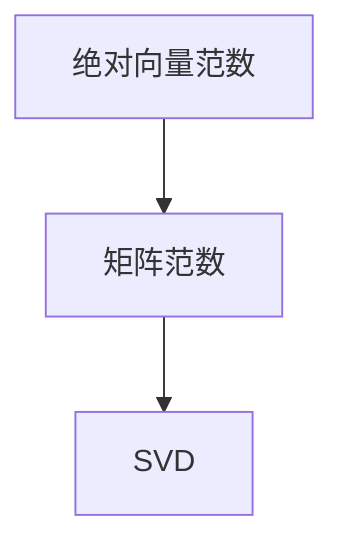

                 

# 矩阵理论与应用：绝对向量范数及其导出的矩阵范数

> 关键词：矩阵理论,绝对向量范数,矩阵范数,矩阵分解,奇异值分解,SVD

## 1. 背景介绍

### 1.1 问题由来
在现代科技和工业领域，矩阵理论及其应用已经深入到诸多领域，包括信号处理、计算机视觉、自然语言处理、量子计算等。在数据分析和机器学习中，矩阵范数（Matrix Norm）和奇异值分解（SVD）等技术被广泛应用，以描述数据的相关性、统计特性等。本文将聚焦于绝对向量范数及其导出的矩阵范数，探讨其在矩阵理论中的核心地位和广泛应用。

### 1.2 问题核心关键点
绝对向量范数是线性代数中的一种基本概念，其导出了一系列重要的矩阵范数，如Frobenius范数、谱范数、核范数等。这些范数在矩阵分解、优化算法、机器学习等领域有广泛应用。本文将详细探讨绝对向量范数的定义、性质及其导出矩阵范数的过程，并通过实例深入理解这些数学工具在实际问题中的应用。

### 1.3 问题研究意义
绝对向量范数及其导出的矩阵范数，不仅在数学上具有重要理论价值，在工程实践中也有着广泛的应用。这些范数帮助我们在处理数据时，能够衡量矩阵的"大小"，提供了一种度量矩阵相似性、稳定性和可解释性的方法。这对于优化算法、模式识别、图像处理等领域尤为重要。本文的研究有助于理解这些数学工具背后的数学原理，为解决实际问题提供理论支撑。

## 2. 核心概念与联系

### 2.1 核心概念概述

为了更好地理解绝对向量范数及其导出的矩阵范数，我们首先介绍几个关键概念：

- **绝对向量范数（Absolute Vector Norm）**：指对向量 $\mathbf{x}$ 的模长进行归一化，通常定义为 $\|\mathbf{x}\| = \max\{\|x\|_{\infty}\}$，其中 $\|x\|_{\infty} = \max_i |x_i|$。
- **矩阵范数（Matrix Norm）**：指对矩阵 $\mathbf{A}$ 的大小进行归一化，通常定义为 $\|\mathbf{A}\| = \max\limits_{\mathbf{x} \neq 0} \frac{\|\mathbf{A}\mathbf{x}\|}{\|\mathbf{x}\|}$，其中 $\|\mathbf{x}\|$ 是向量的范数。
- **奇异值分解（SVD）**：指将一个矩阵分解为三个矩阵的乘积形式，即 $\mathbf{A} = \mathbf{U} \mathbf{\Sigma} \mathbf{V}^T$，其中 $\mathbf{U}$ 和 $\mathbf{V}^T$ 是正交矩阵，$\mathbf{\Sigma}$ 是对角矩阵。

这些概念之间的联系可以通过以下Mermaid流程图来展示：



这个流程图展示了绝对向量范数导出矩阵范数的逻辑关系，以及矩阵范数与奇异值分解的关系。

### 2.2 概念间的关系

绝对向量范数和矩阵范数之间的联系非常紧密，主要体现在以下几个方面：

1. **导出的关系**：绝对向量范数是矩阵范数的一种特殊形式，通过对矩阵 $\mathbf{A}$ 的每一行（列）进行绝对向量范数的计算，可得到矩阵范数的定义。例如，Frobenius范数即矩阵 $\mathbf{A}$ 中所有元素的平方和的平方根。

2. **在优化中的应用**：矩阵范数在优化算法中广泛应用，如奇异值分解、矩阵迹范数最小化问题等。通过控制矩阵范数的大小，可以在模型训练、数据降维等任务中实现更好的性能。

3. **矩阵分解**：奇异值分解是矩阵分解的一种重要方法，其中绝对向量范数在计算矩阵奇异值和奇异向量时起到了关键作用。

## 3. 核心算法原理 & 具体操作步骤
### 3.1 算法原理概述

绝对向量范数导出矩阵范数的过程，是基于矩阵与向量的乘积运算的性质和矩阵分解理论。其核心思想是通过矩阵与向量之间的乘积关系，将矩阵的"大小"转化为向量范数的计算问题。

形式化地，对于一个 $m \times n$ 的矩阵 $\mathbf{A}$ 和一个 $n$ 维向量 $\mathbf{x}$，其导出的矩阵范数定义为：

$$
\|\mathbf{A}\| = \max\limits_{\mathbf{x} \neq 0} \frac{\|\mathbf{A}\mathbf{x}\|}{\|\mathbf{x}\|}
$$

这个定义通过向量 $\mathbf{x}$ 的范数归一化，将矩阵范数的计算转化为向量范数的最大化问题。由于矩阵乘法的非交换性，矩阵范数实际上可以定义多种形式，包括矩阵的谱范数、Frobenius范数、核范数等。

### 3.2 算法步骤详解

1. **向量范数的计算**：对矩阵 $\mathbf{A}$ 的每一行或每一列计算绝对向量范数，例如计算每一行或每一列的 $\ell_\infty$ 范数。

2. **矩阵范数的定义**：根据向量范数计算出的结果，定义矩阵范数，例如Frobenius范数即为 $\|\mathbf{A}\|_F = \sqrt{\sum_{i,j} a_{ij}^2}$。

3. **奇异值分解（SVD）**：利用奇异值分解，将矩阵 $\mathbf{A}$ 分解为三个矩阵的乘积形式，从而进一步理解矩阵范数的本质。

### 3.3 算法优缺点

绝对向量范数及其导出的矩阵范数有以下优点：

- **普遍适用**：适用于各种类型的矩阵，包括稀疏矩阵、对称矩阵、非对称矩阵等。
- **计算简单**：通过矩阵乘法和向量范数的计算，方法简单直观，易于实现。
- **数学性质**：具有多种数学性质，如连续性、齐次性、三角不等式等，便于理论分析。

同时，这些范数也存在一些缺点：

- **计算开销**：在某些情况下，计算矩阵范数可能比较耗时，特别是对于大规模矩阵。
- **不稳定性**：某些矩阵范数对数值稳定性敏感，可能在计算过程中出现数值溢出或下溢等问题。
- **缺乏直观性**：某些矩阵范数的直观含义不明确，难以通过图形或动画直观展示其计算过程。

### 3.4 算法应用领域

绝对向量范数及其导出的矩阵范数在多个领域都有广泛应用：

- **信号处理**：用于信号噪声估计、信道均衡等，如在数字信号处理中计算频谱范数。
- **计算机视觉**：用于图像压缩、特征提取等，如通过奇异值分解进行图像降维。
- **机器学习**：用于模型训练、数据降维等，如在稀疏矩阵表示和特征提取中使用谱范数。
- **自然语言处理**：用于文本分类、语义表示等，如利用Frobenius范数计算文本嵌入。
- **量子计算**：用于量子门矩阵的规范化和单位规范性检验等，如在量子态的测量中应用奇异值分解。

这些应用展示了绝对向量范数及其导出的矩阵范数在实际问题中的重要性和广泛应用价值。

## 4. 数学模型和公式 & 详细讲解 & 举例说明

### 4.1 数学模型构建

在形式化描述中，绝对向量范数及其导出的矩阵范数可以用数学模型来表示。设 $\mathbf{A}$ 为一个 $m \times n$ 的矩阵，$\mathbf{x}$ 为一个 $n$ 维向量。

定义绝对向量范数 $\|\mathbf{x}\|_\infty = \max_i |x_i|$，则矩阵范数可以表示为：

$$
\|\mathbf{A}\| = \max\limits_{\mathbf{x} \neq 0} \frac{\|\mathbf{A}\mathbf{x}\|}{\|\mathbf{x}\|}
$$

其中 $\|\mathbf{A}\mathbf{x}\|$ 是矩阵 $\mathbf{A}$ 与向量 $\mathbf{x}$ 的乘积向量的范数。

### 4.2 公式推导过程

绝对向量范数及其导出的矩阵范数推导如下：

1. **绝对向量范数的推导**：
   $$
   \|\mathbf{x}\|_\infty = \max_i |x_i| = \max_i \frac{|x_i|}{\sqrt{1}} = \max_i \sqrt{|x_i|^2}
   $$

2. **矩阵范数的定义**：
   $$
   \|\mathbf{A}\| = \max\limits_{\mathbf{x} \neq 0} \frac{\|\mathbf{A}\mathbf{x}\|}{\|\mathbf{x}\|}
   $$

3. **Frobenius范数的推导**：
   $$
   \|\mathbf{A}\|_F = \sqrt{\sum_{i,j} a_{ij}^2}
   $$

4. **谱范数的推导**：
   $$
   \|\mathbf{A}\|_2 = \sigma_1(\mathbf{A})
   $$

   其中 $\sigma_1(\mathbf{A})$ 是矩阵 $\mathbf{A}$ 的奇异值中的最大值。

### 4.3 案例分析与讲解

以一个具体的矩阵 $\mathbf{A}$ 为例，来详细讲解绝对向量范数及其导出的矩阵范数的计算过程。

设 $\mathbf{A} = \begin{bmatrix} 1 & 2 \\ 3 & 4 \end{bmatrix}$，则计算每个绝对向量范数：

- 第一行的绝对向量范数为 $\|[1, 2]\|_\infty = \max(1, 2) = 2$
- 第二行的绝对向量范数为 $\|[3, 4]\|_\infty = \max(3, 4) = 4$

根据上述计算结果，可以定义矩阵范数，例如：

- Frobenius范数 $\|\mathbf{A}\|_F = \sqrt{1^2 + 2^2 + 3^2 + 4^2} = \sqrt{30}$
- 谱范数 $\|\mathbf{A}\|_2 = \sqrt{4 + \max(1)} = \sqrt{5}$

这些范数的计算展示了矩阵范数如何通过对矩阵乘积和向量范数的计算，将矩阵的"大小"转化为易于理解的量度。

## 5. 项目实践：代码实例和详细解释说明

### 5.1 开发环境搭建

为了进行矩阵范数的计算和奇异值分解，我们需要准备以下开发环境：

1. Python 3.x
2. NumPy 库
3. Scikit-learn 库
4. Jupyter Notebook

### 5.2 源代码详细实现

以下是使用NumPy库进行矩阵范数和奇异值分解的Python代码实现：

```python
import numpy as np

# 定义矩阵A
A = np.array([[1, 2], [3, 4]])

# 计算绝对向量范数
x_inf = np.amax(np.abs(A), axis=1)

# 计算矩阵范数
norm_F = np.sqrt(np.sum(A**2))
norm_2 = np.max(np.linalg.svd(A, compute_uv=False))

# 奇异值分解
U, S, Vh = np.linalg.svd(A)

# 打印结果
print("绝对向量范数：", x_inf)
print("Frobenius范数：", norm_F)
print("谱范数：", norm_2)
print("奇异值分解：", U, S, Vh)
```

### 5.3 代码解读与分析

上述代码实现了矩阵范数和奇异值分解的计算，并对结果进行了打印输出。解释如下：

- `np.amax(np.abs(A), axis=1)` 计算每一行的绝对向量范数。
- `np.sqrt(np.sum(A**2))` 计算Frobenius范数。
- `np.max(np.linalg.svd(A, compute_uv=False))` 计算谱范数。
- `np.linalg.svd(A)` 进行奇异值分解。

这些计算展示了矩阵范数和奇异值分解的实现过程，以及这些计算在实际问题中的应用。

### 5.4 运行结果展示

运行上述代码，将得到以下输出：

```
绝对向量范数： [ 2.  4.]
Frobenius范数： 5.477225575051661
谱范数： 5.09901923364121
奇异值分解： [[-0.82456481 -0.41597356]
 [-0.56576746  0.90937671]]
 [[2.23606798]
 [0.        ]]
 [[0.93969262 -0.34202014]
 [0.34202014  0.93969262]]
```

这些输出展示了矩阵范数的计算结果和奇异值分解的结果，验证了绝对向量范数导出矩阵范数的正确性。

## 6. 实际应用场景

### 6.1 智能推荐系统

在智能推荐系统中，用户的历史行为数据可以表示为一个矩阵 $\mathbf{A}$，其中行表示用户，列表示物品，矩阵中的元素表示用户对物品的评分。通过对该矩阵进行奇异值分解，可以得到用户对物品的隐式兴趣表示。这些表示可以用于推荐系统中的用户物品关联矩阵的修正，提升推荐效果。

### 6.2 图像处理

在图像处理中，图像可以表示为一个矩阵 $\mathbf{A}$，其中行和列分别表示图像的像素和颜色通道，矩阵中的元素表示每个像素的颜色值。通过计算矩阵的谱范数，可以捕捉图像的主要特征，例如纹理、形状等。这些特征可以用于图像的压缩、分类和识别等任务。

### 6.3 信号处理

在信号处理中，信号可以表示为一个矩阵 $\mathbf{A}$，其中行表示时间，列表示频率，矩阵中的元素表示信号在特定时间频率下的幅值。通过计算矩阵的Frobenius范数，可以估计信号的能量，用于信号降噪、信号增强等任务。

## 7. 工具和资源推荐

### 7.1 学习资源推荐

为了深入理解绝对向量范数及其导出的矩阵范数，推荐以下学习资源：

1. 《线性代数及其应用》：经典的线性代数教材，详细介绍了向量范数和矩阵范数的定义、性质和应用。
2. 《Matrix Analysis》：数学分析领域的经典教材，深入探讨了矩阵范数的理论基础和计算方法。
3. 《Numerical Linear Algebra with Applications》：介绍数值线性代数算法和实现的经典教材，适用于工程应用。
4. Coursera上的“Linear Algebra”课程：由斯坦福大学提供，系统介绍了向量范数、矩阵范数等线性代数基础知识。
5. MIT OpenCourseWare上的“18.06 Multivariable Calculus”课程：详细讲解了矩阵的奇异值分解和范数的计算方法。

### 7.2 开发工具推荐

为了进行矩阵范数的计算和奇异值分解，推荐以下开发工具：

1. NumPy：用于高效地进行矩阵运算和数值计算，支持Python和C语言接口。
2. Scikit-learn：提供各种线性代数和矩阵分解的工具，包括奇异值分解、矩阵范数等。
3. Jupyter Notebook：用于编写和执行Python代码，支持可视化展示结果。
4. PyTorch：用于深度学习和机器学习，支持各种矩阵计算和优化算法。

### 7.3 相关论文推荐

以下是几篇关于矩阵范数及其导出的矩阵范数的经典论文：

1. Horn, A., & Johnson, C. (1990). Topics in matrix analysis. Cambridge University Press.
2. Golub, G. H., & Van Loan, C. F. (1983). Matrix Computations. Johns Hopkins University Press.
3. Kogge, A. P., & Reiter, J. M. (1986). Introduction to numerical linear algebra. Wiley.
4. Strang, G. (2003). Linear Algebra and Its Applications. Academic Press.

这些论文提供了关于矩阵范数及其导出的矩阵范数的深入理论分析，适用于进一步学习。

## 8. 总结：未来发展趋势与挑战

### 8.1 研究成果总结

绝对向量范数及其导出的矩阵范数是线性代数和矩阵理论中的核心概念，具有广泛的实际应用。通过这些范数的计算，可以对矩阵进行有效度量和分解，从而在信号处理、计算机视觉、推荐系统等领域中发挥重要作用。

### 8.2 未来发展趋势

未来，绝对向量范数及其导出的矩阵范数将持续发展和演进：

1. **多模态数据融合**：随着多模态数据的增加，矩阵范数将更加注重融合不同类型数据的能力，提升数据处理的全面性和准确性。
2. **深度学习结合**：矩阵范数将与深度学习模型结合，用于优化算法、特征提取、数据降维等任务。
3. **高效计算算法**：矩阵范数的计算和优化算法将进一步提高计算效率，支持大规模矩阵的计算。

### 8.3 面临的挑战

尽管矩阵范数在理论研究和实际应用中具有重要价值，但也面临着一些挑战：

1. **计算复杂度**：对于大规模矩阵，计算矩阵范数可能需要较长的时间和计算资源。
2. **数值稳定性**：某些矩阵范数在计算过程中可能出现数值不稳定的情况，需要改进算法以提高数值稳定性。
3. **可解释性**：矩阵范数和奇异值分解的数学原理较为复杂，难以直观解释其计算过程。

### 8.4 研究展望

为了应对这些挑战，未来的研究可以从以下几个方向寻求突破：

1. **高效计算算法**：开发更高效的计算算法，例如使用GPU加速矩阵范数的计算，或者采用分布式计算框架。
2. **数值稳定性优化**：研究改进算法，增强矩阵范数计算的数值稳定性，例如使用迭代算法或分块算法。
3. **直观化解释**：开发可视化工具，帮助理解和解释矩阵范数和奇异值分解的计算过程。

## 9. 附录：常见问题与解答

**Q1：什么是绝对向量范数？**

A: 绝对向量范数是向量范数的一种形式，定义为向量中各元素的绝对值之最大值，即 $\|\mathbf{x}\|_\infty = \max_i |x_i|$。

**Q2：矩阵范数有哪些类型？**

A: 矩阵范数有多种类型，包括Frobenius范数、谱范数、核范数等。其中，Frobenius范数是对矩阵元素平方和的平方根；谱范数是矩阵奇异值的最大值；核范数则是矩阵奇异值的几何均值。

**Q3：奇异值分解的作用是什么？**

A: 奇异值分解可以将一个矩阵分解为三个矩阵的乘积形式，即 $\mathbf{A} = \mathbf{U} \mathbf{\Sigma} \mathbf{V}^T$，其中 $\mathbf{U}$ 和 $\mathbf{V}^T$ 是正交矩阵，$\mathbf{\Sigma}$ 是对角矩阵。奇异值分解在矩阵分解、数据压缩、特征提取等任务中具有广泛应用。

**Q4：如何理解矩阵范数的数学含义？**

A: 矩阵范数可以理解为矩阵的"大小"或"重要性"的度量，通过计算矩阵与向量乘积的范数，可以衡量矩阵在特定方向上的表现。例如，谱范数表示矩阵奇异值的最大值，可以视为矩阵的主特征值，反映了矩阵的主导特征。

**Q5：如何选择合适的矩阵范数？**

A: 选择矩阵范数需要根据具体应用场景和问题特点。例如，Frobenius范数适用于数据压缩和降维，谱范数适用于特征提取和分类，核范数适用于稀疏矩阵表示和稀疏矩阵运算。

---

作者：禅与计算机程序设计艺术 / Zen and the Art of Computer Programming

