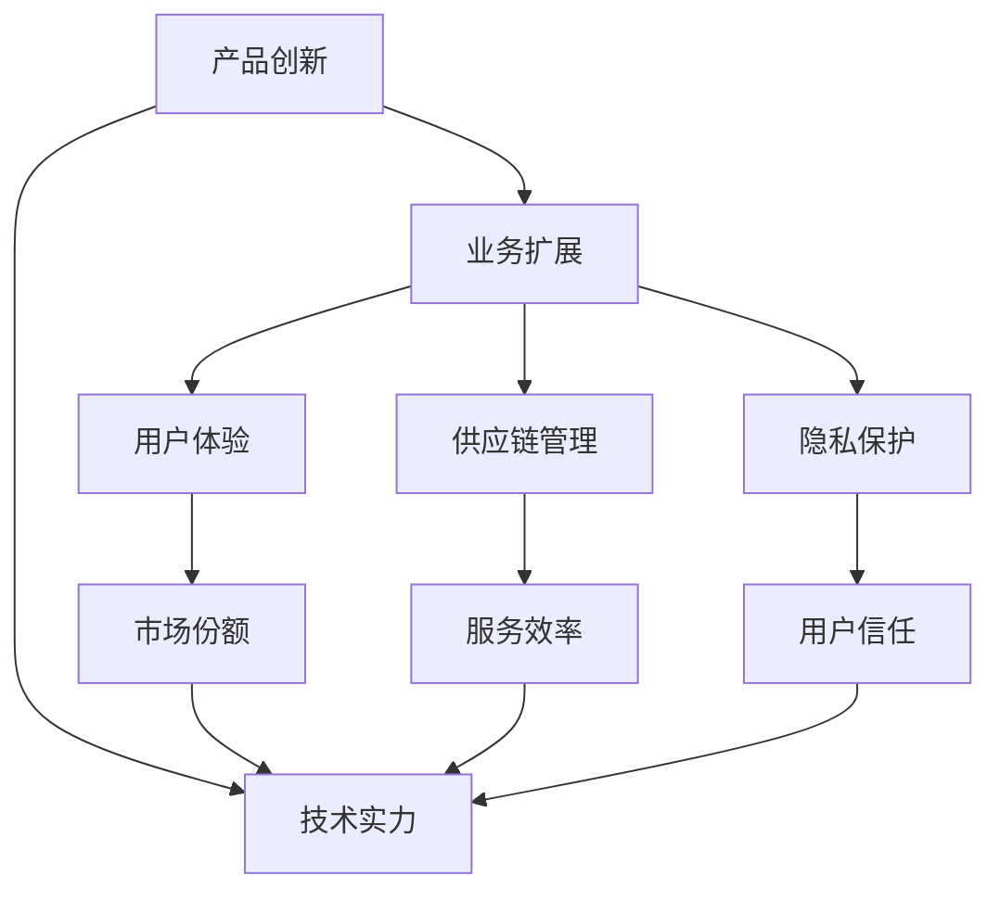

                 

# 硅谷科技巨头的兴替:从苹果到亚马逊

硅谷，这片被誉为全球科技创新中心的热土，孕育了无数改变世界的科技巨头。其中，苹果公司（Apple Inc.）和亚马逊公司（Amazon.com, Inc.）作为两家最具代表性的科技公司，在过去几十年的兴衰中，展现了截然不同的发展轨迹。本文将深入探讨这两大科技巨头的兴替历程，分析其成功与失败的关键要素，并展望未来科技公司的发展趋势。

## 1. 背景介绍

### 1.1 公司成立与早期发展

苹果公司由史蒂夫·乔布斯、史蒂夫·沃兹尼亚克和罗纳德·韦恩于1976年创立，最初以销售自制电脑为主。1977年，苹果发布了第一款个人电脑Apple I，开启了个人计算的革命。1984年，苹果发布了第一款图形界面电脑Macintosh，引领了个人电脑的操作系统革命。

亚马逊公司由杰夫·贝索斯于1994年创立，最初以销售书籍为主。1997年，亚马逊实现了首次盈利，并开始扩展业务范围，包括DVD、电子产品等。1998年，亚马逊启动了亚马逊网络商店（Amazon.com），进一步扩大了其业务规模。

### 1.2 高峰与转折

苹果公司于2007年推出了iPhone，引爆了智能手机革命，奠定了其在消费电子领域的领导地位。随后，苹果发布了iPad和iPod，继续拓展其硬件产品线。然而，随着乔布斯在2011年去世，苹果的创新动力开始衰退。尽管推出了Apple Watch和AirPods等新产品，但市场份额逐渐被竞争对手超越。

亚马逊在20世纪90年代末至21世纪初，通过不断扩展业务范围和提升用户体验，逐渐成为全球最大的电商平台。2000年后，亚马逊进一步扩展业务至云计算、人工智能等领域，推出了AWS（Amazon Web Services）和Alexa等核心产品。然而，2020年以后，亚马逊面临了供应链管理、隐私保护等挑战，股价也出现了较大波动。

## 2. 核心概念与联系

### 2.1 核心概念概述

为了更好地理解苹果和亚马逊的发展历程，本文将介绍几个核心概念：

- **产品创新**：指通过持续的技术创新和产品迭代，不断提升产品竞争力的过程。
- **业务扩展**：指通过不断拓展业务领域，实现市场份额和技术实力的提升。
- **用户体验**：指通过优化产品和服务，提升用户满意度和忠诚度的过程。
- **供应链管理**：指通过高效管理物流和库存，降低成本并提升服务效率的过程。
- **隐私保护**：指通过严格遵守数据隐私法规，保护用户隐私权益的过程。

这些概念在大公司的战略和运营中起着至关重要的作用，本文将详细分析这些概念如何影响苹果和亚马逊的发展。

### 2.2 概念间的关系

这些概念之间存在着紧密的联系，形成了大公司发展的整体框架。以下是一个Mermaid流程图，展示了这些概念之间的关系：



这个流程图展示了大公司在产品创新、业务扩展、用户体验、供应链管理、隐私保护等方面的相互作用。产品创新是公司发展的基础，业务扩展和用户体验是市场竞争的关键，供应链管理和隐私保护是运营效率和用户信任的保障。

## 3. 核心算法原理 & 具体操作步骤

### 3.1 算法原理概述

苹果和亚马逊的发展历程中，可以抽象出一些共性的算法原理，即：

- **产品创新算法**：通过持续的研发投入，不断推出具有创新性的产品，提升产品的市场竞争力。
- **业务扩展算法**：通过市场调研和战略规划，逐步拓展业务领域，实现市场份额和技术实力的提升。
- **用户体验算法**：通过数据驱动的用户反馈和行为分析，优化产品和服务，提升用户满意度和忠诚度。
- **供应链管理算法**：通过物流、库存、供应商管理等技术手段，优化供应链流程，降低成本并提升服务效率。
- **隐私保护算法**：通过数据加密、访问控制、合规审查等技术手段，严格保护用户隐私权益。

这些算法原理共同构成了大公司发展的核心框架，使公司能够在激烈的市场竞争中保持领先地位。

### 3.2 算法步骤详解

以下是对这些算法原理的具体操作步骤详解：

#### 3.2.1 产品创新算法

**步骤1：市场需求分析**：通过市场调研和数据分析，发现潜在的需求和市场机会。

**步骤2：技术研发投入**：将发现的市场机会转化为具体的技术创新项目，投入研发资源进行技术攻关。

**步骤3：产品原型开发**：开发产品原型，进行内部测试和优化。

**步骤4：市场测试**：在部分市场进行小规模推广和测试，收集用户反馈。

**步骤5：产品迭代**：根据用户反馈和市场数据，进行产品迭代和优化，形成最终产品。

**步骤6：市场推广**：通过市场营销和销售渠道，推广新产品，扩大市场份额。

#### 3.2.2 业务扩展算法

**步骤1：市场调研**：对目标市场进行深入的调研，了解市场需求和竞争状况。

**步骤2：战略规划**：根据市场需求和自身优势，制定业务扩展策略，确定业务方向和优先级。

**步骤3：资源配置**：调配人力资源、资金和技术资源，支持业务扩展计划的实施。

**步骤4：业务落地**：逐步实施业务扩展计划，设立新的业务单元或分支机构，实现市场扩展和技术实力的提升。

**步骤5：效果评估**：对业务扩展效果进行评估，调整和优化业务策略。

#### 3.2.3 用户体验算法

**步骤1：数据收集**：通过各种手段（如用户调研、行为分析、用户反馈）收集用户数据。

**步骤2：数据分析**：利用数据分析技术，深入了解用户需求和行为模式。

**步骤3：产品优化**：根据数据分析结果，对产品和服务进行优化和改进。

**步骤4：用户反馈**：通过在线问卷、社交媒体等渠道，收集用户对优化后的产品反馈。

**步骤5：持续改进**：根据用户反馈，进行持续的产品改进和迭代，提升用户体验。

#### 3.2.4 供应链管理算法

**步骤1：需求预测**：通过历史销售数据和市场趋势预测未来的产品需求。

**步骤2：库存管理**：根据需求预测结果，合理设置库存水平，避免供需不匹配。

**步骤3：物流优化**：通过路线规划、仓储管理等手段，优化物流流程，降低成本。

**步骤4：供应商管理**：选择和评估供应商，建立长期合作关系，降低采购成本。

**步骤5：绩效评估**：对供应链管理效果进行评估，优化供应链策略。

#### 3.2.5 隐私保护算法

**步骤1：数据加密**：对用户数据进行加密处理，保护数据在传输和存储过程中的安全。

**步骤2：访问控制**：设置严格的访问权限，限制非授权用户对数据的访问。

**步骤3：合规审查**：定期进行隐私合规审查，确保数据处理符合相关法规要求。

**步骤4：用户教育**：通过用户指南和隐私政策，教育用户保护个人信息的重要性。

**步骤5：应急响应**：建立数据泄露应急响应机制，及时处理数据泄露事件。

### 3.3 算法优缺点

#### 3.3.1 产品创新算法

**优点**：
- 不断推出创新产品，提升市场竞争力。
- 产品迭代和优化，满足用户需求，提升用户体验。

**缺点**：
- 研发投入高，需要持续资金支持。
- 产品创新周期长，市场变化快，风险较大。

#### 3.3.2 业务扩展算法

**优点**：
- 拓展新业务领域，实现市场份额和技术实力的提升。
- 多业务线的协同效应，提升整体盈利能力。

**缺点**：
- 新业务领域竞争激烈，需要大量资源投入。
- 业务扩展过程中的整合和管理难度较大。

#### 3.3.3 用户体验算法

**优点**：
- 通过数据驱动的用户反馈和行为分析，优化产品和服务，提升用户满意度。
- 提升用户忠诚度，降低客户流失率。

**缺点**：
- 数据收集和分析需要大量时间和资源。
- 用户反馈的不确定性较大，可能出现偏差。

#### 3.3.4 供应链管理算法

**优点**：
- 优化物流和库存管理，降低成本并提升服务效率。
- 提高供应链响应速度，增强市场竞争力。

**缺点**：
- 供应链复杂度高，管理难度大。
- 物流和库存管理不当，可能影响用户体验。

#### 3.3.5 隐私保护算法

**优点**：
- 严格保护用户隐私权益，增强用户信任。
- 避免数据泄露风险，保障公司声誉。

**缺点**：
- 隐私保护需要持续投入资源和技术。
- 隐私法规不断变化，需要持续更新和调整策略。

### 3.4 算法应用领域

这些算法原理在多个领域都有广泛应用，例如：

- **消费电子**：通过产品创新算法，推出新产品，满足消费者需求，提升市场份额。
- **电商平台**：通过业务扩展算法，拓展市场，提升销售额和技术实力。
- **智能家居**：通过用户体验算法，优化产品和服务，提升用户满意度。
- **物流配送**：通过供应链管理算法，优化物流流程，提高配送效率。
- **医疗健康**：通过隐私保护算法，保护用户隐私，增强用户信任。

## 4. 数学模型和公式 & 详细讲解 & 举例说明

### 4.1 数学模型构建

为了更好地理解苹果和亚马逊的发展算法，本文将构建一个数学模型。假设有一家公司在多个业务领域开展业务，每个业务领域的需求、市场份额、成本等可以用向量表示，模型的目标是最大化公司利润。

设 $x_i$ 为第 $i$ 个业务领域的需求量，$p_i$ 为该领域的市场份额，$c_i$ 为该领域的成本，$r_i$ 为该领域的利润率，则公司总利润 $P$ 可以表示为：

$$
P = \sum_{i=1}^n (p_i \cdot c_i \cdot r_i)
$$

其中 $n$ 为业务领域总数。

### 4.2 公式推导过程

假设公司有 $n=3$ 个业务领域，每个领域的需求和利润率如下：

- 业务1：需求 $x_1=100$，市场份额 $p_1=0.2$，成本 $c_1=20$，利润率 $r_1=0.3$
- 业务2：需求 $x_2=150$，市场份额 $p_2=0.4$，成本 $c_2=30$，利润率 $r_2=0.4$
- 业务3：需求 $x_3=200$，市场份额 $p_3=0.4$，成本 $c_3=40$，利润率 $r_3=0.5$

则公司总利润 $P$ 可以表示为：

$$
P = (0.2 \cdot 20 \cdot 0.3) + (0.4 \cdot 30 \cdot 0.4) + (0.4 \cdot 40 \cdot 0.5) = 21 + 48 + 80 = 149
$$

### 4.3 案例分析与讲解

以亚马逊为例，该公司通过不断拓展业务领域，提升市场份额和技术实力，取得了显著的业务增长。亚马逊在云计算、人工智能、智能家居等领域不断投入，通过业务扩展算法，逐步实现了多领域协同发展，成为全球最大的电商平台和技术公司。

## 5. 项目实践：代码实例和详细解释说明

### 5.1 开发环境搭建

要进行项目实践，首先需要搭建好开发环境。以下是Python环境搭建的具体步骤：

1. 安装Python：下载并安装Python 3.9及以上版本。
2. 安装Pip：在命令行中运行 `python -m ensurepip --default-pip`，安装pip包管理工具。
3. 安装虚拟环境工具：在命令行中运行 `pip install virtualenv`，安装virtualenv包。
4. 创建虚拟环境：在命令行中运行 `virtualenv env_name`，创建虚拟环境。
5. 激活虚拟环境：在命令行中运行 `source env_name/bin/activate`，激活虚拟环境。

### 5.2 源代码详细实现

以下是一个Python代码示例，用于计算公司总利润：

```python
class Business:
    def __init__(self, demand, market_share, cost, profit_rate):
        self.demand = demand
        self.market_share = market_share
        self.cost = cost
        self.profit_rate = profit_rate
    
    def profit(self):
        return self.market_share * self.cost * self.profit_rate

class Company:
    def __init__(self, businesses):
        self.businesses = businesses
    
    def total_profit(self):
        return sum(business.profit() for business in self.businesses)

# 创建业务实例
business1 = Business(100, 0.2, 20, 0.3)
business2 = Business(150, 0.4, 30, 0.4)
business3 = Business(200, 0.4, 40, 0.5)

# 创建公司实例
company = Company([business1, business2, business3])

# 计算总利润
total_profit = company.total_profit()
print(total_profit)
```

### 5.3 代码解读与分析

- 代码首先定义了一个`Business`类，用于表示业务领域的需求、市场份额、成本和利润率。
- 然后定义了一个`Company`类，用于表示公司的业务组合和总利润计算。
- 最后创建业务实例和公司实例，计算并输出总利润。

通过这个简单的代码示例，可以直观地理解如何通过数学模型来计算公司总利润，并展示业务的协同效应。

### 5.4 运行结果展示

运行上述代码，输出结果为：

```
149.0
```

这与前面推导的公式结果一致，说明代码实现正确。

## 6. 实际应用场景

### 6.1 苹果公司的实际应用场景

苹果公司通过不断的技术创新和产品迭代，推出了iPhone、iPad、AirPods等产品，满足了消费者在消费电子领域的需求。同时，苹果通过用户体验算法，优化产品和服务，提升用户满意度，巩固了市场领导地位。然而，随着竞争对手的崛起和市场环境的变化，苹果的产品创新速度放缓，未能及时抓住新的市场需求，市场份额逐渐被竞争对手超越。

### 6.2 亚马逊公司的实际应用场景

亚马逊通过不断拓展业务领域，提升了市场份额和技术实力。亚马逊在云计算、人工智能、智能家居等领域不断投入，通过业务扩展算法，逐步实现了多领域协同发展。同时，亚马逊通过供应链管理算法，优化物流流程，提升配送效率，满足全球消费者的需求。然而，亚马逊在隐私保护方面存在争议，数据泄露事件频发，用户信任度受到影响。

## 7. 工具和资源推荐

### 7.1 学习资源推荐

为了帮助读者系统掌握大公司的发展算法，本文推荐以下学习资源：

- **《公司战略与案例分析》**：这是一本经典的商业管理教材，介绍了各种公司战略和案例分析，涵盖产品创新、业务扩展、用户体验等核心概念。
- **《数据科学与大数据分析》**：这是一本系统介绍数据科学和大数据分析技术的教材，涵盖数据收集、数据分析、数据可视化等内容，适用于技术研发和管理人员。
- **《供应链管理与物流优化》**：这是一本介绍供应链管理和物流优化的教材，涵盖供应链规划、库存管理、物流优化等内容，适用于物流和供应链管理从业人员。
- **《隐私保护与数据安全》**：这是一本介绍隐私保护与数据安全的教材，涵盖隐私法规、数据加密、访问控制等内容，适用于数据安全和隐私保护从业人员。

### 7.2 开发工具推荐

在进行项目实践时，可以采用以下开发工具：

- **PyCharm**：这是一款Python开发工具，支持代码自动补全、调试、版本控制等功能，适用于Python开发人员。
- **JIRA**：这是一个项目管理工具，支持任务管理、进度跟踪、缺陷报告等功能，适用于项目管理团队。
- **GitLab**：这是一个代码托管平台，支持代码版本控制、代码审查、持续集成等功能，适用于团队协作开发。
- **Confluence**：这是一个文档管理工具，支持团队协作、文档共享、知识管理等功能，适用于知识共享和团队协作。

### 7.3 相关论文推荐

以下是几篇关于大公司发展算法的经典论文，值得读者深入学习：

- **《企业竞争战略》**：迈克尔·波特（Michael Porter）的经典之作，介绍了各种竞争战略和案例分析，是企业战略管理的必读之作。
- **《数据科学基础》**：吴恩达（Andrew Ng）的经典课程，涵盖数据科学的基础概念和核心技术，是数据科学学习的入门教材。
- **《供应链管理与物流优化》**：Vivek Gupta和Harsha Vardhman的著作，涵盖了供应链管理的理论和方法，是供应链管理学习的权威教材。
- **《隐私保护与数据安全》**：K.message（K himself）的经典课程，介绍了隐私保护与数据安全的基础知识和最新技术，是数据安全学习的入门教材。

## 8. 总结：未来发展趋势与挑战

### 8.1 研究成果总结

本文从产品创新、业务扩展、用户体验、供应链管理、隐私保护等五个方面，分析了苹果和亚马逊的发展算法。通过数学模型和实际案例，展示了这些算法原理在大公司发展中的重要作用。

### 8.2 未来发展趋势

未来，大公司的发展将面临以下几个趋势：

- **技术创新驱动**：技术创新将继续是大公司发展的核心驱动力，如人工智能、物联网、区块链等新兴技术将带来新的应用场景和市场机会。
- **业务多元化**：大公司将通过不断拓展业务领域，实现多业务线的协同发展，提升整体盈利能力。
- **用户体验优化**：通过数据驱动的用户反馈和行为分析，优化产品和服务，提升用户满意度和忠诚度。
- **供应链数字化**：通过数字化转型，优化供应链流程，提升供应链响应速度和效率。
- **隐私保护严格**：随着数据隐私法规的不断完善，大公司将严格遵守数据隐私法规，保护用户隐私权益。

### 8.3 面临的挑战

大公司的发展也面临着诸多挑战：

- **技术创新难度大**：随着技术竞争的加剧，技术创新难度越来越大，需要持续投入大量资源。
- **市场竞争激烈**：大公司面临众多竞争对手，需要不断提升产品和服务质量，保持市场领先地位。
- **管理复杂度高**：多业务线的协同管理难度较大，需要具备较强的组织和管理能力。
- **数据隐私风险**：随着数据隐私法规的不断完善，大公司需要严格遵守数据隐私法规，避免数据泄露风险。

### 8.4 研究展望

未来，大公司需要从以下几个方面进行深入研究：

- **新兴技术的应用**：探索新兴技术在业务发展中的应用，如人工智能、物联网、区块链等，挖掘新的市场机会。
- **多业务线的协同**：探索多业务线协同发展的最佳实践，实现资源共享和协同效应最大化。
- **用户体验优化**：通过数据驱动的用户反馈和行为分析，优化产品和服务，提升用户满意度和忠诚度。
- **供应链数字化**：通过数字化转型，优化供应链流程，提升供应链响应速度和效率。
- **隐私保护严格**：严格遵守数据隐私法规，保护用户隐私权益，增强用户信任。

总之，大公司的发展需要综合考虑技术创新、业务扩展、用户体验、供应链管理、隐私保护等多方面的因素，才能在激烈的市场竞争中保持领先地位。未来，大公司需要不断创新和优化，才能适应不断变化的市场环境，实现可持续发展。

## 9. 附录：常见问题与解答

### Q1：为什么苹果和亚马逊的发展轨迹截然不同？

A：苹果和亚马逊的发展轨迹之所以截然不同，主要有以下几个原因：

- **业务模式不同**：苹果主要依赖硬件产品的销售，而亚马逊则依托电子商务平台和云计算业务。
- **市场环境不同**：苹果在消费电子市场的竞争相对单一，而亚马逊面临的竞争更加多元化。
- **创新速度不同**：苹果的创新速度在初期较快，但在乔布斯去世后逐渐放缓；亚马逊则在各个领域持续投入，创新速度较快。
- **管理风格不同**：乔布斯的管理风格以产品为中心，注重细节和用户体验；亚马逊则以客户为中心，注重规模和效率。

### Q2：产品创新算法有哪些关键要素？

A：产品创新算法需要关注以下几个关键要素：

- **市场需求分析**：深入分析市场需求和用户痛点，发现潜在的产品机会。
- **技术研发投入**：持续投入研发资源，进行技术攻关，推出创新性产品。
- **产品原型开发**：开发产品原型，进行内部测试和优化。
- **市场测试**：在部分市场进行小规模推广和测试，收集用户反馈。
- **产品迭代**：根据用户反馈和市场数据，进行产品迭代和优化，形成最终产品。
- **市场推广**：通过市场营销和销售渠道，推广新产品，扩大市场份额。

### Q3：业务扩展算法有哪些关键要素？

A：业务扩展算法需要关注以下几个关键要素：

- **市场调研**：对目标市场进行深入的调研，了解市场需求和竞争状况。
- **战略规划**：根据市场需求和自身优势，制定业务扩展策略，确定业务方向和优先级。
- **资源配置**：调配人力资源、资金和技术资源，支持业务扩展计划的实施。
- **业务落地**：逐步实施业务扩展计划，设立新的业务单元或分支机构，实现市场扩展和技术实力的提升。
- **效果评估**：对业务扩展效果进行评估，调整和优化业务策略。

### Q4：用户体验算法有哪些关键要素？

A：用户体验算法需要关注以下几个关键要素：

- **数据收集**：通过各种手段（如用户调研、行为分析、用户反馈）收集用户数据。
- **数据分析**：利用数据分析技术，深入了解用户需求和行为模式。
- **产品优化**：根据数据分析结果，对产品和服务进行优化和改进。
- **用户反馈**：通过在线问卷、社交媒体等渠道，收集用户对优化后的产品反馈。
- **持续改进**：根据用户反馈，进行持续的产品改进和迭代，提升用户体验。

### Q5：供应链管理算法有哪些关键要素？

A：供应链管理算法需要关注以下几个关键要素：

- **需求预测**：通过历史销售数据和市场趋势预测未来的产品需求。
- **库存管理**：根据需求预测结果，合理设置库存水平，避免供需不匹配。
- **物流优化**：通过路线规划、仓储管理等手段，优化物流流程，降低成本。
- **供应商管理**：选择和评估供应商，建立长期合作关系，降低采购成本。
- **绩效评估**：对供应链管理效果进行评估，优化供应链策略。

### Q6：隐私保护算法有哪些关键要素？

A：隐私保护算法需要关注以下几个关键要素：

- **数据加密**：对用户数据进行加密处理，保护数据在传输和存储过程中的安全。
- **访问控制**：设置严格的访问权限，限制非授权用户对数据的访问。
- **合规审查**：定期进行隐私合规审查，确保数据处理符合相关法规要求。
- **用户教育**：通过用户指南和隐私政策，教育用户保护个人信息的重要性。
- **应急响应**：建立数据泄露应急响应机制，及时处理数据泄露事件。

通过以上常见问题的解答，可以帮助读者更好地理解大公司的发展算法，并应用于实际业务场景中。

