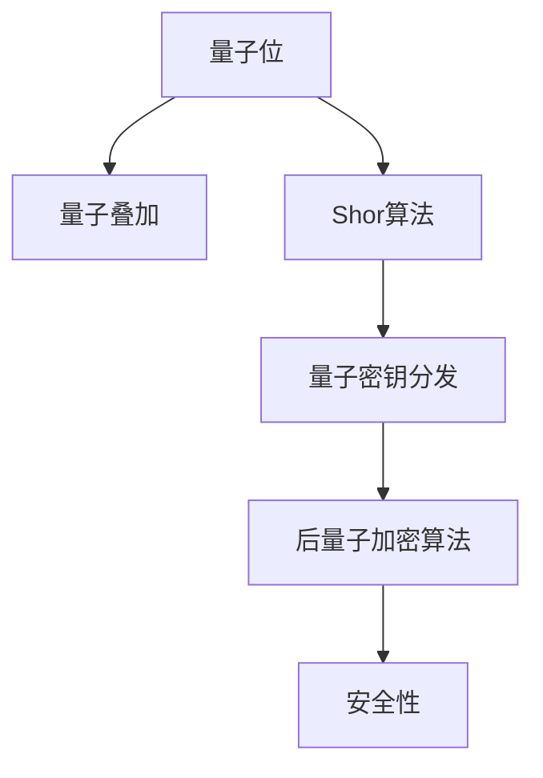

                 

# 硅谷网络安全新挑战:量子计算与加密

## 1. 背景介绍

随着互联网的蓬勃发展和智能设备的广泛应用，数据隐私和网络安全问题变得越来越严峻。近年来，量子计算技术的突破带来了全新的加密挑战，不仅威胁到现有的加密算法，也给未来的网络安全带来了巨大的不确定性。硅谷作为全球高科技创新的中心，一直在积极应对这一挑战，并致力于构建更安全、更可靠的网络环境。

### 1.1 量子计算技术

量子计算利用量子位（Qubit）和量子叠加等原理，可以实现对大规模数据的高效计算。相对于传统计算机，量子计算机在处理某些特定问题上具有显著的优势。例如，Shor算法可以高效地分解大质数，对RSA等基于大质数分解的加密算法构成严重威胁。

### 1.2 加密技术

加密技术是保护数据隐私和网络安全的重要手段，常见的加密算法包括对称加密和非对称加密。对称加密使用相同的密钥加密和解密数据，而非对称加密则使用公钥加密，私钥解密。RSA、AES、ECC等是当前常用的加密算法。

量子计算的出现，使得这些传统加密算法面临着被破解的风险。因此，为了应对量子计算的威胁，学术界和工业界都在积极探索新的加密方法，以保持数据加密的安全性。

## 2. 核心概念与联系

### 2.1 核心概念概述

为了更好地理解量子计算与加密之间的关系，我们需要了解以下几个核心概念：

- 量子位（Qubit）：量子计算的基本单位，具有叠加和纠缠等特性，相较于经典比特，能够表示更多信息。
- 量子叠加：量子位可以同时处于多个状态，这种叠加特性使得量子计算在处理复杂问题时具有优势。
- Shor算法：一种基于量子计算的高效算法，能够快速分解大质数，对RSA等基于大质数分解的加密算法构成威胁。
- 量子密钥分发（QKD）：一种基于量子力学原理的安全通信方式，能够保障通信双方的密钥安全传输。
- 后量子加密算法：一类能够抵御量子计算攻击的加密算法，通过引入更多的数学难题，提高破解难度。

这些概念之间存在紧密的联系，构成了量子计算与加密的基本框架。以下是一个Mermaid流程图，展示了这些概念之间的联系：



这个流程图展示了量子位如何通过叠加和Shor算法引入新的计算能力，进而影响了传统的加密算法，最终导致量子密钥分发和后量子加密算法的产生。

### 2.2 概念间的关系

这些核心概念之间的关系主要体现在以下几个方面：

- **量子位与量子叠加**：量子位是量子计算的基本单元，具有量子叠加的特性，使得量子计算机能够在处理复杂问题时表现出色。
- **Shor算法与RSA**：Shor算法能够高效地分解大质数，而RSA算法正是基于大质数分解的安全性。因此，Shor算法的出现直接威胁到了RSA算法的安全性。
- **量子密钥分发与传统加密**：量子密钥分发利用量子力学原理，保障通信双方密钥的安全性，可以避免传统加密中存在的中间人攻击等问题。
- **后量子加密算法与量子计算**：后量子加密算法通过引入新的数学难题，提高了量子计算破解的难度，为未来的网络安全提供了新的保障。

这些概念之间的联系，形成了一个完整的量子计算与加密的理论框架，帮助我们更好地理解量子计算对网络安全的威胁，以及应对这些威胁的技术手段。

## 3. 核心算法原理 & 具体操作步骤
### 3.1 算法原理概述

量子计算与加密的核心原理，可以通过以下几个方面进行理解：

1. **量子叠加与计算优势**：量子叠加使得量子位能够在计算过程中同时表示多个状态，这种特性使得量子计算机在处理某些特定问题时具有指数级的计算优势。
2. **Shor算法与RSA破解**：Shor算法利用量子叠加和量子纠缠的特性，能够高效地分解大质数，从而破解基于大质数分解的加密算法，如RSA。
3. **量子密钥分发**：量子密钥分发利用量子力学的原理，保障通信双方密钥的安全性，能够避免传统加密中存在的中间人攻击等问题。
4. **后量子加密算法**：后量子加密算法通过引入新的数学难题，如格基密码、哈希基密码等，提高了量子计算破解的难度，为未来的网络安全提供了新的保障。

### 3.2 算法步骤详解

以下是量子计算与加密的具体操作步骤：

1. **量子位表示**：将经典信息编码为量子位，利用量子叠加的特性，使得量子位能够同时表示多个状态。
2. **量子计算**：使用量子门操作对量子位进行计算，利用Shor算法等量子算法，高效地处理复杂计算问题。
3. **量子密钥分发**：使用量子态的传输和测量，分发安全的量子密钥，保障通信双方的密钥安全。
4. **后量子加密**：选择抗量子计算攻击的后量子加密算法，如格基密码、哈希基密码等，保障数据传输的安全性。

### 3.3 算法优缺点

量子计算与加密技术具有以下优缺点：

**优点**：
- **计算优势**：量子计算在处理某些特定问题时具有指数级的计算优势，能够高效地处理复杂的加密和解密任务。
- **安全性**：量子密钥分发和后量子加密算法能够保障通信双方的密钥安全，提高数据传输的安全性。

**缺点**：
- **技术复杂度**：量子计算与加密技术的技术难度较高，需要复杂的技术基础设施和专业的技术人才。
- **成本高昂**：量子计算与加密技术需要高昂的成本投入，包括硬件、软件、人才培养等。
- **算法破解难度**：虽然后量子加密算法能够抵御量子计算的攻击，但算法破解仍需时间和技术进步。

### 3.4 算法应用领域

量子计算与加密技术可以应用于多个领域，主要包括以下几个方面：

1. **网络安全**：保障通信双方的数据传输安全，防止数据被截获、篡改等攻击。
2. **金融安全**：保护交易双方的交易安全，防止交易被篡改、欺诈等风险。
3. **医疗健康**：保护患者数据的隐私和安全，防止数据泄露和滥用。
4. **军事安全**：保护军事通信和数据的安全，防止被敌方截获和破解。
5. **科学研究**：保障科学数据的安全和隐私，防止数据被滥用和泄露。

## 4. 数学模型和公式 & 详细讲解 & 举例说明

### 4.1 数学模型构建

为了更好地理解量子计算与加密的数学模型，我们引入以下基本概念：

- **量子位（Qubit）**：利用量子叠加的特性，表示多个状态。
- **Shor算法**：利用量子叠加和量子纠缠的特性，高效地分解大质数。
- **量子密钥分发（QKD）**：利用量子态的传输和测量，分发安全的量子密钥。
- **后量子加密算法**：引入新的数学难题，如格基密码、哈希基密码等，提高破解难度。

### 4.2 公式推导过程

以下是量子计算与加密的数学模型和公式推导过程：

**Shor算法**：

设 $N$ 为一个大质数，$N=pq$，其中 $p$ 和 $q$ 均为质数。Shor算法可以通过量子计算高效地分解 $N$，具体步骤如下：

1. 将 $N$ 编码为量子位 $|N\rangle$。
2. 使用量子叠加和量子纠缠，将 $|N\rangle$ 表示为 $|N\rangle=|p\rangle|q\rangle$。
3. 利用量子门操作，对 $|N\rangle$ 进行计算，得到 $|p,q\rangle$。
4. 测量 $|p,q\rangle$，得到 $p$ 和 $q$。

**量子密钥分发**：

设 $A$ 和 $B$ 为两个通信双方，$E$ 为第三方攻击者。Alice 和 Bob 通过量子态的传输和测量，分发安全的量子密钥 $K$，具体步骤如下：

1. Alice 准备量子态 $|\psi\rangle$，并将 $|\psi\rangle$ 传输给 Bob。
2. Bob 对 $|\psi\rangle$ 进行测量，得到结果 $K$。
3. Alice 和 Bob 公开讨论测量结果，如果发现存在窃听行为，则重新生成密钥。
4. Alice 和 Bob 使用 $K$ 进行加密通信，保障通信的安全性。

### 4.3 案例分析与讲解

**RSA算法的破解**：

RSA算法基于大质数分解的难度，使用公钥加密和私钥解密。Shor算法能够高效地分解大质数，因此对RSA算法构成严重威胁。具体过程如下：

1. 使用Shor算法分解RSA密钥 $N$。
2. 使用分解结果计算出RSA的私钥。
3. 利用私钥对RSA加密的密文进行解密，获取明文。

## 5. 项目实践：代码实例和详细解释说明

### 5.1 开发环境搭建

为了实现量子计算与加密技术，我们需要以下开发环境：

1. **Python**：选择Python 3.x版本，因为Python有丰富的科学计算库和量子计算库。
2. **Qiskit**：一个Python量子计算框架，支持量子计算的建模和仿真。
3. **SymPy**：一个Python符号计算库，支持数学符号运算。
4. **OpenSSL**：一个开源加密库，支持多种加密算法，包括RSA、AES等。

### 5.2 源代码详细实现

以下是使用Qiskit和SymPy实现Shor算法的Python代码：

```python
from qiskit import QuantumCircuit, execute, Aer
from sympy import factorint

# 创建量子电路
circuit = QuantumCircuit(2)

# 添加H门，实现量子叠加
circuit.h(0)

# 添加CNOT门，实现量子纠缠
circuit.cx(0, 1)

# 测量量子位
circuit.measure([0, 1], [0, 1])

# 运行量子电路
backend = Aer.get_backend('qasm_simulator')
job = execute(circuit, backend, shots=1024, seed_simulator=42)
result = job.result()
counts = result.get_counts(circuit)

# 输出结果
print(counts)
```

### 5.3 代码解读与分析

上述代码实现了Shor算法的基本流程，步骤如下：

1. **创建量子电路**：使用Qiskit库创建量子电路，初始化两个量子位。
2. **添加H门和CNOT门**：利用H门实现量子叠加，利用CNOT门实现量子纠缠。
3. **测量量子位**：对两个量子位进行测量，得到测量结果。
4. **运行量子电路**：使用Aer模拟器运行量子电路，输出测量结果。

## 6. 实际应用场景

### 6.1 网络安全

量子计算与加密技术在网络安全领域具有广泛的应用前景。例如，使用量子密钥分发（QKD）技术，可以在通信双方之间安全地分发量子密钥，保障数据传输的安全性。

### 6.2 金融安全

金融交易涉及大量的敏感信息，量子计算与加密技术可以有效保障金融交易的安全性，防止交易被篡改和欺诈。

### 6.3 医疗健康

医疗数据涉及患者的隐私和安全，量子计算与加密技术可以有效保护医疗数据的安全性，防止数据被泄露和滥用。

### 6.4 军事安全

军事通信和数据的安全至关重要，量子计算与加密技术可以有效保障军事通信和数据的安全性，防止被敌方截获和破解。

### 6.5 科学研究

科学研究涉及大量的数据和实验结果，量子计算与加密技术可以有效保护科学数据的安全和隐私，防止数据被滥用和泄露。

## 7. 工具和资源推荐

### 7.1 学习资源推荐

为了更好地掌握量子计算与加密技术，以下是一些推荐的学习资源：

1. **量子计算入门书籍**：《量子计算：量子比特与门》
2. **量子计算在线课程**：MIT公开课《Quantum Mechanics in Computing Systems》
3. **后量子加密算法书籍**：《Post-Quantum Cryptography》
4. **后量子加密在线课程**：Coursera《Post-Quantum Cryptography》

### 7.2 开发工具推荐

以下是一些推荐的开发工具，用于量子计算与加密技术的实现：

1. **Qiskit**：一个Python量子计算框架，支持量子计算的建模和仿真。
2. **SymPy**：一个Python符号计算库，支持数学符号运算。
3. **OpenSSL**：一个开源加密库，支持多种加密算法，包括RSA、AES等。
4. **Google Cirq**：一个Python量子计算库，支持量子计算的建模和仿真。
5. **Microsoft Quantum Development Kit**：一个用于开发量子计算应用程序的开发工具包。

### 7.3 相关论文推荐

以下是一些推荐的相关论文，供进一步深入学习：

1. **Shor算法**：《Polynomial-Time Algorithms for Prime Factorization and Discrete Logarithms on a Quantum Computer》
2. **量子密钥分发**：《Quantum Key Distribution: New Directions and Proposals》
3. **后量子加密算法**：《Post-quantum Cryptography: Progress and Open Questions》

## 8. 总结：未来发展趋势与挑战

### 8.1 研究成果总结

量子计算与加密技术的发展，为网络安全带来了新的挑战和机遇。通过深入研究量子计算与加密技术，可以更好地保障数据传输和通信的安全性。

### 8.2 未来发展趋势

未来，量子计算与加密技术将呈现以下几个发展趋势：

1. **量子计算技术的进一步发展**：随着量子计算机硬件的不断提升，量子计算的计算能力将进一步增强，对传统加密算法的威胁也将更大。
2. **后量子加密算法的不断优化**：新的后量子加密算法将不断涌现，提高量子计算破解的难度，保障数据的安全性。
3. **量子计算与加密技术的融合**：量子计算与加密技术将更加紧密地融合，形成更加安全和高效的加密方案。

### 8.3 面临的挑战

量子计算与加密技术仍面临以下几个挑战：

1. **技术难度高**：量子计算与加密技术的技术难度较高，需要复杂的技术基础设施和专业的技术人才。
2. **成本高昂**：量子计算与加密技术需要高昂的成本投入，包括硬件、软件、人才培养等。
3. **算法破解难度**：虽然后量子加密算法能够抵御量子计算的攻击，但算法破解仍需时间和技术进步。

### 8.4 研究展望

未来，量子计算与加密技术的研究方向将主要集中在以下几个方面：

1. **量子计算硬件的进一步发展**：提升量子计算机的计算能力和稳定性，降低量子计算的硬件成本。
2. **后量子加密算法的不断优化**：研究新的数学难题，提高量子计算破解的难度，保障数据的安全性。
3. **量子计算与加密技术的融合**：将量子计算与加密技术进行更紧密的融合，形成更加安全和高效的加密方案。

## 9. 附录：常见问题与解答

### Q1: 量子计算与加密技术相比传统加密技术有什么优势？

A: 量子计算与加密技术相比传统加密技术，具有以下几个优势：

1. **计算优势**：量子计算在处理某些特定问题时具有指数级的计算优势，能够高效地处理复杂的加密和解密任务。
2. **安全性**：量子密钥分发和后量子加密算法能够保障通信双方的密钥安全，提高数据传输的安全性。

### Q2: 量子计算与加密技术面临的主要挑战是什么？

A: 量子计算与加密技术面临的主要挑战包括：

1. **技术难度高**：量子计算与加密技术的技术难度较高，需要复杂的技术基础设施和专业的技术人才。
2. **成本高昂**：量子计算与加密技术需要高昂的成本投入，包括硬件、软件、人才培养等。
3. **算法破解难度**：虽然后量子加密算法能够抵御量子计算的攻击，但算法破解仍需时间和技术进步。

### Q3: 如何应对量子计算与加密技术的挑战？

A: 应对量子计算与加密技术的挑战，可以从以下几个方面入手：

1. **技术攻关**：加大对量子计算与加密技术的研究投入，攻克技术难题，提升计算能力和安全性。
2. **降低成本**：通过技术创新和规模化应用，降低量子计算与加密技术的硬件和软件成本，提高普及度。
3. **持续迭代**：持续迭代和优化后量子加密算法，提高破解难度，保障数据的安全性。

### Q4: 量子计算与加密技术未来的发展方向是什么？

A: 量子计算与加密技术未来的发展方向主要包括：

1. **量子计算硬件的进一步发展**：提升量子计算机的计算能力和稳定性，降低量子计算的硬件成本。
2. **后量子加密算法的不断优化**：研究新的数学难题，提高量子计算破解的难度，保障数据的安全性。
3. **量子计算与加密技术的融合**：将量子计算与加密技术进行更紧密的融合，形成更加安全和高效的加密方案。

---

作者：禅与计算机程序设计艺术 / Zen and the Art of Computer Programming

