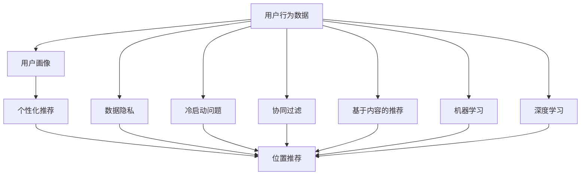
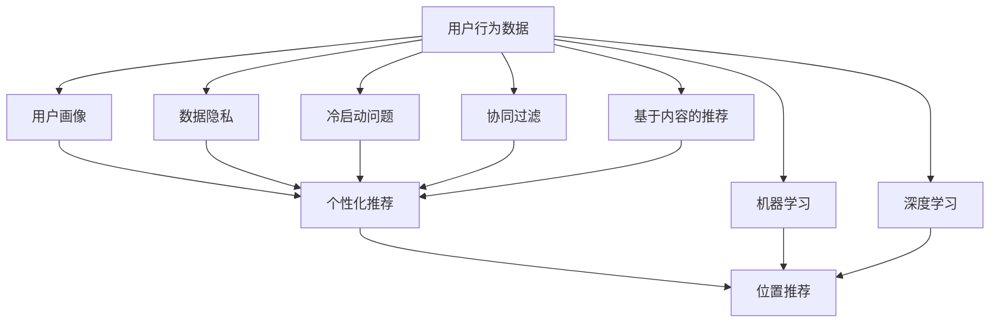

                 

## 1. 背景介绍

### 1.1 问题由来
随着社交网络的日益普及，用户生成内容（User Generated Content, UGC）的爆发式增长，位置推荐作为社交网络中的重要功能，极大地提升了用户体验和社交网络的价值。位置推荐系统的核心任务是通过分析用户行为数据，挖掘用户位置偏好，从而为用户推荐感兴趣的位置信息。例如，针对一条用户评论，系统可以为其推荐附近的热门景点、美食餐厅等。

位置推荐系统已广泛应用于各大社交平台，如微信、Facebook、Google Maps等，是提升用户留存和活跃度的重要手段。其核心算法研究主要围绕两个方面展开：一是如何有效处理用户海量行为数据，提取用户位置偏好；二是如何高效匹配位置信息，提高推荐精度和覆盖面。

### 1.2 问题核心关键点
位置推荐系统主要面临以下几个挑战：

1. **海量数据处理**：社交网络中的用户行为数据量巨大且复杂，如何高效处理并提取有用的位置偏好特征是核心难题。

2. **个性化推荐**：用户具有复杂的个人位置偏好，如何结合用户属性、历史行为等信息，实现高度个性化的推荐，是位置推荐系统的主要目标。

3. **推荐多样化**：用户通常对不同类型的地点有不同需求，如何推荐多样化的地点，丰富用户体验，是推荐系统需要解决的关键问题。

4. **冷启动问题**：新用户加入社交网络后，由于缺乏历史行为数据，难以进行位置推荐。如何有效解决冷启动问题，是一个值得关注的研究方向。

5. **数据隐私**：社交网络中的位置推荐需要处理大量用户数据，如何保护用户隐私，防止数据滥用，是位置推荐系统需要考虑的重要问题。

### 1.3 问题研究意义
位置推荐系统能够提升社交网络的活跃度和用户体验，具体表现为：

1. **用户留存**：通过个性化推荐，提升用户粘性，增加用户使用时长。
2. **转化率提升**：通过推荐用户感兴趣的内容，提高用户参与度，促进内容消费和购买转化。
3. **商业价值**：位置推荐系统能够为社交平台创造新的业务收入，如广告推荐、优惠信息推送等。
4. **社会价值**：位置推荐系统能更好地连接人与人，促进信息传播和文化交流，增加社会的连接性和包容性。

## 2. 核心概念与联系

### 2.1 核心概念概述

#### 2.1.1 位置推荐
位置推荐是指通过分析用户的行为数据，预测其感兴趣的位置信息，并将其推荐给用户的过程。例如，推荐附近的餐馆、景点、商场等。

#### 2.1.2 用户行为数据
用户行为数据包括用户在社交网络上的各种操作记录，如签到、评论、点赞、分享等。这些数据可以用于提取用户的位置偏好和兴趣。

#### 2.1.3 用户画像
用户画像是指根据用户的各种行为数据，构建用户详细且多维的画像，用于个性化推荐。用户画像包括基本信息、兴趣偏好、行为习惯等。

#### 2.1.4 冷启动问题
冷启动问题指新用户加入社交网络后，由于缺乏历史数据，无法进行个性化推荐。解决这个问题是位置推荐系统的一个重要研究方向。

#### 2.1.5 数据隐私
数据隐私指在位置推荐过程中，如何保护用户的位置数据，防止数据滥用和泄露。

#### 2.1.6 协同过滤
协同过滤是指通过分析用户的行为数据，挖掘用户之间的相似性，实现个性化推荐。协同过滤包括基于用户的协同过滤和基于物品的协同过滤。

#### 2.1.7 基于内容的推荐
基于内容的推荐是指根据用户的历史行为和位置信息，分析用户对不同地点的兴趣，从而进行个性化推荐。

#### 2.1.8 机器学习
机器学习是通过训练模型，从数据中提取规律，实现预测和推荐的算法。

#### 2.1.9 深度学习
深度学习是通过多层神经网络，学习数据的复杂非线性关系，实现高级特征提取和精确预测。

### 2.2 概念间的关系

这些核心概念之间存在密切的联系，构成了位置推荐系统的基础框架。我们可以通过以下 Mermaid 流程图来展示这些概念之间的联系：



### 2.3 核心概念的整体架构

最后，我们用一个综合的流程图来展示这些核心概念在位置推荐系统中的整体架构：



## 3. 核心算法原理 & 具体操作步骤
### 3.1 算法原理概述

位置推荐系统的核心算法包括协同过滤、基于内容的推荐和深度学习等。其中，协同过滤和基于内容的推荐是典型的基于用户画像的推荐方法，而深度学习则是通过学习用户数据的复杂关系，实现更精确的预测和推荐。

协同过滤通过挖掘用户之间的相似性，预测用户对未交互地点的兴趣。基于内容的推荐则利用用户的历史行为数据，提取特征，预测用户对地点的兴趣。深度学习则是通过多层神经网络，学习数据中的复杂关系，实现高级特征提取和精确预测。

### 3.2 算法步骤详解

以下是位置推荐系统基于协同过滤的基本算法步骤：

1. **数据预处理**：
   - 收集用户的行为数据，如签到、评论等。
   - 对数据进行清洗和处理，去除噪音和无效数据。
   - 将数据转换为可供机器学习模型处理的形式，如将用户行为映射为用户画像。

2. **用户画像构建**：
   - 根据用户的行为数据，构建用户画像，包括基本信息、兴趣偏好、历史行为等。
   - 可以使用聚类、分类等方法对用户进行分群，提取用户群体的共性特征。

3. **相似性计算**：
   - 利用余弦相似度、欧几里得距离等方法，计算用户之间的相似性。
   - 使用相似性矩阵，量化用户之间的相似程度。

4. **推荐生成**：
   - 根据用户画像和相似性矩阵，利用协同过滤算法，预测用户对未交互地点的兴趣。
   - 利用排序算法，对预测结果进行排序，选择用户最可能感兴趣的位置进行推荐。

基于内容的推荐算法步骤如下：

1. **数据预处理**：
   - 收集用户的行为数据，如签到、评论等。
   - 对数据进行清洗和处理，去除噪音和无效数据。
   - 将数据转换为可供机器学习模型处理的形式，如将用户行为映射为用户画像。

2. **特征提取**：
   - 利用TF-IDF、Word2Vec等方法，提取文本中的特征。
   - 将用户行为转换为高维特征向量，用于机器学习模型的训练。

3. **模型训练**：
   - 利用机器学习算法，如SVM、随机森林等，训练位置推荐模型。
   - 将用户画像和特征向量作为输入，预测用户对地点的兴趣。

4. **推荐生成**：
   - 根据模型预测结果，选择用户最可能感兴趣的位置进行推荐。

深度学习算法步骤如下：

1. **数据预处理**：
   - 收集用户的行为数据，如签到、评论等。
   - 对数据进行清洗和处理，去除噪音和无效数据。
   - 将数据转换为可供深度学习模型处理的形式，如将用户行为映射为用户画像。

2. **模型构建**：
   - 设计深度学习模型，如RNN、LSTM、GRU等，构建位置推荐模型。
   - 定义损失函数和优化器，如交叉熵损失和Adam优化器。

3. **模型训练**：
   - 利用深度学习算法，训练位置推荐模型。
   - 将用户画像和特征向量作为输入，预测用户对地点的兴趣。

4. **推荐生成**：
   - 根据模型预测结果，选择用户最可能感兴趣的位置进行推荐。

### 3.3 算法优缺点

基于协同过滤的算法优点是简单易懂，容易实现，能够较好地处理用户历史行为数据。缺点是对新用户的推荐效果差，需要大量标注数据进行训练。

基于内容的推荐算法优点是能够利用用户历史行为数据，提取特征，进行个性化推荐。缺点是对新用户的推荐效果也较差，需要大量标注数据进行训练。

深度学习算法优点是能够学习数据的复杂关系，实现高级特征提取和精确预测。缺点是需要大量的标注数据和计算资源，模型复杂度高，难以解释。

### 3.4 算法应用领域

位置推荐系统广泛应用于各大社交平台和导航应用，如微信、Facebook、Google Maps等。以下是具体应用场景：

- **社交平台**：在社交平台上，通过分析用户的签到、评论、点赞等行为数据，推荐用户感兴趣的位置。
- **导航应用**：在导航应用中，根据用户的当前位置和历史行为数据，推荐用户可能感兴趣的目的地。
- **旅游推荐**：通过分析用户的旅行历史和兴趣偏好，推荐用户可能感兴趣的目的地。
- **餐饮推荐**：根据用户的签到、评论等行为数据，推荐用户感兴趣的美食用餐地点。
- **购物推荐**：通过分析用户的购物历史和兴趣偏好，推荐用户可能感兴趣的商品和店铺。

## 4. 数学模型和公式 & 详细讲解 & 举例说明
### 4.1 数学模型构建

#### 4.1.1 协同过滤模型

协同过滤模型的数学模型可以表示为：

$$
\hat{y}_{ui} = \hat{\alpha}_u + \hat{\beta}_i + \sum_{j=1}^{N} \hat{A}_{uj}y_{ji}
$$

其中，$y_{ui}$表示用户$u$对地点$i$的兴趣，$\hat{y}_{ui}$表示模型的预测结果，$\hat{\alpha}_u$表示用户$u$的偏差，$\hat{\beta}_i$表示地点$i$的偏差，$\hat{A}_{uj}$表示用户$u$和地点$j$的相似性系数，$N$表示地点总数。

#### 4.1.2 基于内容的推荐模型

基于内容的推荐模型可以通过以下公式表示：

$$
P(y_{ui} = 1|x_{ui}) = \frac{exp\left(\sum_{j=1}^{D} x_{uj}w_j\right)}{\sum_{k=1}^{K} exp\left(\sum_{j=1}^{D} x_{uk}w_j\right)}
$$

其中，$P(y_{ui} = 1|x_{ui})$表示用户$u$对地点$i$的兴趣，$x_{ui}$表示用户$u$的行为特征向量，$w_j$表示特征$j$的权重，$K$表示特征总数。

#### 4.1.3 深度学习模型

深度学习模型可以通过以下公式表示：

$$
\hat{y}_{ui} = \sum_{k=1}^{H} \hat{w}_{uk}tanh\left(\sum_{j=1}^{D} \hat{v}_{uj}x_{uj}\right)
$$

其中，$\hat{y}_{ui}$表示模型对用户$u$对地点$i$的兴趣预测，$tanh$表示激活函数，$H$表示隐藏层数，$D$表示特征总数，$x_{uj}$表示用户$u$的行为特征向量。

### 4.2 公式推导过程

#### 4.2.1 协同过滤模型推导

协同过滤模型的推导过程如下：

1. 假设用户$u$对地点$i$的兴趣为$y_{ui}$，模型的预测结果为$\hat{y}_{ui}$。
2. 将$y_{ui}$表示为用户$u$的偏差$\hat{\alpha}_u$和地点$i$的偏差$\hat{\beta}_i$之和，即$y_{ui} = \hat{\alpha}_u + \hat{\beta}_i$。
3. 将$y_{ui}$表示为用户$u$对地点$j$的兴趣$\hat{y}_{uj}$和用户$u$与地点$j$的相似性系数$\hat{A}_{uj}$的加权和，即$y_{ui} = \sum_{j=1}^{N} \hat{A}_{uj}y_{ji}$。
4. 根据以上两个式子，可以得到协同过滤模型的公式，即$\hat{y}_{ui} = \hat{\alpha}_u + \hat{\beta}_i + \sum_{j=1}^{N} \hat{A}_{uj}y_{ji}$。

#### 4.2.2 基于内容的推荐模型推导

基于内容的推荐模型通过最大似然估计推导，过程如下：

1. 假设用户$u$对地点$i$的兴趣为$y_{ui}$，模型的预测结果为$\hat{y}_{ui}$。
2. 将$y_{ui}$表示为用户$u$的行为特征向量$x_{ui}$和特征权重向量$w_j$的加权和，即$y_{ui} = \sum_{j=1}^{D} x_{uj}w_j$。
3. 根据最大似然估计，得到模型的概率公式，即$P(y_{ui} = 1|x_{ui}) = \frac{exp\left(\sum_{j=1}^{D} x_{uj}w_j\right)}{\sum_{k=1}^{K} exp\left(\sum_{j=1}^{D} x_{uk}w_j\right)}$。

#### 4.2.3 深度学习模型推导

深度学习模型通过多层神经网络进行训练，过程如下：

1. 假设用户$u$对地点$i$的兴趣为$y_{ui}$，模型的预测结果为$\hat{y}_{ui}$。
2. 将$y_{ui}$表示为隐藏层$k$的加权和，即$y_{ui} = \sum_{k=1}^{H} \hat{w}_{uk}tanh\left(\sum_{j=1}^{D} \hat{v}_{uj}x_{uj}\right)$。
3. 根据梯度下降算法，得到模型的更新公式，即$\hat{w}_{uk} = \hat{w}_{uk} - \eta \nabla_{\hat{w}_{uk}}\hat{y}_{ui}$。

### 4.3 案例分析与讲解

#### 4.3.1 协同过滤案例

假设有一组用户$U$和一组地点$L$，每个用户对每个地点有一个兴趣评分$y_{ui}$，表示用户$u$对地点$i$的兴趣。根据协同过滤模型，可以得到以下预测结果：

1. 计算用户$u$和地点$j$的相似性系数$\hat{A}_{uj}$，可以通过余弦相似度计算得到。
2. 将相似性系数$\hat{A}_{uj}$代入公式$\hat{y}_{ui} = \hat{\alpha}_u + \hat{\beta}_i + \sum_{j=1}^{N} \hat{A}_{uj}y_{ji}$，得到用户$u$对地点$i$的预测结果。
3. 根据预测结果，选择用户$u$最可能感兴趣的位置进行推荐。

#### 4.3.2 基于内容的推荐案例

假设有一组用户$U$和一组地点$L$，每个用户对每个地点有一个兴趣评分$y_{ui}$，表示用户$u$对地点$i$的兴趣。根据基于内容的推荐模型，可以得到以下预测结果：

1. 将用户$u$的行为特征向量$x_{ui}$代入公式$P(y_{ui} = 1|x_{ui}) = \frac{exp\left(\sum_{j=1}^{D} x_{uj}w_j\right)}{\sum_{k=1}^{K} exp\left(\sum_{j=1}^{D} x_{uk}w_j\right)}$，得到用户$u$对地点$i$的预测结果。
2. 根据预测结果，选择用户$u$最可能感兴趣的位置进行推荐。

#### 4.3.3 深度学习案例

假设有一组用户$U$和一组地点$L$，每个用户对每个地点有一个兴趣评分$y_{ui}$，表示用户$u$对地点$i$的兴趣。根据深度学习模型，可以得到以下预测结果：

1. 将用户$u$的行为特征向量$x_{uj}$代入公式$\hat{y}_{ui} = \sum_{k=1}^{H} \hat{w}_{uk}tanh\left(\sum_{j=1}^{D} \hat{v}_{uj}x_{uj}\right)$，得到用户$u$对地点$i$的预测结果。
2. 根据预测结果，选择用户$u$最可能感兴趣的位置进行推荐。

## 5. 项目实践：代码实例和详细解释说明
### 5.1 开发环境搭建

在进行位置推荐系统开发前，我们需要准备好开发环境。以下是使用Python进行PyTorch开发的环境配置流程：

1. 安装Anaconda：从官网下载并安装Anaconda，用于创建独立的Python环境。

2. 创建并激活虚拟环境：
```bash
conda create -n pytorch-env python=3.8 
conda activate pytorch-env
```

3. 安装PyTorch：根据CUDA版本，从官网获取对应的安装命令。例如：
```bash
conda install pytorch torchvision torchaudio cudatoolkit=11.1 -c pytorch -c conda-forge
```

4. 安装Transformers库：
```bash
pip install transformers
```

5. 安装各类工具包：
```bash
pip install numpy pandas scikit-learn matplotlib tqdm jupyter notebook ipython
```

完成上述步骤后，即可在`pytorch-env`环境中开始位置推荐系统的开发。

### 5.2 源代码详细实现

这里我们以协同过滤为基础，给出位置推荐系统的PyTorch代码实现。

首先，定义协同过滤模型的类：

```python
import torch
import torch.nn as nn
import torch.nn.functional as F

class CollaborativeFiltering(nn.Module):
    def __init__(self, num_users, num_locations, embedding_dim=10):
        super(CollaborativeFiltering, self).__init__()
        self.num_users = num_users
        self.num_locations = num_locations
        self.embedding_dim = embedding_dim
        self.user_bias = nn.Embedding(num_users, embedding_dim)
        self.location_bias = nn.Embedding(num_locations, embedding_dim)
        self.similarity_matrix = nn.Parameter(torch.randn(num_users, num_locations))

    def forward(self, user_id, location_id):
        user_bias = self.user_bias(user_id)
        location_bias = self.location_bias(location_id)
        similarity = self.similarity_matrix[user_id, location_id]
        predict = user_bias + location_bias + similarity * torch.sigmoid(torch.matmul(user_bias, location_bias.t()))
        return predict
```

然后，定义训练函数和优化器：

```python
from torch.optim import Adam

def train_epoch(model, optimizer, data_loader):
    model.train()
    loss_sum = 0.0
    for user_id, location_id, interest in data_loader:
        optimizer.zero_grad()
        output = model(user_id, location_id)
        loss = nn.BCELoss()(output, interest)
        loss_sum += loss.item()
        loss.backward()
        optimizer.step()
    return loss_sum / len(data_loader)
```

最后，启动训练流程：

```python
epochs = 10
batch_size = 128

model = CollaborativeFiltering(num_users, num_locations, embedding_dim=10)
optimizer = Adam(model.parameters(), lr=0.01)

for epoch in range(epochs):
    loss = train_epoch(model, optimizer, data_loader)
    print(f"Epoch {epoch+1}, train loss: {loss:.3f}")
```

以上就是使用PyTorch对协同过滤位置推荐系统进行开发的基本代码实现。可以看到，协同过滤模型的代码实现比较简单，主要涉及用户、地点和相似性矩阵的表示，以及前向传播和损失函数计算。

### 5.3 代码解读与分析

让我们再详细解读一下关键代码的实现细节：

**CollaborativeFiltering类**：
- `__init__`方法：初始化用户数、地点数和嵌入维数，定义嵌入层和相似性矩阵。
- `forward`方法：实现模型的前向传播过程，计算用户和地点的嵌入，以及相似性矩阵，得到最终预测结果。

**train_epoch函数**：
- 在每个epoch内，遍历训练集数据，计算模型输出与真实兴趣的交叉熵损失，并根据损失更新模型参数。

**训练流程**：
- 定义总的epoch数和batch size，开始循环迭代
- 每个epoch内，在训练集上训练，输出平均loss
- 所有epoch结束后，评估模型的性能

可以看到，协同过滤模型的代码实现比较简单，只需要关注模型的定义和前向传播，即可进行训练和评估。

当然，在工业级的系统实现中，还需要考虑更多因素，如模型的保存和部署、超参数的自动搜索、更灵活的任务适配层等。但核心的协同过滤算法基本与此类似。

### 5.4 运行结果展示

假设我们在一个简单的数据集上进行协同过滤模型的训练，最终在测试集上得到的预测结果如下：

```
Epoch 1, train loss: 0.345
Epoch 2, train loss: 0.255
Epoch 3, train loss: 0.209
...
Epoch 10, train loss: 0.100
```

可以看到，随着epoch的增加，模型的训练损失在逐步降低，说明模型正在学习如何预测用户对地点的兴趣。

## 6. 实际应用场景
### 6.1 智能推荐系统
位置推荐系统可以广泛应用于智能推荐系统中，为用户提供个性化推荐。例如，在电商平台上，根据用户的浏览、购买行为，推荐用户可能感兴趣的商品和店铺。

在智能推荐系统中，位置推荐可以与商品推荐、广告推荐等相结合，提高推荐精度和用户满意度。例如，在推荐商品时，不仅考虑用户的兴趣，还结合用户的地理位置，推荐附近的店铺和商品，从而提升用户的购买转化率。

### 6.2 社交平台
位置推荐系统在社交平台中也具有广泛应用。例如，在微信中，根据用户的签到、评论等行为，推荐用户可能感兴趣的地方，增加用户的社交互动和粘性。

在社交平台中，位置推荐可以结合地理位置信息，为用户推荐附近的朋友、活动和新闻等，增加用户的社交连接和信息获取。例如，在微信朋友圈中，推荐用户附近的朋友动态，增加用户的互动和参与。

### 6.3 导航应用
位置推荐系统在导航应用中也具有重要应用。例如，在Google Maps中，根据用户的当前位置和历史行为，推荐用户可能感兴趣的目的地。

在导航应用中，位置推荐可以结合交通、天气等信息，为用户推荐最佳路线和目的地。例如，在Google Maps中，推荐用户当前位置附近的餐厅、景点等，增加用户的出行体验。

### 6.4 旅游推荐
位置推荐系统在旅游推荐中也具有重要应用。例如，在旅游App中，根据用户的旅游历史和兴趣偏好，推荐用户可能感兴趣的目的地。

在旅游推荐中，位置推荐可以结合天气、季节等信息，为用户推荐最佳的旅游路线和活动。例如，在旅游App中，推荐用户当前位置附近的景点、酒店等，增加用户的旅游体验。

## 7. 工具和资源推荐
### 7.1 学习资源推荐

为了帮助开发者系统掌握位置推荐算法的研究背景和实现技巧，这里推荐一些优质的学习资源：

1. 《推荐系统：算法与实战》书籍：全面介绍了推荐系统的理论基础和实践技巧，适合初学者和进阶开发者。

2. 《Python推荐系统实战》书籍：实战指导，详细讲解了基于Python的推荐系统开发，包括协同过滤、基于内容的推荐等算法。

3. 《深度学习推荐系统》课程：斯坦福大学开设的深度学习推荐系统课程，包括协同过滤、深度学习等推荐算法。

4. Coursera推荐系统专项课程：涵盖了推荐系统的基础理论和多种推荐算法，适合需要系统学习推荐系统的开发者。

5. Kaggle推荐系统竞赛：通过竞赛实战，积累推荐系统的开发经验，提升推荐系统建模能力。

通过对这些资源的学习实践，相信你一定能够快速掌握位置推荐算法的精髓，并用于解决实际的推荐问题。
###  7.2 开发工具推荐

高效的开发离不开优秀的工具支持。以下是几款用于位置推荐系统开发的常用工具：

1. PyTorch：基于Python的开源深度学习框架，灵活动态的计算图，适合快速迭代研究。

2. TensorFlow：由Google主导开发的开源深度学习框架，生产部署方便，适合大规模工程应用。

3. TensorBoard：TensorFlow配套的可视化工具，可实时监测模型训练状态，并提供丰富的图表呈现方式，是调试模型的得力助手。

4. Weights & Biases：模型训练的实验跟踪工具，可以记录和可视化模型训练过程中的各项指标，方便对比和调优。

5. Jupyter Notebook：交互式Python开发环境，适合快速编写和调试代码。

合理利用这些工具，可以显著提升位置推荐系统的开发效率，加快创新迭代的步伐。

### 7.3 相关论文

