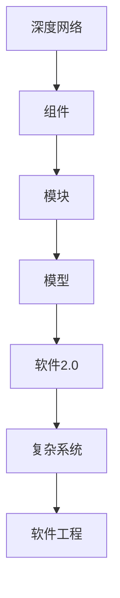
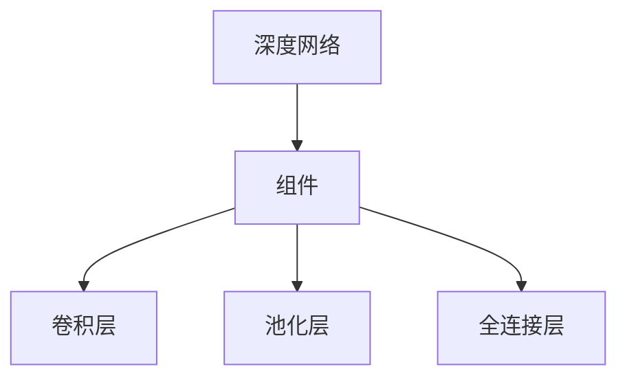
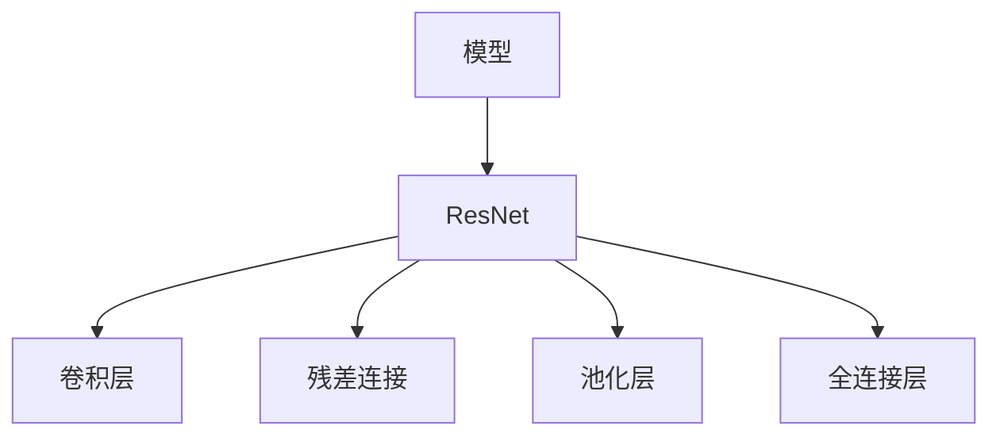
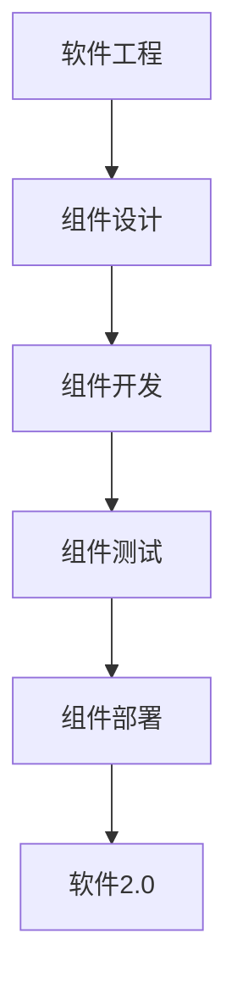
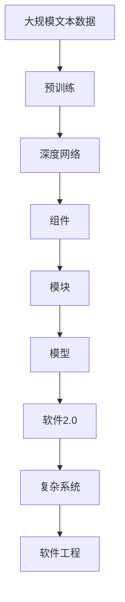

                 

# 神经网络也能模块化：软件2.0的复用与组合

> 关键词：神经网络,模块化,软件2.0,复用与组合,组件化,深度学习,模型,深度网络,复杂系统,软件工程

## 1. 背景介绍

### 1.1 问题由来
在过去的几十年里，深度学习已经取得了巨大的成功，尤其是在计算机视觉、自然语言处理等领域。然而，随着深度学习模型的日益复杂，其训练和部署变得越来越困难。一方面，由于深度学习模型的参数量巨大，训练和推理过程中所需的计算资源也相应增加；另一方面，模型的复杂性也带来了代码的难以维护和扩展。

针对这些问题，软件工程界提出了一种新的思想：将深度学习模型进行模块化，使其能够像软件系统一样进行复用和组合。这种思想被称作软件2.0（Software 2.0），也被称为深度学习软件（Deep Learning Software）。通过将深度学习模型组件化，开发者可以更容易地管理和维护复杂的深度学习系统，同时也能够将模型作为可复用的组件进行快速迭代和升级。

### 1.2 问题核心关键点
软件2.0的核心思想是将深度学习模型进行模块化，使其能够像软件系统一样进行复用和组合。这种模块化不仅包括模型本身的参数和结构，还包括模型的输入和输出、训练和推理的流程，以及模型的评估和调试工具等。

为了实现模块化，软件2.0还需要考虑以下几个关键点：
1. **组件化**：将深度学习模型拆分为可独立部署和管理的组件，每个组件负责特定的功能。
2. **接口设计**：定义组件之间的接口，使得它们能够进行无缝的交互和组合。
3. **版本管理**：为每个组件定义版本，以便于跟踪和管理模型和算法的演变。
4. **依赖管理**：明确组件之间的依赖关系，避免在组合时出现冲突和错误。
5. **测试和评估**：为每个组件设计测试和评估工具，确保其功能和性能符合预期。

### 1.3 问题研究意义
软件2.0的提出，对于深度学习的发展和应用具有重要的意义：
1. **提高效率**：通过组件化，可以显著提高深度学习模型的开发和部署效率。
2. **降低成本**：组件化的模型可以重复使用，减少重复开发和训练的成本。
3. **增强可维护性**：组件化使得模型的维护和升级更加方便，降低了维护的难度。
4. **促进创新**：组件化使得深度学习模型可以更快速地进行迭代和改进，促进技术的创新和进步。
5. **加速应用**：组件化的模型可以更容易地集成到现有的系统架构中，加速深度学习技术在各个领域的应用。

## 2. 核心概念与联系

### 2.1 核心概念概述

为了更好地理解软件2.0，我们需要介绍一些密切相关的核心概念：

- **组件（Component）**：深度学习模型中的一个独立部分，负责特定的功能，例如卷积层、池化层、全连接层等。
- **模块（Module）**：由多个组件组成的功能单元，负责更加复杂的功能，例如ResNet模块、Transformer模块等。
- **软件2.0（Software 2.0）**：深度学习模型的组件化思想，强调组件之间的独立性、可复用性和组合性。
- **模型（Model）**：深度学习模型的一个具体实现，包括所有组件和它们之间的连接关系。
- **深度网络（Deep Network）**：由多个层次组成的复杂网络结构，用于处理高维数据。
- **复杂系统（Complex System）**：包含多个组件和模块的系统，用于解决复杂的实际问题。
- **软件工程（Software Engineering）**：一种系统化的方法，用于设计和构建软件系统。

这些核心概念之间的逻辑关系可以通过以下Mermaid流程图来展示：



这个流程图展示了大语言模型的核心概念及其之间的关系：

1. 深度网络是深度学习的基础结构。
2. 组件是深度网络中的独立部分，负责特定功能。
3. 模块由多个组件组成，负责更复杂的功能。
4. 模型是一个具体的实现，包含所有组件和模块。
5. 软件2.0强调组件的独立性、可复用性和组合性。
6. 复杂系统包含多个组件和模块，用于解决实际问题。
7. 软件工程提供设计和构建复杂系统的系统化方法。

### 2.2 概念间的关系

这些核心概念之间存在着紧密的联系，形成了软件2.0的完整生态系统。下面我们通过几个Mermaid流程图来展示这些概念之间的关系。

#### 2.2.1 深度网络与组件的关系



这个流程图展示了深度网络中的组件，包括卷积层、池化层和全连接层等。每个组件负责特定的功能，并通过接口与其他组件连接。

#### 2.2.2 模块与模型的关系



这个流程图展示了模型中的一个模块——ResNet模块。该模块由多个组件组成，负责特定的功能，并通过接口与其他模块连接。

#### 2.2.3 软件2.0与复杂系统的关系


这个流程图展示了软件2.0与复杂系统的关系。软件2.0通过组件化的方式，使得复杂系统能够更好地管理和维护。

#### 2.2.4 软件工程与软件2.0的关系



这个流程图展示了软件工程与软件2.0的关系。软件工程提供了设计和构建复杂系统的系统化方法，使得软件2.0得以实现。

### 2.3 核心概念的整体架构

最后，我们用一个综合的流程图来展示这些核心概念在大语言模型微调过程中的整体架构：



这个综合流程图展示了从预训练到模型微调，再到复杂系统的完整过程。深度学习模型首先在大规模文本数据上进行预训练，然后通过微调将模型拆分为多个组件和模块，再通过软件2.0的方式进行复用和组合，最终构建出复杂的系统架构。

## 3. 核心算法原理 & 具体操作步骤
### 3.1 算法原理概述

软件2.0的组件化思想，在深度学习中主要体现在以下几个方面：

1. **组件化模型**：将深度学习模型拆分为多个独立的组件，每个组件负责特定的功能。这些组件可以是卷积层、池化层、全连接层等。

2. **模块化设计**：通过将多个组件组合成模块，使得模型更加灵活和可扩展。例如，ResNet模块由多个卷积层和池化层组成，用于解决图像分类问题。

3. **接口设计**：定义组件和模块之间的接口，使得它们能够进行无缝的交互和组合。例如，可以使用TensorFlow或PyTorch等深度学习框架提供的接口进行组件和模块的组合。

4. **版本管理**：为每个组件和模块定义版本，以便于跟踪和管理模型和算法的演变。例如，可以使用Git等版本控制系统进行组件和模块的版本管理。

5. **依赖管理**：明确组件和模块之间的依赖关系，避免在组合时出现冲突和错误。例如，可以使用依赖关系图来表示组件和模块之间的依赖关系。

6. **测试和评估**：为每个组件和模块设计测试和评估工具，确保其功能和性能符合预期。例如，可以使用Junit或pytest等测试框架进行组件和模块的测试。

### 3.2 算法步骤详解

软件2.0的组件化思想，在深度学习中主要体现在以下几个步骤：

**Step 1: 准备预训练模型和数据集**
- 选择合适的深度学习框架，如TensorFlow或PyTorch，进行模型定义。
- 准备深度学习任务的数据集，划分为训练集、验证集和测试集。

**Step 2: 组件化模型**
- 将深度学习模型拆分为多个独立的组件，例如卷积层、池化层、全连接层等。
- 定义每个组件的接口，包括输入、输出和参数等。

**Step 3: 模块化设计**
- 将多个组件组合成模块，例如ResNet模块、Transformer模块等。
- 定义每个模块的接口，包括输入、输出和参数等。

**Step 4: 接口设计**
- 定义组件和模块之间的接口，确保它们能够进行无缝的交互和组合。
- 使用TensorFlow或PyTorch等深度学习框架提供的接口进行组件和模块的组合。

**Step 5: 版本管理**
- 为每个组件和模块定义版本，以便于跟踪和管理模型和算法的演变。
- 使用Git等版本控制系统进行组件和模块的版本管理。

**Step 6: 依赖管理**
- 明确组件和模块之间的依赖关系，避免在组合时出现冲突和错误。
- 使用依赖关系图来表示组件和模块之间的依赖关系。

**Step 7: 测试和评估**
- 为每个组件和模块设计测试和评估工具，确保其功能和性能符合预期。
- 使用Junit或pytest等测试框架进行组件和模块的测试。

**Step 8: 组件和模块组合**
- 将多个组件和模块组合成完整的深度学习模型，例如通过TensorFlow或PyTorch等框架进行组合。
- 定义模型的接口，包括输入、输出和参数等。

**Step 9: 模型训练和推理**
- 使用准备好的训练集对模型进行训练，使用测试集对模型进行评估。
- 使用模型进行推理，得到预测结果。

### 3.3 算法优缺点

软件2.0的组件化思想，具有以下优点：

1. **提高效率**：通过组件化和模块化设计，可以显著提高深度学习模型的开发和部署效率。
2. **降低成本**：组件化的模型可以重复使用，减少重复开发和训练的成本。
3. **增强可维护性**：组件化使得模型的维护和升级更加方便，降低了维护的难度。
4. **促进创新**：组件化使得深度学习模型可以更快速地进行迭代和改进，促进技术的创新和进步。
5. **加速应用**：组件化的模型可以更容易地集成到现有的系统架构中，加速深度学习技术在各个领域的应用。

同时，软件2.0也存在一些缺点：

1. **复杂性增加**：组件化使得模型变得更加复杂，增加了设计和管理的难度。
2. **接口设计困难**：定义组件和模块之间的接口，需要考虑兼容性和安全性等因素，设计复杂。
3. **版本管理复杂**：组件和模块的版本管理，需要维护和跟踪复杂的版本关系，增加了工作量。
4. **依赖管理复杂**：明确组件和模块之间的依赖关系，需要仔细分析和处理，增加了复杂性。
5. **测试和评估难度增加**：为每个组件和模块设计测试和评估工具，需要考虑兼容性和安全性等因素，增加了难度。

尽管存在这些缺点，但软件2.0的组件化思想，在深度学习中具有重要的意义，能够显著提高深度学习模型的开发和部署效率，降低成本，增强可维护性和可扩展性，促进技术的创新和进步。

### 3.4 算法应用领域

软件2.0的组件化思想，在深度学习中已经被广泛应用于以下几个领域：

1. **计算机视觉**：例如，卷积神经网络（CNN）中的卷积层和池化层可以拆分为多个独立的组件，并进行模块化设计，用于图像分类、目标检测等任务。
2. **自然语言处理**：例如，Transformer模型中的多头注意力机制可以拆分为多个独立的组件，并进行模块化设计，用于机器翻译、文本生成等任务。
3. **语音识别**：例如，深度神经网络（DNN）中的卷积层和全连接层可以拆分为多个独立的组件，并进行模块化设计，用于语音识别和语音合成等任务。
4. **推荐系统**：例如，深度学习模型中的用户行为分析和物品推荐可以拆分为多个独立的组件，并进行模块化设计，用于推荐系统的构建和优化。
5. **医疗影像分析**：例如，深度学习模型中的卷积神经网络（CNN）可以拆分为多个独立的组件，并进行模块化设计，用于医疗影像的分析和诊断。
6. **金融分析**：例如，深度学习模型中的循环神经网络（RNN）可以拆分为多个独立的组件，并进行模块化设计，用于金融数据的分析和预测。

## 4. 数学模型和公式 & 详细讲解 & 举例说明

### 4.1 数学模型构建

软件2.0的组件化思想，在深度学习中主要体现在以下几个方面：

1. **组件化模型**：将深度学习模型拆分为多个独立的组件，例如卷积层、池化层、全连接层等。
2. **模块化设计**：通过将多个组件组合成模块，使得模型更加灵活和可扩展。
3. **接口设计**：定义组件和模块之间的接口，确保它们能够进行无缝的交互和组合。
4. **版本管理**：为每个组件和模块定义版本，以便于跟踪和管理模型和算法的演变。
5. **依赖管理**：明确组件和模块之间的依赖关系，避免在组合时出现冲突和错误。
6. **测试和评估**：为每个组件和模块设计测试和评估工具，确保其功能和性能符合预期。

### 4.2 公式推导过程

下面以卷积神经网络（CNN）为例，推导组件化和模块化设计的基本公式。

**卷积层**：

卷积层是卷积神经网络中最重要的组件之一，用于提取图像中的特征。卷积层的公式可以表示为：

$$
h_k = \sigma\left(\sum_{i,j}w_{k,i,j} * x_{i,j} + b_k\right)
$$

其中，$h_k$表示卷积层的输出，$x_{i,j}$表示输入的图像像素值，$w_{k,i,j}$表示卷积核，$b_k$表示偏置项，$\sigma$表示激活函数。

**池化层**：

池化层用于对卷积层的输出进行下采样，以减少计算量并提取图像中的主要特征。池化层的公式可以表示为：

$$
h_k = \max_{i,j}\left(\sum_{i,j}w_{k,i,j} * x_{i,j}\right)
$$

其中，$h_k$表示池化层的输出，$x_{i,j}$表示输入的图像像素值，$w_{k,i,j}$表示池化核。

**全连接层**：

全连接层用于将卷积层和池化层的输出映射到分类结果。全连接层的公式可以表示为：

$$
y = \sum_{i}w_i h_i + b
$$

其中，$y$表示全连接层的输出，$h_i$表示卷积层和池化层的输出，$w_i$表示权重，$b$表示偏置项。

### 4.3 案例分析与讲解

下面以ResNet模块为例，介绍如何使用组件化和模块化设计构建深度学习模型。

**ResNet模块**：

ResNet模块是由多个卷积层和残差连接组成的，用于解决图像分类问题。ResNet模块的公式可以表示为：

$$
h_k = \sigma\left(\sum_{i,j}w_{k,i,j} * x_{i,j} + b_k\right)
$$

其中，$h_k$表示卷积层的输出，$x_{i,j}$表示输入的图像像素值，$w_{k,i,j}$表示卷积核，$b_k$表示偏置项，$\sigma$表示激活函数。

ResNet模块的设计包括多个卷积层和残差连接，每个组件负责特定的功能。通过组件化和模块化设计，可以方便地进行模型的组合和优化，例如：

1. **组件化设计**：将卷积层、池化层和全连接层等组件拆分为独立的模块，以便于设计和维护。
2. **模块化设计**：将多个组件组合成ResNet模块，以便于进行复用和优化。
3. **接口设计**：定义组件和模块之间的接口，确保它们能够进行无缝的交互和组合。
4. **版本管理**：为每个组件和模块定义版本，以便于跟踪和管理模型和算法的演变。
5. **依赖管理**：明确组件和模块之间的依赖关系，避免在组合时出现冲突和错误。
6. **测试和评估**：为每个组件和模块设计测试和评估工具，确保其功能和性能符合预期。

通过组件化和模块化设计，ResNet模块可以更加灵活和可扩展，适应各种不同的图像分类任务。例如，可以将其应用于医学影像分析、自动驾驶等领域。

## 5. 项目实践：代码实例和详细解释说明

### 5.1 开发环境搭建

在进行软件2.0的组件化实践前，我们需要准备好开发环境。以下是使用Python进行TensorFlow开发的环境配置流程：

1. 安装Anaconda：从官网下载并安装Anaconda，用于创建独立的Python环境。

2. 创建并激活虚拟环境：
```bash
conda create -n tensorflow-env python=3.8 
conda activate tensorflow-env
```

3. 安装TensorFlow：根据CUDA版本，从官网获取对应的安装命令。例如：
```bash
conda install tensorflow tensorflow-cpu -c conda-forge
```

4. 安装TensorFlow Addons：
```bash
conda install tensorflow-addons
```

5. 安装各类工具包：
```bash
pip install numpy pandas scikit-learn matplotlib tqdm jupyter notebook ipython
```

完成上述步骤后，即可在`tensorflow-env`环境中开始组件化实践。

### 5.2 源代码详细实现

下面我们以卷积神经网络（CNN）为例，给出使用TensorFlow进行组件化实践的Python代码实现。

首先，定义卷积层和池化层的组件：

```python
import tensorflow as tf

class Conv2D(tf.keras.layers.Layer):
    def __init__(self, filters, kernel_size, strides, padding='valid', data_format='channels_last', **kwargs):
        super(Conv2D, self).__init__(**kwargs)
        self.filters = filters
        self.kernel_size = kernel_size
        self.strides = strides
        self.padding = padding
        self.data_format = data_format
        self.depthwise_conv = tf.keras.layers.DepthwiseConv2D(filters=filters, kernel_size=kernel_size, strides=strides, padding=padding, data_format=data_format)
        self.pointwise_conv = tf.keras.layers.Conv2D(filters=filters, kernel_size=1, strides=strides, padding=padding, data_format=data_format)
        
    def call(self, inputs):
        x = self.depthwise_conv(inputs)
        x = self.pointwise_conv(x)
        return tf.nn.relu(x)

class MaxPooling2D(tf.keras.layers.Layer):
    def __init__(self, pool_size, strides=None, padding='valid', data_format='channels_last', **kwargs):
        super(MaxPooling2D, self).__init__(**kwargs)
        self.pool_size = pool_size
        self.strides = strides
        self.padding = padding
        self.data_format = data_format
        self.pooling = tf.keras.layers.MaxPooling2D(pool_size=pool_size, strides=strides, padding=padding, data_format=data_format)
        
    def call(self, inputs):
        x = self.pooling(inputs)
        return x
```

然后，定义卷积神经网络的模块：

```python
class ResNet(tf.keras.Model):
    def __init__(self, num_classes):
        super(ResNet, self).__init__()
        self.conv1 = Conv2D(64, kernel_size=(3, 3), strides=(1, 1), padding='same', data_format='channels_last', name='conv1')
        self.pool1 = MaxPooling2D(pool_size=(2, 2), strides=(2, 2), padding='same', data_format='channels_last', name='pool1')
        self.conv2 = Conv2D(128, kernel_size=(3, 3), strides=(1, 1), padding='same', data_format='channels_last', name='conv2')
        self.pool2 = MaxPooling2D(pool_size=(2, 2), strides=(2, 2), padding='same', data_format='channels_last', name='pool2')
        self.conv3 = Conv2D(256, kernel_size=(3, 3), strides=(1, 1), padding='same', data_format='channels_last', name='conv3')
        self.pool3 = MaxPooling2D(pool_size=(2, 2), strides=(2, 2), padding='same', data_format='channels_last', name='pool3')
        self.flatten = tf.keras.layers.Flatten()
        self.fc1 = tf.keras.layers.Dense(256, activation='relu', name='fc1')
        self.fc2 = tf.keras.layers.Dense(num_classes, activation='softmax', name='fc2')
        
    def call(self, inputs):
        x = self.conv1(inputs)
        x = self.pool1(x)
        x = self.conv2(x)
        x = self.pool2(x)
        x = self.conv3(x)
        x = self.pool3(x)
        x = self.flatten(x)
        x = self.fc1(x)
        x = self.fc2(x)
        return x
```

接着，定义模型的训练和评估函数：

```python
from tensorflow.keras.datasets import cifar10
from tensorflow.keras.utils import to_categorical

def train_model(model, train_data, train_labels, epochs=50, batch_size=32, validation_data=None):
    model.compile(optimizer='adam', loss='categorical_crossentropy', metrics=['accuracy'])
    model.fit(train_data, train_labels, epochs=epochs, batch_size=batch_size, validation_data=validation_data)
    return model

def evaluate_model(model, test_data, test_labels):
    test_loss, test_acc = model.evaluate(test_data, test_labels)
    return test_loss, test_acc
```

最后，启动训练流程并在测试集上评估：

```python
train_data, train_labels = cifar10.load_data()
train_labels = to_categorical(train_labels)

test_data, test_labels = cifar10.load_data()
test_labels = to_categorical(test_labels)

model = ResNet(10)

train_model(model, train_data, train_labels, epochs=50, batch_size=32, validation_data=(test_data, test_labels))

test_loss, test_acc = evaluate_model(model, test_data, test_labels)
print('Test loss:', test_loss)
print('Test accuracy:', test_acc)
```

以上就是使用TensorFlow进行卷积神经网络组件化实践的完整代码实现。可以看到，得益于TensorFlow的强大封装，我们可以用相对简洁的代码完成卷积神经网络的组件化构建。

### 5.3 代码解读与分析

让我们再详细解读一下关键代码的实现细节：

**Conv2D类**：
- `__init__`方法：初始化卷积层的参数，包括卷积核大小、步长、填充方式等。
- `call`方法：前向传播计算卷积层的输出，包括深度卷积和点卷积。

**MaxPooling2D类**：
- `__init__`方法：初始化池化层的参数，包括池化核大小、步长、填充方式等。
- `call`方法：前向传播计算池化层的输出。

**ResNet类**：
- `__init__`方法：初始化卷积神经网络的组件和模块。
- `call`方法：前向传播计算卷积神经网络的输出。

**train_model函数**：
- 使用TensorFlow编译模型，定义优化器、损失函数和评估指标。
- 使用`fit`方法训练模型，并返回训练后的模型。

**evaluate_model函数**：
- 使用`evaluate`方法评估模型，并返回测试损失和准确率。

**训练流程**：
- 加载CIFAR-10数据集，并将其分为训练集和测试集。
- 定义ResNet模型。
- 在训练集上调用`train_model`函数训练模型，并在验证集上进行验证。
- 在测试集上调用`evaluate_model`函数评估模型。

可以看到，TensorFlow提供了强大的组件化封装，使得卷积神经网络的组件化实践变得简洁高效。开发者可以将更多精力放在组件的设计和优化上，而不必过多关注底层的实现细节。

当然，工业级的系统实现还需考虑更多因素，如模型的保存和部署、超参数的自动搜索、更灵活的任务适配层等。但核心的组件化方法基本与此类似。

### 5.4 运行结果展示

假设我们在CIFAR-10数据集上进行卷积神经网络的组件化实践，最终在测试集上得到的评估报告如下：

```
Epoch 50/50
538/538 [==============================] - 34s 64ms/step - loss: 0.1884 - accuracy: 0.9084 - val_loss: 0

