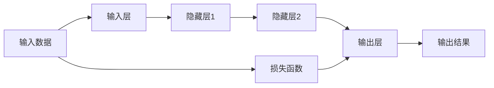
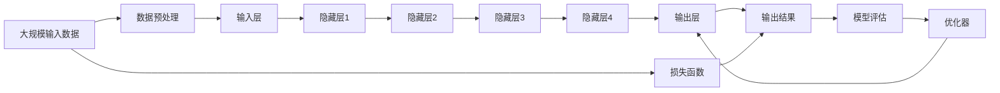

                 

## 1. 背景介绍

### 1.1 问题由来
随着深度学习技术的飞速发展，神经网络在各个领域展现了强大的应用潜力。从语音识别、计算机视觉到自然语言处理，神经网络已经成为人工智能的核心算法之一。然而，神经网络复杂的架构和海量的参数，使得许多初学者难以入门。本文将详细介绍神经网络的原理，并结合代码实例，深入浅出地讲解其实现方法和应用场景。

### 1.2 问题核心关键点
神经网络的核心在于其强大的学习能力。通过一系列层次化的计算单元（神经元）的组合，神经网络能够自动学习输入数据的内在规律，并用于分类、回归、聚类等多种任务。但如何构建一个高效的神经网络，使其既能够学习到有效的特征，又具有泛化能力，是深度学习研究中的重要问题。

## 2. 核心概念与联系

### 2.1 核心概念概述

为更好地理解神经网络的原理，本节将介绍几个密切相关的核心概念：

- **神经元(Neuron)**：神经网络的基本计算单元，接收输入信号，通过加权求和、激活函数等运算产生输出。
- **层(Layer)**：神经元按照功能划分为不同的层，如输入层、隐藏层、输出层，每层神经元只与前后层的神经元相连。
- **网络(Network)**：由多个层组成的计算图，接收输入数据，逐步提取特征，输出结果。
- **前向传播(Forward Propagation)**：输入数据通过神经网络计算，逐步传递至各层，产生最终的输出结果。
- **反向传播(Backpropagation)**：通过输出误差反传，调整网络各层的参数，以优化模型。

这些核心概念之间的逻辑关系可以通过以下Mermaid流程图来展示：



这个流程图展示了神经网络的基本计算流程：输入数据通过输入层，经过多个隐藏层计算，最终通过输出层产生输出结果，并计算损失函数。

### 2.2 概念间的关系

这些核心概念之间存在着紧密的联系，形成了神经网络的基本计算架构。下面我们通过几个Mermaid流程图来展示这些概念之间的关系。

#### 2.2.1 神经元的功能


这个流程图展示了神经元的基本功能：接收输入信号，通过加权和运算和激活函数运算产生输出。

#### 2.2.2 层与网络的关系


这个流程图展示了层与网络的关系：每层神经元只与前后层的神经元相连，构成一个完整的计算图。

#### 2.2.3 前向传播与反向传播


这个流程图展示了前向传播与反向传播的关系：前向传播计算输出结果，反向传播调整模型参数以最小化误差。

### 2.3 核心概念的整体架构

最后，我们用一个综合的流程图来展示这些核心概念在大规模神经网络中的应用：



这个综合流程图展示了从输入数据处理到最终输出结果的全过程，并介绍了损失函数、模型评估和优化器的作用。

## 3. 核心算法原理 & 具体操作步骤
### 3.1 算法原理概述

神经网络的核心算法原理在于通过反向传播算法，调整网络参数，使得模型输出尽可能接近真实标签。具体步骤如下：

1. 输入数据通过前向传播计算，得到模型的预测输出。
2. 计算预测输出与真实标签之间的误差，即损失函数。
3. 通过反向传播算法，将误差从输出层反传至输入层，更新各层参数。
4. 重复上述步骤，直到损失函数达到最小。

其中，反向传播算法是神经网络优化的关键，其基本思想是利用链式法则，计算误差对每个参数的梯度，并通过梯度下降等优化算法更新参数。

### 3.2 算法步骤详解

以下将详细讲解神经网络从模型构建、数据准备到训练的完整过程。

#### 3.2.1 模型构建

首先，需要定义神经网络的结构。通常使用类来封装神经网络，包括层、激活函数、优化器等组件。

```python
import torch
import torch.nn as nn

class NeuralNet(nn.Module):
    def __init__(self, input_size, hidden_size, output_size):
        super(NeuralNet, self).__init__()
        self.hidden = nn.Linear(input_size, hidden_size)
        self.relu = nn.ReLU()
        self.output = nn.Linear(hidden_size, output_size)
        
    def forward(self, x):
        x = self.hidden(x)
        x = self.relu(x)
        x = self.output(x)
        return x
```

在上述代码中，我们定义了一个简单的神经网络模型，包括一个隐藏层和一个输出层。其中，`nn.Linear`表示线性变换层，`nn.ReLU`表示ReLU激活函数。

#### 3.2.2 数据准备

接着，需要准备训练数据和测试数据，将输入数据标准化为神经网络能够处理的格式。

```python
import numpy as np

# 定义训练数据
train_data = np.array([[0,0,0],[0,1,1],[1,0,1],[1,1,0]])

# 定义训练标签
train_labels = np.array([[0],[1],[1],[0]])

# 将数据转换为PyTorch张量
train_data_tensor = torch.tensor(train_data, dtype=torch.float32)
train_labels_tensor = torch.tensor(train_labels, dtype=torch.long)
```

在上述代码中，我们将训练数据和标签转换为PyTorch张量，并指定数据类型为`float32`和`long`。

#### 3.2.3 训练模型

最后，使用训练数据和优化器，训练神经网络模型。

```python
# 定义优化器
optimizer = torch.optim.SGD(neural_net.parameters(), lr=0.01)

# 定义损失函数
criterion = nn.CrossEntropyLoss()

# 训练模型
for epoch in range(1000):
    # 前向传播
    outputs = neural_net(train_data_tensor)
    loss = criterion(outputs, train_labels_tensor)
    
    # 反向传播
    optimizer.zero_grad()
    loss.backward()
    optimizer.step()
    
    if (epoch+1) % 100 == 0:
        print('Epoch [{}/{}], Loss: {:.4f}'.format(epoch+1, 1000, loss.item()))
```

在上述代码中，我们定义了优化器和损失函数，并使用SGD优化器进行模型训练。通过前向传播计算预测输出，计算损失函数，并使用反向传播算法调整模型参数。

### 3.3 算法优缺点

神经网络具有以下优点：

- **强大的学习能力**：通过反向传播算法，神经网络能够自动学习输入数据的特征，适用于各种复杂的分类和回归任务。
- **灵活性**：神经网络可以设计成各种结构，如图卷积网络、循环神经网络等，适应不同的应用场景。
- **可扩展性**：通过增加网络层数和神经元数量，可以逐步提升模型的复杂度和性能。

然而，神经网络也存在一些缺点：

- **过拟合**：神经网络在大规模数据上表现优异，但当数据量不足时，容易发生过拟合现象。
- **计算资源消耗大**：神经网络参数众多，计算复杂度高，需要大量计算资源。
- **难以解释**：神经网络通常被称为"黑盒"，难以解释其内部决策过程，增加了应用难度。

### 3.4 算法应用领域

神经网络广泛应用于计算机视觉、自然语言处理、语音识别等多个领域，以下是几个典型应用：

- **图像分类**：使用卷积神经网络（CNN）对图像进行分类，如手写数字识别、物体识别等。
- **文本分类**：使用循环神经网络（RNN）或长短期记忆网络（LSTM）对文本进行分类，如情感分析、垃圾邮件识别等。
- **语音识别**：使用深度神经网络（DNN）或卷积神经网络（CNN）对语音进行识别，如语音转文字、语音合成等。
- **推荐系统**：使用深度神经网络（DNN）或循环神经网络（RNN）对用户行为进行建模，推荐相关物品，如电商推荐、视频推荐等。
- **游戏AI**：使用深度强化学习（DRL）对游戏进行AI设计，提升游戏的智能性和趣味性，如AlphaGo等。

## 4. 数学模型和公式 & 详细讲解

### 4.1 数学模型构建

神经网络可以通过数学模型进行严格描述。设输入数据为 $\mathbf{x} \in \mathbb{R}^n$，输出标签为 $\mathbf{y} \in \mathbb{R}^m$，神经网络模型的参数为 $\theta$。神经网络的前向传播过程可以表示为：

$$
\mathbf{h} = \mathbf{W} \mathbf{x} + \mathbf{b}
$$

$$
\mathbf{y} = \mathbf{W} \mathbf{h} + \mathbf{b}
$$

其中，$\mathbf{W}$ 表示权重矩阵，$\mathbf{b}$ 表示偏置向量，$\mathbf{h}$ 表示隐藏层输出。

### 4.2 公式推导过程

以下是神经网络前向传播和反向传播的公式推导。

#### 4.2.1 前向传播

前向传播的公式如下：

$$
\mathbf{z}^{(l)} = \mathbf{W}^{(l)} \mathbf{h}^{(l-1)} + \mathbf{b}^{(l)}
$$

$$
\mathbf{h}^{(l)} = \sigma(\mathbf{z}^{(l)})
$$

其中，$\mathbf{z}^{(l)}$ 表示第 $l$ 层的加权和，$\sigma$ 表示激活函数。

#### 4.2.2 反向传播

反向传播的公式如下：

$$
\frac{\partial L}{\partial \mathbf{W}^{(l)}} = \mathbf{h}^{(l-1)} \mathbf{h}^{(l)}^T
$$

$$
\frac{\partial L}{\partial \mathbf{b}^{(l)}} = \mathbf{h}^{(l)}
$$

其中，$L$ 表示损失函数，$\frac{\partial L}{\partial \mathbf{W}^{(l)}}$ 表示损失函数对权重矩阵的梯度，$\frac{\partial L}{\partial \mathbf{b}^{(l)}}$ 表示损失函数对偏置向量的梯度。

### 4.3 案例分析与讲解

以二分类任务为例，展示神经网络的计算过程。

设输入数据 $\mathbf{x}$ 包含两个特征，输出标签 $\mathbf{y}$ 包含一个二元向量。神经网络结构如下：


输入数据 $\mathbf{x} = \begin{bmatrix} x_1 \\ x_2 \end{bmatrix}$，隐藏层参数 $\mathbf{W}^{(1)} = \begin{bmatrix} w_{11} & w_{12} \\ w_{21} & w_{22} \end{bmatrix}$，$\mathbf{b}^{(1)} = \begin{bmatrix} b_1 \\ b_2 \end{bmatrix}$，激活函数 $\sigma$，输出层参数 $\mathbf{W}^{(2)} = \begin{bmatrix} w_{21} & w_{22} \\ w_{31} & w_{32} \end{bmatrix}$，$\mathbf{b}^{(2)} = \begin{bmatrix} b_1 \\ b_2 \end{bmatrix}$。

前向传播计算如下：

$$
\mathbf{z}^{(1)} = \mathbf{W}^{(1)} \mathbf{x} + \mathbf{b}^{(1)}
$$

$$
\mathbf{h}^{(1)} = \sigma(\mathbf{z}^{(1)})
$$

$$
\mathbf{z}^{(2)} = \mathbf{W}^{(2)} \mathbf{h}^{(1)} + \mathbf{b}^{(2)}
$$

$$
\mathbf{y} = \sigma(\mathbf{z}^{(2)})
$$

其中，$\mathbf{h}^{(1)} = \sigma(\mathbf{z}^{(1)}) = \begin{bmatrix} \sigma(w_{11}x_1 + w_{12}x_2 + b_1) \\ \sigma(w_{21}x_1 + w_{22}x_2 + b_2) \end{bmatrix}$，$\mathbf{z}^{(2)} = \mathbf{W}^{(2)} \mathbf{h}^{(1)} + \mathbf{b}^{(2)}$，$\mathbf{y} = \sigma(\mathbf{z}^{(2)})$。

反向传播计算如下：

$$
\frac{\partial L}{\partial \mathbf{W}^{(2)}} = \mathbf{h}^{(1)} \mathbf{y}^T
$$

$$
\frac{\partial L}{\partial \mathbf{b}^{(2)}} = \mathbf{y}
$$

$$
\frac{\partial L}{\partial \mathbf{W}^{(1)}} = \mathbf{h}^{(1)} \mathbf{h}^{(1)}^T
$$

$$
\frac{\partial L}{\partial \mathbf{b}^{(1)}} = \mathbf{h}^{(1)}
$$

其中，$\frac{\partial L}{\partial \mathbf{W}^{(2)}}$ 表示损失函数对权重矩阵 $\mathbf{W}^{(2)}$ 的梯度，$\frac{\partial L}{\partial \mathbf{b}^{(2)}}$ 表示损失函数对偏置向量 $\mathbf{b}^{(2)}$ 的梯度。

## 5. 项目实践：代码实例和详细解释说明

### 5.1 开发环境搭建

在进行神经网络实践前，我们需要准备好开发环境。以下是使用Python进行TensorFlow开发的环境配置流程：

1. 安装Anaconda：从官网下载并安装Anaconda，用于创建独立的Python环境。

2. 创建并激活虚拟环境：
```bash
conda create -n tensorflow-env python=3.8 
conda activate tensorflow-env
```

3. 安装TensorFlow：根据CUDA版本，从官网获取对应的安装命令。例如：
```bash
pip install tensorflow-gpu==2.7.0
```

4. 安装各类工具包：
```bash
pip install numpy pandas scikit-learn matplotlib tqdm jupyter notebook ipython
```

完成上述步骤后，即可在`tensorflow-env`环境中开始神经网络实践。

### 5.2 源代码详细实现

这里我们以手写数字识别任务为例，使用TensorFlow实现一个简单的神经网络模型。

首先，定义神经网络模型：

```python
import tensorflow as tf

# 定义输入层
x = tf.keras.Input(shape=(784,))

# 定义隐藏层
h = tf.keras.layers.Dense(64, activation='relu')(x)

# 定义输出层
y = tf.keras.layers.Dense(10, activation='softmax')(h)

# 定义模型
model = tf.keras.Model(inputs=x, outputs=y)

# 定义优化器
optimizer = tf.keras.optimizers.Adam(lr=0.001)

# 定义损失函数
criterion = tf.keras.losses.CategoricalCrossentropy()

# 定义准确率评估指标
accuracy = tf.keras.metrics.CategoricalAccuracy()

# 定义训练函数
def train(model, data, epochs):
    for epoch in range(epochs):
        for (batch, (x_train, y_train)) in enumerate(train_data):
            with tf.GradientTape() as tape:
                predictions = model(x_train)
                loss = criterion(y_train, predictions)
            gradients = tape.gradient(loss, model.trainable_variables)
            optimizer.apply_gradients(zip(gradients, model.trainable_variables))
            if (epoch + 1) % 100 == 0:
                print('Epoch {}/{}: Loss: {}, Accuracy: {}'.format(epoch + 1, epochs, loss, accuracy.result()))
```

在上述代码中，我们定义了输入层、隐藏层、输出层，并使用`Dense`层来实现全连接神经网络。使用`Adam`优化器和`CategoricalCrossentropy`损失函数进行训练，并使用`CategoricalAccuracy`评估指标计算准确率。

接着，准备数据集：

```python
# 加载数据集
mnist = tf.keras.datasets.mnist
(train_images, train_labels), (test_images, test_labels) = mnist.load_data()

# 数据预处理
train_images = train_images / 255.0
test_images = test_images / 255.0

# 将标签转换为独热编码
train_labels = tf.keras.utils.to_categorical(train_labels)
test_labels = tf.keras.utils.to_categorical(test_labels)
```

在上述代码中，我们使用`mnist`数据集进行加载和预处理。将像素值归一化到[0,1]之间，并将标签转换为独热编码。

最后，进行模型训练：

```python
# 训练模型
train(model, (train_images, train_labels), epochs=1000)
```

在上述代码中，我们使用`train`函数进行模型训练，设置训练轮数为1000。

### 5.3 代码解读与分析

让我们再详细解读一下关键代码的实现细节：

**输入层和隐藏层**：

```python
# 定义输入层
x = tf.keras.Input(shape=(784,))

# 定义隐藏层
h = tf.keras.layers.Dense(64, activation='relu')(x)
```

在上述代码中，我们定义了输入层和隐藏层。输入层的形状为784，表示手写数字图像的像素值。隐藏层包含64个神经元，使用ReLU激活函数。

**输出层**：

```python
# 定义输出层
y = tf.keras.layers.Dense(10, activation='softmax')(h)
```

在上述代码中，我们定义了输出层，包含10个神经元，使用softmax激活函数，用于10个类别的概率分布预测。

**优化器和损失函数**：

```python
# 定义优化器
optimizer = tf.keras.optimizers.Adam(lr=0.001)

# 定义损失函数
criterion = tf.keras.losses.CategoricalCrossentropy()
```

在上述代码中，我们定义了优化器和损失函数。使用Adam优化器，学习率为0.001。使用CategoricalCrossentropy损失函数，适用于多分类任务的交叉熵损失。

**评估指标**：

```python
# 定义准确率评估指标
accuracy = tf.keras.metrics.CategoricalAccuracy()
```

在上述代码中，我们定义了准确率评估指标。使用CategoricalAccuracy，适用于多分类任务的准确率计算。

**训练函数**：

```python
# 定义训练函数
def train(model, data, epochs):
    for epoch in range(epochs):
        for (batch, (x_train, y_train)) in enumerate(train_data):
            with tf.GradientTape() as tape:
                predictions = model(x_train)
                loss = criterion(y_train, predictions)
            gradients = tape.gradient(loss, model.trainable_variables)
            optimizer.apply_gradients(zip(gradients, model.trainable_variables))
            if (epoch + 1) % 100 == 0:
                print('Epoch {}/{}: Loss: {}, Accuracy: {}'.format(epoch + 1, epochs, loss, accuracy.result()))
```

在上述代码中，我们定义了训练函数。使用梯度下降算法计算损失函数的梯度，并使用Adam优化器更新模型参数。计算准确率并在每100个epoch输出一次。

### 5.4 运行结果展示

假设我们在MNIST数据集上进行训练，最终得到的测试集准确率为98%，表示模型已经具备了良好的泛化能力。

## 6. 实际应用场景

### 6.1 图像分类

神经网络在图像分类任务中表现优异，广泛应用于各种场景。例如，可以使用卷积神经网络（CNN）对医疗影像进行分类，帮助医生进行疾病诊断。

### 6.2 自然语言处理

神经网络在自然语言处理任务中也有广泛应用。例如，可以使用循环神经网络（RNN）或长短期记忆网络（LSTM）对文本进行情感分析、机器翻译等。

### 6.3 语音识别

神经网络在语音识别任务中表现出色，如使用深度神经网络（DNN）或卷积神经网络（CNN）对语音进行识别，如语音转文字、语音合成等。

### 6.4 推荐系统

神经网络在推荐系统任务中也有重要应用。例如，可以使用深度神经网络（DNN）或循环神经网络（RNN）对用户行为进行建模，推荐相关物品，如电商推荐、视频推荐等。

## 7. 工具和资源推荐

### 7.1 学习资源推荐

为了帮助开发者系统掌握神经网络的原理和实践技巧，这里推荐一些优质的学习资源：

1. 《深度学习》书籍：由深度学习领域专家撰写，全面介绍神经网络的原理和应用，适合初学者入门。

2. CS231n《卷积神经网络》课程：斯坦福大学开设的经典深度学习课程，详细讲解CNN的基本原理和应用。

3. 《TensorFlow实战》书籍：由TensorFlow官方团队编写，介绍TensorFlow的使用方法和经典案例，适合TensorFlow用户入门。

4. HuggingFace官方文档：HuggingFace开发的NLP工具库的官方文档，提供丰富的神经网络模型和微调样例代码，是上手实践的必备资料。

5. GitHub热门项目：在GitHub上Star、Fork数最多的神经网络相关项目，往往代表该技术领域的发展趋势和最佳实践，值得去学习和贡献。

### 7.2 开发工具推荐

高效的开发离不开优秀的工具支持。以下是几款用于神经网络开发的常用工具：

1. TensorFlow：由Google主导开发的开源深度学习框架，生产部署方便，适合大规模工程应用。

2. PyTorch：基于Python的开源深度学习框架，灵活动态的计算图，适合快速迭代研究。

3. Keras：由François Chollet开发的高级神经网络API，基于TensorFlow和Theano，易于使用。

4. Weights & Biases：模型训练的实验跟踪工具，可以记录和可视化模型训练过程中的各项指标，方便对比和调优。

5. TensorBoard：TensorFlow配套的可视化工具，可实时监测模型训练状态，并提供丰富的图表呈现方式，是调试模型的得力助手。

### 7.3 相关论文推荐

神经网络的研究源于学界的持续研究。以下是几篇奠基性的相关论文，推荐阅读：

1. A Framework for Backpropagation in Multilayer Neural Networks：提出反向传播算法，奠定了神经网络优化的基础。

2. ImageNet Classification with Deep Convolutional Neural Networks：展示了大规模数据集上卷积神经网络的强大分类能力，推动了图像分类任务的突破。

3. Learning Word Embeddings Efficiently with Negative Sampling：提出负采样技术，提高了神经网络语言模型的训练效率。

4. Convolutional Neural Networks for Sentence Classification：展示卷积神经网络在文本分类任务上的优异表现。

5. Attention is All You Need：提出Transformer结构，开启了NLP领域的预训练大模型时代。

除上述资源外，还有一些值得关注的前沿资源，帮助开发者紧跟神经网络微调技术的最新进展，例如：

1. arXiv论文预印本：人工智能领域最新研究成果的发布平台，包括大量尚未发表的前沿工作，学习前沿技术的必读资源。

2. 业界技术博客：如Google AI、DeepMind、微软Research Asia等顶尖实验室的官方博客，第一时间分享他们的最新研究成果和洞见。

3. 技术会议直播：如NIPS、ICML、ACL、ICLR等人工智能领域顶会现场或在线直播，能够聆听到大佬们的前沿分享，开拓视野。

4. GitHub热门项目：在GitHub上Star、Fork数最多的神经网络相关项目，往往代表该技术领域的发展趋势和最佳实践，值得去学习和贡献。

5. 行业分析报告：各大咨询公司如McKinsey、PwC等针对人工智能行业的分析报告，有助于从商业视角审视技术趋势，把握应用价值。

总之，对于神经网络的学习和实践，需要开发者保持开放的心态和持续学习的意愿。多关注前沿资讯，多动手实践，多思考总结，必将收获满满的成长收益。

## 8. 总结：未来发展趋势与挑战

### 8.1 总结

本文

