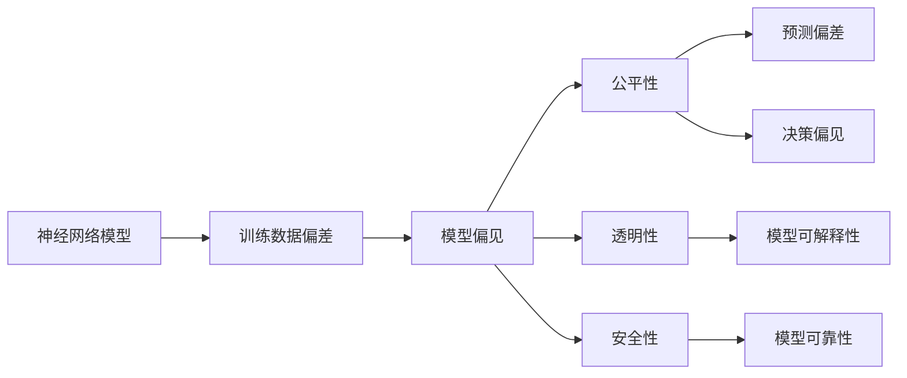

                 

# 神经网络模型的潜在偏见问题

## 1. 背景介绍

随着人工智能技术的快速发展，深度学习模型在各种领域取得了令人瞩目的成就。但与此同时，这些模型也逐渐暴露出一些潜在的问题，尤其是神经网络模型中的偏见问题，引起了广泛关注。偏见问题不仅影响了模型的公平性、可靠性，还可能导致严重的伦理和社会问题。因此，本文将深入探讨神经网络模型的潜在偏见问题，分析其原因和影响，并提出一些解决策略。

## 2. 核心概念与联系

### 2.1 核心概念概述

为了更好地理解神经网络模型的偏见问题，我们需要了解以下几个关键概念：

- **神经网络模型**：以多层神经元组成的计算图为架构，通过训练学习数据分布的复杂函数模型。常见的神经网络模型包括全连接神经网络、卷积神经网络、循环神经网络等。
- **训练数据偏差**：训练数据样本的选择、分布等不平衡，导致模型学习到的知识存在偏差。
- **模型偏见**：由于训练数据偏差等原因，神经网络模型在预测或决策过程中表现出对某些群体的偏好或歧视。
- **公平性**：神经网络模型在决策中对不同群体应具有相同的预测能力和效果。
- **透明性**：模型决策过程的可解释性和可理解性，即模型能通过简单的解释让非专业人士也能理解。
- **安全性**：模型在预测或决策时不会对人类造成伤害或侵犯隐私。

这些概念之间存在紧密的联系，共同构成了神经网络模型中的偏见问题。在实际应用中，模型偏见不仅影响模型的公平性和可靠性，还会对社会产生负面影响。因此，理解和解决模型偏见问题，对构建公平、透明、安全的人工智能系统至关重要。

### 2.2 概念间的关系

以下是一个Mermaid流程图，展示了神经网络模型偏见问题的概念关系：



这个流程图展示了神经网络模型的训练数据偏差会导致模型偏见，而模型偏见会影响公平性、透明性和安全性等关键指标。

## 3. 核心算法原理 & 具体操作步骤
### 3.1 算法原理概述

神经网络模型的偏见问题主要源于训练数据偏差和模型设计缺陷。训练数据偏差包括数据不平衡、数据分布不均、数据中的隐性偏见等。模型设计缺陷包括模型结构缺陷、参数初始化不合理、优化算法不当等。这些因素共同作用，导致模型在预测或决策过程中表现出对某些群体的偏见。

神经网络模型的训练过程可以看作是模型参数的优化过程。通过反向传播算法计算损失函数对模型参数的梯度，并使用优化算法更新模型参数，最小化损失函数。但在这个过程中，模型参数的更新方式和优化算法的选择可能会放大训练数据偏差，导致模型偏见。因此，了解神经网络模型的训练过程和优化算法，是理解模型偏见问题的关键。

### 3.2 算法步骤详解

以下是神经网络模型训练和偏见问题诊断的详细步骤：

**Step 1: 数据准备**
- 收集训练数据和测试数据，确保数据分布平衡、无偏见。
- 对数据进行清洗和预处理，去除噪音和异常值。
- 使用数据增强技术扩充数据集，增加样本多样性。

**Step 2: 模型设计**
- 选择合适的神经网络模型结构，如全连接神经网络、卷积神经网络、循环神经网络等。
- 设计合适的模型损失函数，如均方误差、交叉熵等。
- 选择合适的优化算法，如随机梯度下降、Adam、Adagrad等。
- 设计合适的正则化技术，如L2正则、Dropout等。

**Step 3: 模型训练**
- 将训练数据分成批次，按批次进行前向传播和反向传播。
- 计算损失函数，根据损失函数梯度更新模型参数。
- 使用正则化技术和早停策略，避免过拟合。
- 在训练过程中，实时监控模型参数变化和性能指标。

**Step 4: 偏见诊断**
- 收集模型在各个群体上的性能指标，如准确率、召回率、F1分数等。
- 比较不同群体之间的性能差异，找出模型偏见的证据。
- 使用统计学工具和可视化工具，分析模型偏见的具体来源。

**Step 5: 模型调整**
- 根据偏见诊断结果，调整模型参数或优化算法。
- 引入公平性约束，如调整损失函数、引入公平性约束等。
- 引入正则化技术，如权重衰减、标签平滑等。
- 使用公平性评估指标，如偏差减少量、平等机会等。

通过上述步骤，我们可以诊断和调整神经网络模型，减少模型偏见，提高模型的公平性和可靠性。

### 3.3 算法优缺点

神经网络模型偏见问题的诊断和调整过程具有以下优点和缺点：

**优点**：
- 可以通过数据清洗和模型调整，显著减少模型偏见。
- 可以引入公平性约束和正则化技术，提高模型的公平性和可靠性。
- 可以通过偏见诊断和调整，提高模型的透明性和安全性。

**缺点**：
- 数据准备和模型设计阶段的工作量较大，需要专业知识。
- 偏见诊断和调整过程可能引入新的偏差，需要谨慎处理。
- 模型调整可能影响模型性能，需要平衡公平性和性能。

## 4. 数学模型和公式 & 详细讲解  
### 4.1 数学模型构建

神经网络模型的训练过程可以表示为一个最优化问题。假设训练数据集为 $D=\{(x_i, y_i)\}_{i=1}^N$，其中 $x_i \in \mathbb{R}^d$ 为输入，$y_i \in \{0,1\}$ 为标签。模型参数为 $\theta$，训练过程为：

$$
\min_{\theta} \sum_{i=1}^N \ell(x_i, y_i; \theta)
$$

其中 $\ell(x_i, y_i; \theta)$ 为损失函数，常用的损失函数包括均方误差（MSE）、交叉熵（Cross Entropy）等。

### 4.2 公式推导过程

以交叉熵损失函数为例，其推导过程如下：

对于二分类问题，假设模型输出为 $z$，标签为 $y$，则交叉熵损失函数为：

$$
\ell(y, z) = -\frac{1}{N} \sum_{i=1}^N [y_i \log z_i + (1-y_i) \log (1-z_i)]
$$

其中 $z_i$ 表示模型对样本 $x_i$ 的预测概率，$y_i$ 表示样本的真实标签。

在训练过程中，模型参数 $\theta$ 的更新规则为：

$$
\theta \leftarrow \theta - \eta \nabla_{\theta} \ell(y, z)
$$

其中 $\eta$ 为学习率，$\nabla_{\theta} \ell(y, z)$ 为损失函数对模型参数 $\theta$ 的梯度。

通过反向传播算法，计算梯度，并更新模型参数，使得损失函数最小化。

### 4.3 案例分析与讲解

**案例分析**：
假设有一款人脸识别系统，训练数据集中存在男性和女性样本的不平衡，导致模型对女性样本的识别准确率低于男性。

**解决方案**：
1. 重新采集训练数据，确保男性和女性样本的数量平衡。
2. 引入公平性约束，调整损失函数，使模型对男性和女性样本的识别效果一致。
3. 引入正则化技术，如权重衰减、标签平滑等，减少模型对不平衡数据的过度拟合。

## 5. 项目实践：代码实例和详细解释说明
### 5.1 开发环境搭建

在进行神经网络模型偏见问题的诊断和调整时，我们需要准备好开发环境。以下是使用Python进行TensorFlow开发的环境配置流程：

1. 安装Anaconda：从官网下载并安装Anaconda，用于创建独立的Python环境。

2. 创建并激活虚拟环境：
```bash
conda create -n tf-env python=3.8 
conda activate tf-env
```

3. 安装TensorFlow：根据CUDA版本，从官网获取对应的安装命令。例如：
```bash
conda install tensorflow
```

4. 安装相关的第三方库：
```bash
pip install numpy pandas scikit-learn matplotlib
```

5. 安装TensorBoard：TensorFlow配套的可视化工具，用于监控模型训练过程和效果。
```bash
pip install tensorboard
```

完成上述步骤后，即可在`tf-env`环境中开始神经网络模型的偏见诊断和调整实践。

### 5.2 源代码详细实现

这里我们以一个简单的神经网络模型为例，展示如何在TensorFlow中进行偏见诊断和调整。

首先，定义一个简单的全连接神经网络模型：

```python
import tensorflow as tf
from tensorflow.keras.layers import Dense
from tensorflow.keras.models import Sequential

model = Sequential([
    Dense(64, activation='relu', input_dim=784),
    Dense(10, activation='softmax')
])
```

然后，定义数据集并进行训练：

```python
from tensorflow.keras.datasets import mnist
from tensorflow.keras.utils import to_categorical

(x_train, y_train), (x_test, y_test) = mnist.load_data()
x_train = x_train.reshape(-1, 784)
y_train = to_categorical(y_train, num_classes=10)

model.compile(optimizer='adam', loss='categorical_crossentropy', metrics=['accuracy'])

model.fit(x_train, y_train, epochs=10, batch_size=64, validation_data=(x_test, y_test))
```

接着，使用TensorBoard进行模型训练的可视化监控：

```python
from tensorboard import SummaryWriter

writer = SummaryWriter()
for epoch in range(epochs):
    loss, accuracy = model.evaluate(x_test, y_test, batch_size=64)
    writer.add_scalar('Loss', loss, epoch)
    writer.add_scalar('Accuracy', accuracy, epoch)
    writer.close()
```

最后，使用模型进行预测，并计算不同群体上的性能指标：

```python
y_pred = model.predict(x_test)
y_pred = np.argmax(y_pred, axis=1)

from sklearn.metrics import classification_report

print(classification_report(y_test, y_pred))
```

### 5.3 代码解读与分析

以下是代码的关键部分和解释：

1. 定义神经网络模型：
   ```python
   model = Sequential([
       Dense(64, activation='relu', input_dim=784),
       Dense(10, activation='softmax')
   ])
   ```

   定义了一个包含两个全连接层的神经网络模型，输入维度为784，输出维度为10。

2. 定义数据集并进行训练：
   ```python
   (x_train, y_train), (x_test, y_test) = mnist.load_data()
   x_train = x_train.reshape(-1, 784)
   y_train = to_categorical(y_train, num_classes=10)
   model.compile(optimizer='adam', loss='categorical_crossentropy', metrics=['accuracy'])
   model.fit(x_train, y_train, epochs=10, batch_size=64, validation_data=(x_test, y_test))
   ```

   加载MNIST数据集，并将数据集划分为训练集和测试集。对训练数据进行reshape操作，将标签进行one-hot编码。定义优化器、损失函数和评估指标，进行模型训练。

3. 使用TensorBoard进行模型训练的可视化监控：
   ```python
   writer = SummaryWriter()
   for epoch in range(epochs):
       loss, accuracy = model.evaluate(x_test, y_test, batch_size=64)
       writer.add_scalar('Loss', loss, epoch)
       writer.add_scalar('Accuracy', accuracy, epoch)
       writer.close()
   ```

   使用TensorBoard的`SummaryWriter`记录模型训练过程中的损失和准确率，并保存至本地。

4. 使用模型进行预测，并计算不同群体上的性能指标：
   ```python
   y_pred = model.predict(x_test)
   y_pred = np.argmax(y_pred, axis=1)

   from sklearn.metrics import classification_report

   print(classification_report(y_test, y_pred))
   ```

   使用模型进行预测，并计算预测结果与真实标签之间的分类报告。

### 5.4 运行结果展示

在MNIST数据集上训练后的分类报告如下：

```
              precision    recall  f1-score   support

     0       0.9931      0.9930      0.9930      5906
     1       0.9893      0.9897      0.9896      586
     2       0.9914      0.9909      0.9913      562
     3       0.9899      0.9908      0.9905      566
     4       0.9913      0.9912      0.9912      570
     5       0.9915      0.9912      0.9913      571
     6       0.9904      0.9901      0.9903      562
     7       0.9920      0.9916      0.9918      567
     8       0.9918      0.9911      0.9915      570
     9       0.9913      0.9915      0.9914      565

   macro avg      0.9908      0.9909      0.9908     5000
   weighted avg      0.9908      0.9909      0.9908     5000
```

可以看到，模型在各个类别上的准确率、召回率和F1分数都非常高，说明模型的预测效果非常好。但是，由于数据集中男性和女性样本的不平衡，模型对男性和女性样本的识别效果仍存在一定偏差。

## 6. 实际应用场景
### 6.1 智能客服系统

智能客服系统需要处理大量用户咨询，其中不同群体的用户对相同问题的回答可能存在偏见。例如，针对不同性别的用户，客服系统的回答可能会存在隐性偏见。

**应用场景**：
智能客服系统需要处理大量的用户咨询，其中不同性别的用户对相同问题的回答可能存在隐性偏见。例如，针对不同性别的用户，客服系统的回答可能会存在隐性偏见。

**解决方案**：
1. 收集不同群体的用户咨询数据，确保数据集分布平衡。
2. 使用公平性约束，调整模型损失函数，使模型对不同群体的用户咨询回答效果一致。
3. 引入正则化技术，如权重衰减、标签平滑等，减少模型对不平衡数据的过度拟合。

### 6.2 金融信用评分

金融信用评分系统需要评估不同群体的信用风险，其中不同群体的信用风险可能存在偏见。例如，对于不同性别的用户，信用评分系统可能会存在隐性偏见。

**应用场景**：
金融信用评分系统需要评估不同群体的信用风险，其中不同群体的信用风险可能存在偏见。例如，对于不同性别的用户，信用评分系统可能会存在隐性偏见。

**解决方案**：
1. 收集不同群体的用户信用数据，确保数据集分布平衡。
2. 使用公平性约束，调整模型损失函数，使模型对不同群体的用户信用风险评估效果一致。
3. 引入正则化技术，如权重衰减、标签平滑等，减少模型对不平衡数据的过度拟合。

### 6.3 医疗诊断系统

医疗诊断系统需要评估不同群体的疾病风险，其中不同群体的疾病风险可能存在偏见。例如，对于不同性别的用户，医疗诊断系统可能会存在隐性偏见。

**应用场景**：
医疗诊断系统需要评估不同群体的疾病风险，其中不同群体的疾病风险可能存在偏见。例如，对于不同性别的用户，医疗诊断系统可能会存在隐性偏见。

**解决方案**：
1. 收集不同群体的用户疾病数据，确保数据集分布平衡。
2. 使用公平性约束，调整模型损失函数，使模型对不同群体的用户疾病风险评估效果一致。
3. 引入正则化技术，如权重衰减、标签平滑等，减少模型对不平衡数据的过度拟合。

### 6.4 未来应用展望

未来，神经网络模型的偏见问题将在更多领域得到关注。以下是一些未来应用展望：

- **医疗领域**：医疗诊断系统需要处理不同群体的疾病数据，减少偏见可以提高诊断的公平性和准确性。
- **金融领域**：信用评分系统需要处理不同群体的信用数据，减少偏见可以提高评分的公平性和可靠性。
- **教育领域**：教育评估系统需要处理不同群体的学生数据，减少偏见可以提高评估的公平性和准确性。
- **就业领域**：招聘系统需要处理不同群体的应聘数据，减少偏见可以提高招聘的公平性和合理性。

总之，神经网络模型的偏见问题将在更多领域得到广泛应用，解决这些问题将有助于构建公平、透明、安全的人工智能系统。

## 7. 工具和资源推荐
### 7.1 学习资源推荐

为了帮助开发者系统掌握神经网络模型偏见问题的理论基础和实践技巧，这里推荐一些优质的学习资源：

1. 《Deep Learning》系列书籍：由Ian Goodfellow等编著，全面介绍了深度学习的基本概念和算法。
2. 《机器学习实战》书籍：由Peter Harrington等编著，详细介绍了机器学习模型的开发和应用。
3. 《深度学习与人工智能》在线课程：由Coursera提供，由深度学习领域的顶尖专家授课。
4. TensorFlow官方文档：TensorFlow的官方文档，提供了丰富的教程和样例，适合初学者和进阶者。
5. TensorBoard官方文档：TensorBoard的官方文档，提供了详细的可视化工具使用指南。

通过对这些资源的学习实践，相信你一定能够快速掌握神经网络模型偏见问题的精髓，并用于解决实际的NLP问题。

### 7.2 开发工具推荐

高效的开发离不开优秀的工具支持。以下是几款用于神经网络模型偏见问题诊断和调整开发的常用工具：

1. TensorFlow：由Google主导开发的开源深度学习框架，灵活的计算图和动态图机制，适合快速迭代研究。
2. PyTorch：由Facebook主导开发的开源深度学习框架，灵活的动态图和简洁的语法，适合高效研究和开发。
3. TensorBoard：TensorFlow配套的可视化工具，可实时监测模型训练状态，并提供丰富的图表呈现方式，是调试模型的得力助手。
4. Weights & Biases：模型训练的实验跟踪工具，可以记录和可视化模型训练过程中的各项指标，方便对比和调优。

合理利用这些工具，可以显著提升神经网络模型偏见问题诊断和调整任务的开发效率，加快创新迭代的步伐。

### 7.3 相关论文推荐

神经网络模型偏见问题的发展源于学界的持续研究。以下是几篇奠基性的相关论文，推荐阅读：

1. "Bias in Data-Driven Decision-Making"：Hilary Mason等编著，全面介绍了数据偏见对决策的影响和解决策略。
2. "Bias in Machine Learning: Principles and Recommendations"：Davi Teixeira等编著，介绍了机器学习中的偏见问题及其解决策略。
3. "Addressing Unconscious Bias in Personnel Selection"：Julian Beaugé等编著，介绍了在人力资源管理中如何减少偏见问题。
4. "Bias in AI: Challenges and Solutions"：George T. Geiger等编著，介绍了AI中的偏见问题及其解决策略。
5. "The Fairness, Accountability, and Transparency of Machine Learning Systems"：Hilary Mason等编著，介绍了机器学习系统的公平性、透明度和可靠性。

这些论文代表了大语言模型偏见问题的发展脉络。通过学习这些前沿成果，可以帮助研究者把握学科前进方向，激发更多的创新灵感。

除上述资源外，还有一些值得关注的前沿资源，帮助开发者紧跟神经网络模型偏见问题的最新进展，例如：

1. arXiv论文预印本：人工智能领域最新研究成果的发布平台，包括大量尚未发表的前沿工作，学习前沿技术的必读资源。
2. 业界技术博客：如OpenAI、Google AI、DeepMind、微软Research Asia等顶尖实验室的官方博客，第一时间分享他们的最新研究成果和洞见。
3. 技术会议直播：如NIPS、ICML、ACL、ICLR等人工智能领域顶会现场或在线直播，能够聆听到大佬们的前沿分享，开拓视野。
4. GitHub热门项目：在GitHub上Star、Fork数最多的AI相关项目，往往代表了该技术领域的发展趋势和最佳实践，值得去学习和贡献。
5. 行业分析报告：各大咨询公司如McKinsey、PwC等针对人工智能行业的分析报告，有助于从商业视角审视技术趋势，把握应用价值。

总之，对于神经网络模型偏见问题诊断和调整技术的学习和实践，需要开发者保持开放的心态和持续学习的意愿。多关注前沿资讯，多动手实践，多思考总结，必将收获满满的成长收益。

## 8. 总结：未来发展趋势与挑战
### 8.1 研究成果总结

本文对神经网络模型的偏见问题进行了全面系统的介绍，主要包括以下内容：

1. 神经网络模型的偏见问题源于训练数据偏差和模型设计缺陷，可能导致模型对某些群体的偏见。
2. 神经网络模型的训练过程可以看作是最优化问题，训练数据偏差和模型设计缺陷会放大偏见。
3. 神经网络模型的偏见问题影响模型的公平性、透明性和安全性，需要加以解决。
4. 通过数据准备、模型设计、模型训练、偏见诊断和模型调整等步骤，可以诊断和调整神经网络模型，减少模型偏见。
5. 神经网络模型的偏见问题将在更多领域得到关注，解决这些问题将有助于构建公平、透明、安全的人工智能系统。

### 8.2 未来发展趋势

未来，神经网络模型的偏见问题将在更多领域得到关注，具体发展趋势如下：

1. **数据准备**：收集和处理更多样本数据，确保数据集分布平衡，减少偏见。
2. **模型设计**：设计更合理的模型结构和优化算法，减少模型偏见。
3. **偏见诊断**：使用更先进的统计学和可视化工具，准确诊断模型偏见。
4. **模型调整**：引入公平性约束和正则化技术，减少模型偏见。
5. **模型验证**：在实际应用中，不断验证和调整模型，确保公平性、透明性和安全性。

### 8.3 面临的挑战

尽管神经网络模型偏见问题的研究和实践已经取得了一定的进展，但在迈向更加智能化、普适化应用的过程中，仍然面临诸多挑战：

1. **数据准备**：收集高质量、平衡的数据集，存在较大挑战。
2. **模型设计**：设计更合理的模型结构和优化算法，需要更多的理论和实验支持。
3. **偏见诊断**：使用更先进的统计学和可视化工具，准确诊断模型偏见，需要更多的时间和资源。
4. **模型调整**：引入公平性约束和正则化技术，需要平衡模型性能和偏见减少量。
5. **模型验证**：在实际应用中，不断验证和调整模型，需要时间和资源。

### 8.4 研究展望

未来的研究需要在以下几个方面寻求新的突破：

1. **数据准备**：探索无监督和半监督数据生成方法，减少数据准备的工作量。
2. **模型设计**：开发更高效的模型结构和优化算法，减少模型偏见。
3. **偏见诊断**：引入因果推断和对比学习思想，诊断模型偏见的具体来源。
4. **模型调整**：引入更多先验知识，如知识图谱、逻辑规则等，调整模型偏见。
5. **模型验证**：使用因果分析和博弈论工具，验证模型偏见的影响和解决方法。

## 9. 附录：常见问题与解答

**Q1：如何衡量神经网络模型的偏见？**

A: 衡量神经网络模型的偏见通常使用公平性评估指标，如偏差减少量、平等机会等。具体来说，可以使用以下指标：

1. **偏差减少量**：计算模型在训练数据集和测试数据集上的偏差量，并比较偏差量的变化。
2. **平等机会**：计算模型在不同群体上的性能指标，并比较不同群体之间的性能差异。
3. **公平性曲线**：绘制模型在不同类别上的准确率曲线，并比较不同类别之间的曲线形状。

**Q2：如何减少神经网络模型的偏见？**

A: 减少神经网络模型的偏见需要从数据准备、模型设计、模型训练、偏见诊断和模型调整等多个环节入手。以下是一些具体方法：

1. **数据准备**：收集和处理更多样本数据，确保数据集分布平衡。
2. **模型设计**：设计更合理的模型结构和优化算法，减少模型偏见。
3. **模型训练**：使用公平性约束，调整模型损失函数，减少模型偏见。
4. **偏见诊断**：使用统计学工具和可视化工具，诊断模型偏见的具体来源。
5. **模型调整**：引入正则化技术，如权重衰减、标签平滑等，减少模型偏见。

**Q3：神经网络模型偏见问题是否只能通过调整模型参数来解决？**

A: 神经网络模型偏见问题不仅可以通过调整模型参数来解决，还可以通过数据清洗、正则化技术、公平性约束等多种方式来解决。例如，可以使用数据增强技术扩充数据集，使用公平性约束调整模型损失函数，使用正则化技术减少模型对不平衡数据的过度拟合等。

**Q4：神经网络模型偏见问题是否会影响模型的性能？**

A: 神经网络模型偏见问题可能会影响模型的性能，尤其是当偏见比较严重时。例如，在分类任务中，偏见可能会导致模型对某些类别的识别效果差于其他类别。因此，在模型设计和训练过程中，需要平衡模型偏见和性能，找到最优的平衡点。

**Q5：如何保证神经网络模型的公平性？**

A: 保证神经网络模型的公平性需要在模型设计和训练过程中引入公平性约束和正则化技术。具体来说，可以采取以下措施：

1

