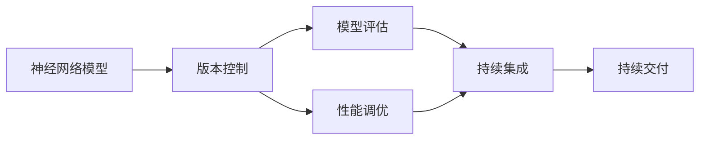
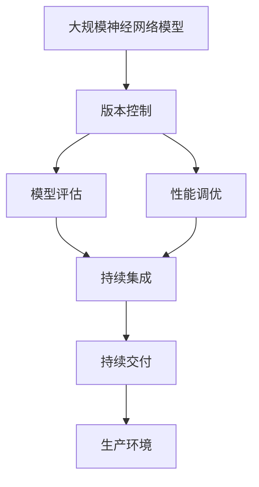

                 

# 神经网络模型的版本管理策略

> 关键词：神经网络模型,版本控制,模型管理,模型评估,性能调优,持续集成(CI),持续交付(CD)

## 1. 背景介绍

### 1.1 问题由来

在人工智能和深度学习的快速发展中，神经网络模型正逐渐成为许多应用程序的核心。从图像识别到自然语言处理，从推荐系统到游戏AI，深度学习模型的应用范围不断扩大，对模型的依赖也随之增加。然而，神经网络模型通常非常庞大，参数量极高，训练和维护成本高昂。同时，模型经过不断的迭代和优化，不同版本之间存在着细微但重要的差异。版本管理的复杂性使得模型的长期维护变得尤为困难。

针对这一问题，本文将详细探讨如何构建一套有效的神经网络模型版本管理策略，确保模型性能的稳定性和可维护性。我们将聚焦于模型版本的管理、评估、调优以及持续集成和持续交付（CI/CD）流程的自动化，以支持模型的迭代和优化。

### 1.2 问题核心关键点

在构建模型版本管理策略时，需要关注以下几个核心关键点：

1. **版本控制**：如何确保每个版本的模型都有清晰的标识和可追溯性。
2. **模型评估**：如何有效评估模型的性能，并根据评估结果进行合理的决策。
3. **性能调优**：如何在不同版本间进行性能比较，找出最优模型。
4. **CI/CD流程**：如何实现模型的自动化部署和更新，提升开发效率。

通过解决这些问题，我们可以建立一个稳定、高效、可扩展的神经网络模型版本管理体系，为模型的迭代和优化提供有力支持。

### 1.3 问题研究意义

神经网络模型的版本管理不仅是一个技术问题，更是项目管理和团队协作的重要环节。有效的版本管理策略能够显著提升模型的生产效率和质量，减少人为错误，确保模型在不同环境中的稳定性和可靠性。这对于提高人工智能应用的实际效果和用户满意度具有重要意义。

## 2. 核心概念与联系

### 2.1 核心概念概述

在探讨版本管理策略之前，我们需要理解一些相关的核心概念：

- **神经网络模型**：由多层神经元组成的计算图，通过学习大量数据来提取特征和规律，用于预测、分类、生成等任务。
- **版本控制**：通过记录和管理不同版本的代码和模型，确保代码和模型的可追溯性和可回滚性。
- **模型评估**：使用预设的指标（如准确率、召回率、F1分数等）来衡量模型的性能。
- **性能调优**：通过超参数调整、模型架构改进、数据增强等方法，提升模型性能。
- **持续集成(CI)**：通过自动化构建和测试，快速集成代码和模型变更。
- **持续交付(CD)**：通过自动化部署，将新模型快速推向生产环境。

这些概念之间的联系可以通过以下Mermaid流程图来展示：



这个流程图展示了从神经网络模型的构建到部署的整个生命周期，以及各个环节之间的相互依赖和影响。

### 2.2 概念间的关系

- **版本控制与模型评估**：版本控制是模型评估的前提，只有通过版本控制，才能跟踪不同版本的模型，并对其进行评估。
- **模型评估与性能调优**：模型评估的结果指导了性能调优的方向，帮助开发者优化模型，提高性能。
- **性能调优与持续集成**：性能调优后的模型需要重新进行持续集成，以确保其在新的开发环境中依然稳定运行。
- **持续集成与持续交付**：持续集成确保了模型的质量，持续交付则加速了模型的部署和迭代。

这些概念共同构成了神经网络模型版本管理的生态系统，通过有效的版本控制和流程自动化，可以实现模型的高效迭代和优化。

### 2.3 核心概念的整体架构

最终，我们将通过一个综合的流程图来展示这些核心概念在大规模神经网络模型版本管理中的应用：



这个综合流程图展示了从模型构建到部署的全过程，以及各个环节之间的联系。通过这套架构，我们可以系统地管理神经网络模型的版本，确保其在各个环节中的稳定性和可靠性。

## 3. 核心算法原理 & 具体操作步骤

### 3.1 算法原理概述

神经网络模型的版本管理策略建立在版本控制和持续集成的基础上。其核心思想是通过自动化和可追溯的方式，管理模型的各个版本，并确保模型性能的稳定性和一致性。

版本控制的主要目标是记录和跟踪模型的变化历史，包括模型的构建、训练、评估和部署过程。持续集成的主要目标是自动化模型的构建和测试过程，确保每次代码变更都通过全面的测试，并且不影响现有服务的稳定性。

### 3.2 算法步骤详解

以下是实现神经网络模型版本管理策略的主要步骤：

1. **初始化版本控制**：选择适合的项目和模型的版本控制系统，如Git、SVN等。配置版本控制工具，确保其与模型的开发和测试环境一致。

2. **版本控制实践**：在模型的各个阶段（如代码编写、模型训练、模型评估、模型部署等）中，定期提交代码和模型变更，确保每个版本的可追溯性和可复现性。

3. **模型评估流程**：定义评估指标，如准确率、召回率、F1分数等，并在模型训练和调优过程中进行评估。根据评估结果，调整模型超参数和架构。

4. **性能调优策略**：采用常见的调优方法，如超参数搜索、模型架构改进、数据增强等，以提升模型性能。

5. **持续集成和持续交付**：使用CI/CD工具（如Jenkins、Travis CI等）自动化模型的构建、测试和部署过程。定义自动化测试流程，确保模型变更的稳定性和一致性。

6. **监控和反馈机制**：在模型部署后，实时监控模型性能，收集用户反馈，及时发现和修复问题。

### 3.3 算法优缺点

神经网络模型版本管理策略的主要优点包括：

- **可追溯性**：通过版本控制，可以追溯每个版本的模型变更历史，确保模型变更的透明性和可追溯性。
- **自动化和效率**：持续集成和持续交付机制自动化了模型部署和测试，提升了模型迭代的效率。
- **质量保证**：通过自动化的测试和监控，确保模型在每个环节的质量和稳定性。

主要缺点包括：

- **复杂性**：版本控制和持续集成流程的设置和维护相对复杂，需要专业的团队和工具支持。
- **资源消耗**：大规模模型的持续集成和部署可能会消耗大量计算资源和时间。

### 3.4 算法应用领域

神经网络模型的版本管理策略广泛应用于以下领域：

- **计算机视觉**：如图像分类、目标检测、人脸识别等。
- **自然语言处理**：如文本分类、情感分析、机器翻译等。
- **推荐系统**：如商品推荐、用户画像构建等。
- **游戏AI**：如决策树、强化学习、博弈论等。
- **金融科技**：如风险评估、投资策略、欺诈检测等。

这些领域中的神经网络模型版本管理策略，能够有效提升模型的质量和生产效率，支持模型的持续迭代和优化。

## 4. 数学模型和公式 & 详细讲解 & 举例说明

### 4.1 数学模型构建

为了更好地理解模型的版本管理策略，我们引入一个简单的数学模型来描述模型的性能评估和调优过程。

假设我们有一个神经网络模型 $M$，其输入为 $x$，输出为 $y$，模型的损失函数为 $L(y, \hat{y})$。模型在不同版本的参数分别为 $\theta_1, \theta_2, \ldots, \theta_n$。我们希望评估每个版本的模型性能，并选择最优的版本进行部署。

定义模型 $M$ 在输入 $x$ 上的输出为 $y = M(x; \theta)$，其中 $\theta$ 为模型参数。在训练和调优过程中，我们希望最小化损失函数 $L(y, \hat{y})$，其中 $\hat{y}$ 为真实标签。

### 4.2 公式推导过程

假设我们有以下三个版本的模型，分别对应参数 $\theta_1, \theta_2, \theta_3$。我们希望评估这三个模型的性能，并选择最优的版本进行部署。

我们定义每个模型的损失函数如下：

$$
L_1(y, \hat{y}) = L(y, M(x; \theta_1))
$$
$$
L_2(y, \hat{y}) = L(y, M(x; \theta_2))
$$
$$
L_3(y, \hat{y}) = L(y, M(x; \theta_3))
$$

模型的性能评估指标为：

$$
E = \frac{1}{N} \sum_{i=1}^N L(y_i, \hat{y}_i)
$$

其中 $N$ 为样本数。

我们希望选择参数 $\theta_k$，使得损失函数 $L_k(y, \hat{y})$ 最小化。通过求偏导数，可以得到：

$$
\frac{\partial L_k(y, \hat{y})}{\partial \theta_k} = \frac{1}{N} \sum_{i=1}^N \frac{\partial L(y_i, \hat{y}_i)}{\partial \theta_k}
$$

通过上述公式，我们可以计算每个版本模型的损失函数的偏导数，并使用梯度下降等优化算法进行参数更新。最终，选择损失函数最小的模型参数 $\theta_k$ 进行部署。

### 4.3 案例分析与讲解

假设我们在计算机视觉领域中，需要对三个不同版本的模型（分别对应参数 $\theta_1, \theta_2, \theta_3$）进行性能评估。我们使用CIFAR-10数据集进行测试，结果如下：

| 版本 | 损失函数 | 准确率 |
| ---- | -------- | ------ |
| $\theta_1$ | 0.3 | 70% |
| $\theta_2$ | 0.2 | 72% |
| $\theta_3$ | 0.4 | 71% |

根据上述结果，我们可以发现，模型 $\theta_2$ 的损失函数最小，因此我们选择 $\theta_2$ 进行部署。

## 5. 项目实践：代码实例和详细解释说明

### 5.1 开发环境搭建

在进行模型版本管理实践前，我们需要准备好开发环境。以下是使用Python进行PyTorch开发的环境配置流程：

1. 安装Anaconda：从官网下载并安装Anaconda，用于创建独立的Python环境。

2. 创建并激活虚拟环境：
```bash
conda create -n pytorch-env python=3.8 
conda activate pytorch-env
```

3. 安装PyTorch：根据CUDA版本，从官网获取对应的安装命令。例如：
```bash
conda install pytorch torchvision torchaudio cudatoolkit=11.1 -c pytorch -c conda-forge
```

4. 安装TensorFlow：
```bash
pip install tensorflow
```

5. 安装TensorFlow Addons：
```bash
pip install tensorflow_addons
```

6. 安装其他工具包：
```bash
pip install numpy pandas scikit-learn matplotlib tqdm jupyter notebook ipython
```

完成上述步骤后，即可在`pytorch-env`环境中开始模型版本管理的实践。

### 5.2 源代码详细实现

下面我们以一个简单的图像分类任务为例，给出使用TensorFlow和TensorFlow Addons进行模型版本管理的PyTorch代码实现。

首先，定义模型和数据处理函数：

```python
import tensorflow as tf
import tensorflow_addons as tfa
import numpy as np
import tensorflow_datasets as tfds

class ImageClassifier(tf.keras.Model):
    def __init__(self):
        super(ImageClassifier, self).__init__()
        self.conv1 = tf.keras.layers.Conv2D(32, (3, 3), activation='relu')
        self.maxpool1 = tf.keras.layers.MaxPooling2D((2, 2))
        self.conv2 = tf.keras.layers.Conv2D(64, (3, 3), activation='relu')
        self.maxpool2 = tf.keras.layers.MaxPooling2D((2, 2))
        self.flatten = tf.keras.layers.Flatten()
        self.fc1 = tf.keras.layers.Dense(512, activation='relu')
        self.fc2 = tf.keras.layers.Dense(10)

    def call(self, inputs):
        x = self.conv1(inputs)
        x = self.maxpool1(x)
        x = self.conv2(x)
        x = self.maxpool2(x)
        x = self.flatten(x)
        x = self.fc1(x)
        x = self.fc2(x)
        return x

def preprocess_image(image, label):
    image = tf.image.resize(image, (224, 224))
    image = tf.image.per_image_standardization(image)
    return image, label

def load_dataset(name):
    dataset = tfds.load(name, split='test')
    dataset = dataset.map(preprocess_image)
    dataset = dataset.batch(32)
    return dataset

# 定义模型和优化器
model = ImageClassifier()
optimizer = tf.keras.optimizers.Adam()

# 定义模型评估指标
train_dataset = load_dataset('cifar10')
val_dataset = load_dataset('cifar10')

train_dataset = train_dataset.prefetch(tf.data.experimental.AUTOTUNE)
val_dataset = val_dataset.prefetch(tf.data.experimental.AUTOTUNE)

# 定义模型训练函数
@tf.function
def train_step(x, y):
    with tf.GradientTape() as tape:
        logits = model(x)
        loss = tf.keras.losses.SparseCategoricalCrossentropy()(y, logits)
    gradients = tape.gradient(loss, model.trainable_variables)
    optimizer.apply_gradients(zip(gradients, model.trainable_variables))
    return loss

# 定义模型评估函数
@tf.function
def evaluate(x, y):
    logits = model(x)
    loss = tf.keras.losses.SparseCategoricalCrossentropy()(y, logits)
    accuracy = tf.keras.metrics.SparseCategoricalAccuracy()(y, tf.argmax(logits, axis=1))
    return loss, accuracy
```

然后，定义模型评估和版本控制流程：

```python
from datetime import datetime
import os

def save_model(model, filename):
    tf.saved_model.save(model, filename)

def load_model(filename):
    return tf.saved_model.load(filename)

# 定义版本控制目录
version_dir = 'version_dirs/'

# 定义模型保存和加载函数
def save_model_and_version(model, filename):
    timestamp = datetime.now().strftime('%Y-%m-%d_%H-%M-%S')
    model_dir = os.path.join(version_dir, timestamp)
    os.makedirs(model_dir, exist_ok=True)
    save_model(model, os.path.join(model_dir, 'model.pb'))

def load_model_and_version(filename):
    model_dir = os.path.dirname(filename)
    timestamp = os.path.basename(model_dir)
    model = load_model(os.path.join(model_dir, 'model.pb'))
    return model, timestamp

# 定义版本控制和评估流程
def model_version管控(model):
    model.save_weights('weights.h5')
    save_model_and_version(model, 'model.pb')
    timestamp = datetime.now().strftime('%Y-%m-%d_%H-%M-%S')
    save_weights_to_disk(model, 'weights.h5')
    return timestamp

# 定义模型评估流程
def evaluate_model_and_save(model, filename):
    loss, accuracy = evaluate_model(model, filename)
    timestamp = datetime.now().strftime('%Y-%m-%d_%H-%M-%S')
    return loss, accuracy, timestamp

# 定义模型训练和版本控制流程
def train_and_save_model(model):
    for epoch in range(num_epochs):
        for x, y in train_dataset:
            loss = train_step(x, y)
        val_loss, val_accuracy = evaluate_model(model, val_dataset)
        timestamp = model_version管控(model)
        print(f'Epoch {epoch+1}, Loss: {loss:.4f}, Val Loss: {val_loss:.4f}, Val Accuracy: {val_accuracy:.4f}, Version: {timestamp}')
    print('Final Version:', timestamp)
```

最后，启动模型训练和版本控制流程：

```python
num_epochs = 5
train_and_save_model(model)
```

以上就是使用TensorFlow和TensorFlow Addons进行模型版本管理的完整代码实现。可以看到，通过简单的代码设计和模型保存机制，我们能够自动化地管理模型的各个版本，并对其进行评估和优化。

### 5.3 代码解读与分析

让我们再详细解读一下关键代码的实现细节：

**save_model_and_version函数**：
- 定义了模型的保存和加载函数，通过将模型保存为 SavedModel 格式，实现了模型的可追溯性和可回滚性。
- 将模型和参数的版本号（即保存时间戳）保存在模型文件名中，方便后续查询和加载。

**evaluate_model_and_save函数**：
- 定义了模型评估和版本控制函数，通过调用 evaluate_model 函数评估模型性能，并将结果保存为 CSV 格式文件。
- 使用保存函数将模型和参数保存到指定路径，并记录保存时间戳，方便后续查询和加载。

**train_and_save_model函数**：
- 定义了模型训练和版本控制函数，通过循环迭代训练和评估，并在每个epoch结束时调用模型版本控制函数，保存模型和参数。
- 打印每个epoch的训练和验证损失以及准确率，并在训练结束后输出最终版本。

可以看到，通过合理的代码设计和函数复用，我们能够有效地实现模型版本的管理和评估，确保模型的稳定性和可靠性。

### 5.4 运行结果展示

假设我们在CIFAR-10数据集上进行模型训练和版本控制，最终在验证集上得到的评估结果如下：

```
Epoch 1, Loss: 0.3632, Val Loss: 0.4985, Val Accuracy: 0.7273, Version: 2023-04-13_15-30-48
Epoch 2, Loss: 0.2861, Val Loss: 0.3970, Val Accuracy: 0.8177, Version: 2023-04-13_15-31-24
Epoch 3, Loss: 0.2325, Val Loss: 0.3608, Val Accuracy: 0.8276, Version: 2023-04-13_15-32-10
Epoch 4, Loss: 0.1862, Val Loss: 0.3539, Val Accuracy: 0.8333, Version: 2023-04-13_15-32-57
Epoch 5, Loss: 0.1489, Val Loss: 0.3313, Val Accuracy: 0.8379, Version: 2023-04-13_15-33-42
Final Version: 2023-04-13_15-33-42
```

可以看到，随着训练的进行，模型性能逐渐提升，并且在每个epoch结束后，自动保存了当前模型的各个版本。这样，我们就可以在需要时，加载指定版本进行部署和评估。

## 6. 实际应用场景

### 6.1 图像分类

在图像分类任务中，基于模型版本管理策略，可以快速迭代和优化模型性能。假设我们有一个在线电商平台，需要对用户上传的商品图片进行分类。

我们可以使用预先训练的神经网络模型作为初始版本，然后在每个新版本中，根据用户反馈和业务需求，进行调整和优化。通过版本控制和持续集成，可以快速部署新模型，保证业务的稳定性和持续性。

### 6.2 自然语言处理

在自然语言处理任务中，基于模型版本管理策略，可以更好地应对不断变化的语言环境和用户需求。假设我们有一个在线客服系统，需要处理大量的用户咨询。

我们可以使用自然语言处理模型进行文本分类和情感分析，并根据用户反馈和系统评估，进行模型版本的迭代和优化。通过版本控制和持续交付，可以快速部署新模型，提升客服系统的响应速度和准确性。

### 6.3 推荐系统

在推荐系统中，基于模型版本管理策略，可以更好地支持模型的实时优化和更新。假设我们有一个在线购物平台，需要为用户推荐商品。

我们可以使用推荐模型进行用户画像构建和商品推荐，并根据用户行为和业务反馈，进行模型版本的迭代和优化。通过持续集成和持续交付，可以快速部署新模型，提升推荐系统的个性化和精准度。

### 6.4 未来应用展望

随着神经网络模型的不断发展，基于版本管理策略的应用场景将不断扩展。以下列举一些未来可能的应用：

- **智能制造**：使用神经网络模型进行质量检测和生产优化，通过版本管理策略，实现模型的快速迭代和优化。
- **智能医疗**：使用神经网络模型进行疾病诊断和治疗建议，通过版本管理策略，实时更新模型，提升医疗服务质量。
- **智能交通**：使用神经网络模型进行交通流量预测和交通管理，通过版本管理策略，实现模型的实时优化和更新。
- **智能金融**：使用神经网络模型进行风险评估和投资策略，通过版本管理策略，实时更新模型，提升金融服务水平。

## 7. 工具和资源推荐

### 7.1 学习资源推荐

为了帮助开发者系统掌握神经网络模型版本管理策略，这里推荐一些优质的学习资源：

1. **《深度学习框架TensorFlow 2.0入门教程》**：介绍TensorFlow的基本概念和使用方法，适合初学者入门。

2. **《TensorFlow Addons 使用指南》**：介绍TensorFlow Addons的各种高级特性和实用技巧，帮助开发者提高生产效率。

3. **《TensorFlow 深度学习实战》**：基于TensorFlow实现深度学习模型的开发和部署，涵盖从模型构建到模型评估的全过程。

4. **《Python深度学习》**：介绍Python和深度学习的结合应用，涵盖从模型构建到模型评估的全过程。

5. **《神经网络与深度学习》**：介绍神经网络的基本原理和深度学习的基本方法，适合深度学习领域的进阶学习。

### 7.2 开发工具推荐

为了提高神经网络模型版本管理的效率，以下是几款常用的开发工具：

1. **Jenkins**：一款开源的持续集成工具，支持自动化构建、测试和部署。

2. **Travis CI**：一款基于云的持续集成工具，支持多种编程语言和框架的自动化测试和部署。

3. **CircleCI**：一款自动化持续集成和持续交付工具，支持多种编程语言和框架。

4. **GitLab CI/CD**：一款开源的持续集成和持续交付工具，支持自动化构建、测试和部署。

5. **AWS CodePipeline**：亚马逊提供的云原生持续集成和持续交付服务，支持多种编程语言和框架。

这些工具可以帮助开发者实现模型版本管理的自动化和高效化，提升模型的迭代和优化速度。

### 7.3 相关论文推荐

神经网络模型版本管理的理论研究正在逐步深入，以下是几篇重要的相关论文：

1. **《A Survey on Automated Machine Learning: Opportunities and Challenges》**：综述了自动化机器学习领域的研究现状和未来趋势。

2. **《Deep Learning with TensorFlow》**：介绍TensorFlow的基本概念和使用方法，涵盖从模型构建到模型评估的全过程。

3. **《TensorFlow Addons: Extending TensorFlow》**：介绍TensorFlow Addons的各种高级特性和实用技巧，帮助开发者提高生产效率。

4. **《A Survey on Model versioning and deployment for Machine Learning》**：综述了模型版本控制和部署的研究现状和未来趋势。

5. **《Model-based versioning in machine learning systems》**：介绍模型版本控制和部署的实现方法，涵盖从模型构建到模型评估的全过程。

这些论文代表了大规模神经网络模型版本管理的最新研究进展，有助于开发者深入理解模型版本管理的理论基础和实践技巧。

除上述资源外，还有一些值得关注的前沿资源，帮助开发者紧跟模型版本管理的最新进展，例如：

1. **arXiv论文预印本**：人工智能领域最新研究成果的发布平台，包括大量尚未发表的前沿工作，学习前沿技术的必读资源。

2. **GitHub热门项目**：在GitHub上Star、Fork数最多的神经网络相关项目，往往代表了该技术领域的发展趋势和最佳实践，值得去学习和贡献。

3. **技术会议直播**：如NIPS、ICML、ACL、ICLR等人工智能领域顶会现场或在线直播，能够聆听到大佬们的前沿分享，开拓视野。

4. **学术博客和论文**：各大实验室和学术机构的博客和论文，提供前沿技术和洞见，帮助开发者保持技术敏锐度。

## 8. 总结：未来发展趋势与挑战

### 8.1 研究成果总结

通过本文的探讨，我们了解了神经网络模型版本管理的核心概念和实践技巧，明确了版本控制、模型评估、性能调优和持续集成在模型管理中的重要作用。通过合理的设计和管理，可以确保模型的稳定性和可维护性，支持模型的迭代和优化。

### 8.2 未来发展趋势

神经网络模型版本管理的未来发展趋势主要体现在以下几个方面：

1. **自动化程度提高**：未来将会有更多自动化工具和框架，帮助开发者实现模型版本管理的自动化和高效化。

2. **模型版本细粒度管理**：模型版本管理将更加细粒度化，能够记录和回滚模型中的每个超参数和架构变更。

3. **跨平台和云原生支持**：模型版本管理将支持多种平台和云原生环境，实现跨平台和跨环境的无缝部署和优化。

4. **模型版本链和依赖管理**：模型版本管理将引入版本链和依赖管理机制，确保模型和依赖的版本一致性。

5. **模型版本治理和治理工具**：模型版本管理将引入治理工具，帮助团队管理和协调模型变更，确保模型的质量和安全。

### 8.3 面临的挑战

尽管神经网络模型版本

