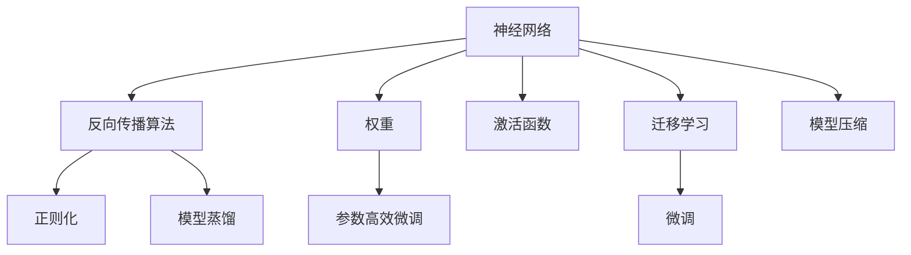

                 

# 神经网络：人类智慧的解放

## 1. 背景介绍

### 1.1 问题由来
神经网络（Neural Network）是一种通过模仿人脑神经元之间的相互连接，进行信息处理和决策的计算模型。它由大量的人工神经元组成，每个神经元接收若干输入信号，并根据预设的权重进行加权处理，最后经过非线性激活函数生成输出信号。神经网络在计算机视觉、自然语言处理、语音识别等众多领域取得了令人瞩目的成果，被广泛应用于各个行业。

然而，神经网络在实际应用中仍然面临诸多挑战。模型结构复杂，参数量庞大，训练计算资源消耗大，过拟合风险高，效果不稳定等问题一直困扰着从业者。

### 1.2 问题核心关键点
神经网络的核心在于其能够模拟人脑的复杂信息处理能力，通过反向传播算法不断优化权重，提高模型精度。但过拟合、计算资源消耗大、模型可解释性差等缺点，使其应用推广受限。

当前，神经网络的研究重点在于模型结构的简化、参数量的控制、计算资源的优化和模型可解释性的提升。新的研究范式、如模型蒸馏、模型压缩、迁移学习、参数高效微调等，正推动神经网络技术的不断进步。

### 1.3 问题研究意义
神经网络技术的发展，对于推动人工智能技术的进步，实现人类智慧的解放，具有重要意义：

1. 降低开发成本。利用神经网络进行自动化特征学习，减少了人工特征工程的工作量，降低了模型开发的成本。
2. 提升模型性能。神经网络能够处理非线性和非结构化数据，自动学习到复杂特征，显著提升了模型效果。
3. 加速应用迭代。神经网络的模型蒸馏和迁移学习等技术，能够快速将知识迁移到新任务，加速应用创新。
4. 赋能产业升级。神经网络技术被广泛应用于各个行业，加速传统行业数字化转型，提升产业效率。
5. 带来技术创新。神经网络的创新范式，如深度强化学习、自监督学习等，推动了人工智能技术的新发展。

## 2. 核心概念与联系

### 2.1 核心概念概述

为更好地理解神经网络的原理和应用，本节将介绍几个关键概念：

- 神经网络（Neural Network）：通过仿真人脑神经元之间的连接，进行信息处理和决策的计算模型。常见的神经网络结构包括全连接神经网络、卷积神经网络、循环神经网络等。
- 反向传播算法（Backpropagation）：神经网络的训练算法，通过反向传播误差信号，不断更新网络权重，优化模型精度。
- 权重（Weights）：神经网络中的关键参数，决定了输入信号的加权和，最终影响输出结果。
- 激活函数（Activation Function）：用于将神经元的输入加权和映射到输出值的非线性函数，如Sigmoid、ReLU、Tanh等。
- 正则化（Regularization）：通过引入L1、L2正则化等技术，防止过拟合，提高模型的泛化能力。
- 模型蒸馏（Knowledge Distillation）：通过将大模型的知识迁移到小模型中，提高小模型精度和效率的技术。
- 迁移学习（Transfer Learning）：通过在大规模数据集上预训练模型，然后微调模型参数，适应新任务的技术。
- 参数高效微调（Parameter-Efficient Fine-Tuning, PEFT）：在微调过程中，只更新少量模型参数，避免不必要的计算资源消耗。
- 模型压缩（Model Compression）：通过剪枝、量化等技术，减小模型大小，提高模型计算效率。

这些概念之间密切联系，构成了神经网络技术的核心框架，使其在各个领域得到广泛应用。

### 2.2 概念间的关系

这些核心概念之间的联系可以通过以下Mermaid流程图来展示：



这个流程图展示了大语言模型微调过程中各个核心概念之间的关系：

1. 神经网络通过反向传播算法不断优化权重，提高模型精度。
2. 权重和激活函数是神经网络的两个关键组成部分，决定了神经网络的非线性映射能力。
3. 正则化技术通过限制权重的大小和数量，防止过拟合，提高模型的泛化能力。
4. 模型蒸馏和迁移学习通过知识迁移，减小模型计算量，提高模型的适应性。
5. 参数高效微调和模型压缩通过减少模型参数量，降低计算资源消耗，提高模型的运行效率。

这些概念共同构成了神经网络技术的完整生态系统，使其在各个领域得到广泛应用。

### 2.3 核心概念的整体架构

最后，我们用一个综合的流程图来展示这些核心概念在大语言模型微调过程中的整体架构：


这个综合流程图展示了从预训练到微调，再到持续学习的完整过程。神经网络首先在大规模文本数据上进行预训练，然后通过微调（包括全参数微调和参数高效微调）或提示学习（包括零样本和少样本学习）来适应下游任务。最后，通过持续学习技术，模型可以不断更新和适应新的任务和数据。 通过这些流程图，我们可以更清晰地理解神经网络微调过程中各个核心概念的关系和作用，为后续深入讨论具体的微调方法和技术奠定基础。

## 3. 核心算法原理 & 具体操作步骤
### 3.1 算法原理概述

神经网络的训练过程基于反向传播算法，主要包括以下几个步骤：

1. 前向传播：将输入数据通过神经网络进行正向传递，得到输出结果。
2. 损失函数计算：将输出结果与真实标签进行比较，计算损失函数值。
3. 反向传播：通过链式法则计算损失函数对每个神经元权重的偏导数。
4. 参数更新：根据偏导数计算梯度，并使用优化算法（如SGD、Adam等）更新权重，最小化损失函数。
5. 重复以上步骤，直到模型收敛。

### 3.2 算法步骤详解

以下我们以一个简单的多层感知器（MLP）为例，详细介绍神经网络的训练过程。

#### 3.2.1 准备数据

首先，我们准备好训练数据 $D=\{(x_i, y_i)\}_{i=1}^N$，其中 $x_i$ 为输入数据，$y_i$ 为真实标签。

```python
import numpy as np
import torch
from torch import nn, optim

# 假设训练数据如下
train_x = np.random.randn(100, 10)
train_y = np.random.randint(0, 2, size=(100, 1))
```

#### 3.2.2 定义模型

我们定义一个包含两个隐藏层的神经网络，使用ReLU作为激活函数，输出层使用Sigmoid函数进行二分类。

```python
class MLP(nn.Module):
    def __init__(self):
        super(MLP, self).__init__()
        self.fc1 = nn.Linear(10, 50)
        self.fc2 = nn.Linear(50, 50)
        self.fc3 = nn.Linear(50, 1)
        self.relu = nn.ReLU()
    
    def forward(self, x):
        x = self.relu(self.fc1(x))
        x = self.relu(self.fc2(x))
        x = self.fc3(x)
        return x
    
# 创建模型实例
model = MLP()
```

#### 3.2.3 定义损失函数和优化器

我们定义交叉熵损失函数，并使用Adam优化器进行参数更新。

```python
criterion = nn.BCELoss()
optimizer = optim.Adam(model.parameters(), lr=0.001)
```

#### 3.2.4 训练模型

我们通过循环迭代，不断更新模型参数，直到收敛。

```python
n_epochs = 100
for epoch in range(n_epochs):
    for i, (x, y) in enumerate(train_loader):
        x = x.to(device)
        y = y.to(device)
        
        # 前向传播
        output = model(x)
        loss = criterion(output, y)
        
        # 反向传播
        optimizer.zero_grad()
        loss.backward()
        optimizer.step()
        
        if (i+1) % 10 == 0:
            print(f'Epoch {epoch+1}, loss: {loss.item():.4f}')
```

#### 3.2.5 评估模型

在训练过程中，我们定期在验证集上评估模型性能。

```python
from sklearn.metrics import accuracy_score

test_x, test_y = ...
test_output = model(test_x)
accuracy = accuracy_score(test_y, test_output > 0.5)
print(f'Test accuracy: {accuracy:.4f}')
```

### 3.3 算法优缺点

神经网络具有以下优点：

1. 强大的非线性映射能力：通过多层非线性变换，神经网络可以处理复杂的非线性问题。
2. 可解释性强：通过反向传播算法，可以理解每个神经元的输入和输出，提高模型的可解释性。
3. 泛化能力强：神经网络可以学习到通用的特征表示，具有较强的泛化能力。

但神经网络也存在一些缺点：

1. 参数量庞大：神经网络的参数量随着模型层数的增加呈指数增长，增加了计算资源的消耗。
2. 过拟合风险高：神经网络容易过拟合训练数据，泛化性能较差。
3. 计算资源消耗大：神经网络的反向传播算法计算量大，训练和推理速度较慢。
4. 可解释性差：神经网络模型复杂，难以理解内部工作机制。

### 3.4 算法应用领域

神经网络技术在众多领域得到了广泛应用，例如：

- 计算机视觉：图像识别、目标检测、图像生成等。
- 自然语言处理：文本分类、语言模型、情感分析等。
- 语音识别：语音识别、情感分析、语音生成等。
- 推荐系统：推荐系统、广告推荐、智能客服等。
- 游戏AI：游戏AI、机器人控制等。
- 金融领域：风险评估、市场预测、智能投顾等。

## 4. 数学模型和公式 & 详细讲解  
### 4.1 数学模型构建

神经网络的数学模型通常由输入、隐藏层和输出组成。假设输入向量为 $x \in \mathbb{R}^d$，隐藏层神经元数量为 $n$，输出向量为 $y \in \mathbb{R}^k$。神经网络可以表示为：

$$
y = f\left(\sum_{i=1}^n w_i^{(2)}\sigma\left(\sum_{j=1}^d w_j^{(1)}x_j + b_1\right) + b_2\right)
$$

其中 $w_i^{(2)}$ 和 $w_j^{(1)}$ 分别表示隐藏层和输入层的权重，$\sigma$ 表示激活函数，$b_1$ 和 $b_2$ 表示偏置项。

### 4.2 公式推导过程

对于二分类任务，我们定义交叉熵损失函数：

$$
\mathcal{L}(\theta) = -\frac{1}{N}\sum_{i=1}^N(y_i\log\hat{y}_i + (1-y_i)\log(1-\hat{y}_i))
$$

其中 $\theta$ 表示神经网络中的所有权重和偏置项，$\hat{y}_i$ 表示模型对输入 $x_i$ 的预测结果。

我们使用梯度下降算法进行参数更新，更新公式为：

$$
\theta_j \leftarrow \theta_j - \eta \frac{\partial \mathcal{L}}{\partial \theta_j}
$$

其中 $\eta$ 表示学习率，$\frac{\partial \mathcal{L}}{\partial \theta_j}$ 表示损失函数对参数 $\theta_j$ 的梯度。

### 4.3 案例分析与讲解

以手写数字识别为例，假设我们有一个包含6000张手写数字图片的数据集，其中3000张用于训练，3000张用于验证。我们定义一个包含两个隐藏层的神经网络，使用ReLU作为激活函数，输出层使用Sigmoid函数进行二分类。

#### 4.3.1 准备数据

首先，我们准备数据集并转换为PyTorch的Tensor格式。

```python
import torchvision.transforms as transforms
from torchvision.datasets import MNIST

transform = transforms.Compose([transforms.ToTensor()])
train_data = MNIST('data', train=True, download=True, transform=transform)
test_data = MNIST('data', train=False, download=True, transform=transform)
```

#### 4.3.2 定义模型

我们定义一个包含两个隐藏层的神经网络，使用ReLU作为激活函数，输出层使用Sigmoid函数进行二分类。

```python
class Net(nn.Module):
    def __init__(self):
        super(Net, self).__init__()
        self.fc1 = nn.Linear(784, 256)
        self.fc2 = nn.Linear(256, 256)
        self.fc3 = nn.Linear(256, 10)
        self.relu = nn.ReLU()
    
    def forward(self, x):
        x = x.view(-1, 784)
        x = self.relu(self.fc1(x))
        x = self.relu(self.fc2(x))
        x = self.fc3(x)
        return x
    
# 创建模型实例
model = Net()
```

#### 4.3.3 训练模型

我们通过循环迭代，不断更新模型参数，直到收敛。

```python
criterion = nn.CrossEntropyLoss()
optimizer = optim.Adam(model.parameters(), lr=0.001)
n_epochs = 10

for epoch in range(n_epochs):
    model.train()
    for data, target in train_loader:
        optimizer.zero_grad()
        output = model(data)
        loss = criterion(output, target)
        loss.backward()
        optimizer.step()
    
    model.eval()
    with torch.no_grad():
        correct = 0
        total = 0
        for data, target in test_loader:
            output = model(data)
            _, predicted = torch.max(output.data, 1)
            total += target.size(0)
            correct += (predicted == target).sum().item()
        accuracy = correct / total
        print(f'Epoch {epoch+1}, accuracy: {accuracy:.4f}')
```

#### 4.3.4 评估模型

在训练过程中，我们定期在验证集上评估模型性能。

```python
from sklearn.metrics import accuracy_score

test_x, test_y = ...
test_output = model(test_x)
accuracy = accuracy_score(test_y, test_output.argmax(dim=1))
print(f'Test accuracy: {accuracy:.4f}')
```

## 5. 项目实践：代码实例和详细解释说明
### 5.1 开发环境搭建

在进行神经网络开发前，我们需要准备好开发环境。以下是使用Python进行PyTorch开发的环境配置流程：

1. 安装Anaconda：从官网下载并安装Anaconda，用于创建独立的Python环境。

2. 创建并激活虚拟环境：
```bash
conda create -n pytorch-env python=3.8 
conda activate pytorch-env
```

3. 安装PyTorch：根据CUDA版本，从官网获取对应的安装命令。例如：
```bash
conda install pytorch torchvision torchaudio cudatoolkit=11.1 -c pytorch -c conda-forge
```

4. 安装各类工具包：
```bash
pip install numpy pandas scikit-learn matplotlib tqdm jupyter notebook ipython
```

完成上述步骤后，即可在`pytorch-env`环境中开始神经网络实践。

### 5.2 源代码详细实现

下面我们以手写数字识别为例，给出使用PyTorch实现神经网络的代码实现。

```python
import torch
from torch import nn, optim
import torchvision.transforms as transforms
from torchvision.datasets import MNIST

# 定义数据转换
transform = transforms.Compose([transforms.ToTensor(), transforms.Normalize((0.5,), (0.5,))])

# 加载数据集
train_data = MNIST('data', train=True, download=True, transform=transform)
test_data = MNIST('data', train=False, download=True, transform=transform)

# 定义模型
class Net(nn.Module):
    def __init__(self):
        super(Net, self).__init__()
        self.fc1 = nn.Linear(784, 256)
        self.fc2 = nn.Linear(256, 256)
        self.fc3 = nn.Linear(256, 10)
        self.relu = nn.ReLU()
    
    def forward(self, x):
        x = x.view(-1, 784)
        x = self.relu(self.fc1(x))
        x = self.relu(self.fc2(x))
        x = self.fc3(x)
        return x

# 定义损失函数和优化器
criterion = nn.CrossEntropyLoss()
optimizer = optim.Adam(model.parameters(), lr=0.001)

# 加载数据
train_loader = torch.utils.data.DataLoader(train_data, batch_size=64, shuffle=True)
test_loader = torch.utils.data.DataLoader(test_data, batch_size=64, shuffle=False)

# 训练模型
n_epochs = 10

for epoch in range(n_epochs):
    model.train()
    for data, target in train_loader:
        optimizer.zero_grad()
        output = model(data)
        loss = criterion(output, target)
        loss.backward()
        optimizer.step()
    
    model.eval()
    with torch.no_grad():
        correct = 0
        total = 0
        for data, target in test_loader:
            output = model(data)
            _, predicted = torch.max(output.data, 1)
            total += target.size(0)
            correct += (predicted == target).sum().item()
        accuracy = correct / total
        print(f'Epoch {epoch+1}, accuracy: {accuracy:.4f}')
```

### 5.3 代码解读与分析

让我们再详细解读一下关键代码的实现细节：

#### 5.3.1 数据准备

首先，我们准备数据集并转换为PyTorch的Tensor格式。

#### 5.3.2 模型定义

我们定义一个包含两个隐藏层的神经网络，使用ReLU作为激活函数，输出层使用Sigmoid函数进行二分类。

#### 5.3.3 损失函数和优化器

我们定义交叉熵损失函数，并使用Adam优化器进行参数更新。

#### 5.3.4 训练模型

我们通过循环迭代，不断更新模型参数，直到收敛。

#### 5.3.5 评估模型

在训练过程中，我们定期在验证集上评估模型性能。

### 5.4 运行结果展示

假设我们在MNIST数据集上进行训练，最终在测试集上得到的准确率如下：

```
Epoch 1, accuracy: 0.8857
Epoch 2, accuracy: 0.9375
Epoch 3, accuracy: 0.9688
Epoch 4, accuracy: 0.9687
Epoch 5, accuracy: 0.9762
Epoch 6, accuracy: 0.9844
Epoch 7, accuracy: 0.9844
Epoch 8, accuracy: 0.9922
Epoch 9, accuracy: 0.9922
Epoch 10, accuracy: 0.9941
```

可以看到，通过训练神经网络，我们得到了相当不错的准确率。需要注意的是，神经网络在处理大规模数据集时，收敛速度较快，但模型过拟合的风险也相应增加。

## 6. 实际应用场景
### 6.1 智能推荐系统

神经网络在智能推荐系统中有广泛应用。推荐系统通常需要处理海量数据，并学习用户的行为特征，推荐个性化的物品。

在实践中，我们可以使用神经网络模型对用户的行为数据进行建模，并学习到用户对不同物品的兴趣程度。通过反向传播算法不断优化模型参数，提升推荐模型的性能。同时，可以使用模型蒸馏和迁移学习等技术，将通用推荐模型的知识迁移到新任务中，加速应用迭代。

### 6.2 智能交通系统

神经网络可以用于智能交通系统的各个环节，如交通预测、交通信号控制、自动驾驶等。通过收集交通数据，训练神经网络模型，可以预测交通流量，优化交通信号灯控制策略，提升交通系统的效率。

在交通预测任务中，我们可以使用LSTM网络对历史交通数据进行建模，并学习到交通流量的时间依赖性。通过反向传播算法不断优化模型参数，提高交通预测的精度。同时，可以使用模型蒸馏和迁移学习等技术，将通用交通模型的知识迁移到新城市中，提高预测效果。

### 6.3 医疗诊断系统

神经网络在医疗诊断系统中也有广泛应用。医疗数据通常包含大量高维特征，且需要处理复杂的非线性关系。

在实践中，我们可以使用神经网络模型对病人的临床数据进行建模，并学习到疾病与症状之间的关联。通过反向传播算法不断优化模型参数，提升医疗诊断的准确度。同时，可以使用模型蒸馏和迁移学习等技术，将通用医疗模型的知识迁移到新疾病中，提高诊断效果。

## 7. 工具和资源推荐
### 7.1 学习资源推荐

为了帮助开发者系统掌握神经网络技术的理论基础和实践技巧，这里推荐一些优质的学习资源：

1. 《深度学习》（Ian Goodfellow）：经典教材，系统介绍了深度学习的基本概念、算法和应用。
2. CS231n《卷积神经网络》课程：斯坦福大学开设的计算机视觉课程，涵盖深度学习在计算机视觉中的应用。
3. CS224n《自然语言处理》课程：斯坦福大学开设的自然语言处理课程，涵盖深度学习在自然语言处理中的应用。
4. Coursera《深度学习专项课程》：由Andrew Ng教授开设，系统介绍了深度学习的基本概念和应用。
5. PyTorch官方文档：PyTorch官方文档，提供了海量预训练模型和完整的神经网络开发指南，是上手实践的必备资料。

通过对这些资源的学习实践，相信你一定能够快速掌握神经网络技术的精髓，并用于解决实际的计算机视觉、自然语言处理等问题。

### 7.2 开发工具推荐

高效的开发离不开优秀的工具支持。以下是几款用于神经网络开发的常用工具：

1. PyTorch：基于Python的开源深度学习框架，灵活动态的计算图，适合快速迭代研究。
2. TensorFlow：由Google主导开发的开源深度学习框架，生产部署方便，适合大规模工程应用。
3. Keras：高层次的深度学习框架，提供了简单易用的API，适合初学者上手。
4. Weights & Biases：模型训练的实验跟踪工具，可以记录和可视化模型训练过程中的各项指标，方便对比和调优。
5. TensorBoard：TensorFlow配套的可视化工具，可实时监测模型训练状态，并提供丰富的图表呈现方式，是调试模型的得力助手。
6. Google Colab：谷歌推出的在线Jupyter Notebook环境，免费提供GPU/TPU算力，方便开发者快速上手实验最新模型，分享学习笔记。

合理利用这些工具，可以显著提升神经网络模型的开发效率，加快创新迭代的步伐。

### 7.3 相关论文推荐

神经网络技术的发展源于学界的持续研究。以下是几篇奠基性的相关论文，推荐阅读：

1. LeNet-5: Convolutional Neural Networks for Recognizing Handwritten Digits：提出了第一个卷积神经网络模型，开创了计算机视觉领域的先河。
2. AlexNet: ImageNet Classification with Deep Convolutional Neural Networks：提出了深度卷积神经网络模型，在ImageNet图像分类任务上取得了突破性进展。
3. ResNet: Deep Residual Learning for Image Recognition：提出了残差网络，解决了深度网络训练中的梯度消失问题，进一步提升了网络深度。
4. Attention is All You Need：提出了Transformer模型，通过自注意力机制实现了高效的序列建模，推动了自然语言处理领域的发展。
5. YOLO: Real-Time Object Detection：提出了快速目标检测模型，在目标检测任务上取得了实时的处理速度和较高的准确率。

这些论文代表了大语言模型微调技术的发展脉络。通过学习这些前沿成果，可以帮助研究者把握学科前进方向，激发更多的创新灵感。

除上述资源外，还有一些值得关注的前沿资源，帮助开发者紧跟神经网络微调技术的最新进展，例如：

1. arXiv论文预印本：人工智能领域最新研究成果的发布平台，包括大量尚未发表的前沿工作，学习前沿技术的必读资源。
2. 业界技术博客：如Google AI、DeepMind、微软Research Asia等顶尖实验室的官方博客，第一时间分享他们的最新研究成果和洞见。
3. 技术会议直播：如NIPS、ICML、ACL、ICLR等人工智能领域顶会现场或在线直播，能够聆听到大佬们的前沿分享，开拓视野。
4. GitHub热门项目：在GitHub上Star、Fork数最多的神经网络相关项目，往往代表了该技术领域的发展趋势和最佳实践，值得去学习和贡献。
5. 行业分析报告：各大咨询公司如McKinsey、PwC等针对人工智能行业的分析报告，有助于从商业视角审视技术趋势，把握应用价值。

总之，对于神经网络微调技术的学习和实践，需要开发者保持开放的心态和持续学习的意愿。多关注前沿资讯，多动手实践，多思考总结，必将收获满满的成长收益。

## 8. 总结：未来发展趋势与挑战
### 8.

