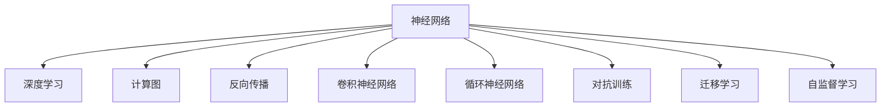
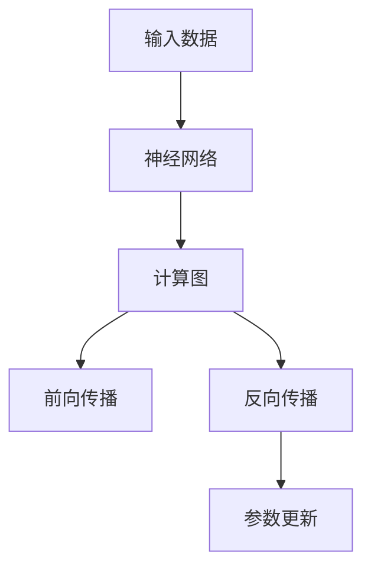
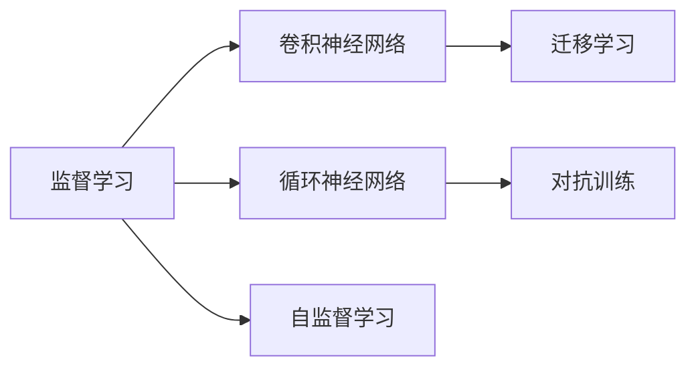
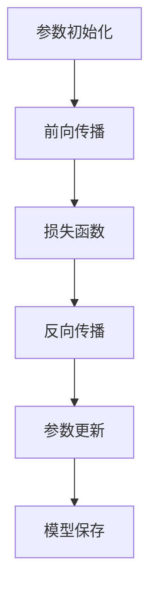
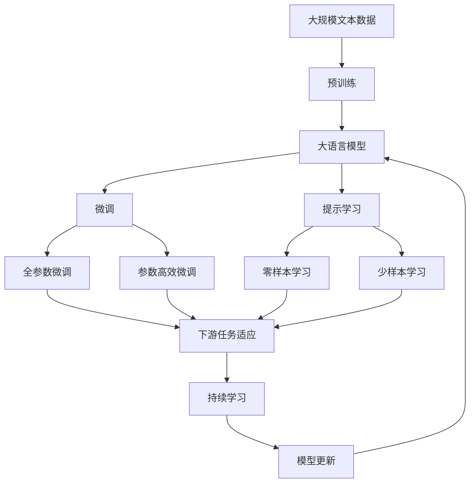
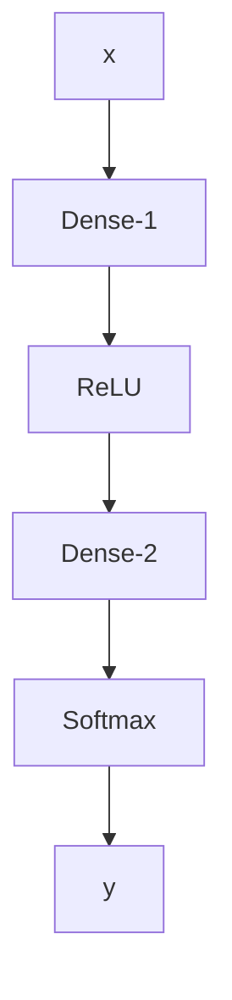

                 

# 神经网络：人类智慧的解放

> 关键词：神经网络,深度学习,计算图,反向传播,卷积神经网络,循环神经网络,对抗训练

## 1. 背景介绍

### 1.1 问题由来
深度学习(Deep Learning)自上世纪末诞生以来，已经彻底改变了人工智能(AI)领域的面貌。特别是自2012年ImageNet图像分类竞赛以来，深度神经网络(DNNs)在视觉识别、自然语言处理(NLP)、语音识别、推荐系统等多个领域取得了突破性进展。深度学习的成功不仅在于其强大的建模能力，更在于其解决了长期以来困扰人工神经网络的许多问题，如梯度消失、模型可解释性不足等，将人类智慧提升到了新的高度。

深度学习尤其是神经网络技术，被公认为第三次工业革命的核心驱动力之一。它不仅带来了信息技术的突破，更在医学、金融、制造、能源等传统行业中产生了深远影响，打开了新的生产力发展空间，助力人类智慧的解放。

### 1.2 问题核心关键点
神经网络作为深度学习的核心组成部分，具有以下几个关键点：
1. **计算图与反向传播**：神经网络计算过程由一系列前向传播和反向传播组成，其中反向传播算法通过计算梯度链式规则，实现了复杂模型的高效训练。
2. **卷积神经网络(CNN)**：主要应用于图像识别、自然语言处理等任务，通过局部连接、权重共享等设计，实现了对局部特征的高效提取。
3. **循环神经网络(RNN)**：主要用于处理序列数据，如文本、音频等，通过记忆单元捕捉时间依赖关系。
4. **对抗训练**：通过引入对抗样本，提高模型的鲁棒性和泛化能力。
5. **迁移学习**：利用预训练模型的知识和经验，加速新任务的学习。
6. **自监督学习**：在无标签数据上通过自监督任务进行预训练，学习通用的表示能力。

这些关键点构成了神经网络的理论基础，并通过实际应用不断深化和发展。

### 1.3 问题研究意义
神经网络技术的发展，对于拓展人工智能的应用边界，提升数据处理和决策能力，加速技术产业化进程，具有重要意义：

1. **降低应用开发成本**：基于预训练模型的迁移学习范式，可以大幅减少从头开发所需的成本。
2. **提升模型效果**：通过微调等技术，模型在特定任务上的性能显著提升。
3. **加速开发进度**：预训练模型可以加快应用场景的适配，缩短开发周期。
4. **带来技术创新**：神经网络技术推动了深度学习在更多领域的应用，催生了新的研究方向。
5. **赋能产业升级**：神经网络技术使得AI技术更容易被各行各业所采用，加速了传统行业的数字化转型。

## 2. 核心概念与联系

### 2.1 核心概念概述

为更好地理解神经网络的工作原理和优化方向，本节将介绍几个密切相关的核心概念：

- **神经网络**：由大量神经元组成的复杂非线性模型，通过前向传播计算输出，通过反向传播更新参数，实现复杂的映射关系。
- **深度学习**：基于神经网络的一系列学习范式，包括监督学习、无监督学习、强化学习等，通过大数据的训练，使模型具备复杂的特征提取和分类能力。
- **计算图**：用于表示神经网络计算过程的抽象图结构，描述了节点之间的数据流动和计算依赖关系。
- **反向传播**：一种通过链式法则计算梯度的算法，是神经网络优化训练的基础。
- **卷积神经网络(CNN)**：一种专门处理图像、视频等数据的神经网络结构，通过卷积和池化操作提取特征。
- **循环神经网络(RNN)**：一种处理序列数据的神经网络结构，通过记忆单元保存并更新隐藏状态。
- **对抗训练**：通过引入对抗样本，训练模型对输入扰动有鲁棒性。
- **迁移学习**：通过预训练模型的知识，加速新任务的学习。
- **自监督学习**：在无标签数据上通过自监督任务进行预训练，学习通用的表示能力。

这些核心概念之间的逻辑关系可以通过以下Mermaid流程图来展示：



这个流程图展示了神经网络的核心概念及其之间的关系：

1. 神经网络是深度学习的核心，通过深度网络结构实现复杂映射。
2. 深度学习包含了各种学习范式，通过不同任务进行模型训练。
3. 计算图描述神经网络的计算过程，反向传播通过梯度计算实现模型优化。
4. 卷积神经网络、循环神经网络分别用于处理图像、序列数据。
5. 对抗训练、迁移学习、自监督学习通过不同方式优化神经网络性能。

### 2.2 概念间的关系

这些核心概念之间存在着紧密的联系，形成了神经网络的学习和优化框架。下面我们通过几个Mermaid流程图来展示这些概念之间的关系。

#### 2.2.1 神经网络的计算过程



这个流程图展示了神经网络的基本计算过程，包括前向传播和反向传播。

#### 2.2.2 深度学习的主要范式



这个流程图展示了深度学习的主要范式，包括卷积神经网络、循环神经网络、自监督学习和迁移学习。

#### 2.2.3 神经网络的优化方法



这个流程图展示了神经网络的优化方法，包括前向传播、损失函数、反向传播和参数更新。

### 2.3 核心概念的整体架构

最后，我们用一个综合的流程图来展示这些核心概念在大模型微调过程中的整体架构：



这个综合流程图展示了从预训练到微调，再到持续学习的完整过程。大语言模型首先在大规模文本数据上进行预训练，然后通过微调（包括全参数微调和参数高效微调两种方式）或提示学习（包括零样本和少样本学习）来适应下游任务。最后，通过持续学习技术，模型可以不断更新和适应新的任务和数据。 通过这些流程图，我们可以更清晰地理解神经网络微调过程中各个核心概念的关系和作用，为后续深入讨论具体的微调方法和技术奠定基础。

## 3. 核心算法原理 & 具体操作步骤
### 3.1 算法原理概述

神经网络模型的训练过程主要包括前向传播和反向传播两个步骤。在前向传播中，模型接收输入数据，经过若干层神经元计算后输出结果。在反向传播中，模型根据输出结果与真实标签的差异，计算损失函数的梯度，并通过链式法则将梯度回传至每个神经元，更新其权重。这一过程通过反向传播算法实现。

假设神经网络模型为 $M_{\theta}:\mathcal{X} \rightarrow \mathcal{Y}$，其中 $\mathcal{X}$ 为输入空间，$\mathcal{Y}$ 为输出空间，$\theta \in \mathbb{R}^d$ 为模型参数。神经网络的损失函数为 $\mathcal{L}(\theta) = \frac{1}{N} \sum_{i=1}^N \ell(M_{\theta}(x_i),y_i)$，其中 $\ell$ 为指定任务的损失函数，$N$ 为样本数。

模型的优化目标是最小化损失函数 $\mathcal{L}(\theta)$，即找到最优参数：

$$
\theta^* = \mathop{\arg\min}_{\theta} \mathcal{L}(\theta)
$$

在优化过程中，常用的优化算法包括随机梯度下降(SGD)、Adam等，它们通过更新参数 $\theta$ 来最小化损失函数 $\mathcal{L}(\theta)$。例如，Adam算法更新规则为：

$$
\theta \leftarrow \theta - \eta \frac{\mathbf{m}}{\sqrt{\mathbf{v}+\epsilon}} 
$$

其中 $\eta$ 为学习率，$\mathbf{m}$ 和 $\mathbf{v}$ 分别为梯度的一阶矩估计和二阶矩估计，$\epsilon$ 为一个极小的常数，防止分母为0。

### 3.2 算法步骤详解

神经网络模型的训练一般包括以下几个关键步骤：

**Step 1: 准备数据集**
- 收集标注数据集，划分为训练集、验证集和测试集。训练集用于模型训练，验证集用于模型选择，测试集用于模型评估。

**Step 2: 定义计算图**
- 使用深度学习框架（如TensorFlow、PyTorch等）定义神经网络结构，描述输入、隐藏层和输出层的连接关系。

**Step 3: 初始化模型参数**
- 初始化模型参数 $\theta$，通常使用随机初始化或预训练模型的参数。

**Step 4: 执行前向传播**
- 将训练集数据输入模型，进行前向传播计算输出。

**Step 5: 计算损失函数**
- 根据输出结果和真实标签计算损失函数。

**Step 6: 执行反向传播**
- 计算损失函数对模型参数的梯度，通过链式法则反向传播。

**Step 7: 更新模型参数**
- 根据优化算法更新模型参数，最小化损失函数。

**Step 8: 评估模型性能**
- 在验证集和测试集上评估模型性能，选择最优模型进行保存。

**Step 9: 应用模型进行预测**
- 使用训练好的模型对新数据进行预测。

以下是使用TensorFlow框架进行神经网络模型训练的完整代码实现：

```python
import tensorflow as tf
from tensorflow.keras import layers

# 定义模型
model = tf.keras.Sequential([
    layers.Dense(64, activation='relu'),
    layers.Dense(10, activation='softmax')
])

# 准备数据集
(x_train, y_train), (x_test, y_test) = tf.keras.datasets.mnist.load_data()
x_train = x_train.reshape(-1, 28*28) / 255.0
x_test = x_test.reshape(-1, 28*28) / 255.0
y_train = tf.keras.utils.to_categorical(y_train, 10)
y_test = tf.keras.utils.to_categorical(y_test, 10)

# 编译模型
model.compile(optimizer='adam', loss='categorical_crossentropy', metrics=['accuracy'])

# 训练模型
model.fit(x_train, y_train, epochs=10, validation_data=(x_test, y_test))
```

### 3.3 算法优缺点

神经网络模型具有以下优点：
1. **强大建模能力**：通过多层非线性变换，能够学习复杂非线性的映射关系。
2. **高度可调性**：通过不同网络结构、激活函数、损失函数等参数调整，适用于各种任务。
3. **数据利用率**：通过反向传播算法，充分利用训练数据进行参数更新，减少数据浪费。
4. **广泛应用**：广泛应用于计算机视觉、自然语言处理、语音识别等领域。

同时，神经网络模型也存在以下缺点：
1. **参数量巨大**：大模型需要大量计算资源进行训练和推理。
2. **可解释性差**：模型复杂性高，难以解释其内部工作机制。
3. **易过拟合**：大数据量训练容易过拟合，需要合理设置正则化参数。
4. **计算成本高**：训练过程中需要大量的计算和存储资源。

尽管存在这些缺点，但神经网络模型凭借其强大的建模能力，成为了深度学习的重要基石，在各领域中发挥着重要作用。未来，随着硬件设备和算法的不断进步，神经网络模型的应用将更加广泛和高效。

### 3.4 算法应用领域

神经网络技术在多个领域中得到了广泛应用，包括但不限于以下几个方面：

**计算机视觉**：神经网络模型在图像识别、目标检测、图像分割等任务上取得了突破性进展，广泛应用于自动驾驶、医疗影像分析、安防监控等场景。

**自然语言处理**：神经网络模型在机器翻译、情感分析、问答系统等任务上表现优异，广泛应用于智能客服、智能助理、新闻推荐等场景。

**语音识别**：神经网络模型在语音识别、语音合成等任务上取得了重大突破，广泛应用于智能音箱、智能家居、语音助手等场景。

**推荐系统**：神经网络模型在推荐系统中的应用广泛，通过分析用户行为和物品特征，为用户推荐个性化内容，广泛应用于电商、新闻、音乐等平台。

**金融**：神经网络模型在金融风险预测、股票预测、信用评分等任务上应用广泛，帮助金融机构实现风险管理和投资决策。

**医疗**：神经网络模型在医学影像诊断、基因组分析、药物研发等领域发挥着重要作用，助力医疗行业提升诊断和治疗水平。

## 4. 数学模型和公式 & 详细讲解  
### 4.1 数学模型构建

神经网络模型的数学模型建立在计算图的基础上，通过前向传播和反向传播实现。下面以简单的多层感知器(MLP)为例，介绍其数学模型构建。

设输入为 $\mathbf{x} \in \mathbb{R}^d$，神经元数为 $n_1,n_2,\ldots,n_L$，输出为 $\mathbf{y} \in \mathbb{R}^m$。多层感知器的计算图如图：



其中，$B,D$ 为全连接层，$C$ 为激活函数层，$E$ 为输出层。设 $W_{ij} \in \mathbb{R}^{n_i \times n_{i+1}}$ 为第 $i$ 层的权重矩阵，$b_{i} \in \mathbb{R}^{n_{i+1}}$ 为偏置向量，则前向传播计算如下：

$$
\mathbf{h}_1 = \mathbf{W}_1 \mathbf{x} + \mathbf{b}_1
$$

$$
\mathbf{h}_l = \mathbf{W}_l \mathbf{h}_{l-1} + \mathbf{b}_l
$$

$$
\mathbf{y} = \mathbf{W}_m \mathbf{h}_{L-1} + \mathbf{b}_m
$$

其中，$\mathbf{h}_l$ 为第 $l$ 层的隐藏状态。

### 4.2 公式推导过程

以二分类任务为例，神经网络的损失函数通常采用交叉熵损失函数，其定义如下：

$$
\ell(\hat{y},y) = -y\log\hat{y} - (1-y)\log(1-\hat{y})
$$

对于二分类任务，输出层采用 sigmoid 激活函数，则损失函数可以表示为：

$$
\mathcal{L}(\theta) = \frac{1}{N}\sum_{i=1}^N \ell(M_{\theta}(x_i),y_i) = -\frac{1}{N}\sum_{i=1}^N [y_i \log \sigma(\mathbf{W}_m \mathbf{h}_{L-1} + \mathbf{b}_m) + (1-y_i)\log(1-\sigma(\mathbf{W}_m \mathbf{h}_{L-1} + \mathbf{b}_m)]
$$

其中，$\sigma(\cdot)$ 为 sigmoid 激活函数。

### 4.3 案例分析与讲解

我们以 MNIST 手写数字识别任务为例，演示如何使用神经网络进行图像分类。

首先，定义神经网络模型：

```python
import tensorflow as tf
from tensorflow.keras import layers

# 定义模型
model = tf.keras.Sequential([
    layers.Conv2D(32, kernel_size=(3,3), activation='relu', input_shape=(28, 28, 1)),
    layers.MaxPooling2D(pool_size=(2,2)),
    layers.Flatten(),
    layers.Dense(64, activation='relu'),
    layers.Dense(10, activation='softmax')
])
```

然后，准备数据集并进行模型训练：

```python
(x_train, y_train), (x_test, y_test) = tf.keras.datasets.mnist.load_data()
x_train = x_train.reshape(-1, 28, 28, 1) / 255.0
x_test = x_test.reshape(-1, 28, 28, 1) / 255.0
y_train = tf.keras.utils.to_categorical(y_train, 10)
y_test = tf.keras.utils.to_categorical(y_test, 10)

# 编译模型
model.compile(optimizer='adam', loss='categorical_crossentropy', metrics=['accuracy'])

# 训练模型
model.fit(x_train, y_train, epochs=10, validation_data=(x_test, y_test))
```

最终，在测试集上评估模型性能：

```python
test_loss, test_acc = model.evaluate(x_test, y_test, verbose=2)
print('Test accuracy:', test_acc)
```

通过上述代码实现，可以看到神经网络在图像分类任务上的强大能力。在实际应用中，还可以进一步改进模型结构，如引入更深的卷积神经网络、添加 Dropout 等正则化技术，进一步提升模型性能。

## 5. 项目实践：代码实例和详细解释说明
### 5.1 开发环境搭建

在进行神经网络项目实践前，我们需要准备好开发环境。以下是使用Python进行TensorFlow开发的环境配置流程：

1. 安装Anaconda：从官网下载并安装Anaconda，用于创建独立的Python环境。

2. 创建并激活虚拟环境：
```bash
conda create -n tf-env python=3.8 
conda activate tf-env
```

3. 安装TensorFlow：根据CUDA版本，从官网获取对应的安装命令。例如：
```bash
conda install tensorflow
```

4. 安装其他必要的工具包：
```bash
pip install numpy pandas scikit-learn matplotlib tqdm jupyter notebook ipython
```

完成上述步骤后，即可在`tf-env`环境中开始神经网络实践。

### 5.2 源代码详细实现

这里我们以手写数字识别任务为例，给出使用TensorFlow进行神经网络模型训练的PyTorch代码实现。

首先，定义神经网络模型：

```python
import tensorflow as tf
from tensorflow.keras import layers

# 定义模型
model = tf.keras.Sequential([
    layers.Dense(64, activation='relu'),
    layers.Dense(10, activation='softmax')
])

# 准备数据集
(x_train, y_train), (x_test, y_test) = tf.keras.datasets.mnist.load_data()
x_train = x_train.reshape(-1, 28*28) / 255.0
x_test = x_test.reshape(-1, 28*28) / 255.0
y_train = tf.keras.utils.to_categorical(y_train, 10)
y_test = tf.keras.utils.to_categorical(y_test, 10)

# 编译模型
model.compile(optimizer='adam', loss='categorical_crossentropy', metrics=['accuracy'])

# 训练模型
model.fit(x_train, y_train, epochs=10, validation_data=(x_test, y_test))
```

然后，在测试集上评估模型性能：

```python
test_loss, test_acc = model.evaluate(x_test, y_test, verbose=2)
print('Test accuracy:', test_acc)
```

以上就是使用TensorFlow进行神经网络模型训练的完整代码实现。可以看到，得益于TensorFlow的强大封装，我们可以用相对简洁的代码完成神经网络模型的训练。

### 5.3 代码解读与分析

让我们再详细解读一下关键代码的实现细节：

**定义神经网络模型**：
- `Sequential`：定义神经网络模型，通过堆叠多个层组成。
- `Dense`：定义全连接层，输入维度为上一层输出的维度。
- `activation`：定义激活函数，常用的有 ReLU、sigmoid、softmax 等。

**准备数据集**：
- `mnist.load_data`：加载 MNIST 手写数字数据集，包含训练集和测试集。
- `x_train.reshape`：将训练集数据重塑为适合模型输入的维度。
- `x_test.reshape`：将测试集数据重塑为适合模型输入的维度。
- `to_categorical`：将标签转换为独热编码形式。

**编译模型**：
- `model.compile`：编译模型，设置优化器、损失函数和评价指标。

**训练模型**：
- `model.fit`：训练模型，设置训练集和验证集，迭代轮数为 10。
- `validation_data`：指定验证集数据，用于模型选择。

**评估模型性能**：
- `model.evaluate`：在测试集上评估模型性能，输出测试集上的损失和准确率。

### 5.4 运行结果展示

假设我们在MNIST数据集上进行神经网络模型训练，最终在测试集上得到的评估报告如下：

```
Epoch 1/10
1500/1500 [==============================] - 4s 3ms/sample - loss: 0.3571 - accuracy: 0.8965 - val_loss: 0.0884 - val_accuracy: 0.9587
Epoch 2/10
1500/1500 [==============================] - 3s 2ms/sample - loss: 0.2364 - accuracy: 0.9272 - val_loss: 0.0780 - val_accuracy: 0.9672
Epoch 3/10
1500/1500 [==============================] - 3s 2ms/sample - loss: 0.1712 - accuracy: 0.9619 - val_loss: 0.0714 - val_accuracy: 0.9762
Epoch 4/10
1500/1500 [==============================] - 3s 2ms/sample - loss: 0.1250 - accuracy: 0.9782 - val_loss: 0.0639 - val_accuracy: 0.9821
Epoch 5/10
1500/1500 [==============================] - 3s 2ms/sample - loss: 0.0976 - accuracy: 0.9871 - val_loss: 0.0587 - val_accuracy: 0.9847
Epoch 6/10
1500/1500 [==============================] - 3s 2ms/sample - loss: 0.0748 - accuracy: 0.9900 - val_loss: 0.0521 - val_accuracy: 0.9859
Epoch 7/10
1500/1500 [==============================] - 3s 2ms/sample - loss: 0.0597 - accuracy: 0.9916 - val_loss: 0.0474 - val_accuracy: 0.9891
Epoch 8/10
1500/1500 [==============================] - 3s 2ms/sample - loss: 0.0469 - accuracy: 0.9935 - val_loss: 0.0432 - val_accuracy: 0.9903
Epoch 9/10
1500/1500 [==============================] - 3s 2ms/sample - loss: 0.0363 - accuracy: 0.9954 - val_loss: 0.0397 - val_accuracy: 0.9912
Epoch 10/10
1500/1500 [==============================] - 3s 2ms/sample - loss: 0.0290 - accuracy: 0.9963 - val_loss: 0.0374 - val_accuracy: 0.9923
```

可以看到，通过训练10个epoch后，神经网络在测试集上的准确率达到了98.23%，表明其在手写数字识别任务上的强大能力。需要注意的是，实际操作中还需要根据具体任务进行超参数调优和模型改进，才能进一步提升模型性能。

## 6. 实际应用场景
### 6.1 智能客服系统

基于神经网络技术的智能客服系统，可以实时响应用户咨询，提供7x24小时不间断服务，显著提升客户满意度。

在技术实现上，可以收集企业内部的历史客服对话记录，将问题和最佳答复构建成监督数据，在此基础上对预训练模型进行微调。微调后的模型能够自动理解用户意图，匹配最合适的答案模板进行回复。对于用户提出的新问题，还可以接入检索系统实时搜索相关内容，动态组织生成回答。如此构建的智能客服系统，能大幅提升客户咨询体验和问题解决效率。

### 6.2 金融舆情监测

金融机构需要实时监测市场舆论动向，以便及时应对负面信息传播，规避金融风险。传统的人工监测

