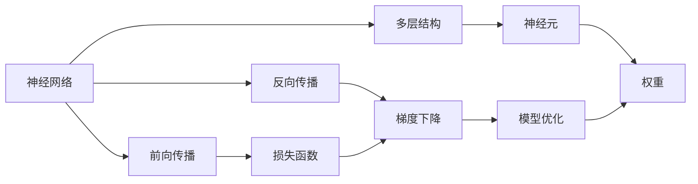
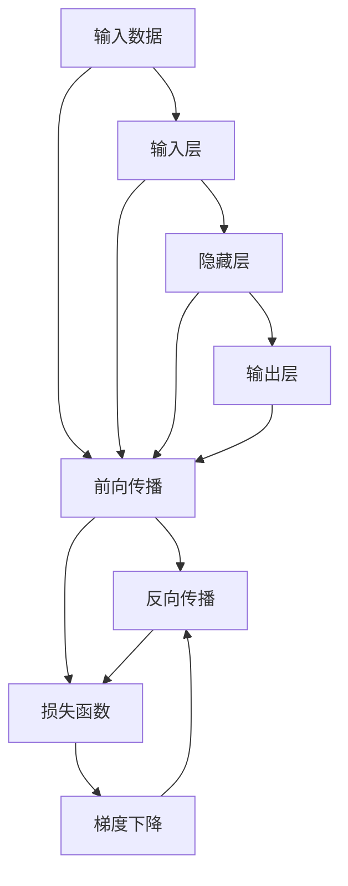

                 

## 1. 背景介绍

### 1.1 问题由来
近年来，人工智能技术的迅猛发展，尤其是神经网络在图像识别、自然语言处理、语音识别等领域取得的不俗成果，预示着神经网络正在逐步解放人类智慧。然而，神经网络背后蕴含的复杂原理和技术细节，让普通读者难以理解其精髓和应用价值。本文将系统梳理神经网络的原理、架构和应用，揭示其如何解放人类智慧，提供深刻见解。

### 1.2 问题核心关键点
神经网络是机器学习领域的核心算法之一，其核心思想是模拟人脑神经元间的连接关系，通过大量数据的训练，构建能够处理、理解和生成数据的复杂模型。神经网络的成功应用，得益于其强大的泛化能力、自适应学习和并行计算特性。本文将重点讨论以下几个关键点：
- 神经网络的基本原理和结构
- 神经网络中的前向传播和反向传播算法
- 神经网络的训练策略和优化方法
- 神经网络在实际应用中的成功案例

### 1.3 问题研究意义
神经网络技术的发展，不仅推动了人工智能领域的进步，也正在深刻改变各行各业的业务模式和生产效率。通过了解神经网络的原理和应用，可以更好地把握未来技术发展的方向，为行业创新提供理论支持。神经网络的研究和应用，将成为推动社会智能化的重要力量。

## 2. 核心概念与联系

### 2.1 核心概念概述

神经网络（Neural Network）是一种模拟人脑神经元之间连接关系的计算模型。其核心在于通过大量数据的训练，学习数据的内在结构和规律，实现数据的自动分类、聚类、预测和生成。神经网络由多个层次组成，每个层次包含若干个神经元，通过权值连接形成复杂的计算图。

神经网络的学习过程可以分为前向传播和反向传播两个主要步骤：
- 前向传播：输入数据通过网络逐层传递，每个神经元将前一层的输出作为输入，计算输出，并传递到下一层。
- 反向传播：通过比较前向传播输出与实际标签的误差，反向计算每个权值的梯度，并根据梯度调整权值，更新模型参数。

神经网络的优化方法包括梯度下降、动量法、Adagrad、Adam等，通过不断迭代调整权值，最小化损失函数，提高模型性能。

### 2.2 概念间的关系

神经网络的各个概念之间存在着紧密的联系，形成一个完整的计算体系。以下是一个Mermaid流程图，展示了神经网络的核心概念及其关系：



这个流程图展示了神经网络的基本结构和工作流程：

1. 神经网络由多层神经元组成，每个神经元接收多个前一层神经元的输出，计算并传递到下一层。
2. 前向传播通过网络的逐层传递，将输入数据转换为输出。
3. 反向传播通过误差反传，计算每个权重的梯度，更新模型参数。
4. 损失函数度量模型输出与实际标签的差异，指导模型学习。
5. 模型优化通过梯度下降等方法，最小化损失函数，提升模型性能。

### 2.3 核心概念的整体架构

神经网络的整体架构可以通过以下Mermaid流程图展示：



这个流程图展示了神经网络从前向传播到反向传播的完整过程：

1. 输入数据通过输入层进入网络。
2. 数据经过隐藏层逐层传递，计算并生成输出。
3. 前向传播输出与实际标签的误差，由损失函数度量。
4. 反向传播通过误差反传，计算每个权重的梯度。
5. 梯度下降等优化方法根据梯度调整权重，最小化损失函数。

## 3. 核心算法原理 & 具体操作步骤

### 3.1 算法原理概述

神经网络的算法原理主要涉及前向传播、反向传播和优化算法。

#### 3.1.1 前向传播
前向传播是指输入数据通过神经网络的逐层传递，计算输出值的过程。假设输入为 $x$，输出为 $y$，权重矩阵为 $W$，偏置向量为 $b$，则前向传播的计算公式为：

$$
y = f(\sigma(Wx + b))
$$

其中 $f$ 为激活函数，如 sigmoid、ReLU、tanh 等，$\sigma$ 为非线性变换。

#### 3.1.2 反向传播
反向传播是指通过计算误差，反向传播误差，并更新权重的过程。假设输出误差为 $\Delta y$，激活函数导数为 $\sigma'$，则反向传播的计算公式为：

$$
\Delta y = y - y_{label}
$$

$$
\Delta z = \sigma'(Wx + b) \odot \Delta y
$$

$$
\Delta W = x^T \odot \Delta z
$$

$$
\Delta b = \Delta z
$$

其中 $\odot$ 表示逐元素乘积。

#### 3.1.3 优化算法
优化算法是神经网络训练的核心。常用的优化算法包括梯度下降、动量法、Adagrad、Adam 等。以梯度下降为例，其更新公式为：

$$
\theta \leftarrow \theta - \eta \nabla_{\theta}L
$$

其中 $\theta$ 为模型参数，$\eta$ 为学习率，$\nabla_{\theta}L$ 为损失函数对参数的梯度。

### 3.2 算法步骤详解

神经网络的训练过程包括以下关键步骤：

**Step 1: 准备数据和模型**
- 收集训练数据，并划分为训练集、验证集和测试集。
- 选择合适的神经网络结构，如卷积神经网络（CNN）、循环神经网络（RNN）、深度神经网络（DNN）等。

**Step 2: 定义损失函数**
- 根据任务类型，选择合适的损失函数，如均方误差、交叉熵等。

**Step 3: 初始化模型参数**
- 对神经网络的所有参数进行随机初始化。

**Step 4: 前向传播和反向传播**
- 对训练集数据进行迭代，前向传播计算输出，反向传播计算误差和梯度。

**Step 5: 优化模型参数**
- 使用优化算法，根据梯度更新模型参数。

**Step 6: 评估模型性能**
- 在验证集和测试集上评估模型性能，选择最优模型。

**Step 7: 保存模型**
- 保存最优模型，供后续使用。

### 3.3 算法优缺点

神经网络具有以下优点：
- 强大的泛化能力：能够处理和理解复杂的数据结构。
- 自适应学习能力：通过数据训练，自动调整模型参数，提高性能。
- 并行计算特性：多个神经元可以并行计算，提升计算效率。

同时，神经网络也存在一些缺点：
- 需要大量数据：数据量不足时，模型难以充分学习数据规律。
- 计算资源消耗大：神经网络的计算复杂度较高，需要高性能的计算设备和优化算法。
- 易过拟合：神经网络参数较多，容易在训练集上过拟合，影响泛化能力。

### 3.4 算法应用领域

神经网络技术在多个领域都有广泛应用，以下是几个典型应用：

**计算机视觉**
- 图像分类：将图像分类为不同类别，如猫狗识别。
- 物体检测：在图像中检测出目标物体，如人脸识别。

**自然语言处理**
- 文本分类：将文本分类为不同类别，如情感分析。
- 机器翻译：将文本从一种语言翻译成另一种语言。

**语音识别**
- 语音识别：将语音转换为文本，如智能音箱的语音交互。

**游戏和推荐系统**
- 游戏AI：在游戏中实现智能决策和策略优化。
- 推荐系统：根据用户历史行为推荐商品或内容。

## 4. 数学模型和公式 & 详细讲解 & 举例说明

### 4.1 数学模型构建

神经网络的数学模型主要由以下几个部分构成：
- 输入数据 $x$
- 权重矩阵 $W$
- 偏置向量 $b$
- 激活函数 $f$
- 损失函数 $L$

假设输入数据为 $x$，输出为 $y$，权重矩阵为 $W$，偏置向量为 $b$，则前向传播的数学模型为：

$$
y = f(Wx + b)
$$

假设输出误差为 $\Delta y$，激活函数导数为 $\sigma'$，则反向传播的数学模型为：

$$
\Delta y = y - y_{label}
$$

$$
\Delta z = \sigma'(Wx + b) \odot \Delta y
$$

$$
\Delta W = x^T \odot \Delta z
$$

$$
\Delta b = \Delta z
$$

### 4.2 公式推导过程

以线性回归为例，推导其前向传播和反向传播公式：

**前向传播**
- 假设输入数据为 $x$，输出为 $y$，权重矩阵为 $W$，偏置向量为 $b$，则前向传播的计算公式为：

$$
y = Wx + b
$$

**反向传播**
- 假设输出误差为 $\Delta y$，则反向传播的计算公式为：

$$
\Delta y = y - y_{label}
$$

$$
\Delta W = x^T \Delta y
$$

$$
\Delta b = \Delta y
$$

### 4.3 案例分析与讲解

以图像分类为例，分析神经网络的计算过程。假设输入为一张图片，输出为该图片属于不同类别的概率。神经网络的计算过程如下：

1. 将输入图片通过卷积层提取特征，得到一组特征向量。
2. 将特征向量通过全连接层进行分类，得到每个类别的概率。
3. 将概率与真实标签进行比较，计算误差。
4. 通过反向传播，计算每个卷积层和全连接层的权重梯度，并使用优化算法更新参数。

## 5. 项目实践：代码实例和详细解释说明

### 5.1 开发环境搭建

在使用神经网络进行项目开发时，需要搭建良好的开发环境。以下是使用Python进行Keras开发的环境配置流程：

1. 安装Anaconda：从官网下载并安装Anaconda，用于创建独立的Python环境。

2. 创建并激活虚拟环境：
```bash
conda create -n pytorch-env python=3.8 
conda activate pytorch-env
```

3. 安装Keras：
```bash
pip install keras
```

4. 安装TensorFlow：
```bash
pip install tensorflow
```

5. 安装各类工具包：
```bash
pip install numpy pandas scikit-learn matplotlib tqdm jupyter notebook ipython
```

完成上述步骤后，即可在`pytorch-env`环境中开始神经网络开发。

### 5.2 源代码详细实现

下面以图像分类为例，给出使用Keras进行神经网络开发的代码实现。

```python
import keras
from keras.datasets import mnist
from keras.models import Sequential
from keras.layers import Dense, Dropout, Flatten
from keras.layers import Conv2D, MaxPooling2D
from keras.utils import to_categorical

# 加载MNIST数据集
(x_train, y_train), (x_test, y_test) = mnist.load_data()

# 数据预处理
x_train = x_train.reshape(x_train.shape[0], 28, 28, 1)
x_test = x_test.reshape(x_test.shape[0], 28, 28, 1)
x_train = x_train.astype('float32') / 255
x_test = x_test.astype('float32') / 255
y_train = to_categorical(y_train, 10)
y_test = to_categorical(y_test, 10)

# 构建神经网络模型
model = Sequential()
model.add(Conv2D(32, kernel_size=(3, 3), activation='relu', input_shape=(28, 28, 1)))
model.add(MaxPooling2D(pool_size=(2, 2)))
model.add(Dropout(0.25))
model.add(Flatten())
model.add(Dense(128, activation='relu'))
model.add(Dropout(0.5))
model.add(Dense(10, activation='softmax'))

# 编译模型
model.compile(loss='categorical_crossentropy', optimizer='adam', metrics=['accuracy'])

# 训练模型
model.fit(x_train, y_train, batch_size=128, epochs=10, validation_data=(x_test, y_test))

# 评估模型
score = model.evaluate(x_test, y_test, verbose=0)
print('Test loss:', score[0])
print('Test accuracy:', score[1])
```

### 5.3 代码解读与分析

以下是关键代码的解读和分析：

**数据预处理**
- 将输入数据reshape为卷积神经网络的输入形状。
- 将数据归一化到0-1之间，加快训练收敛速度。
- 将标签进行one-hot编码，方便神经网络处理。

**模型构建**
- 使用Sequential模型，逐层添加神经网络层。
- 添加卷积层、池化层、Dropout层、全连接层等，形成完整的神经网络结构。
- 使用softmax函数进行多分类输出。

**模型编译**
- 选择交叉熵损失函数和Adam优化器。
- 设置训练过程中监控的指标，如准确率。

**模型训练和评估**
- 使用fit函数训练模型，指定训练集和验证集。
- 使用evaluate函数评估模型性能。

## 6. 实际应用场景

### 6.1 计算机视觉

神经网络在计算机视觉领域的应用非常广泛，以下是几个典型应用：

**图像分类**
- 将图像分类为不同类别，如猫狗识别。

**目标检测**
- 在图像中检测出目标物体，如人脸识别。

**图像分割**
- 将图像分割为不同区域，如语义分割。

### 6.2 自然语言处理

神经网络在自然语言处理领域也有广泛应用，以下是几个典型应用：

**文本分类**
- 将文本分类为不同类别，如情感分析。

**机器翻译**
- 将文本从一种语言翻译成另一种语言。

**语音识别**
- 将语音转换为文本，如智能音箱的语音交互。

### 6.3 游戏和推荐系统

神经网络在游戏和推荐系统领域也有诸多成功应用，以下是几个典型应用：

**游戏AI**
- 在游戏中实现智能决策和策略优化。

**推荐系统**
- 根据用户历史行为推荐商品或内容。

## 7. 工具和资源推荐

### 7.1 学习资源推荐

为了帮助开发者系统掌握神经网络的技术基础和应用技巧，这里推荐一些优质的学习资源：

1. 《深度学习》书籍：Ian Goodfellow等人所著，全面介绍了深度学习的原理和算法。

2. 《Python深度学习》书籍：Francois Chollet所著，系统讲解了使用Keras进行深度学习的实践方法。

3. 《TensorFlow官方文档》：Google官方提供的TensorFlow文档，包含丰富的实例和教程。

4. Coursera《深度学习专项课程》：由深度学习专家Andrew Ng开设的系列课程，涵盖了深度学习的基础知识和应用实例。

5. Kaggle平台：数据科学竞赛平台，提供大量真实世界的神经网络应用案例，供开发者学习参考。

通过对这些资源的学习实践，相信你一定能够快速掌握神经网络的精髓，并用于解决实际的计算问题。

### 7.2 开发工具推荐

高效的开发离不开优秀的工具支持。以下是几款用于神经网络开发的常用工具：

1. Keras：高层次的神经网络库，易于使用，适合快速原型开发和实验。

2. TensorFlow：由Google主导开发的深度学习框架，支持分布式计算和GPU加速。

3. PyTorch：由Facebook开发的深度学习框架，支持动态计算图和GPU加速。

4. Caffe：由Berkeley开发的深度学习框架，适用于计算机视觉任务。

5. Theano：由蒙特利尔大学开发的深度学习框架，支持自动微分和GPU加速。

合理利用这些工具，可以显著提升神经网络开发和实验的效率，加快创新迭代的步伐。

### 7.3 相关论文推荐

神经网络技术的发展源于学界的持续研究。以下是几篇奠基性的相关论文，推荐阅读：

1. Deep Blue：IBM开发的国际象棋程序，首次使用神经网络进行决策。

2. AlexNet：Hinton等人开发的深度卷积神经网络，首次在ImageNet数据集上获得优异表现。

3. LSTM：Hochreiter等人提出的长短期记忆网络，解决了传统RNN无法处理长序列问题。

4. ResNet：He等人提出的残差网络，解决了深层神经网络训练困难的问题。

5. GANs：Goodfellow等人提出的生成对抗网络，实现了高质量的图像生成。

这些论文代表了大规模神经网络研究的发展脉络。通过学习这些前沿成果，可以帮助研究者把握学科前进方向，激发更多的创新灵感。

除上述资源外，还有一些值得关注的前沿资源，帮助开发者紧跟神经网络技术的新进展，例如：

1. arXiv论文预印本：人工智能领域最新研究成果的发布平台，包括大量尚未发表的前沿工作，学习前沿技术的必读资源。

2. 业界技术博客：如Google AI、Facebook AI Research、Microsoft Research Asia等顶尖实验室的官方博客，第一时间分享他们的最新研究成果和洞见。

3. 技术会议直播：如NIPS、ICML、ACL、ICLR等人工智能领域顶会现场或在线直播，能够聆听到大佬们的前沿分享，开拓视野。

4. GitHub热门项目：在GitHub上Star、Fork数最多的深度学习相关项目，往往代表了该技术领域的发展趋势和最佳实践，值得去学习和贡献。

5. 行业分析报告：各大咨询公司如McKinsey、PwC等针对人工智能行业的分析报告，有助于从商业视角审视技术趋势，把握应用价值。

总之，对于神经网络的学习和实践，需要开发者保持开放的心态和持续学习的意愿。多关注前沿资讯，多动手实践，多思考总结，必将收获满满的成长收益。

## 8. 总结：未来发展趋势与挑战

### 8.1 总结

本文对神经网络的原理、架构和应用进行了全面系统的介绍。首先阐述了神经网络的基本原理和结构，详细讲解了前向传播、反向传播和优化算法。其次，通过代码实例和案例分析，展示了神经网络的应用方法和实际效果。最后，讨论了神经网络的发展趋势和面临的挑战，展望了未来的研究方向和应用前景。

通过本文的系统梳理，可以看到，神经网络技术正在逐步解放人类智慧，推动人工智能领域的进步。神经网络的应用范围不断拓展，从计算机视觉、自然语言处理到游戏、推荐系统，展示了其强大的应用潜力。未来，神经网络还将继续发展，为各行业带来更深远的变革。

### 8.2 未来发展趋势

展望未来，神经网络技术将呈现以下几个发展趋势：

1. 神经网络结构的不断优化：如卷积神经网络、循环神经网络、残差网络等，旨在提升模型的准确性和效率。
2. 深度学习框架的持续演进：如TensorFlow、PyTorch、Keras等，通过不断更新和改进，提升开发和实验的便利性。
3. 神经网络算法的进一步优化：如自适应算法、强化学习等，提升模型的自适应能力和训练效率。
4. 神经网络与更多领域的融合：如智能交通、智慧城市、自动驾驶等，为各领域带来智能化提升。
5. 神经网络的伦理和安全问题：如何确保神经网络的公平性、透明性和安全性，成为未来研究的重要课题。

以上趋势凸显了神经网络技术的广阔前景。这些方向的探索发展，必将进一步提升神经网络的性能和应用范围，为构建智能社会提供重要技术支撑。

### 8.3 面临的挑战

尽管神经网络技术已经取得了瞩目成就，但在迈向更加智能化、普适化应用的过程中，它仍面临着诸多挑战：

1. 数据获取和标注：神经网络需要大量高质量的数据和标注，但获取和标注数据往往需要耗费大量时间和人力，成为制约神经网络发展的瓶颈。
2. 计算资源消耗：神经网络参数量巨大，计算复杂度高，需要高性能的计算设备和优化算法。
3. 模型过拟合：神经网络参数较多，容易在训练集上过拟合，影响泛化能力。
4. 模型鲁棒性不足：神经网络对输入数据和环境的微小变化非常敏感，泛化性能受限。
5. 模型可解释性：神经网络通常被视为"黑盒"模型，难以解释其内部工作机制和决策逻辑。
6. 模型安全性和伦理问题：神经网络可能学习到有害信息和偏见，带来潜在的安全和伦理风险。

正视神经网络面临的这些挑战，积极应对并寻求突破，将是大规模神经网络技术迈向成熟的必由之路。

### 8.4 研究展望

面对神经网络技术面临的挑战，未来的研究需要在以下几个方面寻求新的突破：

1. 数据增强和自动标注：通过数据增强技术，扩充训练集，提高数据的多样性和质量。利用自动化标注工具，提升数据标注的效率和准确性。
2. 模型压缩和优化：通过模型压缩、稀疏化存储等技术，减小模型参数量，提升计算效率和模型可解释性。
3. 对抗样本和鲁棒性研究：通过生成对抗样本，提升神经网络的鲁棒性和泛化能力。
4. 模型可解释性：通过可视化技术、符号化推理等方法，增强神经网络的可解释性，提升决策的透明度和可信度。
5. 模型安全和伦理保障：通过数据预处理、模型监控等手段，确保神经网络的公平性、透明性和安全性。

这些研究方向的探索，必将引领神经网络技术迈向更高的台阶，为构建安全、可靠、可解释、可控的智能系统铺平道路。面向未来，神经网络技术还需要与其他人工智能技术进行更深入的融合，如知识表示、因果推理、强化学习等，多路径协同发力，共同推动人工智能技术的进步。只有勇于创新、敢于突破，才能不断拓展神经网络的应用边界，让智能技术更好地造福人类社会。

## 9. 附录：常见问题与解答

**Q1：神经网络为什么需要大量数据？**

A: 神经网络需要大量数据来训练，以便模型能够充分学习数据的内在规律和模式。数据量不足时，模型容易过拟合，泛化能力弱。因此，收集和标注高质量的数据是训练神经网络的基础。

**Q2：神经网络在训练过程中如何避免过拟合？**

A: 神经网络容易在训练集上过拟合，可以通过以下方法避免：
1. 数据增强：通过旋转、缩放、翻转等变换，扩充训练集。
2. 正则化：使用L2正则、Dropout等方法，抑制过拟合。
3. 早停法：在验证集上监控模型性能，当性能不再提升时停止训练。

**Q3：神经网络与传统算法相比，有哪些优势？**

A: 神经网络相较于传统算法具有以下优势：
1. 强大的泛化能力：能够处理和理解复杂的数据结构。
2. 自适应学习能力：通过数据训练，自动调整模型参数，提高性能。
3. 并行计算特性：多个神经元可以并行计算，提升计算效率。
4. 非线性表示：能够学习非线性的数据映射关系，提高建模能力。

**Q4：神经网络在实际应用中需要注意哪些问题？**

A: 神经网络在实际应用中需要注意以下问题：
1. 模型优化：选择合适的优化算法和超参数，提高训练效率和模型性能。
2. 数据质量：确保训练数据的质量和多样性，避免模型过拟合。
3. 计算资源：合理配置计算资源，提升训练和推理效率。
4. 模型部署：选择合适的部署方式，确保模型高效运行。
5. 模型监控：实时监控模型性能，及时发现和解决异常问题。

**Q5：神经网络在计算机视觉中的应用场景有哪些？**

A: 神经网络在计算机视觉领域有广泛应用，主要场景包括：
1. 图像分类：如猫狗识别。
2. 目标检测：如人脸识别。
3. 图像分割：如语义分割。

**Q6：神经网络在自然语言处理中的应用场景有哪些？**

A: 神经网络在自然语言处理领域也有广泛应用，主要场景包括：
1. 文本分类：如情感分析。
2. 机器翻译：如将文本从一种语言翻译成另一种语言。
3. 语音识别：如智能音箱的语音交互。

**Q7：神经网络在游戏和推荐系统中的应用场景有哪些？**

A: 神经网络在游戏和推荐系统领域有诸多成功应用，主要场景包括：
1. 游戏AI：在游戏中实现智能决策和策略优化。
2. 推荐系统：根据用户历史行为推荐商品或内容。

这些问题是神经网络应用中常见的挑战，通过理解和解决这些问题，可以更好地发挥神经网络的优势，提升其在实际应用中的效果。

---

作者：禅与计算机程序设计艺术 / Zen and the Art of Computer Programming

