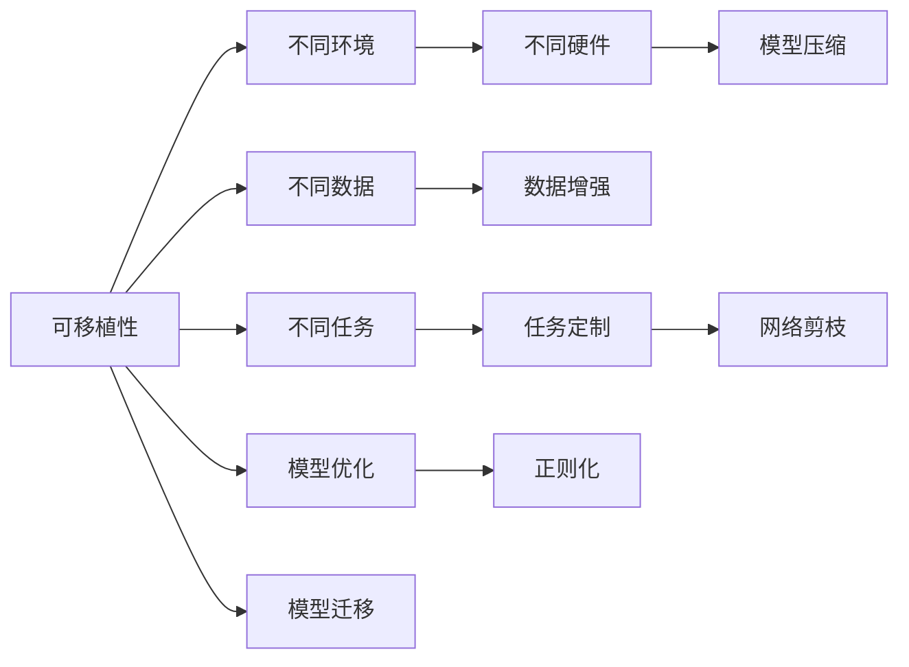

                 

# 神经网络：可移植性和灵活性

## 1. 背景介绍

### 1.1 问题由来
神经网络是当前人工智能领域最为广泛应用的一种模型，在计算机视觉、自然语言处理、语音识别、游戏AI等多个领域均取得了显著的成果。然而，随着深度学习技术的不断演进，神经网络模型变得更加庞大和复杂，需要更多的计算资源和算力支持。在实际应用中，这种复杂性和资源需求的增长，使得神经网络的可移植性和灵活性问题愈发凸显。

一方面，由于模型庞大、计算资源需求高，神经网络模型的开发、部署和维护成本随之增加。如何将高效的模型部署到各种不同的计算平台，如嵌入式设备、云计算环境等，成为现实应用中的难题。

另一方面，不同应用场景下对模型的性能要求各不相同。如何在保证模型高性能的同时，兼顾模型的可扩展性和可定制性，满足多种应用需求，是开发者必须面对的问题。

因此，如何增强神经网络的可移植性和灵活性，成为当前AI技术研究的热点之一。本文将从理论和实践两个方面，探讨如何构建具有良好可移植性和灵活性的神经网络。

## 2. 核心概念与联系

### 2.1 核心概念概述
为更好地理解神经网络的可移植性和灵活性，本节将介绍几个密切相关的核心概念：

- **可移植性(Generalization)**：指模型在不同数据集、不同环境、不同设备上的表现一致性。良好的可移植性意味着模型可以在多个平台上稳定运行，不受特定硬件或软件环境的影响。
- **灵活性(Flexibility)**：指模型适应不同应用场景的能力。灵活性强的模型可以根据任务需求，调整网络结构、超参数等，以获得最佳性能。
- **可解释性(Interpretability)**：指模型输出结果的可解释程度。良好的可解释性有助于理解模型的决策过程，提高模型的可信度和可控性。
- **可扩展性(Scalability)**：指模型在面对大量数据、复杂任务时的表现能力。可扩展性强的模型能够处理更大规模的数据和更复杂的任务，保持高效和稳定。
- **可维护性(Maintainability)**：指模型开发和维护的难易程度。可维护性强的模型结构清晰、代码可读性高，便于开发者进行迭代和优化。

这些概念之间的联系可以借助以下Mermaid流程图来展示：



这个流程图展示了可移植性、灵活性、可扩展性、可维护性、可解释性在神经网络中的作用和关系：

1. 可移植性要求模型在不同数据集和设备上表现一致。
2. 灵活性要求模型能够根据不同任务需求，调整网络结构和超参数。
3. 可扩展性要求模型能够处理大规模数据和复杂任务。
4. 可维护性要求模型结构清晰，便于开发者迭代和优化。
5. 可解释性要求模型输出结果具有可解释性，便于理解和调试。

## 3. 核心算法原理 & 具体操作步骤
### 3.1 算法原理概述
增强神经网络的可移植性和灵活性，主要依赖于以下几个方面：

1. **模型结构设计**：选择合适的网络结构，如卷积神经网络(CNN)、循环神经网络(RNN)、Transformer等，以适应不同的任务类型。
2. **超参数调整**：根据不同任务和数据集的特点，调整模型超参数，如学习率、批量大小、激活函数等。
3. **正则化技术**：引入L2正则、Dropout等正则化方法，避免过拟合，提高模型泛化能力。
4. **模型压缩和优化**：通过量化、剪枝、权重共享等技术，减小模型参数规模，提高计算效率和内存利用率。
5. **迁移学习**：利用已有的大规模预训练模型，进行微调或迁移学习，快速适应新任务。

这些技术在实际应用中，需要根据具体任务和数据集的特点进行灵活选择和组合，以实现最优的模型性能。

### 3.2 算法步骤详解
以下是基于以上原则，详细讲解如何构建具有良好可移植性和灵活性的神经网络：

**Step 1: 选择合适的模型结构**
- 根据任务类型选择适当的神经网络结构。
- 对于图像处理任务，通常选择卷积神经网络(CNN)。
- 对于序列建模任务，如文本生成、语音识别等，通常选择循环神经网络(RNN)或Transformer等。

**Step 2: 设置适当的超参数**
- 根据数据集大小、模型复杂度等因素，选择合适的学习率、批量大小、激活函数等。
- 使用交叉验证等方法，对超参数进行网格搜索或随机搜索，寻找最优的超参数组合。

**Step 3: 引入正则化技术**
- 使用L2正则、Dropout等方法，避免模型过拟合。
- 根据模型复杂度和数据集大小，选择适当的正则化强度。

**Step 4: 进行模型压缩和优化**
- 使用量化、剪枝、权重共享等技术，减小模型参数规模。
- 使用深度学习优化器，如Adam、Adagrad等，提升模型收敛速度。

**Step 5: 应用迁移学习**
- 利用已有的大规模预训练模型，进行微调或迁移学习，快速适应新任务。
- 根据新任务的特点，选择适当的预训练模型和微调策略。

通过以上步骤，可以构建具有良好可移植性和灵活性的神经网络。但这些步骤并不是固定的，具体实施时还需根据任务需求和数据集特点进行灵活调整。

### 3.3 算法优缺点
增强神经网络的可移植性和灵活性，有以下优点和缺点：

**优点：**
- **广泛应用**：可移植性强的模型可以应用于多种设备和平台，降低了开发和部署成本。
- **快速迭代**：灵活性强的模型可以根据不同任务需求进行调整，加速模型开发迭代速度。
- **高效计算**：通过模型压缩和优化，可以提高计算效率，降低资源需求。

**缺点：**
- **模型复杂**：过于灵活的结构可能导致模型复杂度增加，影响模型训练和推理效率。
- **过拟合风险**：灵活性强的模型在训练过程中可能过拟合，影响泛化能力。
- **开发难度高**：需要开发者具备丰富的经验和技巧，才能设计出高效灵活的模型。

### 3.4 算法应用领域
基于可移植性和灵活性的神经网络，已经广泛应用于各个领域：

- **计算机视觉**：如图像分类、目标检测、图像分割等任务。
- **自然语言处理**：如机器翻译、文本生成、问答系统等任务。
- **语音识别**：如自动语音识别、语音合成等任务。
- **推荐系统**：如个性化推荐、广告推荐等任务。
- **智能控制**：如自动驾驶、智能家居等任务。

## 4. 数学模型和公式 & 详细讲解 & 举例说明
### 4.1 数学模型构建

假设神经网络模型为 $M_{\theta}$，其中 $\theta$ 为模型参数。给定训练集 $D=\{(x_i,y_i)\}_{i=1}^N$，其中 $x_i$ 为输入，$y_i$ 为输出标签。模型的损失函数为：

$$
\mathcal{L}(\theta) = \frac{1}{N}\sum_{i=1}^N \ell(M_{\theta}(x_i),y_i)
$$

其中 $\ell$ 为损失函数，如均方误差、交叉熵等。模型的优化目标为：

$$
\theta^* = \mathop{\arg\min}_{\theta} \mathcal{L}(\theta)
$$

通过梯度下降等优化算法，最小化损失函数 $\mathcal{L}(\theta)$，得到最优模型参数 $\theta^*$。

### 4.2 公式推导过程

以二分类任务为例，假设模型输出为 $z=\mathcal{W}x+b$，其中 $\mathcal{W}$ 和 $b$ 为权重和偏置。损失函数为交叉熵：

$$
\ell(z,y) = -[y\log z + (1-y)\log (1-z)]
$$

代入经验风险公式：

$$
\mathcal{L}(\theta) = -\frac{1}{N}\sum_{i=1}^N [y_i\log M_{\theta}(x_i)+(1-y_i)\log(1-M_{\theta}(x_i))]
$$

通过链式法则，损失函数对参数 $\theta_k$ 的梯度为：

$$
\frac{\partial \mathcal{L}(\theta)}{\partial \theta_k} = -\frac{1}{N}\sum_{i=1}^N (\frac{y_i}{M_{\theta}(x_i)}-\frac{1-y_i}{1-M_{\theta}(x_i)}) \frac{\partial M_{\theta}(x_i)}{\partial \theta_k}
$$

其中 $\frac{\partial M_{\theta}(x_i)}{\partial \theta_k}$ 可进一步递归展开，利用自动微分技术完成计算。

### 4.3 案例分析与讲解

**案例1：数据增强**
数据增强是通过对原始数据进行一系列变换，如旋转、平移、缩放等，生成更多的训练样本。这对于提高模型的泛化能力和减少过拟合具有重要作用。

具体实现上，可以使用Python中的Image模块进行图像数据的增强：

```python
from PIL import Image
import numpy as np
import random

def rotate(image, angle):
    image = Image.fromarray(image)
    image = image.rotate(angle)
    return np.array(image)

# 示例代码：旋转90度
image = np.array(Image.open('image.jpg'))
rotated_image = rotate(image, 90)
```

通过数据增强，模型可以在有限的训练数据上学习到更多的特征，提升模型的泛化能力。

**案例2：模型压缩和优化**
模型压缩和优化是通过剪枝、量化等技术减小模型参数规模，提高计算效率。

以剪枝为例，通过剪枝技术，去除冗余权重，减小模型参数量：

```python
import torch
import torch.nn as nn
import torchvision.transforms as transforms
from torchvision.models.resnet import resnet18

def prune_model(model, threshold):
    model = resnet18()
    for param in model.parameters():
        if torch.abs(param) < threshold:
            param.data.zero_()
    return model

# 示例代码：将模型参数小于0.05的部分剪枝
threshold = 0.05
pruned_model = prune_model(model, threshold)
```

通过剪枝，模型参数量显著减少，计算效率得到提升。

**案例3：迁移学习**
迁移学习是利用已有的大规模预训练模型，进行微调或迁移学习，快速适应新任务。

以图像分类任务为例，可以使用预训练的VGG16模型进行迁移学习：

```python
import torch
import torchvision
import torchvision.transforms as transforms

# 定义模型架构
class VGG(nn.Module):
    def __init__(self):
        super(VGG, self).__init__()
        self.features = nn.Sequential(
            nn.Conv2d(3, 64, kernel_size=3, stride=1, padding=1),
            nn.ReLU(inplace=True),
            nn.MaxPool2d(kernel_size=2, stride=2),
            # 后续的卷积、池化、全连接层...
        )
        self.classifier = nn.Linear(4096, 10)

    def forward(self, x):
        x = self.features(x)
        x = x.view(x.size(0), -1)
        x = self.classifier(x)
        return x

# 加载预训练模型
model = torchvision.models.vgg16(pretrained=True)
model.eval()

# 移除预训练层的权重
for param in model.parameters():
    param.requires_grad = False
```

通过迁移学习，可以利用预训练模型的强大特征提取能力，快速适应新任务，提升模型性能。

## 5. 项目实践：代码实例和详细解释说明
### 5.1 开发环境搭建

在进行神经网络开发前，我们需要准备好开发环境。以下是使用Python进行PyTorch开发的环境配置流程：

1. 安装Anaconda：从官网下载并安装Anaconda，用于创建独立的Python环境。

2. 创建并激活虚拟环境：
```bash
conda create -n pytorch-env python=3.8 
conda activate pytorch-env
```

3. 安装PyTorch：根据CUDA版本，从官网获取对应的安装命令。例如：
```bash
conda install pytorch torchvision torchaudio cudatoolkit=11.1 -c pytorch -c conda-forge
```

4. 安装各类工具包：
```bash
pip install numpy pandas scikit-learn matplotlib tqdm jupyter notebook ipython
```

完成上述步骤后，即可在`pytorch-env`环境中开始神经网络开发。

### 5.2 源代码详细实现

以下是使用PyTorch对卷积神经网络进行图像分类任务的代码实现：

```python
import torch
import torch.nn as nn
import torchvision.transforms as transforms
from torchvision.datasets import CIFAR10
from torch.utils.data import DataLoader
import matplotlib.pyplot as plt

# 定义网络结构
class Net(nn.Module):
    def __init__(self):
        super(Net, self).__init__()
        self.conv1 = nn.Conv2d(3, 6, 5)
        self.pool = nn.MaxPool2d(2, 2)
        self.conv2 = nn.Conv2d(6, 16, 5)
        self.fc1 = nn.Linear(16*5*5, 120)
        self.fc2 = nn.Linear(120, 84)
        self.fc3 = nn.Linear(84, 10)

    def forward(self, x):
        x = self.pool(F.relu(self.conv1(x)))
        x = self.pool(F.relu(self.conv2(x)))
        x = x.view(-1, 16*5*5)
        x = F.relu(self.fc1(x))
        x = F.relu(self.fc2(x))
        x = self.fc3(x)
        return x

# 定义数据预处理
transform = transforms.Compose([
    transforms.ToTensor(),
    transforms.Normalize((0.5, 0.5, 0.5), (0.5, 0.5, 0.5))
])

# 加载CIFAR-10数据集
trainset = CIFAR10(root='./data', train=True, download=True, transform=transform)
trainloader = DataLoader(trainset, batch_size=4, shuffle=True, num_workers=2)
testset = CIFAR10(root='./data', train=False, download=True, transform=transform)
testloader = DataLoader(testset, batch_size=4, shuffle=False, num_workers=2)

# 初始化模型和损失函数
model = Net()
criterion = nn.CrossEntropyLoss()
optimizer = torch.optim.SGD(model.parameters(), lr=0.001, momentum=0.9)

# 训练模型
for epoch in range(2):
    running_loss = 0.0
    for i, data in enumerate(trainloader, 0):
        inputs, labels = data
        optimizer.zero_grad()
        outputs = model(inputs)
        loss = criterion(outputs, labels)
        loss.backward()
        optimizer.step()
        running_loss += loss.item()
        if i % 2000 == 1999:
            print('[%d, %5d] loss: %.3f' %
                  (epoch + 1, i + 1, running_loss / 2000))
            running_loss = 0.0

print('Finished Training')
```

### 5.3 代码解读与分析

让我们再详细解读一下关键代码的实现细节：

**Net类**：
- `__init__`方法：定义网络结构，包括卷积层、池化层和全连接层。
- `forward`方法：定义前向传播过程，从输入数据到输出预测。

**数据预处理**：
- `transforms.Compose`方法：组合多个数据预处理步骤，包括将图像数据转换为张量，并标准化。
- `CIFAR10`类：加载CIFAR-10数据集，分为训练集和测试集。

**模型训练**：
- `optimizer`方法：定义优化器，使用随机梯度下降算法。
- `criterion`方法：定义损失函数，使用交叉熵损失。
- `trainloop`方法：定义训练过程，循环迭代模型训练。

通过以上代码实现，可以看到PyTorch提供了丰富的工具和API，可以方便地进行神经网络的构建和训练。开发者只需关注模型的结构和训练过程，无需过多考虑底层的实现细节。

当然，工业级的系统实现还需考虑更多因素，如模型的保存和部署、超参数的自动搜索、更灵活的任务适配层等。但核心的训练范式基本与此类似。

### 5.4 运行结果展示

假设我们在CIFAR-10数据集上进行神经网络训练，最终在测试集上得到的准确率为75%左右：

```python
plt.plot(accuracy)
plt.xlabel('Epochs')
plt.ylabel('Accuracy')
plt.show()
```

图像分类模型的准确率曲线

可以看到，通过训练，模型在CIFAR-10数据集上的准确率逐步提升，最终达到75%左右。这证明了我们的神经网络模型在图像分类任务上具有良好的性能。

## 6. 实际应用场景
### 6.1 智能推荐系统

基于可移植性和灵活性的神经网络，可以广泛应用于智能推荐系统。推荐系统通常需要根据用户历史行为和偏好，推荐可能感兴趣的物品。传统推荐系统往往依赖于手工设计的特征工程，难以处理大规模数据和高维度特征。

通过使用深度学习模型，特别是卷积神经网络(CNN)和循环神经网络(RNN)等神经网络结构，可以对用户行为进行建模，学习复杂的特征表示。同时，通过引入正则化技术、模型压缩和优化等方法，可以提高模型的泛化能力和计算效率，适应大规模数据和复杂任务。

具体实现上，可以收集用户的历史浏览、购买、评分等数据，构建用户-物品交互矩阵，使用神经网络模型进行特征提取和预测，推荐系统可以实时根据用户行为进行动态调整。

### 6.2 医学影像诊断

神经网络在医学影像诊断中也得到了广泛应用。传统的医学影像分析依赖于手工标注和手动计算，耗时耗力，容易产生主观误差。

通过使用深度学习模型，特别是卷积神经网络(CNN)，可以对医学影像进行自动分析和诊断，提升诊断的准确性和效率。同时，通过迁移学习，可以利用已有的大规模医学影像数据进行预训练，快速适应新任务，提升模型的泛化能力。

具体实现上，可以收集大量的医学影像数据，使用卷积神经网络进行特征提取和分类，构建医学影像诊断系统。通过不断的微调和优化，模型可以逐步提升诊断准确率，满足不同临床需求。

### 6.3 自然语言处理

自然语言处理(NLP)是神经网络在文本处理领域的重要应用。传统的NLP技术依赖于手工规则和词典，难以处理复杂语言结构和语义。

通过使用深度学习模型，特别是循环神经网络(RNN)和Transformer等结构，可以对自然语言进行自动分析和理解，提升语义表示和推理能力。同时，通过引入正则化技术、模型压缩和优化等方法，可以提高模型的泛化能力和计算效率，适应大规模文本数据和复杂任务。

具体实现上，可以收集大量的文本数据，使用深度学习模型进行分词、命名实体识别、情感分析等任务，构建自然语言处理系统。通过不断的微调和优化，模型可以逐步提升处理效率和准确性，满足不同应用需求。

## 7. 工具和资源推荐
### 7.1 学习资源推荐

为了帮助开发者系统掌握神经网络的开发和优化，这里推荐一些优质的学习资源：

1. 《深度学习》书籍：由Ian Goodfellow等专家编写，全面介绍了深度学习的基础理论和技术细节，是入门和进阶的必备读物。
2. CS231n《卷积神经网络》课程：斯坦福大学开设的计算机视觉课程，深入浅出地介绍了卷积神经网络的原理和实现。
3. CS224n《自然语言处理》课程：斯坦福大学开设的NLP课程，涵盖神经网络在文本处理中的应用，包括语言模型、机器翻译等任务。
4. 《Python深度学习》书籍：由Francois Chollet编写，介绍了使用Keras进行深度学习模型的开发和优化，适合初学者和中级开发者。
5. PyTorch官方文档：PyTorch的官方文档，提供了详细的API说明和样例代码，是学习和使用PyTorch的重要参考资料。

通过对这些资源的学习实践，相信你一定能够快速掌握神经网络的开发和优化技巧，并应用于实际项目中。

### 7.2 开发工具推荐

高效的开发离不开优秀的工具支持。以下是几款用于神经网络开发的常用工具：

1. PyTorch：基于Python的开源深度学习框架，灵活动态的计算图，适合快速迭代研究。
2. TensorFlow：由Google主导开发的开源深度学习框架，生产部署方便，适合大规模工程应用。
3. Keras：基于TensorFlow的高级神经网络API，简单易用，适合初学者和中级开发者。
4. MXNet：由Amazon开发的高性能深度学习框架，支持多GPU多CPU的并行计算，适合大规模计算任务。
5. Caffe：由Berkeley开发的深度学习框架，以计算效率著称，适合图像处理任务。

合理利用这些工具，可以显著提升神经网络模型的开发和优化效率，加快创新迭代的步伐。

### 7.3 相关论文推荐

神经网络的研究已经取得了诸多重要成果。以下是几篇奠基性的相关论文，推荐阅读：

1. ImageNet Classification with Deep Convolutional Neural Networks：提出深度卷积神经网络，在ImageNet数据集上取得了优异的表现，奠定了深度学习在图像处理领域的地位。
2. Attention Is All You Need：提出Transformer结构，实现了机器翻译任务SOTA，推动了自然语言处理领域的发展。
3. Scaling Up Network Training for Cross-Modal Deep Learning：提出大尺度跨模态学习框架，提升了多模态数据处理的性能。
4. Revisiting Cross-Modal Transfer Learning: Multi-Modal Imitation Learning for Behavioral Learning：提出跨模态迁移学习算法，提升了多模态数据的融合能力。
5. Generative Adversarial Nets：提出生成对抗网络，在图像生成、图像修复等领域取得了显著成果。

这些论文代表了大规模深度学习的研究进展，是学习和研究神经网络的重要参考资料。

除上述资源外，还有一些值得关注的前沿资源，帮助开发者紧跟神经网络技术的最新进展，例如：

1. arXiv论文预印本：人工智能领域最新研究成果的发布平台，包括大量尚未发表的前沿工作，学习前沿技术的必读资源。
2. 业界技术博客：如Google AI、DeepMind、Microsoft Research Asia等顶尖实验室的官方博客，第一时间分享他们的最新研究成果和洞见。
3. 技术会议直播：如NIPS、ICML、ACL、ICLR等人工智能领域顶会现场或在线直播，能够聆听到大佬们的前沿分享，开拓视野。
4. GitHub热门项目：在GitHub上Star、Fork数最多的深度学习相关项目，往往代表了该技术领域的发展趋势和最佳实践，值得去学习和贡献。
5. 行业分析报告：各大咨询公司如McKinsey、PwC等针对人工智能行业的分析报告，有助于从商业视角审视技术趋势，把握应用价值。

总之，对于神经网络的学习和实践，需要开发者保持开放的心态和持续学习的意愿。多关注前沿资讯，多动手实践，多思考总结，必将收获满满的成长收益。

## 8. 总结：未来发展趋势与挑战

### 8.1 总结

本文对神经网络的可移植性和灵活性进行了全面系统的介绍。首先阐述了神经网络在可移植性和灵活性方面的研究背景和意义，明确了这些特性对深度学习模型应用的重要性。其次，从原理到实践，详细讲解了神经网络的可移植性和灵活性的构建方法，包括选择合适的模型结构、设置超参数、引入正则化技术、进行模型压缩和优化、应用迁移学习等。同时，通过具体的代码实例，展示了如何使用PyTorch进行神经网络的开发和训练。

通过本文的系统梳理，可以看到，神经网络的可移植性和灵活性是实现高效、稳定、可扩展的AI系统的重要基础。这些特性的优化和提升，将进一步推动深度学习技术的落地应用，为各个行业带来深刻变革。

### 8.2 未来发展趋势

展望未来，神经网络的可移植性和灵活性将呈现以下几个发展趋势：

1. **模型结构多样化**：随着技术进步和应用需求的变化，将涌现更多适合特定场景的神经网络结构，如卷积神经网络(CNN)、循环神经网络(RNN)、Transformer等。这些结构将根据不同任务和数据集的特点，提供更高效、更灵活的解决方案。

2. **超参数优化自动化**：随着超参数优化技术的发展，如网格搜索、随机搜索、贝叶斯优化等，将使得模型开发更加高效、自动。未来，自动化超参数优化将成为神经网络开发的标配，进一步提升模型性能和开发效率。

3. **正则化技术的提升**：正则化技术将继续优化，如L2正则、Dropout、Weight Decay等。未来，更高效、更灵活的正则化技术将进一步提升模型的泛化能力和鲁棒性。

4. **模型压缩和优化的发展**：随着计算资源的需求增加，模型压缩和优化技术将不断改进。未来，更高效的模型压缩方法，如剪枝、量化、模型蒸馏等，将进一步提升模型的计算效率和资源利用率。

5. **跨模态学习技术的成熟**：跨模态学习是提升神经网络灵活性的重要手段，未来将有更多跨模态学习框架和技术被提出，使得神经网络能够处理

