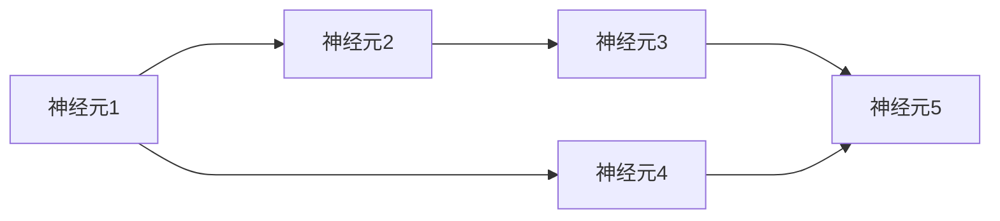
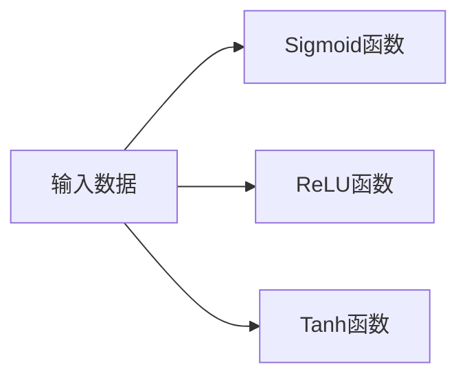
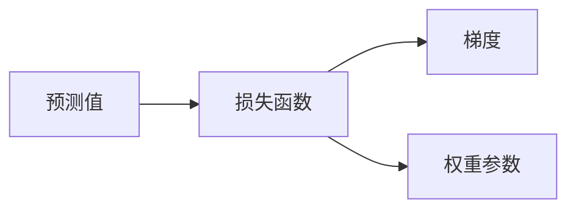

                 

## 1. 背景介绍

### 1.1 问题由来
随着人工智能(AI)技术的迅猛发展，机器学习领域出现了一个新的分支——神经网络。神经网络通过模拟人类大脑的结构和工作原理，可以进行模式识别、数据分析、自然语言处理等复杂任务。本文将介绍神经网络的原理、结构和应用，并探讨其在机器学习领域中的重要性和未来发展趋势。

### 1.2 问题核心关键点
神经网络作为一种机器学习算法，其核心思想是通过模拟神经元之间的连接和传递信息，学习输入与输出之间的映射关系，从而实现对未知数据的预测和分类。与传统的统计学习方法相比，神经网络具有更强的非线性表达能力和泛化能力，能够处理高维数据、非线性关系和不确定性。

神经网络主要分为三类：前馈神经网络(Feedforward Neural Network, FNN)、卷积神经网络(Convolutional Neural Network, CNN)和循环神经网络(Recurrent Neural Network, RNN)。其中，前馈神经网络是基础，卷积神经网络用于图像处理，循环神经网络用于序列数据处理。

本文将从神经网络的基本原理入手，详细探讨其核心算法原理、具体操作步骤、数学模型和实际应用场景，以帮助读者全面理解神经网络在机器学习领域中的作用和前景。

## 2. 核心概念与联系

### 2.1 核心概念概述
神经网络是一种由大量人工神经元(神经元)组成的网络结构，每个神经元接收多个输入，经过一系列线性变换和激活函数，输出结果并传递给下一层神经元。神经网络的输入和输出可以是向量、矩阵或其他复杂的数据结构，中间层通过非线性变换捕捉输入数据的复杂特征。

神经网络主要由以下几个部分组成：

1. **输入层**：接收输入数据，将数据转换为神经网络可以处理的形式。
2. **隐藏层**：通过一系列线性变换和激活函数，提取输入数据的特征。
3. **输出层**：根据隐藏层的特征，输出最终结果，可以是分类标签、回归值或其他类型的数据。

### 2.2 概念间的关系
神经网络的核心概念包括输入、输出、隐藏层、激活函数、损失函数、反向传播、梯度下降等。这些概念之间通过相互联系，形成了一个完整的神经网络系统。

#### 2.2.1 神经元与网络结构
神经元是神经网络的基本单位，通过多个输入和一个输出，进行信息传递和处理。神经网络通过多个神经元的连接，形成网络结构，如图：



#### 2.2.2 激活函数与非线性变换
激活函数是神经元中的关键组成部分，用于引入非线性变换，增加神经网络的表达能力。常用的激活函数包括Sigmoid函数、ReLU函数和Tanh函数，如图：



#### 2.2.3 损失函数与反向传播
损失函数是评估神经网络预测结果与真实结果之间的差异，常用的损失函数包括均方误差(MSE)、交叉熵损失(Cross-Entropy Loss)和二分类交叉熵损失(Binary Cross-Entropy Loss)。反向传播算法通过计算损失函数对权重参数的梯度，更新神经网络的参数，如图：



#### 2.2.4 梯度下降与模型优化
梯度下降是神经网络中最常用的优化算法，通过计算损失函数对权重参数的梯度，不断调整权重参数，使损失函数最小化。常用的优化算法包括随机梯度下降(SGD)、动量(Momentum)、自适应学习率算法(AdaGrad, Adam)等。

## 3. 核心算法原理 & 具体操作步骤
### 3.1 算法原理概述
神经网络的训练过程是一个优化过程，目标是最小化预测结果与真实结果之间的差异。通过反向传播算法，计算损失函数对权重参数的梯度，利用梯度下降算法不断调整权重参数，直到损失函数最小化。

神经网络的训练过程包括以下几个关键步骤：

1. **前向传播**：将输入数据通过神经网络，计算出预测结果。
2. **计算损失**：将预测结果与真实结果比较，计算损失函数。
3. **反向传播**：通过链式法则，计算损失函数对权重参数的梯度。
4. **更新参数**：利用梯度下降算法，更新权重参数。
5. **重复迭代**：重复以上步骤，直到损失函数收敛。

### 3.2 算法步骤详解
下面以一个简单的多层感知器(Multilayer Perceptron, MLP)为例，详细说明神经网络的训练过程。

**Step 1: 准备数据集**
准备训练集和测试集，将数据集划分为训练集和验证集。

**Step 2: 定义模型结构**
定义输入层、隐藏层和输出层的神经元数量，以及激活函数和损失函数。

**Step 3: 初始化权重参数**
随机初始化神经网络的权重参数，如权重矩阵、偏置向量等。

**Step 4: 前向传播**
将输入数据通过神经网络，计算出预测结果。

**Step 5: 计算损失**
将预测结果与真实结果比较，计算损失函数。

**Step 6: 反向传播**
通过链式法则，计算损失函数对权重参数的梯度。

**Step 7: 更新参数**
利用梯度下降算法，更新权重参数。

**Step 8: 重复迭代**
重复以上步骤，直到损失函数收敛。

### 3.3 算法优缺点
神经网络具有以下优点：

1. **非线性表达能力**：通过隐藏层的非线性变换，神经网络可以处理复杂的非线性关系，提高预测精度。
2. **泛化能力**：神经网络可以处理高维数据和不确定性，具有较强的泛化能力。
3. **模型可解释性**：神经网络的权重参数和结构可以解释其内部工作机制，有助于理解模型的决策过程。

同时，神经网络也存在以下缺点：

1. **参数量大**：神经网络中的权重参数数量众多，训练和推理计算量较大。
2. **训练时间长**：神经网络的训练过程复杂，需要大量的计算资源和时间。
3. **过拟合问题**：神经网络容易出现过拟合问题，需要采用正则化技术进行控制。

### 3.4 算法应用领域
神经网络在机器学习领域具有广泛的应用，如图像处理、语音识别、自然语言处理、推荐系统、游戏AI等。以下是几个典型的应用场景：

- **图像处理**：通过卷积神经网络(CNN)，神经网络可以处理图像数据，提取图像特征，进行分类、检测和分割等任务。
- **语音识别**：通过循环神经网络(RNN)，神经网络可以处理语音信号，进行语音识别和情感分析等任务。
- **自然语言处理**：通过前馈神经网络(FNN)和循环神经网络(RNN)，神经网络可以处理文本数据，进行语言翻译、文本分类和情感分析等任务。
- **推荐系统**：通过神经网络模型，可以根据用户的历史行为数据，推荐个性化的商品和服务。
- **游戏AI**：通过神经网络模型，可以训练智能游戏角色，实现自主决策和路径规划等任务。

## 4. 数学模型和公式 & 详细讲解
### 4.1 数学模型构建
神经网络的基本数学模型可以表示为：

$$
f(x) = \sigma(W_n\sigma(W_{n-1}... \sigma(W_1 x + b_1) + b_2) + b_n)
$$

其中，$x$表示输入数据，$\sigma$表示激活函数，$W_i$表示权重矩阵，$b_i$表示偏置向量，$f(x)$表示神经网络的输出结果。

### 4.2 公式推导过程
以一个简单的全连接神经网络为例，推导前向传播和反向传播的公式。

假设输入层有$m$个神经元，隐藏层有$n$个神经元，输出层有$k$个神经元，激活函数为Sigmoid函数。

**前向传播公式**：

$$
\begin{aligned}
& h_1 = \sigma(W_1 x + b_1) \\
& h_2 = \sigma(W_2 h_1 + b_2) \\
& ... \\
& h_n = \sigma(W_n h_{n-1} + b_n) \\
& y = \sigma(W_k h_{n-1} + b_k)
\end{aligned}
$$

其中，$h_i$表示隐藏层的输出结果，$W_i$表示权重矩阵，$b_i$表示偏置向量，$\sigma$表示激活函数。

**反向传播公式**：

$$
\begin{aligned}
& \delta_k = (y - t) g'(y) \\
& \delta_{n-1} = \delta_k W_k^T g'(h_{n-1}) \\
& ... \\
& \delta_1 = \delta_2 W_2^T g'(h_1)
\end{aligned}
$$

其中，$\delta_i$表示第$i$层的误差，$t$表示真实结果，$g'(x)$表示激活函数的导数。

### 4.3 案例分析与讲解
以一个简单的手写数字识别任务为例，说明神经网络的训练过程。

假设输入数据是28x28的图像，输出结果是0到9的数字。可以使用一个三层全连接神经网络进行训练。

**Step 1: 准备数据集**
准备训练集和测试集，将数据集划分为训练集和验证集。

**Step 2: 定义模型结构**
定义输入层、隐藏层和输出层的神经元数量，以及激活函数和损失函数。

**Step 3: 初始化权重参数**
随机初始化神经网络的权重参数，如权重矩阵、偏置向量等。

**Step 4: 前向传播**
将输入数据通过神经网络，计算出预测结果。

**Step 5: 计算损失**
将预测结果与真实结果比较，计算损失函数。

**Step 6: 反向传播**
通过链式法则，计算损失函数对权重参数的梯度。

**Step 7: 更新参数**
利用梯度下降算法，更新权重参数。

**Step 8: 重复迭代**
重复以上步骤，直到损失函数收敛。

在训练过程中，可以使用交叉熵损失函数进行训练，优化器使用随机梯度下降(SGD)。

## 5. 项目实践：代码实例和详细解释说明
### 5.1 开发环境搭建

#### 5.1.1 安装Python
安装Python 3.6或更高版本，可以通过以下命令进行安装：

```bash
sudo apt-get update
sudo apt-get install python3
```

#### 5.1.2 安装TensorFlow
安装TensorFlow，可以通过以下命令进行安装：

```bash
pip install tensorflow
```

#### 5.1.3 安装Keras
安装Keras，可以通过以下命令进行安装：

```bash
pip install keras
```

### 5.2 源代码详细实现
下面以一个简单的手写数字识别任务为例，给出使用Keras库进行神经网络训练的代码实现。

**Step 1: 准备数据集**
```python
import numpy as np
import keras.datasets as datasets

# 加载MNIST数据集
(x_train, y_train), (x_test, y_test) = datasets.mnist.load_data()

# 数据归一化
x_train = x_train.astype('float32') / 255.0
x_test = x_test.astype('float32') / 255.0

# 转换数据格式
x_train = x_train.reshape((len(x_train), 28, 28, 1))
x_test = x_test.reshape((len(x_test), 28, 28, 1))

# 将标签转换为独热编码
y_train = keras.utils.to_categorical(y_train, 10)
y_test = keras.utils.to_categorical(y_test, 10)
```

**Step 2: 定义模型结构**
```python
from keras.models import Sequential
from keras.layers import Dense, Flatten

# 定义模型
model = Sequential()
model.add(Flatten(input_shape=(28, 28, 1)))
model.add(Dense(128, activation='relu'))
model.add(Dense(10, activation='softmax'))
```

**Step 3: 编译模型**
```python
from keras.optimizers import SGD

# 编译模型
model.compile(optimizer=SGD(lr=0.01, momentum=0.9), loss='categorical_crossentropy', metrics=['accuracy'])
```

**Step 4: 训练模型**
```python
# 训练模型
model.fit(x_train, y_train, epochs=10, batch_size=32, validation_data=(x_test, y_test))
```

### 5.3 代码解读与分析
以上代码展示了使用Keras库进行手写数字识别任务的神经网络训练过程。

**Step 1: 准备数据集**
首先，加载MNIST数据集，并进行数据归一化和格式转换。最后，将标签转换为独热编码，方便后续模型的训练。

**Step 2: 定义模型结构**
定义一个简单的三层神经网络，包含一个输入层、一个隐藏层和一个输出层。输入层通过Flatten层将二维的图像数据转换为一维向量，隐藏层和输出层分别包含128个和10个神经元，激活函数分别为ReLU和Softmax。

**Step 3: 编译模型**
编译模型，选择随机梯度下降(SGD)优化器，学习率为0.01，动量为0.9，损失函数为交叉熵损失函数，评估指标为准确率。

**Step 4: 训练模型**
使用训练数据进行模型训练，设置10个epoch，每批次32个样本，使用测试数据进行验证。

### 5.4 运行结果展示
在训练过程中，可以在Keras控制台中查看训练日志，了解模型的训练状态和指标。训练完成后，可以使用测试数据进行模型评估，得到准确率和损失函数。

## 6. 实际应用场景
### 6.1 图像识别
神经网络在图像识别领域具有广泛的应用，如图像分类、目标检测和图像分割等。以图像分类为例，可以使用卷积神经网络(CNN)进行训练，如图：


### 6.2 自然语言处理
神经网络在自然语言处理领域也具有广泛的应用，如文本分类、情感分析和机器翻译等。以文本分类为例，可以使用前馈神经网络(FNN)进行训练，如图：


### 6.3 语音识别
神经网络在语音识别领域也有广泛的应用，如语音识别和情感分析等。以语音识别为例，可以使用循环神经网络(RNN)进行训练，如图：


## 7. 工具和资源推荐
### 7.1 学习资源推荐
为了帮助开发者系统掌握神经网络的原理和实践，这里推荐一些优质的学习资源：

1. 《深度学习》课程：斯坦福大学Andrew Ng教授开设的深度学习课程，涵盖神经网络的基本原理和实现方法。
2. 《Python深度学习》书籍：Ian Goodfellow等编写的深度学习经典教材，涵盖神经网络、卷积神经网络、循环神经网络等。
3. TensorFlow官方文档：TensorFlow的官方文档，提供详细的神经网络实现和应用案例。
4. PyTorch官方文档：PyTorch的官方文档，提供丰富的神经网络实现和工具库。
5. Keras官方文档：Keras的官方文档，提供简洁易用的神经网络实现和应用框架。

通过对这些资源的学习实践，相信你一定能够快速掌握神经网络的基本原理和应用技巧，并用于解决实际的机器学习问题。

### 7.2 开发工具推荐
高效的开发离不开优秀的工具支持。以下是几款用于神经网络开发的常用工具：

1. TensorFlow：由Google主导开发的深度学习框架，支持多种神经网络模型，包括卷积神经网络(CNN)、循环神经网络(RNN)和深度神经网络(DNN)等。
2. PyTorch：由Facebook主导开发的深度学习框架，具有动态计算图和高效的GPU加速，适合快速迭代研究。
3. Keras：由Google主导开发的高级神经网络库，提供简单易用的API，适合快速开发和部署神经网络模型。
4. Jupyter Notebook：开源的交互式编程环境，支持Python、R等语言，提供丰富的可视化工具。
5. Anaconda：Python环境的集成工具，提供虚拟环境和依赖管理，适合开发复杂的大型项目。

合理利用这些工具，可以显著提升神经网络开发和研究的效率，加快创新迭代的步伐。

### 7.3 相关论文推荐
神经网络的发展离不开学界的持续研究。以下是几篇奠基性的相关论文，推荐阅读：

1. 《深度学习》：Ian Goodfellow等编写的深度学习经典教材，涵盖神经网络、卷积神经网络、循环神经网络等。
2. 《ImageNet Large Scale Visual Recognition Challenge》：Alex Krizhevsky等人在ImageNet数据集上使用卷积神经网络进行图像分类，取得了当时最好的结果。
3. 《Natural Language Processing with Neural Networks》：Yoshua Bengio等人编写的自然语言处理教材，涵盖神经网络在NLP领域的应用。
4. 《Attention is All You Need》：Google的Transformer模型，引入了自注意力机制，取得了当时最好的NLP效果。
5. 《Neural Architecture Search with Reinforcement Learning》：Google的神经网络架构搜索算法，利用强化学习优化神经网络结构。

这些论文代表了大神经网络的发展脉络。通过学习这些前沿成果，可以帮助研究者把握学科前进方向，激发更多的创新灵感。

## 8. 总结：未来发展趋势与挑战
### 8.1 总结

本文对神经网络的基本原理、结构和应用进行了全面系统的介绍。首先阐述了神经网络的定义和基本结构，介绍了激活函数、损失函数、反向传播和梯度下降等核心概念，明确了神经网络在机器学习领域中的作用和前景。其次，从数学模型和代码实现的角度，详细讲解了神经网络的训练过程，并通过案例分析，进一步说明了神经网络的应用场景。

通过本文的系统梳理，可以看到，神经网络作为机器学习的重要范式，在图像处理、自然语言处理、语音识别等领域具有广泛的应用。未来，伴随神经网络技术的不断演进，其应用领域将更加广泛，技术能力将更加强大，有望推动人工智能技术的深度发展和广泛应用。

### 8.2 未来发展趋势

展望未来，神经网络的发展将呈现以下几个趋势：

1. **更高效的网络结构**：未来将出现更加高效的网络结构，如胶囊网络、Transformer等，能够更加准确地处理复杂的数据。
2. **更大的数据规模**：随着数据收集和存储技术的发展，神经网络将能够处理更大规模的数据，提升模型的泛化能力和性能。
3. **更强的适应性**：未来的神经网络将更加灵活，能够适应不同的任务和数据分布，实现跨领域迁移学习。
4. **更智能的优化算法**：未来的优化算法将更加智能，能够自动调整学习率、动量等参数，提升模型训练的效率和效果。
5. **更强大的解释能力**：未来的神经网络将更加透明，能够提供更强的解释能力，增强模型的可解释性和可靠性。

### 8.3 面临的挑战

尽管神经网络在机器学习领域取得了巨大的成功，但仍然面临许多挑战：

1. **训练时间和计算资源**：神经网络需要大量的计算资源和时间进行训练，如何降低训练时间和资源消耗是一个重要问题。
2. **模型可解释性**：神经网络的决策过程难以解释，需要进一步提升模型的可解释性和可理解性。
3. **过拟合问题**：神经网络容易出现过拟合问题，需要进一步提高模型的泛化能力和鲁棒性。
4. **数据偏见**：神经网络容易受到数据偏见的影响，需要进一步提高模型的公平性和鲁棒性。
5. **伦理和安全问题**：神经网络可能存在伦理和安全问题，如隐私泄露、偏见歧视等，需要进一步加强模型的监管和管理。

### 8.4 研究展望

面对神经网络面临的挑战，未来的研究需要在以下几个方面寻求新的突破：

1. **更高效的网络结构**：设计更加高效的网络结构，如胶囊网络、Transformer等，提升模型的训练效率和性能。
2. **更智能的优化算法**：开发更加智能的优化算法，如自动调参、自适应学习率等，提高模型的训练效率和效果。
3. **更强大的解释能力**：开发更强大的解释工具，如模型可视化、特征解释等，增强模型的可解释性和可靠性。
4. **更公平的数据管理**：引入公平性和鲁棒性约束，如数据增广、对抗样本等，提升模型的公平性和鲁棒性。
5. **更安全的模型监管**：引入伦理和安全约束，如隐私保护、透明度等，保障模型的公平性和安全性。

总之，神经网络作为机器学习的重要范式，在未来的发展中将面临诸多挑战，但同时也充满了无限机遇。只有不断突破技术瓶颈，持续创新，才能推动神经网络技术的不断进步和应用。

## 9. 附录：常见问题与解答

**Q1：神经网络是否适用于所有机器学习任务？**

A: 神经网络在处理复杂的非线性关系和不确定性方面具有优势，适用于许多机器学习任务，如图像分类、语音识别、自然语言处理等。但对于一些简单的任务，如线性回归、逻辑回归等，传统的线性模型可能更加适用。

**Q2：如何选择合适的神经网络结构？**

A: 选择合适的神经网络结构需要根据具体任务和数据特点进行综合考虑。一般来说，对于简单的任务，可以选择较浅的神经网络结构；对于复杂的数据，可以选择较深的神经网络结构。此外，还可以通过神经网络架构搜索算法，自动选择最优的网络结构。

**Q3：神经网络在训练过程中容易出现过拟合问题，如何解决？**

A: 解决神经网络过拟合问题的方法有很多，如正则化技术、Dropout、数据增强等。正则化技术可以限制模型的复杂度，防止过拟合。Dropout可以在训练过程中随机丢弃一些神经元，减少模型的复杂度。数据增强可以通过对训练数据进行扩充，提高模型的泛化能力。

**Q4：神经网络的训练时间和计算资源消耗较大，如何解决？**

A: 解决神经网络训练时间和计算资源消耗较大的问题，可以通过以下方法：1) 使用GPU和TPU等高性能硬件设备进行加速；2) 使用深度网络剪枝技术，减少模型参数数量；3) 使用量化技术，将浮点模型转换为定点模型；4) 使用分布式训练，提高训练效率。

**Q5：神经网络的解释性较弱，如何增强其可解释性？**

A: 增强神经网络的解释性可以通过以下方法：1) 使用可视化工具，如图像特征可视化、梯度可视化等；2) 使用特征解释技术，如LIME、SHAP等；3) 使用可解释性模型，如决策树、线性模型等。这些方法可以帮助我们更好地理解神经网络的决策过程和输出结果。

总之，神经网络作为机器学习的重要范式，在未来的发展中将面临诸多挑战，但同时也充满了无限机遇。只有不断突破技术瓶颈，持续创新，才能推动神经网络技术的不断进步和应用。

