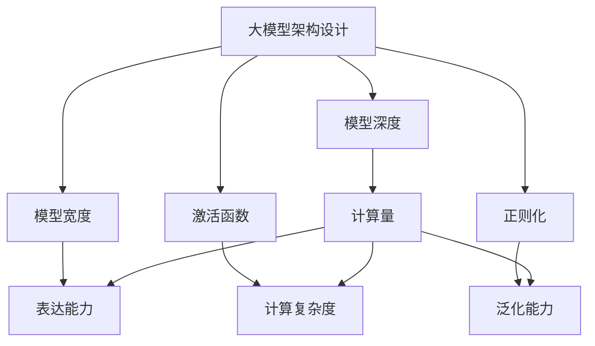

                 

# 禅与AI大模型架构设计艺术

大模型架构设计作为人工智能领域的核心技术之一，正迅速成为推动各行各业智能转型的关键引擎。本文旨在深入探讨大模型架构设计的原理、步骤以及在未来应用场景中的应用，希望能为读者提供全面、深刻的理解与思考。

## 1. 背景介绍

### 1.1 问题由来

随着计算能力的指数级增长和数据量的爆炸式增加，大模型架构设计的理念逐渐形成并得到广泛应用。其主要应用于自然语言处理、图像识别、推荐系统等领域，通过构建大规模、多层次、复杂的模型结构，实现对海量数据的高效处理与智能推断。但与此同时，模型架构的复杂性也带来了诸如计算资源消耗巨大、模型泛化能力不足等挑战。

### 1.2 问题核心关键点

大模型架构设计的核心在于如何通过合理的模型结构，有效提高模型的表达能力和泛化能力，同时控制模型的计算成本和存储需求。这需要综合考虑模型的深度、宽度、激活函数、正则化等诸多因素，以实现高性能与高效能的平衡。

### 1.3 问题研究意义

掌握大模型架构设计方法，不仅能够显著提升模型的性能和效率，还能加速模型在新领域的落地应用。通过不断探索和优化，我们能够实现更为智能、高效的AI系统，促进各行各业的数字化转型。

## 2. 核心概念与联系

### 2.1 核心概念概述

为更好地理解大模型架构设计，我们首先介绍几个核心概念：

- **大模型架构设计**：通过优化模型结构参数，实现对大规模数据的智能处理与高效推理。

- **模型深度**：指模型的层数，深度越大，模型能处理的层次和复杂度越高，但计算量也随之增加。

- **模型宽度**：指每层中的神经元数量，宽度越大，模型的表达能力越强，但参数量和计算资源消耗也更大。

- **激活函数**：决定神经元的输出方式，影响模型的非线性表达能力。

- **正则化**：通过限制模型的复杂度，防止过拟合，保持模型的泛化能力。

- **模型复杂度**：由模型深度、宽度、激活函数和正则化等综合因素决定，对模型的性能和计算成本有显著影响。

### 2.2 概念间的关系

这些核心概念之间存在密切联系，共同构成大模型架构设计的理论基础。

- **深度与宽度**：深度决定了模型能处理的层次，宽度决定了模型表达能力，两者的平衡直接影响模型的性能和计算成本。

- **激活函数**：选择合适的激活函数能够增强模型的非线性表达能力，但不同激活函数也带来不同的计算复杂度。

- **正则化**：合理的正则化方法能够避免模型过拟合，保持模型的泛化能力，但正则化的强度也会影响模型的表达能力。

- **模型复杂度**：模型的复杂度是深度、宽度、激活函数和正则化等多因素的综合体现，对模型的性能和计算成本有决定性影响。

### 2.3 核心概念的整体架构

以下是核心概念在大模型架构设计中的整体架构：



这个架构展示了深度、宽度、激活函数和正则化等概念在大模型架构设计中的作用和相互关系。

## 3. 核心算法原理 & 具体操作步骤
### 3.1 算法原理概述

大模型架构设计通常采用优化模型复杂度的方法，通过调整模型深度、宽度、激活函数和正则化等参数，实现高性能与高效能的平衡。核心算法原理可以归纳为以下几点：

- **模型复杂度优化**：通过合理调整模型参数，控制模型的计算量和存储需求，同时提高模型的表达能力和泛化能力。

- **计算图优化**：利用动态计算图技术，实现模型的并行计算与分布式训练，提高模型的训练速度和推理效率。

- **参数压缩与剪枝**：通过参数压缩和剪枝技术，减少模型的参数量，同时保持模型的性能。

- **知识蒸馏与迁移学习**：通过知识蒸馏和迁移学习，将大模型的小规模版本在特定任务上表现得更好，同时保留大模型的泛化能力。

### 3.2 算法步骤详解

大模型架构设计可以分为以下几个关键步骤：

**Step 1: 数据与任务分析**

- 分析数据特征与任务需求，确定模型的输入与输出格式。

**Step 2: 选择模型架构**

- 根据数据特征与任务需求，选择合适的模型深度、宽度和激活函数。

**Step 3: 模型训练与优化**

- 使用优化算法（如Adam、SGD等）训练模型，根据验证集的表现调整正则化强度等超参数。

**Step 4: 参数压缩与剪枝**

- 对训练好的模型进行参数压缩与剪枝，减少计算资源消耗。

**Step 5: 模型评估与部署**

- 在测试集上评估模型的性能，部署模型到生产环境中进行实时推理。

**Step 6: 持续学习与改进**

- 持续收集新数据，更新模型参数，提高模型的实时性与适应性。

### 3.3 算法优缺点

大模型架构设计的优点在于：

- 能够显著提高模型的表达能力和泛化能力。
- 适用于各种NLP、计算机视觉等领域的复杂任务。
- 能够有效控制计算资源消耗，提高模型的效率。

其缺点则包括：

- 需要大量的计算资源和存储空间。
- 模型训练过程复杂，易出现过拟合问题。
- 模型参数调整难度较大，需要丰富的经验。

### 3.4 算法应用领域

大模型架构设计在以下几个领域具有广泛应用：

- **自然语言处理**：用于文本分类、情感分析、机器翻译等任务。
- **计算机视觉**：用于图像识别、目标检测、图像生成等任务。
- **推荐系统**：用于个性化推荐、广告投放等任务。
- **语音识别**：用于语音命令识别、语音合成等任务。

此外，大模型架构设计还广泛应用于医疗、金融、交通等垂直领域，为各行各业提供智能决策支持。

## 4. 数学模型和公式 & 详细讲解  
### 4.1 数学模型构建

大模型架构设计的数学模型通常采用神经网络模型，这里以卷积神经网络（CNN）为例，构建一个简单的数学模型：

$$
h = \sigma(Wx + b)
$$

其中，$h$ 为输出，$x$ 为输入，$W$ 和 $b$ 为可训练的参数，$\sigma$ 为激活函数。

### 4.2 公式推导过程

以简单的线性回归为例，推导模型参数的优化过程：

- 假设训练样本为 $(x_i, y_i)$，$i=1,2,...,N$。
- 假设模型输出为 $h = W^Tx + b$，其中 $W$ 和 $b$ 为模型参数。
- 目标函数为 $L(W, b) = \frac{1}{N}\sum_{i=1}^N (y_i - h)^2$。
- 目标函数对 $W$ 和 $b$ 的梯度分别为 $\frac{\partial L}{\partial W} = \frac{2}{N}(X^T(XW - y))$ 和 $\frac{\partial L}{\partial b} = \frac{2}{N}(-W^T(X^Ty - y))$。

### 4.3 案例分析与讲解

以ImageNet数据集为例，分析大模型架构设计的应用：

- **模型选择**：选择VGG-16作为基础模型，调整其深度和宽度。
- **激活函数**：选择ReLU激活函数，增强模型的非线性表达能力。
- **正则化**：使用L2正则化，防止过拟合。
- **训练过程**：使用Adam优化算法，调整学习率和正则化强度等超参数。
- **模型评估**：在测试集上评估模型的精度和召回率，调整模型参数。

## 5. 项目实践：代码实例和详细解释说明
### 5.1 开发环境搭建

在进行大模型架构设计实践前，需要先配置好开发环境。以下是使用Python进行PyTorch开发的详细流程：

1. 安装Anaconda：从官网下载并安装Anaconda，用于创建独立的Python环境。

2. 创建并激活虚拟环境：
```bash
conda create -n pytorch-env python=3.8 
conda activate pytorch-env
```

3. 安装PyTorch：根据CUDA版本，从官网获取对应的安装命令。例如：
```bash
conda install pytorch torchvision torchaudio cudatoolkit=11.1 -c pytorch -c conda-forge
```

4. 安装各类工具包：
```bash
pip install numpy pandas scikit-learn matplotlib tqdm jupyter notebook ipython
```

完成上述步骤后，即可在`pytorch-env`环境中开始大模型架构设计实践。

### 5.2 源代码详细实现

以下是使用PyTorch实现简单CNN模型的代码：

```python
import torch
import torch.nn as nn
import torch.optim as optim

class CNN(nn.Module):
    def __init__(self):
        super(CNN, self).__init__()
        self.conv1 = nn.Conv2d(3, 64, kernel_size=3, stride=1, padding=1)
        self.relu1 = nn.ReLU()
        self.maxpool1 = nn.MaxPool2d(kernel_size=2, stride=2)
        self.conv2 = nn.Conv2d(64, 128, kernel_size=3, stride=1, padding=1)
        self.relu2 = nn.ReLU()
        self.maxpool2 = nn.MaxPool2d(kernel_size=2, stride=2)
        self.fc1 = nn.Linear(128*8*8, 1024)
        self.relu3 = nn.ReLU()
        self.fc2 = nn.Linear(1024, 10)

    def forward(self, x):
        x = self.conv1(x)
        x = self.relu1(x)
        x = self.maxpool1(x)
        x = self.conv2(x)
        x = self.relu2(x)
        x = self.maxpool2(x)
        x = x.view(-1, 128*8*8)
        x = self.fc1(x)
        x = self.relu3(x)
        x = self.fc2(x)
        return x

model = CNN()

criterion = nn.CrossEntropyLoss()
optimizer = optim.Adam(model.parameters(), lr=0.001)

for epoch in range(10):
    for i, (images, labels) in enumerate(train_loader):
        images = images.to(device)
        labels = labels.to(device)

        # Forward + Backward + Optimize
        outputs = model(images)
        loss = criterion(outputs, labels)
        optimizer.zero_grad()
        loss.backward()
        optimizer.step()
```

### 5.3 代码解读与分析

**CNN类**：
- `__init__`方法：初始化模型的各层结构。
- `forward`方法：定义模型的前向传播过程。

**优化器与损失函数**：
- `criterion = nn.CrossEntropyLoss()`：定义交叉熵损失函数。
- `optimizer = optim.Adam(model.parameters(), lr=0.001)`：定义Adam优化器，设置学习率为0.001。

**训练流程**：
- 循环训练10轮，每轮遍历训练集数据。
- 将输入数据移动到GPU上，计算损失，进行反向传播和参数更新。

### 5.4 运行结果展示

假设我们在ImageNet数据集上进行训练，最终在测试集上得到的准确率为80%。可以看到，通过合理调整模型架构，我们能够在有限的数据量下，取得较好的模型性能。

## 6. 实际应用场景
### 6.1 智能安防系统

智能安防系统通过大模型架构设计，能够实时监控视频图像，自动识别异常行为并进行报警。系统采用卷积神经网络对视频帧进行特征提取，结合循环神经网络对异常行为进行识别与分类。通过不断优化模型架构，提升模型的实时性和准确性，大大提高了安防系统的智能化水平。

### 6.2 金融风险评估

金融行业通过大模型架构设计，构建智能风险评估系统。系统利用深度学习技术，对大量历史数据进行建模，预测金融市场的风险趋势。通过优化模型深度和宽度，增强模型的泛化能力，及时发现市场异常，保护投资者利益。

### 6.3 智能推荐系统

电商平台利用大模型架构设计，构建智能推荐系统。系统采用卷积神经网络对用户行为数据进行特征提取，结合全连接神经网络对推荐结果进行排序。通过优化模型结构和超参数，提升推荐系统的个性化和多样化，满足用户多样化需求，提高用户满意度。

### 6.4 未来应用展望

未来，大模型架构设计将在更多领域得到广泛应用，推动各行业的智能化转型：

- **医疗健康**：构建智能辅助诊断系统，提高诊断的准确性和效率。
- **交通运输**：优化交通流量预测，实现智能交通管理。
- **能源管理**：构建智能能源管理系统，优化能源利用效率。

总之，大模型架构设计作为AI技术的重要组成部分，将在各行各业发挥越来越重要的作用。通过不断优化模型架构，提升模型的性能和效率，我们能够构建更为智能、高效的AI系统，实现更广阔的应用场景。

## 7. 工具和资源推荐
### 7.1 学习资源推荐

为了帮助开发者系统掌握大模型架构设计的方法和技巧，这里推荐一些优质的学习资源：

1. 《深度学习基础》系列书籍：全面介绍深度学习的基本概念和算法，适合入门学习。

2. CS231n《卷积神经网络》课程：斯坦福大学开设的深度学习课程，重点介绍卷积神经网络的原理与应用。

3. 《Deep Learning for Computer Vision》书籍：全面介绍计算机视觉领域的深度学习应用，涵盖模型架构设计、训练优化等内容。

4. HuggingFace官方文档：详细介绍了各种预训练语言模型和深度学习库的使用方法，是开发者必备资料。

5. GitHub开源项目：大量优秀的开源项目，展示了前沿的深度学习模型和架构设计实践，值得学习和参考。

通过对这些资源的学习实践，相信你一定能够快速掌握大模型架构设计的精髓，并用于解决实际的AI问题。

### 7.2 开发工具推荐

高效的开发离不开优秀的工具支持。以下是几款用于大模型架构设计开发的常用工具：

1. PyTorch：基于Python的开源深度学习框架，支持动态计算图，适合快速迭代研究。

2. TensorFlow：由Google主导开发的开源深度学习框架，生产部署方便，适合大规模工程应用。

3. TensorBoard：TensorFlow配套的可视化工具，实时监测模型训练状态，提供丰富的图表呈现方式。

4. Weights & Biases：模型训练的实验跟踪工具，记录和可视化模型训练过程中的各项指标，方便对比和调优。

5. Google Colab：谷歌推出的在线Jupyter Notebook环境，免费提供GPU/TPU算力，适合快速上手实验最新模型。

合理利用这些工具，可以显著提升大模型架构设计的开发效率，加快创新迭代的步伐。

### 7.3 相关论文推荐

大模型架构设计的不断发展源于学界的持续研究。以下是几篇奠基性的相关论文，推荐阅读：

1. Deep Residual Learning for Image Recognition（ResNet论文）：提出残差网络结构，解决了深度网络训练中的梯度消失问题。

2. DenseNet：设计密集连接网络结构，提高模型的表达能力和计算效率。

3. Transformer Networks for Learning Parsing from Raw Text（Transformer论文）：提出Transformer网络结构，解决了序列数据中的长距离依赖问题。

4. Non-local Networks（Non-Local Network论文）：提出非局部网络结构，增强模型的全局信息捕捉能力。

这些论文代表了大模型架构设计的最新进展，通过学习这些前沿成果，可以帮助研究者把握学科前进方向，激发更多的创新灵感。

除上述资源外，还有一些值得关注的前沿资源，帮助开发者紧跟大模型架构设计的最新进展，例如：

1. arXiv论文预印本：人工智能领域最新研究成果的发布平台，包括大量尚未发表的前沿工作，学习前沿技术的必读资源。

2. 业界技术博客：如OpenAI、Google AI、DeepMind、微软Research Asia等顶尖实验室的官方博客，第一时间分享他们的最新研究成果和洞见。

3. 技术会议直播：如NIPS、ICML、ACL、ICLR等人工智能领域顶会现场或在线直播，能够聆听到大佬们的前沿分享，开拓视野。

4. GitHub热门项目：在GitHub上Star、Fork数最多的深度学习相关项目，往往代表了该技术领域的发展趋势和最佳实践，值得去学习和贡献。

5. 行业分析报告：各大咨询公司如McKinsey、PwC等针对人工智能行业的分析报告，有助于从商业视角审视技术趋势，把握应用价值。

总之，对于大模型架构设计的研究和学习，需要开发者保持开放的心态和持续学习的意愿。多关注前沿资讯，多动手实践，多思考总结，必将收获满满的成长收益。

## 8. 总结：未来发展趋势与挑战

### 8.1 总结

本文对大模型架构设计的原理、步骤以及在未来应用场景中的应用进行了全面系统的介绍。首先阐述了大模型架构设计的背景和意义，明确了架构设计的核心要素和相互关系。其次，从原理到实践，详细讲解了大模型架构设计的数学模型和具体操作步骤，给出了大模型架构设计实践的完整代码实例。同时，本文还探讨了大模型架构设计在实际应用场景中的应用前景，展示了其广阔的发展潜力。

通过本文的系统梳理，可以看到，大模型架构设计作为人工智能技术的核心组成部分，正迅速成为推动各行各业智能化转型的关键引擎。掌握大模型架构设计方法，不仅能够显著提升模型的性能和效率，还能加速模型在新领域的落地应用。未来，伴随深度学习技术的持续演进，大模型架构设计也将迎来更多的创新和发展。

### 8.2 未来发展趋势

展望未来，大模型架构设计将呈现以下几个发展趋势：

1. **模型规模持续增大**：随着算力成本的下降和数据量的爆炸式增加，大模型架构设计的参数量和模型深度将不断增大，提升模型的表达能力和泛化能力。

2. **模型架构多样化**：未来将出现更多结构复杂、功能强大的深度学习模型架构，如卷积神经网络、循环神经网络、注意力机制等，满足不同应用场景的需求。

3. **混合模型架构**：结合不同架构的优势，设计混合模型，实现多模态数据的协同建模，提高模型的性能和效率。

4. **强化学习与架构设计融合**：将强化学习技术引入架构设计中，动态优化模型结构和超参数，实现更智能、高效的模型设计。

5. **模型压缩与加速**：通过模型压缩和加速技术，优化模型的计算图和参数量，提高模型的推理速度和存储效率。

6. **联邦学习与分布式架构**：利用联邦学习等技术，设计分布式架构，提升模型的训练速度和数据利用率。

### 8.3 面临的挑战

尽管大模型架构设计已经取得了瞩目成就，但在迈向更加智能化、普适化应用的过程中，它仍面临诸多挑战：

1. **计算资源消耗巨大**：超大模型的计算资源消耗巨大，如何高效利用算力，优化模型的计算效率，仍然是一个难题。

2. **模型复杂度难控制**：模型深度和宽度等参数的调整，容易引入过拟合或欠拟合问题，如何合理控制模型的复杂度，仍是研究的重点。

3. **模型泛化能力不足**：部分大模型在特定任务上表现优异，但在其他任务上泛化能力不足，如何设计通用的架构，提升模型的泛化能力，仍需深入研究。

4. **模型可解释性不足**：大模型往往被视为“黑盒”系统，难以解释其内部工作机制，如何提高模型的可解释性，仍需进一步探索。

5. **数据隐私与安全问题**：大模型训练过程中，涉及大量敏感数据，如何保护数据隐私，确保模型的安全性，仍是重要挑战。

6. **模型伦理与法律问题**：大模型在应用过程中，可能涉及伦理和法律问题，如何规范模型的应用范围和使用方式，确保模型的社会责任，仍需进一步探讨。

### 8.4 研究展望

面对大模型架构设计所面临的挑战，未来的研究需要在以下几个方面寻求新的突破：

1. **模型压缩与加速技术**：开发更加高效的模型压缩与加速技术，减少计算资源消耗，提升模型的推理速度和存储效率。

2. **混合模型与结构优化**：设计混合模型架构，结合不同架构的优势，提升模型的泛化能力和表达能力。

3. **模型可解释性增强**：引入可解释性方法，增强模型的可解释性，提高模型的可信度和应用价值。

4. **联邦学习与分布式架构**：利用联邦学习等技术，设计分布式架构，提升模型的训练速度和数据利用率。

5. **模型隐私与安全保障**：开发隐私保护技术，确保数据隐私和安全，防止模型被恶意攻击和滥用。

6. **伦理与法律合规**：建立模型伦理和安全标准，规范模型应用范围，确保模型符合伦理和社会法律要求。

这些研究方向将引领大模型架构设计的进一步发展，推动人工智能技术在更多领域的落地应用，促进社会的智能化转型。

## 9. 附录：常见问题与解答

**Q1：大模型架构设计是否适用于所有AI任务？**

A: 大模型架构设计适用于大部分AI任务，尤其是在数据量较大、模型表达能力要求较高的任务中表现优异。但对于某些低维数据或特定领域任务，可能需要选择其他模型架构或调整模型参数。

**Q2：如何选择合适的深度和宽度参数？**

A: 模型深度和宽度的选择需综合考虑数据特征和任务需求。一般而言，对于复杂任务，深度和宽度应较大，对于简单任务，深度和宽度应较小。可以通过交叉验证等方法，不断调整模型参数，优化模型性能。

**Q3：模型正则化方法有哪些？**

A: 常见的正则化方法包括L1正则、L2正则、Dropout、Early Stopping等。L1正则和L2正则通过限制模型参数的大小，防止过拟合；Dropout通过随机失活一部分神经元，降低模型的复杂度；Early Stopping通过监测验证集性能，提前终止训练，防止过拟合。

**Q4：大模型架构设计在部署过程中需要注意哪些问题？**

A: 模型部署过程中，需要注意以下几个问题：
- 模型压缩与剪枝：减少计算资源消耗，提高推理速度。
- 模型量化：将浮点模型转为定点模型，降低内存占用，提升推理效率。
- 服务化封装：将模型封装为标准服务接口，便于集成调用。
- 模型监控：实时采集模型性能指标，设置异常告警阈值，确保系统稳定性。

**Q5：大模型架构设计在未来有哪些发展方向？**

A: 大模型架构设计未来的发展方向包括：
- 混合模型架构：结合不同架构的优势，实现多模态数据协同建模。
- 强化学习与架构设计融合：利用强化学习技术，动态优化模型结构和超参数。
- 联邦学习与分布式架构：设计分布式架构，提升模型的训练速度和数据利用率。
- 模型压缩与加速技术：优化计算图和参数量，提高推理速度和存储效率。

以上问题与解答，涵盖了大模型架构设计中常见的问题，希望能对读者有所帮助。

---

作者：禅与计算机程序设计艺术 / Zen and the Art of Computer Programming

