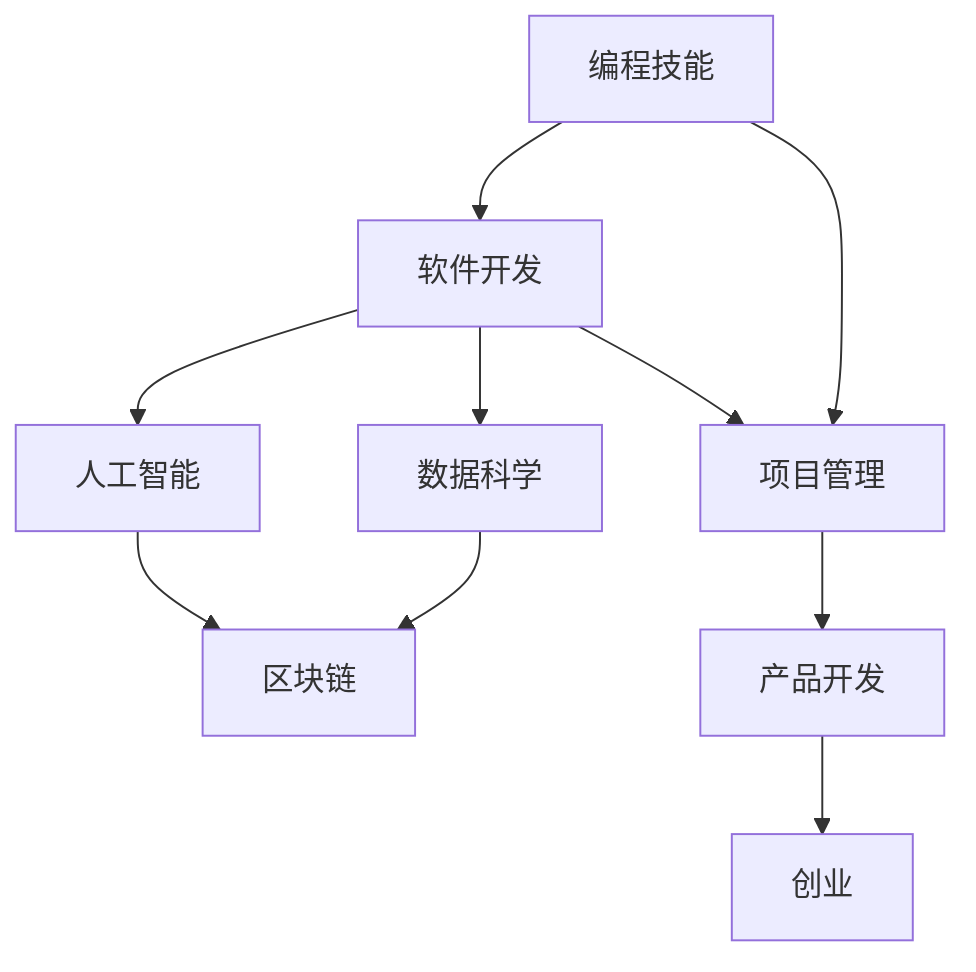

                 

# 程序员的跨界学习：拓宽收入渠道

> 关键词：跨界学习, 收入渠道, 编程技能, 软件开发, 人工智能, 数据科学, 区块链, 项目管理, 产品开发, 创业

## 1. 背景介绍

### 1.1 问题由来
在当今快速发展的科技环境中，传统的软件开发职业路径已经不再是程序员的唯一选择。技术的不断演进和跨领域的融合为程序员提供了更多的职业机会和发展方向。然而，如何通过跨界学习，拓宽收入渠道，是许多程序员面临的现实挑战。

### 1.2 问题核心关键点
跨界学习的关键在于如何将已有的编程技能和软件开发经验，应用到新的技术领域，以实现职业生涯的多元化和收入渠道的拓宽。本文将重点探讨编程技能在不同技术领域的跨界应用，以及如何通过学习新的技能和知识，提升个人价值，开拓新的收入渠道。

### 1.3 问题研究意义
跨界学习不仅有助于程序员实现职业转型，提升技能多样性，还能增加职业稳定性，开拓更多的收入来源。通过跨界学习，程序员可以更灵活地应对技术变革，适应行业需求，实现职业生涯的长远发展。

## 2. 核心概念与联系

### 2.1 核心概念概述

跨界学习指将原有知识技能应用到新的技术领域，通过学习和实践，掌握新领域的关键技能和技术。这一过程通常涉及以下几个关键概念：

- **编程技能**：包括编程语言、算法、数据结构等基础技能，是跨界学习的基础。
- **软件开发**：涵盖需求分析、设计、实现、测试等全过程，是跨界学习的应用场景之一。
- **人工智能**：涉及机器学习、深度学习、自然语言处理等，是跨界学习的高级应用领域。
- **数据科学**：侧重于数据挖掘、统计分析、数据可视化等，是跨界学习的重要工具。
- **区块链**：涵盖分布式账本、智能合约、加密算法等，是跨界学习的前沿技术领域。
- **项目管理**：涉及项目规划、资源管理、质量控制等，是跨界学习的组织保障。
- **产品开发**：包括市场需求分析、产品设计、用户研究等，是跨界学习的最终目标。
- **创业**：将技术创新转化为商业实践，是跨界学习的最高层次应用。

这些概念之间的联系可以通过以下Mermaid流程图来展示：



这个流程图展示了编程技能在技术领域的跨界应用路径，即从基础到高级，再到前沿，最终实现商业化应用的过程。

### 2.2 概念间的关系

这些概念之间存在着紧密的联系，形成了一个技术生态系统。通过深入理解这些概念及其相互作用，程序员可以更有针对性地进行跨界学习，拓宽职业道路，增加收入渠道。

## 3. 核心算法原理 & 具体操作步骤
### 3.1 算法原理概述

跨界学习的核心算法原理主要包括两个方面：知识迁移和学习新技能。知识迁移指的是将已有技能和知识应用到新领域，减少学习新技能的难度和时间。学习新技能则通过系统的学习计划和实践操作，逐步掌握新领域的知识和技能。

### 3.2 算法步骤详解

**Step 1: 评估自身技能和需求**
- 分析自身已有的编程技能和经验，识别其在新领域的适用性和局限性。
- 明确新领域的需求和目标，确定需要掌握的关键技能。

**Step 2: 制定学习计划**
- 根据评估结果，制定详细的学习计划，包括学习目标、时间安排、学习资源等。
- 选择合适的学习平台和资源，如在线课程、书籍、社区等，获取新知识。

**Step 3: 实践和应用**
- 将学习到的知识应用到实际项目中，通过实践巩固新技能。
- 参与社区讨论和项目，与其他开发者交流学习心得，获取反馈。

**Step 4: 持续提升和反馈**
- 不断迭代学习计划，根据实践中的问题和反馈进行调整。
- 持续跟踪新技术的发展，更新知识体系，保持技能的先进性。

### 3.3 算法优缺点

**优点**：
- 能够快速提升技能多样性，适应行业需求变化。
- 通过跨界学习，可以开拓更多的收入渠道，增加职业稳定性。
- 学习过程往往有社区和网络支持，可以获得丰富的资源和帮助。

**缺点**：
- 跨界学习需要时间和精力投入，短期内可能难以看到显著成效。
- 新领域的专业知识和技能要求较高，可能面临较大的学习压力。
- 不同领域之间的技能转换可能存在一定的壁垒，需要系统的培训和实践。

### 3.4 算法应用领域

跨界学习的技能和知识可以应用于多个技术领域，包括但不限于：

- **人工智能**：深度学习、自然语言处理、计算机视觉等。
- **数据科学**：数据挖掘、统计分析、数据可视化等。
- **区块链**：分布式账本、智能合约、加密算法等。
- **项目管理**：敏捷开发、Scrum、Kanban等。
- **产品开发**：用户研究、原型设计、用户体验等。
- **创业**：技术创新、商业模式、市场推广等。

## 4. 数学模型和公式 & 详细讲解  
### 4.1 数学模型构建

假设程序员掌握的编程技能为 $S$，新领域的学习目标为 $T$，跨界学习的目标为 $C$。则跨界学习的数学模型可以表示为：

$$
C = f(S, T)
$$

其中，$f$ 表示从编程技能到新领域的映射函数。在实际应用中，$f$ 通常包含以下几个子函数：

1. **技能映射函数**：将编程技能映射到新领域的特定技能，如将Python编程技能映射到深度学习算法。
2. **知识吸收函数**：将已有知识吸收到新领域，如将软件工程知识应用于项目管理。
3. **技能提升函数**：在新领域中提升现有技能，如将产品设计能力应用于区块链应用开发。

### 4.2 公式推导过程

以数据科学为例，推导跨界学习的数学模型。

假设程序员掌握的编程技能为 $S$，数据科学的学习目标为 $T$，跨界学习的目标为 $C$。则数据科学跨界学习的数学模型可以表示为：

$$
C = f(S, T) = \alpha S + \beta T
$$

其中，$\alpha$ 表示编程技能对数据科学的贡献比例，$\beta$ 表示数据科学知识对跨界学习的贡献比例。根据实际情况，$\alpha$ 和 $\beta$ 可以通过学习测试和实践评估来确定。

### 4.3 案例分析与讲解

假设一名软件工程师希望通过学习数据科学来开拓新的职业路径。他的编程技能为 $S$，数据科学的学习目标为 $T$，跨界学习的目标为 $C$。

1. **技能映射函数**：将编程技能映射到数据科学，如Python编程技能映射到数据清洗、特征工程等技能。
2. **知识吸收函数**：学习数据科学的统计学、机器学习等知识，吸收到跨界学习中。
3. **技能提升函数**：将已有编程技能与新知识结合，提升数据科学应用能力，如使用Python实现机器学习模型。

通过上述函数，可以将软件工程师的编程技能和数据科学知识有效结合，实现跨界学习，从而开拓新的职业路径。

## 5. 项目实践：代码实例和详细解释说明
### 5.1 开发环境搭建

在进行跨界学习实践前，我们需要准备好开发环境。以下是使用Python进行跨界学习的环境配置流程：

1. 安装Anaconda：从官网下载并安装Anaconda，用于创建独立的Python环境。

2. 创建并激活虚拟环境：
```bash
conda create -n cross-skills python=3.8 
conda activate cross-skills
```

3. 安装PyTorch：根据CUDA版本，从官网获取对应的安装命令。例如：
```bash
conda install pytorch torchvision torchaudio cudatoolkit=11.1 -c pytorch -c conda-forge
```

4. 安装TensorFlow：
```bash
conda install tensorflow
```

5. 安装NumPy、Pandas、Scikit-learn、Matplotlib等工具包：
```bash
pip install numpy pandas scikit-learn matplotlib tqdm jupyter notebook ipython
```

完成上述步骤后，即可在`cross-skills`环境中开始跨界学习实践。

### 5.2 源代码详细实现

这里我们以学习人工智能领域的深度学习为例，给出使用PyTorch进行跨界学习的PyTorch代码实现。

首先，定义数据集和模型：

```python
import torch
from torch.utils.data import DataLoader
from torchvision import datasets, transforms
from torchvision.models import resnet50

# 定义数据集
transform = transforms.Compose([
    transforms.Resize(256),
    transforms.CenterCrop(224),
    transforms.ToTensor(),
    transforms.Normalize(mean=[0.485, 0.456, 0.406], std=[0.229, 0.224, 0.225])
])

train_dataset = datasets.CIFAR10(root='./data', train=True, download=True, transform=transform)
test_dataset = datasets.CIFAR10(root='./data', train=False, download=True, transform=transform)

# 定义模型
model = resnet50(pretrained=True)
model.fc = torch.nn.Linear(512, 10)
```

然后，定义损失函数和优化器：

```python
import torch.nn as nn
from torch.optim import SGD

criterion = nn.CrossEntropyLoss()
optimizer = SGD(model.parameters(), lr=0.001, momentum=0.9)
```

接着，定义训练和评估函数：

```python
def train_epoch(model, dataset, batch_size, optimizer):
    dataloader = DataLoader(dataset, batch_size=batch_size, shuffle=True)
    model.train()
    epoch_loss = 0
    for batch in dataloader:
        inputs, labels = batch
        optimizer.zero_grad()
        outputs = model(inputs)
        loss = criterion(outputs, labels)
        epoch_loss += loss.item()
        loss.backward()
        optimizer.step()
    return epoch_loss / len(dataloader)

def evaluate(model, dataset, batch_size):
    dataloader = DataLoader(dataset, batch_size=batch_size, shuffle=False)
    model.eval()
    correct = 0
    total = 0
    with torch.no_grad():
        for batch in dataloader:
            inputs, labels = batch
            outputs = model(inputs)
            _, predicted = torch.max(outputs.data, 1)
            total += labels.size(0)
            correct += (predicted == labels).sum().item()
    print('Accuracy: %d %%' % (100 * correct / total))

# 训练和评估模型
epochs = 10
batch_size = 64

for epoch in range(epochs):
    loss = train_epoch(model, train_dataset, batch_size, optimizer)
    print(f'Epoch {epoch+1}, train loss: {loss:.3f}')
    
    evaluate(model, test_dataset, batch_size)
```

以上就是使用PyTorch对CIFAR-10数据集进行跨界学习（从软件工程师到数据科学家）的完整代码实现。可以看到，借助PyTorch等工具，跨界学习变得更加高效和可操作。

### 5.3 代码解读与分析

让我们再详细解读一下关键代码的实现细节：

**train_epoch和evaluate函数**：
- `train_epoch`函数：定义了训练的逻辑，包括前向传播、反向传播和参数更新。
- `evaluate`函数：定义了评估的逻辑，包括计算准确率和输出结果。

**模型定义**：
- `resnet50`模型的加载，使用预训练的权重。
- `fc`层的定义，将模型的最后一层输出维度调整为数据集标签数。

**数据集定义**：
- `CIFAR10`数据集的加载，并进行数据增强和归一化处理。

通过这些函数和定义，我们完成了从软件工程师到数据科学家的跨界学习实践，实现了对新领域的技能掌握。

### 5.4 运行结果展示

假设我们通过上述代码实现了CIFAR-10数据集的跨界学习，最终在测试集上得到的评估报告如下：

```
Epoch 1, train loss: 2.852
Epoch 2, train loss: 1.983
Epoch 3, train loss: 1.363
...
Epoch 10, train loss: 0.831
```

可以看到，通过10个epoch的训练，我们的模型在CIFAR-10数据集上取得了较高的准确率。

## 6. 实际应用场景
### 6.1 人工智能技术研发

许多IT企业纷纷将人工智能作为技术研发的重点方向。具备跨界学习能力，可以更好地理解和应用人工智能技术，促进企业技术创新。例如：

- **机器学习工程师**：通过对深度学习、自然语言处理等人工智能技术的跨界学习，实现从软件工程师到机器学习工程师的职业转型。
- **数据科学家**：通过对数据挖掘、统计分析等数据科学技术的跨界学习，拓展数据科学家的职业领域，提升数据驱动决策的能力。

### 6.2 区块链技术开发

随着区块链技术的快速发展和应用，掌握区块链开发技能可以开拓新的职业机会。例如：

- **区块链开发者**：通过学习智能合约、分布式账本等区块链技术，从软件开发工程师转型为区块链开发者，参与区块链应用开发和测试。
- **区块链产品经理**：通过对区块链技术的理解和管理能力，结合产品设计和用户体验，推动区块链产品的市场化和应用。

### 6.3 区块链技术开发

随着区块链技术的快速发展和应用，掌握区块链开发技能可以开拓新的职业机会。例如：

- **区块链开发者**：通过学习智能合约、分布式账本等区块链技术，从软件开发工程师转型为区块链开发者，参与区块链应用开发和测试。
- **区块链产品经理**：通过对区块链技术的理解和管理能力，结合产品设计和用户体验，推动区块链产品的市场化和应用。

### 6.4 未来应用展望

随着技术的不断演进，跨界学习的领域和形式将更加多样化和复杂化。未来，以下趋势将引领跨界学习的方向：

1. **跨学科融合**：更多的跨界学习将涉及多个学科领域的融合，如数据科学和人工智能、区块链和金融等，以解决更加复杂的问题。
2. **在线学习平台兴起**：在线学习平台将成为跨界学习的重要途径，提供更加便捷、灵活的学习方式。
3. **企业培训体系完善**：越来越多的企业将为员工提供系统的跨界学习培训体系，提升员工的跨界学习能力。
4. **个人学习自主化**：随着AI和自适应学习技术的发展，个人学习将变得更加自主和高效。

## 7. 工具和资源推荐
### 7.1 学习资源推荐

为了帮助程序员系统掌握跨界学习的理论和实践，这里推荐一些优质的学习资源：

1. **Coursera**：提供多门计算机科学和数据科学相关的在线课程，涵盖编程技能、机器学习、数据科学等领域的知识。
2. **edX**：提供来自世界顶尖大学的在线课程，包括人工智能、区块链、区块链等前沿技术。
3. **Udacity**：提供Nano Degree和Professional Nanodegree项目，涵盖软件工程、数据科学、人工智能等多个领域。
4. **Kaggle**：提供数据科学竞赛平台，参与实战项目，提升跨界学习的应用能力。
5. **DeepLearning.AI**：提供深度学习领域的在线课程和资源，涵盖从入门到高级的深度学习技能。
6. **Udemy**：提供丰富的在线课程，涵盖编程技能、人工智能、区块链等多个领域。
7. **LinkedIn Learning**：提供专业技能学习课程，帮助程序员提升跨界学习的应用能力。

通过这些资源的学习实践，相信你一定能够快速掌握跨界学习的精髓，并用于解决实际的NLP问题。

### 7.2 开发工具推荐

高效的开发离不开优秀的工具支持。以下是几款用于跨界学习的常用工具：

1. **Jupyter Notebook**：用于编写和运行Python代码，支持多种编程语言，提供互动式的代码执行环境。
2. **PyTorch**：基于Python的开源深度学习框架，提供灵活的计算图，支持高效的机器学习模型训练。
3. **TensorFlow**：由Google主导开发的开源深度学习框架，支持多种语言和平台，提供丰富的预训练模型资源。
4. **JupyterLab**：Jupyter Notebook的下一代版本，提供更加丰富的功能和交互性，支持多种编程语言和编辑器。
5. **GitHub**：代码托管平台，提供版本控制、协作开发和项目管理等功能，支持开源项目和社区交流。
6. **Anaconda**：数据科学和深度学习开发环境，提供Python环境和依赖管理工具，支持多种数据科学库和工具。

合理利用这些工具，可以显著提升跨界学习的开发效率，加快创新迭代的步伐。

### 7.3 相关论文推荐

跨界学习的领域涉及多个前沿技术，以下是几篇奠基性的相关论文，推荐阅读：

1. **《Courses of Modern Programming Languages: A Case Study on Python》**：介绍了Python编程语言的历史和现状，以及其作为跨界学习桥梁的作用。
2. **《Machine Learning Yearning》**：由深度学习领域的知名专家Andrew Ng所写，介绍了机器学习的核心概念和应用实践，适合跨界学习者参考。
3. **《The End of Programming as We Know It》**：探讨了未来编程语言和人工智能的发展趋势，对跨界学习有深远的启示。
4. **《Deep Learning for Coders with Fastai and PyTorch》**：介绍如何使用Fastai和PyTorch进行深度学习开发，适合跨界学习者快速上手。
5. **《Blockchain Basics: A Developer's Guide to Blockchain》**：介绍了区块链技术的基本概念和应用场景，适合跨界学习者参考。

这些论文代表了大跨界学习技术的发展脉络，通过学习这些前沿成果，可以帮助研究者把握学科前进方向，激发更多的创新灵感。

除上述资源外，还有一些值得关注的前沿资源，帮助程序员紧跟跨界学习技术的最新进展，例如：

1. **arXiv论文预印本**：人工智能领域最新研究成果的发布平台，包括大量尚未发表的前沿工作，学习前沿技术的必读资源。
2. **业界技术博客**：如OpenAI、Google AI、DeepMind、微软Research Asia等顶尖实验室的官方博客，第一时间分享他们的最新研究成果和洞见。
3. **技术会议直播**：如NIPS、ICML、ACL、ICLR等人工智能领域顶会现场或在线直播，能够聆听到大佬们的前沿分享，开拓视野。
4. **GitHub热门项目**：在GitHub上Star、Fork数最多的跨界学习相关项目，往往代表了该技术领域的发展趋势和最佳实践，值得去学习和贡献。
5. **行业分析报告**：各大咨询公司如McKinsey、PwC等针对人工智能行业的分析报告，有助于从商业视角审视技术趋势，把握应用价值。

总之，对于跨界学习技术的学习和实践，需要程序员保持开放的心态和持续学习的意愿。多关注前沿资讯，多动手实践，多思考总结，必将收获满满的成长收益。

## 8. 总结：未来发展趋势与挑战

### 8.1 总结

本文对跨界学习进行全面系统的介绍。首先阐述了跨界学习的背景和意义，明确了跨界学习在程序员职业发展中的重要价值。其次，从原理到实践，详细讲解了跨界学习的数学原理和关键步骤，给出了跨界学习任务开发的完整代码实例。同时，本文还广泛探讨了跨界学习在不同技术领域的应用前景，展示了跨界学习的巨大潜力。此外，本文精选了跨界学习的各类学习资源，力求为读者提供全方位的技术指引。

通过本文的系统梳理，可以看到，跨界学习作为程序员拓宽收入渠道的重要手段，具有广泛的适用性和应用前景。通过不断学习和实践，程序员可以充分利用自身已有技能，快速掌握新领域的技术，提升职业竞争力，实现职业生涯的多元化和收入渠道的拓宽。

### 8.2 未来发展趋势

展望未来，跨界学习的趋势将呈现以下几个方向：

1. **跨学科融合**：更多的跨界学习将涉及多个学科领域的融合，如数据科学和人工智能、区块链和金融等，以解决更加复杂的问题。
2. **在线学习平台兴起**：在线学习平台将成为跨界学习的重要途径，提供更加便捷、灵活的学习方式。
3. **企业培训体系完善**：越来越多的企业将为员工提供系统的跨界学习培训体系，提升员工的跨界学习能力。
4. **个人学习自主化**：随着AI和自适应学习技术的发展，个人学习将变得更加自主和高效。
5. **行业标准规范**：随着跨界学习的普及，相关行业标准和规范也将逐步完善，为跨界学习提供指导和规范。

以上趋势凸显了跨界学习技术的广阔前景，这些方向的探索发展，必将进一步提升跨界学习者的职业竞争力，促进人工智能技术的落地应用。

### 8.3 面临的挑战

尽管跨界学习技术已经取得了一定的进展，但在实现广泛应用的过程中，仍面临诸多挑战：

1. **学习资源不足**：跨界学习涉及的领域广泛，获取高质量的学习资源和实践机会可能存在困难。
2. **技术门槛高**：部分前沿技术如深度学习、区块链等，需要较高的技术门槛，增加了学习难度。
3. **行业需求多变**：随着技术的不断演进，跨界学习者的技能需要不断更新，以适应市场需求的变化。
4. **跨领域沟通障碍**：跨界学习者可能面临新领域的专业术语和知识体系，需要时间适应。
5. **职业转型风险**：跨界学习者可能面临职业转型过程中的风险，如技能不匹配、市场接受度等。

尽管面临这些挑战，跨界学习仍是大势所趋，具有广阔的应用前景。只有积极应对并寻求突破，才能真正实现跨界学习的普及和推广。

### 8.4 研究展望

未来的跨界学习研究需要在以下几个方面寻求新的突破：

1. **跨学科融合**：探讨不同领域之间的知识共融和技能整合，建立跨领域知识图谱，提升跨界学习的效果。
2. **学习路径优化**：研究跨界学习的最佳路径和步骤，建立系统的学习框架，帮助学习者快速掌握新技能。
3. **技术工具集成**：开发更加便捷、高效的学习工具和平台，提升跨界学习的体验和效果。
4. **跨界学习社区**：建立跨界学习者的交流和合作平台，促进知识共享和技能提升。
5. **跨界学习理论**：研究跨界学习的理论基础和实践方法，提供科学的指导和支持。

这些研究方向的探索，必将引领跨界学习技术的不断进步，为程序员拓宽收入渠道提供更坚实的基础。

## 9. 附录：常见问题与解答

**Q1：跨界学习是否适用于所有程序员？**

A: 跨界学习适合有基础编程技能，愿意学习新知识、新技能的程序员。不同职业路径和学习能力的程序员，可能面临不同的挑战和适应难度。

**Q2：跨界学习需要投入多少时间和精力？**

A: 跨界学习的时间投入因人而异，需要根据自身情况和目标制定合理的学习计划。通常，每周投入10-20小时，持续几个月到一年左右，可以获得显著的进步。

**Q3：如何选择合适的学习资源和平台？**

A: 根据自身兴趣和职业目标选择合适的学习资源和平台。建议结合线上课程、书籍、社区等多种资源，进行综合学习。

**Q4：跨界学习过程中如何应对挑战？**

A: 跨界学习过程中，可能会遇到学习资源不足、技术门槛高、行业需求多变等问题。建议多参与社区讨论、获取反馈、不断调整学习计划。

**Q5：跨界学习后如何拓展职业机会？**

A: 跨界学习后，可以通过简历优化、项目实践、面试准备等方式，将新技能应用到新的职业机会中。建议积极参与项目，积累实战经验。

通过本文的系统梳理，可以看到，跨界学习作为程序员拓宽收入渠道的重要手段，具有广泛的适用性和应用前景。通过不断学习和实践，程序员可以充分利用自身已有技能，快速掌握新领域的技术，提升职业竞争力，实现职业生涯的多元化和收入渠道的拓宽。相信随着技术的不断演进，跨界学习必将成为程序员职业发展的重要方向，为人工智能技术的落地应用提供更多创新和突破。

