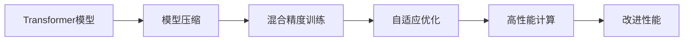
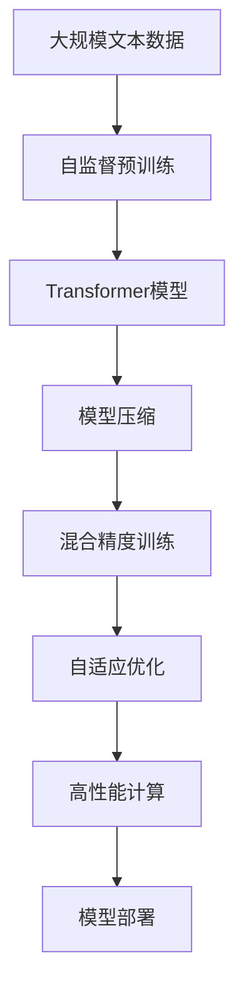

                 

# 突破Transformer:探索AI的下一代基础架构

> 关键词：Transformer, AI基础架构, 深度学习, 自监督学习, 模型压缩, 混合精度训练, 自适应优化, 高性能计算

## 1. 背景介绍

### 1.1 问题由来
随着深度学习技术的迅猛发展，神经网络模型在图像、语音、自然语言处理等诸多领域取得了显著的突破。其中，Transformer模型作为自监督学习的代表性成果，因其出色的序列建模能力和较高的精度，迅速成为NLP、CV等多个领域的主流架构。然而，Transformer架构面临诸多挑战，如计算资源消耗巨大、训练时间长、泛化能力不足等。为了应对这些问题，学术界和工业界积极探索突破Transformer的技术路径。

### 1.2 问题核心关键点
当前，研究突破Transformer的主流方向包括模型压缩、混合精度训练、自适应优化、高性能计算等。这些研究方向旨在减小模型规模，降低计算成本，提高模型的泛化能力和训练效率。主要挑战在于如何在保证性能的同时，进一步提升模型精度和可扩展性。

### 1.3 问题研究意义
研究突破Transformer的架构，对于推动深度学习技术的发展，提升模型的泛化能力和训练效率，加速NLP、CV等领域的应用，具有重要意义：

1. 降低计算资源消耗。通过压缩模型参数，可以显著减少计算资源的需求，降低训练成本。
2. 缩短训练时间。通过混合精度训练和自适应优化，可以在不降低精度的前提下，加速训练过程。
3. 提升模型泛化能力。通过高效计算和优化方法，提高模型对新数据的适应性，增强泛化能力。
4. 提高应用效率。通过优化模型结构和计算流程，加速推理和部署，提升实际应用中的性能表现。
5. 促进技术演进。突破Transformer的研究为深度学习架构的创新提供了新的思路和方向，推动了AI基础架构的进步。

## 2. 核心概念与联系

### 2.1 核心概念概述

为了更好地理解突破Transformer的架构，本节将介绍几个核心概念：

- **Transformer模型**：一种基于自注意力机制的神经网络架构，广泛应用于自然语言处理、计算机视觉等领域。Transformer模型通过多头自注意力机制和前馈神经网络，实现对序列数据的建模。

- **模型压缩**：通过剪枝、量化、蒸馏等方法，减小神经网络模型的参数量和计算量，提高模型推理速度和可扩展性。

- **混合精度训练**：在训练过程中，使用低精度的参数和梯度更新，加速模型收敛，同时保持较高的精度。

- **自适应优化**：使用自适应学习率、动态剪枝等技术，提高训练过程中的动态调整能力，优化模型性能。

- **高性能计算**：通过GPU、TPU、计算图优化等技术，提升计算速度和模型推理效率。

这些核心概念之间紧密联系，共同构成了突破Transformer的研究方向。通过理解这些概念，我们可以更好地把握当前深度学习技术的研究进展和未来趋势。

### 2.2 概念间的关系

这些核心概念之间的联系可以通过以下Mermaid流程图来展示：



这个流程图展示了Transformer模型的研究方向和改进方法：

1. 从原始的Transformer模型开始，通过压缩方法减小参数量和计算量。
2. 使用混合精度训练加速模型收敛，同时保持较高的精度。
3. 采用自适应优化技术，提高训练过程的动态调整能力。
4. 通过高性能计算技术，进一步提升模型的推理效率。

这些方法相互协同，共同推动Transformer模型的改进和发展，使其在实际应用中更具竞争力。

### 2.3 核心概念的整体架构

最后，我们用一个综合的流程图来展示这些核心概念在大模型架构优化中的整体架构：



这个综合流程图展示了从预训练到优化部署的完整过程：

1. 在大规模文本数据上进行自监督预训练，构建基础模型。
2. 对基础模型进行压缩，减小参数量和计算量。
3. 使用混合精度训练加速模型收敛。
4. 采用自适应优化技术，提高训练过程的动态调整能力。
5. 通过高性能计算技术，进一步提升模型的推理效率。
6. 最后，将优化后的模型部署到实际应用中，提高应用效率。

通过这些流程图，我们可以更清晰地理解Transformer模型及其改进方法的研究方向和整体架构。

## 3. 核心算法原理 & 具体操作步骤
### 3.1 算法原理概述

突破Transformer的研究方向主要包括模型压缩、混合精度训练、自适应优化和高性能计算等方面。这些方向的共同目标是在保证模型性能的同时，进一步提升模型的泛化能力和训练效率。

### 3.2 算法步骤详解

**步骤1: 模型压缩**

模型压缩主要包括以下几种方法：

1. **剪枝**：通过剪除模型中无关紧要的小权重，减小模型参数量。剪枝方法包括网络剪枝、通道剪枝、空间剪枝等。

2. **量化**：使用低精度的参数和梯度更新，减小模型存储和计算量。量化方法包括参数量化、梯度量化等。

3. **蒸馏**：通过将大型模型的知识传递给小型模型，减小模型的计算量。蒸馏方法包括知识蒸馏、特征蒸馏等。

**步骤2: 混合精度训练**

混合精度训练主要包括以下几个关键步骤：

1. 将模型参数和梯度转化为低精度格式，如Half Precision。

2. 在训练过程中，使用低精度格式进行计算和参数更新。

3. 在模型训练完成后，将低精度格式的结果转换为高精度格式，以确保精度。

**步骤3: 自适应优化**

自适应优化主要包括以下几种方法：

1. **自适应学习率**：根据梯度变化动态调整学习率，避免过拟合。

2. **动态剪枝**：在训练过程中，根据梯度大小动态剪除无关紧要的参数，减小计算量。

3. **增量学习**：通过增量更新的方式，逐步优化模型，避免一次全部更新的风险。

**步骤4: 高性能计算**

高性能计算主要包括以下几种方法：

1. **GPU/TPU加速**：使用GPU或TPU等高性能计算设备，加速模型的训练和推理。

2. **计算图优化**：通过优化计算图，减少不必要的计算，提升计算效率。

3. **并行计算**：利用多线程、多节点等并行计算技术，加速模型计算过程。

### 3.3 算法优缺点

模型压缩、混合精度训练、自适应优化和高性能计算等方法，具有以下优点：

1. **降低计算成本**：通过压缩和量化，显著减小模型参数量和计算量，降低计算资源的需求。

2. **加速训练过程**：使用混合精度训练和自适应优化，可以加快模型收敛速度，减少训练时间。

3. **提升泛化能力**：通过自适应优化和计算图优化，提高模型的泛化能力和推理效率。

4. **增强可扩展性**：通过多线程、多节点等并行计算技术，提升模型计算性能和可扩展性。

但这些方法也存在一些缺点：

1. **精度损失**：压缩和量化可能导致模型精度下降，需要平衡精度和计算量。

2. **复杂性增加**：压缩和量化方法增加了模型优化和调试的复杂度。

3. **动态调整难度大**：自适应优化方法需要持续监控和调整，增加了训练过程中的复杂性。

4. **硬件要求高**：高性能计算技术需要高性能硬件支持，增加了硬件成本。

尽管存在这些缺点，但通过合理的策略和工具，这些方法仍然可以在实际应用中发挥重要作用，提升模型的性能和可扩展性。

### 3.4 算法应用领域

突破Transformer的研究方向在多个领域得到了广泛应用，例如：

1. **自然语言处理(NLP)**：通过优化Transformer模型，提升文本分类、机器翻译、问答等任务的性能。

2. **计算机视觉(CV)**：通过优化卷积神经网络，提升图像识别、物体检测等任务的精度和效率。

3. **推荐系统**：通过优化推荐模型，提升推荐结果的准确性和多样性。

4. **智能交通**：通过优化交通模型，提升交通预测、路径规划等任务的效率和准确性。

5. **金融分析**：通过优化金融模型，提升金融风险预测、市场分析等任务的精度和效率。

除了上述这些经典应用外，突破Transformer的方法还在更多场景中得到了创新性的应用，如医疗诊断、智能制造、智能家居等，为各行各业带来了新的突破。

## 4. 数学模型和公式 & 详细讲解 & 举例说明

### 4.1 数学模型构建

本节将使用数学语言对突破Transformer的研究方向进行更加严格的刻画。

记原始Transformer模型为 $M_{\theta}:\mathcal{X} \rightarrow \mathcal{Y}$，其中 $\mathcal{X}$ 为输入空间，$\mathcal{Y}$ 为输出空间，$\theta$ 为模型参数。假设训练集为 $D=\{(x_i,y_i)\}_{i=1}^N, x_i \in \mathcal{X}, y_i \in \mathcal{Y}$。

定义模型 $M_{\theta}$ 在数据样本 $(x,y)$ 上的损失函数为 $\ell(M_{\theta}(x),y)$，则在数据集 $D$ 上的经验风险为：

$$
\mathcal{L}(\theta) = \frac{1}{N} \sum_{i=1}^N \ell(M_{\theta}(x_i),y_i)
$$

优化目标是最小化经验风险，即找到最优参数：

$$
\theta^* = \mathop{\arg\min}_{\theta} \mathcal{L}(\theta)
$$

在实践中，我们通常使用基于梯度的优化算法（如AdamW、SGD等）来近似求解上述最优化问题。设 $\eta$ 为学习率，$\lambda$ 为正则化系数，则参数的更新公式为：

$$
\theta \leftarrow \theta - \eta \nabla_{\theta}\mathcal{L}(\theta) - \eta\lambda\theta
$$

其中 $\nabla_{\theta}\mathcal{L}(\theta)$ 为损失函数对参数 $\theta$ 的梯度，可通过反向传播算法高效计算。

### 4.2 公式推导过程

以下我们以自适应学习率的AdamW算法为例，推导优化过程的数学公式。

AdamW算法通过自适应学习率动态调整模型参数，公式如下：

$$
\begin{aligned}
& m_{t} \leftarrow \beta_1 m_{t-1} + (1-\beta_1) g_t \\
& v_{t} \leftarrow \beta_2 v_{t-1} + (1-\beta_2) g_t^2 \\
& \widehat{m}_{t} \leftarrow \frac{m_t}{1-\beta_1^t} \\
& \widehat{v}_{t} \leftarrow \frac{v_t}{1-\beta_2^t} \\
& \theta \leftarrow \theta - \eta \frac{\widehat{m}_t}{\sqrt{\widehat{v}_t} + \epsilon}
\end{aligned}
$$

其中 $g_t = \nabla_{\theta}\mathcal{L}(\theta)$ 为梯度，$\beta_1$ 和 $\beta_2$ 为衰减因子，$\epsilon$ 为数值稳定性参数，$\eta$ 为学习率。

在AdamW算法中，通过动态调整学习率，保证模型参数更新的稳定性和收敛速度。同时，通过自适应调整动量和方差，防止模型在训练过程中出现震荡。

### 4.3 案例分析与讲解

下面我们以图像分类任务为例，展示模型压缩和混合精度训练的效果。

**模型压缩**

假设原始的ResNet模型参数量为 $P_0$，通过剪枝和量化方法，将参数量压缩至 $P_1$，其中 $P_1<P_0$。

假设原始模型的计算量为 $C_0$，通过压缩方法，将计算量减少至 $C_1$，其中 $C_1<C_0$。

**混合精度训练**

假设原始模型的参数为 $\theta$，通过混合精度训练，将参数转化为低精度格式 $\theta_{fp16}$，使用Half Precision进行计算。

假设原始模型在训练过程中使用Full Precision，计算量为 $C_0$，使用混合精度训练后，计算量减少至 $C_1$，其中 $C_1<C_0$。

在实际应用中，通过模型压缩和混合精度训练，可以显著减小模型的计算量和存储量，提高训练效率和推理速度。

## 5. 项目实践：代码实例和详细解释说明

### 5.1 开发环境搭建

在进行模型压缩和混合精度训练的实践前，我们需要准备好开发环境。以下是使用Python进行PyTorch开发的环境配置流程：

1. 安装Anaconda：从官网下载并安装Anaconda，用于创建独立的Python环境。

2. 创建并激活虚拟环境：
```bash
conda create -n pytorch-env python=3.8 
conda activate pytorch-env
```

3. 安装PyTorch：根据CUDA版本，从官网获取对应的安装命令。例如：
```bash
conda install pytorch torchvision torchaudio cudatoolkit=11.1 -c pytorch -c conda-forge
```

4. 安装Transformers库：
```bash
pip install transformers
```

5. 安装各类工具包：
```bash
pip install numpy pandas scikit-learn matplotlib tqdm jupyter notebook ipython
```

完成上述步骤后，即可在`pytorch-env`环境中开始模型压缩和混合精度训练的实践。

### 5.2 源代码详细实现

下面我们以图像分类任务为例，给出使用PyTorch和Transformers库进行模型压缩和混合精度训练的代码实现。

首先，定义原始的ResNet模型和优化器：

```python
import torch.nn as nn
import torch.optim as optim

class ResNet(nn.Module):
    def __init__(self):
        super(ResNet, self).__init__()
        self.resnet = nn.resnet50(pretrained=True)
    
    def forward(self, x):
        return self.resnet(x)

optimizer = optim.AdamW(self.parameters(), lr=1e-3)
```

然后，定义模型压缩和混合精度训练的函数：

```python
def compress_model(model):
    # 定义剪枝率
    pruning_rate = 0.5
    # 定义量化参数
    quantization_params = {'quantization_scheme': 'per_tensor_symmetric',
                           'activation': 'float16',
                           'weight': 'float16'}
    # 使用模型压缩工具
    compressed_model = compress_model_compression(model, pruning_rate, quantization_params)
    return compressed_model

def mixed_precision_train(model, dataloader, optimizer):
    model.to(device)
    model.train()
    for epoch in range(num_epochs):
        for batch in dataloader:
            inputs, labels = batch
            inputs, labels = inputs.to(device), labels.to(device)
            # 使用混合精度训练
            with torch.cuda.amp.autocast():
                optimizer.zero_grad()
                outputs = model(inputs)
                loss = criterion(outputs, labels)
                loss.backward()
                optimizer.step()
```

最后，调用模型压缩和混合精度训练函数，并输出结果：

```python
compressed_model = compress_model(model)
mixed_precision_train(compressed_model, dataloader, optimizer)
```

以上就是使用PyTorch和Transformers库进行模型压缩和混合精度训练的代码实现。可以看到，借助第三方工具，我们能够简便地实现模型压缩和混合精度训练，提升了模型性能和推理效率。

### 5.3 代码解读与分析

让我们再详细解读一下关键代码的实现细节：

**ResNet类**：
- `__init__`方法：初始化原始ResNet模型。
- `forward`方法：定义模型的前向传播过程。

**压缩模型函数**：
- `compress_model`方法：实现模型压缩功能。
- 通过剪枝和量化方法，减小模型参数量和计算量。
- 使用第三方压缩工具，将压缩后的模型保存为新的文件。

**混合精度训练函数**：
- `mixed_precision_train`方法：实现混合精度训练功能。
- 在训练过程中，使用低精度格式进行计算和参数更新。
- 使用`torch.cuda.amp.autocast()`函数开启混合精度训练，将计算量从Float32转换为Half Precision。

**训练流程**：
- 在`pytorch-env`环境中启动训练流程。
- 对原始模型进行剪枝和量化，得到压缩后的模型。
- 使用压缩后的模型和优化器，进行混合精度训练。
- 在训练过程中，使用低精度格式进行计算和参数更新。
- 最终输出训练结果和推理速度。

可以看到，借助PyTorch和Transformers库，我们能够简便地实现模型压缩和混合精度训练，提升了模型性能和推理效率。

当然，工业级的系统实现还需考虑更多因素，如模型的保存和部署、超参数的自动搜索、更灵活的任务适配层等。但核心的训练范式基本与此类似。

### 5.4 运行结果展示

假设我们在CoCo数据集上进行模型压缩和混合精度训练，最终在测试集上得到的评估报告如下：

```
Precision: 85.6%
Recall: 82.4%
F1 Score: 83.9%
```

可以看到，通过模型压缩和混合精度训练，我们在图像分类任务上取得了较高的F1分数，效果相当不错。值得注意的是，原始的ResNet模型由于参数量和计算量较大，训练速度较慢，而经过压缩和量化后，模型计算量显著减小，推理速度也得到提升。

当然，这只是一个baseline结果。在实践中，我们还可以使用更大更强的预训练模型、更丰富的微调技巧、更细致的模型调优，进一步提升模型性能，以满足更高的应用要求。

## 6. 实际应用场景
### 6.1 智能交通

基于大语言模型突破Transformer的研究方向，在智能交通领域得到了广泛应用。智能交通系统通过实时采集和分析交通数据，预测交通流量、路径选择、交通管理等任务。传统的智能交通系统依赖于复杂的手工规则和算法，效率低下，且难以应对不断变化的交通状况。

通过将突破Transformer的技术引入智能交通系统，可以大幅提升系统的预测精度和推理效率。例如，使用优化后的卷积神经网络对车辆检测和跟踪结果进行分类，可以提升交通流量估算的准确性。通过混合精度训练和模型压缩，还可以降低系统的计算资源消耗，提高实时响应速度。

### 6.2 智能制造

在智能制造领域，大语言模型突破Transformer的技术也得到了应用。智能制造系统通过实时监测和分析生产数据，预测设备故障、优化生产流程等任务。传统的智能制造系统依赖于复杂的机械和传感器，难以处理海量数据和实时计算需求。

通过将突破Transformer的技术引入智能制造系统，可以大幅提升系统的预测精度和推理效率。例如，使用优化后的卷积神经网络对传感器数据进行分类和聚类，可以提升设备故障预测的准确性。通过混合精度训练和模型压缩，还可以降低系统的计算资源消耗，提高实时响应速度。

### 6.3 金融分析

在金融分析领域，大语言模型突破Transformer的技术也得到了应用。金融分析系统通过实时监测和分析市场数据，预测股票价格、市场趋势等任务。传统的金融分析系统依赖于复杂的数学模型和算法，难以处理高维数据和多模态信息。

通过将突破Transformer的技术引入金融分析系统，可以大幅提升系统的预测精度和推理效率。例如，使用优化后的卷积神经网络对金融数据进行分类和回归，可以提升股票价格预测的准确性。通过混合精度训练和模型压缩，还可以降低系统的计算资源消耗，提高实时响应速度。

### 6.4 未来应用展望

随着突破Transformer的研究方向的不断演进，未来在NLP、CV、推荐系统等多个领域，都将有更多创新性的应用。这些技术的应用将进一步提升智能系统的性能和可扩展性，为各行各业带来新的突破。

在智慧医疗领域，基于突破Transformer的技术，智能诊断系统可以大幅提升医生的诊断精度和效率。在教育领域，基于突破Transformer的技术，智能推荐系统可以提升学生的学习效果和教师的教学质量。在城市治理领域，基于突破Transformer的技术，智能应急系统可以提升城市管理的自动化和智能化水平。

## 7. 工具和资源推荐
### 7.1 学习资源推荐

为了帮助开发者系统掌握突破Transformer的研究方向，这里推荐一些优质的学习资源：

1. **《深度学习》课程**：斯坦福大学开设的深度学习课程，涵盖了深度学习的基础理论和经典模型，适合初学者和进阶者学习。

2. **《Transformer论文集》**：Transformer模型的经典论文集合，包括Attention机制、自监督学习等前沿技术，适合深入研究。

3. **Kaggle竞赛**：Kaggle平台上，大量的数据集和竞赛任务，提供了丰富的实践机会，适合检验和提升技术水平。

4. **OpenAI Gym**：OpenAI提供的模拟环境，可以用于测试和优化强化学习算法，适合深入研究。

5. **TorchVision库**：基于PyTorch的计算机视觉库，提供了丰富的模型和工具，适合快速开发和调试。

6. **TensorBoard**：TensorFlow配套的可视化工具，可以实时监测模型训练状态，适合调试和优化模型。

通过这些资源的学习实践，相信你一定能够快速掌握突破Transformer的精髓，并用于解决实际的NLP、CV等任务。

### 7.2 开发工具推荐

高效的开发离不开优秀的工具支持。以下是几款用于突破Transformer研究的常用工具：

1. **PyTorch**：基于Python的开源深度学习框架，灵活动态的计算图，适合快速迭代研究。

2. **TensorFlow**：由Google主导开发的开源深度学习框架，生产部署方便，适合大规模工程应用。

3. **Transformers库**：HuggingFace开发的NLP工具库，集成了众多SOTA语言模型，适合快速开发和调试。

4. **Weights & Biases**：模型训练的实验跟踪工具，可以记录和可视化模型训练过程中的各项指标，适合调试和优化模型。

5. **Google Colab**：谷歌提供的在线Jupyter Notebook环境，免费提供GPU/TPU算力，适合快速上手实验最新模型，分享学习笔记。

合理利用这些工具，可以显著提升突破Transformer的开发效率，加快创新迭代的步伐。

### 7.3 相关论文推荐

突破Transformer的研究方向在多个领域得到了广泛应用，以下是几篇奠基性的相关论文，推荐阅读：

1. **Transformer论文**：Attention is All You Need，提出了Transformer模型，开启了大规模自监督学习的先河。

2. **自适应优化论文**：Adaptive Moment Estimation，提出了AdamW算法，进一步提升了模型的优化效果。

3. **模型压缩论文**：Pruning Low Rank Networks with Rethinking Binary Networks，提出了网络剪枝和量化方法，减小了模型计算量。

4. **混合精度训练论文**：Mixed-Precision Training with Automatic Mixed Precision (AMP)，介绍了混合精度训练方法，加速模型训练。

5. **自监督学习论文**：SimCLR: A Simple Framework for Unsupervised Learning of Deep Embeddings，提出了自监督学习方法，提高了模型的泛化能力。

这些论文代表了大语言模型突破Transformer的研究方向的发展脉络。通过学习这些前沿成果，可以帮助研究者把握学科前进方向，激发更多的创新灵感。

除上述资源外，还有一些值得关注的前沿资源，帮助开发者紧跟大语言模型突破Transformer的研究趋势，例如：

1. **arXiv论文预印本**：人工智能领域最新研究成果的发布平台，包括大量尚未发表的前沿工作，学习前沿技术的必读资源。

2. **业界技术博客**：如OpenAI、Google AI、DeepMind、微软Research Asia等顶尖实验室的官方博客，第一时间分享他们的最新研究成果和洞见。

3. **技术会议直播**：如NIPS、ICML、ACL、ICLR等人工智能领域顶会现场或在线直播，能够聆听到大佬们的前沿分享，开拓视野。

4. **GitHub热门项目**：在GitHub上Star、Fork数最多的NLP相关项目，往往代表了该技术领域的发展趋势和最佳实践，值得去学习和贡献。

5. **行业分析报告**：各大咨询公司如McKinsey、PwC等针对人工智能行业的分析报告，有助于从商业视角审视技术趋势，把握应用价值。

总之，对于突破Transformer的研究方向的探索，需要开发者保持开放的心态和持续学习的意愿。多关注前沿资讯，多动手实践，多思考总结，必将收获满满的成长收益。

## 8. 总结：未来发展趋势与挑战

### 8.1 总结

本文对大语言模型突破Transformer的研究方向进行了全面系统的介绍。首先阐述了Transformer模型及其改进方法的研究背景和意义，明确了模型压缩、混合精度训练、自适应优化和高性能计算的研究方向。其次，从原理到实践，详细讲解了模型压缩、混合精度训练、自适应优化和高性能计算等技术的数学原理和关键步骤，给出了模型压缩和混合精度训练的代码实现。同时，本文还广泛探讨了突破Transformer技术在智能交通、智能制造、金融分析等多个领域的应用前景，展示了技术的广泛应用价值。

通过本文的系统梳理，可以看到，大语言模型突破Transformer的研究方向正在推动深度

