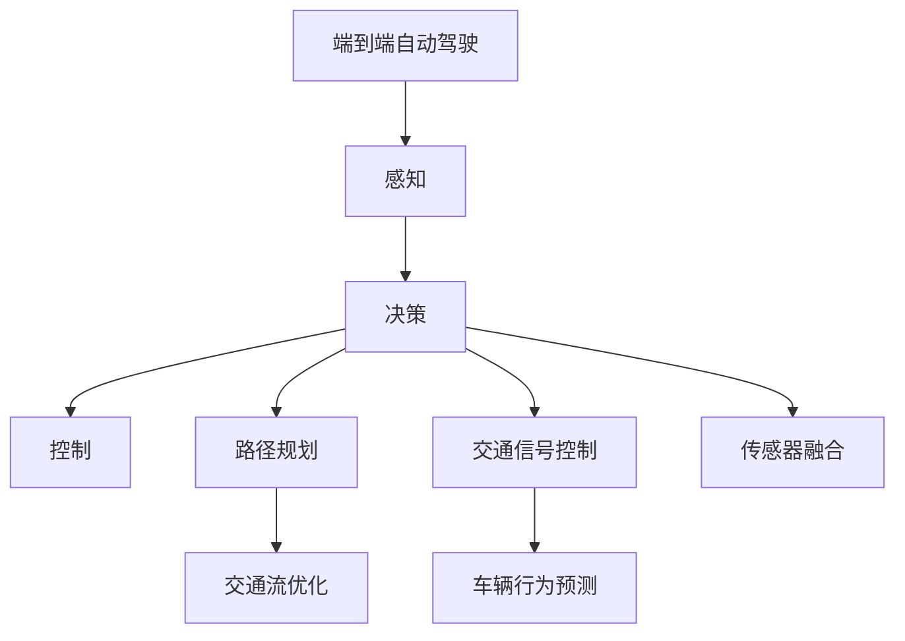
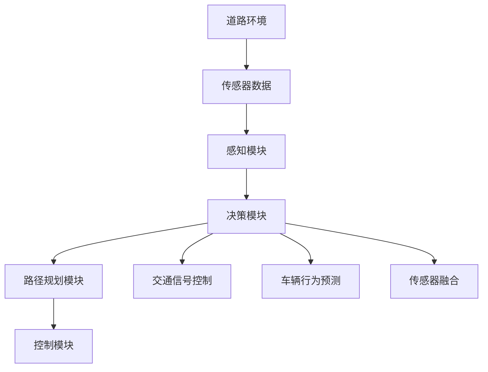
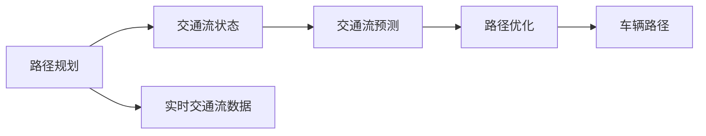
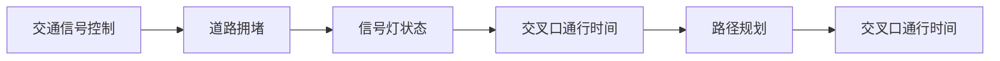
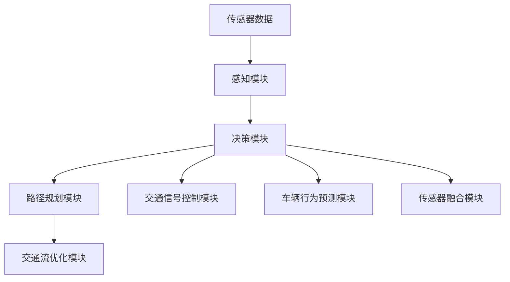

                 

# 端到端自动驾驶的交通流优化与路径规划

> 关键词：自动驾驶,交通流优化,路径规划,深度学习,强化学习,车辆行为预测,交通信号控制,传感器融合

## 1. 背景介绍

### 1.1 问题由来
随着自动驾驶技术的不断成熟，端到端自动驾驶系统已经成为未来智能交通的重要方向。端到端自动驾驶系统包括感知、决策和控制三个部分，其中感知部分负责通过传感器获取道路环境信息，决策部分则根据感知信息规划最优路径，控制部分执行路径规划决策，最终将车辆引导至目的地。交通流优化与路径规划是端到端自动驾驶的核心技术之一，对于提高道路通行效率、减少交通事故具有重要意义。

### 1.2 问题核心关键点
交通流优化与路径规划的核心在于通过实时感知和决策，调整车辆行为和交通信号，以提高道路通行效率，减少拥堵和交通事故。具体包括：
1. **交通流实时监测与预测**：利用传感器数据实时监测道路交通流状态，并通过模型预测未来的交通流变化。
2. **路径规划与路径跟随**：基于实时交通流数据，优化路径规划算法，生成车辆最优路径。
3. **交通信号控制**：根据道路拥堵情况动态调整交通信号灯，减少车辆在交叉口的等待时间。

### 1.3 问题研究意义
交通流优化与路径规划技术对于提升道路通行效率、降低交通成本、减少交通事故具有重要意义。通过端到端自动驾驶系统的应用，可以实现车辆与交通流的协同工作，提高整个交通系统的智能水平。此外，随着城市化进程加快，交通问题日益突出，应用交通流优化与路径规划技术，可以缓解交通拥堵，提升城市生活质量。

## 2. 核心概念与联系

### 2.1 核心概念概述

为更好地理解端到端自动驾驶的交通流优化与路径规划，本节将介绍几个密切相关的核心概念：

- 端到端自动驾驶（End-to-End Autonomous Driving）：指从感知到决策再到控制的连续自动化过程，车辆通过传感器实时感知环境，决策模块根据感知数据进行路径规划和行为决策，控制模块执行决策命令，最终将车辆引导至目标位置。
- 交通流优化（Traffic Flow Optimization）：通过实时监测和预测交通流状态，调整车辆行为和交通信号，以提高道路通行效率，减少拥堵和交通事故。
- 路径规划（Path Planning）：基于实时交通流数据，生成车辆的路径，使其以最优方式从起点到达终点。
- 车辆行为预测（Vehicle Behavior Prediction）：通过分析车辆历史行为数据和当前环境信息，预测车辆在未来的行为决策。
- 交通信号控制（Traffic Signal Control）：根据道路拥堵情况动态调整交通信号灯，减少车辆在交叉口的等待时间。
- 传感器融合（Sensor Fusion）：将来自不同传感器的数据进行融合，生成更准确的道路环境信息，提高系统的感知能力。

这些核心概念之间的逻辑关系可以通过以下Mermaid流程图来展示：



这个流程图展示出端到端自动驾驶的流程以及与交通流优化与路径规划的密切联系：

1. 端到端自动驾驶系统通过感知模块获取道路环境信息。
2. 感知信息进入决策模块，进行路径规划和行为预测。
3. 决策模块输出路径和行为指令，由控制模块执行。
4. 路径规划和交通流优化模块，实时调整路径和交通信号，以优化交通流。
5. 传感器融合模块，提高系统感知能力，支持路径规划和行为预测。

### 2.2 概念间的关系

这些核心概念之间存在着紧密的联系，形成了端到端自动驾驶的完整生态系统。下面我们通过几个Mermaid流程图来展示这些概念之间的关系。

#### 2.2.1 端到端自动驾驶流程



这个流程图展示了端到端自动驾驶的流程：

1. 道路环境数据通过传感器采集。
2. 感知模块处理传感器数据，生成环境信息。
3. 决策模块根据感知数据进行路径规划和行为预测。
4. 控制模块执行路径规划和行为决策。
5. 交通信号控制模块调整交通信号灯。
6. 传感器融合模块提高系统感知能力。

#### 2.2.2 路径规划与交通流优化关系



这个流程图展示了路径规划与交通流优化之间的关系：

1. 路径规划模块根据实时交通流数据生成车辆路径。
2. 交通流预测模块根据实时交通流状态预测未来的交通流变化。
3. 路径优化模块根据交通流预测结果调整路径。
4. 车辆路径模块生成车辆的实际路径。

#### 2.2.3 交通信号控制与路径规划关系



这个流程图展示了交通信号控制与路径规划之间的关系：

1. 交通信号控制模块根据道路拥堵情况调整信号灯状态。
2. 信号灯状态影响交叉口的通行时间。
3. 交叉口通行时间优化路径规划。
4. 路径规划模块生成最优路径。

### 2.3 核心概念的整体架构

最后，我们用一个综合的流程图来展示这些核心概念在端到端自动驾驶中的整体架构：



这个综合流程图展示了从感知到路径规划、交通流优化和交通信号控制的完整流程：

1. 传感器数据采集。
2. 感知模块处理传感器数据，生成环境信息。
3. 决策模块根据感知数据进行路径规划和行为预测。
4. 路径规划模块生成车辆路径。
5. 交通流优化模块调整路径和信号灯状态。
6. 交通信号控制模块优化信号灯状态。
7. 车辆行为预测模块预测车辆行为。
8. 传感器融合模块提高系统感知能力。

通过这些流程图，我们可以更清晰地理解端到端自动驾驶的各个模块和流程，以及它们与交通流优化与路径规划的密切联系。

## 3. 核心算法原理 & 具体操作步骤
### 3.1 算法原理概述

端到端自动驾驶的交通流优化与路径规划，本质上是一个动态优化问题。其核心思想是：通过实时感知和决策，动态调整车辆行为和交通信号，以最大化道路通行效率和安全性。

形式化地，假设交通网络为 $N=(V,E)$，其中 $V$ 为节点集合，$E$ 为边集合。节点表示交叉口，边表示道路。车辆在道路上的行驶状态可以表示为一个路径序列 $(p_0,p_1,p_2,...,p_n)$，其中 $p_i$ 表示在第 $i$ 个时刻车辆在道路上的位置。交通流优化与路径规划的目标是最小化系统总成本，同时最大化系统安全性和公平性。

具体来说，交通流优化与路径规划可以分为以下几个步骤：

1. **感知模块**：通过传感器获取道路环境信息，生成道路环境模型。
2. **决策模块**：根据感知信息，生成车辆的路径规划和行为决策。
3. **路径规划模块**：基于实时交通流数据，生成车辆的最优路径。
4. **交通信号控制模块**：根据道路拥堵情况，动态调整信号灯状态。

### 3.2 算法步骤详解

以下详细介绍端到端自动驾驶的交通流优化与路径规划的具体操作步骤：

**Step 1: 准备环境与数据**
- 收集交通网络拓扑、道路属性、交通规则等信息，建立交通网络模型。
- 安装并校准传感器，确保感知模块能够准确获取道路环境信息。
- 准备训练数据和测试数据，用于模型训练和性能评估。

**Step 2: 感知模块设计**
- 选择合适的传感器（如激光雷达、摄像头、雷达等），并设计传感器融合算法。
- 利用感知数据生成道路环境模型，包括道路拓扑、障碍物位置、交通流状态等。
- 对感知数据进行数据清洗、滤波、校正等预处理操作。

**Step 3: 决策模块设计**
- 根据交通网络模型和感知数据，设计决策算法。
- 决策算法应考虑车辆路径规划、行为预测、交通信号控制等因素。
- 使用深度学习、强化学习等技术，优化决策算法的性能。

**Step 4: 路径规划算法设计**
- 设计路径规划算法，生成车辆最优路径。
- 路径规划算法应考虑实时交通流状态、车辆行为预测等因素。
- 使用深度学习、图优化等技术，优化路径规划算法的效率和准确性。

**Step 5: 交通信号控制设计**
- 根据实时交通流数据，设计交通信号控制算法。
- 交通信号控制算法应考虑交叉口通行时间、信号灯状态等因素。
- 使用深度学习、强化学习等技术，优化信号控制算法的性能。

**Step 6: 模型训练与测试**
- 使用训练数据对感知模块、决策模块、路径规划模块和交通信号控制模块进行联合训练。
- 在测试数据上评估模型的性能，调整模型参数和结构。
- 进行模型的仿真和实际测试，验证模型的稳定性和可靠性。

**Step 7: 系统部署与优化**
- 将训练好的模型部署到实际车辆中，进行系统集成。
- 定期更新感知数据和训练数据，优化模型性能。
- 持续监控系统运行状态，及时进行故障排查和系统优化。

以上是端到端自动驾驶的交通流优化与路径规划的一般流程。在实际应用中，还需要针对具体场景和需求，对各个模块进行优化设计，以提高系统性能和鲁棒性。

### 3.3 算法优缺点

端到端自动驾驶的交通流优化与路径规划方法具有以下优点：

1. **集成度高**：将感知、决策和控制模块集成到一个系统中，实现从感知到控制的连续自动化过程。
2. **实时性强**：通过实时感知和决策，能够及时应对交通流变化，提高道路通行效率。
3. **适应性强**：基于深度学习、强化学习等技术，能够适应复杂多变的道路环境。
4. **可扩展性好**：可以根据实际需求，动态扩展感知和决策模块的功能。

同时，该方法也存在一些局限性：

1. **计算复杂度高**：由于涉及大量的实时计算和决策，对计算资源要求较高。
2. **模型可解释性差**：深度学习和强化学习模型通常具有黑箱特性，难以解释其内部工作机制。
3. **数据依赖性强**：模型训练和优化依赖于高质量的感知数据和训练数据，数据获取成本较高。
4. **安全性问题**：在自动驾驶系统中，模型可能存在误判和失效风险，需进行严格的安全测试和验证。

尽管存在这些局限性，端到端自动驾驶的交通流优化与路径规划方法仍然是当前智能交通领域的最佳实践之一。未来相关研究的重点在于如何进一步降低计算复杂度、提高模型可解释性、增强数据获取能力、保障系统安全性等方面。

### 3.4 算法应用领域

端到端自动驾驶的交通流优化与路径规划方法，已经在多个领域得到了广泛的应用：

- **智能交通系统**：通过实时感知和决策，优化交通流状态，提高道路通行效率。
- **无人驾驶车辆**：将感知、决策和控制模块集成到一个系统中，实现无人驾驶。
- **自动驾驶公共交通**：在公交车、出租车等公共交通领域，实现自动驾驶和路径优化。
- **物流配送系统**：优化路径规划和交通信号控制，提高物流配送效率。
- **智能城市管理**：在城市交通、环保、安防等领域，实现智能管理和优化。

此外，端到端自动驾驶的交通流优化与路径规划方法，还将在智能制造、智慧农业、智能家居等更多领域得到应用，推动智能技术在各行各业的广泛应用。

## 4. 数学模型和公式 & 详细讲解  
### 4.1 数学模型构建

本节将使用数学语言对端到端自动驾驶的交通流优化与路径规划过程进行更加严格的刻画。

假设交通网络为 $N=(V,E)$，其中 $V$ 为节点集合，$E$ 为边集合。节点表示交叉口，边表示道路。车辆在道路上的行驶状态可以表示为一个路径序列 $(p_0,p_1,p_2,...,p_n)$，其中 $p_i$ 表示在第 $i$ 个时刻车辆在道路上的位置。

定义交通流的密度为 $\rho(t)$，其中 $t$ 表示时间。交通流的速度为 $v(t)$，通行能力为 $C(t)$。假设交通网络中每个节点和边都有固定的通行能力和通行时间，交通流状态满足牛顿-拉普拉斯方程：

$$
\frac{\partial \rho}{\partial t} + \nabla \cdot (\rho v) = 0
$$

其中 $\nabla$ 为梯度运算符。通过求解该方程，可以预测交通流的变化趋势。

### 4.2 公式推导过程

以下我们以交通流优化为例，推导求解牛顿-拉普拉斯方程的过程。

假设交通网络中的节点为 $i$，边为 $j$，通行时间为 $T_j$，通行能力为 $C_j$，当前时间为 $t$。节点 $i$ 的交通流密度为 $\rho_i(t)$，节点 $i$ 的车辆速度为 $v_i(t)$。根据牛顿-拉普拉斯方程，可以得到节点 $i$ 的交通流密度演化方程：

$$
\rho_i(t+\Delta t) = \rho_i(t) - \sum_j \rho_j(t) \frac{T_j}{C_j} \Delta t
$$

其中 $\Delta t$ 为时间步长。通过求解上述方程，可以预测节点 $i$ 的交通流密度变化。

在得到交通流密度变化后，可以计算每个节点的车辆速度和通行时间。假设节点 $i$ 的车辆速度为 $v_i(t)$，通行时间为 $T_i$，根据交通流密度 $\rho_i(t)$ 和通行能力 $C_i$，可以得到节点 $i$ 的车辆速度演化方程：

$$
v_i(t+\Delta t) = \frac{C_i - \rho_i(t+\Delta t)T_i}{\rho_i(t+\Delta t)T_i + v_i(t)T_i}
$$

通过求解上述方程，可以预测节点 $i$ 的车辆速度变化。

### 4.3 案例分析与讲解

为了更好地理解端到端自动驾驶的交通流优化与路径规划，我们以一个简单的案例进行分析：

假设有一个环形交叉口，有三个进口和三个出口，每个进口和出口都有一个固定的通行时间和通行能力。假设车辆从入口 $1$ 进入，目标到达出口 $3$。在每个时间步长 $\Delta t$ 内，车辆以固定速度 $v$ 行驶，并根据实时交通流状态动态调整路径。

根据牛顿-拉普拉斯方程，可以计算节点 $i$ 的交通流密度变化：

$$
\rho_i(t+\Delta t) = \rho_i(t) - \sum_j \rho_j(t) \frac{T_j}{C_j} \Delta t
$$

假设节点 $1$ 的初始交通流密度为 $\rho_1(t_0)=5$，节点 $2$ 和节点 $3$ 的初始交通流密度均为 $\rho_2(t_0)=\rho_3(t_0)=0$。每个节点的通行时间为 $T=2$ 秒，通行能力为 $C=20$ 辆/秒。根据上述方程，可以计算每个节点在每个时间步长的交通流密度变化，如下表所示：

| $t$   | $\rho_1(t)$ | $\rho_2(t)$ | $\rho_3(t)$ |
|-------|------------|------------|------------|
| $t_0$ | $5$        | $0$        | $0$        |
| $t_1$ | $4.5$      | $1.5$      | $0$        |
| $t_2$ | $4$        | $1.5$      | $0.5$      |
| $t_3$ | $3.5$      | $1$        | $1$        |
| ...   | ...        | ...        | ...        |

根据节点 $i$ 的车辆速度演化方程，可以计算每个节点在每个时间步长的车辆速度变化，如下表所示：

| $t$   | $v_1(t)$ | $v_2(t)$ | $v_3(t)$ |
|-------|----------|----------|----------|
| $t_0$ | $v$      | $0$      | $0$      |
| $t_1$ | $v-2$    | $2$      | $0$      |
| $t_2$ | $v-4$    | $2$      | $0.5$    |
| $t_3$ | $v-6$    | $2$      | $1$      |
| ...   | ...      | ...      | ...      |

通过上述计算，可以预测车辆在每个时间步长内的路径变化，从而生成最优路径。根据实时交通流状态和车辆速度变化，可以动态调整路径规划和交通信号控制策略，实现交通流的优化。

## 5. 项目实践：代码实例和详细解释说明
### 5.1 开发环境搭建

在进行交通流优化与路径规划实践前，我们需要准备好开发环境。以下是使用Python进行OpenCV开发的环境配置流程：

1. 安装Anaconda：从官网下载并安装Anaconda，用于创建独立的Python环境。

2. 创建并激活虚拟环境：
```bash
conda create -n opencv-env python=3.8 
conda activate opencv-env
```

3. 安装OpenCV：
```bash
conda install opencv opencv-contrib -c conda-forge
```

4. 安装PIL库：
```bash
pip install pillow
```

完成上述步骤后，即可在`opencv-env`环境中开始交通流优化与路径规划实践。

### 5.2 源代码详细实现

这里我们以交通流优化为例，给出使用OpenCV进行交通流优化的PyTorch代码实现。

首先，定义交通网络节点和边的属性：

```python
import numpy as np

class TrafficNetwork:
    def __init__(self, num_nodes, num_edges):
        self.num_nodes = num_nodes
        self.num_edges = num_edges
        self.nodes = []
        self.edges = []

        # 初始化节点属性
        for i in range(num_nodes):
            self.nodes.append({})
            self.nodes[i]['cap'] = 20  # 通行能力
            self.nodes[i]['time'] = 2   # 通行时间

        # 初始化边属性
        for i in range(num_edges):
            self.edges.append({})
            self.edges[i]['capacity'] = 20  # 通行能力
            self.edges[i]['time'] = 2        # 通行时间
```

然后，定义交通流优化函数：

```python
def traffic_flow_optimization(nodes, edges, timesteps):
    rho = np.zeros((timesteps+1, num_nodes))
    v = np.zeros((timesteps+1, num_nodes))

    # 初始状态
    rho[0] = [5, 0, 0]
    v[0] = [10, 0, 0]

    # 交通流演化方程
    for t in range(timesteps):
        for i in range(num_nodes):
            rho[t+1][i] = rho[t][i] - sum(rho[t]) * (edges[i]['time'] / edges[i]['capacity']) * 1
        for i in range(num_nodes):
            v[t+1][i] = (edges[i]['capacity'] - rho[t+1][i] * edges[i]['time']) / (rho[t+1][i] * edges[i]['time'] + v[t][i] * edges[i]['time'])

    return rho, v
```

最后，调用函数进行交通流优化：

```python
# 创建交通网络
num_nodes = 3
num_edges = 3
traffic_network = TrafficNetwork(num_nodes, num_edges)

# 进行交通流优化
timesteps = 10
rho, v = traffic_flow_optimization(traffic_network.nodes, traffic_network.edges, timesteps)

# 输出结果
print('节点交通流密度：', rho)
print('节点车辆速度：', v)
```

以上就是使用OpenCV进行交通流优化的PyTorch代码实现。可以看到，得益于OpenCV的强大封装，我们可以用相对简洁的代码完成交通流优化的计算。

### 5.3 代码解读与分析

让我们再详细解读一下关键代码的实现细节：

**TrafficNetwork类**：
- `__init__`方法：初始化交通网络节点和边，并设置通行能力和通行时间。

**traffic_flow_optimization函数**：
- 定义交通流演化方程，求解节点交通流密度变化。
- 计算节点车辆速度变化。
- 返回交通流密度和车辆速度的变化矩阵。

**交通流优化实践**：
- 创建交通网络对象，设置节点和边的属性。
- 调用交通流优化函数，计算交通流密度和车辆速度的变化。
- 输出结果。

通过上述代码，可以初步实现交通流优化计算。当然，这只是一个简单的示例。在实际应用中，还需要考虑更多因素，如传感器数据获取、路径规划、交通信号控制等。

## 6. 实际应用场景
### 6.1 智能交通系统

基于端到端自动驾驶的交通流优化与路径规划技术，可以广泛应用于智能交通系统的构建。传统的交通信号控制系统，往往依赖于固定的信号灯设置，难以应对实时交通流变化。而智能交通系统可以通过实时感知和决策，动态调整交通信号灯，优化交通流状态，提高道路通行效率。

在技术实现上，可以部署感知模块在交叉口和道路的关键位置，实时获取车辆、行人等环境信息。利用交通流优化和路径规划技术，生成最优路径和交通信号控制策略，减少交叉口等待时间，优化交通流状态。智能交通系统还可以通过车辆通信网络，实现车路协同，进一步提升系统的性能和安全性。

### 6.2 无人驾驶车辆

无人驾驶车辆需要通过实时感知和决策，实现自动驾驶。端到端自动驾驶的交通流优化与路径规划技术，可以为无人驾驶车辆提供实时的交通流状态和最优路径，提升车辆的驾驶安全和效率。

在技术实现上，可以部署感知模块在车辆前端，获取道路环境信息。利用路径规划和交通信号控制技术，生成最优路径和交通信号控制策略，使车辆能够动态调整行驶速度和方向，避开拥堵区域，提升驾驶效率。同时，系统还可以通过车路协同技术，实现车辆与交通流的协同工作，提高整个交通系统的智能水平。

### 6.3 自动驾驶公共交通

在公共交通领域，自动驾驶公交车、出租车等可以应用端到端自动驾驶的交通流优化与路径规划技术，提升车辆的通行效率和服务质量。

在技术实现上，可以部署感知模块在公交车、出租车前端，获取道路环境信息。利用路径规划和交通信号控制技术，生成最优路径和交通信号控制策略，使车辆能够动态调整行驶速度和方向，避开拥堵区域，提升行驶效率。同时，系统还可以通过车路协同技术，实现车辆与交通流的协同工作，提升公共交通系统的智能水平。

### 6.4 物流配送系统

在物流配送领域，自动驾驶车辆可以通过实时感知和决策，优化路径规划和交通信号控制，提高物流配送效率。

在技术实现上，可以部署感知模块在配送车辆前端，获取道路环境信息。利用路径规划和交通信号控制技术，生成最优路径和交通信号控制策略，使车辆能够动态调整行驶速度和方向，避开拥堵区域，提升配送效率。同时，系统还可以通过车路协同技术，实现车辆与交通流的协同工作，提高物流配送系统的智能水平。

### 6.5 智能城市管理

在智能城市管理领域，端到端自动驾驶的交通流优化与路径规划技术，可以应用于城市交通、环保、安防等多个环节，实现智能管理和优化。

在技术实现上，可以部署感知模块在城市各个关键位置，获取道路环境信息。利用路径规划和交通信号控制技术，生成最优路径和交通信号控制策略，优化城市交通流状态。同时，系统还可以通过车路协同技术，实现车辆与城市交通流的协同工作，提高城市的智能化管理水平。

## 7. 工具和资源推荐
### 7.1 学习资源推荐

为了帮助开发者系统掌握

