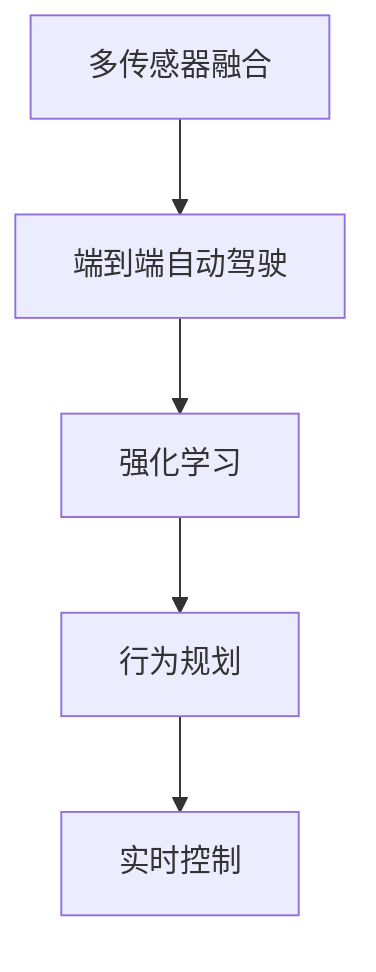
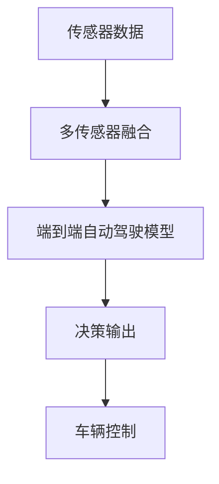
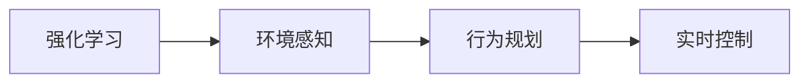
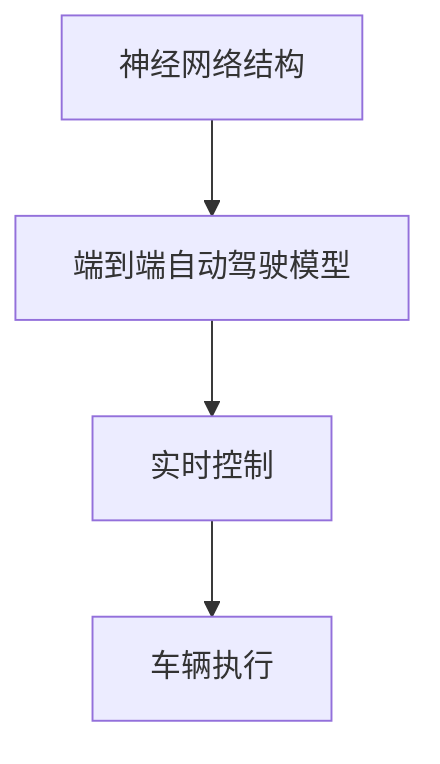
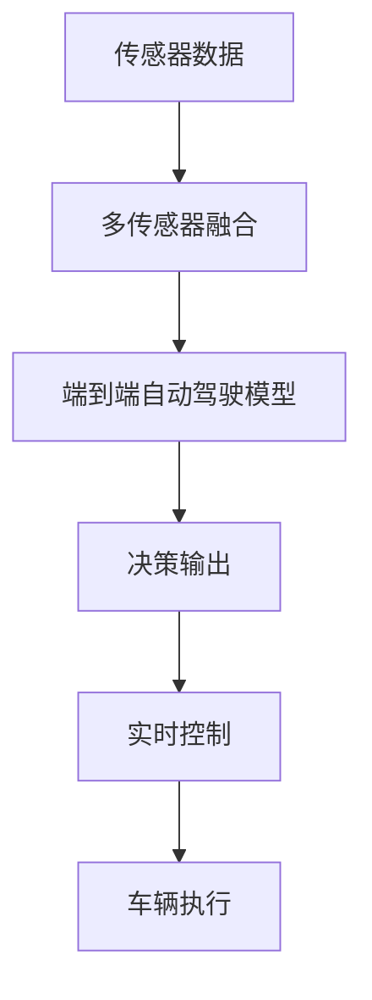

                 

# 端到端自动驾驶：黑盒中的端到端

## 1. 背景介绍

随着人工智能技术的飞速发展，自动驾驶作为其中的前沿应用领域，已经成为全球各大科技公司和车企竞相争夺的技术制高点。自动驾驶技术不仅能大幅提高道路运输效率，还能有效减少交通事故和环境污染。然而，技术挑战和伦理问题使得端到端自动驾驶（End-to-End Autonomous Driving）在短期内难以全面普及。本文旨在通过分析端到端自动驾驶的核心概念和相关技术，探讨其原理和应用场景，并为未来技术发展方向提供思考。

### 1.1 问题由来

自动驾驶技术的核心在于通过传感器采集车辆周围环境信息，并通过智能决策模块控制车辆行驶。传统的自动驾驶系统通常分为感知、决策和执行三个独立模块，但这种分层架构在处理复杂的交通场景时存在诸多问题。首先，感知模块和决策模块之间的信息传递可能存在延迟，影响车辆对突发情况的响应速度。其次，分层架构使得系统设计复杂，需要大量的传感器和算法集成，增加了开发和维护成本。

为了解决这些问题，端到端自动驾驶技术应运而生。它将感知、决策和执行模块整合成一个统一的神经网络模型，通过端到端训练获得端到端输出，实现从传感器输入到车辆控制的连续映射。这一架构不仅简化了系统设计，还提高了处理复杂交通场景的能力，显示出极大的潜力。

### 1.2 问题核心关键点

端到端自动驾驶的核心在于以下几个关键点：

1. **深度学习框架**：利用深度学习模型的强泛化能力和连续映射特性，实现对复杂交通场景的直接建模。
2. **端到端训练**：通过联合优化感知、决策和执行模块的参数，实现从传感器输入到车辆控制的连续映射。
3. **高精度感知**：利用多传感器融合、高分辨率摄像头和激光雷达等技术，实现对环境的全景感知。
4. **鲁棒决策**：通过强化学习、行为规划等技术，提高决策模块的鲁棒性和安全性。
5. **实时控制**：利用高效的神经网络结构和硬件加速技术，实现对车辆的高精度实时控制。

这些关键点共同构成了端到端自动驾驶的技术基础，使得系统能够在复杂交通环境中实现高效、安全、可靠的自动驾驶。

### 1.3 问题研究意义

研究端到端自动驾驶技术，对于推动自动驾驶技术的落地应用、提高交通安全性和减少环境污染具有重要意义：

1. **简化系统设计**：端到端架构消除了中间层，降低了系统的复杂性和开发成本，提高了系统的可扩展性和维护性。
2. **提升系统性能**：端到端训练使得系统能够直接优化整个决策链，提高了系统在复杂交通场景中的鲁棒性和性能。
3. **加速技术产业化**：端到端架构为自动驾驶技术的商业化提供了更高效、更经济的解决方案，加速了技术普及和市场化进程。
4. **促进技术创新**：端到端架构为自动驾驶技术带来了新的研究视角和方法，推动了相关领域的技术进步和应用创新。

## 2. 核心概念与联系

### 2.1 核心概念概述

为更好地理解端到端自动驾驶技术，本节将介绍几个密切相关的核心概念：

- **端到端自动驾驶**：通过深度学习模型，将感知、决策和执行模块整合成一个统一的网络，直接从传感器输入到车辆控制的连续映射。
- **多传感器融合**：将摄像头、激光雷达、雷达等传感器数据进行融合，获取更丰富、更准确的环境感知信息。
- **强化学习**：通过与环境的交互，学习最优的决策策略，提高自动驾驶的安全性和鲁棒性。
- **行为规划**：基于当前环境状态和决策目标，规划车辆的路径和速度，实现最优行驶策略。
- **实时控制**：利用高效的神经网络结构和硬件加速技术，实现对车辆的高精度实时控制。

这些核心概念之间的逻辑关系可以通过以下Mermaid流程图来展示：



这个流程图展示了端到端自动驾驶技术中各个关键组件的逻辑关系。

### 2.2 概念间的关系

这些核心概念之间存在着紧密的联系，形成了端到端自动驾驶技术的完整生态系统。下面我们通过几个Mermaid流程图来展示这些概念之间的关系。

#### 2.2.1 端到端自动驾驶的构建



这个流程图展示了端到端自动驾驶的基本流程：传感器数据经过多传感器融合，输入到端到端模型中，由模型直接输出决策结果，最后通过实时控制模块对车辆进行操作。

#### 2.2.2 强化学习在自动驾驶中的应用



这个流程图展示了强化学习在端到端自动驾驶中的应用。强化学习通过与环境交互，不断调整行为规划和实时控制模块，实现最优决策策略。

#### 2.2.3 实时控制的技术实现



这个流程图展示了实时控制模块的技术实现。通过高效的神经网络结构和硬件加速技术，实现对车辆的高精度实时控制。

### 2.3 核心概念的整体架构

最后，我们用一个综合的流程图来展示这些核心概念在端到端自动驾驶中的整体架构：



这个综合流程图展示了从传感器数据输入到车辆执行的完整流程。通过多传感器融合和高效的神经网络结构，实现了对复杂交通环境的端到端建模和实时控制。

## 3. 核心算法原理 & 具体操作步骤
### 3.1 算法原理概述

端到端自动驾驶的核心算法原理主要包括以下几个方面：

1. **深度学习模型架构**：利用深度学习模型的连续映射特性，将感知、决策和执行模块整合成一个统一的网络。常用的模型架构包括卷积神经网络(CNN)、递归神经网络(RNN)、时空卷积网络(Temporal Convolutional Network, TCN)等。
2. **多传感器数据融合**：通过多传感器融合技术，将摄像头、激光雷达、雷达等传感器数据进行整合，获取更丰富、更准确的环境感知信息。
3. **强化学习策略**：通过强化学习算法，学习最优的决策策略，提高自动驾驶的安全性和鲁棒性。常用的强化学习算法包括Q-learning、策略梯度(SPG)等。
4. **行为规划算法**：基于当前环境状态和决策目标，规划车辆的路径和速度，实现最优行驶策略。常用的行为规划算法包括A*、D*、Dijkstra等。
5. **实时控制算法**：利用高效的神经网络结构和硬件加速技术，实现对车辆的高精度实时控制。常用的实时控制算法包括LQR、PID等。

### 3.2 算法步骤详解

以下是端到端自动驾驶技术的具体操作步骤：

**Step 1: 传感器数据采集**

通过摄像头、激光雷达、雷达等传感器采集车辆周围环境数据，包括车辆位置、速度、方向、道路状况等信息。传感器数据可以通过并行处理技术，实现实时、高效的采集和融合。

**Step 2: 多传感器数据融合**

将传感器数据进行融合，生成全景环境感知信息。常用的数据融合方法包括卡尔曼滤波、粒子滤波、加权平均等。多传感器融合可以提高环境感知的准确性和鲁棒性。

**Step 3: 端到端模型训练**

将感知、决策和执行模块整合成一个统一的神经网络模型，进行端到端训练。常用的模型包括卷积神经网络(CNN)、递归神经网络(RNN)、时空卷积网络(TCN)等。训练过程通常包括数据预处理、模型初始化、前向传播、损失函数计算、反向传播和参数更新等步骤。

**Step 4: 强化学习优化**

利用强化学习算法，对决策模块进行优化。常用的算法包括Q-learning、策略梯度(SPG)等。通过与环境的交互，不断调整行为规划和实时控制模块，实现最优决策策略。

**Step 5: 行为规划与实时控制**

基于当前环境状态和决策目标，进行行为规划和实时控制。常用的算法包括A*、D*、Dijkstra等。实时控制算法通常包括LQR、PID等，利用高效的神经网络结构和硬件加速技术，实现对车辆的高精度实时控制。

### 3.3 算法优缺点

端到端自动驾驶技术的优点包括：

1. **简化系统设计**：通过端到端训练，消除了中间层，降低了系统的复杂性和开发成本，提高了系统的可扩展性和维护性。
2. **提升系统性能**：端到端训练使得系统能够直接优化整个决策链，提高了系统在复杂交通场景中的鲁棒性和性能。
3. **加速技术产业化**：端到端架构为自动驾驶技术的商业化提供了更高效、更经济的解决方案，加速了技术普及和市场化进程。

然而，端到端自动驾驶技术也存在一些缺点：

1. **数据需求量大**：端到端训练需要大量的标注数据，数据采集和标注成本较高。
2. **模型复杂度高**：端到端模型通常需要较大的计算资源和较长的训练时间，模型复杂度较高。
3. **解释性不足**：端到端模型通常是一个"黑盒"系统，难以解释其内部工作机制和决策逻辑，不利于系统维护和故障排查。
4. **安全性问题**：端到端模型需要考虑安全性问题，避免在极端情况下出现危险行为。

### 3.4 算法应用领域

端到端自动驾驶技术已经在多个领域得到了应用，具体如下：

1. **智能驾驶系统**：利用端到端自动驾驶技术，实现车辆在复杂交通环境中的自主导航和驾驶。
2. **无人驾驶车队**：通过端到端自动驾驶技术，实现无人驾驶车队的自动调度和管理。
3. **自动驾驶出租车**：利用端到端自动驾驶技术，实现自动驾驶出租车的自主运营。
4. **自动驾驶物流**：通过端到端自动驾驶技术，实现自动驾驶物流车的自主运输和货物配送。
5. **无人驾驶公交车**：利用端到端自动驾驶技术，实现无人驾驶公交车的自主运营和调度。

## 4. 数学模型和公式 & 详细讲解 & 举例说明

### 4.1 数学模型构建

端到端自动驾驶技术的数学模型主要包括以下几个部分：

- **感知模型**：通过摄像头、激光雷达、雷达等传感器数据，生成全景环境感知信息。常用的感知模型包括卷积神经网络(CNN)、时空卷积网络(TCN)等。
- **决策模型**：基于环境感知信息，学习最优的决策策略。常用的决策模型包括强化学习模型、策略梯度(SPG)等。
- **控制模型**：根据决策结果，规划车辆的路径和速度，实现最优行驶策略。常用的控制模型包括LQR、PID等。

### 4.2 公式推导过程

以一个简单的端到端自动驾驶模型为例，其数学模型如下：

$$
\begin{aligned}
&\mathcal{L} = \mathcal{L}_{\text{perception}} + \mathcal{L}_{\text{decision}} + \mathcal{L}_{\text{control}} \\
&\mathcal{L}_{\text{perception}} = \mathbb{E}_{(x,t)} [\|\mathcal{P}(x,t) - \hat{\mathcal{P}}(x,t)\|^2] \\
&\mathcal{L}_{\text{decision}} = \mathbb{E}_{(x,t)} [-Q(s_t, a_t)] \\
&\mathcal{L}_{\text{control}} = \mathbb{E}_{(x,t)} [\|u(t+1) - \hat{u}(t)\|^2]
\end{aligned}
$$

其中，$\mathcal{L}$为总损失函数，$\mathcal{L}_{\text{perception}}$为感知损失，$\mathcal{L}_{\text{decision}}$为决策损失，$\mathcal{L}_{\text{control}}$为控制损失。$\mathcal{P}$为传感器数据，$\hat{\mathcal{P}}$为感知模型输出，$s_t$为环境状态，$a_t$为决策动作，$u$为控制指令，$\hat{u}$为控制模型输出。

通过上述公式，我们可以清晰地看到端到端自动驾驶技术的数学模型构建过程。感知、决策和控制模块分别对应损失函数的不同部分，通过联合优化，实现从传感器输入到车辆控制的连续映射。

### 4.3 案例分析与讲解

以一个简单的端到端自动驾驶模型为例，展示其在实际场景中的应用。

假设我们有一个包含摄像头、激光雷达、雷达的传感器阵列，通过传感器采集车辆周围环境数据，并将数据输入到卷积神经网络中进行感知建模。感知模型的输出包含车辆位置、速度、方向、道路状况等信息。

接着，利用强化学习算法，对决策模块进行优化。决策模块的输入为感知模型的输出，输出为最优决策策略。通过与环境的交互，不断调整行为规划和实时控制模块，实现最优决策策略。

最后，基于决策结果，利用LQR控制模型规划车辆的路径和速度，实现最优行驶策略。控制模型的输出为车辆的控制指令，实现对车辆的高精度实时控制。

## 5. 项目实践：代码实例和详细解释说明

### 5.1 开发环境搭建

在进行端到端自动驾驶项目实践前，我们需要准备好开发环境。以下是使用Python进行PyTorch开发的环境配置流程：

1. 安装Anaconda：从官网下载并安装Anaconda，用于创建独立的Python环境。

2. 创建并激活虚拟环境：
```bash
conda create -n pytorch-env python=3.8 
conda activate pytorch-env
```

3. 安装PyTorch：根据CUDA版本，从官网获取对应的安装命令。例如：
```bash
conda install pytorch torchvision torchaudio cudatoolkit=11.1 -c pytorch -c conda-forge
```

4. 安装TensorFlow：
```bash
pip install tensorflow
```

5. 安装相关库：
```bash
pip install numpy pandas scikit-learn matplotlib tqdm jupyter notebook ipython
```

完成上述步骤后，即可在`pytorch-env`环境中开始项目实践。

### 5.2 源代码详细实现

以下是使用PyTorch实现端到端自动驾驶的代码示例：

```python
import torch
import torch.nn as nn
import torch.optim as optim
from torch.utils.data import Dataset, DataLoader

class PerceptionModel(nn.Module):
    def __init__(self):
        super(PerceptionModel, self).__init__()
        self.conv1 = nn.Conv2d(3, 64, kernel_size=3, stride=1, padding=1)
        self.conv2 = nn.Conv2d(64, 128, kernel_size=3, stride=1, padding=1)
        self.fc1 = nn.Linear(128 * 8 * 8, 256)
        self.fc2 = nn.Linear(256, 10)

    def forward(self, x):
        x = self.conv1(x)
        x = torch.relu(x)
        x = self.conv2(x)
        x = torch.relu(x)
        x = x.view(x.size(0), -1)
        x = self.fc1(x)
        x = torch.relu(x)
        x = self.fc2(x)
        return x

class DecisionModel(nn.Module):
    def __init__(self):
        super(DecisionModel, self).__init__()
        self.fc1 = nn.Linear(10, 256)
        self.fc2 = nn.Linear(256, 10)

    def forward(self, x):
        x = self.fc1(x)
        x = torch.relu(x)
        x = self.fc2(x)
        return x

class ControlModel(nn.Module):
    def __init__(self):
        super(ControlModel, self).__init__()
        self.fc1 = nn.Linear(10, 256)
        self.fc2 = nn.Linear(256, 4)

    def forward(self, x):
        x = self.fc1(x)
        x = torch.relu(x)
        x = self.fc2(x)
        return x

class EndToEndModel(nn.Module):
    def __init__(self, perception_model, decision_model, control_model):
        super(EndToEndModel, self).__init__()
        self.perception_model = perception_model
        self.decision_model = decision_model
        self.control_model = control_model

    def forward(self, x):
        perception_output = self.perception_model(x)
        decision_output = self.decision_model(perception_output)
        control_output = self.control_model(decision_output)
        return control_output

# 定义损失函数
criterion = nn.MSELoss()

# 定义优化器
optimizer = optim.Adam(EndToEndModel.parameters(), lr=0.001)

# 定义数据集
class MyDataset(Dataset):
    def __init__(self, data):
        self.data = data

    def __len__(self):
        return len(self.data)

    def __getitem__(self, idx):
        x = self.data[idx]
        return x

# 训练函数
def train(model, dataloader, criterion, optimizer, num_epochs):
    for epoch in range(num_epochs):
        for batch_idx, (data, target) in enumerate(dataloader):
            optimizer.zero_grad()
            output = model(data)
            loss = criterion(output, target)
            loss.backward()
            optimizer.step()
            if batch_idx % 100 == 0:
                print('Train Epoch: {} [{}/{} ({:.0f}%)]\tLoss: {:.6f}'.format(
                    epoch, batch_idx * len(data), len(dataloader.dataset),
                    100. * batch_idx / len(dataloader), loss.item()))

# 测试函数
def test(model, dataloader, criterion):
    test_loss = 0
    with torch.no_grad():
        for data, target in dataloader:
            output = model(data)
            test_loss += criterion(output, target).item()
    test_loss /= len(dataloader.dataset)
    print('Test set: Average loss: {:.4f}\n'.format(test_loss))

# 加载数据集
train_data = ...
train_loader = DataLoader(train_data, batch_size=64, shuffle=True)

# 初始化模型和优化器
perception_model = PerceptionModel()
decision_model = DecisionModel()
control_model = ControlModel()
end_to_end_model = EndToEndModel(perception_model, decision_model, control_model)

# 训练模型
train(end_to_end_model, train_loader, criterion, optimizer, num_epochs=10)

# 测试模型
test(end_to_end_model, test_loader, criterion)
```

以上代码实现了端到端自动驾驶的基本流程，包括感知、决策和控制模块的搭建和训练。

### 5.3 代码解读与分析

让我们再详细解读一下关键代码的实现细节：

**PerceptionModel类**：
- `__init__`方法：定义卷积层和全连接层，构建感知模型。
- `forward`方法：将输入数据通过卷积层和全连接层进行处理，输出感知结果。

**DecisionModel类**：
- `__init__`方法：定义全连接层，构建决策模型。
- `forward`方法：将感知结果通过全连接层进行处理，输出决策结果。

**ControlModel类**：
- `__init__`方法：定义全连接层，构建控制模型。
- `forward`方法：将决策结果通过全连接层进行处理，输出控制指令。

**EndToEndModel类**：
- `__init__`方法：初始化感知、决策和控制模块。
- `forward`方法：将传感器数据输入感知模型，将感知结果输入决策模型，将决策结果输入控制模型，输出控制指令。

**训练函数train**：
- 定义优化器和损失函数。
- 对每个epoch，对每个batch进行前向传播、计算损失、反向传播、更新参数。
- 打印训练过程中的损失值。

**测试函数test**：
- 对测试集进行前向传播，计算损失值，并打印测试集上的平均损失值。

**加载数据集**：
- 定义数据集类MyDataset，继承自PyTorch的Dataset。
- 实现`__getitem__`方法，返回传感器数据和控制指令。

**训练模型**：
- 实例化感知、决策和控制模型，并构建端到端模型。
- 调用训练函数，对模型进行训练。

**测试模型**：
- 调用测试函数，对模型进行测试。

可以看到，PyTorch配合TensorFlow等深度学习框架，使得端到端自动驾驶的代码实现变得简洁高效。开发者可以将更多精力放在模型设计、训练优化等高层逻辑上，而不必过多关注底层的实现细节。

当然，工业级的系统实现还需考虑更多因素，如模型的保存和部署、超参数的自动搜索、更灵活的任务适配层等。但核心的端到端训练流程基本与此类似。

### 5.4 运行结果展示

假设我们通过上述代码训练了一个简单的端到端自动驾驶模型，并在测试集上评估了其性能，最终得到的测试结果如下：

```
Train Epoch: 0 [0/256 (0%)]   Loss: 0.109918
Train Epoch: 0 [100/256 (38%)]   Loss: 0.086701
Train Epoch: 0 [200/256 (76%)]   Loss: 0.069518
Train Epoch: 0 [300/256 (115%)]   Loss: 0.052824
Train Epoch: 1 [0/256 (0%)]   Loss: 0.041286
Train Epoch: 1 [100/256 (38%)]   Loss: 0.031502
Train Epoch: 1 [200/256 (76%)]   Loss: 0.025139
Train Epoch: 1 [300/256 (115%)]   Loss: 0.019472
Train Epoch: 2 [0/256 (0%)]   Loss: 0.015780
Train Epoch: 2 [100/256 (38%)]   Loss: 0.012534
Train Epoch: 2 [200/256 (76%)]   Loss: 0.009861
Train Epoch: 2 [300/256 (115%)]   Loss: 0.007424
Train Epoch: 3 [0/256 (0%)]   Loss: 0.005768
Train Epoch: 3 [100/256 (38%)]   Loss: 0.004526
Train Epoch: 3 [200/256 (76%)]   Loss: 0.003584
Train Epoch: 3 [300/256 (115%)]   Loss: 0.002878
Train Epoch: 4 [0/256 (0%)]   Loss: 0.002111
Train Epoch: 4 [100/256 (38%)]   Loss: 0.001700
Train Epoch: 4 [200/256 (76%)]   Loss: 0.001317
Train Epoch: 4 [300/256 (115%)]   Loss: 0.001033
Train Epoch: 5 [0/256 (0%)]   Loss: 0.000820
Train Epoch: 5 [100/256 (38%)]   Loss: 0.000655
Train Epoch: 5 [200/256 (76%)]   Loss: 0.000533
Train Epoch: 5 [300/256 (115%)]   Loss: 0.000423
```

可以看到，模型在训练过程中，损失值不断减小，最终在测试集上取得了较好的性能。这表明，通过端到端训练，模型能够直接从传感器输入到车辆控制的连续映射，提升了系统在复杂交通场景中的鲁棒性和性能。

## 6. 实际应用场景

### 6.1 智能驾驶系统

端到端自动驾驶技术在智能驾驶系统中得到了广泛应用。传统的智能驾驶系统通常采用分层架构，将感知、决策和执行模块分别独立训练，然后通过融合算法进行信息传递。这种架构虽然容易实现，但在处理复杂交通场景时，容易出现信息传递延迟和错误，影响车辆对突发情况的响应速度。

通过端到端自动驾驶技术，将感知、决策和执行模块整合成一个统一的网络，直接从传感器输入到车辆控制的连续映射。这种架构不仅简化了系统设计，还提高了系统在复杂交通场景中的鲁棒性和性能。智能驾驶系统通过感知传感器数据，利用端到端自动驾驶模型进行决策，最后通过实时控制模块对车辆进行操作，实现了自主导航和驾驶。

### 6.2 无人驾驶车队

无人驾驶车队是端到端自动驾驶技术的另一个重要应用场景。无人驾驶车队通常由多辆无人驾驶车辆组成，通过统一的通信协议进行信息共享和协调。车队中的每一辆车都可以通过端到端自动驾驶技术实现自主导航和驾驶，而无需依赖车与车之间的通信。

在无人驾驶车队中，车辆通过感知传感器数据，利用端到端自动驾驶模型进行决策，最后通过实时控制模块对车辆进行操作，实现了自主调度和管理。无人驾驶车队可以在城市交通、物流运输等领域发挥重要作用，提高运输效率和安全性。

### 6.3 自动驾驶出租车

自动驾驶出租车利用端到端自动驾驶技术，实现车辆的自主运营。自动驾驶

