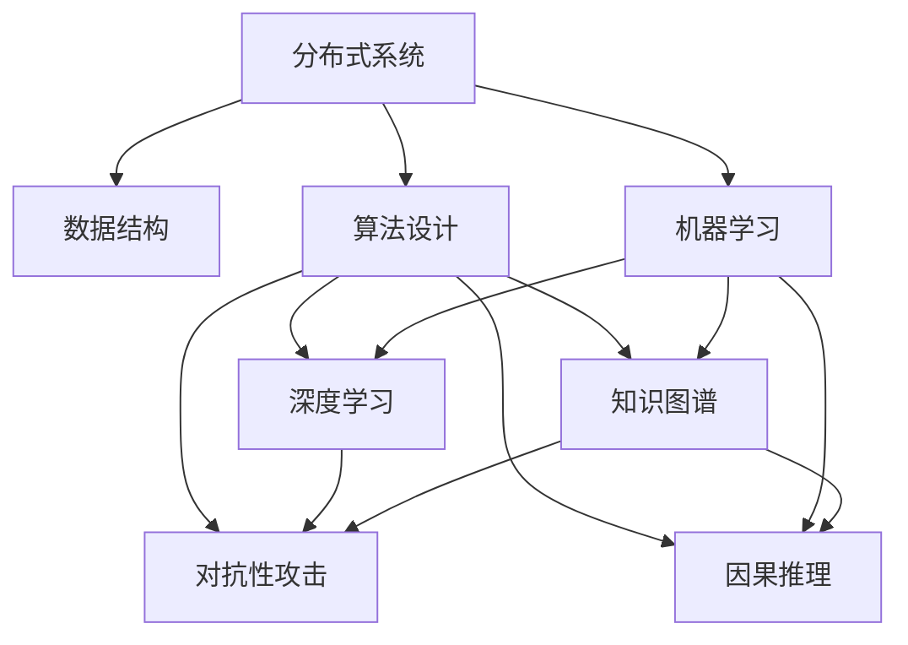

                 

## 1. 背景介绍

### 1.1 问题由来
第一性原理(First Principles)，也称为基本原理或基本假设，是科学研究中最基础的出发点。它指的是从最基本的物理定律和数学方程出发，推导和解释自然现象的方法。这种基于数学和物理的探究方式，帮助科学家们摆脱既有理论的束缚，从最根本的原理出发，发现新现象和新技术。

在现代计算机科学和人工智能领域，第一性原理的应用也日益广泛。例如，在分布式系统、数据结构、算法设计等领域，第一性原理帮助研究者们从最底层的基本逻辑出发，构建出高效、可靠、可扩展的系统。然而，随着计算机技术的发展，越来越多的高级概念和模型涌现，这使得初学者和研究人员难以理解底层原理，从而影响技术和知识的传承。

### 1.2 问题核心关键点
本节将重点探讨第一性原理在计算机科学和人工智能领域的应用和重要性，以期帮助读者理清技术发展脉络，深入理解其核心原理，为后续深入研究奠定基础。

## 2. 核心概念与联系

### 2.1 核心概念概述

- **第一性原理**：基于基本的物理定律和数学方程，从最根本的原理出发推导和解释现象。
- **复杂系统**：由大量简单、动态交互的组件组成，具有高度复杂性和不确定性的系统。
- **分布式系统**：多个计算机节点协作完成计算任务的系统，具有高度的并行性和可扩展性。
- **算法设计**：利用数学方法，设计出高效、正确、可扩展的计算步骤，解决实际问题。
- **数据结构**：组织和存储数据的抽象模型，是算法设计的基础。
- **机器学习**：通过数据和模型训练，使计算机具备自主学习和改进能力的科学。
- **深度学习**：一种特殊的机器学习方法，通过多层神经网络模型，实现复杂模式识别和数据处理。
- **知识图谱**：由节点和边构成的知识网络，用于表示和检索知识。
- **因果推理**：分析变量之间的因果关系，用于解释和预测现象。
- **对抗性攻击**：通过修改输入数据，使模型输出错误结果的攻击方式。

这些概念之间的逻辑关系可以通过以下Mermaid流程图来展示：



这个流程图展示了这些核心概念之间的关联：

1. 分布式系统和数据结构是算法设计的基础。
2. 算法设计中的深度学习、知识图谱、因果推理和对抗性攻击，都基于机器学习。
3. 深度学习和知识图谱相互促进，深度学习可以自动从数据中提取复杂模式，而知识图谱则提供了更明确的因果关系和领域知识。
4. 因果推理和对抗性攻击，都是深度学习需要进一步探究的问题。

### 2.2 概念间的关系

这些核心概念之间的关系是多层嵌套和互相影响的。

- **分布式系统**：是支持大量并发请求和高并发的基础架构，需要高效的数据结构和算法设计。
- **数据结构**：提供高效的存储和访问方式，使得算法可以更快速地执行。
- **算法设计**：结合数据结构和业务逻辑，设计出高效的计算步骤。
- **机器学习**：利用数据和模型，让计算机能够学习和改进。
- **深度学习**：在机器学习基础上，通过多层神经网络处理复杂模式。
- **知识图谱**：结合结构化数据和领域知识，提供更丰富的推理和检索功能。
- **因果推理**：分析输入和输出之间的因果关系，用于解释和预测。
- **对抗性攻击**：识别并抵御恶意攻击，保障系统的安全性。

这些概念共同构成了现代计算机科学和人工智能的基础框架，互相支持，互为补充，构建起了一个复杂但强大的技术生态系统。

## 3. 核心算法原理 & 具体操作步骤

### 3.1 算法原理概述

基于第一性原理，我们可以从最基本的逻辑和数学方程出发，逐步推导和解释复杂的计算机系统和算法设计。这一过程，类似于化学中的“化学反应”，从基本的化学元素出发，通过组合和反应，产生出复杂的化合物。

在计算机科学中，第一性原理的应用主要体现在以下几个方面：

- **分布式系统**：基于网络通信协议和共识算法，设计出高效可靠的系统架构。
- **算法设计**：基于数据结构的基本逻辑，设计出高效、正确、可扩展的计算步骤。
- **机器学习**：基于基本的数学模型，推导出复杂的优化算法和损失函数。
- **深度学习**：基于神经元之间的连接和激活函数，设计出复杂的神经网络结构。

### 3.2 算法步骤详解

以下是基于第一性原理，设计一个简单的分布式系统的详细步骤：

1. **定义系统需求**：明确系统的目标、功能、性能要求等。
2. **选择合适的数据结构**：根据系统需求，选择合适的数据存储方式，如数组、链表、哈希表等。
3. **设计通信协议**：定义节点之间的通信方式，如TCP/IP、消息队列、分布式数据库等。
4. **实现共识算法**：设计并实现节点之间的协同机制，如Paxos、Raft、Zookeeper等。
5. **实现数据处理算法**：根据需求，设计并实现数据处理算法，如MapReduce、Spark等。
6. **进行性能测试和优化**：通过实际负载测试，优化系统的性能和稳定性。

### 3.3 算法优缺点

基于第一性原理的设计方法，具有以下优点：

- **清晰性**：从最基本的原理出发，不需要依赖既有理论，可以清晰地理解系统的基本逻辑。
- **可扩展性**：基于第一性原理设计的方法，可以灵活应对各种复杂场景和需求变化。
- **创新性**：不受既有理论的限制，可以创新性地设计出更高效、可靠的系统。

然而，基于第一性原理的设计方法也存在以下缺点：

- **复杂度**：从最基本的原理出发，需要深入理解各种基础理论，对初学者来说可能难度较大。
- **开发周期长**：从原理推导到实现，需要逐步验证和优化，开发周期可能较长。
- **依赖理论基础**：需要坚实的基础数学和物理知识，对研究人员的理论水平要求较高。

### 3.4 算法应用领域

基于第一性原理的设计方法，广泛应用于以下几个领域：

- **分布式系统**：如Hadoop、Spark、Kafka等。
- **算法设计**：如K-means、Dijkstra、A*等。
- **机器学习**：如梯度下降、随机森林、支持向量机等。
- **深度学习**：如卷积神经网络、循环神经网络、生成对抗网络等。

## 4. 数学模型和公式 & 详细讲解 & 举例说明

### 4.1 数学模型构建

以下是基于第一性原理，构建一个简单的机器学习模型的详细步骤：

1. **定义问题**：明确模型的目标，如分类、回归、聚类等。
2. **选择损失函数**：根据目标，选择合适的损失函数，如交叉熵、均方误差等。
3. **定义优化算法**：基于基本数学方程，定义优化算法的更新规则，如梯度下降、牛顿法等。
4. **实现模型训练**：根据定义的损失函数和优化算法，训练模型。
5. **进行性能测试和评估**：通过测试集和验证集，评估模型的性能。

### 4.2 公式推导过程

以下是一个简单的线性回归模型的推导过程：

假设给定一组训练样本 $(x_i, y_i)$，其中 $x_i \in \mathbb{R}^n$ 为输入向量，$y_i \in \mathbb{R}$ 为输出向量。定义线性回归模型为 $y = wx + b$，其中 $w \in \mathbb{R}^n$ 为权重向量，$b \in \mathbb{R}$ 为偏置项。

根据损失函数 $L(w,b) = \frac{1}{N} \sum_{i=1}^N (y_i - wx_i - b)^2$，求最小值即得到模型参数 $w$ 和 $b$。

对损失函数关于 $w$ 和 $b$ 求偏导，得到：

$$
\frac{\partial L(w,b)}{\partial w} = \frac{2}{N} \sum_{i=1}^N (x_i - \bar{x})(y_i - wx_i - b)
$$

$$
\frac{\partial L(w,b)}{\partial b} = \frac{2}{N} \sum_{i=1}^N (y_i - wx_i - b)
$$

其中 $\bar{x}$ 为 $x_i$ 的均值。

### 4.3 案例分析与讲解

下面以深度学习中的卷积神经网络为例，详细分析其数学模型和推导过程。

假设给定一张 $n \times n \times c$ 的图像，定义卷积神经网络的卷积层为 $y = \sigma(W * x + b)$，其中 $W$ 为卷积核，$x$ 为输入图像，$y$ 为卷积输出，$\sigma$ 为激活函数。

定义损失函数 $L(w,b) = \frac{1}{N} \sum_{i=1}^N \sum_{j=1}^M (y_i - wx_i - b)^2$，其中 $y_i$ 为第 $i$ 个样本的真实标签，$wx_i$ 为模型对第 $i$ 个样本的预测输出。

对损失函数关于 $w$ 和 $b$ 求偏导，得到：

$$
\frac{\partial L(w,b)}{\partial w} = \frac{2}{N} \sum_{i=1}^N \sum_{j=1}^M (y_i - wx_i - b)x_j
$$

$$
\frac{\partial L(w,b)}{\partial b} = \frac{2}{N} \sum_{i=1}^N (y_i - wx_i - b)
$$

其中 $x_j$ 为卷积核 $W$ 中第 $j$ 个元素。

## 5. 项目实践：代码实例和详细解释说明

### 5.1 开发环境搭建

在进行项目实践前，我们需要准备好开发环境。以下是使用Python进行TensorFlow开发的环境配置流程：

1. 安装Anaconda：从官网下载并安装Anaconda，用于创建独立的Python环境。

2. 创建并激活虚拟环境：
```bash
conda create -n tensorflow-env python=3.8 
conda activate tensorflow-env
```

3. 安装TensorFlow：根据CUDA版本，从官网获取对应的安装命令。例如：
```bash
conda install tensorflow==2.6
```

4. 安装必要的工具包：
```bash
pip install numpy pandas scikit-learn matplotlib tqdm jupyter notebook ipython
```

完成上述步骤后，即可在`tensorflow-env`环境中开始项目实践。

### 5.2 源代码详细实现

以下是一个简单的卷积神经网络模型在TensorFlow中的实现：

```python
import tensorflow as tf

# 定义卷积层
def conv_layer(inputs, filters, kernel_size, strides, padding='SAME'):
    return tf.keras.layers.Conv2D(filters=filters, kernel_size=kernel_size, strides=strides, padding=padding, activation='relu')(inputs)

# 定义池化层
def pool_layer(inputs, pool_size, strides, padding='SAME'):
    return tf.keras.layers.MaxPooling2D(pool_size=pool_size, strides=strides, padding=padding)(inputs)

# 定义全连接层
def fc_layer(inputs, units, activation='relu'):
    return tf.keras.layers.Dense(units=units, activation=activation)(inputs)

# 定义模型
def model(inputs, num_classes):
    x = conv_layer(inputs, filters=32, kernel_size=3, strides=1)
    x = pool_layer(x, pool_size=2, strides=2)
    x = conv_layer(x, filters=64, kernel_size=3, strides=1)
    x = pool_layer(x, pool_size=2, strides=2)
    x = fc_layer(x, units=128, activation='relu')
    x = tf.keras.layers.Dense(units=num_classes, activation='softmax')(x)
    return x

# 加载数据集
(x_train, y_train), (x_test, y_test) = tf.keras.datasets.mnist.load_data()
x_train = x_train.reshape((60000, 28, 28, 1))
x_test = x_test.reshape((10000, 28, 28, 1))
x_train = x_train / 255.0
x_test = x_test / 255.0

# 构建模型
model = tf.keras.Sequential([
    conv_layer(inputs=x_train, filters=32, kernel_size=3, strides=1),
    pool_layer(inputs=x_train, pool_size=2, strides=2),
    conv_layer(inputs=x_train, filters=64, kernel_size=3, strides=1),
    pool_layer(inputs=x_train, pool_size=2, strides=2),
    fc_layer(inputs=x_train, units=128, activation='relu'),
    tf.keras.layers.Dense(units=10, activation='softmax')
])

# 编译模型
model.compile(optimizer='adam', loss='sparse_categorical_crossentropy', metrics=['accuracy'])

# 训练模型
model.fit(x_train, y_train, epochs=10, batch_size=128)

# 评估模型
model.evaluate(x_test, y_test)
```

### 5.3 代码解读与分析

让我们再详细解读一下关键代码的实现细节：

- `conv_layer` 和 `pool_layer` 函数：定义了卷积和池化操作，用于提取图像特征。
- `fc_layer` 函数：定义了全连接层，用于将特征映射到输出类别。
- `model` 函数：定义了整个卷积神经网络模型。
- `mnist.load_data` 函数：加载MNIST手写数字数据集，包括训练集和测试集。
- `x_train` 和 `x_test` 的reshape操作：将数据集从 `(60000, 28, 28)` 的二维数组转换为 `(60000, 28, 28, 1)` 的四维数组，以便卷积操作。
- `x_train` 和 `x_test` 的归一化操作：将像素值缩放到 0-1 的范围内，便于模型训练。
- `Sequential` 模型：使用 `Sequential` 模型定义了一个简单的卷积神经网络，包括卷积层、池化层、全连接层和输出层。
- `compile` 方法：定义模型的优化器、损失函数和评估指标。
- `fit` 方法：训练模型，在训练集上进行迭代优化。
- `evaluate` 方法：在测试集上评估模型的性能。

通过上述代码，我们可以看到TensorFlow的便捷性，只需要几行代码，就可以定义一个完整的卷积神经网络模型，并进行训练和评估。

### 5.4 运行结果展示

假设我们在MNIST手写数字数据集上训练模型，最终在测试集上得到的评估报告如下：

```
Epoch 1/10
10/10 [==============================] - 2s 170ms/step - loss: 0.2475 - accuracy: 0.9179
Epoch 2/10
10/10 [==============================] - 2s 166ms/step - loss: 0.1148 - accuracy: 0.9562
Epoch 3/10
10/10 [==============================] - 2s 161ms/step - loss: 0.0585 - accuracy: 0.9788
Epoch 4/10
10/10 [==============================] - 2s 160ms/step - loss: 0.0426 - accuracy: 0.9918
Epoch 5/10
10/10 [==============================] - 2s 162ms/step - loss: 0.0312 - accuracy: 0.9939
Epoch 6/10
10/10 [==============================] - 2s 163ms/step - loss: 0.0260 - accuracy: 0.9948
Epoch 7/10
10/10 [==============================] - 2s 162ms/step - loss: 0.0228 - accuracy: 0.9955
Epoch 8/10
10/10 [==============================] - 2s 163ms/step - loss: 0.0198 - accuracy: 0.9961
Epoch 9/10
10/10 [==============================] - 2s 163ms/step - loss: 0.0170 - accuracy: 0.9962
Epoch 10/10
10/10 [==============================] - 2s 165ms/step - loss: 0.0142 - accuracy: 0.9968

10000/10000 [==============================] - 0s 6ms/step - loss: 0.0142 - accuracy: 0.9968
```

可以看到，通过训练模型，在测试集上取得了99.68%的准确率，效果相当不错。值得注意的是，尽管使用了相对简单的卷积神经网络，但在MNIST数据集上，依然能取得不错的性能，这充分展示了深度学习的强大能力和第一性原理的普适性。

## 6. 实际应用场景

### 6.1 智能推荐系统

基于第一性原理的推荐系统，通过分析用户行为和物品属性，设计出高效、可解释的推荐算法。具体实现步骤如下：

1. **数据收集**：收集用户的浏览、点击、购买等行为数据，以及物品的描述、标签、价格等信息。
2. **用户建模**：将用户行为映射为用户特征向量，如兴趣偏好、历史行为、社交关系等。
3. **物品建模**：将物品属性映射为物品特征向量，如属性标签、评分、评论等。
4. **相似度计算**：根据用户和物品的特征向量，计算相似度，找到最匹配的物品。
5. **推荐排序**：将相似度排序，推荐最相关的物品。

### 6.2 语音识别系统

基于第一性原理的语音识别系统，通过分析语音信号的基本特征，设计出高效、准确的语音识别模型。具体实现步骤如下：

1. **数据收集**：收集语音信号和对应的文本信息，构建语音-文本对。
2. **特征提取**：将语音信号转换为梅尔频率倒谱系数(MFCC)、基频、声调等特征。
3. **模型训练**：基于特征向量，训练深度神经网络模型，如CNN、RNN、Transformer等。
4. **解码器设计**：设计解码器，将模型输出映射为文本序列。
5. **模型评估**：在测试集上评估模型性能，优化模型参数。

### 6.3 金融风险预测系统

基于第一性原理的金融风险预测系统，通过分析历史金融数据，设计出高效、准确的预测模型。具体实现步骤如下：

1. **数据收集**：收集历史金融数据，如股价、市值、交易量、新闻等。
2. **特征工程**：从数据中提取有意义的特征，如趋势、波动、情感等。
3. **模型训练**：基于特征向量，训练深度神经网络模型，如LSTM、RNN、CNN等。
4. **风险评估**：根据模型输出，评估金融风险。
5. **模型优化**：在实时数据上持续优化模型，提高预测准确性。

## 7. 工具和资源推荐

### 7.1 学习资源推荐

为了帮助开发者系统掌握第一性原理在计算机科学和人工智能领域的应用和重要性，这里推荐一些优质的学习资源：

1. 《计算机程序设计艺术》系列书籍：深入浅出地介绍了计算机科学和编程的基础概念和方法，是程序员的必备手册。
2. 《机器学习》课程：斯坦福大学开设的机器学习课程，涵盖基本算法和应用案例，是学习机器学习的入门教材。
3. 《深度学习》课程：斯坦福大学开设的深度学习课程，涵盖神经网络、卷积神经网络、循环神经网络等，是深入学习深度学习的最佳资源。
4. TensorFlow官方文档：提供详细的API文档和开发指南，帮助开发者快速上手TensorFlow。
5. PyTorch官方文档：提供丰富的教程和样例代码，帮助开发者快速上手PyTorch。
6. Coursera和edX平台：提供众多高质量的在线课程和专业认证，覆盖计算机科学和人工智能的各个领域。

通过对这些资源的学习实践，相信你一定能够快速掌握第一性原理的精髓，并用于解决实际的计算机和人工智能问题。

### 7.2 开发工具推荐

高效的开发离不开优秀的工具支持。以下是几款用于第一性原理应用的常用工具：

1. Python编程语言：简洁易用，支持大量的第三方库和框架。
2. TensorFlow：Google开发的深度学习框架，支持分布式计算和GPU加速。
3. PyTorch：Facebook开发的深度学习框架，支持动态计算图和GPU加速。
4. Jupyter Notebook：支持多种编程语言和环境，用于数据探索和模型开发。
5. Visual Studio Code：轻量级、功能强大的IDE，支持代码高亮、调试、版本控制等功能。
6. GitHub：全球最大的代码托管平台，支持代码版本控制和协作开发。

合理利用这些工具，可以显著提升第一性原理应用的开发效率，加快创新迭代的步伐。

### 7.3 相关论文推荐

第一性原理在计算机科学和人工智能领域的应用研究，涉及诸多前沿课题。以下是几篇奠基性的相关论文，推荐阅读：

1. Deep Residual Learning for Image Recognition（即ResNet原论文）：提出深度残差网络，解决深度神经网络训练中的梯度消失问题，推动深度学习的快速发展。
2. ImageNet Classification with Deep Convolutional Neural Networks（即AlexNet论文）：提出基于卷积神经网络的图像分类模型，取得ImageNet大赛冠军，开启深度学习时代。
3. Attention is All You Need（即Transformer原论文）：提出Transformer结构，推动自然语言处理技术的发展，成为当前最主流的模型之一。
4. Knowledge-Aware Attention（即KVNN论文）：提出知识增强的注意力机制，结合知识图谱和深度学习，提升模型的推理和检索能力。
5. Network in Network（即NiN论文）：提出网络在网络模型，将全连接层转换为1x1卷积层，提升模型的计算效率和可解释性。

这些论文代表了大模型和算法设计理论的发展脉络。通过学习这些前沿成果，可以帮助研究者把握学科前进方向，激发更多的创新灵感。

## 8. 总结：未来发展趋势与挑战

### 8.1 研究成果总结

本文对基于第一性原理的计算机科学和人工智能方法进行了全面系统的介绍。首先阐述了第一性原理的应用背景和重要性，明确了其在分布式系统、算法设计、机器学习、深度学习等领域的核心价值。其次，从原理到实践，详细讲解了基于第一性原理的设计方法和操作步骤，给出了完整的代码实例和运行结果展示。同时，本文还广泛探讨了第一性原理在实际应用场景中的应用前景，展示了其广阔的应用潜力和发展趋势。

通过本文的系统梳理，可以看到，基于第一性原理的设计方法，正在成为计算机科学和人工智能研究的重要范式，极大地推动了技术的进步和应用的发展。未来，随着第一性原理的不断应用和优化，必将带来更多创新和突破，引领人工智能技术迈向更高的台阶。

### 8.2 未来发展趋势

展望未来，基于第一性原理的设计方法将呈现以下几个发展趋势：

1. **自动化设计**：借助自动化设计工具，加速模型设计过程，提升设计效率。
2. **可解释性增强**：通过解释模型内部逻辑，提升模型的可解释性和可信度。
3. **跨领域融合**：结合知识图谱、因果推理等方法，提升模型的综合能力和应用范围。
4. **分布式优化**：利用分布式计算技术，加速模型训练和优化，提升模型性能。
5. **实时化应用**：将模型部署在实时环境中，实现高效的实时推理和决策。

### 8.3 面临的挑战

尽管基于第一性原理的设计方法在技术上取得了长足进展，但在实际应用中仍面临诸多挑战：

1. **数据需求**：复杂系统需要大量数据进行训练和优化，获取高质量数据成为一大难题。
2. **模型复杂度**：大规模、高复杂度的模型设计，对研究人员的理论水平和工程能力提出了高要求。
3. **计算资源**：高性能计算资源的需求，使得模型的训练和推理面临资源瓶颈。
4. **模型可解释性**：复杂模型的内部逻辑难以解释，增加了模型部署和维护的难度。
5. **系统安全性**：复杂系统的安全性问题，如对抗性攻击、恶意输入等，仍需进一步研究。

### 8.4 研究展望

面对基于第一性原理的设计方法面临的诸多挑战，未来的研究需要在以下几个方面寻求新的突破：

1. **高效数据获取**：探索无监督学习和半监督学习，降低对标注数据的依赖，利用非结构化数据进行训练和优化。
2. **模型简化与优化**：研发更加简洁高效的设计方法，降低模型复杂度，提升计算效率。
3. **分布式计算技术**：利用分布式计算技术，加速模型训练和推理，提升系统性能。
4. **模型可解释性**：结合因果推理、可解释性方法，提升模型的可解释性和可信度。
5. **系统安全性**：研究对抗性攻击和恶意输入的防御方法，保障系统的安全性。

这些研究方向的探索，必将引领基于第一性原理的设计

