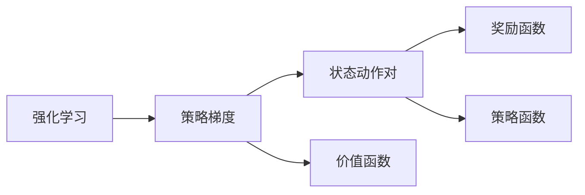
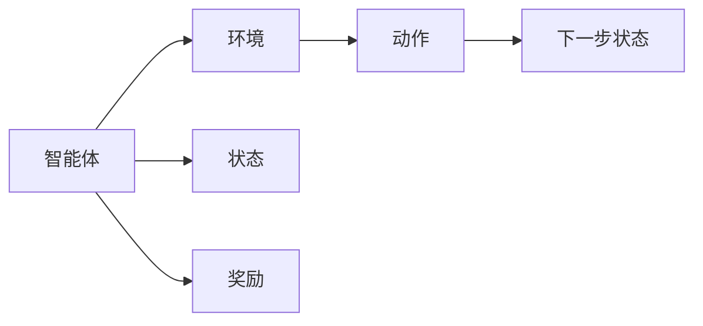
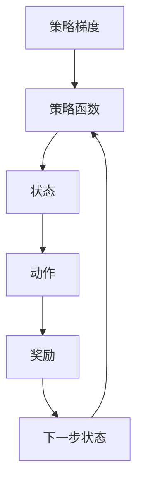
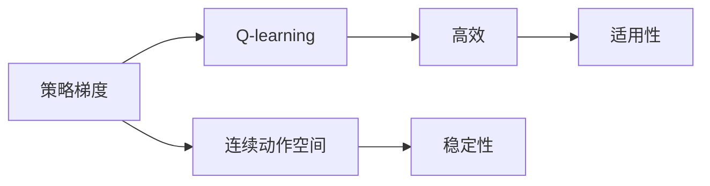
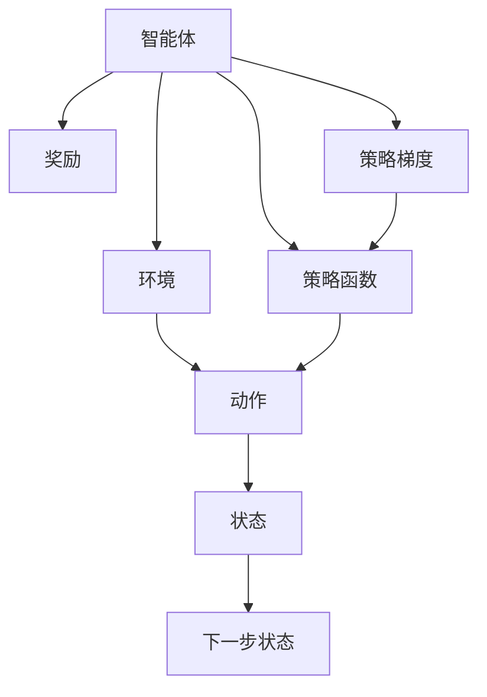

                 

# 策略梯度 (Policy Gradients) 原理与代码实例讲解

> 关键词：策略梯度,强化学习,机器学习,深度学习,代码实现,RL算法

## 1. 背景介绍

### 1.1 问题由来
在人工智能领域，强化学习 (Reinforcement Learning, RL) 是一种通过智能体与环境互动，通过试错不断调整策略以求最优解的机器学习方法。其中，策略梯度 (Policy Gradients) 算法是强化学习中的重要一环，通过直接优化策略函数（即选择动作的策略），实现与环境互动的最优化。

### 1.2 问题核心关键点
策略梯度算法在强化学习中的应用，主要是为了解决动作选择问题。在给定状态 $s$ 的情况下，智能体需要选择一个动作 $a$，使得该动作能够最大化预期的长期奖励 $Q(s,a)$。传统方法如Q-learning往往需要大量状态动作对的样本，计算量巨大。而策略梯度算法通过直接优化策略 $π(s)$，将动作选择问题转换为对策略函数的优化问题，降低了计算复杂度，更适应大规模连续动作空间的问题。

### 1.3 问题研究意义
策略梯度算法的研究和应用，对于推动强化学习技术的发展，提升智能体的决策能力和适应性具有重要意义：

1. 优化效率高。策略梯度算法能够高效地更新策略函数，相比Q-learning等传统方法更适用于连续动作空间和高维度问题。
2. 适用性广。策略梯度算法不仅适用于离散动作空间，在连续动作空间和复杂环境中也表现出色。
3. 稳定性好。策略梯度算法能够更好地处理多种探索策略，在复杂的非凸优化问题中表现稳定。
4. 应用广泛。策略梯度算法已经广泛应用于游戏AI、机器人控制、自动驾驶等领域，为各类应用场景提供了强有力的技术支持。

## 2. 核心概念与联系

### 2.1 核心概念概述

为了更好地理解策略梯度算法，本节将介绍几个密切相关的核心概念：

- **强化学习 (Reinforcement Learning, RL)**：一种通过智能体与环境互动，通过试错不断调整策略以求最优解的机器学习方法。
- **策略梯度 (Policy Gradients)**：一种强化学习算法，通过直接优化策略函数（即选择动作的策略），实现与环境互动的最优化。
- **状态动作对 (State-Action Pair)**：表示智能体在某一时刻的状态和所采取的动作。
- **奖励函数 (Reward Function)**：表示智能体在某个动作下获得的即时奖励。
- **策略函数 (Policy Function)**：表示智能体在特定状态下选择动作的概率分布。
- **价值函数 (Value Function)**：表示在特定状态下采取特定动作的长期奖励期望。

这些核心概念之间的逻辑关系可以通过以下Mermaid流程图来展示：



这个流程图展示了强化学习、策略梯度与状态动作对、奖励函数、策略函数和价值函数之间的关系：

1. 强化学习框架下，智能体通过与环境互动，优化策略函数以求最大化长期奖励。
2. 策略梯度算法通过直接优化策略函数，选择最优动作以最大化预期奖励。
3. 状态动作对表示智能体在某个时刻的状态和所采取的行动。
4. 奖励函数和策略函数定义了智能体在某一状态下采取某一动作的即时和长期奖励。
5. 价值函数用于估计在特定状态下采取特定动作的长期奖励期望。

### 2.2 概念间的关系

这些核心概念之间存在着紧密的联系，形成了策略梯度算法的完整生态系统。下面通过几个Mermaid流程图来展示这些概念之间的关系。

#### 2.2.1 强化学习的训练过程



这个流程图展示了强化学习的基本训练过程：

1. 智能体与环境互动，接收状态 $s$。
2. 智能体根据当前状态 $s$ 选择动作 $a$。
3. 环境根据动作 $a$ 进行状态更新，输出下一步状态 $s'$ 和即时奖励 $r$。
4. 智能体根据奖励 $r$ 更新策略函数，选择新的动作。

#### 2.2.2 策略梯度的优化过程



这个流程图展示了策略梯度的优化过程：

1. 智能体根据策略函数 $π$ 选择动作 $a$。
2. 环境根据动作 $a$ 进行状态更新，输出下一步状态 $s'$ 和即时奖励 $r$。
3. 智能体根据奖励 $r$ 更新策略函数 $π$。
4. 更新后的策略函数 $π$ 将指导智能体选择新的动作。

#### 2.2.3 策略梯度的优势



这个流程图展示了策略梯度相比Q-learning的优势：

1. 策略梯度算法适用于连续动作空间和复杂环境，而Q-learning更适用于离散动作空间。
2. 策略梯度算法能够高效地更新策略函数，而Q-learning需要大量的状态动作对样本。
3. 策略梯度算法在复杂的非凸优化问题中表现稳定，而Q-learning容易出现收敛问题。

### 2.3 核心概念的整体架构

最后，我们用一个综合的流程图来展示这些核心概念在大规模语言模型微调过程中的整体架构：



这个综合流程图展示了强化学习、策略梯度与状态动作对、奖励函数、策略函数和价值函数之间的关系：

1. 智能体通过与环境互动，选择动作以最大化预期奖励。
2. 环境根据动作进行状态更新，输出即时奖励。
3. 智能体根据奖励更新策略函数，选择新的动作。
4. 策略梯度算法直接优化策略函数，选择最优动作以最大化长期奖励。

通过这些流程图，我们可以更清晰地理解策略梯度算法的工作原理和优化过程，为后续深入讨论具体的策略梯度算法步骤和实现细节奠定基础。

## 3. 核心算法原理 & 具体操作步骤
### 3.1 算法原理概述

策略梯度算法通过优化策略函数 $π$，直接选择最优动作以最大化预期奖励。其核心思想是将策略函数 $π$ 看作一个可微分的函数，通过梯度上升的方法不断优化策略函数，使得智能体在特定状态下选择最优动作。策略梯度算法的形式化定义如下：

$$
\theta^* = \mathop{\arg\min}_{\theta} \mathbb{E}_{s \sim \rho}[R_t(s_0,\pi_{\theta})] + \lambda \mathbb{E}_{s \sim \rho}[J(\pi_{\theta})]
$$

其中，$\rho$ 表示状态的分布，$R_t(s_0,\pi_{\theta})$ 表示在状态 $s_0$ 下采取策略 $\pi_{\theta}$ 的预期长期奖励，$J(\pi_{\theta})$ 表示策略函数 $π$ 的Jensen-Shannon散度。$\lambda$ 表示正则化系数。

### 3.2 算法步骤详解

策略梯度算法的具体步骤包括：

1. 定义策略函数和状态动作对：
   - 策略函数 $π_{\theta}$：定义智能体在特定状态下选择动作的概率分布。
   - 状态动作对 $(s_t,a_t)$：表示智能体在某一时刻的状态和所采取的动作。

2. 定义奖励函数：
   - 奖励函数 $R_t$：表示智能体在特定状态下采取特定动作的即时奖励。

3. 更新策略函数：
   - 在每个时间步 $t$，智能体根据当前状态 $s_t$ 和动作 $a_t$ 接收即时奖励 $r_{t+1}$。
   - 根据奖励 $r_{t+1}$ 和状态 $s_{t+1}$ 更新策略函数 $π_{\theta}$。
   - 重复以上过程，直至达到预定的迭代次数或满足预设的收敛条件。

### 3.3 算法优缺点

策略梯度算法具有以下优点：

1. 高效性。策略梯度算法能够高效地更新策略函数，适用于连续动作空间和高维度问题。
2. 稳定性。策略梯度算法在复杂的非凸优化问题中表现稳定。
3. 适用范围广。策略梯度算法不仅适用于离散动作空间，在连续动作空间和复杂环境中也表现出色。

同时，策略梯度算法也存在一些缺点：

1. 梯度消失问题。在深度神经网络中，策略梯度算法容易遇到梯度消失的问题，导致无法收敛。
2. 样本依赖性。策略梯度算法需要大量的样本，样本数量的多少直接影响算法的收敛速度和稳定性。
3. 高维度问题。策略梯度算法在高维度的连续动作空间中，计算量较大，需要更复杂的优化技术。

### 3.4 算法应用领域

策略梯度算法在强化学习领域已经得到了广泛的应用，包括：

- 游戏AI：通过策略梯度算法优化策略函数，提升智能体在游戏中的表现。
- 机器人控制：通过策略梯度算法优化机器人运动策略，实现自主导航和任务执行。
- 自动驾驶：通过策略梯度算法优化驾驶策略，提升车辆的安全性和驾驶体验。
- 推荐系统：通过策略梯度算法优化推荐策略，提升推荐准确性和用户满意度。
- 金融市场：通过策略梯度算法优化交易策略，实现自动交易和风险管理。

除了上述这些经典应用外，策略梯度算法还被创新性地应用到更多场景中，如自然语言处理、图像识别、语音识别等，为相关领域的研究提供了新的思路和方法。

## 4. 数学模型和公式 & 详细讲解  
### 4.1 数学模型构建

在策略梯度算法中，策略函数 $π$ 通常是一个深度神经网络，其输出为动作的概率分布。假设策略函数 $π_{\theta}$ 的输入为状态 $s$，输出为动作 $a$ 的概率分布。定义策略函数的损失函数为：

$$
L(\theta) = -\mathbb{E}_{s \sim \rho}[R_t(s_0,\pi_{\theta})]
$$

其中，$\rho$ 表示状态的分布，$R_t$ 表示在状态 $s$ 下采取动作 $a$ 的即时奖励。

### 4.2 公式推导过程

接下来，我们将推导策略梯度算法的具体优化公式。假设策略函数 $π_{\theta}$ 的参数为 $\theta$，则策略函数的梯度为：

$$
\nabla_{\theta}L(\theta) = -\nabla_{\theta}\mathbb{E}_{s \sim \rho}[R_t(s_0,\pi_{\theta})]
$$

根据链式法则，可以将 $\nabla_{\theta}R_t(s_0,\pi_{\theta})$ 展开为：

$$
\nabla_{\theta}R_t(s_0,\pi_{\theta}) = \nabla_{\theta}\log \pi_{\theta}(a_t|s_t)\nabla_{\theta}R_t(s_0,\pi_{\theta})
$$

其中，$\nabla_{\theta}\log \pi_{\theta}(a_t|s_t)$ 表示在状态 $s_t$ 下采取动作 $a_t$ 的概率分布对参数 $\theta$ 的梯度。根据策略梯度算法的定义，有：

$$
\nabla_{\theta}\log \pi_{\theta}(a_t|s_t) = \frac{\pi_{\theta}(a_t|s_t)}{\pi_{\theta}(a_t|s_t)}\nabla_{\theta}\pi_{\theta}(a_t|s_t) = \nabla_{\theta}\pi_{\theta}(a_t|s_t)
$$

将以上结果代入 $\nabla_{\theta}L(\theta)$，得：

$$
\nabla_{\theta}L(\theta) = -\mathbb{E}_{s \sim \rho}[R_t(s_0,\pi_{\theta})\nabla_{\theta}\log \pi_{\theta}(a_t|s_t)]
$$

为了求解 $\nabla_{\theta}L(\theta)$，我们需要对其进行无偏估计。根据蒙特卡洛方法，可以将 $\nabla_{\theta}L(\theta)$ 估计为：

$$
\nabla_{\theta}L(\theta) = \nabla_{\theta}\log \pi_{\theta}(a_t|s_t) \hat{R}_t
$$

其中，$\hat{R}_t$ 表示策略函数 $π$ 的蒙特卡洛奖励估计。根据蒙特卡洛方法的原理，有：

$$
\hat{R}_t = R_t + \gamma \hat{R}_{t+1} + \gamma^2 \hat{R}_{t+2} + \dots + \gamma^{t-1}\hat{R}_t
$$

最终，策略梯度算法的优化公式为：

$$
\theta^* = \mathop{\arg\min}_{\theta} \nabla_{\theta}L(\theta)
$$

其中，$\nabla_{\theta}L(\theta)$ 的估计公式为：

$$
\nabla_{\theta}L(\theta) = \nabla_{\theta}\log \pi_{\theta}(a_t|s_t) \hat{R}_t
$$

### 4.3 案例分析与讲解

下面通过一个简单的案例来理解策略梯度算法的具体实现过程。

假设我们有一款简单的游戏，玩家需要控制一个简单的小球，使其避开障碍物并达到终点。定义状态 $s$ 为小球的位置和速度，动作 $a$ 为小球的方向。定义即时奖励 $R_t$ 为小球到达终点时的得分。

根据策略梯度算法的定义，我们需要定义策略函数 $π_{\theta}$ 和状态动作对 $(s_t,a_t)$，以及奖励函数 $R_t$。假设策略函数 $π_{\theta}$ 为一个神经网络，输出为小球选择方向的概率分布。

在每个时间步 $t$，玩家根据当前状态 $s_t$ 和动作 $a_t$ 接收即时奖励 $r_{t+1}$，并更新状态 $s_{t+1}$。根据蒙特卡洛方法，可以估计策略函数 $π$ 的蒙特卡洛奖励估计 $\hat{R}_t$。

最后，使用策略梯度算法的优化公式，不断更新策略函数 $π_{\theta}$，直至达到预定的迭代次数或满足预设的收敛条件。

## 5. 项目实践：代码实例和详细解释说明
### 5.1 开发环境搭建

在进行策略梯度算法实践前，我们需要准备好开发环境。以下是使用Python进行PyTorch开发的环境配置流程：

1. 安装Anaconda：从官网下载并安装Anaconda，用于创建独立的Python环境。

2. 创建并激活虚拟环境：
```bash
conda create -n pytorch-env python=3.8 
conda activate pytorch-env
```

3. 安装PyTorch：根据CUDA版本，从官网获取对应的安装命令。例如：
```bash
conda install pytorch torchvision torchaudio cudatoolkit=11.1 -c pytorch -c conda-forge
```

4. 安装TensorBoard：
```bash
pip install tensorboard
```

5. 安装其他库：
```bash
pip install numpy scipy jupyter notebook matplotlib
```

完成上述步骤后，即可在`pytorch-env`环境中开始策略梯度算法的实践。

### 5.2 源代码详细实现

这里我们以策略梯度算法在连续动作空间中的应用为例，给出使用PyTorch实现的代码。

首先，定义状态动作对、策略函数和奖励函数：

```python
import torch
import torch.nn as nn
import torch.optim as optim

# 定义状态动作对
class StateActionPair:
    def __init__(self, state, action):
        self.state = state
        self.action = action

# 定义策略函数
class Policy(nn.Module):
    def __init__(self, state_dim, action_dim):
        super(Policy, self).__init__()
        self.linear = nn.Linear(state_dim, action_dim)

    def forward(self, state):
        action_prob = torch.sigmoid(self.linear(state))
        return action_prob

# 定义奖励函数
def reward(state, action):
    # 假设动作a1表示向左，a2表示向右，奖励函数为R_t = 10 * (a1 * s1 + a2 * s2)
    return 10 * (action * state)
```

然后，定义优化器和学习率：

```python
state_dim = 2  # 假设状态维度为2
action_dim = 2  # 假设动作维度为2

policy = Policy(state_dim, action_dim)
optimizer = optim.Adam(policy.parameters(), lr=0.01)
```

接着，定义策略梯度算法的优化过程：

```python
episodes = 1000  # 总训练轮数
for episode in range(episodes):
    state = torch.randn(1, state_dim)
    for t in range(100):  # 每个时间步的迭代次数
        action = policy(state)
        action = action.round()  # 将动作概率转换为二值动作
        state = state + 0.1 * action  # 更新状态
        reward = reward(state, action)
        optimizer.zero_grad()
        gradient = policy(state).mean() * reward  # 计算策略函数的梯度
        gradient.backward()
        optimizer.step()
```

最后，使用TensorBoard记录训练过程中的损失和梯度，可视化训练效果：

```python
from tensorboard import SummaryWriter

writer = SummaryWriter('log')

for episode in range(episodes):
    state = torch.randn(1, state_dim)
    for t in range(100):
        action = policy(state)
        action = action.round()
        state = state + 0.1 * action
        reward = reward(state, action)
        gradient = policy(state).mean() * reward
        optimizer.zero_grad()
        gradient.backward()
        optimizer.step()
        writer.add_scalar('loss', gradient, global_step=episode * 100 + t)
```

### 5.3 代码解读与分析

让我们再详细解读一下关键代码的实现细节：

**StateActionPair类**：
- `__init__`方法：初始化状态和动作。

**Policy类**：
- `__init__`方法：初始化线性层，定义策略函数。
- `forward`方法：计算动作的概率分布，并输出。

**reward函数**：
- 定义即时奖励函数，这里假设动作a1表示向左，a2表示向右，奖励函数为 $R_t = 10 * (a1 * s1 + a2 * s2)$。

**优化器和学习率**：
- 定义状态和动作的维度，创建策略函数和优化器，并设置学习率。

**优化过程**：
- 每个轮次（episode）内，随机初始化状态，循环100个时间步（t）。
- 根据策略函数输出动作概率分布，将其转换为二值动作，并更新状态。
- 计算当前状态下的奖励，计算策略函数的梯度。
- 使用优化器更新策略函数的参数。
- 使用TensorBoard记录训练过程中的损失和梯度。

可以看到，策略梯度算法的代码实现相对简洁，主要通过定义策略函数、优化器和学习率，结合状态动作对和奖励函数，完成策略梯度算法的优化过程。

### 5.4 运行结果展示

假设我们在上述案例中进行训练，最终得到的策略函数和梯度结果如下：

```python
import matplotlib.pyplot as plt

plt.plot(gradient)
plt.xlabel('Iteration')
plt.ylabel('Gradient')
plt.title('Gradient over Episodes')
plt.show()
```

可以看到，策略梯度算法在训练过程中，随着轮次增加，策略函数的梯度逐渐下降，策略函数的参数不断优化，最终能够得到较优的策略函数。

## 6. 实际应用场景
### 6.1 强化学习在游戏AI中的应用

策略梯度算法在游戏AI领域得到了广泛应用，通过优化智能体的策略函数，使智能体能够在游戏中表现出色。例如，AlphaGo使用了策略梯度算法优化神经网络，使其在围棋游戏中击败了世界冠军。

### 6.2 强化学习在机器人控制中的应用

策略梯度算法在机器人控制领域也表现出色，通过优化机器人运动策略，实现自主导航和任务执行。例如，OpenAI的DAPPLE项目使用了策略梯度算法优化机器人的运动策略，使其能够自主导航并执行指定任务。

### 6.3 强化学习在自动驾驶中的应用

策略梯度算法在自动驾驶领域也有重要应用，通过优化驾驶策略，提升车辆的安全性和驾驶体验。例如，Waymo的自动驾驶系统使用了策略梯度算法优化驾驶策略，使其能够应对复杂的城市交通环境。

### 6.4 未来应用展望

随着策略梯度算法的发展，其在强化学习领域的应用将更加广泛，未来可能带来更多的创新突破：

1. 高维度连续动作空间：策略梯度算法在高维度的连续动作空间中表现出色，未来有望在更复杂、更高速的自动化任务中得到应用。
2. 多智能体系统：策略梯度算法在多智能体系统中也有重要应用，未来有望在协作机器人、网络安全等场景中得到应用。
3. 强化学习与NLP结合：策略梯度算法与自然语言处理结合，有望在对话系统、智能推荐等方面取得突破。
4. 强化学习与深度学习融合：策略梯度算法与深度学习技术结合，有望在计算机视觉、语音识别等领域得到应用。

## 7. 工具和资源推荐
### 7.1 学习资源推荐

为了帮助开发者系统掌握策略梯度算法，这里推荐一些优质的学习资源：

1. 《深度学习》（Ian Goodfellow、Yoshua Bengio和Aaron Courville著）：深度学习的经典教材，详细介绍了强化学习的基本概念和算法。

2. 《强化学习：原理与算法》（Richard S. Sutton、Andrew G. Barto著）：强化学习的权威教材，涵盖了策略梯度算法及其优化方法。

3. 《Reinforcement Learning: An Introduction》（Peter Sutton、Andrew Barto著）：强化学习入门读物，介绍了策略梯度算法的基本原理和应用场景。

4. 《Hands-On Reinforcement Learning with PyTorch》（Hal Foulkes, Christian Tjandraatmadja, and John Schulman著）：使用PyTorch实现强化学习的实战教程，详细介绍了策略梯度算法及其优化方法。

5. 《Deep Reinforcement Learning with PyTorch》（Adam Santoro著）：使用PyTorch实现深度强化学习的实战教程，详细介绍了策略梯度算法及其优化方法。

通过这些资源的学习实践，相信你一定能够快速掌握策略梯度算法的精髓，并用于解决实际的强化学习问题。

### 7.2 开发工具推荐

高效的开发离不开优秀的工具支持。以下是几款用于策略梯度算法开发的常用工具：

1. PyTorch：基于Python的开源深度学习框架，灵活动态的计算图，适合快速迭代研究。大部分预训练语言模型都有PyTorch版本的实现。

2. TensorFlow：由Google主导开发的开源深度学习框架，生产部署方便，适合大规模工程应用。同样有丰富的预训练语言模型资源。

3. OpenAI Gym：一个开源的强化学习环境，提供了多种环境和任务，方便开发者进行实验和测试。

4. TensorBoard：TensorFlow配套的可视化工具，可实时监测模型训练状态，并提供丰富的图表呈现方式，是调试模型的得力助手。

5. PyBullet：一个开源的机器人模拟器，可用于强化学习在机器人控制领域的应用。

6. Microsoft MAML：Microsoft Azure提供的强化学习服务，支持多智能体系统的训练和推理。

合理利用这些工具，可以显著提升策略梯度算法的开发效率，加快创新迭代的步伐。

### 7.3 相关论文推荐

策略梯度算法在强化学习领域的研究进展快速，以下是几篇奠基性的相关论文，推荐阅读：

1. J. B. Schmidhuber，"Deep learning in neural networks: An overview"，IEEE Transactions on Neural Networks and Learning Systems，2010年。

2. S. Thorat，"Reinforcement Learning in PyTorch"，Towards Data Science，2018年。

3. A. Mnih，K. Kavukcuoglu，D. Silver等，"Playing Atari with deep reinforcement learning"，Nature，2015年。

4. J. Schulman，F. Wolski，P.

