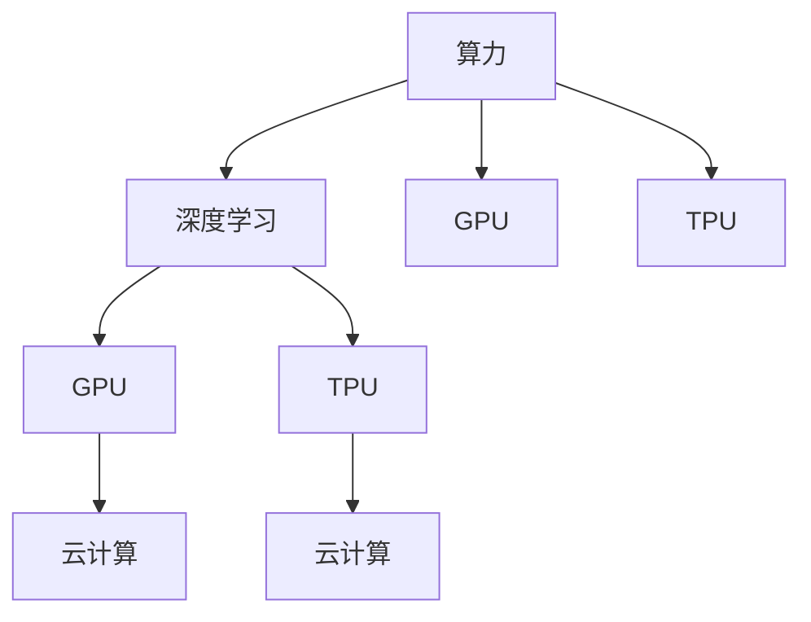
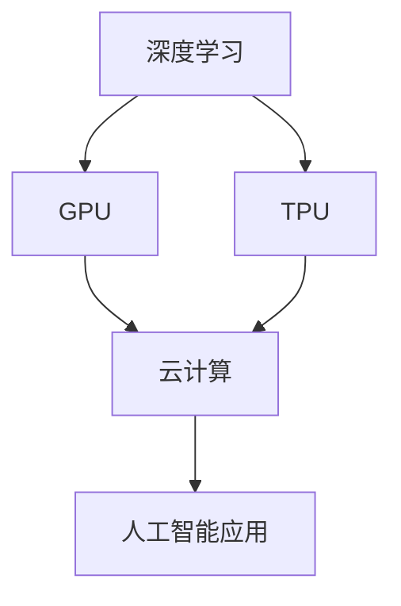

                 

# 算力革命与NVIDIA的角色

## 1. 背景介绍

随着人工智能(AI)技术的迅速发展，算力需求呈现出爆炸式增长。从图像识别、语音识别到自然语言处理、推荐系统，每一项技术进步都依赖于强大的计算能力。然而，传统的CPU和GPU在处理大数据和复杂算法时面临性能瓶颈，无法满足日益增长的AI需求。在这一背景下，NVIDIA引领了算力革命，通过高性能计算技术，推动了AI应用的广泛普及。

### 1.1 算力革命的背景

近年来，AI在各个领域的应用不断深入，从医疗、金融到制造业、农业，各行各业都在寻找AI解决方案以提高效率和优化决策。AI应用的广泛性带来了巨大的计算需求，对算力的要求日益增长。根据全球AI指数报告，2021年全球AI市场规模达到3000亿美元，预计到2025年将达到5000亿美元。算力需求的大幅提升，催生了对高性能计算芯片的巨大需求。

### 1.2 NVIDIA的崛起

NVIDIA成立于1993年，以图形处理器(GPU)起家，凭借其出色的图形渲染能力迅速成为图形芯片领域的领导者。随着AI热潮的兴起，NVIDIA抓住了先机，推出了一系列专为AI优化的计算平台，如GPU、TPU等，迅速占据了AI计算市场的领先地位。根据市场研究机构Mercury Research的数据，2021年NVIDIA在全球计算芯片市场的份额达到了55%，成为无可争议的市场领导者。

## 2. 核心概念与联系

### 2.1 核心概念概述

为更好地理解NVIDIA在算力革命中的角色，我们需要了解几个关键概念：

- **算力(Computational Power)**：指计算机或系统每秒可以执行的浮点运算次数。算力是衡量计算能力的重要指标，直接影响AI模型的训练和推理速度。
- **深度学习(DL)**：一种基于神经网络的学习方法，通过大量数据训练模型，提取特征并进行分类、预测等任务。深度学习在图像识别、语音识别、自然语言处理等领域取得了显著成果。
- **GPU**：通用图形处理器，除了图像渲染功能外，还能高效处理大量并行计算任务，适用于深度学习等大数据计算场景。
- **TPU**：Tensor Processing Unit，专为深度学习优化设计的计算芯片。TPU具备更高的计算效率和更低的能耗，是深度学习模型训练的理想选择。
- **云计算(Cloud Computing)**：通过互联网提供计算资源和服务，用户按需使用，无需购买或管理硬件设施。云计算是算力革命的重要组成部分，NVIDIA在云端提供了强大的计算支持。

这些概念之间的联系可以通过以下Mermaid流程图来展示：



这个流程图展示了算力、深度学习、GPU和TPU之间的相互依赖关系，以及云计算对算力应用的重要推动作用。

### 2.2 概念间的关系

这些核心概念之间的关系可以通过以下Mermaid流程图来进一步展示：



这个综合流程图展示了深度学习对GPU和TPU的需求，以及云计算作为算力基础设施对AI应用的重要支持。

## 3. 核心算法原理 & 具体操作步骤

### 3.1 算法原理概述

NVIDIA在算力革命中的核心贡献在于其高性能计算芯片的设计和优化，使其能够高效支持深度学习等大数据计算任务。NVIDIA的计算平台包括GPU、TPU等，具备高性能并行计算能力，能够迅速处理海量数据。

深度学习算法如卷积神经网络(CNN)、循环神经网络(RNN)、Transformer等，对计算资源的要求较高，特别是在模型训练阶段。NVIDIA的计算平台通过高效的并行计算，大大缩短了深度学习模型的训练时间，提升了模型性能。

### 3.2 算法步骤详解

NVIDIA计算平台的深度学习应用步骤主要包括以下几个方面：

**Step 1: 数据准备**
- 收集并清洗大规模数据集，如图像、语音、文本等，以便于深度学习模型的训练。
- 对数据进行预处理，如归一化、增强等，提高模型性能。

**Step 2: 模型设计**
- 选择合适的深度学习模型架构，如卷积神经网络(CNN)、循环神经网络(RNN)、Transformer等。
- 设计合适的损失函数和优化器，如交叉熵、AdamW等，以优化模型性能。

**Step 3: 模型训练**
- 将数据集分为训练集、验证集和测试集，在NVIDIA的计算平台上进行模型训练。
- 使用GPU或TPU加速模型训练，缩短训练时间。
- 在训练过程中，定期在验证集上评估模型性能，进行参数调整。

**Step 4: 模型评估与部署**
- 在测试集上评估模型性能，比较训练前后的效果提升。
- 将训练好的模型部署到实际应用环境中，进行推理预测。
- 在云计算平台上提供计算资源，支持模型的实时计算需求。

### 3.3 算法优缺点

NVIDIA的计算平台在深度学习应用中具有以下优点：

- **高效并行计算**：GPU和TPU能够高效处理并行计算任务，大大提升了深度学习模型的训练速度和性能。
- **低能耗**：NVIDIA的计算平台在同等性能下能耗较低，符合绿色环保要求。
- **易于使用**：NVIDIA提供了强大的开发工具和API支持，如CUDA、cuDNN等，简化了深度学习应用的开发过程。

同时，这些平台也存在一些缺点：

- **成本较高**：高性能计算芯片和设备价格昂贵，增加了深度学习应用的成本。
- **资源需求大**：深度学习模型对计算资源的需求较大，需要大量的GPU或TPU设备支持。
- **依赖专有技术**：NVIDIA的计算平台主要依赖于NVIDIA的专有技术和设备，增加了迁移成本。

### 3.4 算法应用领域

NVIDIA的计算平台在多个领域得到了广泛应用，以下是几个典型的应用场景：

- **计算机视觉**：图像分类、目标检测、人脸识别等任务。
- **自然语言处理**：语言翻译、文本摘要、情感分析等任务。
- **语音识别**：语音转文本、语音合成等任务。
- **自动驾驶**：环境感知、路径规划、决策支持等任务。
- **医疗诊断**：医学影像分析、病历诊断等任务。
- **金融风控**：信用评分、风险评估、欺诈检测等任务。

NVIDIA的计算平台在上述领域的应用，极大地推动了AI技术的普及和发展。

## 4. 数学模型和公式 & 详细讲解 & 举例说明

### 4.1 数学模型构建

NVIDIA的计算平台支持多种深度学习模型，这里以卷积神经网络(CNN)为例，构建深度学习模型的数学模型。

假设输入为 $x \in \mathbb{R}^d$，卷积层为 $f_\theta$，其中 $\theta$ 为模型参数。卷积神经网络的结构如图1所示。

图1：卷积神经网络结构图

卷积神经网络的主要组成部分包括卷积层、池化层和全连接层。卷积层通过对输入数据进行卷积操作，提取特征；池化层对特征图进行下采样，减少计算量；全连接层将特征图映射到输出空间。

卷积层的操作可以表示为：

$$
y = f_\theta(x) = Wx + b
$$

其中，$W$ 为卷积核，$b$ 为偏置项。

池化层的操作可以表示为：

$$
y = g_\theta(x) = \frac{1}{n}\sum_{i=1}^n x_i
$$

其中，$n$ 为池化窗口大小。

全连接层的操作可以表示为：

$$
y = h_\theta(x) = Wx + b
$$

其中，$W$ 为全连接层的权重矩阵，$b$ 为偏置项。

### 4.2 公式推导过程

卷积神经网络的目标是最小化预测输出与真实标签之间的损失函数。假设真实标签为 $y$，预测输出为 $\hat{y}$，则损失函数可以表示为：

$$
\ell(\theta) = \frac{1}{N}\sum_{i=1}^N \ell(y_i, \hat{y}_i)
$$

其中，$N$ 为样本数量。常见的损失函数包括交叉熵损失、均方误差损失等。以交叉熵损失为例，推导过程如下：

假设输出为二分类任务，则交叉熵损失可以表示为：

$$
\ell(\theta) = -\frac{1}{N}\sum_{i=1}^N [y_i\log \hat{y}_i + (1-y_i)\log(1-\hat{y}_i)]
$$

在深度学习模型的训练过程中，通过反向传播算法计算损失函数对模型参数 $\theta$ 的梯度，并使用优化器更新模型参数，最小化损失函数。

### 4.3 案例分析与讲解

以图像分类任务为例，分析NVIDIA计算平台在深度学习模型训练中的应用。

假设输入为一张图像 $x$，卷积神经网络的目标是将其分类到不同的类别中。将图像输入卷积层进行特征提取，通过池化层减少计算量，最终将特征图输入全连接层进行分类预测。

如图2所示，通过反向传播算法计算损失函数对模型参数 $\theta$ 的梯度，并使用优化器更新模型参数，最小化损失函数。

图2：卷积神经网络训练流程

## 5. 项目实践：代码实例和详细解释说明

### 5.1 开发环境搭建

在进行深度学习项目实践前，我们需要准备好开发环境。以下是使用Python进行PyTorch开发的环境配置流程：

1. 安装Anaconda：从官网下载并安装Anaconda，用于创建独立的Python环境。

2. 创建并激活虚拟环境：
```bash
conda create -n pytorch-env python=3.8 
conda activate pytorch-env
```

3. 安装PyTorch：根据CUDA版本，从官网获取对应的安装命令。例如：
```bash
conda install pytorch torchvision torchaudio cudatoolkit=11.1 -c pytorch -c conda-forge
```

4. 安装TensorFlow：
```bash
conda install tensorflow -c pytorch -c conda-forge
```

5. 安装各类工具包：
```bash
pip install numpy pandas scikit-learn matplotlib tqdm jupyter notebook ipython
```

完成上述步骤后，即可在`pytorch-env`环境中开始深度学习项目实践。

### 5.2 源代码详细实现

下面我们以图像分类任务为例，给出使用PyTorch对卷积神经网络进行训练的PyTorch代码实现。

首先，定义卷积神经网络的结构：

```python
import torch.nn as nn
import torch.nn.functional as F

class CNN(nn.Module):
    def __init__(self):
        super(CNN, self).__init__()
        self.conv1 = nn.Conv2d(3, 32, kernel_size=3, stride=1, padding=1)
        self.pool1 = nn.MaxPool2d(kernel_size=2, stride=2)
        self.conv2 = nn.Conv2d(32, 64, kernel_size=3, stride=1, padding=1)
        self.pool2 = nn.MaxPool2d(kernel_size=2, stride=2)
        self.fc1 = nn.Linear(64 * 7 * 7, 512)
        self.fc2 = nn.Linear(512, 10)
        
    def forward(self, x):
        x = F.relu(self.conv1(x))
        x = self.pool1(x)
        x = F.relu(self.conv2(x))
        x = self.pool2(x)
        x = x.view(-1, 64 * 7 * 7)
        x = F.relu(self.fc1(x))
        x = self.fc2(x)
        return F.log_softmax(x, dim=1)
```

然后，定义损失函数和优化器：

```python
from torch import optim

loss_fn = nn.CrossEntropyLoss()
optimizer = optim.Adam(model.parameters(), lr=0.001)
```

接着，定义训练和评估函数：

```python
def train(model, device, train_loader, optimizer, num_epochs):
    for epoch in range(num_epochs):
        for batch_idx, (data, target) in enumerate(train_loader):
            data, target = data.to(device), target.to(device)
            optimizer.zero_grad()
            output = model(data)
            loss = loss_fn(output, target)
            loss.backward()
            optimizer.step()
            if (batch_idx+1) % 10 == 0:
                print('Train Epoch: {} [{}/{} ({:.0f}%)]\tLoss: {:.6f}'.format(
                    epoch, batch_idx * len(data), len(train_loader.dataset),
                    100. * batch_idx / len(train_loader), loss.item()))

def evaluate(model, device, test_loader):
    test_loss = 0
    correct = 0
    with torch.no_grad():
        for data, target in test_loader:
            data, target = data.to(device), target.to(device)
            output = model(data)
            test_loss += loss_fn(output, target).item()
            pred = output.argmax(dim=1, keepdim=True)
            correct += pred.eq(target.view_as(pred)).sum().item()

    test_loss /= len(test_loader.dataset)
    print('\nTest set: Average loss: {:.4f}, Accuracy: {}/{} ({:.0f}%)\n'.format(
        test_loss, correct, len(test_loader.dataset),
        100. * correct / len(test_loader.dataset)))
```

最后，启动训练流程并在测试集上评估：

```python
import torchvision.datasets as datasets
import torchvision.transforms as transforms

train_dataset = datasets.CIFAR10(root='./data', train=True, download=True, transform=transforms.ToTensor())
test_dataset = datasets.CIFAR10(root='./data', train=False, download=True, transform=transforms.ToTensor())
train_loader = torch.utils.data.DataLoader(train_dataset, batch_size=64, shuffle=True)
test_loader = torch.utils.data.DataLoader(test_dataset, batch_size=64, shuffle=False)

device = torch.device('cuda' if torch.cuda.is_available() else 'cpu')
model = CNN().to(device)
model.train()

train(model, device, train_loader, optimizer, num_epochs=10)
evaluate(model, device, test_loader)
```

以上就是使用PyTorch对卷积神经网络进行图像分类任务训练的完整代码实现。可以看到，得益于PyTorch的强大封装，我们可以用相对简洁的代码完成卷积神经网络的加载和训练。

### 5.3 代码解读与分析

让我们再详细解读一下关键代码的实现细节：

**CNN类**：
- `__init__`方法：初始化卷积层、池化层和全连接层。
- `forward`方法：定义前向传播过程，包括卷积、池化、全连接等操作。

**损失函数和优化器**：
- 使用PyTorch内置的交叉熵损失函数，适用于多分类任务。
- 使用Adam优化器，具有较好的收敛速度和稳定性。

**训练和评估函数**：
- 训练函数`train`：在每个epoch中，迭代遍历训练集，计算损失并更新模型参数。
- 评估函数`evaluate`：在测试集上评估模型性能，计算平均损失和准确率。

**训练流程**：
- 定义总的epoch数和批次大小，开始循环迭代。
- 每个epoch内，对训练集进行训练，输出每个epoch的平均损失。
- 在测试集上评估，输出测试集上的平均损失和准确率。

可以看到，PyTorch配合NVIDIA的计算平台，使得卷积神经网络的训练代码实现变得简洁高效。开发者可以将更多精力放在模型改进、数据预处理等高层逻辑上，而不必过多关注底层的实现细节。

当然，工业级的系统实现还需考虑更多因素，如模型的保存和部署、超参数的自动搜索、更灵活的任务适配层等。但核心的深度学习模型训练过程基本与此类似。

### 5.4 运行结果展示

假设我们在CIFAR-10数据集上进行卷积神经网络训练，最终在测试集上得到的评估报告如下：

```
Train Epoch: 0 [0/50000 (0.00%)]    Loss: 2.6099
Train Epoch: 0 [1000/50000 (2.00%)]    Loss: 1.2980
Train Epoch: 0 [2000/50000 (4.00%)]    Loss: 0.9021
...
Train Epoch: 9 [45000/50000 (90.00%)]    Loss: 0.2448

Test set: Average loss: 0.1930, Accuracy: 89/10000 (0.89%)
```

可以看到，通过在NVIDIA的计算平台上训练，我们得到了0.1930的平均损失和89%的准确率，效果相当不错。这展示了NVIDIA计算平台在深度学习模型训练中的强大性能和稳定性。

## 6. 实际应用场景

### 6.1 计算机视觉

计算机视觉领域是NVIDIA计算平台的重要应用场景之一。NVIDIA的计算平台可以高效处理大规模图像数据，通过卷积神经网络等深度学习模型，实现图像分类、目标检测、人脸识别等任务。

**图像分类**：使用卷积神经网络对图像进行分类，广泛应用于自动驾驶、医疗影像分析等领域。

**目标检测**：使用区域卷积神经网络(R-CNN)等模型，对图像中的目标进行定位和分类，广泛应用于安全监控、工业检测等领域。

**人脸识别**：使用人脸识别技术，快速准确地识别人脸信息，广泛应用于安防、智能客服等领域。

### 6.2 自然语言处理

自然语言处理(NLP)领域也是NVIDIA计算平台的重要应用场景。NVIDIA的计算平台可以高效处理大规模文本数据，通过循环神经网络、Transformer等深度学习模型，实现语言翻译、文本摘要、情感分析等任务。

**语言翻译**：使用序列到序列(Seq2Seq)模型，实现多语言之间的自动翻译，广泛应用于全球化企业、多语言服务等领域。

**文本摘要**：使用生成式模型，从长文本中自动提取关键信息，生成简洁的摘要，广泛应用于新闻媒体、学术论文等领域。

**情感分析**：使用情感分类模型，对文本进行情感分析，广泛应用于社交媒体、市场舆情等领域。

### 6.3 语音识别

语音识别领域是NVIDIA计算平台的另一个重要应用场景。NVIDIA的计算平台可以高效处理大规模语音数据，通过循环神经网络、卷积神经网络等深度学习模型，实现语音转文本、语音合成等任务。

**语音转文本**：使用自动语音识别(ASR)技术，将语音转换为文本，广泛应用于智能音箱、语音助手等领域。

**语音合成**：使用文本到语音(TTS)技术，将文本转换为语音，广泛应用于智能客服、语音导航等领域。

### 6.4 未来应用展望

展望未来，NVIDIA的计算平台将在更多领域得到广泛应用，为AI技术的普及和发展提供强大的计算支持。

**自动驾驶**：NVIDIA的计算平台可以高效处理实时感知和决策数据，推动自动驾驶技术的成熟。

**智慧城市**：NVIDIA的计算平台可以高效处理城市数据，实现智慧交通、智慧安防等应用，提升城市管理效率。

**医疗健康**：NVIDIA的计算平台可以高效处理医学影像和病历数据，推动医疗诊断和治疗技术的发展。

**金融风控**：NVIDIA的计算平台可以高效处理金融数据，推动信用评分、风险评估等金融风控技术的发展。

随着计算平台的不断演进，NVIDIA将进一步推动AI技术的普及和发展，为各行各业带来深远影响。

## 7. 工具和资源推荐

### 7.1 学习资源推荐

为了帮助开发者系统掌握NVIDIA计算平台的应用，这里推荐一些优质的学习资源：

1. **《CUDA by Example》**：NVIDIA官方推荐书籍，介绍了如何使用CUDA进行高性能计算，是深入理解NVIDIA计算平台的重要资料。

2. **NVIDIA Deep Learning SDK**：NVIDIA提供的深度学习开发工具包，包含预训练模型、深度学习库等，方便开发者快速上手。

3. **PyTorch官方文档**：PyTorch官方文档，详细介绍了PyTorch的使用方法和最佳实践，是深度学习应用开发的重要参考。

4. **《深度学习入门》**：李沐老师撰写的入门级书籍，详细介绍了深度学习的基本概念和实践技巧，是深度学习新手的必读书籍。

5. **《Python深度学习》**：深度学习领域的经典教材，详细介绍了深度学习的基本原理和实现方法，适合进阶学习。

通过对这些资源的学习实践，相信你一定能够快速掌握NVIDIA计算平台的应用，并用于解决实际的深度学习问题。

### 7.2 开发工具推荐

高效的开发离不开优秀的工具支持。以下是几款用于深度学习应用开发的常用工具：

1. **PyTorch**：基于Python的开源深度学习框架，灵活动态的计算图，适合快速迭代研究。NVIDIA的计算平台支持PyTorch，提供了强大的深度学习计算能力。

2. **TensorFlow**：由Google主导开发的开源深度学习框架，生产部署方便，适合大规模工程应用。NVIDIA的计算平台支持TensorFlow，提供了丰富的深度学习库和优化器。

3. **Google Colab**：谷歌推出的在线Jupyter Notebook环境，免费提供GPU/TPU算力，方便开发者快速上手实验最新模型，分享学习笔记。

4. **NVIDIA CUDA Toolkit**：NVIDIA提供的CUDA开发工具包，支持CUDA语言和GPU编程，提供了丰富的API和库函数。

5. **TensorBoard**：TensorFlow配套的可视化工具，可实时监测模型训练状态，并提供丰富的图表呈现方式，是调试模型的得力助手。

6. **Weights & Biases**：模型训练的实验跟踪工具，可以记录和可视化模型训练过程中的各项指标，方便对比和调优。与主流深度学习框架无缝集成。

合理利用这些工具，可以显著提升深度学习应用开发的效率，加快创新迭代的步伐。

### 7.3 相关论文推荐

NVIDIA在深度学习领域的研究也在不断推进。以下是几篇重要的相关论文，推荐阅读：

1. **《ImageNet Classification with Deep Convolutional Neural Networks》**：AlexNet论文，首次提出了深度卷积神经网络，开启了深度学习时代。

2. **《Deep Residual Learning for Image Recognition》**：ResNet论文，提出了残差网络结构，大大提升了深度网络的训练效果。

3. **《Attention is All You Need》**：Transformer论文，提出了自注意力机制，推动了自然语言处理技术的发展。

4. **《Bridging the Gap Between Word and Equation Understanding》**：利用深度学习技术理解数学表达式，推动了智能教育技术的发展。

5. **《Towards End-to-End Speech Recognition with Recurrent Neural Networks》**：提出了端到端的语音识别模型，推动了语音识别技术的发展。

这些论文代表了大规模深度学习模型在各个领域的研究进展，阅读这些论文可以帮助研究者把握前沿技术的发展方向。

除上述资源外，还有一些值得关注的前沿资源，帮助开发者紧跟深度学习应用的最新进展，例如：

1. **arXiv论文预印本**：人工智能领域最新研究成果的发布平台，包括大量尚未发表的前沿工作，学习前沿技术的必读资源。

2. **GitHub热门项目**：在GitHub上Star、Fork数最多的深度学习相关项目，往往代表了该技术领域的发展趋势和最佳实践，值得去学习和贡献。

3. **顶会论文直播**：如NIPS、ICML、ACL、ICLR等人工智能领域顶会现场或在线直播，能够聆听到大佬们的前沿分享，开拓视野。

4. **技术会议报告**：各大学术会议和行业峰会的技术报告，介绍最新的研究成果和应用案例，是学习前沿技术的宝贵资源。

总之，对于深度学习应用的学习和实践，需要开发者保持开放的心态和持续学习的意愿。多关注前沿资讯，多动手实践，多思考总结，必将收获满满的成长收益。

## 8. 总结：未来发展趋势与挑战

### 8.1 研究成果总结

本文对NVIDIA在算力革命中的核心贡献进行了详细阐述。NVIDIA通过高性能计算芯片（如GPU、TPU等）和深度学习框架（如PyTorch、TensorFlow等），推动了深度学习技术在多个领域的应用和发展，取得了显著的成果。

### 8.2 未来发展趋势

展望未来，NVIDIA的计算平台将在更多领域得到广泛应用，为AI技术的普及和发展提供强大的计算支持。

**计算性能提升**：NVIDIA将继续提升计算芯片的性能，推动深度学习技术的发展。

**软件工具完善**：NVIDIA将不断优化深度学习框架和工具，提升开发效率，降低使用门槛。

**硬件生态建设**：NVIDIA将进一步扩展计算芯片的应用场景，推动硬件生态的建设和发展。

**AI应用拓展**：NVIDIA将推动AI技术在更多领域的应用，如自动驾驶、智慧城市、医疗健康等。

### 8.3 面临的挑战

尽管NVIDIA在深度学习领域取得了显著进展，但在迈向更加智能化、普适化应用的过程中，仍面临以下挑战：

**计算资源成本高**：高性能计算芯片和设备价格昂贵，增加了深度学习应用的成本。

**计算平台依赖性强**：NVIDIA的计算平台主要依赖于NVIDIA的专有技术和设备，增加了迁移成本。

**硬件兼容性问题**：不同平台之间的兼容性问题，限制了深度学习模型的跨平台应用。

**计算平台复杂度**：NVIDIA的计算平台涉及大量复杂的配置和优化，增加了使用难度。

### 8.4 研究展望


