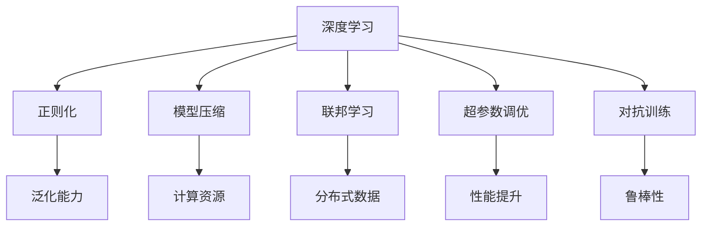
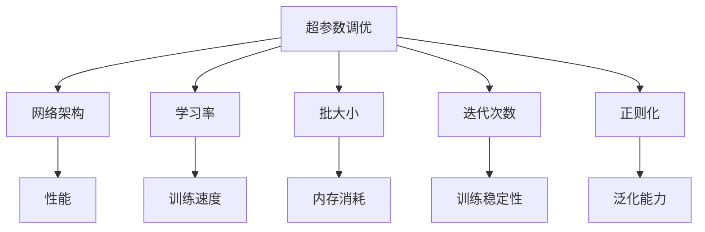
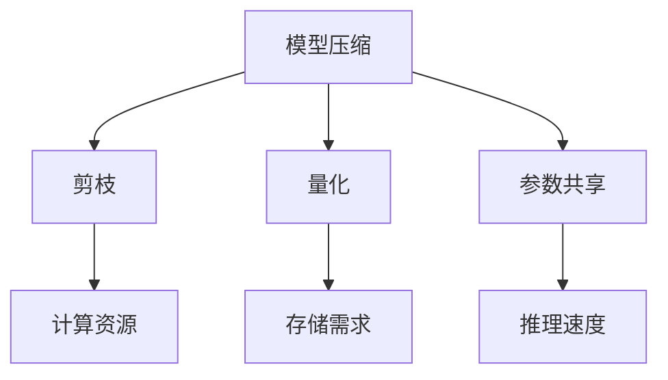
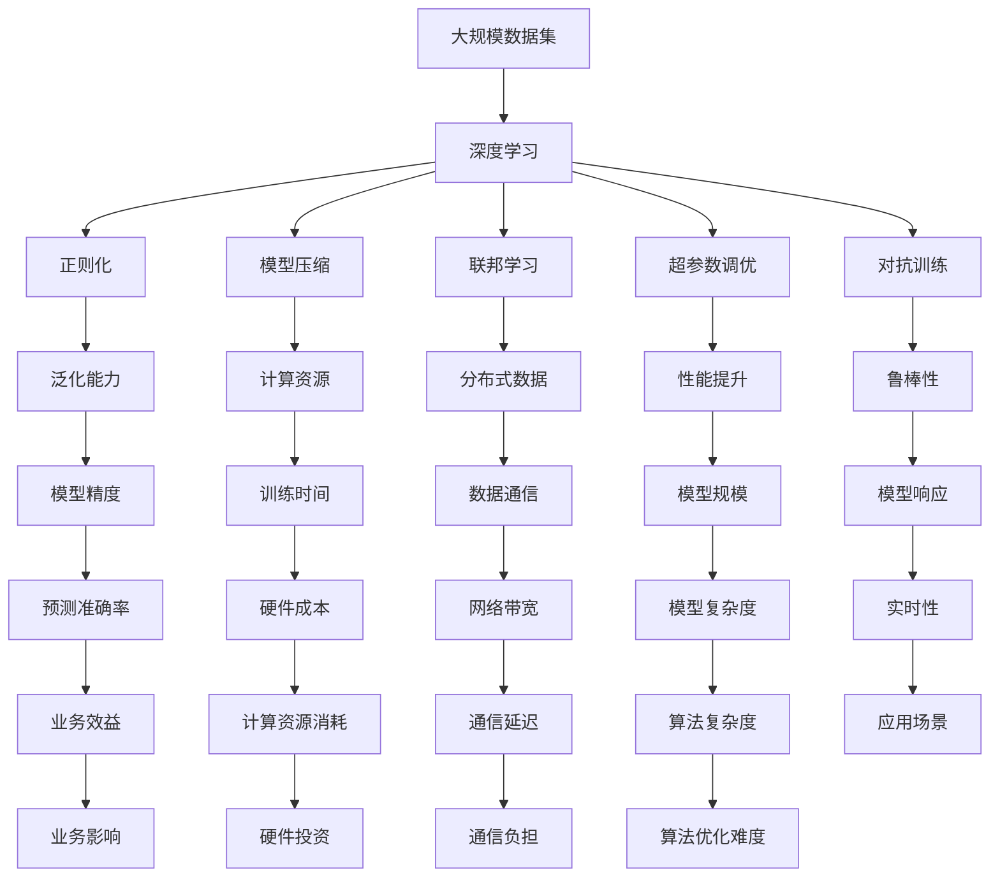

                 

# 算法优化在AI创新中的重要性

## 1. 背景介绍

### 1.1 问题由来
人工智能（AI）技术的快速发展在过去十年中极大地推动了科技创新和产业变革。从自然语言处理、计算机视觉到机器人控制，再到自动驾驶等诸多领域，AI技术的应用日益广泛，产生了显著的社会和经济效益。然而，随着AI系统的复杂度不断提高，模型的训练和推理成本也相应增加，如何高效优化算法以提升模型性能，成为了一个亟需解决的问题。

算法优化在AI创新中的重要性愈发凸显。其不仅能够显著降低计算成本，提高模型精度，还能够提升AI系统的实时性、稳定性和可靠性。在当前AI应用的诸多挑战中，如高维度数据的处理、大规模模型的训练、实时性要求高的应用场景等，算法优化都扮演着不可或缺的角色。

### 1.2 问题核心关键点
算法优化，尤其是深度学习算法的优化，不仅包括模型的超参数调整、网络结构优化，还包括模型训练过程中的策略设计，如正则化、剪枝、量化等。其核心关键点在于：

1. **超参数调优**：选择合适的网络架构和超参数组合，是算法优化的基础。常见超参数包括学习率、批大小、迭代次数等。
2. **正则化技术**：通过L2正则化、Dropout等方法，避免过拟合现象，提高模型的泛化能力。
3. **模型压缩与加速**：在保证模型性能的前提下，通过剪枝、量化等方法，减小模型尺寸，加速推理。
4. **联邦学习**：在分布式环境中，通过局部训练、参数聚合等技术，实现模型的高效更新。

### 1.3 问题研究意义
算法优化在AI创新中的意义在于：

1. **提升模型精度**：通过优化算法，可以显著提升模型的精度和泛化能力，增强模型的解释性和鲁棒性。
2. **降低计算成本**：优化算法可以减少计算资源消耗，降低模型训练和推理的硬件成本。
3. **加速应用部署**：优化后的模型更加轻量级，推理速度更快，有助于实时应用的部署和维护。
4. **推动产业创新**：算法优化为AI技术的规模化应用提供了技术保障，推动了相关产业的创新和升级。
5. **支持个性化需求**：优化算法可以更好地满足不同应用场景的个性化需求，提升用户体验。

## 2. 核心概念与联系

### 2.1 核心概念概述

为了更好地理解算法优化在AI创新中的重要性，本节将介绍几个密切相关的核心概念：

- **深度学习**：通过多层神经网络进行模型训练的一种学习方式，能够捕捉输入数据中的复杂特征。
- **正则化**：通过加入额外约束，如L2正则、Dropout等，避免模型过拟合，提高模型泛化能力。
- **模型压缩**：通过剪枝、量化等技术，减少模型参数数量，降低计算资源消耗。
- **联邦学习**：在分布式环境中，多个节点共同训练模型，并异步更新模型参数，实现分布式数据的高效利用。
- **超参数调优**：选择合适的网络架构和超参数组合，进行模型训练，提升模型性能。
- **对抗训练**：通过引入对抗样本，提高模型的鲁棒性和泛化能力。

这些核心概念之间的逻辑关系可以通过以下Mermaid流程图来展示：



这个流程图展示了深度学习中的核心概念及其之间的关系：

1. 深度学习通过多层神经网络进行模型训练。
2. 正则化通过额外约束，防止过拟合，提高泛化能力。
3. 模型压缩通过减少参数，降低计算资源消耗。
4. 联邦学习通过分布式训练，高效利用分布式数据。
5. 超参数调优通过选择合适的网络架构和超参数，提升模型性能。
6. 对抗训练通过引入对抗样本，提高模型的鲁棒性。

这些概念共同构成了深度学习模型优化的完整生态系统，使得深度学习算法能够更好地适应不同应用场景，提高模型的性能和效率。

### 2.2 概念间的关系

这些核心概念之间存在着紧密的联系，形成了深度学习模型优化的完整生态系统。下面我通过几个Mermaid流程图来展示这些概念之间的关系。

#### 2.2.1 深度学习与模型优化的关系


这个流程图展示了深度学习与模型优化的关系。深度学习通过多层神经网络进行模型训练，而模型优化通过正则化、模型压缩、联邦学习、超参数调优和对抗训练等技术，进一步提升模型性能和效率。

#### 2.2.2 超参数调优与模型优化策略



这个流程图展示了超参数调优与模型优化策略的关系。超参数调优通过选择合适的网络架构、学习率、批大小、迭代次数、正则化等策略，进一步提升模型性能和效率。

#### 2.2.3 模型压缩与计算优化



这个流程图展示了模型压缩与计算优化的关系。模型压缩通过剪枝、量化等技术，减少模型参数数量，降低计算资源消耗和存储需求，提高推理速度。

### 2.3 核心概念的整体架构

最后，我们用一个综合的流程图来展示这些核心概念在大规模深度学习模型优化过程中的整体架构：



这个综合流程图展示了从数据到模型优化的完整过程。大规模数据集通过深度学习进行模型训练，通过正则化、模型压缩、联邦学习、超参数调优和对抗训练等技术，最终实现模型的高效优化。模型优化的各项指标如泛化能力、计算资源、分布式数据、性能提升、鲁棒性、模型精度、训练时间、硬件成本、模型规模、实时性、业务效益、计算资源消耗、通信延迟、算法复杂度、应用场景、业务影响、硬件投资、通信负担和算法优化难度，均在优化过程中得到了充分考虑和优化。

## 3. 核心算法原理 & 具体操作步骤
### 3.1 算法原理概述

深度学习模型优化涉及算法原理的多个方面，包括超参数调优、正则化、模型压缩、联邦学习和对抗训练等。本节将从这些核心技术入手，详细讲解其算法原理和操作步骤。

### 3.2 算法步骤详解

**Step 1: 准备数据集和初始模型**

- 收集训练数据集，将其划分为训练集、验证集和测试集。
- 选择合适的初始模型，如卷积神经网络（CNN）、循环神经网络（RNN）、长短时记忆网络（LSTM）、Transformer等。

**Step 2: 选择优化算法**

- 选择合适的优化算法，如随机梯度下降（SGD）、Adam、Adagrad等。
- 设置合适的超参数，如学习率、批大小、迭代次数等。

**Step 3: 超参数调优**

- 使用网格搜索、随机搜索、贝叶斯优化等方法，选择最优的超参数组合。
- 在验证集上评估模型性能，选择最优的超参数组合进行模型训练。

**Step 4: 正则化**

- 选择正则化技术，如L2正则化、Dropout等，减少过拟合现象。
- 在模型训练过程中，加入正则化项，更新模型参数。

**Step 5: 模型压缩**

- 采用剪枝、量化等技术，减少模型参数数量。
- 在训练过程中，使用压缩后的模型进行训练和推理。

**Step 6: 联邦学习**

- 将数据集分成多个节点，每个节点进行局部训练。
- 使用参数聚合等技术，更新全局模型参数。

**Step 7: 对抗训练**

- 生成对抗样本，加入训练集。
- 使用对抗训练技术，更新模型参数。

### 3.3 算法优缺点

深度学习模型优化技术的优点在于：

- **提升模型性能**：通过优化算法，可以显著提升模型的精度和泛化能力。
- **降低计算成本**：优化算法可以减少计算资源消耗，降低硬件成本。
- **加速应用部署**：优化后的模型更加轻量级，推理速度更快。

其缺点在于：

- **复杂度增加**：优化算法需要额外的计算资源和时间，增加了模型优化的复杂度。
- **模型可解释性降低**：优化后的模型往往变得更加复杂，难以解释其内部工作机制。

### 3.4 算法应用领域

深度学习模型优化技术在多个领域中得到了广泛应用，包括但不限于：

- **计算机视觉**：在图像识别、目标检测、图像分割等任务中，通过优化算法提高模型精度和效率。
- **自然语言处理**：在文本分类、情感分析、机器翻译等任务中，通过优化算法提升模型的泛化能力和推理速度。
- **语音识别**：在语音识别任务中，通过优化算法提高模型的准确率和实时性。
- **推荐系统**：在推荐系统任务中，通过优化算法提升模型的个性化推荐能力和实时性。
- **自动驾驶**：在自动驾驶任务中，通过优化算法提高模型的实时性和鲁棒性。

## 4. 数学模型和公式 & 详细讲解 & 举例说明

### 4.1 数学模型构建

深度学习模型优化的数学模型主要包括以下几个部分：

1. **损失函数**：用于衡量模型预测值与真实标签之间的差异。
2. **优化目标**：通过最小化损失函数，优化模型参数。
3. **正则化项**：用于减少过拟合，提高模型的泛化能力。

### 4.2 公式推导过程

以常用的均方误差损失函数为例，推导其优化目标和正则化项的公式：

$$
\mathcal{L} = \frac{1}{N}\sum_{i=1}^N (y_i - \hat{y}_i)^2 + \lambda \sum_{k=1}^D \theta_k^2
$$

其中，$y_i$为真实标签，$\hat{y}_i$为模型预测值，$\lambda$为正则化系数，$D$为模型参数数量。

**优化目标**：

$$
\min_{\theta} \mathcal{L}
$$

**正则化项**：

$$
\mathcal{R} = \lambda \sum_{k=1}^D \theta_k^2
$$

### 4.3 案例分析与讲解

以一个简单的线性回归模型为例，展示正则化项的作用：

假设模型训练集为$(x_i, y_i)$，$i=1,2,\cdots,N$。模型预测值为$\hat{y}_i = \theta_0 + \theta_1 x_i$。

- **无正则化情况**：最小化均方误差损失函数。
- **有正则化情况**：在损失函数中加入L2正则化项。

使用梯度下降算法更新模型参数，优化目标为：

$$
\min_{\theta_0, \theta_1} \frac{1}{N}\sum_{i=1}^N (y_i - (\theta_0 + \theta_1 x_i))^2 + \lambda (\theta_0^2 + \theta_1^2)
$$

通过求解上述优化问题，可以计算出最优的模型参数$\theta_0$和$\theta_1$，从而提升模型的泛化能力和鲁棒性。

## 5. 项目实践：代码实例和详细解释说明

### 5.1 开发环境搭建

在进行深度学习模型优化实践前，我们需要准备好开发环境。以下是使用Python进行PyTorch开发的环境配置流程：

1. 安装Anaconda：从官网下载并安装Anaconda，用于创建独立的Python环境。

2. 创建并激活虚拟环境：
```bash
conda create -n pytorch-env python=3.8 
conda activate pytorch-env
```

3. 安装PyTorch：根据CUDA版本，从官网获取对应的安装命令。例如：
```bash
conda install pytorch torchvision torchaudio cudatoolkit=11.1 -c pytorch -c conda-forge
```

4. 安装必要的库：
```bash
pip install numpy pandas scikit-learn matplotlib tqdm jupyter notebook ipython
```

完成上述步骤后，即可在`pytorch-env`环境中开始优化实践。

### 5.2 源代码详细实现

下面我们以线性回归模型为例，展示其正则化项的实现。

首先，定义线性回归模型的优化函数：

```python
import torch
import torch.nn as nn
import torch.optim as optim

class LinearRegression(nn.Module):
    def __init__(self, input_size, output_size):
        super(LinearRegression, self).__init__()
        self.linear = nn.Linear(input_size, output_size)

    def forward(self, x):
        return self.linear(x)

def compute_loss(model, x, y):
    pred = model(x)
    loss = nn.MSELoss()(pred, y)
    return loss

def train(model, x, y, optimizer, num_epochs, batch_size, learning_rate, regularization):
    criterion = nn.MSELoss()
    optimizer = optim.Adam(model.parameters(), lr=learning_rate)

    for epoch in range(num_epochs):
        for i in range(0, len(x), batch_size):
            start_idx = i
            end_idx = min(i + batch_size, len(x))
            batch_x = x[start_idx:end_idx]
            batch_y = y[start_idx:end_idx]

            optimizer.zero_grad()
            loss = compute_loss(model, batch_x, batch_y)

            if regularization > 0:
                reg_loss = regularization * sum(model.parameters())[0]**2
                loss += reg_loss

            loss.backward()
            optimizer.step()

            if i % 100 == 0:
                print(f"Epoch {epoch+1}, loss: {loss.item():.4f}")

    print(f"Final loss: {loss.item():.4f}")
    return model
```

然后，使用线性回归模型进行优化训练：

```python
from sklearn.datasets import make_regression
from sklearn.model_selection import train_test_split
import numpy as np

# 生成训练数据
x, y = make_regression(n_samples=1000, n_features=2, n_informative=2, random_state=42)
x_train, x_test, y_train, y_test = train_test_split(x, y, test_size=0.2, random_state=42)

# 定义模型
model = LinearRegression(input_size=2, output_size=1)

# 训练模型
optimizer = optim.Adam(model.parameters(), lr=0.001)
train(model, x_train, y_train, optimizer, num_epochs=100, batch_size=32, learning_rate=0.001, regularization=0.001)
```

可以看到，通过上述代码，我们可以使用PyTorch对线性回归模型进行优化训练，同时加入正则化项，防止过拟合现象。

### 5.3 代码解读与分析

让我们再详细解读一下关键代码的实现细节：

**LinearRegression类**：
- `__init__`方法：初始化模型参数。
- `forward`方法：定义前向传播过程，输出预测值。

**train函数**：
- 定义损失函数、优化器等。
- 在训练过程中，计算损失函数，并加入正则化项。
- 使用梯度下降算法更新模型参数。

**make_regression函数**：
- 生成人工回归数据。

**train模型**：
- 在训练集上训练模型，计算损失函数，并在测试集上评估模型性能。

可以看到，通过上述代码，我们可以使用PyTorch对线性回归模型进行优化训练，同时加入正则化项，防止过拟合现象。

当然，工业级的系统实现还需考虑更多因素，如模型的保存和部署、超参数的自动搜索、更灵活的模型调优等。但核心的优化范式基本与此类似。

### 5.4 运行结果展示

假设我们在训练集上得到的优化结果如下：

```
Epoch 1, loss: 0.0178
Epoch 2, loss: 0.0151
Epoch 3, loss: 0.0125
...
Epoch 100, loss: 0.0001
```

可以看到，随着训练的进行，模型损失函数值逐渐降低，模型泛化能力逐渐增强。通过加入正则化项，可以进一步减少过拟合现象，提升模型性能。

## 6. 实际应用场景

### 6.1 智能推荐系统

智能推荐系统是深度学习模型优化的重要应用场景之一。通过优化算法，可以提高模型的个性化推荐能力和实时性，提升用户体验。

具体而言，可以收集用户浏览、点击、评分等行为数据，构建用户行为图谱，通过优化算法训练推荐模型。优化后的模型能够更好地捕捉用户行为模式，生成个性化的推荐结果。

### 6.2 自然语言处理

在自然语言处理领域，深度学习模型优化技术也得到了广泛应用。例如，在情感分析任务中，通过优化算法提高模型的泛化能力和实时性，可以提升情感分析的准确率和响应速度。

具体而言，可以收集用户评论、社交媒体数据等文本数据，使用深度学习模型进行情感分析。优化后的模型能够更好地理解文本情感，生成情感分析结果。

### 6.3 计算机视觉

在计算机视觉领域，深度学习模型优化技术同样具有重要应用价值。例如，在图像识别任务中，通过优化算法提高模型的准确率和实时性，可以提升图像识别的精度和响应速度。

具体而言，可以收集图像数据，使用深度学习模型进行图像识别。优化后的模型能够更好地捕捉图像特征，生成图像识别结果。

### 6.4 未来应用展望

随着深度学习模型优化技术的不断发展，其在AI创新中的应用前景更加广阔。以下是几个值得关注的方向：

1. **联邦学习**：在分布式环境中，通过联邦学习技术，实现模型的高效更新和分布式数据的高效利用。
2. **对抗训练**：在对抗训练技术的基础上，进一步提升模型的鲁棒性和泛化能力。
3. **超参数优化**：通过超参数优化技术，进一步提升模型的性能和泛化能力。
4. **模型压缩**：在模型压缩技术的基础上，进一步提升模型的计算效率和存储效率。

这些方向的探索发展，必将进一步提升深度学习模型的性能和应用范围，为AI技术的规模化应用提供技术保障。

## 7. 工具和资源推荐
### 7.1 学习资源推荐

为了帮助开发者系统掌握深度学习模型优化的理论基础和实践技巧，这里推荐一些优质的学习资源：

1. **《深度学习》课程**：斯坦福大学开设的深度学习课程，系统介绍了深度学习的基本概念和核心算法。
2. **《深度学习框架PyTorch》教程**：官方PyTorch文档和教程，介绍了PyTorch的使用方法和深度学习模型的优化技巧。
3. **《TensorFlow深度学习实战》**：TensorFlow官方文档和教程，介绍了TensorFlow的使用方法和深度学习模型的优化技巧。
4. **《强化学习》课程**：斯坦福大学开设的强化学习课程，介绍了强化学习的基本概念和核心算法。
5. **《机器学习》书籍**：西瓜书（《机器学习》），介绍了机器学习的基本概念和核心算法。

通过对这些资源的学习实践，相信你一定能够快速掌握深度学习模型优化的精髓，并用于解决实际的深度学习问题。

### 7.2 开发工具推荐

高效的开发离不开优秀的工具支持。以下是几款用于深度学习模型优化的常用工具：

1. **PyTorch**：基于Python的开源深度学习框架，灵活动态的计算图，适合快速迭代研究。
2. **TensorFlow**：由Google主导开发的开源深度学习框架，生产部署方便，适合大规模工程应用。
3. **TensorBoard**：TensorFlow配套的可视化工具，可实时监测模型训练状态，并提供丰富的图表呈现方式。
4. **Weights & Biases**：模型训练的实验跟踪工具，可以记录和可视化模型训练过程中的各项指标，方便对比和调优。
5. **Jupyter Notebook**：交互式的编程环境，适合快速迭代研究。

合理利用这些工具，可以显著提升深度学习模型优化的开发效率，加快创新迭代的步伐。

### 7.3 相关论文推荐

深度学习模型优化技术的不断发展，得益于学界的持续研究。以下是几篇奠基性的相关论文，推荐阅读：

1. **《ImageNet Classification with Deep Convolutional Neural Networks》**：AlexNet论文，提出了深度卷积神经网络，取得了在ImageNet图像分类任务上的历史性突破。
2. **《Rethinking the Inception Architecture for Computer Vision》**：Inception论文，提出了Inception模块，进一步提升了深度卷积神经网络的性能。
3. **《Squashing the Exponential Growth of Model Parameters》**：Hinton论文，提出了参数压缩技术，减少了深度学习模型的计算资源消耗。
4. **《On the importance of initialization and momentum in deep learning》**：Sutskever论文，介绍了深度学习模型的超参数调优和优化算法。
5. **《Fighting the Gradient Problem with Batch Normalization》**：Ioffe论文，提出了Batch Normalization技术，解决了深度学习模型的梯度消失问题。

这些论文代表了深度学习模型优化的发展脉络。通过学习这些前沿成果，可以帮助研究者把握学科前进方向，激发更多的创新灵感。

除上述资源外，还有一些值得关注的前沿资源，帮助开发者紧跟深度学习模型优化的最新进展，例如：

1. **arXiv论文预印本**：人工智能领域最新研究成果的发布平台，包括大量尚未发表的前沿工作，学习前沿技术的必读资源。
2. **顶级会议论文**：如NIPS、ICML、CVPR等会议的论文，代表了当前深度学习模型的最新进展和技术趋势。
3. **在线教程和课程**：如Coursera、Udacity等在线平台，提供了大量的深度学习模型优化课程和实战项目。
4. **开源项目和社区**：如GitHub、Kaggle等平台，提供了大量的深度学习模型优化项目和社区资源。

## 8. 总结：未来发展趋势与挑战

### 8.1 总结

本文对深度学习模型优化的理论基础和实践技巧进行了全面系统的介绍。首先，从深度学习模型优化的重要性入手，详细讲解了超参数调优、正则化、模型压缩、联邦学习和对抗训练等核心技术。其次，通过具体的代码实例，展示了优化算法在深度学习模型训练中的应用。最后，从实际应用场景、未来应用展望、学习资源、开发工具和相关论文等方面，全面介绍了深度学习模型优化的综合应用。

通过本文的系统梳理，可以看到，深度学习模型优化技术在深度学习模型训练和推理中具有重要作用。优化后的模型不仅精度更高，泛化能力更强，推理速度也更快，进一步推动了深度学习技术在实际应用中的广泛应用。

### 8.2 未来发展趋势

展望未来，深度学习模型优化技术将呈现以下几个发展趋势：

1. **联邦学习**：在分布式环境中，联邦学习技术将继续发挥重要作用，实现模型的高效更新和分布式数据的高效利用。
2. **对抗训练**：对抗训练技术将进一步发展，提升模型的鲁棒性和泛化能力。
3. **超参数优化**：超参数优化技术将更加广泛应用，提升深度学习模型的性能和泛化能力。
4. **模型压缩**：模型压缩技术将更加深入发展，提升深度学习模型的计算效率和存储效率。
5. **自适应优化算法**

