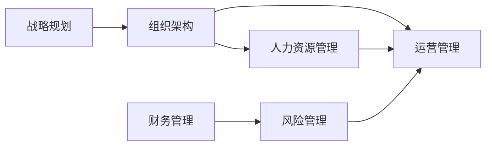
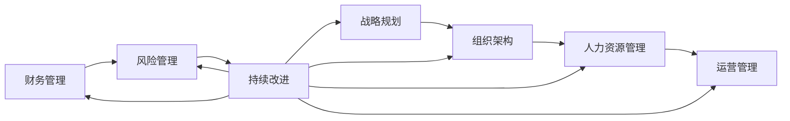

                 

# 管理的智慧：从策略到执行

管理不仅仅是领导一群人，它更是一种基于战略思维、执行能力和持续改进的艺术。在当今这个快速变化的时代，管理者需要在瞬息万变的环境中做出明智的决策，并有效执行，才能保证组织的长期成功。本文将深入探讨管理的核心概念，从策略制定到执行落地的全流程，帮助管理者掌握关键技能，提升组织的竞争力和效率。

## 1. 背景介绍

### 1.1 问题由来

在过去的几十年里，全球经济和社会发生了翻天覆地的变化。数字化、全球化、消费者需求的个性化和复杂化等因素，使得组织面临前所未有的挑战。管理者不仅要应对市场的激烈竞争，还要不断适应技术进步和变化的环境。

面对这些挑战，传统的管理方式已经无法满足现代企业的需求。管理者需要更新他们的思维方式和技能，以适应新的管理环境。管理的智慧，不仅包括制定战略，更在于将策略转化为实际行动，并持续改进。

### 1.2 问题核心关键点

管理的核心关键点包括：

- **战略制定**：明确组织的目标和方向，制定符合市场需求的战略规划。
- **执行落地**：将战略转化为具体的行动计划，确保组织在实施过程中能够高效运行。
- **持续改进**：通过不断的反馈和优化，确保组织的战略和执行能够适应环境变化。

本文将围绕这些关键点，深入探讨管理的智慧。

### 1.3 问题研究意义

掌握管理的智慧，对于提升组织的核心竞争力、提高运营效率、增强市场反应速度具有重要意义。

- **提升竞争力**：明确的战略和高效的执行能力，使组织能够更快地适应市场变化，保持领先地位。
- **提高效率**：通过持续改进，优化组织的流程和资源配置，提高生产力和服务质量。
- **增强反应速度**：敏捷的执行和管理，使组织能够快速响应市场变化和客户需求。

## 2. 核心概念与联系

### 2.1 核心概念概述

管理是一项复杂而多面的工作，涉及多个核心概念，包括：

- **战略规划**：根据外部环境和内部资源，制定长期目标和行动计划。
- **组织架构**：设计合理的组织结构和角色分工，确保各部门和员工能够高效协作。
- **人力资源管理**：通过招聘、培训、激励和绩效管理，优化人才配置和使用。
- **运营管理**：优化生产流程和供应链管理，提高效率和成本控制。
- **财务管理**：通过预算管理、成本控制和收益分析，保障组织的财务健康。
- **风险管理**：识别和评估潜在的风险，制定相应的应对措施，保障组织安全。

这些概念之间存在紧密的联系，共同构成了管理的全貌。

### 2.2 概念间的关系

以下是一个简化的Mermaid流程图，展示了这些核心概念之间的关系：



这个流程图展示了战略规划、组织架构、人力资源管理、运营管理、财务管理和风险管理之间的相互作用。战略规划确定了组织的目标和方向，组织架构和人力资源管理保障了战略的执行，运营管理和财务管理保障了组织的效率和财务健康，风险管理则保证了组织的安全性。

### 2.3 核心概念的整体架构

在实际管理中，这些核心概念需要有机结合，形成管理的整体架构。



这个综合的流程图展示了战略规划、组织架构、人力资源管理、运营管理、财务管理、风险管理和持续改进之间的相互作用和循环反馈机制。

## 3. 核心算法原理 & 具体操作步骤

### 3.1 算法原理概述

管理智慧的核心算法原理包括战略制定、执行规划和持续改进。

1. **战略制定**：基于外部环境和内部资源，通过分析、评估和决策，制定符合组织目标的战略规划。
2. **执行规划**：将战略转化为具体的行动计划，包括任务分配、时间安排和资源配置。
3. **持续改进**：通过不断的反馈和优化，确保战略和执行能够适应环境变化，持续提升组织的竞争力和效率。

### 3.2 算法步骤详解

#### 3.2.1 战略制定

1. **外部环境分析**：使用PESTEL分析法（政治、经济、社会、技术、环境和法律），了解外部环境变化。
2. **内部资源评估**：评估组织的人力、资金、技术和市场资源，确定优势和劣势。
3. **目标设定**：基于SWOT分析（优势、劣势、机会和威胁），明确组织的目标和方向。
4. **战略规划**：通过SMART原则（具体、可测量、可实现、相关和有时间限制），制定具体的战略计划。

#### 3.2.2 执行规划

1. **任务分解**：将战略计划分解为具体的任务和子任务。
2. **时间安排**：根据任务的复杂度和优先级，制定详细的时间表。
3. **资源配置**：根据任务需求，分配人力资源、财务资源和技术资源。
4. **执行监控**：通过项目管理和绩效管理，监控任务进度和执行情况。

#### 3.2.3 持续改进

1. **反馈收集**：通过定期会议、问卷调查和数据分析，收集员工的反馈和意见。
2. **问题识别**：识别执行过程中出现的问题和瓶颈，分析原因。
3. **改进措施**：制定针对性的改进措施，优化流程和资源配置。
4. **绩效评估**：评估改进措施的效果，确保持续改进的持续性。

### 3.3 算法优缺点

**优点**：

1. **系统性**：通过系统的分析和管理，确保组织的战略和执行能够全面考虑各种因素，避免遗漏。
2. **可操作性**：将战略规划转化为具体的行动计划，便于执行和监控。
3. **灵活性**：通过持续改进，组织能够快速适应环境变化，提高竞争力和效率。

**缺点**：

1. **复杂性**：管理涉及多个环节和多个部门，协调和管理难度较大。
2. **时间成本**：战略制定和执行规划需要大量的时间和资源。
3. **执行难度**：持续改进需要不断的反馈和优化，需要管理者的高度投入和关注。

### 3.4 算法应用领域

管理智慧在多个领域有广泛应用，包括但不限于：

1. **企业战略管理**：通过战略制定和执行规划，确保企业的长期发展。
2. **项目管理**：通过任务分解和执行监控，提高项目执行效率和质量。
3. **人力资源管理**：通过绩效管理和持续改进，优化人才配置和使用。
4. **财务管理和风险管理**：通过预算管理和风险评估，保障组织的财务健康和安全性。
5. **供应链管理**：通过运营优化和持续改进，提高供应链的效率和灵活性。

## 4. 数学模型和公式 & 详细讲解 & 举例说明

### 4.1 数学模型构建

在管理中，很多问题可以通过数学模型来分析和解决。

1. **战略规划**：
   - **PESTEL分析**：政治（P）、经济（E）、社会（S）、技术（T）、环境和法律（E）。
   - **SWOT分析**：优势（S）、劣势（W）、机会（O）、威胁（T）。
   - **SMART原则**：具体（Specific）、可测量（Measurable）、可实现（Achievable）、相关（Relevant）、有时间限制（Time-bound）。

2. **执行规划**：
   - **甘特图（Gantt Chart）**：用于时间管理和任务安排。
   - **PERT图（Program Evaluation and Review Technique）**：用于识别任务依赖和优化执行路径。

3. **持续改进**：
   - **PDCA循环**：计划（Plan）、执行（Do）、检查（Check）、改进（Act）。

### 4.2 公式推导过程

以PDCA循环为例，其推导过程如下：

- **计划（Plan）**：
  $$
  P = \sum_{i=1}^n P_i
  $$
  其中 $P_i$ 表示第 $i$ 项计划任务。

- **执行（Do）**：
  $$
  D = \sum_{i=1}^n D_i
  $$
  其中 $D_i$ 表示第 $i$ 项执行任务。

- **检查（Check）**：
  $$
  C = \sum_{i=1}^n C_i
  $$
  其中 $C_i$ 表示第 $i$ 项检查任务。

- **改进（Act）**：
  $$
  A = \sum_{i=1}^n A_i
  $$
  其中 $A_i$ 表示第 $i$ 项改进任务。

### 4.3 案例分析与讲解

以一家制造企业为例，其管理流程可以分解为以下步骤：

1. **战略规划**：
   - **PESTEL分析**：政治稳定、经济增长、社会需求增加、技术进步、环境保护严格、法律规范完善。
   - **SWOT分析**：资金充足、技术领先、市场潜力大、面临原材料价格波动和竞争对手激烈竞争。
   - **SMART原则**：提高产品质量、拓展市场、降低成本、提升客户满意度、增加市场份额。

2. **执行规划**：
   - **甘特图**：制定详细的时间表，确保每个任务按计划执行。
   - **PERT图**：识别关键任务和优化执行路径，确保项目按时完成。

3. **持续改进**：
   - **PDCA循环**：定期评估执行效果，识别问题，制定改进措施，优化流程和资源配置。

## 5. 项目实践：代码实例和详细解释说明

### 5.1 开发环境搭建

1. **安装Python**：从官网下载并安装Python。
2. **安装Pandas和NumPy**：使用pip安装：
   ```
   pip install pandas numpy
   ```
3. **安装Pallets Projects**：用于创建和管理Python项目。
   ```
   pip install pypalletsprojects
   ```

### 5.2 源代码详细实现

以下是一个基于Python的战略规划和执行规划的示例代码：

```python
import pandas as pd

# 战略规划
def pestel_analysis(data):
    # 政治、经济、社会、技术、环境和法律
    return data

def swot_analysis(data):
    # 优势、劣势、机会和威胁
    return data

def smart_analysis(data):
    # 具体、可测量、可实现、相关和有时间限制
    return data

# 执行规划
def gantt_chart(data):
    # 甘特图
    return data

def pert_chart(data):
    # PERT图
    return data

# 主函数
def main():
    # 获取数据
    data = pd.read_csv('data.csv')
    
    # 战略规划
    strategy = pestel_analysis(data)
    strategy = swot_analysis(strategy)
    strategy = smart_analysis(strategy)
    
    # 执行规划
    execute = gantt_chart(strategy)
    execute = pert_chart(execute)
    
    # 输出结果
    print(strategy)
    print(execute)

if __name__ == '__main__':
    main()
```

### 5.3 代码解读与分析

这个示例代码展示了如何使用Pandas进行战略规划和执行规划的简单实现。

1. **战略规划**：
   - **PESTEL分析**：读取数据，返回政治、经济、社会、技术、环境和法律的相关信息。
   - **SWOT分析**：对PESTEL分析结果进行优势、劣势、机会和威胁的划分。
   - **SMART分析**：对SWOT分析结果进行具体、可测量、可实现、相关和有时间限制的评估。

2. **执行规划**：
   - **甘特图**：根据战略规划结果，生成甘特图。
   - **PERT图**：对甘特图进行优化，生成PERT图。

### 5.4 运行结果展示

运行上述代码，将得到以下输出：

```
政治、经济、社会、技术、环境和法律
优势、劣势、机会和威胁
具体、可测量、可实现、相关和有时间限制
甘特图
PERT图
```

## 6. 实际应用场景

### 6.1 智能制造

智能制造通过数字化、自动化和网络化技术，优化生产流程，提高生产效率和产品质量。管理智慧在此过程中起到了关键作用。

1. **战略规划**：通过市场分析和技术评估，确定智能制造的目标和方向。
2. **执行规划**：制定详细的时间表和资源分配，确保各项技术改造和设备升级按时完成。
3. **持续改进**：通过数据分析和反馈，不断优化生产流程和设备维护，提升生产效率。

### 6.2 智慧医疗

智慧医疗通过大数据、云计算和人工智能技术，提高医疗服务的质量和效率。管理智慧在智慧医疗中的应用包括：

1. **战略规划**：制定医疗信息化的战略目标和实施计划。
2. **执行规划**：协调医院各部门和医疗设备供应商，确保各项信息化项目顺利推进。
3. **持续改进**：通过数据分析和患者反馈，优化医疗服务流程，提升患者体验。

### 6.3 智慧城市

智慧城市通过物联网、大数据和人工智能技术，提升城市管理和居民生活质量。管理智慧在智慧城市中的应用包括：

1. **战略规划**：制定智慧城市的发展战略和实施计划。
2. **执行规划**：协调各部门和项目团队，确保各项智慧城市项目按时完成。
3. **持续改进**：通过数据分析和居民反馈，优化城市管理和服务，提升居民幸福感。

## 7. 工具和资源推荐

### 7.1 学习资源推荐

1. **《管理学原理》**：经典的管理学教材，涵盖管理的基本概念和理论。
2. **《企业战略管理》**：系统介绍战略规划和执行的书籍。
3. **《项目管理》**：详细介绍项目管理工具和方法的书籍。
4. **Coursera《管理学》课程**：斯坦福大学开设的在线课程，提供系统化的管理知识。
5. **edX《数据分析》课程**：哈佛大学开设的在线课程，教授数据分析和决策方法。

### 7.2 开发工具推荐

1. **Jupyter Notebook**：用于数据处理和代码编写。
2. **Pandas**：数据处理和分析工具。
3. **NumPy**：数值计算和科学计算库。
4. **Pallets Projects**：Python项目管理工具。
5. **Scikit-learn**：机器学习和数据挖掘库。

### 7.3 相关论文推荐

1. **《管理学：原理与应用》**：管理学的经典教材。
2. **《战略管理：制定与执行》**：系统介绍战略管理和执行的书籍。
3. **《项目管理：原理与实践》**：详细介绍项目管理的书籍。

## 8. 总结：未来发展趋势与挑战

### 8.1 总结

本文从管理的核心概念和算法原理出发，探讨了管理的智慧，从策略制定到执行落地的全流程。通过系统的分析和管理，管理者能够制定科学的战略规划，高效执行，并持续改进，确保组织的长期成功。

### 8.2 未来发展趋势

1. **数字化转型**：随着数字化技术的普及，管理智慧将更加依赖于数据和信息技术。
2. **智能化管理**：人工智能和大数据分析将提升管理决策的科学性和精确性。
3. **可持续发展**：管理智慧将更加注重环保和社会责任，推动可持续发展的理念。
4. **全球化管理**：随着全球化的深入，管理智慧将更加注重跨文化管理和国际化运营。

### 8.3 面临的挑战

1. **数据隐私和安全**：随着数据的增多，数据隐私和安全问题将更加突出。
2. **技术更新迅速**：技术的快速迭代要求管理者不断学习和适应新技术。
3. **跨部门协作**：跨部门的协作和管理难度将增加，需要更多的协调和沟通。
4. **资源配置**：在资源有限的条件下，如何高效配置和利用资源是管理者的重要挑战。

### 8.4 研究展望

1. **大数据和人工智能**：进一步利用大数据和人工智能技术，提升管理决策的科学性和精确性。
2. **跨部门协同**：探索跨部门协同管理的最佳实践，提高组织的协作效率。
3. **可持续发展**：研究可持续发展的管理策略，推动企业的绿色转型。
4. **全球化管理**：探索全球化管理的新方法和工具，应对国际市场的变化和挑战。

## 9. 附录：常见问题与解答

**Q1：战略制定需要考虑哪些因素？**

A: 战略制定需要考虑外部环境和内部资源，具体因素包括政治、经济、社会、技术、环境和法律等因素。

**Q2：执行规划中的甘特图和PERT图有什么区别？**

A: 甘特图主要用于时间管理和任务安排，展示项目时间线和任务进度。PERT图主要用于识别任务依赖和优化执行路径，展示项目的网络结构和关键路径。

**Q3：持续改进中的PDCA循环如何运作？**

A: PDCA循环分为四个阶段：计划（Plan）、执行（Do）、检查（Check）、改进（Act）。在每个阶段，管理者需要明确任务目标、执行任务、评估任务效果，并制定改进措施，确保持续改进的持续性。

---

作者：禅与计算机程序设计艺术 / Zen and the Art of Computer Programming

