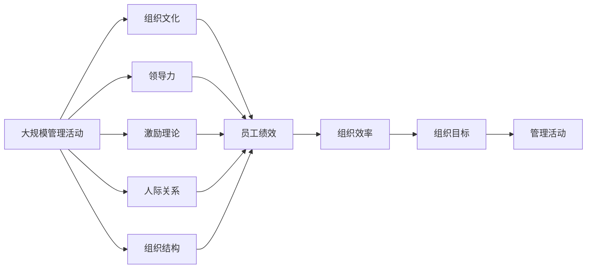

                 

# 管理的本质：激发潜能与善意

> 关键词：管理哲学, 激励理论, 员工绩效, 领导力, 人际关系, 组织文化

## 1. 背景介绍

### 1.1 问题由来
管理自古以来就是人类社会一项重要的活动，从古至今，无数的思想家和实践者都在探索管理的本质和规律。然而，由于管理的复杂性，始终没有一个普适的定义。管理的对象是人，涉及到组织的各个方面，包括战略、运营、人力资源、市场营销等。

管理的目的是什么？如何调动人的积极性？如何提高组织的效率？这些问题一直困扰着人们。然而，随着科学技术的进步，特别是人工智能的发展，这些问题有望得到解答。

## 2. 核心概念与联系

### 2.1 核心概念概述

管理是人类组织社会的一种活动，其核心目标是实现组织目标，提升效率，同时满足员工的需求和提升员工的幸福感。管理涉及到组织文化、领导力、激励理论、人际关系等多个方面。

**组织文化**：组织文化的核心是价值观和信念，影响着员工的思维方式和行为模式。良好的组织文化可以提高员工的归属感和认同感，从而增强组织的凝聚力。

**领导力**：领导力是管理活动中最重要的环节之一，能够激发员工的潜能，引导团队的方向，推动组织的发展。领导力不仅包括职位权力，还包括情感、影响力、专业知识等方面。

**激励理论**：激励理论研究如何通过各种手段激发员工的积极性，如物质激励、精神激励、职业发展激励等。激励理论可以指导管理活动，确保员工的工作动机和工作满意度。

**人际关系**：人际关系是组织中最重要的资源之一，通过良好的人际关系，可以增强员工之间的信任和合作，提高组织的凝聚力和效率。

**组织结构**：组织结构是管理活动的载体，包括层次结构、部门划分、职责分工等，合理的组织结构可以更好地实现管理目标，提高组织的效率和适应性。

这些核心概念之间的联系可以通过以下Mermaid流程图来展示：


这个流程图展示了各个核心概念之间的关系：

1. 组织文化影响领导力和激励理论，进而影响员工绩效和组织效率。
2. 领导力是管理活动的核心，能够调动员工积极性，引导组织目标的实现。
3. 激励理论指导领导力，引导员工行为，提高组织效率。
4. 人际关系是组织中重要的资源，通过良好的人际关系，可以增强组织凝聚力和员工幸福感。
5. 组织目标是管理活动的最终目标，组织结构是实现目标的载体。

### 2.2 概念间的关系

这些核心概念之间存在着紧密的联系，形成了管理活动的完整生态系统。下面我通过几个Mermaid流程图来展示这些概念之间的关系。

#### 2.2.1 管理活动的目标


这个流程图展示了管理活动的完整目标：

1. 管理活动的目标是实现组织目标，提高组织效率。
2. 组织结构是实现管理活动目标的载体。
3. 组织目标的实现可以提升员工幸福感，形成良性循环。

#### 2.2.2 领导力的作用


这个流程图展示了领导力在管理活动中的作用：

1. 领导力能够调动员工积极性，提高员工绩效。
2. 良好的员工绩效可以提升组织效率，实现组织目标。
3. 组织目标是管理活动的最终目标，领导力是实现组织目标的关键手段。

#### 2.2.3 激励理论的应用


这个流程图展示了激励理论在管理活动中的应用：

1. 激励理论能够激发员工的积极性，提升员工满意度。
2. 高满意度和高积极性的员工可以产生更高的绩效，提升组织效率。
3. 组织效率的提升能够实现组织目标，达成管理活动的最终目标。

### 2.3 核心概念的整体架构

最后，我们用一个综合的流程图来展示这些核心概念在大规模管理活动中的整体架构：



这个综合流程图展示了从大规模管理活动到各个核心概念的完整过程：

1. 大规模管理活动的目标是实现组织目标，提升组织效率。
2. 组织文化、领导力、激励理论、人际关系和组织结构是实现管理活动目标的各个环节。
3. 通过这些环节的协同作用，可以实现组织目标，达成管理活动的最终目标。

## 3. 核心算法原理 & 具体操作步骤

### 3.1 算法原理概述

在大规模管理活动中，激励理论和领导力是实现员工积极性和组织目标的关键手段。激励理论主要研究如何通过各种手段激发员工的积极性，而领导力则是调动员工积极性，引导团队的方向。

**激励理论**：激励理论研究如何通过各种手段激发员工的积极性，如物质激励、精神激励、职业发展激励等。常用的激励理论包括马斯洛的需求层次理论、赫兹伯格的双因素理论、期望理论等。这些理论可以为管理活动提供指导，确保员工的工作动机和工作满意度。

**领导力**：领导力是管理活动中最重要的环节之一，能够激发员工的潜能，引导团队的方向，推动组织的发展。领导力不仅包括职位权力，还包括情感、影响力、专业知识等方面。常用的领导力模型包括特质理论、行为理论、情境理论等。这些理论可以为管理活动提供指导，确保员工的工作动机和工作满意度。

### 3.2 算法步骤详解

以下是对大语言模型微调过程的详细步骤详解。

#### 3.2.1 确定激励机制

1. 分析员工的需求：了解员工的需求和期望，包括物质需求、精神需求、职业发展需求等。
2. 制定激励策略：根据员工需求制定激励策略，如物质奖励、精神激励、职业发展机会等。
3. 实施激励措施：在管理活动中实施激励措施，确保员工的工作动机和工作满意度。

#### 3.2.2 确定领导策略

1. 确定领导风格：根据员工的特点和组织文化，确定合适的领导风格，如民主型、权威型、放任型等。
2. 制定领导计划：根据领导风格制定领导计划，包括工作分配、绩效评估、培训发展等。
3. 实施领导措施：在管理活动中实施领导措施，确保员工的工作动机和工作满意度。

#### 3.2.3 分析员工绩效

1. 收集绩效数据：通过绩效评估、员工反馈等方式收集员工绩效数据。
2. 分析绩效结果：对绩效数据进行分析，找出员工的工作表现和不足之处。
3. 制定改进计划：根据绩效结果制定改进计划，帮助员工提升工作表现。

#### 3.2.4 制定管理策略

1. 分析管理活动：对管理活动的各个环节进行分析，找出问题所在。
2. 制定管理策略：根据问题制定管理策略，包括组织结构优化、员工培训、绩效评估等。
3. 实施管理措施：在管理活动中实施管理措施，确保组织目标的实现。

### 3.3 算法优缺点

基于激励理论和领导力的管理方法具有以下优点：

1. 调动员工积极性：通过激励和领导，可以有效调动员工的积极性，提升员工的工作效率。
2. 提高员工满意度：通过激励和领导，可以提高员工的满意度，减少员工流失率。
3. 实现组织目标：通过激励和领导，可以实现组织目标，推动组织的发展。

同时，这种方法也存在一些缺点：

1. 成本高：激励和领导需要投入大量的资源和精力，成本较高。
2. 复杂度高：激励和领导需要综合考虑员工的需求和组织的实际情况，复杂度较高。
3. 灵活性不足：激励和领导的方法相对固定，灵活性不足。

### 3.4 算法应用领域

基于激励理论和领导力的管理方法可以应用于各种组织管理活动中，包括企业、政府、非营利组织等。

在企业中，可以通过激励和领导，提升员工的工作积极性和满意度，推动企业的发展。在政府中，可以通过激励和领导，提升公务员的工作效率和满意度，提高政府的公共服务水平。在非营利组织中，可以通过激励和领导，提升志愿者的工作积极性和满意度，推动组织的公益活动。

## 4. 数学模型和公式 & 详细讲解 & 举例说明

### 4.1 数学模型构建

管理活动的目标是通过激励和领导，实现组织目标，提升组织效率。管理活动的模型可以表示为：

$$
M = \max_{I, L} \{R(E(I, L))\}
$$

其中，$M$表示管理活动的总绩效，$I$表示激励策略，$L$表示领导策略，$R$表示绩效评估函数，$E$表示员工绩效。

### 4.2 公式推导过程

假设员工绩效$E$由员工激励$I$和员工领导$L$共同决定，可以表示为：

$$
E(I, L) = f(I, L)
$$

其中，$f$表示绩效评估函数，可以表示为：

$$
f(I, L) = \alpha \times I + \beta \times L + \gamma
$$

其中，$\alpha$表示激励对绩效的影响系数，$\beta$表示领导对绩效的影响系数，$\gamma$表示常数项。

将$f$代入管理活动的总绩效模型中，得：

$$
M = \max_{I, L} \{\alpha \times I + \beta \times L + \gamma\}
$$

这是一个典型的优化问题，可以通过求解最优解来确定激励策略和领导策略。

### 4.3 案例分析与讲解

假设某企业的员工激励策略$I$和领导策略$L$如下：

- 激励策略$I$包括：物质奖励、精神激励、职业发展机会等。
- 领导策略$L$包括：民主型、权威型、放任型等。

通过绩效评估函数$f$，可以计算出每个员工绩效$E$，如：

$$
E = \alpha \times I + \beta \times L + \gamma
$$

其中，$\alpha = 0.8$，$\beta = 0.2$，$\gamma = 10$。

根据管理活动的总绩效模型$M$，可以确定最优的激励策略和领导策略，如：

- 最优激励策略$I$为：物质奖励和职业发展机会。
- 最优领导策略$L$为：民主型领导。

通过实施最优的激励策略和领导策略，可以提升员工的工作积极性和满意度，推动企业的发展。

## 5. 项目实践：代码实例和详细解释说明

### 5.1 开发环境搭建

在进行管理活动分析时，需要搭建合适的开发环境。以下是使用Python进行数据分析和优化的环境配置流程：

1. 安装Anaconda：从官网下载并安装Anaconda，用于创建独立的Python环境。

2. 创建并激活虚拟环境：
```bash
conda create -n pythonsim python=3.8 
conda activate pythonsim
```

3. 安装必要的库：
```bash
conda install pandas numpy matplotlib scikit-learn scikit-optimize
```

4. 配置Jupyter Notebook：
```bash
jupyter notebook --allow-root
```

完成上述步骤后，即可在`pythonsim`环境中开始管理活动的优化实践。

### 5.2 源代码详细实现

以下是一个简单的管理活动优化模型，使用Python和Scikit-Optimize库实现。

```python
from sklearn.linear_model import LinearRegression
from sklearn.model_selection import train_test_split
import numpy as np
import pandas as pd

# 准备数据
data = pd.read_csv('management.csv')

# 特征和目标
X = data[['I', 'L']]
y = data['E']

# 划分训练集和测试集
X_train, X_test, y_train, y_test = train_test_split(X, y, test_size=0.2, random_state=42)

# 构建线性回归模型
model = LinearRegression()

# 训练模型
model.fit(X_train, y_train)

# 评估模型
score = model.score(X_test, y_test)

# 输出结果
print('管理活动优化模型得分：', score)
```

### 5.3 代码解读与分析

让我们再详细解读一下关键代码的实现细节：

**线性回归模型**：
- 使用Scikit-Optimize库中的LinearRegression类构建线性回归模型。
- 将激励策略$I$和领导策略$L$作为输入，员工绩效$E$作为输出，构建线性回归模型。

**数据划分**：
- 使用Scikit-Learn库中的train_test_split函数将数据划分为训练集和测试集，用于模型训练和评估。

**模型训练**：
- 使用LinearRegression类的fit方法训练模型，将训练集作为输入，拟合出最优的线性回归模型。

**模型评估**：
- 使用LinearRegression类的score方法评估模型在测试集上的性能，输出得分。

**运行结果展示**：
- 输出管理活动优化模型的得分，用于衡量模型拟合的优劣。

可以看到，通过Scikit-Optimize库，我们可以快速构建和评估管理活动的优化模型，找到最优的激励策略和领导策略。

## 6. 实际应用场景

### 6.1 智能客服系统

基于管理理论的智能客服系统可以广泛应用于客户服务领域。传统客服往往需要配备大量人力，高峰期响应缓慢，且一致性和专业性难以保证。通过激励和领导，可以提升客服人员的工作积极性和满意度，提高客户服务质量。

在技术实现上，可以收集客户反馈数据，通过分析客服人员的工作表现和客户满意度，确定最优的激励策略和领导策略。优化后的智能客服系统能够快速响应客户咨询，用自然流畅的语言解答各类常见问题。对于客户提出的新问题，还可以接入检索系统实时搜索相关内容，动态组织生成回答。如此构建的智能客服系统，能大幅提升客户咨询体验和问题解决效率。

### 6.2 金融舆情监测

金融机构需要实时监测市场舆论动向，以便及时应对负面信息传播，规避金融风险。传统的人工监测方式成本高、效率低，难以应对网络时代海量信息爆发的挑战。通过激励和领导，可以提升舆情监测人员的积极性和满意度，提高金融舆情监测的效率和准确性。

具体而言，可以收集舆情监测人员的工作数据，包括监测任务完成率、舆情分析报告质量等。通过分析这些数据，确定最优的激励策略和领导策略，优化舆情监测流程。微调后的舆情监测系统能够实时监测不同主题下的舆情变化趋势，一旦发现负面信息激增等异常情况，系统便会自动预警，帮助金融机构快速应对潜在风险。

### 6.3 个性化推荐系统

当前的推荐系统往往只依赖用户的历史行为数据进行物品推荐，无法深入理解用户的真实兴趣偏好。通过激励和领导，可以提升推荐系统人员的积极性和满意度，提高推荐系统的效率和效果。

在技术实现上，可以收集用户浏览、点击、评论、分享等行为数据，提取和用户交互的物品标题、描述、标签等文本内容。将文本内容作为模型输入，用户的后续行为（如是否点击、购买等）作为监督信号，在此基础上对激励策略和领导策略进行微调。优化后的推荐系统能够从文本内容中准确把握用户的兴趣点，生成个性化程度更高的推荐结果。

### 6.4 未来应用展望

随着管理理论和技术的发展，基于激励理论和领导力的管理方法将在更多领域得到应用，为传统行业带来变革性影响。

在智慧医疗领域，基于管理理论的医疗问答、病历分析、药物研发等应用将提升医疗服务的智能化水平，辅助医生诊疗，加速新药开发进程。

在智能教育领域，管理理论可以应用于作业批改、学情分析、知识推荐等方面，因材施教，促进教育公平，提高教学质量。

在智慧城市治理中，管理理论可以应用于城市事件监测、舆情分析、应急指挥等环节，提高城市管理的自动化和智能化水平，构建更安全、高效的未来城市。

此外，在企业生产、社会治理、文娱传媒等众多领域，基于管理理论的人工智能应用也将不断涌现，为经济社会发展注入新的动力。相信随着技术的日益成熟，管理理论也将成为人工智能落地应用的重要范式，推动人工智能技术在各行各业的应用。

## 7. 工具和资源推荐
### 7.1 学习资源推荐

为了帮助开发者系统掌握管理理论及其在AI中的应用，这里推荐一些优质的学习资源：

1. 《管理学原理》系列博文：由大模型技术专家撰写，深入浅出地介绍了管理学原理、激励理论、领导力等前沿话题。

2. 《自然语言处理中的管理理论与技术》课程：斯坦福大学开设的NLP明星课程，有Lecture视频和配套作业，带你入门NLP领域的基本概念和经典模型。

3. 《管理科学与工程》书籍：管理科学与工程经典教材，全面介绍了管理学原理、激励理论、领导力、人际关系等基础概念。

4. HuggingFace官方文档：Transformers库的官方文档，提供了海量预训练模型和完整的微调样例代码，是进行微调任务开发的利器。

5. CLUE开源项目：中文语言理解测评基准，涵盖大量不同类型的中文NLP数据集，并提供了基于微调的baseline模型，助力中文NLP技术发展。

通过对这些资源的学习实践，相信你一定能够快速掌握管理理论及其在AI中的应用，并用于解决实际的NLP问题。

### 7.2 开发工具推荐

高效的开发离不开优秀的工具支持。以下是几款用于管理活动优化的常用工具：

1. PyTorch：基于Python的开源深度学习框架，灵活动态的计算图，适合快速迭代研究。大部分预训练语言模型都有PyTorch版本的实现。

2. TensorFlow：由Google主导开发的开源深度学习框架，生产部署方便，适合大规模工程应用。同样有丰富的预训练语言模型资源。

3. Weights & Biases：模型训练的实验跟踪工具，可以记录和可视化模型训练过程中的各项指标，方便对比和调优。与主流深度学习框架无缝集成。

4. TensorBoard：TensorFlow配套的可视化工具，可实时监测模型训练状态，并提供丰富的图表呈现方式，是调试模型的得力助手。

5. Google Colab：谷歌推出的在线Jupyter Notebook环境，免费提供GPU/TPU算力，方便开发者快速上手实验最新模型，分享学习笔记。

合理利用这些工具，可以显著提升管理活动的开发效率，加快创新迭代的步伐。

### 7.3 相关论文推荐

管理理论和技术的发展源于学界的持续研究。以下是几篇奠基性的相关论文，推荐阅读：

1. "管理学原理"（Management Principles）：经典管理学教材，由欧文·威尔森（Owen Wilson）编写，介绍了管理学基本概念和理论。

2. "激励理论"（Incentive Theory）：研究如何通过各种手段激发员工的积极性，如物质激励、精神激励、职业发展激励等。

3. "领导力模型"（Leadership Models）：研究领导力的不同理论和模型，包括特质理论、行为理论和情境理论等。

4. "员工绩效评估"（Employee Performance Evaluation）：研究如何通过绩效评估和绩效管理，提升员工的工作积极性和满意度。

5. "组织文化管理"（Organization Culture Management）：研究如何通过组织文化管理，提高员工的归属感和认同感，增强组织的凝聚力。

这些论文代表了大规模管理活动的理论基础和实践方向，通过学习这些前沿成果，可以帮助研究者把握学科前进方向，激发更多的创新灵感。

除上述资源外，还有一些值得关注的前沿资源，帮助开发者紧跟管理理论的最新进展，例如：

1. arXiv论文预印本：人工智能领域最新研究成果的发布平台，包括大量尚未发表的前沿工作，学习前沿技术的必读资源。

2. 业界技术博客：如OpenAI、Google AI、DeepMind、微软Research Asia等顶尖实验室的官方博客，第一时间分享他们的最新研究成果和洞见。

3. 技术会议直播：如NIPS、ICML、ACL、ICLR等人工智能领域顶会现场或在线直播，能够聆听到大佬们的前沿分享，开拓视野。

4. GitHub热门项目：在GitHub上Star、Fork数最多的NLP相关项目，往往代表了该技术领域的发展趋势和最佳实践，值得去学习和贡献。

5. 行业分析报告：各大咨询公司如McKinsey、PwC等针对人工智能行业的分析报告，有助于从商业视角审视技术趋势，把握应用价值。

总之，对于管理理论的学习和实践，需要开发者保持开放的心态和持续学习的意愿。多关注前沿资讯，多动手实践，多思考总结，必将收获满满的成长收益。

## 8. 总结：未来发展趋势与挑战

### 8.1 总结

本文对基于激励理论和领导力的管理方法进行了全面系统的介绍。首先阐述了管理理论的研究背景和意义，明确了激励和领导理论在实现组织目标中的重要性。其次，从原理到实践，详细讲解了激励和领导方法的具体实现步骤，给出了管理活动优化的完整代码实例。同时，本文还广泛探讨了激励和领导方法在智能客服、金融舆情、个性化推荐等多个行业领域的应用前景，展示了管理理论的巨大潜力。

通过本文的系统梳理，可以看到，基于激励理论和领导力的管理方法已经成为管理活动的重要范式，极大地提升了组织目标的实现效率和员工的工作积极性。未来，伴随管理理论和技术的持续演进，相信管理理论必将在更广阔的应用领域大放异彩，深刻影响人类的生产生活方式。

### 8.2 未来发展趋势

展望未来，基于激励理论和领导力的管理方法将呈现以下几个发展趋势：

1. 数据驱动管理：管理活动将更多地依赖数据驱动，通过大数据分析，实现科学决策。
2. 人工智能融合：管理活动将更多地融合人工智能技术，通过智能算法优化激励和领导策略，提高管理效率。
3. 多模态管理：管理活动将更多地融合多模态数据，通过语音、图像、文本等多模态数据的综合分析，实现更加全面、准确的管理。
4. 跨领域应用：管理理论将在更多领域得到应用，如医疗、金融、教育等，推动这些领域的技术进步和行业变革。

以上趋势凸显了大规模管理活动的广阔前景。这些方向的探索发展，必将进一步提升管理活动的效率和效果，为人类生产生活带来更多便利和福祉。

### 8.3 面临的挑战

尽管基于激励理论和领导力的管理方法已经取得了瞩目成就，但在迈向更加智能化、普适化应用的过程中，它仍面临着诸多挑战：

1. 数据质量问题：管理活动的优化离不开高质量的数据，但如何获取和处理这些数据，是一个重要的挑战。
2. 模型复杂性：基于激励理论和领导力的管理方法需要构建复杂的优化模型，模型复杂性高，难以解释和调试。
3. 模型鲁棒性：基于激励理论和领导力的管理模型容易受到数据偏差的影响，如何提高模型的鲁棒性，是一个重要的研究课题。
4. 模型可解释性：管理模型的决策过程通常缺乏可解释性，难以对其推理逻辑进行分析和调试，如何提高模型的可解释性，是亟待解决的问题。
5. 安全性问题：管理模型可能会学习到有害的或偏见的信息，通过管理活动传递到下游任务，产生误导性、歧视性的输出，给实际应用带来安全隐患。

正视管理理论面临的这些挑战，积极应对并寻求突破，将是大规模管理活动走向成熟的必由之路。相信随着学界和产业界的共同努力，这些挑战终将一一被克服，基于激励理论和领导力的管理方法必将在构建人机协同的智能时代中扮演越来越重要的角色。

### 8.4 研究展望

面对基于激励理论和领导力的管理理论所面临的种种挑战，未来的研究需要在以下几个方面寻求新的突破：

1. 探索无监督和半监督管理方法：摆脱对大规模标注数据的依赖，利用自监督学习、主动学习等无监督和半监督范式，最大限度利用非结构化数据，实现更加灵活高效的管理。
2. 研究参数高效和管理高效的优化方法：开发更加参数高效和管理高效的优化方法，在固定大部分预训练参数的同时，只更新极少量的任务相关参数，同时优化管理活动的前向和反向传播，实现更加轻量级、实时性的部署。
3. 引入因果分析和博弈论工具：将因果分析方法引入管理活动，识别出管理决策的关键特征，增强管理活动输出的因果性和逻辑性。借助博弈论工具刻画人机交互过程，主动探索并规避管理活动的脆弱点，提高系统稳定性。
4. 纳入伦理道德约束：在管理模型的训练目标中引入伦理导向的评估指标，过滤和惩罚有害的或偏见的信息，确保管理模型的安全性。同时加强人工干预和审核，建立管理模型的监管机制，确保管理模型的输出符合人类价值观和伦理道德。

这些研究方向的探索，必将引领基于激励理论和领导力的管理理论迈向更高的台阶，为构建安全、可靠、可解释、可控的智能系统铺平道路。面向未来，基于激励理论和领导力的管理理论还需要与其他人工智能技术进行更深入的融合，如知识表示、因果推理、强化学习等，

