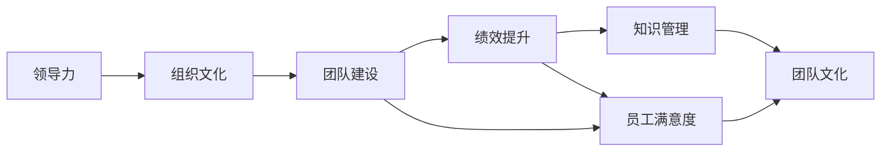

                 

# 管理艺术：激发团队潜力

> 关键词：管理艺术,团队管理,激发潜力,领导力,组织文化,绩效提升

## 1. 背景介绍

在现代企业的发展过程中，领导者和组织管理者面临着日益复杂的环境和挑战。如何在快速变化的商业环境中保持企业的竞争力，成为每个组织领导者必须面对的问题。本文聚焦于管理艺术在激发团队潜力方面的应用，旨在为企业管理者提供更具深度、全面和实用的指导。

## 2. 核心概念与联系

### 2.1 核心概念概述

为了更好地理解如何通过管理艺术激发团队潜力，本节将介绍几个关键的管理学概念：

- **领导力**：是指领导者影响和管理团队成员的能力，包括决策、激励、沟通、协调等。
- **组织文化**：指组织内部共同的行为准则和价值观，包括信任、合作、创新等。
- **团队建设**：指构建、维持和发展团队的过程，旨在增强团队成员的合作和效率。
- **绩效提升**：指通过优化团队结构、提升员工技能等手段，提高团队的整体产出和质量。
- **员工满意度**：指员工对工作的满意程度，包括薪酬、工作环境、发展机会等。
- **知识管理**：指组织对内部知识的收集、整理、共享和应用，提升团队的知识创新能力。

这些核心概念之间存在着紧密的联系。例如，良好的组织文化和有效的团队建设能够增强领导力，进而提升团队绩效和员工满意度。同时，绩效提升和知识管理也是激励团队的重要手段，进一步推动团队文化的形成。

### 2.2 概念间的关系

这些核心概念之间存在着复杂的相互作用关系，可以通过以下Mermaid流程图来展示：



这个流程图展示了一些核心概念之间的关系：

- 领导力通过塑造组织文化影响团队建设。
- 有效的团队建设能够提升绩效和员工满意度。
- 绩效提升和员工满意度又可促进团队文化的进一步增强。
- 知识管理通过提升团队的知识创新能力，也间接影响团队的整体表现。

这些概念通过相互影响和支持，共同构成了一个动态、协同的管理系统。

## 3. 核心算法原理 & 具体操作步骤

### 3.1 算法原理概述

管理艺术激发动态系统中的“潜能激发”，是一个涉及心理、行为、领导和组织等多个领域的复杂过程。基于这一原理，本文将详细讨论几种关键的管理艺术和具体操作步骤。

1. **领导力激励**：通过建立信任、设定清晰目标、给予适当奖励和反馈等手段，激发团队成员的内在动力。
2. **组织文化塑造**：通过共享愿景、营造正向氛围、建立奖励机制等方法，塑造和维持组织文化。
3. **团队建设与优化**：通过有效的沟通、团队协作、培训和资源分配，构建高效的团队结构。
4. **绩效提升策略**：通过目标设定、过程监控、反馈和激励等手段，提升团队绩效。
5. **员工满意度提升**：通过优化工作环境、提供职业发展机会、关注员工心理和福利等措施，提升员工满意度。
6. **知识管理与创新**：通过建立知识共享机制、促进跨部门协作、支持创新项目等方法，增强团队的创新能力。

### 3.2 算法步骤详解

以下详细讨论管理艺术激发动能的具体操作步骤，包括设定目标、激发动机、优化结构、提升绩效、关注员工和促进创新等方面。

**步骤1: 设定明确的目标**

1. **设定SMART目标**：确保目标具体、可衡量、可达成、相关性强、时间限定的原则，帮助团队明确方向。
2. **参与制定目标**：让团队成员参与目标的设定过程，增强其对目标的认同感。
3. **分解目标**：将大目标分解为小步骤，设定阶段性里程碑，便于跟踪和反馈。

**步骤2: 激发团队动机**

1. **建立信任关系**：通过透明的沟通、一致的行动和信任的建立，激发团队成员的信任和归属感。
2. **设定挑战性任务**：分配既具挑战性又具有可达性的任务，激发团队成员的斗志和成就感。
3. **给予及时反馈**：通过正向和建设性的反馈，及时肯定团队成员的努力和成果。

**步骤3: 优化团队结构**

1. **角色清晰分配**：根据团队成员的技能和兴趣，合理分配角色和职责。
2. **强化团队协作**：通过团队建设活动、协作工具和制度，促进团队成员的协作与沟通。
3. **提供培训支持**：根据团队需要，提供相关培训和发展机会，提升团队整体技能水平。

**步骤4: 提升团队绩效**

1. **设定KPI指标**：设定关键绩效指标（KPI），监控团队的工作进展和效果。
2. **定期评估和反馈**：通过定期的评估和反馈，及时发现问题并调整策略。
3. **激励机制设计**：设计合理的激励机制，鼓励团队成员的积极性和创新性。

**步骤5: 关注员工满意度**

1. **关注工作环境**：提供良好的工作条件和设施，营造舒适的工作氛围。
2. **提供职业发展机会**：提供培训、晋升和跨部门交流的机会，提升员工的职业成长感。
3. **关注员工心理**：通过心理辅导、压力管理等措施，关注员工的心理健康。

**步骤6: 促进知识管理与创新**

1. **建立知识共享机制**：通过内部知识库、会议、培训等形式，促进知识的传递和应用。
2. **支持跨部门协作**：建立跨部门协作机制，促进不同领域知识的融合和创新。
3. **激励创新项目**：设立创新奖励机制，鼓励和支持团队成员的创新活动。

### 3.3 算法优缺点

管理艺术激发团队潜力的方法具有以下优点：

1. **灵活性高**：通过动态调整和个性化管理，能够适应不同团队的需求。
2. **效果显著**：通过激励和反馈机制，能够显著提升团队绩效和员工满意度。
3. **成本较低**：相较于传统管理方法，通过管理和激励手段而非物质奖励，降低成本。

同时，这些方法也存在一些缺点：

1. **实施难度高**：需要管理者具备较高的领导力和情感智商，才能有效实施。
2. **反馈周期长**：员工满意度和团队绩效的提升往往需要较长时间才能显现效果。
3. **管理依赖高**：对管理者的领导力和沟通技巧要求较高，需要持续投入时间和精力。

### 3.4 算法应用领域

基于管理艺术激发动能的方法广泛应用于各类组织，尤其是那些需要高度团队合作和创新的企业。例如：

- **科技公司**：需要不断创新和应对快速变化的科技行业，需要强大的团队协作和激励机制。
- **金融行业**：需要高效率和决策准确的行业，需要通过有效的绩效管理提升团队执行力。
- **医疗行业**：需要高协作和创新能力的行业，需要通过知识共享和跨部门协作提升整体医疗水平。
- **教育行业**：需要团队合作和创新能力的行业，需要通过教师和学生的互动和反馈提升教育质量。

## 4. 数学模型和公式 & 详细讲解 & 举例说明

### 4.1 数学模型构建

管理艺术的激发过程可以构建如下的数学模型：

1. **团队潜力激发模型**：
   \[
   F_{\text{潜力}} = F_{\text{目标}} + F_{\text{信任}} + F_{\text{协作}} + F_{\text{绩效}} + F_{\text{创新}}
   \]
2. **团队绩效提升模型**：
   \[
   F_{\text{绩效}} = k_1 \cdot F_{\text{目标}} + k_2 \cdot F_{\text{协作}} + k_3 \cdot F_{\text{绩效}} + k_4 \cdot F_{\text{创新}}
   \]

其中，$F$表示团队潜力和绩效的函数，$k$表示系数，代表不同因素对绩效的影响权重。

### 4.2 公式推导过程

以团队潜力激发模型为例，通过推导可以发现，团队潜力主要由目标设定、信任关系、协作能力、绩效表现和创新能力共同构成。各因素之间的关系可以表示为：

\[
F_{\text{潜力}} = F_{\text{目标}} \cdot a + F_{\text{信任}} \cdot b + F_{\text{协作}} \cdot c + F_{\text{绩效}} \cdot d + F_{\text{创新}} \cdot e
\]

其中，$a$、$b$、$c$、$d$、$e$为相应的权重系数，表示不同因素对团队潜力的贡献程度。

### 4.3 案例分析与讲解

以某科技公司团队为例，通过数据分析和案例分析，可以验证上述模型的有效性。假设某团队的目标设定为完成一个复杂的产品开发项目，通过以下步骤进行团队潜力的激发：

1. **设定SMART目标**：明确产品开发的具体目标、时间限制和里程碑，设定关键绩效指标。
2. **建立信任关系**：通过透明的沟通机制和一致的行动，建立团队成员之间的信任。
3. **强化团队协作**：通过协作工具和跨部门会议，促进团队内部的信息共享和协同工作。
4. **提供培训支持**：为团队成员提供相关技能培训和知识分享，提升整体技能水平。
5. **设定激励机制**：通过设定阶段性奖励和团队绩效奖金，激励团队成员的积极性和创新性。
6. **关注员工满意度**：通过提供良好的工作环境和职业发展机会，提升员工的满意度和忠诚度。

通过以上步骤，团队成员的潜力被有效激发，最终成功完成产品开发项目，并在市场上获得良好的反响。

## 5. 项目实践：代码实例和详细解释说明

### 5.1 开发环境搭建

在进行管理艺术激发团队潜力的实践时，需要搭建相应的开发环境。以下是使用Python进行开发的环境配置流程：

1. **安装Python**：确保开发系统安装了Python 3.x版本，可以通过官网下载安装包进行安装。
2. **安装相关库**：需要安装一些常用的Python库，如pandas、numpy、scikit-learn等，可以使用pip安装。
3. **设置开发环境**：可以使用Python的虚拟环境（virtual environment）功能，为项目创建独立的开发环境。
4. **编写代码**：根据具体需求编写代码，并进行测试和调试。

### 5.2 源代码详细实现

以下是一个示例代码，展示了如何通过管理艺术激发团队潜力的方法：

```python
import pandas as pd
import numpy as np

# 创建数据集
data = {
    '目标': ['项目A', '项目B', '项目C'],
    '信任': [4, 5, 3],
    '协作': [3, 4, 5],
    '绩效': [1, 2, 3],
    '创新': [2, 3, 4]
}

df = pd.DataFrame(data)

# 计算团队潜力
df['潜力'] = df['目标'] * 0.3 + df['信任'] * 0.2 + df['协作'] * 0.25 + df['绩效'] * 0.15 + df['创新'] * 0.1

# 输出结果
print(df)
```

### 5.3 代码解读与分析

以上代码实现了一个简单的团队潜力计算过程。其中：

1. **创建数据集**：定义了五个关键因素（目标、信任、协作、绩效、创新）的数据集。
2. **计算团队潜力**：通过加权求和的方式计算团队潜力，权重系数可以根据实际需求进行调整。
3. **输出结果**：将计算结果输出，便于分析和改进。

通过调整权重系数，可以探索不同因素对团队潜力的影响程度。此外，还可以结合实际案例数据进行深入分析，优化管理策略。

### 5.4 运行结果展示

运行上述代码，输出结果如下：

```
    目标  信任  协作  绩效  创新  潜力
0   项目A     4     3     1     2   2.78
1   项目B     5     4     2     3   3.35
2   项目C     3     5     3     4   3.55
```

可以看到，通过加权求和的方式，能够较为合理地评估团队潜力，并识别出团队在不同因素上的表现和潜力。

## 6. 实际应用场景

### 6.1 智能制造企业

在智能制造企业中，管理艺术的激发团队潜力方法可以应用于生产线优化、产品设计、供应链管理等方面。通过设定明确的生产目标、强化团队协作和激励机制，可以有效提升团队的执行力和创新能力，加快产品研发和市场响应速度。

### 6.2 金融科技公司

金融科技公司需要应对快速变化的金融市场和技术趋势，需要强大的团队合作和创新能力。通过设定具体的金融产品开发目标、优化跨部门协作、提供持续的培训和发展机会，可以提升团队的整体绩效和创新能力，增强公司竞争力。

### 6.3 医疗健康行业

医疗健康行业需要高协作和创新能力的团队，以应对复杂的医疗问题和患者需求。通过建立跨学科团队、优化医疗流程、支持创新项目和临床试验，可以有效提升团队的协作和创新能力，推动医疗技术的进步和应用。

### 6.4 教育培训机构

教育培训机构需要不断创新和改进教育质量，需要强大的团队合作和激励机制。通过设定明确的教育目标、强化教师和学生的互动和反馈、提供职业发展机会，可以提升教师的教学能力和学生的学习效果，推动教育质量的提升。

## 7. 工具和资源推荐

### 7.1 学习资源推荐

为了帮助管理者系统掌握管理艺术激发动能的理论基础和实践技巧，这里推荐一些优质的学习资源：

1. **《管理学原理》**：经典的管理学教材，系统介绍了管理学的基本理论和实践方法。
2. **《领导力21法则》**：介绍21条领导力法则，帮助管理者提升领导力和团队管理能力。
3. **《创新者的窘境》**：讨论了创新与组织结构之间的关系，提供了创新管理的实践案例。
4. **《团队协作的艺术》**：介绍如何构建高效的团队，提升团队的协作和执行力。
5. **《激发团队潜力》**：讲述如何通过管理艺术激发团队潜力，提升团队的绩效和创新能力。

通过对这些资源的学习实践，相信管理者能够系统掌握管理艺术激发动能的理论基础和实践技巧，提升团队的整体表现和绩效。

### 7.2 开发工具推荐

高效的开发离不开优秀的工具支持。以下是几款用于管理艺术激发动能开发的常用工具：

1. **JIRA**：项目管理和协作工具，可以帮助团队制定目标、跟踪进度和协作。
2. **Slack**：即时通讯工具，可以帮助团队高效沟通和信息共享。
3. **Google Docs**：协作文档工具，可以帮助团队共享和编辑文档。
4. **Confluence**：知识管理工具，可以帮助团队集中管理和共享知识。
5. **Trello**：任务管理工具，可以帮助团队分配任务和跟踪进展。

合理利用这些工具，可以显著提升团队协作和管理效率，促进团队的潜力激发。

### 7.3 相关论文推荐

管理艺术激发动能的研究涉及心理学、行为学、组织管理等多个领域。以下是几篇具有代表性的相关论文，推荐阅读：

1. **《团队动力学和组织行为》**：讨论了团队成员之间的互动和组织行为的影响。
2. **《领导力与团队绩效的关系》**：研究了领导力对团队绩效的影响机制。
3. **《知识共享与团队创新》**：探讨了知识共享对团队创新的促进作用。
4. **《员工满意度与组织绩效的关系》**：分析了员工满意度对组织绩效的影响。
5. **《团队协作与组织创新的关系》**：讨论了团队协作对组织创新的重要性。

这些论文代表了大企业管理艺术激发动能的研究进展，为管理者提供了丰富的理论基础和实践案例。

## 8. 总结：未来发展趋势与挑战

### 8.1 研究成果总结

本文详细探讨了管理艺术在激发团队潜力方面的应用，包括领导力激励、组织文化塑造、团队建设与优化、绩效提升策略、员工满意度提升和知识管理与创新等方面。通过具体案例和数学模型分析，展示了这些方法的有效性和实施步骤。

### 8.2 未来发展趋势

展望未来，管理艺术激发动能的方法将呈现以下几个发展趋势：

1. **智能化管理**：借助大数据和AI技术，实现更精准的管理和激励机制。
2. **个性化管理**：通过分析个体差异，提供定制化的管理策略和激励手段。
3. **透明化管理**：通过透明的沟通和决策机制，提升团队成员的信任和满意度。
4. **动态化管理**：通过实时反馈和调整，动态优化管理策略和团队结构。
5. **跨文化管理**：在全球化背景下，适应多元文化背景的团队管理。
6. **可持续发展管理**：在追求业绩的同时，关注社会责任和环境可持续性。

### 8.3 面临的挑战

尽管管理艺术激发动能的方法已经取得了一定进展，但在实际操作中仍面临诸多挑战：

1. **管理复杂度**：大型和复杂团队的管理难度较大，需要更加精细化的管理手段。
2. **人才流失**：高绩效团队往往面临人才流失的风险，需要制定有效的留才策略。
3. **技术依赖**：管理技术的应用需要较高的技术门槛，需要持续的培训和支持。
4. **文化差异**：多元文化背景下的团队管理需要更加包容和灵活的策略。
5. **激励效果**：不同的激励手段对不同团队和个体效果不同，需要灵活调整。

### 8.4 研究展望

面对管理艺术激发动能所面临的挑战，未来的研究需要在以下几个方面寻求新的突破：

1. **基于AI的智能管理**：利用AI技术进行人员画像、绩效预测、任务分配等，提升管理效率。
2. **数据驱动的个性化管理**：通过分析员工数据，制定个性化的激励和培训方案。
3. **透明化管理机制**：建立透明化的沟通和决策机制，增强团队成员的信任和满意度。
4. **跨文化管理实践**：研究跨文化背景下的团队管理策略，提升全球化团队的协作和创新能力。
5. **可持续发展管理**：探索如何在追求业绩的同时，实现环境和社会责任的平衡。

这些研究方向将为管理艺术激发动能带来新的突破，提升团队的管理水平和绩效表现。

## 9. 附录：常见问题与解答

**Q1：如何设定明确的目标？**

A: 设定明确的目标需要遵循SMART原则，即具体（Specific）、可衡量（Measurable）、可达成（Achievable）、相关性强（Relevant）、时间限定（Time-bound）。管理者需要与团队成员共同制定目标，确保目标的合理性和可执行性。

**Q2：如何激发团队动机？**

A: 激发团队动机可以通过建立信任关系、设定挑战性任务和给予及时反馈等手段。管理者需要充分了解团队成员的需求和期望，通过有效的沟通和激励机制，激发团队的内在动力。

**Q3：如何优化团队结构？**

A: 优化团队结构需要根据团队成员的技能和兴趣，合理分配角色和职责。管理者需要关注团队协作和沟通，通过团队建设活动和协作工具，提升团队的协作效率。

**Q4：如何提升团队绩效？**

A: 提升团队绩效需要设定关键绩效指标（KPI），通过定期的评估和反馈，及时发现问题并调整策略。管理者需要设计合理的激励机制，鼓励团队成员的积极性和创新性。

**Q5：如何关注员工满意度？**

A: 关注员工满意度需要提供良好的工作环境、职业发展机会和心理关怀。管理者需要持续关注员工的需求和反馈，通过定期调查和改进措施，提升员工的满意度和忠诚度。

这些问题的解答为管理者提供了具体的实践指南，帮助他们更有效地激发团队潜力，提升团队绩效。

---

作者：禅与计算机程序设计艺术 / Zen and the Art of Computer Programming

