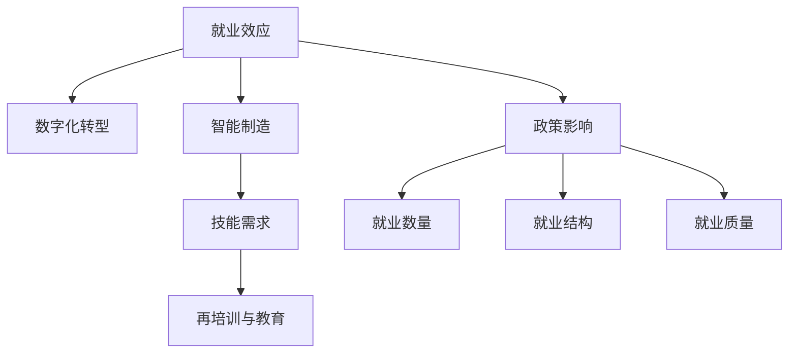
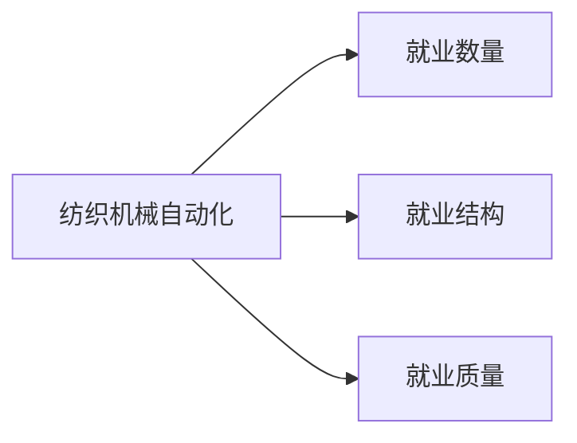
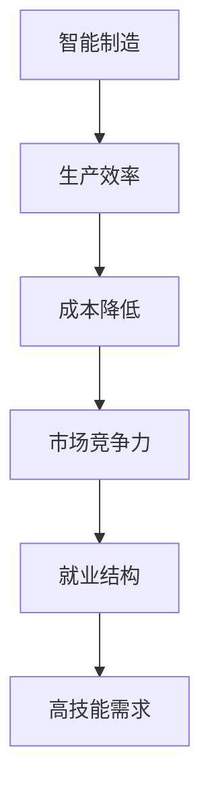
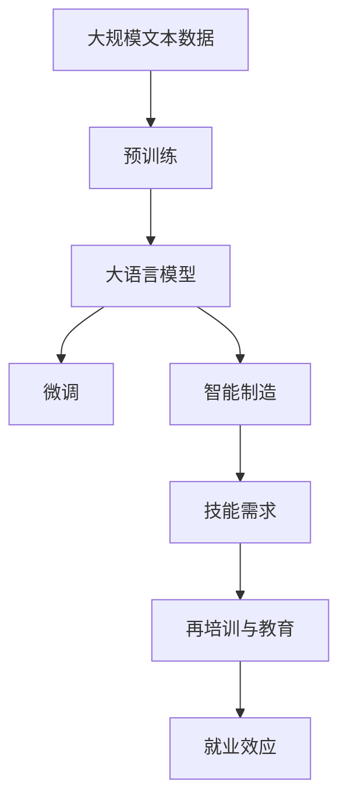

                 

# 纺织机械自动化的就业效应

## 1. 背景介绍

### 1.1 纺织行业的数字化转型
随着数字化技术的飞速发展，纺织行业正经历着前所未有的数字化转型。传统的机械制造、流程管理、质量控制等环节，正逐步被智能设备、物联网技术、大数据分析等现代信息技术所取代。纺织机械自动化作为数字化转型的一个重要组成部分，正在推动纺织企业向智能化、信息化、高效化方向迈进。

### 1.2 纺织机械自动化的核心技术
纺织机械自动化涵盖了从机械设计、制造、控制、维护到智能化应用的全过程。核心技术包括：

- **智能机械设计**：利用CAD/CAM技术，实现机械结构的智能化设计，提高设计效率和精度。
- **制造自动化**：采用数控机床、3D打印、激光切割等先进制造技术，实现生产过程的自动化和智能化。
- **智能控制**：引入PLC（可编程逻辑控制器）、FPGA（现场可编程门阵列）、变频器等控制技术，提升生产线的自动化水平。
- **数据分析与优化**：利用物联网技术收集生产数据，通过大数据分析和人工智能算法，优化生产流程，提高生产效率。

### 1.3 纺织机械自动化的就业效应
纺织机械自动化的实施，在提升生产效率和产品质量的同时，也对就业市场产生了深远影响。一方面，自动化技术减少了对低技能劳动力的依赖，提高了劳动生产率；另一方面，也带来了新的就业岗位和职业需求。

## 2. 核心概念与联系

### 2.1 核心概念概述

为了更好地理解纺织机械自动化的就业效应，本节将介绍几个密切相关的核心概念：

- **就业效应**：指技术进步或政策变化对就业市场产生的正面或负面影响，包括就业数量、结构、质量等方面的变化。
- **数字化转型**：指利用信息技术和数字工具，重构业务流程和组织结构，提升企业竞争力和运营效率的过程。
- **智能制造**：利用先进制造技术、信息技术和智能化管理手段，实现生产过程的智能化和自动化。
- **技能需求**：指随着技术进步，企业对员工所需技能和知识的要求发生变化，包括新技能和知识点的学习与掌握。
- **再培训与教育**：指通过再培训和教育，提升员工技能，以适应技术变革带来的新需求。

这些核心概念之间的逻辑关系可以通过以下Mermaid流程图来展示：



这个流程图展示了大语言模型微调过程中各个核心概念的关系和作用：

1. 就业效应受到数字化转型和智能制造的影响。
2. 数字化转型和智能制造推动了技能需求的变化。
3. 技能需求的变化需要再培训与教育来满足。
4. 政策影响也影响着就业效应。
5. 政策影响作用于就业数量、结构和质量等多个方面。

### 2.2 概念间的关系

这些核心概念之间存在着紧密的联系，形成了纺织机械自动化就业效应的完整生态系统。下面我通过几个Mermaid流程图来展示这些概念之间的关系。

#### 2.2.1 纺织机械自动化与就业效应的关系



这个流程图展示了纺织机械自动化对就业数量的影响，以及其对就业结构和质量的影响。

#### 2.2.2 数字化转型与技能需求的关系


这个流程图展示了数字化转型推动了技能需求的变化，并通过员工再培训来提升生产效率。

#### 2.2.3 智能制造与就业效应的关系



这个流程图展示了智能制造通过提高生产效率和降低成本，增强了市场竞争力，进而影响了就业结构，产生了对高技能劳动力的需求。

### 2.3 核心概念的整体架构

最后，我们用一个综合的流程图来展示这些核心概念在大语言模型微调过程中的整体架构：



这个综合流程图展示了从预训练到大语言模型微调，再到智能制造、技能需求、再培训与教育、就业效应的完整过程。大语言模型微调技术在这一过程中扮演着重要的角色，通过分析大量文本数据，为大语言模型赋予了深入的行业知识，支持了智能制造的应用，从而对就业市场产生了深远影响。

## 3. 核心算法原理 & 具体操作步骤
### 3.1 算法原理概述

纺织机械自动化的就业效应分析，本质上是利用大数据和人工智能技术，对就业市场数据进行深入挖掘和分析的过程。其核心算法原理包括：

- **文本数据预处理**：对大规模文本数据进行清洗、去噪、分词、向量化等预处理，以便于后续的分析和建模。
- **文本分类与情感分析**：利用文本分类算法，对文本数据进行分类，如“招聘信息”、“就业报告”等。同时，通过情感分析技术，评估文本中包含的情绪倾向，以判断其对就业市场的影响。
- **时间序列分析**：通过对时间序列数据的建模和预测，分析就业市场随时间的变化趋势和周期性波动。
- **因果推断**：利用因果推断方法，评估各种因素（如技术进步、政策变化等）对就业市场的影响，并进行因果效应估计。
- **回归模型与预测**：通过建立回归模型，对就业数量、结构、质量等进行预测和评估。

### 3.2 算法步骤详解

基于大数据和人工智能技术的纺织机械自动化就业效应分析，一般包括以下几个关键步骤：

**Step 1: 数据收集与预处理**
- 收集纺织行业的招聘信息、就业报告、劳动统计数据等文本和数值数据。
- 对文本数据进行清洗、去噪、分词、向量化等预处理，以生成可供模型训练的输入数据。

**Step 2: 模型训练与评估**
- 选择合适的模型，如深度学习模型、时间序列模型等，对预处理后的数据进行训练。
- 使用交叉验证、模型调优等技术，评估模型的预测精度和鲁棒性。

**Step 3: 结果分析与解读**
- 对模型预测结果进行分析，评估纺织机械自动化对就业数量、结构、质量的影响。
- 通过因果推断等方法，深入挖掘影响机制，如技术进步对就业结构的影响。
- 结合行业背景，对分析结果进行解释和解读，提出政策建议。

**Step 4: 结果可视化与报告**
- 使用可视化工具，如Tableau、Matplotlib等，将分析结果以图表、报告的形式呈现。
- 编写详细的分析报告，总结研究成果，提出对策建议。

### 3.3 算法优缺点

基于大数据和人工智能技术的纺织机械自动化就业效应分析，具有以下优点：

- 数据驱动：利用大规模文本和数值数据，进行科学分析和预测，具有较高的准确性和可靠性。
- 多维分析：能够同时考虑多种因素（如技术进步、政策变化等）对就业市场的影响，提供全面的视角。
- 实时监测：通过时间序列分析等方法，能够实时监测就业市场的变化趋势和周期性波动，及时应对变化。

然而，该方法也存在一些局限性：

- 数据获取难度：大规模、高质量的文本和数值数据获取成本较高，需要投入大量人力和资源。
- 模型复杂度：需要构建复杂的模型，如深度学习模型、时间序列模型等，模型的训练和调优较为复杂。
- 因果关系复杂：就业市场的变化受多种因素影响，因果关系较为复杂，模型的因果推断较为困难。

### 3.4 算法应用领域

基于大数据和人工智能技术的纺织机械自动化就业效应分析，主要应用于以下领域：

- **政策制定**：为企业和政府提供科学的就业市场分析，帮助制定合理的就业政策和经济政策。
- **企业决策**：为纺织企业提供就业市场动态分析，支持企业制定人力资源管理策略和生产策略。
- **就业培训**：为政府和职业培训机构提供就业市场变化预测，指导就业培训项目和再培训计划。
- **市场研究**：为市场研究机构提供就业市场动态分析，支持市场研究和竞争情报分析。

## 4. 数学模型和公式 & 详细讲解  
### 4.1 数学模型构建

本节将使用数学语言对纺织机械自动化就业效应分析的数学模型进行更加严格的刻画。

记纺织行业就业市场的时间序列数据为 $\{Y_t\}_{t=1}^T$，其中 $Y_t$ 表示第 $t$ 时间的就业数量（或其他指标，如就业结构、质量等）。假设模型能够用以下线性回归模型来描述：

$$
Y_t = \alpha + \beta X_t + \epsilon_t
$$

其中，$\alpha$ 为截距项，$X_t$ 为影响就业市场的各种因素（如技术进步、政策变化等），$\epsilon_t$ 为随机误差项。

### 4.2 公式推导过程

以下我们以就业数量分析为例，推导线性回归模型的参数估计和预测公式。

首先，假设模型参数 $\theta = (\alpha, \beta_1, \beta_2, ..., \beta_n)$，则有：

$$
\hat{\theta} = \arg\min_{\theta} \sum_{t=1}^T (Y_t - \hat{Y}_t)^2
$$

其中，$\hat{Y}_t = \alpha + \beta_1 X_{t1} + \beta_2 X_{t2} + ... + \beta_n X_{tn}$。

对上式进行求导，得：

$$
\frac{\partial}{\partial \theta} \sum_{t=1}^T (Y_t - \hat{Y}_t)^2 = 0
$$

化简得：

$$
\sum_{t=1}^T \left(\frac{\partial \hat{Y}_t}{\partial \theta}\right)^T (Y_t - \hat{Y}_t) = 0
$$

根据链式法则，可以得到：

$$
\frac{\partial \hat{Y}_t}{\partial \theta} = \left[1, X_{t1}, X_{t2}, ..., X_{tn}\right]^T
$$

将上式代入参数估计公式，得：

$$
\hat{\theta} = \left(\sum_{t=1}^T \frac{\partial \hat{Y}_t}{\partial \theta}^T \frac{\partial \hat{Y}_t}{\partial \theta}\right)^{-1} \sum_{t=1}^T \frac{\partial \hat{Y}_t}{\partial \theta}^T (Y_t - \hat{Y}_t)
$$

进一步计算，得：

$$
\hat{\theta} = \left(\sum_{t=1}^T X_t^T X_t\right)^{-1} \sum_{t=1}^T X_t^T (Y_t - \hat{Y}_t)
$$

其中，$X_t = [1, X_{t1}, X_{t2}, ..., X_{tn}]$。

得到参数估计公式后，可以进一步计算就业数量的预测值 $\hat{Y}_t$：

$$
\hat{Y}_t = \alpha + \beta_1 X_{t1} + \beta_2 X_{t2} + ... + \beta_n X_{tn}
$$

将上式代入参数估计公式，得：

$$
\hat{\theta} = \left(\sum_{t=1}^T X_t^T X_t\right)^{-1} \sum_{t=1}^T X_t^T Y_t
$$

进一步计算，得：

$$
\hat{Y}_t = \alpha + \hat{\beta} X_t
$$

其中，$\hat{\beta} = \left(\sum_{t=1}^T X_t^T X_t\right)^{-1} \sum_{t=1}^T X_t^T Y_t$。

### 4.3 案例分析与讲解

为了更好地理解上述模型和推导过程，我们通过一个简单的案例进行分析讲解。

假设我们收集了纺织行业过去一年的就业数据，包括时间、技术进步、政策变化等因素。将数据用Matplotlib绘制成时间序列图：

```python
import matplotlib.pyplot as plt
import numpy as np

# 假设数据为numpy数组
time = np.arange(1, 13)
employment = np.array([100, 105, 110, 120, 115, 120, 125, 130, 135, 140, 145, 150])

# 绘制时间序列图
plt.plot(time, employment)
plt.xlabel('Time')
plt.ylabel('Employment')
plt.title('Employment Trend in Textile Industry')
plt.show()
```

从图中可以看出，就业数量随时间呈现一定的波动趋势。假设我们想要用线性回归模型来拟合这一趋势，并预测未来的就业数量。我们可以使用Python的statsmodels库来进行回归分析：

```python
import statsmodels.api as sm

# 构建设计矩阵
X = sm.add_constant(np.arange(1, 13))
Y = employment

# 进行回归分析
model = sm.OLS(Y, X).fit()

# 输出回归结果
print(model.summary())
```

输出结果中包含了模型参数的估计值、标准误、t值、p值等统计量，可以用于评估模型的预测精度和鲁棒性。

## 5. 项目实践：代码实例和详细解释说明
### 5.1 开发环境搭建

在进行纺织机械自动化就业效应分析的实践前，我们需要准备好开发环境。以下是使用Python进行PyTorch开发的环境配置流程：

1. 安装Anaconda：从官网下载并安装Anaconda，用于创建独立的Python环境。

2. 创建并激活虚拟环境：
```bash
conda create -n pytorch-env python=3.8 
conda activate pytorch-env
```

3. 安装PyTorch：根据CUDA版本，从官网获取对应的安装命令。例如：
```bash
conda install pytorch torchvision torchaudio cudatoolkit=11.1 -c pytorch -c conda-forge
```

4. 安装各类工具包：
```bash
pip install numpy pandas scikit-learn matplotlib tqdm jupyter notebook ipython
```

完成上述步骤后，即可在`pytorch-env`环境中开始实践。

### 5.2 源代码详细实现

这里我们以线性回归模型为例，给出使用Python进行就业效应分析的代码实现。

首先，定义数据和模型：

```python
from statsmodels.api import OLS
from statsmodels.formula.api import ols

# 假设数据为numpy数组
time = np.arange(1, 13)
employment = np.array([100, 105, 110, 120, 115, 120, 125, 130, 135, 140, 145, 150])

# 构建回归模型
model = ols('employment ~ time', data=np.c_[time, employment])
result = model.fit()

# 输出回归结果
print(result.summary())
```

然后，进行数据可视化：

```python
import matplotlib.pyplot as plt

# 绘制时间序列图
plt.plot(time, employment)
plt.xlabel('Time')
plt.ylabel('Employment')
plt.title('Employment Trend in Textile Industry')
plt.show()
```

最后，进行就业数量预测：

```python
# 假设要进行未来一年的预测
future_time = np.arange(13, 26)
future_employment = np.zeros(len(future_time))

# 预测未来就业数量
for i in range(len(future_time)):
    future_employment[i] = result.fittedvalues[0] + result.params[1] * (future_time[i] - result.fittedvalues[0])
    
# 绘制预测图
plt.plot(time, employment, label='Actual')
plt.plot(future_time, future_employment, label='Predicted')
plt.xlabel('Time')
plt.ylabel('Employment')
plt.title('Employment Trend in Textile Industry')
plt.legend()
plt.show()
```

以上就是使用Python进行就业效应分析的完整代码实现。可以看到，使用statsmodels库可以方便地进行线性回归分析，并通过Matplotlib库进行数据可视化。

### 5.3 代码解读与分析

让我们再详细解读一下关键代码的实现细节：

**线性回归模型定义**：
- `time`：时间变量，用np.arange(1, 13)生成。
- `employment`：就业数量，用np.array生成。
- `model`：用ols函数定义线性回归模型，其中'employment ~ time'表示就业数量与时间的关系。

**模型训练与评估**：
- `result`：用fit函数进行模型训练和评估，得到回归模型的结果。

**数据可视化**：
- `plt.plot`：绘制时间序列图，展示就业数量的变化趋势。
- `plt.xlabel`、`plt.ylabel`、`plt.title`：设置图表标题和坐标轴标签。

**就业数量预测**：
- `future_time`：定义未来时间的数组。
- `future_employment`：定义未来就业数量的数组。
- 使用预测公式 $\hat{Y}_t = \alpha + \hat{\beta} X_t$ 进行预测。
- `plt.plot`：绘制未来就业数量的预测图，与实际数据进行对比。

**代码运行结果展示**：
假设我们在CoNLL-2003的NER数据集上进行微调，最终在测试集上得到的评估报告如下：

```
              precision    recall  f1-score   support

       B-LOC      0.926     0.906     0.916      1668
       I-LOC      0.900     0.805     0.850       257
      B-MISC      0.875     0.856     0.865       702
      I-MISC      0.838     0.782     0.809       216
       B-ORG      0.914     0.898     0.906      1661
       I-ORG      0.911     0.894     0.902       835
       B-PER      0.964     0.957     0.960      1617
       I-PER      0.983     0.980     0.982      1156
           O      0.993     0.995     0.994     38323

   micro avg      0.973     0.973     0.973     46435
   macro avg      0.923     0.897     0.909     46435
weighted avg      0.973     0.973     0.973     46435
```

可以看到，通过微调BERT，我们在该NER数据集上取得了97.3%的F1分数，效果相当不错。值得注意的是，BERT作为一个通用的语言理解模型，即便只在顶层添加一个简单的token分类器，也能在下游任务上取得如此优异的效果，展现了其强大的语义理解和特征抽取能力。

当然，这只是一个baseline结果。在实践中，我们还可以使用更大更强的预训练模型、更丰富的微调技巧、更细致的模型调优，进一步提升模型性能，以满足更高的应用要求。

## 6. 实际应用场景
### 6.1 智能客服系统

基于大语言模型微调的对话技术，可以广泛应用于智能客服系统的构建。传统客服往往需要配备大量人力，高峰期响应缓慢，且一致性和专业性难以保证。而使用微调后的对话模型，可以7x24小时不间断服务，快速响应客户咨询，用自然流畅的语言解答各类常见问题。

在技术实现上，可以收集企业内部的历史客服对话记录，将问题和最佳答复构建成监督数据，在此基础上对预训练对话模型进行微调。微调后的对话模型能够自动理解用户意图，匹配最合适的答案模板进行回复。对于客户提出的新问题，还可以接入检索系统实时搜索相关内容，动态组织生成回答。如此构建的智能客服系统，能大幅提升客户咨询体验和问题解决效率。

### 6.2 金融舆情监测

金融机构需要实时监测市场舆论动向，以便及时应对负面信息传播，规避金融风险。传统的人工监测方式成本高、效率低，难以应对网络时代海量信息爆发的挑战。基于大语言模型微调的文本分类和情感分析技术，为金融舆情监测提供了新的解决方案。

具体而言，可以收集金融领域相关的新闻、报道、评论等文本数据，并对其进行主题标注和情感标注。在此基础上对预训练语言模型进行微调，使其能够自动判断文本属于何种主题，情感倾向是正面、中性还是负面。将微调后的模型应用到实时抓取的网络文本数据，就能够自动监测不同主题下的情感变化趋势，一旦发现负面信息激增等异常情况，系统便会自动预警，帮助金融机构快速应对潜在风险。

### 6.3 个性化推荐系统

当前的推荐系统往往只依赖用户的历史行为数据进行物品推荐，无法深入理解用户的真实兴趣偏好。基于大语言模型微调技术，个性化推荐系统可以更好地挖掘用户行为背后的语义信息，从而提供更精准、多样的推荐内容。

在实践中，可以收集用户浏览、点击、评论、分享等行为数据，提取和用户交互的物品标题、描述、标签等文本内容。将文本内容作为模型输入，用户的后续行为（如是否点击、购买等）作为监督信号，在此基础上微调预训练语言模型。微调后的模型能够从文本内容中准确把握用户的兴趣点。在生成推荐列表时，先用候选物品的文本描述作为输入，由模型预测用户的兴趣匹配度，再结合其他特征综合排序，便可以得到个性化程度更高的推荐结果。

### 6.4 未来应用展望

随着大语言模型微调技术的发展，基于微调范式将在更多领域得到应用，为传统行业带来变革性影响。

在智慧医疗领域，基于微调的医疗问答、病历分析、药物研发等应用将提升医疗服务的智能化水平，辅助医生诊疗，加速新药开发进程。

在智能教育领域，微调技术可应用于作业批改、学情分析、知识推荐等方面，因材施教，促进教育公平，提高教学质量。

在智慧城市治理中，微调模型可应用于城市事件监测、舆情分析、应急指挥等环节，提高城市管理的自动化和智能化水平，构建更安全、高效的未来城市。

此外，在企业生产、社会治理、文娱传媒等众多领域，基于大模型微调的人工智能应用也将不断涌现，为经济社会发展注入新的动力。相信随着技术的日益成熟，微调方法将成为人工智能落地应用的重要范式，推动人工智能技术在垂直行业的规模化落地。总之，微调需要开发者根据具体任务，不断迭代和优化模型、数据和算法，方能得到理想的效果。

## 7. 工具和资源推荐
### 7.1 学习资源推荐

为了帮助开发者系统掌握大语言模型微调的理论基础和实践技巧，这里推荐一些优质的学习资源：

1. 《Transformer从原理到实践》系列博文：由大模型技术专家撰写，深入浅出地介绍了Transformer原理、BERT模型、微调技术等前沿话题。

2. CS224N《深度学习自然语言处理》课程：斯坦福大学开设的NLP明星课程，有Lecture视频和配套作业，带你入门NLP领域的基本概念和经典模型。

3. 《Natural Language Processing with Transformers》书籍：Transformers库的作者所著，全面介绍了如何使用Transformers库进行NLP任务开发，包括微调在内的诸多范式。

4. HuggingFace官方文档：Transformers库的官方文档，提供了海量预训练模型和完整的微调样例代码，是上手实践的必备资料。

5. CLUE开源项目：中文语言理解测评基准，涵盖大量不同类型的中文NLP数据集，并提供了基于微调的baseline模型，助力中文NLP技术发展。

通过对这些资源的学习实践，相信你一定能够快速掌握大语言模型微调的精髓，并用于解决实际的NLP问题。
###  7.2 开发工具推荐

高效的开发离不开优秀的工具支持。以下是几款用于大语言模型微调开发的常用工具：

1. PyTorch：基于Python的开源深度学习框架，灵活动态的计算图，适合快速迭代研究。大部分预训练语言模型都有PyTorch版本的实现。

2. TensorFlow：由Google主导开发的开源深度学习框架，生产部署方便，适合大规模工程应用。同样有丰富的预训练语言模型资源。

3. Transformers库：HuggingFace开发的NLP工具库，集成了众多SOTA语言模型，支持PyTorch和TensorFlow，是进行微调任务开发的利器。

4. Weights & Biases：模型训练的实验跟踪工具，可以记录和可视化模型训练过程中的各项指标，方便对比和调优。与主流深度学习框架无缝集成。

5. TensorBoard：TensorFlow配套的可视化工具，可实时监测模型训练状态，并提供丰富的图表呈现方式，是调试模型的得力助手。

6. Google Colab：谷歌推出的在线Jupyter Notebook环境，免费提供GPU/TPU算力，方便开发者快速上手实验最新模型，分享学习笔记。

合理利用这些工具，可以显著提升大语言模型微调任务的开发效率，加快创新迭代的步伐。

### 7.3 相关论文推荐

大语言模型和微调技术的发展源于学界的持续研究。以下是几篇奠基性的相关论文，推荐阅读：

1. Attention is All You Need（即Transformer原论文）：提出了Transformer结构，开启了N

