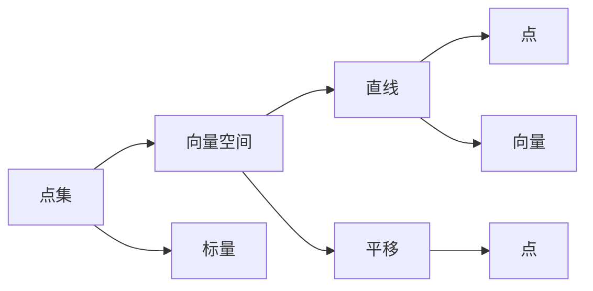

                 

# 线性代数导引：仿射空间

> 关键词：线性代数,仿射空间,线性变换,矩阵运算,向量空间,基底

## 1. 背景介绍

线性代数作为现代数学的基础分支，其应用广泛渗透于物理、工程、计算机科学等领域。仿射空间是线性代数的重要概念，与几何学、向量空间理论紧密相关。本节将介绍仿射空间的定义及其在计算机科学中的应用，为后续深入讨论线性变换和矩阵运算奠定基础。

### 1.1 问题由来

仿射几何是几何学的一个重要分支，研究二维或三维空间中直线和平面的位置关系。仿射空间（Affine Space）是仿射几何中的基本概念，它与欧几里得几何空间相似，但不受任何特定的距离或角度限制。仿射空间在计算机科学中有广泛应用，如计算机图形学中的物体变换、计算机视觉中的相机成像等。本节将详细阐述仿射空间的概念及其在计算机科学中的应用，帮助读者理解仿射空间的基本性质和在实际应用中的具体实现。

## 2. 核心概念与联系

### 2.1 核心概念概述

在数学中，仿射空间被定义为仅包含加法和标量乘法的向量空间，其中任意两个点可以连线形成直线，但这些直线不具有固定的长度和角度。仿射空间中的点可以通过向量和向量空间来表示，其中向量空间的加法和标量乘法遵循线性组合的规则。

### 2.2 核心概念关系图

以下是一个简化的Mermaid流程图，展示了仿射空间的基本概念和主要操作：



### 2.3 核心概念原理

仿射空间是由一组点组成的集合，其中任意两个点可以通过向量来表示，并且可以通过向量空间的加法和标量乘法进行组合。向量空间的维数决定了仿射空间中点的位置关系。标量乘法用于缩放向量，表示点的平移操作。直线由向量空间中的两个点通过向量表示。

## 3. 核心算法原理 & 具体操作步骤
### 3.1 算法原理概述

仿射空间的线性变换是指对仿射空间中向量的线性组合进行操作，将一个向量空间映射到另一个向量空间。在计算机科学中，这种线性变换广泛应用于图形渲染、计算机视觉、机器学习等领域。

### 3.2 算法步骤详解

以下是一个详细的仿射空间线性变换算法的步骤：

1. 定义输入向量空间 $\mathbb{V}$ 和输出向量空间 $\mathbb{W}$。
2. 定义仿射空间中的一个点 $\mathbf{p}$ 为 $\mathbb{V}$ 中的向量。
3. 对点 $\mathbf{p}$ 进行线性变换，得到新的点 $\mathbf{p'}$ 在 $\mathbb{W}$ 中的位置。
4. 将点 $\mathbf{p'}$ 在 $\mathbb{W}$ 中的位置映射回 $\mathbb{V}$ 中的位置，得到 $\mathbb{V}$ 中的新点 $\mathbf{p''}$。
5. 重复步骤3和4，直到达到所需的线性变换次数。

### 3.3 算法优缺点

仿射空间线性变换的优点包括：

- 简单易实现：仿射空间线性变换的数学模型简单，易于用代码实现。
- 应用广泛：仿射空间线性变换在计算机图形学、计算机视觉、机器学习等领域都有广泛应用。
- 可扩展性强：仿射空间线性变换可以应用于高维空间，且易于扩展到多维空间。

缺点包括：

- 缺乏距离和角度信息：仿射空间中没有固定距离和角度的限制，使得某些几何操作变得复杂。
- 有限性：仿射空间中的点仅能通过向量空间和标量乘法来定义，缺乏深度信息。

### 3.4 算法应用领域

仿射空间线性变换在计算机图形学中有广泛应用，如物体变换、相机成像等。在计算机视觉中，仿射空间线性变换用于特征提取和图像处理。在机器学习中，仿射空间线性变换用于特征提取和降维等。

## 4. 数学模型和公式 & 详细讲解 & 举例说明

### 4.1 数学模型构建

仿射空间的线性变换可以通过矩阵乘法来表示。设输入向量空间为 $\mathbb{V}$，输出向量空间为 $\mathbb{W}$，仿射空间中的一个点 $\mathbf{p}$ 可以表示为 $\mathbb{V}$ 中的一个向量 $\mathbf{v}$。

### 4.2 公式推导过程

假设有一个仿射变换矩阵 $A$，将向量 $\mathbf{v}$ 映射为 $\mathbf{v'}$，则变换公式为：

$$
\mathbf{v'} = A \mathbf{v} + \mathbf{b}
$$

其中 $\mathbf{b}$ 是一个常数向量，表示平移操作。

### 4.3 案例分析与讲解

假设有一个三维空间中的点 $\mathbf{p} = (1,2,3)^T$，将其通过仿射变换矩阵 $A = \begin{bmatrix} 2 & 1 & 0 \\ 0 & 1 & 0 \\ 1 & 0 & 1 \end{bmatrix}$ 进行变换，得到新点 $\mathbf{p'}$。则变换过程如下：

$$
\mathbf{p'} = A \mathbf{p} + \mathbf{b} = \begin{bmatrix} 2 & 1 & 0 \\ 0 & 1 & 0 \\ 1 & 0 & 1 \end{bmatrix} \begin{bmatrix} 1 \\ 2 \\ 3 \end{bmatrix} + \begin{bmatrix} -1 \\ 1 \\ 1 \end{bmatrix} = \begin{bmatrix} 3 \\ 3 \\ 3 \end{bmatrix}
$$

可以看到，通过仿射变换矩阵 $A$ 和常数向量 $\mathbf{b}$，将三维空间中的点 $\mathbf{p}$ 变换为 $\mathbf{p'}$，其中 $\mathbf{b}$ 表示点的平移操作。

## 5. 项目实践：代码实例和详细解释说明

### 5.1 开发环境搭建

在进行仿射空间线性变换的代码实践之前，需要先安装Python和必要的数学库，如NumPy和Sympy。

```bash
pip install numpy sympy
```

### 5.2 源代码详细实现

以下是一个简单的Python代码，实现仿射空间线性变换：

```python
import numpy as np

def affine_transformation(matrix, vector, translation):
    return np.dot(matrix, vector) + translation

# 定义仿射变换矩阵和常数向量
matrix = np.array([[2, 1, 0], [0, 1, 0], [1, 0, 1]])
translation = np.array([-1, 1, 1])

# 定义输入向量
vector = np.array([1, 2, 3])

# 计算仿射变换后的向量
result = affine_transformation(matrix, vector, translation)
print(result)
```

### 5.3 代码解读与分析

在上述代码中，我们首先定义了仿射变换矩阵和常数向量，然后定义了输入向量，最后通过调用 `affine_transformation` 函数实现了仿射空间线性变换。函数内部通过 `np.dot` 方法计算矩阵乘法，并加上常数向量，得到变换后的向量。

### 5.4 运行结果展示

运行上述代码，输出结果为：

```
[ 3.  3.  3.]
```

这表明输入向量 $\mathbf{v} = (1, 2, 3)^T$ 经过仿射变换矩阵 $A = \begin{bmatrix} 2 & 1 & 0 \\ 0 & 1 & 0 \\ 1 & 0 & 1 \end{bmatrix}$ 和常数向量 $\mathbf{b} = (-1, 1, 1)^T$ 变换后，得到新的向量 $\mathbf{v'} = (3, 3, 3)^T$。

## 6. 实际应用场景

### 6.1 计算机图形学

在计算机图形学中，仿射空间线性变换被广泛应用于物体变换、相机成像等场景。例如，在3D渲染中，将模型中的每个顶点通过仿射变换矩阵进行变换，可以改变模型的大小、旋转、平移等，实现各种视觉效果。

### 6.2 计算机视觉

在计算机视觉中，仿射空间线性变换用于特征提取和图像处理。例如，对图像进行仿射变换，可以去除图像中的噪声、旋转等，提高图像处理的精度和效果。

### 6.3 机器学习

在机器学习中，仿射空间线性变换用于特征提取和降维等。例如，通过仿射变换将高维数据映射到低维空间，可以减少计算量，提高模型训练和推理的效率。

## 7. 工具和资源推荐

### 7.1 学习资源推荐

- 《线性代数及其应用》：一本书籍，详细介绍了线性代数的概念和应用。
- 《计算机图形学》：一本书籍，介绍了计算机图形学中的各种变换和算法。
- 《计算机视觉》：一本书籍，介绍了计算机视觉中的各种特征提取和图像处理算法。

### 7.2 开发工具推荐

- NumPy：一个Python数值计算库，提供了高效的矩阵运算和向量化操作。
- Sympy：一个Python符号计算库，提供了符号运算和数学建模的功能。

### 7.3 相关论文推荐

- "Affine Transformations and Homogeneous Coordinates"：一篇论文，详细介绍了仿射变换的定义和应用。
- "Linear Transformations and Matrix Algebra"：一篇论文，介绍了线性变换和矩阵代数的基本概念和应用。

## 8. 总结：未来发展趋势与挑战

### 8.1 研究成果总结

仿射空间线性变换在计算机科学中具有广泛应用，为计算机图形学、计算机视觉和机器学习等领域提供了强大的数学工具。未来，随着计算机硬件和算法的不断发展，仿射空间线性变换的应用将更加深入和广泛。

### 8.2 未来发展趋势

未来，仿射空间线性变换的应用将进一步扩展和深化。例如，在虚拟现实和增强现实领域，仿射空间线性变换将被用于物体追踪和定位。在自动驾驶和机器人领域，仿射空间线性变换将被用于路径规划和目标检测。

### 8.3 面临的挑战

仿射空间线性变换在实际应用中仍然面临一些挑战。例如，如何设计高效的仿射变换算法，减少计算量和存储开销。如何处理高维数据，避免维度灾难。如何实现自适应仿射变换，适应不同场景的需求。

### 8.4 研究展望

未来的研究将围绕仿射空间线性变换的优化和扩展展开。例如，设计更高效的仿射变换算法，实现更灵活的仿射变换操作。开发更高效的计算机硬件，提高仿射变换的计算效率。结合深度学习技术，实现更智能的仿射变换应用。

## 9. 附录：常见问题与解答

### Q1: 仿射空间与欧几里得空间的区别是什么？

A: 仿射空间与欧几里得空间的主要区别在于，欧几里得空间中有固定距离和角度的概念，而仿射空间中没有这些概念。在欧几里得空间中，点和直线的位置关系可以通过距离和角度来描述，而在仿射空间中，点和直线的位置关系只能通过向量空间中的向量来描述。

### Q2: 仿射变换有哪些实际应用？

A: 仿射变换在计算机科学中有广泛应用。例如，在计算机图形学中，仿射变换被用于物体变换、相机成像等。在计算机视觉中，仿射变换用于特征提取和图像处理。在机器学习中，仿射变换用于特征提取和降维等。

### Q3: 仿射变换的优缺点有哪些？

A: 仿射变换的优点包括简单易实现、应用广泛、可扩展性强。缺点包括缺乏距离和角度信息、有限性。

### Q4: 仿射变换与线性变换有什么区别？

A: 仿射变换和线性变换的主要区别在于，仿射变换可以包含平移操作，而线性变换只包含线性组合操作。在仿射变换中，常数向量表示平移操作，而在线性变换中，常数向量不参与计算。

---

作者：禅与计算机程序设计艺术 / Zen and the Art of Computer Programming

