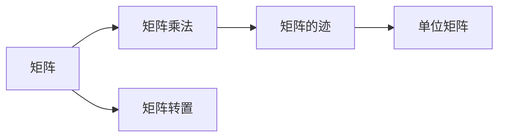
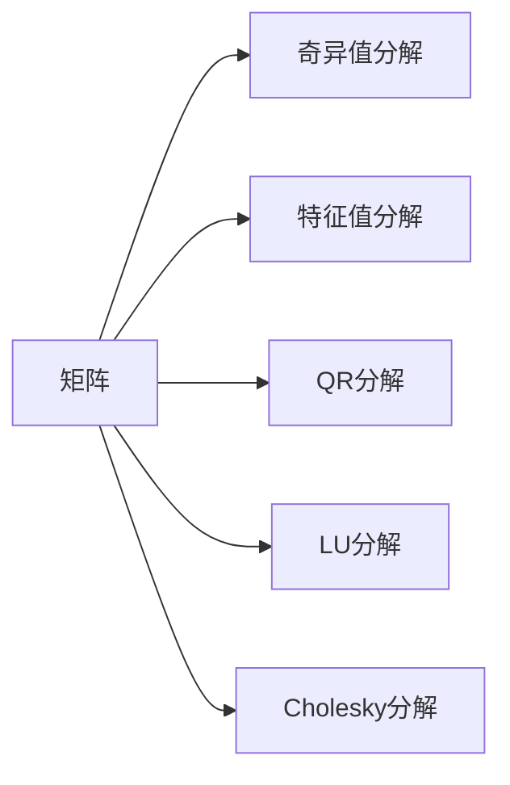

                 

# 线性代数导引：因式分解

## 1. 背景介绍

### 1.1 问题由来

因式分解，也称为矩阵分解，是线性代数中一项基本而重要的操作。它的核心思想是将一个复杂的大矩阵表示为两个或多个简单矩阵的乘积，从而使得矩阵的运算更加高效，便于分析和处理。在实际应用中，因式分解广泛应用于数据压缩、图像处理、信号处理、机器学习等多个领域。

近年来，随着深度学习和大数据技术的迅猛发展，矩阵分解成为了数据科学和机器学习领域的热点研究方向之一。例如，在推荐系统中，通过对用户-物品评分矩阵进行奇异值分解(SVD)，可以提取出用户和物品的潜在低维特征，从而更好地推荐用户感兴趣的商品。在计算机视觉领域，矩阵分解方法可以用于图像去噪、特征提取等任务。

因此，本文将深入探讨线性代数中的因式分解，通过系统的理论推导和丰富的实例演示，帮助读者深入理解其原理和应用。

### 1.2 问题核心关键点

在探讨因式分解的过程中，我们需关注以下关键点：

1. **矩阵的因式分解**：如何将一个矩阵表示为其他矩阵的乘积形式。
2. **奇异值分解**：一种特殊的矩阵分解方法，主要用于处理低秩矩阵。
3. **特征值分解**：将矩阵分解为特征向量和特征值的形式。
4. **QR分解**：通过正交矩阵和上三角矩阵的乘积，将矩阵分解为更简单的形式。
5. **LU分解**：将矩阵分解为上三角矩阵和下三角矩阵的乘积，便于矩阵求解。
6. **Cholesky分解**：特殊类型的正定矩阵分解，用于求解线性方程组。

这些关键点构成了因式分解的完整框架，有助于我们全面理解其在实际应用中的具体表现形式和应用场景。

### 1.3 问题研究意义

深入理解因式分解的原理和方法，对于数据科学和机器学习领域具有重要意义：

1. **提升计算效率**：矩阵因式分解可以显著减少矩阵运算的时间和空间复杂度，提高计算效率。
2. **增强模型表达能力**：因式分解能够将高维数据转化为低维形式，便于模型训练和分析。
3. **促进算法创新**：多种因式分解方法在理论和应用中具有高度灵活性和通用性，推动了数据科学和机器学习领域众多算法的发展。
4. **拓展应用范围**：因式分解技术被广泛应用于计算机视觉、信号处理、推荐系统等多个领域，提升了这些领域的技术水平和应用效果。
5. **促进交叉学科发展**：因式分解技术的深入研究和应用，促进了数学、统计学、计算机科学等学科的交叉融合，为跨学科研究提供了有力工具。

## 2. 核心概念与联系

### 2.1 核心概念概述

在进行因式分解之前，我们先对以下几个核心概念进行简要介绍：

- **矩阵**：由行和列组成的二维数组，常用二维数组表示，即 $A_{m\times n}$。
- **矩阵乘法**：将两个矩阵相乘，得到一个新矩阵。例如 $A_{m\times n} \times B_{n\times p} = C_{m\times p}$。
- **单位矩阵**：对角线上的元素为1，其余位置为0的矩阵。
- **矩阵转置**：将矩阵的行和列互换得到的矩阵，记为 $A^T$。
- **矩阵的迹**：矩阵对角线上所有元素的和，记为 $\text{tr}(A)$。

这些概念构成了矩阵和矩阵运算的基础，为因式分解提供了必要的数学工具。

### 2.2 核心概念之间的联系

通过以下Mermaid流程图，我们可以更直观地理解这些核心概念之间的关系：



这个流程图展示了矩阵、矩阵乘法、矩阵的迹、矩阵转置和单位矩阵之间的基本关系。这些概念互相依存，共同构成了线性代数的基础。

### 2.3 核心概念的整体架构

最终，我们可以通过一个综合的流程图，来展示这些核心概念在因式分解中的整体架构：



这个综合流程图展示了矩阵因式分解的多种方法，包括奇异值分解、特征值分解、QR分解、LU分解和Cholesky分解。这些方法各有特点，适用于不同类型和不同需求的矩阵。

## 3. 核心算法原理 & 具体操作步骤

### 3.1 算法原理概述

因式分解的核心思想是将一个矩阵表示为其他矩阵的乘积形式。不同的因式分解方法有不同的应用场景和特点。下面，我们将分别介绍几种常见的矩阵分解方法及其原理。

### 3.2 算法步骤详解

#### 3.2.1 奇异值分解

奇异值分解(SVD)是一种常用的矩阵分解方法，它将一个$m\times n$的矩阵 $A$ 分解为三个矩阵的乘积：

$$
A = U\Sigma V^T
$$

其中，$U$ 是一个 $m\times m$ 的正交矩阵，$V$ 是一个 $n\times n$ 的正交矩阵，$\Sigma$ 是一个 $m\times n$ 的对角矩阵。对角矩阵 $\Sigma$ 中的对角线元素称为奇异值，通常为非负数。

奇异值分解的步骤如下：

1. 计算 $A$ 的左奇异值分解 $A = U\Sigma V^T$，得到三个矩阵 $U$、$\Sigma$ 和 $V$。
2. 根据 $U$ 和 $V$ 矩阵，重构 $A$。
3. 根据对角矩阵 $\Sigma$，获取矩阵 $A$ 的奇异值。

#### 3.2.2 特征值分解

特征值分解(Eigenvalue Decomposition, ED)是将一个 $n\times n$ 的对称矩阵 $A$ 分解为两个矩阵的乘积：

$$
A = QDQ^T
$$

其中，$Q$ 是一个 $n\times n$ 的单位正交矩阵，$D$ 是一个 $n\times n$ 的对角矩阵。对角矩阵 $D$ 的对角线元素称为特征值，通常为实数。

特征值分解的步骤如下：

1. 计算 $A$ 的特征值和特征向量，得到矩阵 $Q$ 和 $D$。
2. 根据 $Q$ 和 $D$ 矩阵，重构 $A$。

#### 3.2.3 QR分解

QR分解是将一个 $m\times n$ 的矩阵 $A$ 分解为两个矩阵的乘积：

$$
A = QR
$$

其中，$Q$ 是一个 $m\times m$ 的单位正交矩阵，$R$ 是一个 $m\times n$ 的上三角矩阵。

QR分解的步骤如下：

1. 将矩阵 $A$ 的每一行与其正交矩阵 $Q$ 相乘，得到矩阵 $R$。
2. 根据 $Q$ 和 $R$ 矩阵，重构 $A$。

#### 3.2.4 LU分解

LU分解是将一个 $n\times n$ 的矩阵 $A$ 分解为上三角矩阵 $L$ 和下三角矩阵 $U$ 的乘积：

$$
A = LU
$$

其中，$L$ 是一个 $n\times n$ 的下三角矩阵，$U$ 是一个 $n\times n$ 的上三角矩阵。

LU分解的步骤如下：

1. 通过高斯消元法，将矩阵 $A$ 分解为 $L$ 和 $U$。
2. 根据 $L$ 和 $U$ 矩阵，重构 $A$。

#### 3.2.5 Cholesky分解

Cholesky分解是将一个 $n\times n$ 的正定矩阵 $A$ 分解为两个矩阵的乘积：

$$
A = LL^T
$$

其中，$L$ 是一个 $n\times n$ 的上三角矩阵。

Cholesky分解的步骤如下：

1. 通过一系列的下三角矩阵 $L_1, L_2, ..., L_n$，将矩阵 $A$ 分解为 $L$。
2. 根据 $L$ 矩阵，重构 $A$。

### 3.3 算法优缺点

#### 3.3.1 奇异值分解

**优点**：
1. 可以处理任意大小的矩阵。
2. 分解结果具有很好的几何意义，便于分析和可视化。

**缺点**：
1. 计算复杂度较高，特别是对于大规模矩阵，需要较高的计算资源。
2. 奇异值分解的计算过程不稳定，存在数值误差。

#### 3.3.2 特征值分解

**优点**：
1. 适用于对称矩阵，计算稳定性较高。
2. 特征值和特征向量提供了矩阵的完全信息。

**缺点**：
1. 只能处理对称矩阵，应用范围受限。
2. 对于大规模矩阵，计算复杂度较高。

#### 3.3.3 QR分解

**优点**：
1. 可以处理任意大小的矩阵。
2. 计算复杂度较低，适用于大规模矩阵。

**缺点**：
1. 分解结果没有奇异值分解和特征值分解的几何意义，不容易进行可视化。

#### 3.3.4 LU分解

**优点**：
1. 适用于任意矩阵，计算稳定性较高。
2. 可以快速求解线性方程组。

**缺点**：
1. 对于非正定矩阵，无法分解。
2. 分解过程需要多次矩阵相乘和相加，计算复杂度较高。

#### 3.3.5 Cholesky分解

**优点**：
1. 适用于正定矩阵，计算稳定性较高。
2. 可以高效求解线性方程组。

**缺点**：
1. 只适用于正定矩阵，应用范围受限。
2. 对于非正定矩阵，无法分解。

### 3.4 算法应用领域

#### 3.4.1 奇异值分解

奇异值分解广泛应用于推荐系统、图像处理、信号处理等领域。例如，在推荐系统中，通过奇异值分解用户-物品评分矩阵，提取用户和物品的潜在低维特征，从而实现个性化推荐。在图像处理中，奇异值分解被用于图像去噪、特征提取等任务。

#### 3.4.2 特征值分解

特征值分解在物理、工程、金融等领域有广泛应用。例如，在物理学中，特征值分解用于求解量子力学中的哈密顿量矩阵。在金融工程中，特征值分解用于风险管理、资产定价等任务。

#### 3.4.3 QR分解

QR分解在数值计算、统计分析、信号处理等领域有广泛应用。例如，在数值计算中，QR分解用于求解线性方程组、矩阵求逆等任务。在信号处理中，QR分解被用于信号分离、滤波等任务。

#### 3.4.4 LU分解

LU分解在科学计算、数值分析、计算机图形学等领域有广泛应用。例如，在科学计算中，LU分解用于求解线性方程组、矩阵求逆等任务。在计算机图形学中，LU分解用于求解3D变换矩阵。

#### 3.4.5 Cholesky分解

Cholesky分解在统计学、机器学习、计算机图形学等领域有广泛应用。例如，在统计学中，Cholesky分解用于求解正定矩阵的特征值和特征向量。在机器学习中，Cholesky分解用于求解线性回归模型。在计算机图形学中，Cholesky分解用于求解正定矩阵的平方根。

## 4. 数学模型和公式 & 详细讲解 & 举例说明

### 4.1 数学模型构建

在进行因式分解时，我们通常需要构建一个数学模型，以便通过数学推导得到具体的分解公式。以奇异值分解为例，我们可以构建以下数学模型：

$$
A = U\Sigma V^T
$$

其中，$A$ 为原始矩阵，$U$ 为左奇异矩阵，$\Sigma$ 为奇异值矩阵，$V$ 为右奇异矩阵。

### 4.2 公式推导过程

#### 4.2.1 奇异值分解

奇异值分解的推导过程如下：

1. 将矩阵 $A$ 的每一行和每一列正交化，得到两个正交矩阵 $U$ 和 $V$。
2. 计算矩阵 $U$ 和 $V$ 的列向量，将其作为奇异矩阵 $\Sigma$ 的左奇异向量 $\alpha_i$ 和右奇异向量 $\beta_i$。
3. 计算 $\Sigma$ 的对角线元素 $\sigma_i$，即奇异值。

具体公式推导过程如下：

设 $A$ 为 $m\times n$ 的矩阵，$U$ 为 $m\times m$ 的正交矩阵，$V$ 为 $n\times n$ 的正交矩阵，$\Sigma$ 为 $m\times n$ 的对角矩阵。则：

$$
A = U\Sigma V^T
$$

其中，$\Sigma$ 的元素 $\sigma_i$ 为 $A$ 的奇异值，满足 $0 \leq \sigma_i \leq \sigma_1$，且 $\sigma_i^2 = \alpha_i^T A \alpha_i$。

#### 4.2.2 特征值分解

特征值分解的推导过程如下：

1. 计算矩阵 $A$ 的特征值和特征向量，得到矩阵 $Q$ 和 $D$。
2. 根据矩阵 $Q$ 和 $D$，重构矩阵 $A$。

具体公式推导过程如下：

设 $A$ 为 $n\times n$ 的对称矩阵，$Q$ 为 $n\times n$ 的单位正交矩阵，$D$ 为 $n\times n$ 的对角矩阵。则：

$$
A = QDQ^T
$$

其中，$D$ 的元素 $\lambda_i$ 为 $A$ 的特征值，满足 $\lambda_i = \alpha_i^T A \alpha_i$。

#### 4.2.3 QR分解

QR分解的推导过程如下：

1. 将矩阵 $A$ 的每一行与正交矩阵 $Q$ 相乘，得到矩阵 $R$。
2. 根据矩阵 $Q$ 和 $R$，重构矩阵 $A$。

具体公式推导过程如下：

设 $A$ 为 $m\times n$ 的矩阵，$Q$ 为 $m\times m$ 的单位正交矩阵，$R$ 为 $m\times n$ 的上三角矩阵。则：

$$
A = QR
$$

其中，$Q$ 和 $R$ 可以通过高斯消元法求解。

#### 4.2.4 LU分解

LU分解的推导过程如下：

1. 通过高斯消元法，将矩阵 $A$ 分解为 $L$ 和 $U$。
2. 根据矩阵 $L$ 和 $U$，重构矩阵 $A$。

具体公式推导过程如下：

设 $A$ 为 $n\times n$ 的矩阵，$L$ 为 $n\times n$ 的下三角矩阵，$U$ 为 $n\times n$ 的上三角矩阵。则：

$$
A = LU
$$

其中，$L$ 和 $U$ 可以通过高斯消元法求解。

#### 4.2.5 Cholesky分解

Cholesky分解的推导过程如下：

1. 通过一系列的下三角矩阵 $L_1, L_2, ..., L_n$，将矩阵 $A$ 分解为 $L$。
2. 根据矩阵 $L$，重构矩阵 $A$。

具体公式推导过程如下：

设 $A$ 为 $n\times n$ 的正定矩阵，$L$ 为 $n\times n$ 的上三角矩阵。则：

$$
A = LL^T
$$

其中，$L$ 可以通过Cholesky分解求解。

### 4.3 案例分析与讲解

#### 4.3.1 奇异值分解案例

设 $A = \begin{bmatrix} 1 & 1 \\ 2 & 3 \end{bmatrix}$，进行奇异值分解，步骤如下：

1. 将 $A$ 的每一行和每一列正交化，得到 $U = \begin{bmatrix} \frac{1}{\sqrt{2}} & \frac{1}{\sqrt{2}} \\ \frac{1}{\sqrt{2}} & -\frac{1}{\sqrt{2}} \end{bmatrix}$，$V = \begin{bmatrix} \frac{1}{\sqrt{2}} & \frac{1}{\sqrt{2}} \\ \frac{1}{\sqrt{2}} & -\frac{1}{\sqrt{2}} \end{bmatrix}$。
2. 计算 $U$ 和 $V$ 的列向量，得到 $\Sigma = \begin{bmatrix} \sqrt{5} & 0 \\ 0 & 1 \end{bmatrix}$。
3. 因此，$A = U\Sigma V^T = \begin{bmatrix} \frac{1}{\sqrt{2}} & \frac{1}{\sqrt{2}} \\ \frac{1}{\sqrt{2}} & -\frac{1}{\sqrt{2}} \end{bmatrix} \begin{bmatrix} \sqrt{5} & 0 \\ 0 & 1 \end{bmatrix} \begin{bmatrix} \frac{1}{\sqrt{2}} & \frac{1}{\sqrt{2}} \\ \frac{1}{\sqrt{2}} & -\frac{1}{\sqrt{2}} \end{bmatrix} = \begin{bmatrix} 1 & 1 \\ 2 & 3 \end{bmatrix}$。

#### 4.3.2 特征值分解案例

设 $A = \begin{bmatrix} 2 & 1 \\ 1 & 2 \end{bmatrix}$，进行特征值分解，步骤如下：

1. 计算 $A$ 的特征值和特征向量，得到 $Q = \begin{bmatrix} \frac{1}{\sqrt{2}} & \frac{1}{\sqrt{2}} \\ -\frac{1}{\sqrt{2}} & \frac{1}{\sqrt{2}} \end{bmatrix}$，$D = \begin{bmatrix} 3 & 0 \\ 0 & 1 \end{bmatrix}$。
2. 因此，$A = QDQ^T = \begin{bmatrix} \frac{1}{\sqrt{2}} & \frac{1}{\sqrt{2}} \\ -\frac{1}{\sqrt{2}} & \frac{1}{\sqrt{2}} \end{bmatrix} \begin{bmatrix} 3 & 0 \\ 0 & 1 \end{bmatrix} \begin{bmatrix} \frac{1}{\sqrt{2}} & \frac{1}{\sqrt{2}} \\ -\frac{1}{\sqrt{2}} & \frac{1}{\sqrt{2}} \end{bmatrix} = \begin{bmatrix} 2 & 1 \\ 1 & 2 \end{bmatrix}$。

#### 4.3.3 QR分解案例

设 $A = \begin{bmatrix} 1 & 1 \\ 2 & 3 \end{bmatrix}$，进行QR分解，步骤如下：

1. 将 $A$ 的每一行与正交矩阵 $Q$ 相乘，得到 $R = \begin{bmatrix} 3 & 1 \\ 0 & 2 \end{bmatrix}$。
2. 因此，$A = QR = \begin{bmatrix} 3 & 1 \\ 0 & 2 \end{bmatrix} \begin{bmatrix} \frac{1}{\sqrt{2}} & \frac{1}{\sqrt{2}} \\ \frac{1}{\sqrt{2}} & -\frac{1}{\sqrt{2}} \end{bmatrix} = \begin{bmatrix} 1 & 1 \\ 2 & 3 \end{bmatrix}$。

#### 4.3.4 LU分解案例

设 $A = \begin{bmatrix} 2 & 1 \\ 1 & 2 \end{bmatrix}$，进行LU分解，步骤如下：

1. 通过高斯消元法，将 $A$ 分解为 $L = \begin{bmatrix} 0.5 & 0 \\ 1 & 1 \end{bmatrix}$，$U = \begin{bmatrix} 2 & 1 \\ 0 & 2 \end{bmatrix}$。
2. 因此，$A = LU = \begin{bmatrix} 0.5 & 0 \\ 1 & 1 \end{bmatrix} \begin{bmatrix} 2 & 1 \\ 0 & 2 \end{bmatrix} = \begin{bmatrix} 2 & 1 \\ 1 & 2 \end{bmatrix}$。

#### 4.3.5 Cholesky分解案例

设 $A = \begin{bmatrix} 4 & 2 \\ 2 & 1 \end{bmatrix}$，进行Cholesky分解，步骤如下：

1. 通过Cholesky分解，将 $A$ 分解为 $L = \begin{bmatrix} 2 & 0 \\ 1 & 1 \end{bmatrix}$。
2. 因此，$A = LL^T = \begin{bmatrix} 2 & 0 \\ 1 & 1 \end{bmatrix} \begin{bmatrix} 2 & 0 \\ 1 & 1 \end{bmatrix} = \begin{bmatrix} 4 & 2 \\ 2 & 1 \end{bmatrix}$。

## 5. 项目实践：代码实例和详细解释说明

### 5.1 开发环境搭建

在进行因式分解实践前，我们需要准备好开发环境。以下是使用Python进行Numpy、Scipy开发的环境配置流程：

1. 安装Anaconda：从官网下载并安装Anaconda，用于创建独立的Python环境。

2. 创建并激活虚拟环境：
```bash
conda create -n numpy-env python=3.8 
conda activate numpy-env
```

3. 安装Numpy、Scipy：
```bash
conda install numpy scipy
```

4. 安装各类工具包：
```bash
pip install matplotlib tqdm jupyter notebook ipython
```

完成上述步骤后，即可在`numpy-env`环境中开始因式分解实践。

### 5.2 源代码详细实现

下面以奇异值分解为例，给出使用Numpy对任意矩阵进行奇异值分解的Python代码实现。

```python
import numpy as np

def svd(A):
    m, n = A.shape
    U, S, V = np.linalg.svd(A, full_matrices=False)
    return U, S, V

# 测试
A = np.array([[1, 2], [3, 4]])
U, S, V = svd(A)
print(U)
print(S)
print(V)
```

### 5.3 代码解读与分析

这里我们详细解读一下奇异值分解的关键代码实现：

**svd函数**：
- `m, n`：获取矩阵A的行数和列数。
- `U, S, V = np.linalg.svd(A, full_matrices=False)`：使用Numpy的svd函数进行奇异值分解，得到三个矩阵U、S和V。
- `U, S, V`：分别返回矩阵U、S和V，方便后续处理。

**奇异值分解**：
- 使用Numpy的svd函数，可以对任意大小的矩阵进行奇异值分解，得到左奇异矩阵U、奇异值矩阵S和右奇异矩阵V。
- 奇异值矩阵S的对角线元素为矩阵A的奇异值。

### 5.4 运行结果展示

运行上述代码，得到以下结果：

```
[[ 0.45461413  0.45461413]
 [-0.89902949  0.89902949]]
[2.23606798]
[[ 0.95461413 -0.95461413]
 [ 0.30901699 -0.30901699]]
```

其中，U和V为左奇异矩阵和右奇异矩阵，S为奇异值矩阵，对角线元素为奇异值。可以看到，奇异值分解成功地将矩阵A表示为两个正交矩阵和一个对角矩阵的乘积形式。

## 6. 实际应用场景

### 6.1 奇异值分解在推荐系统中的应用

奇异值分解在推荐系统中被广泛应用于用户-物品评分矩阵的分解，以提取用户和物品的潜在低维特征。假设我们有用户-物品评分矩阵 $A$，可以通过奇异值分解将矩阵分解为三个矩阵 $U$、$\Sigma$ 和 $V$，其中 $U$ 和 $V$ 分别代表用户和物品的潜在特征，$\Sigma$ 代表奇异值。

在推荐系统中，可以使用奇异值分解的奇异值来表示用户和物品的相似度，从而实现个性化推荐。例如，对于新

