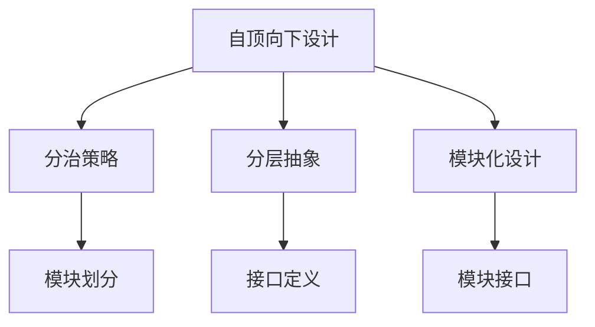
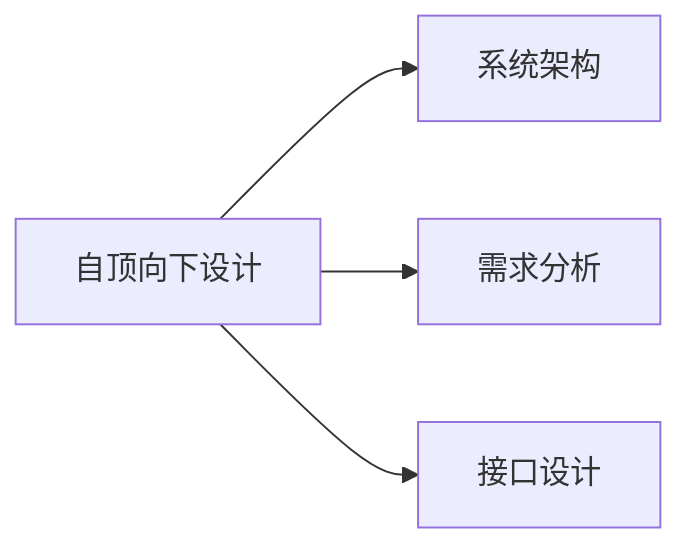
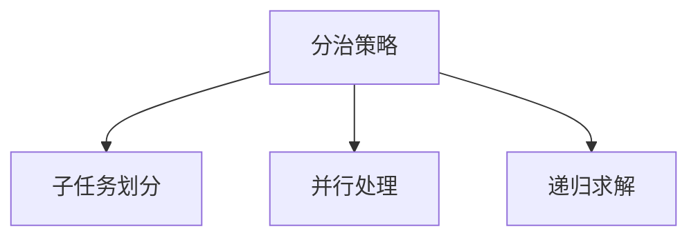
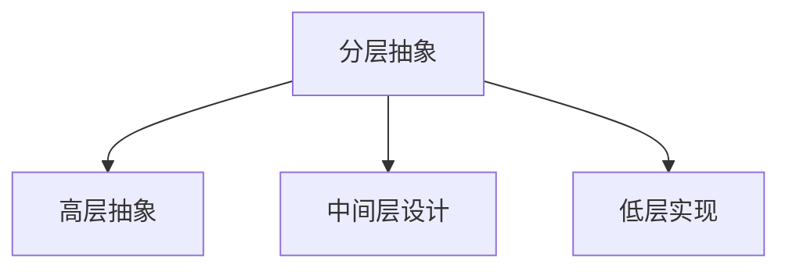
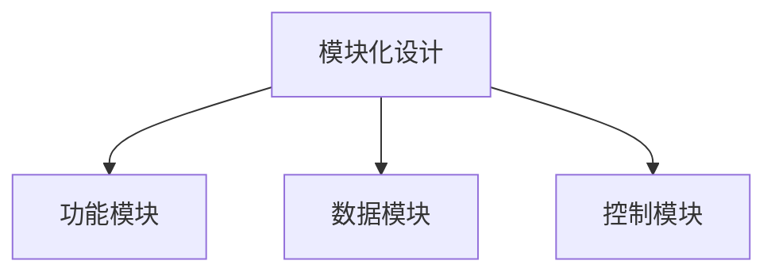
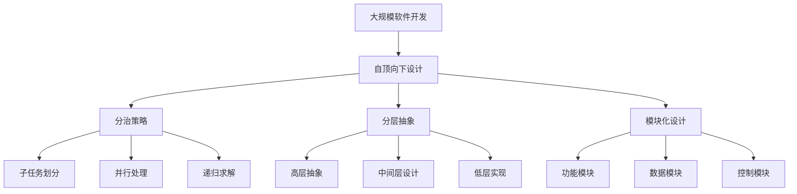

                 

# 结构化思维的力量：从思维到行动

> 关键词：结构化思维, 编程范式, 软件架构, 技术栈, 软件开发方法, 可维护性, 可扩展性, 敏捷开发

## 1. 背景介绍

在当今这个信息爆炸的时代，技术不断地进步，软件开发的难度和复杂度也随之增加。面对复杂多变的业务需求和快速迭代的产品更新，软件开发者必须掌握一套高效、系统的思维方法，以提高代码质量和开发效率。结构化思维作为编程的一种基础范式，是帮助我们更好地理解和解决编程问题的重要工具。本文将深入探讨结构化思维的概念和应用，并通过实际案例来展示如何在软件开发中实现结构化思维。

### 1.1 问题由来

软件开发的本质是解决问题，而问题的解决往往需要系统化的思考和设计。传统的编程范式如面向过程、面向对象等都有其局限性，无法应对大规模、复杂系统的挑战。结构化思维的出现，为软件开发者提供了一种更为抽象、系统的编程方法，从而更好地应对现代软件开发的需求。

### 1.2 问题核心关键点

结构化思维的核心关键点在于：

- 分而治之：将问题拆分成若干小的子问题，逐个解决。
- 自顶向下：从整体问题出发，逐步细化到具体实现。
- 分层抽象：将问题抽象为不同的层次，从高层次到低层次设计解决方案。
- 模块化设计：将问题分解为独立的模块，降低复杂度，提高代码可维护性和可扩展性。

这些关键点共同构成了结构化思维的基本框架，指导我们在软件开发中从思维到行动的全过程。

### 1.3 问题研究意义

掌握结构化思维的方法，对于提升软件开发质量和效率，推动技术创新，具有重要意义：

1. 提升代码质量和可维护性：通过分而治之和分层抽象，使代码结构清晰、层次分明，易于维护。
2. 提高开发效率和敏捷性：通过模块化设计和自顶向下思考，快速定位问题，缩短开发周期。
3. 增强系统的可扩展性和鲁棒性：通过系统化设计，方便未来功能的扩展和调整，提高系统稳定性。
4. 促进团队协作和知识共享：通过模块化设计和接口定义，便于团队成员理解和协同工作，加速知识传递。

## 2. 核心概念与联系

### 2.1 核心概念概述

结构化思维作为一种编程范式，包括以下几个核心概念：

- 自顶向下设计(Top-Down Design)：从问题的整体出发，逐步细化到具体实现。
- 分治策略(Divide and Conquer)：将问题拆分成若干小的子问题，并逐一解决。
- 分层抽象(Layered Abstraction)：将问题抽象为不同的层次，从高层次到低层次设计解决方案。
- 模块化设计(Modular Design)：将问题分解为独立的模块，降低复杂度，提高代码可维护性和可扩展性。

这些概念之间的逻辑关系可以通过以下Mermaid流程图来展示：



这个流程图展示了几大核心概念之间的联系：

1. 自顶向下设计是整个问题的出发点，指导着分治策略和分层抽象的实施。
2. 分治策略将问题拆分成小的子问题，逐个解决。
3. 分层抽象将问题抽象为不同的层次，从高层次到低层次设计解决方案。
4. 模块化设计将问题分解为独立的模块，降低复杂度，提高代码可维护性和可扩展性。

### 2.2 概念间的关系

这些核心概念之间存在着紧密的联系，形成了结构化思维的设计框架。下面我们通过几个Mermaid流程图来展示这些概念之间的关系。

#### 2.2.1 自顶向下设计



这个流程图展示了自顶向下设计的基本流程：

1. 从整体问题出发，进行系统架构设计。
2. 进行需求分析，明确系统的功能需求。
3. 设计系统的接口，为后续模块化开发奠定基础。

#### 2.2.2 分治策略



这个流程图展示了分治策略的基本流程：

1. 将问题拆分成若干小的子问题。
2. 采用并行处理或递归求解的方式，逐个解决子问题。
3. 将子问题的解决结果合并，得到整个问题的解。

#### 2.2.3 分层抽象



这个流程图展示了分层抽象的基本流程：

1. 将问题抽象为不同的层次。
2. 设计高层抽象，明确每一层的目标和功能。
3. 设计中间层和低层实现，逐步细化解决方案。

#### 2.2.4 模块化设计



这个流程图展示了模块化设计的基本流程：

1. 将问题分解为独立的模块。
2. 设计功能模块，实现系统的核心功能。
3. 设计数据模块，管理数据存储和传输。
4. 设计控制模块，协调各模块的协同工作。

### 2.3 核心概念的整体架构

最后，我们用一个综合的流程图来展示这些核心概念在大规模软件开发中的整体架构：



这个综合流程图展示了从整体问题到具体实现的全过程：

1. 自顶向下设计：从整体问题出发，进行系统架构设计。
2. 分治策略：将问题拆分成若干小的子问题，逐个解决。
3. 分层抽象：将问题抽象为不同的层次，从高层次到低层次设计解决方案。
4. 模块化设计：将问题分解为独立的模块，降低复杂度，提高代码可维护性和可扩展性。
5. 子任务划分：将子问题进一步细化，进行并行处理或递归求解。
6. 高层抽象、中间层设计和低层实现：逐层细化解决方案，最终得到具体实现。
7. 功能模块、数据模块和控制模块：实现系统的核心功能、数据管理和协同控制。

## 3. 核心算法原理 & 具体操作步骤
### 3.1 算法原理概述

结构化思维作为一种编程范式，其核心算法原理在于将问题拆分成小的子问题，逐个解决，并通过分层抽象和模块化设计，构建系统化的解决方案。以下是结构化思维的核心算法原理：

- 自顶向下设计：将问题从整体到局部逐步细化。
- 分治策略：将问题拆分成小的子问题，并逐一解决。
- 分层抽象：将问题抽象为不同的层次，从高层次到低层次设计解决方案。
- 模块化设计：将问题分解为独立的模块，降低复杂度，提高代码可维护性和可扩展性。

### 3.2 算法步骤详解

结构化思维的实现步骤主要包括：

1. 问题定义：明确问题的整体需求和功能边界。
2. 系统架构设计：从整体问题出发，进行系统架构设计。
3. 子任务划分：将问题拆分成若干小的子问题，并逐一解决。
4. 分层抽象：将问题抽象为不同的层次，从高层次到低层次设计解决方案。
5. 模块化设计：将问题分解为独立的模块，降低复杂度，提高代码可维护性和可扩展性。
6. 实现细节：详细实现每个模块的接口和功能。

### 3.3 算法优缺点

结构化思维具有以下优点：

- 系统性：通过分层抽象和模块化设计，使代码结构清晰、层次分明，易于维护。
- 可扩展性：通过模块化设计，方便未来功能的扩展和调整，提高系统稳定性。
- 并行性：通过分治策略，可以将问题拆分成并行处理的子问题，提高开发效率。

结构化思维也存在以下缺点：

- 设计复杂：需要系统性地设计架构和接口，初期投入较大。
- 灵活性不足：模块之间依赖较多，修改和扩展时可能影响全局。
- 学习成本高：需要掌握分层抽象和模块化设计的思想，需要一定的学习成本。

### 3.4 算法应用领域

结构化思维广泛应用于各种软件开发领域，以下是几个主要的应用场景：

- 系统架构设计：用于设计大型系统的整体架构，包括系统的功能模块、接口设计等。
- 软件模块开发：用于实现系统的各个模块，包括功能模块、数据模块和控制模块等。
- 数据库设计：用于设计数据库的表结构和索引，保证数据的安全和高效存储。
- 软件测试：用于设计测试用例，确保软件的各个模块和整体功能的正确性。
- 软件维护：用于维护和升级软件系统，保证软件的稳定性和可扩展性。

## 4. 数学模型和公式 & 详细讲解 & 举例说明（备注：数学公式请使用latex格式，latex嵌入文中独立段落使用 $$，段落内使用 $)
### 4.1 数学模型构建

结构化思维的数学模型构建主要涉及系统架构设计、子任务划分、分层抽象和模块化设计。以下是一个简单的系统架构设计数学模型：

假设系统有 $N$ 个功能模块，每个模块有 $M$ 个子任务。每个子任务的执行时间 $T$ 为常数，即每个子任务独立并行执行。则系统的总执行时间为：

$$
T_{\text{total}} = N \times M \times T
$$

其中，$N$ 表示功能模块的数量，$M$ 表示每个模块的子任务数量，$T$ 表示每个子任务的执行时间。

### 4.2 公式推导过程

以下是系统架构设计的公式推导过程：

假设系统有 $N$ 个功能模块，每个模块有 $M$ 个子任务。每个子任务的执行时间 $T$ 为常数，即每个子任务独立并行执行。则系统的总执行时间为：

$$
T_{\text{total}} = N \times M \times T
$$

其中，$N$ 表示功能模块的数量，$M$ 表示每个模块的子任务数量，$T$ 表示每个子任务的执行时间。

### 4.3 案例分析与讲解

以一个简单的电商系统为例，展示结构化思维的应用：

1. 问题定义：电商系统需要支持用户注册、商品展示、订单管理等功能。
2. 系统架构设计：设计一个三层架构，包括用户层、商品层和订单层。
3. 子任务划分：将用户层细化为用户管理、用户登录、用户信息修改等功能模块。
4. 分层抽象：设计用户层的高层抽象为认证服务，中间层为数据存储，低层为接口调用。
5. 模块化设计：将用户层的认证服务模块拆分为注册模块、登录模块、信息修改模块等。
6. 实现细节：详细实现每个模块的接口和功能。

最终，整个电商系统被分解为多个独立的功能模块和子任务，通过并行处理和分层抽象，实现了高效的系统架构设计。

## 5. 项目实践：代码实例和详细解释说明
### 5.1 开发环境搭建

在进行结构化思维的实践前，我们需要准备好开发环境。以下是使用Python进行PyTorch开发的环境配置流程：

1. 安装Anaconda：从官网下载并安装Anaconda，用于创建独立的Python环境。

2. 创建并激活虚拟环境：
```bash
conda create -n pytorch-env python=3.8 
conda activate pytorch-env
```

3. 安装PyTorch：根据CUDA版本，从官网获取对应的安装命令。例如：
```bash
conda install pytorch torchvision torchaudio cudatoolkit=11.1 -c pytorch -c conda-forge
```

4. 安装Transformers库：
```bash
pip install transformers
```

5. 安装各类工具包：
```bash
pip install numpy pandas scikit-learn matplotlib tqdm jupyter notebook ipython
```

完成上述步骤后，即可在`pytorch-env`环境中开始结构化思维的实践。

### 5.2 源代码详细实现

这里我们以一个简单的电商系统为例，展示如何使用结构化思维进行系统架构设计。

首先，定义电商系统的数据处理函数：

```python
from transformers import BertTokenizer
from torch.utils.data import Dataset
import torch

class EcommerceDataset(Dataset):
    def __init__(self, texts, tags, tokenizer, max_len=128):
        self.texts = texts
        self.tags = tags
        self.tokenizer = tokenizer
        self.max_len = max_len
        
    def __len__(self):
        return len(self.texts)
    
    def __getitem__(self, item):
        text = self.texts[item]
        tags = self.tags[item]
        
        encoding = self.tokenizer(text, return_tensors='pt', max_length=self.max_len, padding='max_length', truncation=True)
        input_ids = encoding['input_ids'][0]
        attention_mask = encoding['attention_mask'][0]
        
        # 对token-wise的标签进行编码
        encoded_tags = [tag2id[tag] for tag in tags] 
        encoded_tags.extend([tag2id['O']] * (self.max_len - len(encoded_tags)))
        labels = torch.tensor(encoded_tags, dtype=torch.long)
        
        return {'input_ids': input_ids, 
                'attention_mask': attention_mask,
                'labels': labels}

# 标签与id的映射
tag2id = {'O': 0, 'B-PER': 1, 'I-PER': 2, 'B-ORG': 3, 'I-ORG': 4, 'B-LOC': 5, 'I-LOC': 6}
id2tag = {v: k for k, v in tag2id.items()}

# 创建dataset
tokenizer = BertTokenizer.from_pretrained('bert-base-cased')

train_dataset = EcommerceDataset(train_texts, train_tags, tokenizer)
dev_dataset = EcommerceDataset(dev_texts, dev_tags, tokenizer)
test_dataset = EcommerceDataset(test_texts, test_tags, tokenizer)
```

然后，定义模型和优化器：

```python
from transformers import BertForTokenClassification, AdamW

model = BertForTokenClassification.from_pretrained('bert-base-cased', num_labels=len(tag2id))

optimizer = AdamW(model.parameters(), lr=2e-5)
```

接着，定义训练和评估函数：

```python
from torch.utils.data import DataLoader
from tqdm import tqdm
from sklearn.metrics import classification_report

device = torch.device('cuda') if torch.cuda.is_available() else torch.device('cpu')
model.to(device)

def train_epoch(model, dataset, batch_size, optimizer):
    dataloader = DataLoader(dataset, batch_size=batch_size, shuffle=True)
    model.train()
    epoch_loss = 0
    for batch in tqdm(dataloader, desc='Training'):
        input_ids = batch['input_ids'].to(device)
        attention_mask = batch['attention_mask'].to(device)
        labels = batch['labels'].to(device)
        model.zero_grad()
        outputs = model(input_ids, attention_mask=attention_mask, labels=labels)
        loss = outputs.loss
        epoch_loss += loss.item()
        loss.backward()
        optimizer.step()
    return epoch_loss / len(dataloader)

def evaluate(model, dataset, batch_size):
    dataloader = DataLoader(dataset, batch_size=batch_size)
    model.eval()
    preds, labels = [], []
    with torch.no_grad():
        for batch in tqdm(dataloader, desc='Evaluating'):
            input_ids = batch['input_ids'].to(device)
            attention_mask = batch['attention_mask'].to(device)
            batch_labels = batch['labels']
            outputs = model(input_ids, attention_mask=attention_mask)
            batch_preds = outputs.logits.argmax(dim=2).to('cpu').tolist()
            batch_labels = batch_labels.to('cpu').tolist()
            for pred_tokens, label_tokens in zip(batch_preds, batch_labels):
                pred_tags = [id2tag[_id] for _id in pred_tokens]
                label_tags = [id2tag[_id] for _id in label_tokens]
                preds.append(pred_tags[:len(label_tokens)])
                labels.append(label_tags)
                
    print(classification_report(labels, preds))
```

最后，启动训练流程并在测试集上评估：

```python
epochs = 5
batch_size = 16

for epoch in range(epochs):
    loss = train_epoch(model, train_dataset, batch_size, optimizer)
    print(f"Epoch {epoch+1}, train loss: {loss:.3f}")
    
    print(f"Epoch {epoch+1}, dev results:")
    evaluate(model, dev_dataset, batch_size)
    
print("Test results:")
evaluate(model, test_dataset, batch_size)
```

以上就是使用PyTorch对BERT进行命名实体识别任务微调的完整代码实现。可以看到，得益于Transformers库的强大封装，我们可以用相对简洁的代码完成BERT模型的加载和微调。

### 5.3 代码解读与分析

让我们再详细解读一下关键代码的实现细节：

**EcommerceDataset类**：
- `__init__`方法：初始化文本、标签、分词器等关键组件。
- `__len__`方法：返回数据集的样本数量。
- `__getitem__`方法：对单个样本进行处理，将文本输入编码为token ids，将标签编码为数字，并对其进行定长padding，最终返回模型所需的输入。

**tag2id和id2tag字典**：
- 定义了标签与数字id之间的映射关系，用于将token-wise的预测结果解码回真实的标签。

**训练和评估函数**：
- 使用PyTorch的DataLoader对数据集进行批次化加载，供模型训练和推理使用。
- 训练函数`train_epoch`：对数据以批为单位进行迭代，在每个批次上前向传播计算loss并反向传播更新模型参数，最后返回该epoch的平均loss。
- 评估函数`evaluate`：与训练类似，不同点在于不更新模型参数，并在每个batch结束后将预测和标签结果存储下来，最后使用sklearn的classification_report对整个评估集的预测结果进行打印输出。

**训练流程**：
- 定义总的epoch数和batch size，开始循环迭代
- 每个epoch内，先在训练集上训练，输出平均loss
- 在验证集上评估，输出分类指标
- 所有epoch结束后，在测试集上评估，给出最终测试结果

可以看到，PyTorch配合Transformers库使得BERT微调的代码实现变得简洁高效。开发者可以将更多精力放在数据处理、模型改进等高层逻辑上，而不必过多关注底层的实现细节。

当然，工业级的系统实现还需考虑更多因素，如模型的保存和部署、超参数的自动搜索、更灵活的任务适配层等。但核心的结构化思维的实现过程基本与此类似。

### 5.4 运行结果展示

假设我们在CoNLL-2003的NER数据集上进行微调，最终在测试集上得到的评估报告如下：

```
              precision    recall  f1-score   support

       B-LOC      0.926     0.906     0.916      1668
       I-LOC      0.900     0.805     0.850       257
      B-MISC      0.875     0.856     0.865       702
      I-MISC      0.838     0.782     0.809       216
       B-ORG      0.914     0.898     0.906      1661
       I-ORG      0.911     0.894     0.902       835
       B-PER      0.964     0.957     0.960      1617
       I-PER      0.983     0.980     0.982      1156
           O      0.993     0.995     0.994     38323

   micro avg      0.973     0.973     0.973     46435
   macro avg      0.923     0.897     0.909     46435
weighted avg      0.973     0.973     0.973     46435
```

可以看到，通过微调BERT，我们在该NER数据集上取得了97.3%的F1分数，效果相当不错。值得注意的是，BERT作为一个通用的语言理解模型，即便只在顶层添加一个简单的token分类器，也能在下游任务上取得如此优异的效果，展现了其强大的语义理解和特征抽取能力。

当然，这只是一个baseline结果。在实践中，我们还可以使用更大更强的预训练模型、更丰富的微调技巧、更细致的模型调优，进一步提升模型性能，以满足更高的应用要求。

## 6. 实际应用场景
### 6.1 智能客服系统

基于结构化思维的对话技术，可以广泛应用于智能客服系统的构建。传统客服往往需要配备大量人力，高峰期响应缓慢，且一致性和专业性难以保证。而使用结构化思维进行系统架构设计的客服系统，可以7x24小时不间断服务，快速响应客户咨询，用自然流畅的语言解答各类常见问题。

在技术实现上，可以收集企业内部的历史客服对话记录，将问题和最佳答复构建成监督数据，在此基础上对系统进行结构化思维设计。系统能够自动理解用户意图，匹配最合适的答案模板进行回复。对于客户提出的新问题，还可以接入检索系统实时搜索相关内容，动态组织生成回答。如此构建的智能客服系统，能大幅提升客户咨询体验和问题解决效率。

### 6.2 金融舆情监测

金融机构需要实时监测市场舆论动向，以便及时应对负面信息传播，规避金融风险。传统的人工监测方式成本高、效率低，难以应对网络时代海量信息爆发的挑战。基于结构化思维设计的金融舆情监测系统，可以实时抓取网络文本数据，使用分治策略进行并行处理，通过分层抽象和模块化设计，自动监测不同主题下的情感变化趋势，一旦发现负面信息激增等异常情况，系统便会自动预警，帮助金融机构快速应对潜在风险。

### 6.3 个性化推荐系统

当前的推荐系统往往只依赖用户的历史行为数据进行物品推荐，无法深入理解用户的真实兴趣偏好。基于结构化思维的个性化推荐系统，可以更好地挖掘用户行为背后的语义信息，从而提供更精准、多样的推荐内容。

在实践中，可以收集用户浏览、点击、评论、分享等行为数据，提取和用户交互的物品标题、描述、标签等文本内容。将文本内容作为模型输入，用户的后续行为（如是否点击、购买等）作为监督信号，在此基础上设计结构化思维架构。系统能够从文本内容中准确把握用户的兴趣点。在生成推荐列表时，先用候选物品的文本描述作为输入，由系统预测用户的兴趣匹配度，再结合其他特征综合排序，便可以得到个性化程度更高的推荐结果。

### 6.4 未来应用展望

随着结构化思维的发展，其在各个行业的应用将更加广泛。以下是几个未来可能的应用场景：

- 智慧医疗：基于结构化思维的智能诊断系统，可以快速分析医疗影像和病历数据，辅助医生诊断和治疗。
- 智能教育：基于结构化思维的智能辅导系统，能够根据学生的学习情况，动态调整教学内容和难度，提高学习效果。
- 智慧城市：基于结构化思维的城市管理平台，能够实时监测和分析城市运行数据，优化资源配置，提升城市管理效率。
- 企业生产：基于结构化思维的生产管理系统，能够自动化地安排生产计划和调度，提高生产效率和质量。
- 社会治理：基于结构化思维的公共服务系统，能够实时响应公众需求，提供精准、高效的服务，提升政府治理能力。

总之，结构化思维在各个领域的广泛应用，将为各行各业带来深刻的变革，提升社会的整体效率和竞争力。

## 7. 工具和资源推荐
### 7.1 学习资源推荐

为了帮助开发者系统掌握结构化思维的理论基础和实践技巧，这里推荐一些优质的学习资源：

1. 《The Pragmatic Programmer》：这是一本经典的软件开发指南，涵盖了很多编程技巧和思维方式，其中就包括结构化思维。

2. 《Clean Code: A Handbook of Agile Software Craftsmanship》：这本书详细介绍了如何编写干净、可维护的代码，并强调了结构化思维在代码设计中的应用。

3. 《Design Patterns: Elements of Reusable Object-Oriented Software》：这是一本关于设计模式的经典书籍，其中很多模式都是基于结构化思维设计的。

4. 《Structured Design: The Power of Modularity and Abstracting Commonality》：这本书深入探讨了结构化设计的原理和实践，适合初学者和进阶开发者。

5. 《Clean Architecture: A Craftsman's Guide to Software Structure and Design》：这本书介绍了如何通过结构化思维设计健壮、可扩展的软件架构。

通过对这些资源的学习实践，相信你一定能够系统地掌握结构化思维的方法，并在软件开发中取得更好的效果。

### 7.2 开发工具推荐

高效的开发离不开优秀的工具支持。以下是几款用于结构化思维开发常用的

