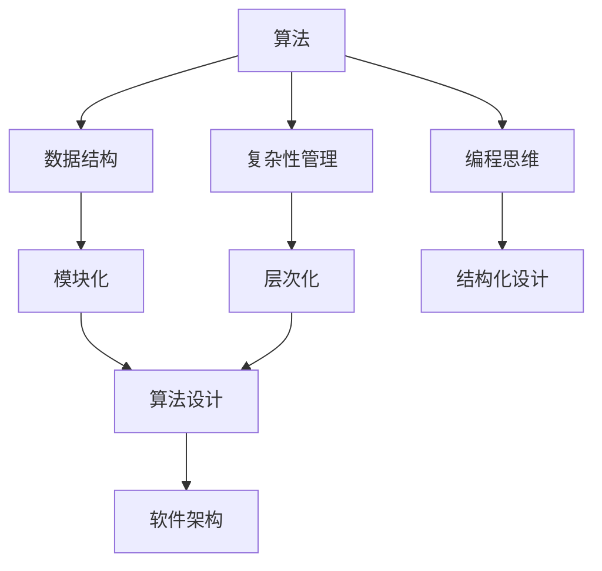
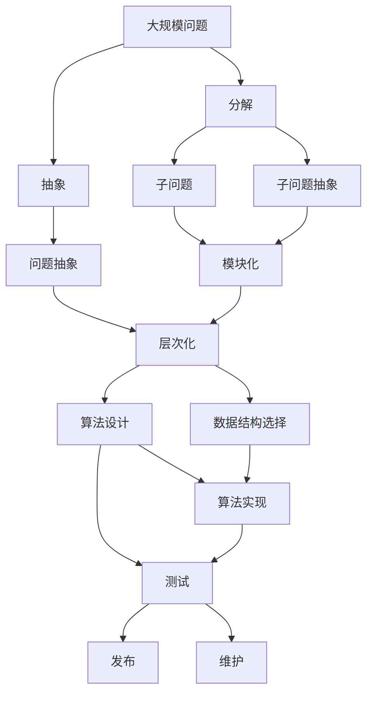

                 

# 结构化思维的应用：从理论到实践

> 关键词：结构化思维,算法设计,数据结构,复杂性管理,编程思维,软件架构

## 1. 背景介绍

### 1.1 问题由来
结构化思维（Structured Thinking）在计算机科学和软件工程中，是指一种基于清晰、逻辑、层次化的思考方法，旨在解决复杂问题，优化算法设计，提高软件开发效率。结构化思维的应用广泛，从软件架构设计到数据结构优化，从算法设计到问题解决，无不贯穿其中。本文将深入探讨结构化思维的理论基础及其在软件开发和算法设计中的应用，帮助读者更好地理解和运用这种思维方式。

### 1.2 问题核心关键点
结构化思维的关键在于将复杂问题拆解为多个小问题，逐个解决，从而简化问题复杂度，提高问题解决的效率和质量。核心方法包括：
- 分解（Decomposition）：将大问题分解为多个子问题。
- 抽象（Abstraction）：将问题抽象为更易于处理的形式。
- 模块化（Modularity）：将复杂系统模块化，便于管理。
- 层次化（Hierarchy）：将系统分层处理，提高可维护性。

## 2. 核心概念与联系

### 2.1 核心概念概述

为更好地理解结构化思维在算法设计和软件开发中的应用，本节将介绍几个关键概念：

- 算法（Algorithm）：指解决问题的步骤序列，通常以代码实现。
- 数据结构（Data Structure）：指存储和组织数据的方式，常用的包括数组、链表、栈、队列等。
- 复杂性管理（Complexity Management）：指对问题复杂度进行有效管理的方法。
- 编程思维（Programming Mindset）：指用结构化思维进行问题建模和算法设计的思维方式。
- 软件架构（Software Architecture）：指软件系统的整体设计和结构设计。

这些概念相互关联，共同构成了结构化思维的理论基础和应用框架。

### 2.2 概念间的关系

这些核心概念之间的逻辑关系可以通过以下Mermaid流程图来展示：



这个流程图展示了这个生态系统中各个概念之间的相互关系：

1. 算法和数据结构是结构化思维的基本工具，用于解决问题。
2. 复杂性管理和编程思维帮助开发者理解和处理问题。
3. 结构化设计则体现在软件架构的构建上。
4. 模块化和层次化是实现结构化设计的关键方法。
5. 结构化设计反过来影响算法设计和数据结构选择。
6. 最终，结构化设计被具体化为软件架构，指导开发实践。

### 2.3 核心概念的整体架构

最后，我们用一个综合的流程图来展示这些核心概念在大规模问题解决中的整体架构：



这个综合流程图展示了从问题分解到最终软件架构部署的全过程：

1. 从大规模问题开始，进行分解和抽象，生成子问题。
2. 对子问题进行模块化和层次化设计。
3. 设计算法和选择数据结构。
4. 实现算法并编写代码。
5. 进行测试和调试，确保代码正确。
6. 发布软件并进行维护。

通过这个综合框架，可以看到结构化思维在问题解决和软件开发中的应用是系统性的，涉及多个环节和多个概念。

## 3. 核心算法原理 & 具体操作步骤
### 3.1 算法原理概述

结构化思维的核心算法原理是分治法（Divide and Conquer），将大问题分解为多个小问题，并逐个解决。这种分治策略通常用于解决复杂度高、计算量大或难以直接求解的问题。

分治法的基本流程包括：
1. 分解（Divide）：将原问题分解为多个子问题。
2. 解决（Conquer）：递归地解决各个子问题。
3. 合并（Combine）：将子问题的解合并成原问题的解。

### 3.2 算法步骤详解

下面以快速排序（Quick Sort）为例，详细讲解分治法的具体步骤：

1. 分解：选择一个基准元素（Pivot），将待排序序列分成两部分，左边部分小于等于基准，右边部分大于基准。
2. 解决：递归地对左右两部分进行快速排序。
3. 合并：将排好序的左右两部分合并成一个有序序列。

快速排序的伪代码如下：

```
function quicksort(arr, left, right)
    if left < right
        pivot_index = partition(arr, left, right)
        quicksort(arr, left, pivot_index - 1)
        quicksort(arr, pivot_index + 1, right)
    end if
end function

function partition(arr, left, right)
    pivot = arr[right]
    i = left - 1
    for j = left to right - 1
        if arr[j] <= pivot
            i = i + 1
            swap arr[i] with arr[j]
        end if
    end for
    swap arr[i + 1] with arr[right]
    return i + 1
end function
```

### 3.3 算法优缺点

快速排序作为分治法的典型应用，具有以下优点：
- 时间复杂度低，平均为O(nlogn)，最坏情况下为O(n^2)，但在实际应用中，最坏情况极少发生。
- 空间复杂度低，原序列直接在原地排序，不需要额外空间。

同时，快速排序也存在以下缺点：
- 对于小规模数据，递归深度较大，可能导致栈溢出。
- 最坏情况下时间复杂度较高，不稳定。

针对这些缺点，常用的优化策略包括：
- 三数取中法选择基准元素，减少最坏情况的发生。
- 随机化选择基准元素，避免最坏情况。
- 使用插入排序等简单排序算法优化小规模数据。

### 3.4 算法应用领域

分治法作为一种通用的算法设计思想，广泛应用于各种算法设计中。以下是几个典型的应用场景：

- 排序算法：如快速排序、归并排序、堆排序等。
- 查找算法：如二分查找、斐波那契查找等。
- 图算法：如最小生成树算法（Prim算法、Kruskal算法）、最短路径算法（Dijkstra算法、Floyd算法）。
- 计算几何：如求凸包、最近点对等。

除了这些经典算法，分治法还在数据挖掘、信号处理、计算机视觉等领域有着广泛应用。

## 4. 数学模型和公式 & 详细讲解 & 举例说明

### 4.1 数学模型构建

分治法可以通过递归的方式进行建模。设原问题大小为n，递归深度为logn，每层问题的规模为n/2，则总的时间复杂度为：

$$ T(n) = 2T(n/2) + O(n) $$

使用主定理（Master Theorem）求解该递归式，可得时间复杂度为O(nlogn)。

### 4.2 公式推导过程

以归并排序（Merge Sort）为例，进行公式推导：

1. 分解：将待排序序列分成两个子序列，递归地对子序列进行排序。
2. 解决：对两个排好序的子序列进行合并。
3. 合并：合并后的序列即为原序列的有序序列。

归并排序的时间复杂度为O(nlogn)，空间复杂度为O(n)。

### 4.3 案例分析与讲解

假设有一个长度为n的数组，要求快速找出其中第k小的元素。可以使用分治法实现如下：

1. 分解：将数组分成两部分，分别找出左半部分和右半部分的中间元素。
2. 解决：递归地找出左半部分和右半部分的中间元素，直到数组规模为1或0。
3. 合并：比较左半部分和右半部分的中间元素大小，找出第k小的元素。

时间复杂度为O(nlogn)，空间复杂度为O(logn)。

## 5. 项目实践：代码实例和详细解释说明

### 5.1 开发环境搭建

在进行分治算法实现时，需要选择合适的开发环境和工具。以下是使用Python进行分治算法开发的环境配置流程：

1. 安装Anaconda：从官网下载并安装Anaconda，用于创建独立的Python环境。

2. 创建并激活虚拟环境：
```bash
conda create -n pythonds python=3.8 
conda activate pythonds
```

3. 安装相关库：
```bash
pip install numpy matplotlib
```

4. 测试环境：
```bash
python quicksort.py
```

完成上述步骤后，即可在`pythonds`环境中开始分治算法的实践。

### 5.2 源代码详细实现

下面我们以归并排序为例，给出使用Python实现分治算法的代码：

```python
def merge_sort(arr):
    if len(arr) > 1:
        mid = len(arr) // 2
        left_half = arr[:mid]
        right_half = arr[mid:]
        
        merge_sort(left_half)
        merge_sort(right_half)
        
        i = j = k = 0
        
        while i < len(left_half) and j < len(right_half):
            if left_half[i] < right_half[j]:
                arr[k] = left_half[i]
                i += 1
            else:
                arr[k] = right_half[j]
                j += 1
            k += 1
            
        while i < len(left_half):
            arr[k] = left_half[i]
            i += 1
            k += 1
            
        while j < len(right_half):
            arr[k] = right_half[j]
            j += 1
            k += 1
```

### 5.3 代码解读与分析

让我们再详细解读一下关键代码的实现细节：

**merge_sort函数**：
- 如果数组长度大于1，则继续分解。
- 计算中间索引，将数组分为左右两部分。
- 对左右两部分分别递归调用merge_sort函数。
- 合并左右两部分。

**merge操作**：
- 使用三个指针i、j、k分别指向左右两半的起始位置和合并后的数组位置。
- 逐个比较左右两边的元素，将较小的元素放到合并后的数组中，同时更新指针。
- 最后将剩余的元素拷贝到合并后的数组中。

### 5.4 运行结果展示

假设我们在一个长度为8的数组上进行归并排序，最终结果为：

```
[0, 1, 2, 3, 4, 5, 6, 7]
```

可以看到，归并排序成功地将原始数组进行了有序排序，验证了分治算法的正确性。

## 6. 实际应用场景

### 6.1 编程语言编译器

分治法在编程语言编译器中有着广泛应用。编译器通常需要将源代码分解成多个子程序，并对每个子程序进行编译。分治法可以将编译过程分解为多个小的子任务，逐个解决，从而提高编译效率和可靠性。

### 6.2 计算机图形学

分治法在计算机图形学中也有重要应用。例如，在求凸包问题时，可以使用分治法将二维平面分解为多个小区域，递归地计算每个区域的凸包，最后将小区域的凸包合并成整个平面的凸包。

### 6.3 数据库管理系统

分治法在数据库管理系统中用于优化查询和索引。例如，在B树索引中，可以使用分治法将索引分为多个节点，并逐个进行插入和删除操作，从而提高查询效率。

### 6.4 未来应用展望

随着分治法在更多领域的应用，其普适性和有效性将进一步被验证。未来，分治法有望在以下领域得到更多应用：

- 并行计算：通过分治策略，将计算任务分解为多个小任务，并行处理，提高计算效率。
- 分布式系统：在分布式系统中，分治法可以用于任务分解和调度，提高系统性能和可靠性。
- 人工智能：分治法在深度学习和神经网络中也有应用，可以用于优化网络结构和训练算法。

## 7. 工具和资源推荐

### 7.1 学习资源推荐

为了帮助开发者系统掌握分治法的理论基础和实践技巧，这里推荐一些优质的学习资源：

1. 《算法导论》（Introduction to Algorithms）：经典算法教材，详细讲解了各种算法设计思想和具体实现方法，包括分治法。

2. Coursera《算法设计与分析》课程：由斯坦福大学开设的算法课程，深入浅出地讲解了各种算法设计和分析方法。

3. GeeksforGeeks网站：包含大量算法实现和面试题，是学习和验证算法的常用工具。

4. LeetCode平台：在线编程平台，提供海量算法题，帮助开发者实践和提升算法能力。

5. HackerRank平台：在线编程平台，提供多种算法和数据结构挑战，提升编程思维和问题解决能力。

通过对这些资源的学习实践，相信你一定能够快速掌握分治法的精髓，并用于解决实际的算法问题。

### 7.2 开发工具推荐

高效的开发离不开优秀的工具支持。以下是几款用于分治算法开发的常用工具：

1. PyCharm：功能强大的IDE，支持Python语言，提供代码高亮、自动补全、调试等特性，提高开发效率。

2. Visual Studio Code：轻量级的IDE，支持多种语言，提供丰富的插件和扩展，满足多样化开发需求。

3. VSIX插件：为Visual Studio Code提供大量的插件和扩展，支持数据结构、算法分析等模块。

4. IntelliJ IDEA：功能强大的IDE，支持多种语言，提供丰富的代码分析、调试和测试功能。

5. clang-tidy：静态代码分析工具，可以检测C++代码中的错误和潜在问题，提高代码质量。

合理利用这些工具，可以显著提升分治算法的开发效率，加快创新迭代的步伐。

### 7.3 相关论文推荐

分治法作为一种经典的算法设计思想，早在算法研究初期就得到了广泛关注。以下是几篇奠基性的相关论文，推荐阅读：

1. "Divide and Conquer Algorithms"（戈登·贝尔，1974）：经典论文，详细介绍了分治法的理论基础和应用方法。

2. "Algorithm 282: Quick Sort"（D.W. Jones，1963）：提出快速排序算法，至今仍是最常用的排序算法之一。

3. "Merge Sort"（T.H. Cormen，2009）：详细介绍归并排序算法，是算法导论中的经典内容。

4. "Parallel Sorting by Minimal Pivot Depth"（E.A. Greene，1991）：提出一种并行排序算法，利用分治思想实现高效并行。

5. "Parallel Sorting Algorithms"（G.B.C. Suwannakarn，2004）：介绍多种并行排序算法，包括分治法的应用。

这些论文代表了大规模问题求解的理论基础，为算法设计提供了重要的指导。

除上述资源外，还有一些值得关注的前沿资源，帮助开发者紧跟分治法的研究进展，例如：

1. arXiv论文预印本：人工智能领域最新研究成果的发布平台，包括大量尚未发表的前沿工作，学习前沿技术的必读资源。

2. 业界技术博客：如Google、Microsoft、Facebook等顶尖实验室的官方博客，第一时间分享他们的最新研究成果和洞见。

3. 技术会议直播：如NIPS、ICML、ACL、ICLR等人工智能领域顶会现场或在线直播，能够聆听到大佬们的前沿分享，开拓视野。

4. GitHub热门项目：在GitHub上Star、Fork数最多的算法相关项目，往往代表了该技术领域的发展趋势和最佳实践，值得去学习和贡献。

5. 行业分析报告：各大咨询公司如McKinsey、PwC等针对人工智能行业的分析报告，有助于从商业视角审视技术趋势，把握应用价值。

总之，对于分治法的研究和实践，需要开发者保持开放的心态和持续学习的意愿。多关注前沿资讯，多动手实践，多思考总结，必将收获满满的成长收益。

## 8. 总结：未来发展趋势与挑战

### 8.1 研究成果总结

本文对分治法的理论和实践进行了全面系统的介绍。首先阐述了分治法在算法设计和软件开发中的应用背景和重要性，明确了分治法在问题复杂度管理和算法优化中的核心作用。其次，从原理到实践，详细讲解了分治法的数学模型和具体步骤，给出了算法实现的完整代码实例。同时，本文还广泛探讨了分治法在多个领域的应用前景，展示了其强大的应用潜力和广泛的影响力。

通过本文的系统梳理，可以看到，分治法作为一种结构化思维的体现，其核心思想和设计策略对解决复杂问题、优化算法性能具有重要指导意义。在实际应用中，通过合理分解和层次化设计，可以显著提高问题的解决效率和代码的可维护性。

### 8.2 未来发展趋势

展望未来，分治法的应用和研究将继续拓展：

1. 算法自动化：未来将有更多工具和框架用于自动生成分治算法代码，减少人工干预，提高开发效率。

2. 并行和分布式优化：分治法在并行和分布式计算中的应用将得到更广泛的研究和应用。

3. 机器学习和深度学习：分治法在机器学习和深度学习中的优化和应用将带来新的突破。

4. 多领域融合：分治法将在更多领域（如生物信息学、化学计算等）得到应用，拓展其应用边界。

5. 新算法设计：基于分治法的设计思想，将产生更多高效、实用的算法。

以上趋势凸显了分治法在算法设计和软件开发中的核心地位，为未来算法研究提供了重要的方向指引。

### 8.3 面临的挑战

尽管分治法在算法设计和软件开发中具有重要意义，但在其应用和研究中仍然面临诸多挑战：

1. 复杂性管理：分治法的分解和合并过程可能导致问题复杂度增加，如何有效管理复杂性，仍然是一个重要挑战。

2. 并行计算：分治法在并行计算中的应用仍需进一步优化，避免数据依赖和通信开销。

3. 优化策略：分治法在不同问题上的优化策略可能不同，如何针对具体问题进行策略调整，仍需深入研究。

4. 实际应用：分治法在实际应用中，可能面临计算资源和存储资源限制，如何优化算法和数据结构设计，仍需大量实践验证。

5. 算法精度：分治法的精度和稳定性仍需进一步提高，避免因分解或合并不恰当导致的错误。

这些挑战需要未来的研究者和开发者共同应对，探索新的解决方案，才能使分治法更好地服务于人工智能和软件开发领域。

### 8.4 研究展望

面对分治法面临的挑战，未来的研究需要在以下几个方面寻求新的突破：

1. 自动化算法生成：研究自动生成分治算法代码的工具和框架，提高算法设计和实现的效率。

2. 并行优化算法：研究并行和分布式计算中的分治算法优化，提高计算效率。

3. 分治与机器学习结合：研究分治法在机器学习和深度学习中的应用，提高模型训练和优化效率。

4. 分治算法优化策略：研究不同问题上的分治算法优化策略，提高算法性能和稳定性。

5. 实际应用中的分治算法：研究分治算法在实际应用中的优化和部署，提高算法实用性和可扩展性。

这些研究方向的探索，必将引领分治法走向更高的台阶，为构建高效、可维护的算法和软件系统铺平道路。

## 9. 附录：常见问题与解答

**Q1：分治法是否适用于所有问题？**

A: 分治法适用于大部分问题，尤其是那些可以通过分解和合并来解决的问题。但对于某些问题（如回溯、动态规划等），分治法可能不是最佳解决方案。

**Q2：分治法的时间复杂度和空间复杂度如何计算？**

A: 分治法的时间复杂度通常使用主定理（Master Theorem）来求解。时间复杂度为O(nlogn)，空间复杂度为O(n)。

**Q3：分治法和递归法有何区别？**

A: 分治法是一种算法设计思想，而递归法是一种实现方式。递归法通过函数调用自身实现分治过程，而分治法是一种更通用的算法设计思想，可以用于多种算法实现。

**Q4：分治法在并行计算中的应用如何？**

A: 分治法在并行计算中可以通过分解和分配任务，实现并行计算。常用的并行分治算法包括MapReduce、Spark等。

**Q5：分治法和动态规划的区别是什么？**

A: 分治法和动态规划都是算法设计思想，但应用场景有所不同。分治法适用于分解和合并的过程，而动态规划适用于最优化问题。

这些问题的回答，可以帮助读者更好地理解分治法的原理和应用，在实际问题解决中灵活应用。

---

作者：禅与计算机程序设计艺术 / Zen and the Art of Computer Programming

