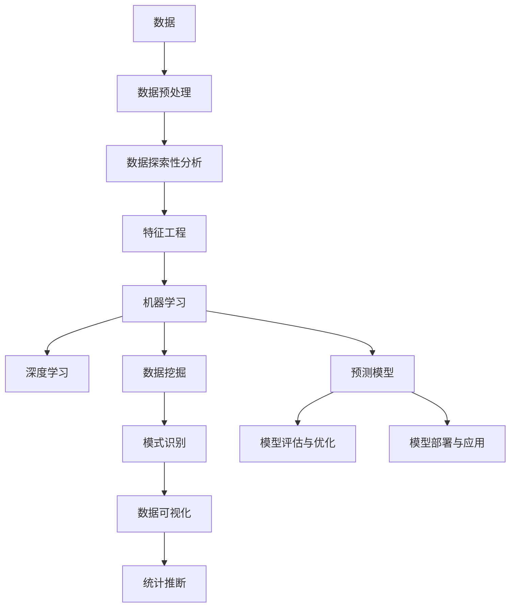
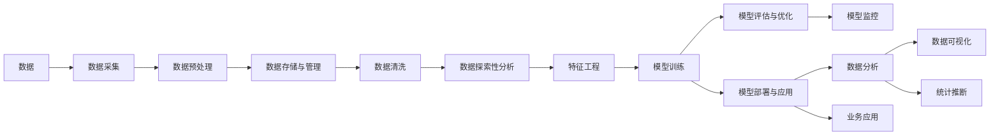

                 

# 统计学与数据科学的最新进展

> 关键词：统计学, 数据科学, 机器学习, 数据挖掘, 深度学习, 大数据分析, 人工智能

## 1. 背景介绍

### 1.1 问题由来
在过去的几十年里，统计学和数据科学迅猛发展，已经成为现代社会中不可或缺的重要组成部分。数据科学通过统计学的方法，从数据中提取有价值的信息，进而驱动决策支持、商业智能、智能系统等诸多领域的发展。随着大数据时代的到来，数据科学的技术也正不断革新，为各行各业提供了前所未有的机遇。

### 1.2 问题核心关键点
当前统计学与数据科学研究的核心问题主要集中在以下几个方面：

1. **大数据分析**：如何处理和分析海量数据，从中提取有效的知识和洞见。
2. **机器学习与深度学习**：如何通过算法学习数据规律，进行预测和分类。
3. **数据挖掘与模式识别**：如何发现数据中的潜在模式和关联性。
4. **数据可视化**：如何通过图形展示数据，帮助理解分析结果。
5. **统计推断**：如何基于样本数据推断总体特征，并进行假设检验。
6. **人工智能**：如何结合统计学与机器学习，构建智能系统和预测模型。

### 1.3 问题研究意义
在数据驱动的决策时代，统计学与数据科学对于各个领域都有着深远的影响。掌握和应用这些技术，可以帮助企业和个人提高决策的科学性、准确性和效率。统计学和数据科学的最新进展，不仅推动了技术的发展，也为各行各业带来了新的商业机遇和挑战。

## 2. 核心概念与联系

### 2.1 核心概念概述

本节将介绍一些关键概念，以便更好地理解统计学与数据科学的研究内容：

1. **统计学**：研究如何从数据中获取信息和知识，并应用这些信息来指导决策和推断。
2. **数据科学**：以统计学为基础，结合计算机科学、数据工程等，进行数据处理、分析和应用。
3. **机器学习**：一种通过算法让机器从数据中学习，自动改进性能的技术。
4. **深度学习**：一种特殊的机器学习技术，通过多层神经网络模拟人脑进行学习和决策。
5. **数据挖掘**：从大量数据中自动发现有用信息和知识的过程。
6. **模式识别**：识别数据中的模式和规律，进行分类和预测。
7. **数据可视化**：通过图形展示数据，帮助理解和解释分析结果。
8. **统计推断**：通过样本数据推断总体特征，并进行假设检验。

这些概念之间存在密切的联系。例如，数据科学离不开统计学的方法来处理和分析数据，而机器学习和深度学习则是在统计学的基础上，通过算法对数据进行学习和预测。数据挖掘和模式识别是数据科学的重要分支，通过发现数据中的模式和规律，帮助进行分类和预测。数据可视化则是将分析结果直观展示出来，以便更好地理解和决策。统计推断则是通过样本数据推断总体特征，确保分析结果的可靠性和有效性。

### 2.2 概念间的关系

通过一个Mermaid流程图，我们可以清晰地展示这些核心概念之间的关系：



这个流程图展示了从数据预处理到模型部署的整个数据科学流程，以及各个环节之间相互依赖和支撑的关系。

### 2.3 核心概念的整体架构

进一步，我们可以用以下流程图来展示统计学与数据科学的核心概念的整体架构：



这个流程图展示了统计学与数据科学的基本架构，从数据采集到业务应用的全流程。

## 3. 核心算法原理 & 具体操作步骤

### 3.1 算法原理概述
统计学与数据科学的算法可以分为以下几类：

1. **描述性统计**：通过计算均值、方差、中位数等指标，描述数据的中心趋势和分布情况。
2. **推断性统计**：基于样本数据推断总体特征，进行假设检验和置信区间计算。
3. **回归分析**：通过建立回归模型，预测因变量与自变量之间的关系。
4. **分类分析**：通过分类模型，将数据分为不同的类别。
5. **聚类分析**：将数据分成不同的组，每组内的数据相似度较高。
6. **关联分析**：发现数据中的关联规则和频繁项集。
7. **时间序列分析**：通过时间序列模型，预测未来的趋势和周期性。
8. **因子分析**：通过因子分解，提取数据中的潜在因子。

这些算法均基于不同的数学原理和统计理论，通过优化算法，如梯度下降、最大似然估计等，不断迭代优化模型的参数，以提高预测和分类的准确性。

### 3.2 算法步骤详解
以线性回归为例，展示机器学习算法的具体操作步骤：

**Step 1: 数据准备**
- 收集数据集，分为训练集和测试集。
- 清洗数据，处理缺失值和异常值。
- 特征工程，提取有用的特征。

**Step 2: 模型选择**
- 选择线性回归模型，进行参数初始化。

**Step 3: 训练模型**
- 使用梯度下降算法，不断迭代优化模型参数。
- 计算损失函数，评估模型性能。
- 进行正则化，防止过拟合。

**Step 4: 模型评估**
- 在测试集上评估模型性能。
- 使用均方误差、决定系数等指标评估模型效果。

**Step 5: 模型优化**
- 根据评估结果，调整模型参数。
- 使用交叉验证等方法，防止模型过拟合。

**Step 6: 模型应用**
- 将训练好的模型应用于新数据，进行预测或分类。

### 3.3 算法优缺点
机器学习与深度学习算法具有以下优点：

1. **自动化**：算法可以自动学习数据特征，无需手动提取。
2. **高精度**：在大数据和高维度特征的情况下，算法能够提供较高的预测精度。
3. **泛化能力强**：经过训练的模型，可以应用于新数据。

但同时，这些算法也存在一些缺点：

1. **黑箱问题**：算法模型的决策过程不透明，难以解释。
2. **过拟合**：模型容易过拟合，需要进行正则化和交叉验证等优化。
3. **计算资源消耗大**：训练和推理过程中需要大量的计算资源。

### 3.4 算法应用领域
统计学与数据科学在多个领域有着广泛的应用，例如：

1. **金融风险管理**：利用机器学习模型预测信用风险、市场波动等。
2. **医疗诊断**：通过统计方法，分析病人的健康数据，进行疾病预测和诊断。
3. **市场营销**：通过数据分析，进行市场细分、客户画像等。
4. **工业制造**：通过预测模型，优化生产流程，降低生产成本。
5. **智能交通**：通过数据分析，优化交通信号灯，减少交通拥堵。
6. **环境监测**：通过数据分析，监测环境污染，制定环保政策。

## 4. 数学模型和公式 & 详细讲解 & 举例说明

### 4.1 数学模型构建

统计学和数据科学的数学模型构建，通常包括以下几个步骤：

1. **数据收集与整理**：收集样本数据，并进行清洗和预处理。
2. **数据探索性分析**：分析数据的中心趋势、分布情况和异常值。
3. **模型选择与构建**：选择合适的统计或机器学习模型，进行模型构建。
4. **模型训练与评估**：使用训练集数据，训练模型，并使用测试集数据进行评估。
5. **模型优化与应用**：根据评估结果，调整模型参数，优化模型性能。

以线性回归模型为例，数学模型的构建如下：

$$
y = \beta_0 + \beta_1x_1 + \beta_2x_2 + \cdots + \beta_px_p + \epsilon
$$

其中，$y$ 为因变量，$x_1, x_2, \cdots, x_p$ 为自变量，$\beta_0, \beta_1, \cdots, \beta_p$ 为模型参数，$\epsilon$ 为误差项。

### 4.2 公式推导过程
线性回归模型的推导过程如下：

1. **最小二乘法**：最小化误差平方和 $\sum_{i=1}^n(y_i - \hat{y}_i)^2$，其中 $\hat{y}_i$ 为预测值。

2. **求解参数**：通过求解梯度下降方程，求解 $\beta_0, \beta_1, \cdots, \beta_p$。

3. **模型评估**：计算均方误差、决定系数等指标，评估模型效果。

### 4.3 案例分析与讲解
以房价预测为例，展示线性回归模型的应用：

1. **数据准备**：收集历史房价数据，分为训练集和测试集。
2. **特征选择**：选择影响房价的特征，如房屋面积、地理位置等。
3. **模型训练**：使用梯度下降算法，训练线性回归模型。
4. **模型评估**：在测试集上评估模型效果，计算均方误差等指标。
5. **模型优化**：根据评估结果，调整模型参数，优化模型性能。
6. **模型应用**：将训练好的模型应用于新数据，进行房价预测。

## 5. 项目实践：代码实例和详细解释说明

### 5.1 开发环境搭建
以Python为例，搭建统计学与数据科学的项目环境：

1. **安装Python和PyData库**：安装Python 3.7+，并安装pandas、numpy、scikit-learn等常用库。

2. **配置Jupyter Notebook**：安装Jupyter Notebook，设置常用库和环境变量。

3. **安装第三方库**：安装statsmodels、seaborn等第三方库，方便进行统计分析。

### 5.2 源代码详细实现
以线性回归模型为例，展示Python代码实现：

```python
import pandas as pd
from sklearn.linear_model import LinearRegression
from sklearn.metrics import mean_squared_error, r2_score
import statsmodels.api as sm

# 读取数据
data = pd.read_csv('house_prices.csv')

# 数据预处理
X = data[['area', 'location']]
y = data['price']

# 数据拆分
X_train, X_test, y_train, y_test = train_test_split(X, y, test_size=0.3, random_state=42)

# 模型训练
model = LinearRegression()
model.fit(X_train, y_train)

# 模型评估
y_pred = model.predict(X_test)
mse = mean_squared_error(y_test, y_pred)
r2 = r2_score(y_test, y_pred)

# 模型优化
new_model = sm.OLS(y, sm.add_constant(X)).fit()
new_mse = new_model.ssr / len(y)
new_r2 = new_model.rsquared

# 模型应用
new_y_pred = new_model.predict(sm.add_constant(X))
print('Original MSE:', mse, 'New MSE:', new_mse, 'R2:', r2, 'New R2:', new_r2)
```

### 5.3 代码解读与分析
以上代码展示了从数据预处理到模型评估的完整流程。主要步骤如下：

1. **数据读取与预处理**：使用pandas读取数据，并进行特征选择和拆分。
2. **模型训练**：使用scikit-learn的LinearRegression进行线性回归模型训练。
3. **模型评估**：计算均方误差和决定系数，评估模型效果。
4. **模型优化**：使用statsmodels进行模型优化，计算新的均方误差和决定系数。
5. **模型应用**：使用优化后的模型进行房价预测。

## 6. 实际应用场景

### 6.1 金融风险管理

在金融风险管理中，统计学与数据科学可以用于预测客户的违约概率、评估信贷风险等。通过收集客户的财务数据、信用历史等，利用机器学习模型进行预测，可以帮助银行和金融机构更好地管理风险，优化信贷决策。

### 6.2 医疗诊断

在医疗诊断中，统计学与数据科学可以用于预测疾病风险、诊断疾病等。通过收集病人的健康数据、病史等，利用统计方法和机器学习模型进行分析和预测，可以帮助医生更准确地诊断疾病，制定治疗方案。

### 6.3 市场营销

在市场营销中，统计学与数据科学可以用于市场细分、客户画像等。通过收集客户的购买行为、消费习惯等数据，利用数据挖掘和分类算法进行分析和建模，可以帮助企业更好地了解客户需求，制定精准的市场策略。

### 6.4 智能交通

在智能交通中，统计学与数据科学可以用于交通流量预测、优化交通信号灯等。通过收集交通数据、天气数据等，利用时间序列分析和机器学习模型进行预测和优化，可以显著减少交通拥堵，提高交通效率。

### 6.5 环境监测

在环境监测中，统计学与数据科学可以用于监测环境污染、制定环保政策等。通过收集环境数据、气象数据等，利用数据分析和机器学习模型进行分析和预测，可以帮助政府和企业更好地制定环保策略，保护环境。

## 7. 工具和资源推荐

### 7.1 学习资源推荐

1. **《统计学习方法》**：李航著，详细介绍了统计学习的基本原理和常用算法。
2. **《Python数据科学手册》**：Jake VanderPlas著，介绍了使用Python进行数据科学分析的实用技巧。
3. **《机器学习实战》**：Peter Harrington著，介绍了常用的机器学习算法和实现方法。
4. **Coursera《数据科学导论》**：由约翰霍普金斯大学开设，系统介绍了数据科学的基本概念和常用工具。
5. **Kaggle**：数据科学竞赛平台，可以参与各种数据科学项目，提高实战能力。

### 7.2 开发工具推荐

1. **Jupyter Notebook**：开源的交互式编程环境，适合数据分析和建模。
2. **RStudio**：R语言的集成开发环境，适合进行统计分析和数据科学项目开发。
3. **Tableau**：数据可视化工具，适合进行数据探索和报告制作。
4. **Scikit-learn**：Python的机器学习库，提供了丰富的机器学习算法和工具。
5. **TensorFlow**：谷歌开发的深度学习框架，适合进行深度学习模型开发和部署。

### 7.3 相关论文推荐

1. **《深度学习》**：Ian Goodfellow等著，全面介绍了深度学习的基本原理和应用。
2. **《统计学习基础》**：Tibshirani著，详细介绍了统计学习的基本原理和方法。
3. **《Python数据科学手册》**：Jake VanderPlas著，介绍了使用Python进行数据科学分析的实用技巧。
4. **《机器学习实战》**：Peter Harrington著，介绍了常用的机器学习算法和实现方法。
5. **《统计学习方法》**：李航著，详细介绍了统计学习的基本原理和常用算法。

## 8. 总结：未来发展趋势与挑战

### 8.1 研究成果总结

在过去的几年里，统计学与数据科学取得了显著的进展。机器学习、深度学习等技术不断发展，数据处理和分析能力显著提升。同时，数据科学也逐渐与其他学科融合，推动了人工智能、生物信息学、环境科学等领域的发展。

### 8.2 未来发展趋势

未来，统计学与数据科学将呈现以下几个发展趋势：

1. **自动化与智能化**：越来越多的自动化工具和算法将帮助处理和分析数据，提高工作效率。
2. **深度学习与大数据**：深度学习和大数据技术的结合将进一步提升数据分析和预测的准确性。
3. **多模态数据融合**：结合图像、文本、语音等多种数据类型，进行综合分析，提升数据的深度和广度。
4. **实时分析与预测**：通过实时数据流处理和分析，进行实时预测和决策。
5. **跨学科融合**：统计学与数据科学与其他学科的融合，推动跨学科创新和发展。

### 8.3 面临的挑战

尽管统计学与数据科学已经取得了显著进展，但在应用和发展过程中，仍然面临以下挑战：

1. **数据质量与标注成本**：高质量的数据和标注数据是数据分析和预测的基础，获取这些数据成本较高。
2. **算法透明性与可解释性**：机器学习模型往往是"黑箱"，难以解释其内部机制和决策过程。
3. **计算资源与隐私保护**：大数据和深度学习模型需要大量的计算资源和存储，同时数据隐私保护也成为一个重要问题。
4. **模型泛化性与鲁棒性**：模型需要具备良好的泛化能力和鲁棒性，避免过拟合和偏差。
5. **跨领域知识整合**：将不同领域的专业知识与数据科学方法结合，提升分析深度和广度。

### 8.4 研究展望

未来的研究将需要在以下几个方面寻求新的突破：

1. **自动化与智能化**：开发更多自动化工具和算法，提高数据处理和分析效率。
2. **深度学习与大数据**：进一步推动深度学习和大数据技术的融合，提升分析精度。
3. **跨学科融合**：与其他学科结合，推动跨学科创新和发展。
4. **算法透明性与可解释性**：开发透明和可解释的算法，提升模型的可信任性和应用范围。
5. **计算资源与隐私保护**：优化计算资源使用，保护数据隐私，提升数据安全。

## 9. 附录：常见问题与解答

### 9.1 常见问题与解答

**Q1: 什么是统计学与数据科学？**

A: 统计学与数据科学是研究如何从数据中提取知识和信息，并将其应用于决策和预测的学科。统计学侧重于数据描述和推断，数据科学侧重于数据分析和应用。

**Q2: 统计学与数据科学的应用有哪些？**

A: 统计学与数据科学在金融、医疗、市场营销、智能交通、环境监测等领域有着广泛的应用。

**Q3: 如何进行数据预处理？**

A: 数据预处理包括数据清洗、特征选择、数据拆分等步骤。常用的工具有pandas、numpy等。

**Q4: 机器学习与深度学习的区别是什么？**

A: 机器学习是一种基于数据训练的算法，能够自动学习数据规律。深度学习是一种特殊的机器学习方法，通过多层神经网络进行学习和预测。

**Q5: 如何评估模型效果？**

A: 常用的评估指标包括均方误差、决定系数、准确率、召回率等。

总之，统计学与数据科学在现代社会中发挥着越来越重要的作用。未来的发展将推动技术不断创新，推动各行业的智能化和自动化进程。

