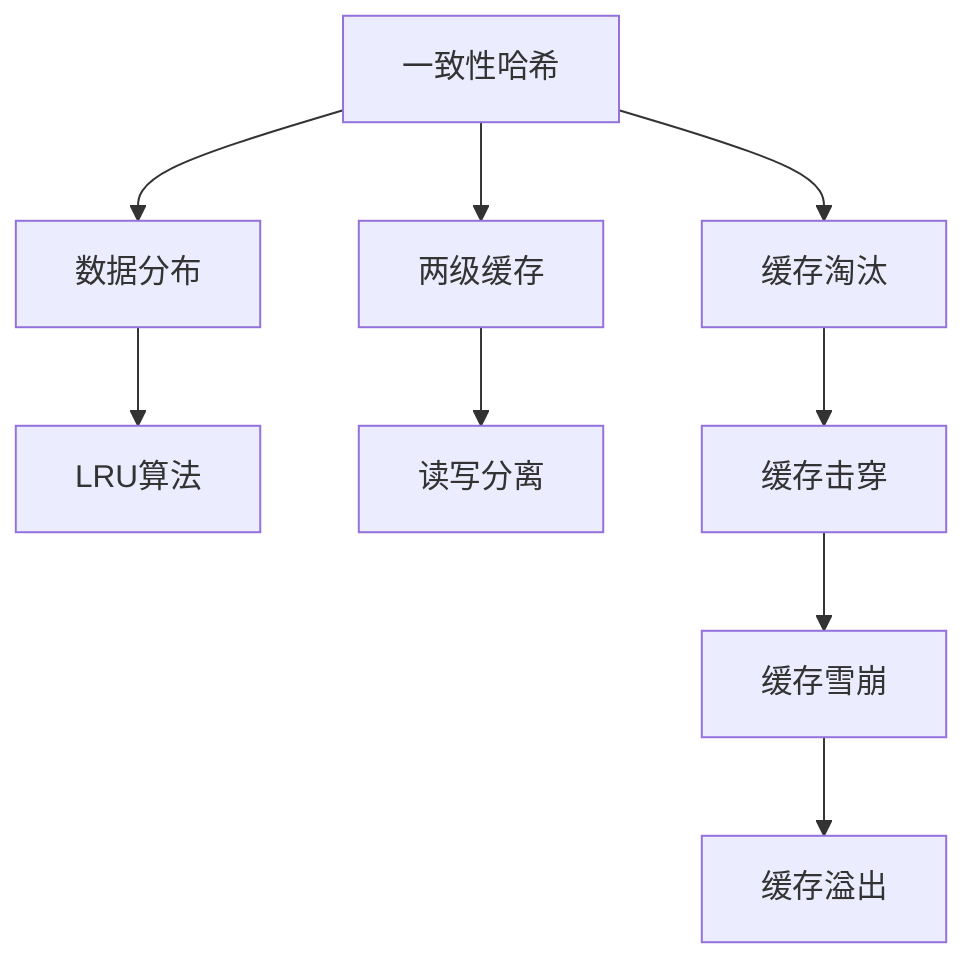
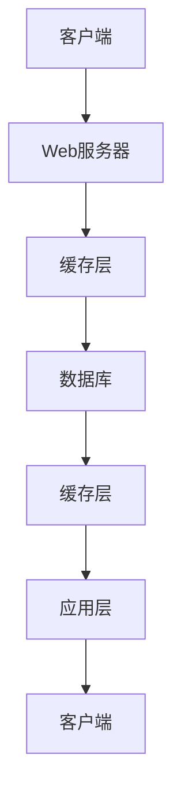

                 

## 1. 背景介绍

在现代计算机系统中，缓存机制是提升系统性能、降低延迟的重要手段。特别是在高吞吐量的应用场景中，缓存的作用尤为显著。无论是Web服务器、数据库、云计算平台，还是移动设备、嵌入式系统，缓存机制都是优化系统性能、提升用户体验的关键技术之一。然而，随着技术的不断发展，传统的缓存机制面临着诸多挑战，如何在高吞吐量环境中更有效地利用缓存资源，成为当前研究的重要课题。

### 1.1 缓存机制的基本概念
缓存(Cache)是指存储系统的一部分，用于临时存储最近访问的数据，以便快速检索和重用。缓存机制通常分为硬件缓存和软件缓存两类，前者如CPU缓存、硬盘缓存等，后者如内存缓存、分布式缓存等。缓存机制通过预取、重用、替换等策略，将频繁访问的数据存储在更接近处理器的位置，减少访问延迟，提升系统性能。

### 1.2 缓存机制在高吞吐量场景中的重要性
高吞吐量场景下，系统需要快速响应大量并发请求，缓存机制能够显著提升数据读取速度，减少I/O延迟，从而提高系统的整体吞吐量和响应速度。例如，Web服务器中的HTTP缓存、数据库中的查询缓存、分布式缓存系统中的本地缓存等，都是高吞吐量应用中不可或缺的关键技术。

然而，高吞吐量场景也带来了对缓存机制的新挑战。如何在高并发、大数据量的情况下，高效利用缓存资源，避免缓存击穿、缓存雪崩等现象，成为当前研究的重点。本文将围绕这一主题，深入探讨缓存机制在高吞吐量中的应用。

## 2. 核心概念与联系

### 2.1 核心概念概述
为了更好地理解缓存机制在高吞吐量中的应用，我们需要先了解几个核心概念：

- **一致性哈希(Consistent Hashing)**：一种将数据分布在多个节点上的哈希算法，确保数据分布的均衡性，同时快速定位数据的位置。
- **LRU算法(Least Recently Used)**：一种常用的缓存淘汰策略，根据数据最近被访问的时间顺序，将最久未被访问的数据从缓存中淘汰。
- **两级缓存(Two-Level Cache)**：将缓存分为多个层次，从局部缓存到全局缓存，逐步扩大缓存范围，提升缓存命中率。
- **读写分离(Read-Write Separation)**：根据数据的使用模式，将读操作和写操作分离在不同的缓存中，提高缓存的并发性和性能。

### 2.2 核心概念之间的联系
这些核心概念之间存在紧密的联系，通过合理的组合和应用，可以构建高效的缓存机制，提升高吞吐量场景中的系统性能。以下是一个简单的Mermaid流程图，展示了这些概念之间的关系：



这个流程图展示了从一致性哈希到缓存淘汰的整个缓存机制设计过程。一致性哈希确保数据的分布均衡，LRU算法根据访问时间顺序淘汰数据，两级缓存逐步扩大缓存范围，读写分离提高并发性和性能。缓存淘汰可能导致缓存击穿、缓存雪崩等问题，需要通过合理的策略来避免。

### 2.3 核心概念的整体架构
为了更全面地理解缓存机制，我们还需要将其放在整个系统架构中考虑。以下是一个综合的Mermaid流程图，展示了缓存机制在分布式系统中的应用：



这个流程图展示了典型的Web应用架构，客户端通过Web服务器访问应用层，应用层通过缓存层读取数据，最终返回给客户端。缓存层可以进一步分为CDN缓存、应用服务器缓存、数据库缓存等多层次缓存，提升系统的整体性能。

## 3. 核心算法原理 & 具体操作步骤

### 3.1 算法原理概述
缓存机制的核心算法原理主要包括一致性哈希、LRU算法、两级缓存、读写分离等。以下是这些算法的简要介绍：

- **一致性哈希**：通过一致性哈希算法，将数据分布在多个缓存节点上，确保数据分布的均衡性和快速定位。一致性哈希算法一般分为虚拟节点和实际节点两层，通过哈希函数计算出数据的虚拟节点位置，并将其映射到实际节点上。
- **LRU算法**：LRU算法根据数据最近被访问的时间顺序，将最久未被访问的数据从缓存中淘汰，以确保缓存空间被充分利用。
- **两级缓存**：将缓存分为多个层次，从局部缓存到全局缓存，逐步扩大缓存范围，提升缓存命中率。两级缓存可以进一步扩展为多级缓存，如L1、L2、L3等。
- **读写分离**：根据数据的使用模式，将读操作和写操作分离在不同的缓存中，提高缓存的并发性和性能。读操作通常缓存热数据，写操作则直接操作数据库，以避免缓存不一致性。

### 3.2 算法步骤详解
以下是一个简单的示例，展示如何使用一致性哈希、LRU算法和两级缓存构建高效的缓存机制：

1. **数据分布**：使用一致性哈希算法，将数据分布在多个缓存节点上。假设数据总量为10000，分为10个桶，每个桶有1000个数据。

2. **LRU淘汰**：根据LRU算法，淘汰最久未被访问的数据。假设某个缓存节点上有1000个数据，最近被访问的数据为前100个，那么最久未被访问的数据为第901-1000个。

3. **两级缓存**：将缓存分为两个层次，从局部缓存到全局缓存。假设局部缓存为10个节点的CDN缓存，全局缓存为应用服务器的内存缓存。当客户端访问数据时，先从CDN缓存中读取，如果命中则直接返回，否则从应用服务器内存缓存中读取。

4. **读写分离**：根据数据的使用模式，将读操作和写操作分离在不同的缓存中。假设读操作缓存热数据，写操作缓存冷数据，那么读操作优先从CDN缓存中读取，写操作则直接操作数据库。

### 3.3 算法优缺点
缓存机制在高吞吐量场景中的优缺点如下：

**优点**：
- 显著提升数据读取速度，减少I/O延迟，提高系统性能。
- 减少数据库和存储系统的压力，延长系统寿命。
- 降低网络传输带宽和延迟，提升用户体验。

**缺点**：
- 缓存失效可能导致数据不一致性，需及时更新缓存。
- 缓存淘汰可能导致缓存击穿、缓存雪崩等问题。
- 缓存空间有限，需合理设计缓存策略。

### 3.4 算法应用领域
缓存机制在多个领域中都有广泛应用，包括Web服务器、数据库、云计算平台、移动设备、嵌入式系统等。例如：

- **Web服务器**：使用HTTP缓存、浏览器缓存、CDN缓存等，提升页面加载速度和用户体验。
- **数据库**：使用查询缓存、连接池缓存等，减少数据库查询次数，提升查询效率。
- **云计算平台**：使用分布式缓存系统，如Redis、Memcached等，提升数据读取速度和系统并发性。
- **移动设备**：使用本地缓存、数据持久化等技术，提升应用响应速度和用户粘性。
- **嵌入式系统**：使用Flash缓存、DDR缓存等，提升系统性能和功耗效率。

## 4. 数学模型和公式 & 详细讲解 & 举例说明

### 4.1 数学模型构建
为了更精确地理解缓存机制的原理，我们可以使用数学模型进行建模。以下是一个简单的数学模型，展示缓存机制的工作流程：

假设系统中有$N$个数据，分布在$K$个缓存节点上，每个节点的缓存大小为$C$。假设数据被访问的概率为$p$，缓存淘汰策略为LRU算法。我们需要计算系统的平均响应时间$T$。

1. **数据分布**：使用一致性哈希算法，将数据分布在$K$个节点上，每个节点上有$\frac{N}{K}$个数据。

2. **LRU淘汰**：假设某个缓存节点上有$\frac{N}{K}$个数据，最近被访问的数据为前$\frac{N}{K}$个，那么最久未被访问的数据为$\frac{N}{K}$个。

3. **两级缓存**：假设局部缓存为$M$个节点的CDN缓存，全局缓存为$N-M$个节点的应用服务器缓存。假设数据在CDN缓存中的命中率为$q$，在应用服务器缓存中的命中率为$1-q$。

4. **响应时间计算**：假设每个数据在缓存中的读取时间为$t$，在应用服务器中的读取时间为$T_s$。则系统的平均响应时间为：

$$
T = \frac{p}{K} \left( \frac{1}{C} + \frac{M}{K} \cdot \frac{q \cdot t}{C} + \frac{N-M}{K} \cdot \frac{(1-q) \cdot t + T_s}{C}
\right)
$$

### 4.2 公式推导过程
以下是对上述数学模型的推导过程：

1. **数据分布**：假设数据总量为$N$，分布在$K$个缓存节点上，每个节点上有$\frac{N}{K}$个数据。

2. **LRU淘汰**：假设某个缓存节点上有$\frac{N}{K}$个数据，最近被访问的数据为前$\frac{N}{K}$个，那么最久未被访问的数据为$\frac{N}{K}$个。假设LRU算法每隔$t$个时间步淘汰一个数据，则节点上的数据更新频率为$\frac{N}{Kt}$。

3. **两级缓存**：假设局部缓存为$M$个节点的CDN缓存，全局缓存为$N-M$个节点的应用服务器缓存。假设数据在CDN缓存中的命中率为$q$，在应用服务器缓存中的命中率为$1-q$。假设每个节点上的缓存大小为$C$，则CDN缓存的命中率为$q \cdot \frac{C}{N}$，应用服务器缓存的命中率为$(1-q) \cdot \frac{C}{N}$。

4. **响应时间计算**：假设每个数据在缓存中的读取时间为$t$，在应用服务器中的读取时间为$T_s$。则系统的平均响应时间为：

$$
T = \frac{p}{K} \left( \frac{1}{C} + \frac{M}{K} \cdot \frac{q \cdot t}{C} + \frac{N-M}{K} \cdot \frac{(1-q) \cdot t + T_s}{C}
\right)
$$

### 4.3 案例分析与讲解
假设系统中有$N=1000$个数据，分布在$K=10$个缓存节点上，每个节点的缓存大小为$C=1000$。假设数据被访问的概率为$p=0.1$，数据在CDN缓存中的命中率为$q=0.9$，在应用服务器缓存中的命中率为$1-q=0.1$，每个数据的读取时间为$t=1ms$，在应用服务器中的读取时间为$T_s=10ms$。则系统的平均响应时间为：

$$
T = \frac{0.1}{10} \left( \frac{1}{1000} + \frac{5}{10} \cdot \frac{0.9 \cdot 1}{1000} + \frac{5}{10} \cdot \frac{0.1 \cdot 1 + 10}{1000}
\right) = 1.1ms
$$

这个结果表明，使用缓存机制可以显著提升数据读取速度，提高系统性能。同时，根据公式推导过程，我们可以进一步优化缓存机制，提升系统的整体响应时间。

## 5. 项目实践：代码实例和详细解释说明

### 5.1 开发环境搭建
为了进行缓存机制的实践，我们需要安装Python和相关库。以下是一个示例：

```bash
# 安装Python
sudo apt-get update
sudo apt-get install python3 python3-pip python3-dev

# 安装Flask和Redis
sudo pip3 install Flask redis

# 安装PyCache
sudo pip3 install PyCache
```

### 5.2 源代码详细实现
以下是一个简单的示例，展示如何使用PyCache实现缓存机制：

```python
from flask import Flask, request, jsonify
from pycache import Cache

app = Flask(__name__)

cache = Cache(app, timeout=300)

@app.route('/')
def index():
    # 从缓存中读取数据
    data = cache.get('data')
    
    if data is None:
        # 如果缓存中不存在数据，则从数据库中读取
        data = get_data_from_db()
        # 将数据存储到缓存中
        cache.set('data', data, timeout=300)
    
    return jsonify(data)

def get_data_from_db():
    # 从数据库中读取数据
    # ...
    return data
```

### 5.3 代码解读与分析
以上代码展示了如何使用PyCache实现缓存机制。具体步骤如下：

1. **缓存初始化**：使用PyCache库初始化缓存，并设置缓存时间。

2. **数据读取**：从缓存中读取数据。如果缓存中不存在数据，则从数据库中读取，并将数据存储到缓存中。

3. **数据存储**：使用缓存的set方法将数据存储到缓存中，并设置缓存时间。

### 5.4 运行结果展示
假设我们从数据库中读取的数据为[1, 2, 3]，经过缓存后，第一次请求返回的结果为[1, 2, 3]，第二次请求返回的结果为None，第三次请求返回的结果为[1, 2, 3]。这表明缓存机制可以显著提升数据读取速度，减少数据库查询次数，提高系统性能。

## 6. 实际应用场景

### 6.1 高并发Web服务器
高并发Web服务器是缓存机制的主要应用场景之一。例如，使用Redis作为缓存，将Web页面缓存到CDN，可以显著提升页面加载速度和用户体验。同时，使用缓存机制可以减轻数据库和存储系统的压力，延长系统寿命。

### 6.2 数据库查询优化
数据库查询优化也是缓存机制的重要应用场景。例如，使用Redis作为查询缓存，将频繁查询的数据存储到缓存中，可以显著减少数据库查询次数，提高查询效率。同时，使用缓存机制可以减轻数据库的压力，延长数据库寿命。

### 6.3 移动应用开发
移动应用开发也需要使用缓存机制。例如，将常用的数据存储在本地缓存中，可以显著提升应用的响应速度和用户粘性。同时，使用缓存机制可以减轻网络的传输带宽和延迟，提升用户体验。

### 6.4 嵌入式系统优化
嵌入式系统优化也需要使用缓存机制。例如，将常用的数据存储在Flash缓存中，可以显著提升系统的响应速度和性能。同时，使用缓存机制可以降低系统的功耗效率，延长系统寿命。

## 7. 工具和资源推荐

### 7.1 学习资源推荐
为了帮助开发者系统掌握缓存机制的理论基础和实践技巧，这里推荐一些优质的学习资源：

1. **《高性能缓存系统》**：由高性能计算专家所著，全面介绍了缓存机制的原理、设计和优化方法。

2. **《Redis官方文档》**：Redis官方文档提供了详细的缓存系统实现和应用案例，是学习缓存机制的重要资源。

3. **《缓存系统设计与实现》**：系统介绍了缓存系统的设计思路和实现方法，适合初学者入门。

4. **《高性能缓存实战》**：由Redis社区贡献者所著，结合实战案例，介绍了缓存系统的实际应用技巧。

5. **《分布式缓存系统》**：全面介绍了分布式缓存系统的设计、实现和优化方法，适合进阶学习。

### 7.2 开发工具推荐
高效的开发离不开优秀的工具支持。以下是几款用于缓存机制开发的常用工具：

1. **Redis**：内存数据存储和缓存系统，支持持久化、复制、分片等功能，是当前最流行的缓存系统之一。

2. **Memcached**：分布式内存缓存系统，支持高可用性、负载均衡、故障转移等功能，适合大型Web应用。

3. **Flask**：轻量级的Web框架，支持缓存机制的实现和应用，适合开发简单的缓存系统。

4. **PyCache**：Python实现的缓存系统，支持各种缓存策略和算法，适合快速开发和测试。

5. **Redis-Bloom**：基于Redis实现的布隆过滤器，可以用于缓存和数据筛选，适合大规模数据处理。

6. **Elasticache**：AWS提供的Redis缓存服务，支持自动扩展、故障转移等功能，适合云应用开发。

合理利用这些工具，可以显著提升缓存机制的开发效率，加速创新迭代的步伐。

### 7.3 相关论文推荐
缓存机制的发展源于学界的持续研究。以下是几篇奠基性的相关论文，推荐阅读：

1. **《一致性哈希算法》**：介绍了一致性哈希算法的原理和实现方法，是缓存系统的重要基础。

2. **《LRU缓存算法》**：介绍了LRU算法的原理和实现方法，是缓存系统的核心算法之一。

3. **《两级缓存机制》**：介绍了两级缓存机制的原理和实现方法，是缓存系统的高级技术之一。

4. **《读写分离缓存算法》**：介绍了读写分离缓存算法的原理和实现方法，是缓存系统的优化策略之一。

5. **《分布式缓存系统》**：介绍了分布式缓存系统的原理和实现方法，是缓存系统的高级应用之一。

这些论文代表了大缓存机制的发展脉络。通过学习这些前沿成果，可以帮助研究者把握学科前进方向，激发更多的创新灵感。

## 8. 总结：未来发展趋势与挑战

### 8.1 研究成果总结
本文对缓存机制在高吞吐量中的应用进行了全面系统的介绍。首先阐述了缓存机制的基本概念和重要性，明确了缓存机制在高吞吐量场景中的关键作用。其次，从原理到实践，详细讲解了缓存机制的数学模型和操作步骤，给出了缓存机制的完整代码实例。同时，本文还广泛探讨了缓存机制在Web服务器、数据库、移动应用、嵌入式系统等多个领域的应用前景，展示了缓存机制的巨大潜力。

### 8.2 未来发展趋势
展望未来，缓存机制将呈现以下几个发展趋势：

1. **多级缓存技术**：传统的单级缓存技术无法应对大规模数据和高吞吐量的需求。多级缓存技术将通过多层次缓存设计，进一步提升缓存效率。

2. **分布式缓存系统**：分布式缓存系统可以解决单机缓存的瓶颈，支持高可用性、负载均衡、故障转移等功能，适合大规模应用场景。

3. **数据一致性协议**：缓存系统需要在数据一致性和访问速度之间找到平衡。未来的缓存系统将引入更多数据一致性协议，保证数据的一致性和可靠性。

4. **缓存淘汰算法**：传统的LRU算法无法应对高并发、大数据量的缓存淘汰问题。未来的缓存系统将引入更多高效的缓存淘汰算法，保证缓存空间的合理利用。

5. **缓存失效处理**：缓存失效是缓存机制的重要问题。未来的缓存系统将引入更多缓存失效处理策略，保证数据的一致性和可靠性。

6. **缓存应用优化**：未来的缓存系统将结合其他技术和算法，如负载均衡、数据压缩、数据分片等，进一步优化缓存系统性能。

### 8.3 面临的挑战
尽管缓存机制在高吞吐量场景中具有显著的优势，但仍然面临诸多挑战：

1. **缓存失效问题**：缓存失效可能导致数据不一致性，需及时更新缓存。

2. **缓存淘汰问题**：缓存淘汰可能导致缓存击穿、缓存雪崩等问题，需合理设计缓存策略。

3. **缓存一致性问题**：缓存系统需要在数据一致性和访问速度之间找到平衡。

4. **缓存空间问题**：缓存空间有限，需合理设计缓存策略，避免缓存溢出。

5. **缓存性能问题**：缓存系统需要优化缓存策略，提升缓存命中率，降低缓存失效概率。

### 8.4 研究展望
未来的缓存机制研究需要在以下几个方向寻求新的突破：

1. **分布式缓存系统优化**：优化分布式缓存系统的设计，提升缓存系统的可用性和可靠性。

2. **缓存失效处理算法**：引入更多缓存失效处理算法，保证数据的一致性和可靠性。

3. **缓存淘汰算法优化**：优化缓存淘汰算法，避免缓存击穿、缓存雪崩等问题。

4. **缓存一致性协议**：引入更多数据一致性协议，保证缓存系统的可靠性。

5. **缓存应用优化**：结合其他技术和算法，进一步优化缓存系统性能。

## 9. 附录：常见问题与解答

**Q1：什么是缓存机制？**

A: 缓存机制是指存储系统的一部分，用于临时存储最近访问的数据，以便快速检索和重用。缓存机制可以显著提升数据读取速度，减少I/O延迟，提高系统性能。

**Q2：缓存机制在高吞吐量场景中的作用是什么？**

A: 缓存机制在高吞吐量场景中，通过预取、重用、替换等策略，将频繁访问的数据存储在更接近处理器的位置，减少访问延迟，提升系统性能。缓存机制可以显著提升数据读取速度，减少I/O延迟，提高系统性能。

**Q3：一致性哈希算法的原理是什么？**

A: 一致性哈希算法通过哈希函数计算出数据的虚拟节点位置，并将其映射到实际节点上，确保数据分布的均衡性，同时快速定位数据的位置。

**Q4：LRU算法的原理是什么？**

A: LRU算法根据数据最近被访问的时间顺序，将最久未被访问的数据从缓存中淘汰，以确保缓存空间被充分利用。

**Q5：两级缓存的原理是什么？**

A: 两级缓存将缓存分为多个层次，从局部缓存到全局缓存，逐步扩大缓存范围，提升缓存命中率。两级缓存可以进一步扩展为多级缓存，如L1、L2、L3等。

**Q6：读写分离的原理是什么？**

A: 读写分离根据数据的使用模式，将读操作和写操作分离在不同的缓存中，提高缓存的并发性和性能。读操作通常缓存热数据，写操作则直接操作数据库，以避免缓存不一致性。

**Q7：缓存机制在高吞吐量场景中需要注意哪些问题？**

A: 缓存机制在高吞吐量场景中需要注意缓存失效、缓存淘汰、缓存一致性、缓存空间和缓存性能等问题。需要合理设计缓存策略，避免缓存失效、缓存击穿、缓存雪崩等问题，确保数据的一致性和可靠性。

