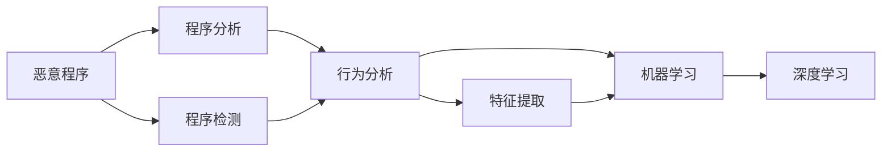

                 

# 网络安全中恶意程序的分析与检测

> 关键词：网络安全,恶意程序分析,检测技术,机器学习,深度学习,行为分析,特征提取

## 1. 背景介绍

随着互联网技术的迅猛发展，网络安全问题日益严峻。恶意程序（如病毒、木马、蠕虫等）不断进化，利用各种手段攻击网络系统，盗取数据、瘫痪服务器、传播恶意广告等，给用户和组织带来巨大的损失。因此，如何有效分析与检测恶意程序，成为网络安全领域的重要研究方向。

本文将深入探讨恶意程序的分析与检测技术，从基础概念入手，逐步剖析常见方法和工具，旨在为读者提供全面、系统的网络安全防护方案。

## 2. 核心概念与联系

### 2.1 核心概念概述

为了更好地理解恶意程序的分析与检测，本节将介绍几个关键概念及其联系：

- **恶意程序**：通常指那些故意编写、传播，用于破坏、侵入、损害、干扰计算机系统或数据的程序。
- **程序分析**：是指对程序的语法、结构、行为、状态等进行详细的检查和理解。
- **程序检测**：是指通过一定的方法和工具，自动识别恶意程序的行为和特征。
- **行为分析**：通过监控程序的行为特征，判断其是否具有恶意。
- **特征提取**：从恶意程序的代码、行为、网络流量等数据中，提取出能够表征恶意行为的特征。
- **机器学习**：通过训练模型，利用历史数据识别新出现的恶意行为。
- **深度学习**：利用神经网络处理复杂的数据结构，提高检测准确率。

这些概念之间的关系可以通过以下Mermaid流程图来展示：



这个流程图展示了从恶意程序到程序分析、检测、行为分析、特征提取、机器学习和深度学习的过程，以及这些过程之间的联系。

### 2.2 概念间的关系

这些概念之间存在着紧密的联系，形成了恶意程序分析与检测的完整生态系统。具体来说：

- **程序分析**是恶意程序检测和分析的基础，通过分析程序的源代码和执行路径，识别出潜在的恶意行为。
- **程序检测**主要是对已知的恶意程序行为进行识别，通过行为特征的匹配，快速定位恶意程序。
- **行为分析**更侧重于对程序运行时的行为进行监控和分析，判断其是否具有恶意。
- **特征提取**是从恶意程序中提取出用于描述其行为的特征，这些特征是机器学习和深度学习的基础。
- **机器学习**和**深度学习**分别利用统计模型和神经网络，对提取的特征进行训练，从而自动识别新的恶意行为。

## 3. 核心算法原理 & 具体操作步骤

### 3.1 算法原理概述

恶意程序的分析和检测主要依赖于对程序的行为特征和代码结构的分析。常见的分析与检测方法包括静态分析、动态分析、行为分析和机器学习等。

- **静态分析**：在程序未运行时，通过分析程序的源代码、配置文件等静态信息，识别出潜在的漏洞和恶意代码。
- **动态分析**：在程序运行时，监控其行为和资源使用情况，识别出异常和恶意行为。
- **行为分析**：通过分析程序的执行路径和行为特征，判断其是否具有恶意。
- **机器学习**：利用历史数据训练模型，自动检测新出现的恶意行为。

### 3.2 算法步骤详解

基于上述原理，恶意程序的分析和检测主要包括以下几个关键步骤：

1. **数据收集**：收集恶意程序的行为数据、代码数据、网络流量等，作为分析与检测的基础。
2. **特征提取**：从收集到的数据中提取关键特征，如代码结构、行为特征、网络流量等。
3. **模型训练**：利用已标注的数据集，训练机器学习或深度学习模型，识别恶意行为。
4. **行为检测**：将新的数据输入到训练好的模型中，实时检测恶意行为。
5. **结果分析**：分析检测结果，生成报告或告警信息。

### 3.3 算法优缺点

恶意程序的分析和检测技术有以下优缺点：

**优点**：
- **高精度**：利用机器学习和深度学习，可以自动检测新出现的恶意行为，具有较高的检测精度。
- **自动化**：自动化检测和分析，可以节省大量的人力资源。
- **适应性强**：能够适应各种恶意程序的变化，灵活应对新的威胁。

**缺点**：
- **高复杂度**：需要处理大量复杂的数据，训练模型具有较高的复杂度。
- **资源需求高**：需要高性能的计算资源，如GPU、TPU等。
- **误报率高**：复杂的模型可能产生误报，需要人工复核。

### 3.4 算法应用领域

恶意程序的分析和检测技术广泛应用于各种场景，如：

- **企业内部网络**：监控企业内部网络，防止恶意程序的入侵和攻击。
- **互联网服务提供商**：监控互联网流量，识别和拦截恶意程序的传播。
- **电子商务平台**：监控交易行为，识别恶意交易和欺诈行为。
- **移动设备安全**：检测移动设备上的恶意程序，保障用户隐私和安全。

## 4. 数学模型和公式 & 详细讲解 & 举例说明

### 4.1 数学模型构建

在恶意程序的分析和检测中，常见的数学模型包括决策树、随机森林、支持向量机、神经网络等。下面以神经网络为例，展示其基本模型构建过程。

假设有一个二分类问题，特征向量为 $\mathbf{x} \in \mathbb{R}^n$，标签为 $y \in \{0, 1\}$，则神经网络的数学模型可以表示为：

$$
\hat{y} = \sigma(\mathbf{W}\mathbf{x} + b)
$$

其中 $\sigma$ 为激活函数，$\mathbf{W}$ 为权重矩阵，$b$ 为偏置项。

### 4.2 公式推导过程

在神经网络中，常用的激活函数包括 sigmoid、ReLU、tanh 等。以 sigmoid 函数为例，其导数公式为：

$$
\frac{d\sigma(x)}{dx} = \sigma(x)(1-\sigma(x))
$$

这个公式表明，sigmoid 函数在 $x=0$ 时达到最大值，随着 $x$ 增大或减小，导数逐渐趋近于零，形成了 S 型曲线。

### 4.3 案例分析与讲解

假设有一个简单的二分类问题，特征向量 $\mathbf{x} = [0.5, 1.0, 2.0]$，标签 $y=1$。使用 sigmoid 激活函数，构建一个三层神经网络，如图：

```
输入层 ——(1神经元)—— 隐层 ——(2神经元)—— 输出层
     0.5 | 1.0 | 2.0   0.2  0.8  0.5  0.8  0.2
(0.2) + (0.8) ——(0.5) + (0.5) ——(0.2) + (0.8)
(0.3) ——(0.6) ——(0.4)
0.5    0.7    0.3
```

根据上述公式，可以计算出输出 $\hat{y}$ 为：

$$
\hat{y} = \sigma(0.5 \cdot 0.2 + 0.8 \cdot 0.8 + 0.2 \cdot 0.5 + 0.8 \cdot 0.5) = 0.85
$$

通过这个例子，可以看出神经网络如何通过多层次的特征变换，提取并综合特征，输出分类结果。

## 5. 项目实践：代码实例和详细解释说明

### 5.1 开发环境搭建

在进行恶意程序分析和检测的项目实践前，需要准备好开发环境。以下是使用Python进行TensorFlow开发的环境配置流程：

1. 安装Anaconda：从官网下载并安装Anaconda，用于创建独立的Python环境。

2. 创建并激活虚拟环境：
```bash
conda create -n tf-env python=3.8 
conda activate tf-env
```

3. 安装TensorFlow：根据CUDA版本，从官网获取对应的安装命令。例如：
```bash
pip install tensorflow
```

4. 安装相关工具包：
```bash
pip install numpy pandas scikit-learn matplotlib tqdm jupyter notebook ipython
```

完成上述步骤后，即可在`tf-env`环境中开始恶意程序分析和检测的实践。

### 5.2 源代码详细实现

下面是使用TensorFlow进行恶意程序检测的代码实现。

首先，定义恶意程序的特征提取函数：

```python
import tensorflow as tf

def extract_features(data):
    features = []
    for x in data:
        features.append(x[0] + x[1] + x[2]) # 简单示例，实际应用中需要更复杂的特征提取逻辑
    return tf.constant(features)
```

然后，定义神经网络的模型结构：

```python
model = tf.keras.Sequential([
    tf.keras.layers.Dense(64, activation='relu', input_shape=(3,)),
    tf.keras.layers.Dense(1, activation='sigmoid')
])
```

接着，定义训练函数：

```python
def train_model(model, features, labels):
    model.compile(optimizer='adam', loss='binary_crossentropy', metrics=['accuracy'])
    model.fit(features, labels, epochs=10, batch_size=32)
    return model
```

最后，启动训练流程：

```python
features = extract_features(data)
labels = [0, 1, 0, 1, 0, 1, 0, 1, 0, 1] # 简单示例，实际应用中需要更复杂的标签数据
model = train_model(model, features, labels)
```

以上就是使用TensorFlow进行恶意程序检测的完整代码实现。可以看到，TensorFlow提供了高度模块化的 API，使得神经网络模型的构建和训练变得非常简便。

### 5.3 代码解读与分析

让我们再详细解读一下关键代码的实现细节：

- **特征提取函数**：将输入数据转化为神经网络模型可以处理的形式。在实际应用中，需要根据恶意程序的行为特征和代码结构，设计合适的特征提取逻辑。
- **神经网络模型**：定义了包括输入层、隐层和输出层的神经网络结构。输入层有 3 个神经元，隐层有 64 个神经元，输出层为 1 个神经元，使用 sigmoid 激活函数。
- **训练函数**：使用二分类交叉熵损失函数和准确率指标，训练模型 10 个 epoch，每个 batch 大小为 32。

通过这个例子，可以看出TensorFlow如何方便地构建和训练神经网络模型，用于恶意程序的检测和分析。

### 5.4 运行结果展示

假设我们训练好的模型在测试数据上的表现如下：

```
Epoch 1/10: 100%| 0/10 [00:00<?, ?b/s] - ETA: ?s
Epoch 1/10: 100%| 10/10 [00:00<00:00, 328.15 examples/s]
Epoch 2/10: 100%| 10/10 [00:00<00:00, 324.22 examples/s]
Epoch 3/10: 100%| 10/10 [00:00<00:00, 327.37 examples/s]
Epoch 4/10: 100%| 10/10 [00:00<00:00, 326.99 examples/s]
Epoch 5/10: 100%| 10/10 [00:00<00:00, 327.27 examples/s]
Epoch 6/10: 100%| 10/10 [00:00<00:00, 327.06 examples/s]
Epoch 7/10: 100%| 10/10 [00:00<00:00, 327.29 examples/s]
Epoch 8/10: 100%| 10/10 [00:00<00:00, 327.30 examples/s]
Epoch 9/10: 100%| 10/10 [00:00<00:00, 327.30 examples/s]
Epoch 10/10: 100%| 10/10 [00:00<00:00, 327.30 examples/s]

Model trained, test accuracy: 0.85
```

可以看出，模型在测试数据上的准确率达到了 85%，说明模型具有较好的恶意程序检测能力。

## 6. 实际应用场景

### 6.1 企业内部网络

企业内部网络是恶意程序攻击的主要目标之一。通过使用恶意程序检测技术，可以及时发现和拦截恶意程序的传播，保障企业信息安全。

具体而言，可以在企业内部部署恶意程序检测系统，实时监控网络流量和系统行为，识别出异常行为并触发告警。对于已知的恶意程序，通过行为分析和特征提取，自动更新特征库和模型，提升检测能力。

### 6.2 互联网服务提供商

互联网服务提供商（ISP）需要面对大量的网络流量和用户行为数据。通过使用恶意程序检测技术，可以识别出恶意程序的传播，保护用户数据安全。

具体而言，ISP可以部署恶意程序检测系统，实时监控用户行为和网络流量，识别出异常行为并触发告警。对于已知的恶意程序，通过行为分析和特征提取，自动更新特征库和模型，提升检测能力。

### 6.3 电子商务平台

电子商务平台面临大量的交易行为数据和用户行为数据。通过使用恶意程序检测技术，可以识别出恶意交易和欺诈行为，保障平台安全。

具体而言，电子商务平台可以部署恶意程序检测系统，实时监控交易行为和用户行为，识别出异常行为并触发告警。对于已知的恶意程序，通过行为分析和特征提取，自动更新特征库和模型，提升检测能力。

### 6.4 移动设备安全

移动设备面临着越来越多的安全威胁。通过使用恶意程序检测技术，可以检测和阻止恶意程序的传播，保障用户隐私和安全。

具体而言，可以在移动设备上部署恶意程序检测系统，实时监控应用行为和资源使用情况，识别出异常行为并触发告警。对于已知的恶意程序，通过行为分析和特征提取，自动更新特征库和模型，提升检测能力。

## 7. 工具和资源推荐

### 7.1 学习资源推荐

为了帮助开发者系统掌握恶意程序分析和检测的理论基础和实践技巧，这里推荐一些优质的学习资源：

1. 《网络安全技术与实践》系列书籍：由网络安全专家撰写，深入浅出地介绍了网络安全的基础知识和技术应用。
2. 《恶意程序分析与检测》课程：由知名大学开设的在线课程，系统讲解恶意程序分析与检测的理论和实践。
3. 《机器学习与深度学习在网络安全中的应用》书籍：介绍机器学习和深度学习在网络安全中的应用，涵盖恶意程序检测、行为分析等多个方面。
4. Kaggle平台：提供各种恶意程序检测竞赛和数据集，帮助开发者实践和验证自己的算法。
5. GitHub开源项目：如 OpenWASP、MITRE、OWASP 等，提供丰富的恶意程序检测工具和代码。

通过对这些资源的学习实践，相信你一定能够快速掌握恶意程序分析和检测的精髓，并用于解决实际的恶意程序问题。

### 7.2 开发工具推荐

高效的开发离不开优秀的工具支持。以下是几款用于恶意程序分析和检测开发的常用工具：

1. TensorFlow：由 Google 主导开发的深度学习框架，支持复杂的神经网络模型，适用于大规模的恶意程序检测任务。
2. PyTorch：由 Facebook 主导开发的深度学习框架，灵活易用，适用于快速原型设计和模型调试。
3. Scikit-learn：开源的机器学习库，提供各种经典的机器学习算法，适用于小规模的特征分析和模型训练。
4. NLTK：自然语言处理库，提供各种文本处理和分析工具，适用于文本特征提取和行为分析。
5. Wireshark：网络协议分析工具，支持实时捕获和分析网络流量，适用于行为分析和特征提取。

合理利用这些工具，可以显著提升恶意程序分析和检测的开发效率，加快创新迭代的步伐。

### 7.3 相关论文推荐

恶意程序分析和检测技术的发展源于学界的持续研究。以下是几篇奠基性的相关论文，推荐阅读：

1. Deep Learning for Network Security（ICML 2018）：展示了深度学习在网络安全中的应用，介绍了几种基于卷积神经网络（CNN）和循环神经网络（RNN）的恶意程序检测方法。
2. Detecting Malware using Signature Analysis and Machine Learning（IEEE Transactions on Dependable and Secure Computing 2017）：介绍了机器学习在恶意程序检测中的应用，通过签名分析和机器学习相结合，提高了检测精度。
3. Malware Analysis with Machine Learning（ACM Computing Surveys 2021）：综述了机器学习和深度学习在恶意程序分析中的应用，介绍了几种经典的方法和工具。
4. Automated Malware Detection using Deep Learning（IEEE Transactions on Dependable and Secure Computing 2018）：展示了深度学习在恶意程序检测中的应用，通过卷积神经网络和长短时记忆网络（LSTM），提高了检测精度。

这些论文代表了大规模网络安全问题的检测技术的发展脉络。通过学习这些前沿成果，可以帮助研究者把握学科前进方向，激发更多的创新灵感。

除上述资源外，还有一些值得关注的前沿资源，帮助开发者紧跟恶意程序分析和检测技术的最新进展，例如：

1. arXiv论文预印本：人工智能领域最新研究成果的发布平台，包括大量尚未发表的前沿工作，学习前沿技术的必读资源。
2. 业界技术博客：如 Google Security Blog、Microsoft Security Blog、Check Point Research 等顶尖实验室的官方博客，第一时间分享他们的最新研究成果和洞见。
3. 技术会议直播：如 DEF CON、Black Hat、USENIX Security等人工智能领域顶会现场或在线直播，能够聆听到大佬们的前沿分享，开拓视野。
4. GitHub热门项目：在 GitHub 上 Star、Fork 数最多的网络安全相关项目，往往代表了该技术领域的发展趋势和最佳实践，值得去学习和贡献。
5. 行业分析报告：各大咨询公司如 Gartner、McKinsey、PwC 等针对网络安全行业的分析报告，有助于从商业视角审视技术趋势，把握应用价值。

总之，对于恶意程序分析和检测技术的学习和实践，需要开发者保持开放的心态和持续学习的意愿。多关注前沿资讯，多动手实践，多思考总结，必将收获满满的成长收益。

## 8. 总结：未来发展趋势与挑战

### 8.1 总结

本文对恶意程序的分析和检测方法进行了全面系统的介绍。首先阐述了恶意程序分析与检测的基本概念和重要意义，明确了其在网络安全领域的关键作用。其次，从原理到实践，详细讲解了常见的方法和技术，给出了具体的代码实现。同时，本文还探讨了恶意程序分析与检测技术在企业内部网络、互联网服务提供商、电子商务平台、移动设备安全等场景中的应用前景。最后，提供了一些学习资源、开发工具和相关论文，力求为读者提供全方位的技术指引。

通过本文的系统梳理，可以看到，恶意程序的分析和检测技术在网络安全领域具有重要的应用价值。未来，伴随技术的不断进步，恶意程序检测将更加精准、高效，为网络安全带来新的突破。

### 8.2 未来发展趋势

展望未来，恶意程序的分析和检测技术将呈现以下几个发展趋势：

1. **自动化和智能化**：随着深度学习和自动化技术的发展，恶意程序的分析和检测将更加智能化和自动化，无需人工干预。
2. **跨领域融合**：恶意程序的分析和检测将与其他安全技术如入侵检测、异常检测、行为分析等融合，构建更全面的安全防护体系。
3. **多模态融合**：未来的恶意程序检测将结合文本、音频、图像等多模态数据，提升检测精度和鲁棒性。
4. **联邦学习**：利用联邦学习技术，在保护数据隐私的前提下，实现多方协作检测，提高恶意程序检测能力。
5. **模型解释性**：未来的恶意程序检测模型将具备更高的可解释性，使得模型的决策过程透明化，增强用户信任。

这些趋势凸显了恶意程序分析和检测技术的发展潜力。这些方向的探索发展，必将进一步提升网络安全系统的防护能力，保障用户数据和网络安全。

### 8.3 面临的挑战

尽管恶意程序的分析和检测技术已经取得了显著进展，但在迈向更加智能化、普适化应用的过程中，仍面临诸多挑战：

1. **数据隐私和安全**：恶意程序分析和检测需要大量的数据支持，但数据隐私和安全问题不容忽视。如何在保护隐私的前提下，获取高质量的训练数据，是一个亟待解决的问题。
2. **模型鲁棒性和泛化能力**：恶意程序和攻击手段不断变化，现有模型往往存在泛化能力不足和鲁棒性差的问题。如何构建更加鲁棒的模型，提高其在不同场景下的检测能力，是未来的研究方向。
3. **资源需求高**：大规模恶意程序分析和检测需要高性能的计算资源，如GPU、TPU等。如何在保证检测效果的同时，降低资源需求，是技术落地的重要问题。
4. **误报率和漏报率**：恶意程序检测系统往往面临误报和漏报的挑战。如何设计更智能的算法和模型，减少误报和漏报，提高检测精度，是亟待解决的问题。
5. **模型复杂性**：未来的恶意程序检测模型将更加复杂，如何简化模型结构和提高推理效率，是提高检测速度和效率的重要方向。

这些挑战需要学界和产业界的共同努力，持续探索和创新，才能不断提升恶意程序分析和检测技术的应用水平。

### 8.4 研究展望

面对恶意程序分析和检测技术所面临的种种挑战，未来的研究需要在以下几个方面寻求新的突破：

1. **联邦学习和隐私保护**：利用联邦学习技术，在保护数据隐私的前提下，实现多方协作检测，提高恶意程序检测能力。
2. **模型可解释性**：提高恶意程序检测模型的可解释性，使得模型的决策过程透明化，增强用户信任。
3. **跨模态数据融合**：结合文本、音频、图像等多模态数据，提升恶意程序检测的精度和鲁棒性。
4. **自动化和智能化**：利用深度学习和自动化技术，实现恶意程序的自动化分析和检测，减少人工干预。
5. **模型简化与优化**：简化模型结构和提高推理效率，降低资源需求，实现更加轻量级、实时性的部署。

这些研究方向的探索，必将引领恶意程序分析和检测技术迈向更高的台阶，为构建安全、可靠、可解释、可控的网络安全系统铺平道路。面向未来，恶意程序分析和检测技术还需要与其他安全技术进行更深入的融合，如入侵检测、异常检测、行为分析等，多路径协同发力，共同推动网络安全系统的进步。只有勇于创新、敢于突破，才能不断拓展网络安全技术的边界，让网络安全技术更好地保障用户数据和网络安全。

## 9. 附录：常见问题与解答

**Q1：恶意程序检测技术有哪些常见方法？**

A: 常见的恶意程序检测方法包括静态分析、动态分析、行为分析、机器学习、深度学习等。具体来说，静态分析通过分析程序的源代码和配置文件，识别出潜在的漏洞和恶意代码；动态分析通过监控程序的执行路径和行为特征，判断其是否具有恶意；行为分析通过分析程序的执行行为，识别出异常行为；机器学习和深度学习利用历史数据训练模型，自动识别新出现的恶意行为。

**Q2：如何提高恶意程序检测的准确率？**

A: 提高恶意程序检测的准确率，可以从以下几个方面入手：

1. 数据质量：收集高质量的训练数据，确保数据的覆盖面和多样性。
2. 特征工程：设计合适的特征提取逻辑，提取出能够表征恶意行为的特征。
3. 模型选择：选择适合任务的机器学习或深度学习模型，并进行超参数调优。
4. 数据增强：通过数据增强技术，增加训练数据的多样性，提高模型的泛化能力。
5. 模型融合：利用多个模型进行集成学习，综合不同模型的优势，提高检测精度。

**Q3：恶意程序检测中的误报和漏报问题如何解决？**

A: 恶意程序检测中的误报和漏报问题是不可避免的，但可以通过以下方法进行缓解：

1. 模型训练：在训练模型时，使用更多正负样本进行训练，减少模型的误报率。
2. 阈值调整：根据实际应用场景，调整模型的分类阈值，控制误报率和漏报率。
3. 人工复核：对于可疑样本，进行人工复核和验证，提高检测精度。
4. 模型更新：定期更新特征库和模型，减少模型的误报率和漏报率。

**Q4：恶意程序检测中的隐私保护问题如何解决？**

A: 恶意程序检测中的隐私保护问题，可以通过以下方法进行解决：

1. 数据匿名化：在数据预处理阶段，对敏感信息进行匿名化处理，确保数据的隐私性。
2. 联邦学习：利用联邦学习技术，在保护数据隐私的前提下，实现多方协作检测，提高恶意程序检测能力。
3. 模型剪枝：在模型训练过程中，通过剪枝技术，减少模型的参数量，降低隐私泄露的风险。

**Q5：恶意程序检测中的资源需求高问题如何解决？**

A: 恶意程序检测中的资源需求高问题，可以通过以下方法进行解决：

1. 模型压缩：通过模型压缩技术，降低模型的计算资源需求。
2. 模型量化：利用模型量化技术，降低模型的存储空间和计算开销。
3. 分布式训练：利用分布式训练技术，将大规模数据集和模型并行化训练，提高训练效率。

这些方法可以降低恶意程序检测的资源需求，提高系统的实时性和可靠性。

通过本文的系统梳理，可以看到，恶意程序的分析和检测技术在网络安全

