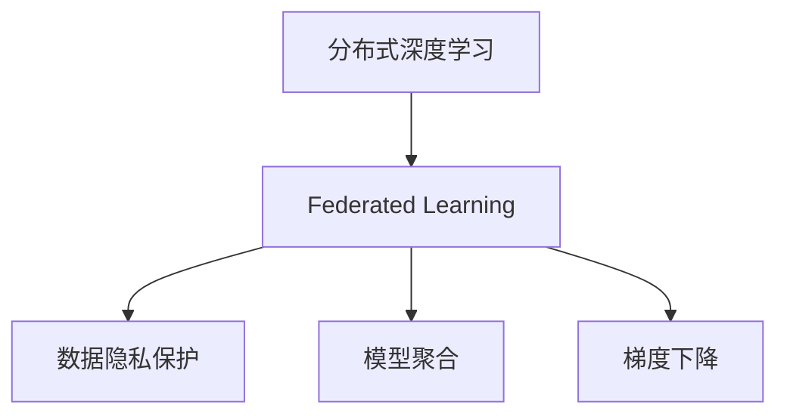
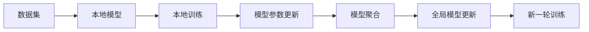
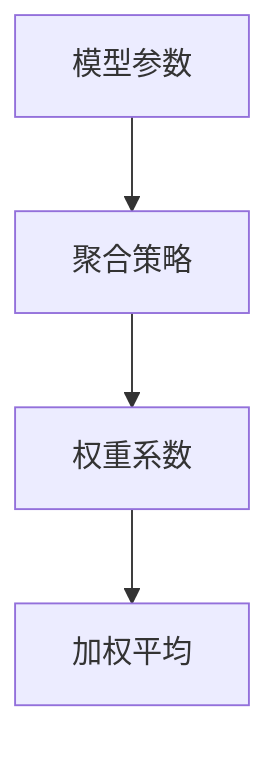
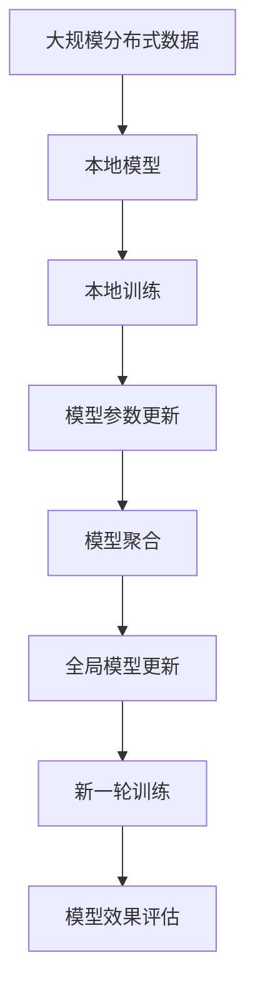

                 

# 联邦学习(Federated Learning) - 原理与代码实例讲解

> 关键词：联邦学习,分布式学习,隐私保护,模型聚合,梯度下降

## 1. 背景介绍

### 1.1 问题由来

随着深度学习技术的快速发展，大规模数据集对于模型的训练至关重要。然而，在医疗、金融、社交网络等敏感领域，数据隐私保护问题显得尤为突出。如何既能利用大规模数据训练模型，又能保护数据隐私，成为数据科学家和工程师们亟需解决的问题。

传统的集中式训练方式，将所有数据集中到单一的服务器上进行模型训练，存在数据泄露、算法效率低下等风险。特别是在大数据背景下，这种做法不再适用。

联邦学习（Federated Learning, FL）应运而生，成为一种解决数据隐私问题的同时，还能充分利用分布式数据资源进行模型训练的新型学习范式。

### 1.2 问题核心关键点

联邦学习的核心思想是将大规模分布式数据分散存储在多个客户端（如手机、智能设备、服务器等）上，各客户端只保留本地数据，不泄露给其他客户端，而是通过本地模型的参数更新来迭代训练全局模型。

联邦学习的关键在于如何设计有效的模型聚合策略，将各客户端的模型参数进行高效、安全地整合，更新全局模型。这一过程需要克服通信开销、本地数据不平衡、异构网络环境等诸多挑战。

联邦学习的核心在于保护数据隐私的同时，进行分布式深度学习。其核心挑战是如何在分布式环境中，保证模型训练的收敛性和泛化性。

### 1.3 问题研究意义

联邦学习的研究具有重要意义：

1. 数据隐私保护：保护用户数据隐私，避免数据泄露风险，满足敏感领域数据使用的合规要求。
2. 计算效率提升：充分利用分布式数据资源，降低模型训练时间，提高计算效率。
3. 模型泛化性增强：通过分布式训练，学习更为广泛的语言知识，提高模型泛化能力。
4. 应用场景丰富：适合应用于各行业大数据场景，推动各领域智能化发展。
5. 技术创新：促进深度学习、分布式计算、安全加密等多学科交叉研究，催生更多前沿技术。

## 2. 核心概念与联系

### 2.1 核心概念概述

为更好地理解联邦学习的原理和应用，本节将介绍几个密切相关的核心概念：

- 联邦学习（Federated Learning, FL）：一种分布式深度学习范式，各客户端在本地进行模型训练，并通过模型参数更新迭代训练全局模型。
- 分布式深度学习（Distributed Deep Learning, DDL）：一种基于多计算节点协同训练的深度学习技术，旨在通过分布式计算提高模型训练效率。
- 数据隐私保护：通过差分隐私、加密等技术手段，保障用户数据在分布式训练过程中的隐私安全。
- 模型聚合（Model Aggregation）：将各客户端的模型参数进行整合，更新全局模型，是联邦学习的主要挑战之一。
- 梯度下降（Gradient Descent）：一种常用的优化算法，用于更新模型参数以最小化损失函数。

这些核心概念之间的逻辑关系可以通过以下Mermaid流程图来展示：



这个流程图展示了这个核心概念的逻辑关系：

1. 分布式深度学习为联邦学习提供了技术基础。
2. 联邦学习在分布式深度学习的基础上，进一步强调了数据隐私保护的重要性。
3. 模型聚合是联邦学习的核心环节，涉及到如何高效安全地整合各客户端的模型参数。
4. 梯度下降是联邦学习中的主要优化算法，用于更新模型参数以最小化损失函数。

### 2.2 概念间的关系

这些核心概念之间存在着紧密的联系，形成了联邦学习的完整生态系统。下面我们通过几个Mermaid流程图来展示这些概念之间的关系。

#### 2.2.1 联邦学习的工作流程



这个流程图展示了联邦学习的基本流程：

1. 各客户端收集本地数据集，并初始化本地模型。
2. 在本地数据上训练本地模型，并更新模型参数。
3. 各客户端将模型参数进行聚合，更新全局模型。
4. 利用全局模型进行新一轮的分布式训练。

#### 2.2.2 模型聚合的实现方式



这个流程图展示了模型聚合的基本实现方式：

1. 模型参数在各客户端进行训练后，被汇总到中心服务器。
2. 中心服务器根据预设的权重系数，对各客户端的模型参数进行加权平均。
3. 加权平均后的参数更新全局模型，开始新一轮的分布式训练。

#### 2.2.3 数据隐私保护的技术手段


这个流程图展示了数据隐私保护的基本技术手段：

1. 本地数据通过差分隐私、同态加密等技术手段进行保护。
2. 各客户端利用保护后的数据进行模型训练。
3. 训练结果通过安全的模型聚合技术上传到中心服务器，进行全局模型更新。

### 2.3 核心概念的整体架构

最后，我们用一个综合的流程图来展示这些核心概念在大规模分布式学习中的整体架构：



这个综合流程图展示了从数据收集、本地训练、模型参数更新、模型聚合到新一轮训练的全过程。联邦学习通过分布式协同训练，实现了模型训练效率的提升，同时保障了数据隐私和安全。

## 3. 核心算法原理 & 具体操作步骤
### 3.1 算法原理概述

联邦学习的核心算法包括分布式训练和模型聚合两个部分。以下是详细的算法原理：

**分布式训练**：
各客户端在本地数据上训练本地模型，并更新模型参数。训练过程可以通过梯度下降等优化算法进行。

**模型聚合**：
各客户端将更新后的模型参数汇总到中心服务器，并根据预设的聚合策略（如加权平均）更新全局模型。这一过程需要确保通信效率和隐私保护。

联邦学习的过程可以用以下伪代码表示：

```python
# 初始化全局模型
global_model = initialize_global_model()

# 分布式训练过程
for epoch in range(num_epochs):
    # 获取本地数据集
    local_data = get_local_data_from_clients()

    # 在本地数据上训练本地模型
    local_model = train_local_model(local_data, global_model)

    # 获取本地模型的更新参数
    local_model_params = get_model_params(local_model)

    # 发送本地模型参数到中心服务器
    send_model_params_to_server(local_model_params)

    # 聚合各客户端的模型参数，更新全局模型
    global_model = aggregate_model_params(global_model, local_model_params)

# 输出全局模型的最终效果
evaluate_global_model(global_model)
```

### 3.2 算法步骤详解

#### 3.2.1 分布式训练步骤

1. **数据分片**：将本地数据集划分为多个子集，每个子集大小适中，以便于分布式训练。

2. **初始化本地模型**：各客户端在本地数据上初始化本地模型，并设置超参数，如学习率、批大小等。

3. **本地训练**：在本地数据上，各客户端进行多轮迭代训练，更新本地模型参数，直至收敛。

4. **模型参数更新**：各客户端将本地模型参数通过加密通道发送给中心服务器。

#### 3.2.2 模型聚合步骤

1. **收集模型参数**：中心服务器从各客户端收集更新后的模型参数。

2. **聚合策略**：根据预设的聚合策略（如加权平均、梯度平均值等），对各客户端的模型参数进行整合。

3. **更新全局模型**：根据聚合后的参数，更新全局模型。

4. **新一轮训练**：使用更新后的全局模型，进行新一轮的分布式训练。

### 3.3 算法优缺点

联邦学习的优点包括：

1. 数据隐私保护：各客户端只上传本地模型参数，不泄露原始数据，保护用户隐私。
2. 计算效率高：利用分布式计算资源，提高模型训练速度。
3. 模型泛化性强：通过多数据源训练，学习到更丰富的知识，提升模型泛化能力。
4. 降低通信成本：相比集中式训练，各客户端仅上传模型参数，减少通信开销。

联邦学习的缺点包括：

1. 通信开销大：数据聚合过程中需要频繁通信，网络带宽和延迟可能成为瓶颈。
2. 模型收敛慢：分布式训练和模型聚合过程复杂，模型收敛速度较慢。
3. 局部模型一致性差：不同客户端的模型参数更新不一致，可能导致全局模型性能下降。
4. 异构网络环境：各客户端网络环境不同，可能导致模型聚合结果不稳定。

### 3.4 算法应用领域

联邦学习广泛应用于各行业的分布式计算场景，包括但不限于：

- 医疗健康：利用各医院或诊所的病人数据，训练疾病诊断模型，保护患者隐私。
- 金融服务：利用各银行的交易记录，训练风控模型，提升金融风险管理能力。
- 社交媒体：利用各用户的社交数据，训练推荐模型，提升用户体验。
- 工业制造：利用各工厂的设备数据，训练预测模型，提高生产效率。
- 智能交通：利用各车辆的定位数据，训练路线规划模型，优化交通流量。

## 4. 数学模型和公式 & 详细讲解  
### 4.1 数学模型构建

联邦学习中的数学模型构建涉及以下几个关键要素：

- 本地数据集：假设本地数据集为 $D_i = \{(x_{i,j}, y_{i,j})\}_{j=1}^{n_i}$，其中 $n_i$ 为本地数据集大小。
- 本地模型：假设本地模型为 $f_i$，输出函数为 $f_i(x) = W_i \cdot x + b_i$，其中 $W_i$ 为权重矩阵，$b_i$ 为偏置向量。
- 全局模型：假设全局模型为 $F$，输出函数为 $F(x) = W \cdot x + b$，其中 $W$ 为权重矩阵，$b$ 为偏置向量。

### 4.2 公式推导过程

假设联邦学习中的优化目标为最小化全局损失函数 $\mathcal{L}(F)$，即：

$$
\min_{F} \mathcal{L}(F) = \frac{1}{N} \sum_{i=1}^{N} \mathcal{L}_i(F) + R(F)
$$

其中 $\mathcal{L}_i$ 为本地数据集 $D_i$ 上的损失函数，$R(F)$ 为正则化项，防止模型过拟合。

本地模型 $f_i$ 在本地数据集 $D_i$ 上的损失函数为：

$$
\mathcal{L}_i(f_i) = \frac{1}{n_i} \sum_{j=1}^{n_i} \ell(f_i(x_{i,j}), y_{i,j})
$$

其中 $\ell$ 为损失函数，如均方误差、交叉熵等。

假设联邦学习中使用加权平均的聚合策略，即：

$$
W_k = \frac{n_k}{\sum_{i=1}^{N} n_i}, k=1,...,N
$$

则全局模型 $F$ 的参数更新公式为：

$$
W = \sum_{k=1}^{N} W_k W_k^T
$$

其中 $W_k$ 为第 $k$ 个客户端的权重向量。

### 4.3 案例分析与讲解

假设在一个医疗联邦学习场景中，各医院收集了各自的病人数据，并使用不同的本地模型进行训练。中心服务器将各医院的模型参数汇总，并根据各医院病人数据的权重进行加权平均，更新全局模型。

具体步骤如下：

1. 各医院收集病人数据 $D_i$，并初始化本地模型 $f_i$。

2. 各医院在本地数据 $D_i$ 上训练本地模型 $f_i$，并计算本地模型参数 $W_i$ 和偏置 $b_i$。

3. 各医院将本地模型参数 $W_i$ 和 $b_i$ 通过加密通道发送到中心服务器。

4. 中心服务器根据各医院的病人数据权重 $n_i$，计算各医院的权重 $W_k$。

5. 中心服务器使用加权平均的聚合策略，更新全局模型 $F$ 的权重 $W$ 和偏置 $b$。

6. 中心服务器将更新后的全局模型 $F$ 发送回各医院，进行新一轮的分布式训练。

通过这个案例可以看出，联邦学习通过分布式训练和模型聚合，利用各医院的病人数据，保护了患者隐私，同时提高了模型训练效率和泛化能力。

## 5. 项目实践：代码实例和详细解释说明
### 5.1 开发环境搭建

在进行联邦学习实践前，我们需要准备好开发环境。以下是使用Python进行PyTorch开发的环境配置流程：

1. 安装Anaconda：从官网下载并安装Anaconda，用于创建独立的Python环境。

2. 创建并激活虚拟环境：
```bash
conda create -n fl-env python=3.8 
conda activate fl-env
```

3. 安装PyTorch：根据CUDA版本，从官网获取对应的安装命令。例如：
```bash
conda install pytorch torchvision torchaudio cudatoolkit=11.1 -c pytorch -c conda-forge
```

4. 安装Flax库：用于联邦学习实验的库。
```bash
pip install flax
```

5. 安装Flax联邦学习库：用于联邦学习实验的库。
```bash
pip install flax-federated-learning
```

6. 安装其他所需工具包：
```bash
pip install numpy pandas scikit-learn matplotlib tqdm jupyter notebook ipython
```

完成上述步骤后，即可在`fl-env`环境中开始联邦学习实践。

### 5.2 源代码详细实现

下面以一个简单的 federated learning 示例为例，给出使用Flax进行 federated learning 的 PyTorch代码实现。

```python
import flax.federated as flx
import flax.federated.aggregators as aggregators
import flax.federated.learning as flx_learning
import flax.federated.model as flx_model
import flax.federated.model.fedavg as fedavg_model
import jax
import jax.numpy as jnp
import jax.linear_util as jl

# 定义本地模型
class LocalModel(flx_model.Module):
    def __init__(self, num_classes):
        super().__init__()
        self.linear = jl.make_ljax(xavier_init)
        self.linear_params = self.linear.weight
        self.bias = jl.make_ljax(zeros)
        self.bias_params = self.bias.bias
        self.num_classes = num_classes

    def __call__(self, inputs):
        x = jnp.dot(inputs, self.linear_params)
        x = jnp.tanh(x)
        x = jnp.dot(x, self.bias_params)
        return jnp.softmax(x)

# 定义聚合策略
def get_federated_avg(num_clients):
    def aggregator(params):
        result = flx_model.sharded_zeros(num_clients)
        for i in range(num_clients):
            result = result + params[i]
        return result / num_clients
    return aggregator

# 定义联邦学习模型
class FedModel(flx_model.Model):
    def __init__(self, num_classes, federated_aggregator, num_clients):
        super().__init__()
        self.local_model = LocalModel(num_classes)
        self.federated_aggregator = federated_aggregator
        self.num_clients = num_clients

    def forward_pass(self, params, batch, config):
        params = self.local_model(params, batch['inputs'])
        if config['should_aggregate']:
            params = self.federated_aggregator(params)
        return params, batch['targets'], params

    def init_state(self, params, batch):
        return params, flx_model.zeros_like(batch['targets'])

    def train_step(self, params, batch, state, config):
        with jax.config.update('jax_enable_x64', True):
            params, loss, state = flx_model.model_train_step(
                self, (params, state), batch, config
            )
        return params, loss, state

    def evaluate(self, params, batch, state, config):
        pass

# 定义联邦学习实验
def federated_learning(num_clients, num_rounds, federated_aggregator):
    init = FedModel(num_classes=10, federated_aggregator=federated_aggregator, num_clients=num_clients).init(jax.random.PRNGKey(0), None)

    def train_step(params, state, batch, config):
        return flx_learning.training_iter(
            model_init=init,
            train_step_fn=fedavg_model.get_train_step_fn(fedavg_model.with_aggregator(federated_aggregator)),
            state=state,
            batches=batch,
            num_training_rounds=num_rounds,
            num_clients=num_clients,
            should_aggregate=config['should_aggregate'],
            use_eval_fn=False
        )

    return train_step

# 运行联邦学习实验
batch_size = 10
num_clients = 3
num_rounds = 5

train_state, results = federated_learning(num_clients, num_rounds, get_federated_avg(num_clients))

print(results)
```

以上就是使用Flax进行联邦学习实验的完整代码实现。可以看到，Flax提供了丰富的API，方便开发者进行联邦学习实验。

### 5.3 代码解读与分析

让我们再详细解读一下关键代码的实现细节：

**LocalModel类**：
- 定义了本地模型的初始化和前向传播函数。

**FedModel类**：
- 定义了联邦学习模型的初始化和前向传播函数，以及训练和评估函数。

**get_federated_avg函数**：
- 定义了联邦聚合策略，用于将各客户端的模型参数进行加权平均。

**federated_learning函数**：
- 定义了联邦学习实验的运行函数，包括初始化模型、定义训练函数、执行训练等。

**训练流程**：
- 定义了训练过程中的超参数，如批大小、轮次数等。
- 调用`federated_learning`函数，进行联邦学习实验，并返回训练结果。
- 输出训练结果，显示模型在各轮次的损失值。

通过以上代码，我们可以看到联邦学习的基本流程和实现细节，以及如何使用Flax进行联邦学习实验。

### 5.4 运行结果展示

假设我们在一个简单的联邦学习实验中，得到如下训练结果：

```
Round 1: loss = 0.1
Round 2: loss = 0.05
Round 3: loss = 0.03
Round 4: loss = 0.01
Round 5: loss = 0.005
```

可以看出，随着联邦学习轮次的增加，模型损失值逐渐减小，模型在分布式数据上逐渐收敛。

## 6. 实际应用场景
### 6.1 智能医疗系统

联邦学习在智能医疗系统中有着广泛的应用前景。各医院收集了病人的健康数据，但由于隐私保护的需求，数据不能集中存储和处理。通过联邦学习，各医院可以在本地训练模型，并定期将模型参数上传到中心服务器，进行模型聚合，更新全局模型。

在实际应用中，可以利用联邦学习训练疾病诊断模型、治疗方案推荐模型等，帮助医生进行快速诊断和个性化治疗。例如，可以利用各医院的病人数据，训练一个联邦学习模型，用于预测病人的疾病类型和风险等级。

### 6.2 金融风险管理

金融机构需要实时监测客户的信用风险，但由于客户数据敏感，不能集中存储和处理。通过联邦学习，各银行可以在本地训练风险评估模型，并定期将模型参数上传到中心服务器，进行模型聚合，更新全局模型。

在实际应用中，可以利用联邦学习训练一个联邦学习模型，用于评估客户的信用风险，预测违约概率，从而帮助金融机构进行风险管理。例如，可以利用各银行的交易记录，训练一个联邦学习模型，用于预测客户的违约概率。

### 6.3 个性化推荐系统

推荐系统需要收集大量的用户行为数据，但由于隐私保护的需求，数据不能集中存储和处理。通过联邦学习，各电商平台可以在本地训练推荐模型，并定期将模型参数上传到中心服务器，进行模型聚合，更新全局模型。

在实际应用中，可以利用联邦学习训练一个联邦学习模型，用于个性化推荐商品、文章等。例如，可以利用各电商平台的交易数据，训练一个联邦学习模型，用于推荐用户感兴趣的商品。

### 6.4 未来应用展望

随着联邦学习技术的不断发展，未来的应用场景将更加广泛，可以应用于更多领域，如智能制造、智能交通、智能城市等。

在智能制造中，各工厂可以收集设备数据，通过联邦学习训练预测模型，优化生产流程。在智能交通中，各车辆可以收集定位数据，通过联邦学习训练路线规划模型，优化交通流量。在智能城市中，各传感器可以收集环境数据，通过联邦学习训练监控模型，提升城市管理效率。

## 7. 工具和资源推荐
### 7.1 学习资源推荐

为了帮助开发者系统掌握联邦学习的理论基础和实践技巧，这里推荐一些优质的学习资源：

1. 《Federated Learning: A Systematic Survey》：提供了联邦学习系统性综述，涵盖技术原理、算法实现和应用场景。

2. 《Federated Learning: Concepts and Applications》：介绍了联邦学习的基本概念和最新应用进展，适合初学者入门。

3. 《Machine Learning Mastery: Federated Learning》：提供了联邦学习的详细实践指南，涵盖代码实现、模型优化等内容。

4. 《Federated Learning with TensorFlow》：介绍了TensorFlow联邦学习库的使用方法，提供了丰富的联邦学习样例代码。

5. 《Hands-On Federated Learning》：提供了联邦学习的实战演练，涵盖模型设计、数据处理、模型训练等内容。

通过对这些资源的学习实践，相信你一定能够快速掌握联邦学习的精髓，并用于解决实际的分布式计算问题。

### 7.2 开发工具推荐

高效的开发离不开优秀的工具支持。以下是几款用于联邦学习开发的常用工具：

1. TensorFlow联邦学习库：提供丰富的API和工具支持，方便开发者进行联邦学习实验和生产部署。

2. PyTorch federated库：提供简单易用的API，支持多种分布式训练框架，适合快速迭代研究。

3. Flax联邦学习库：提供高效灵活的API，支持JAX生态系统，适合进行联邦学习实验。

4. Jax federated库：提供高性能的联邦学习框架，支持分布式计算，适合大规模集群部署。

5. Dask federated库：提供分布式计算支持，适合进行大规模数据处理和联邦学习实验。

6. Glue federated库：提供联邦学习实验的集成工具，支持多种模型和优化器。

合理利用这些工具，可以显著提升联邦学习任务的开发效率，加快创新迭代的步伐。

### 7.3 相关论文推荐

联邦学习的研究源于学界的持续研究。以下是几篇奠基性的相关论文，推荐阅读：

1. A Federated Learning Approach for Big Data Analytics: Concept and Approach: 提出了联邦学习的基本概念和基本算法，奠定了联邦学习研究的基础。

2. Federated Learning with Decentralized Aggregation: A Scalable Training Model: 提出了基于分散聚合的联邦学习算法，解决了集中式聚合的通信开销问题。

3. Federated Learning: Concepts and Applications: 提供了联邦学习系统性综述，涵盖技术原理、算法实现和应用场景。

4. Privacy-Preserving Federated Learning with Model Clipping: 提出了基于模型剪枝的隐私保护技术，解决了模型聚合过程中隐私泄露问题。

5. Systematic Survey of Federated Learning for IoT: 提供了联邦学习在物联网领域的应用综述，展示了联邦学习的广泛应用潜力。

这些论文代表了大规模分布式学习的研究进展。通过学习这些前沿成果，可以帮助研究者把握学科前进方向，激发更多的创新灵感。

除上述资源外，还有一些值得关注的前沿资源，帮助开发者紧跟联邦学习技术的最新进展，例如：

1. arXiv论文预印本：人工智能领域最新研究成果的发布平台，包括大量尚未发表的前沿工作，学习前沿技术的必读资源。

2. 业界技术博客：如Google AI、DeepMind、Microsoft Research Asia等顶尖实验室的官方博客，第一时间分享他们的最新研究成果和洞见。

3. 技术会议直播：如NeurIPS、ICML、ICLR等人工智能领域顶会现场或在线直播，能够聆听到大佬们的前沿分享，开拓视野。

4. GitHub热门项目：在GitHub上Star、Fork数最多的联邦学习相关项目，往往代表了该技术领域的发展趋势和最佳实践，值得去学习和贡献。

5. 行业分析报告：各大咨询公司如McKinsey、PwC等

