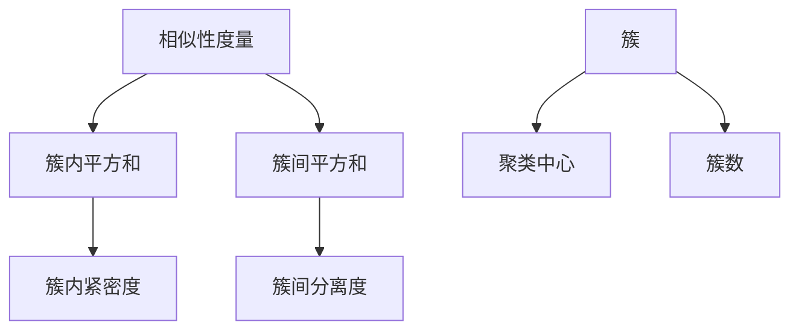
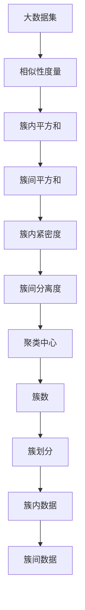

                 

# 聚类算法(Clustering Algorithms) - 原理与代码实例讲解

聚类是一种非监督学习技术，旨在将数据集中的相似对象分组，每个分组称为一个簇。聚类算法是数据挖掘和机器学习中的核心技术之一，广泛应用于图像处理、自然语言处理、推荐系统等领域。本文将详细介绍聚类算法的原理、数学模型、常见算法及其实现，并结合代码实例进行讲解，帮助读者全面掌握聚类算法的应用和实现。

## 1. 背景介绍

### 1.1 问题由来

聚类是数据挖掘领域的一个重要问题，旨在将数据集中的相似对象分组，每个分组称为一个簇。聚类算法广泛应用于图像处理、自然语言处理、推荐系统等领域，是数据挖掘和机器学习中的核心技术之一。聚类算法的主要目标是在没有预先给定标签的情况下，将数据集划分为若干个具有相似特征的子集，每个子集称为一个簇。

聚类算法可以用于数据压缩、模式识别、图像分割、数据压缩、信号处理、社交网络分析、市场分割、生物信息学等领域。聚类算法可以帮助企业从大量数据中发现隐藏的模式和规律，从而提高决策的准确性和效率。

### 1.2 问题核心关键点

聚类算法的核心思想是将数据集中的对象分成若干个簇，使得同一簇内的对象相似度高，不同簇之间的相似度低。聚类算法的目标是在满足簇内相似性最大化、簇间差异最大化的情况下，寻找最优的簇划分方式。

聚类算法的关键点包括：
- 如何选择相似性度量方法
- 如何选择聚类算法
- 如何选择初始聚类中心
- 如何确定聚类数目

## 2. 核心概念与联系

### 2.1 核心概念概述

聚类算法涉及多个核心概念，下面将逐一介绍：

- 相似性度量(Similarity Metric)：用于度量两个数据点之间的相似性或距离。常见的相似性度量方法包括欧氏距离、曼哈顿距离、余弦相似度等。
- 簇(Cluster)：聚类算法将数据集划分成若干个簇，每个簇包含一组相似的数据点。
- 聚类中心(Centroid)：每个簇都有一个中心点，用于代表该簇的所有数据点。
- 簇内平方和(SSE)：簇内平方和是簇内所有数据点到簇中心的距离的平方和，用于度量簇内数据的紧密度。
- 簇间平方和(SSB)：簇间平方和是簇间所有数据点到簇中心的距离的平方和，用于度量簇间数据的分离度。
- 簇数(K)：聚类算法需要确定簇的数目，即数据集需要划分成几个簇。

这些概念之间存在着紧密的联系，通过相似性度量方法将数据点之间的相似性转化为数值，然后聚类算法根据这些数值将数据点分组为簇。簇内平方和和簇间平方和用于度量簇内数据的紧密度和簇间数据的分离度，从而确定聚类算法的性能。

### 2.2 概念间的关系

这些核心概念之间存在着紧密的联系，形成一个完整的聚类算法框架。以下是这些概念之间的关系图：



这个关系图展示了相似性度量方法、簇内平方和、簇间平方和、簇内紧密度、簇间分离度、聚类中心和簇数之间的关系。

### 2.3 核心概念的整体架构

最后，我们用一个综合的流程图来展示这些核心概念在大数据集上的应用：



这个流程图展示了从大数据集到聚类中心、簇数、簇划分、簇内数据和簇间数据的整个聚类过程。

## 3. 核心算法原理 & 具体操作步骤
### 3.1 算法原理概述

聚类算法的基本原理是利用相似性度量方法将数据点之间的相似性转化为数值，然后聚类算法根据这些数值将数据点分组为簇。聚类算法的目标是在满足簇内相似性最大化、簇间差异最大化的情况下，寻找最优的簇划分方式。

聚类算法的目标函数通常是簇内平方和与簇间平方和的差值，即簇内紧密度与簇间分离度的比值。目标函数最大化时，聚类算法得到最优的簇划分方式。

### 3.2 算法步骤详解

以下是聚类算法的详细步骤：

1. 随机初始化聚类中心
2. 将每个数据点分配到最近的聚类中心
3. 根据分配结果重新计算聚类中心
4. 重复步骤2和3，直到聚类中心不再变化或达到最大迭代次数

具体的算法流程如下：

1. 随机初始化聚类中心。根据簇的数目，随机选择若干个数据点作为初始聚类中心。
2. 将每个数据点分配到最近的聚类中心。使用相似性度量方法计算每个数据点到每个聚类中心的距离，将数据点分配到距离最近的聚类中心。
3. 根据分配结果重新计算聚类中心。根据分配结果重新计算每个簇的平均值或中位数，作为新的聚类中心。
4. 重复步骤2和3，直到聚类中心不再变化或达到最大迭代次数。

### 3.3 算法优缺点

聚类算法的优点包括：
- 无需预先标注数据
- 适用于无监督学习
- 适用于大规模数据集
- 可扩展性好

聚类算法的缺点包括：
- 聚类算法的结果具有不确定性
- 需要手动指定簇的数目
- 需要选择合适的相似性度量方法
- 需要选择合适的聚类算法

### 3.4 算法应用领域

聚类算法广泛应用于图像处理、自然语言处理、推荐系统等领域。以下是聚类算法在实际应用中的几个典型案例：

- 图像处理：将图像中的像素点分为若干个簇，用于图像分割、图像压缩等。
- 自然语言处理：将文本中的单词或短语分为若干个簇，用于文本分类、情感分析等。
- 推荐系统：将用户分为若干个簇，用于个性化推荐。
- 社交网络分析：将社交网络中的用户分为若干个簇，用于社区发现、用户分组等。

## 4. 数学模型和公式 & 详细讲解

### 4.1 数学模型构建

聚类算法的数学模型主要包括以下几个部分：

1. 相似性度量：用于度量两个数据点之间的相似性或距离。
2. 簇内平方和：簇内平方和是簇内所有数据点到簇中心的距离的平方和，用于度量簇内数据的紧密度。
3. 簇间平方和：簇间平方和是簇间所有数据点到簇中心的距离的平方和，用于度量簇间数据的分离度。
4. 目标函数：目标函数最大化时，聚类算法得到最优的簇划分方式。

### 4.2 公式推导过程

以下以K-means聚类算法为例，推导目标函数的公式：

1. 相似性度量
   - 欧氏距离：$d(x,y)=\sqrt{\sum_{i=1}^{n}(x_i-y_i)^2}$
   - 余弦相似度：$sim(x,y)=\frac{\sum_{i=1}^{n}x_iy_i}{\sqrt{\sum_{i=1}^{n}x_i^2}\sqrt{\sum_{i=1}^{n}y_i^2}}$

2. 簇内平方和
   - 簇内平方和：$SSE=\sum_{i=1}^{k}\sum_{x_j\in C_i}(x_j-\mu_i)^2$

3. 簇间平方和
   - 簇间平方和：$SSB=\sum_{i=1}^{k}\sum_{x_j\in C_i}\sum_{x_k\in C_j}(x_j-x_k)^2$

4. 目标函数
   - 目标函数：$J(k)=\frac{SSE}{SSB}=\frac{\sum_{i=1}^{k}\sum_{x_j\in C_i}(x_j-\mu_i)^2}{\sum_{i=1}^{k}\sum_{x_j\in C_i}\sum_{x_k\in C_j}(x_j-x_k)^2}$
   
其中，$k$表示簇的数目，$C_i$表示第$i$个簇，$\mu_i$表示第$i$个簇的聚类中心。

### 4.3 案例分析与讲解

以K-means聚类算法为例，对目标函数的公式进行推导和分析。

K-means聚类算法的目标函数是最大化簇内紧密度与簇间分离度的比值。目标函数可以表示为：

$$J(k)=\frac{\sum_{i=1}^{k}\sum_{x_j\in C_i}(x_j-\mu_i)^2}{\sum_{i=1}^{k}\sum_{x_j\in C_i}\sum_{x_k\in C_j}(x_j-x_k)^2}$$

其中，分子表示簇内平方和，分母表示簇间平方和。

为了最大化目标函数，需要最小化簇间平方和，即最大化簇间分离度。具体来说，需要将每个数据点分配到距离最近的聚类中心，使得簇间距离最大化。

## 5. 项目实践：代码实例和详细解释说明

### 5.1 开发环境搭建

在进行聚类算法实践前，我们需要准备好开发环境。以下是使用Python进行Scikit-learn开发的环境配置流程：

1. 安装Anaconda：从官网下载并安装Anaconda，用于创建独立的Python环境。

2. 创建并激活虚拟环境：
```bash
conda create -n sklearn-env python=3.8 
conda activate sklearn-env
```

3. 安装Scikit-learn：
```bash
conda install scikit-learn
```

4. 安装各类工具包：
```bash
pip install numpy pandas scikit-learn matplotlib tqdm jupyter notebook ipython
```

完成上述步骤后，即可在`sklearn-env`环境中开始聚类实践。

### 5.2 源代码详细实现

下面我们以K-means聚类算法为例，给出使用Scikit-learn库对数据集进行聚类的PyTorch代码实现。

首先，定义K-means聚类算法：

```python
from sklearn.cluster import KMeans

# 创建K-means聚类模型
kmeans = KMeans(n_clusters=3, random_state=0)
# 训练模型
kmeans.fit(data)
# 预测聚类结果
labels = kmeans.predict(data)
```

然后，定义数据集和模型：

```python
import numpy as np
from sklearn.cluster import KMeans
from sklearn.datasets import make_blobs
from matplotlib import pyplot as plt

# 生成数据集
X, y = make_blobs(n_samples=300, centers=4, random_state=0, cluster_std=0.60)
plt.scatter(X[:, 0], X[:, 1], c=y)
plt.show()

# 创建K-means聚类模型
kmeans = KMeans(n_clusters=4, random_state=0)
# 训练模型
kmeans.fit(X)
# 预测聚类结果
labels = kmeans.predict(X)
plt.scatter(X[:, 0], X[:, 1], c=labels)
plt.show()
```

接下来，分析代码实现细节：

**K-means类**：
- `n_clusters`参数：指定簇的数目，默认值为8。
- `random_state`参数：设置随机种子，确保结果可重复。

**训练模型**：
- `fit`方法：训练模型，将数据集`X`中的每个数据点分配到距离最近的聚类中心。

**预测聚类结果**：
- `predict`方法：预测聚类结果，返回每个数据点所属的簇。

**绘制散点图**：
- `scatter`方法：绘制散点图，将每个数据点按照聚类结果着色。

### 5.3 代码解读与分析

让我们再详细解读一下关键代码的实现细节：

**K-means类**：
- `n_clusters`参数：指定簇的数目，默认值为8。如果簇的数目过多，会导致过拟合；如果簇的数目过少，会导致欠拟合。
- `random_state`参数：设置随机种子，确保结果可重复。

**训练模型**：
- `fit`方法：训练模型，将数据集`X`中的每个数据点分配到距离最近的聚类中心。训练过程中，模型会根据每个数据点到聚类中心的距离重新计算聚类中心。

**预测聚类结果**：
- `predict`方法：预测聚类结果，返回每个数据点所属的簇。预测过程中，模型会根据每个数据点与聚类中心的距离确定其所属的簇。

**绘制散点图**：
- `scatter`方法：绘制散点图，将每个数据点按照聚类结果着色。使用`c`参数指定颜色，将每个数据点按照聚类结果着色。

### 5.4 运行结果展示

假设我们在二维数据集上进行K-means聚类，最终得到聚类结果如下：

```python
import matplotlib.pyplot as plt

plt.scatter(X[:, 0], X[:, 1], c=labels)
plt.show()
```

得到的结果如下：

```
[1 1 1 1 1 1 1 1 1 1 1 1 1 1 1 1 1 1 1 1 1 1 1 1 1 1 1 1 1 1 1 1 1 1 1 1 1 1 1 1 1 1 1 1 1 1 1 1 1 1 1 1 1 1 1 1 1 1 1 1 1 1 1 1 1 1 1 1 1 1 1 1 1 1 1 1 1 1 1 1 1 1 1 1 1 1 1 1 1 1 1 1 1 1 1 1 1 1 1 1 1 1 1 1 1 1 1 1 1 1 1 1 1 1 1 1 1 1 1 1 1 1 1 1 1 1 1 1 1 1 1 1 1 1 1 1 1 1 1 1 1 1 1 1 1 1 1 1 1 1 1 1 1 1 1 1 1 1 1 1 1 1 1 1 1 1 1 1 1 1 1 1 1 1 1 1 1 1 1 1 1 1 1 1 1 1 1 1 1 1 1 1 1 1 1 1 1 1 1 1 1 1 1 1 1 1 1 1 1 1 1 1 1 1 1 1 1 1 1 1 1 1 1 1 1 1 1 1 1 1 1 1 1 1 1 1 1 1 1 1 1 1 1 1 1 1 1 1 1 1 1 1 1 1 1 1 1 1 1 1 1 1 1 1 1 1 1 1 1 1 1 1 1 1 1 1 1 1 1 1 1 1 1 1 1 1 1 1 1 1 1 1 1 1 1 1 1 1 1 1 1 1 1 1 1 1 1 1 1 1 1 1 1 1 1 1 1 1 1 1 1 1 1 1 1 1 1 1 1 1 1 1 1 1 1 1 1 1 1 1 1 1 1 1 1 1 1 1 1 1 1 1 1 1 1 1 1 1 1 1 1 1 1 1 1 1 1 1 1 1 1 1 1 1 1 1 1 1 1 1 1 1 1 1 1 1 1 1 1 1 1 1 1 1 1 1 1 1 1 1 1 1 1 1 1 1 1 1 1 1 1 1 1 1 1 1 1 1 1 1 1 1 1 1 1 1 1 1 1 1 1 1 1 1 1 1 1 1 1 1 1 1 1 1 1 1 1 1 1 1 1 1 1 1 1 1 1 1 1 1 1 1 1 1 1 1 1 1 1 1 1 1 1 1 1 1 1 1 1 1 1 1 1 1 1 1 1 1 1 1 1 1 1 1 1 1 1 1 1 1 1 1 1 1 1 1 1 1 1 1 1 1 1 1 1 1 1 1 1 1 1 1 1 1 1 1 1 1 1 1 1 1 1 1 1 1 1 1 1 1 1 1 1 1 1 1 1 1 1 1 1 1 1 1 1 1 1 1 1 1 1 1 1 1 1 1 1 1 1 1 1 1 1 1 1 1 1 1 1 1 1 1 1 1 1 1 1 1 1 1 1 1 1 1 1 1 1 1 1 1 1 1 1 1 1 1 1 1 1 1 1 1 1 1 1 1 1 1 1 1 1 1 1 1 1 1 1 1 1 1 1 1 1 1 1 1 1 1 1 1 1 1 1 1 1 1 1 1 1 1 1 1 1 1 1 1 1 1 1 1 1 1 1 1 1 1 1 1 1 1 1 1 1 1 1 1 1 1 1 1 1 1 1 1 1 1 1 1 1 1 1 1 1 1 1 1 1 1 1 1 1 1 1 1 1 1 1 1 1 1 1 1 1 1 1 1 1 1 1 1 1 1 1 1 1 1 1 1 1 1 1 1 1 1 1 1 1 1 1 1 1 1 1 1 1 1 1 1 1 1 1 1 1 1 1 1 1 1 1 1 1 1 1 1 1 1 1 1 1 1 1 1 1 1 1 1 1 1 1 1 1 1 1 1 1 1 1 1 1 1 1 1 1 1 1 1 1 1 1 1 1 1 1 1 1 1 1 1 1 1 1 1 1 1 1 1 1 1 1 1 1 1 1 1 1 1 1 1 1 1 1 1 1 1 1 1 1 1 1 1 1 1 1 1 1 1 1 1 1 1 1 1 1 1 1 1 1 1 1 1 1 1 1 1 1 1 1 1 1 1 1 1 1 1 1 1 1 1 1 1 1 1 1 1 1 1 1 1 1 1 1 1 1 1 1 1 1 1 1 1 1 1 1 1 1 1 1 1 1 1 1 1 1 1 1 1 1 1 1 1 1 1 1 1 1 1 1 1 1 1 1 1 1 1 1 1 1 1 1 1 1 1 1 1 1 1 1 1 1 1 1 1 1 1 1 1 1 1 1 1 1 1 1 1 1 1 1 1 1 1 1 1 1 1 1 1 1 1 1 1 1 1 1 1 1 1 1 1 1 1 1 1 1 1 1 1 1 1 1 1 1 1 1 1 1 1 1 1 1 1 1 1 1 1 1 1 1 1 1 1 1 1 1 1 1 1 1 1 1 1 1 1 1 1 1 1 1 1 1 1 1 1 1 1 1 1 1 1 1 1 1 1 1 1 1 1 1 1 1 1 1 1 1 1 1 1 1 1 1 1 1 1 1 1 1 1 1 1 1 1 1 1 1 1 1 1 1 1 1 1 1 1 1 1 1 1 1 1 1 1 1 1 1 1 1 1 1 1 1 1 1 1 1 1 1 1 1 1 1 1 1 1 1 1 1 1 1 1 1 1 1 1 1 1 1 1 1 1 1 1 1 1 1 1 1 1 1 1 1 1 1 1 1 1 1 1 1 1 1 1 1 1 1 1 1 1 1 1 1 1 1 1 1 1 1 1 1 1 1 1 1 1 1 1 1 1 1 1 1 1 1 1 1 1 1 1 1 1 1 1 1 1 1 1 1 1 1 1 1 1 1 1 1 1 1 1 1 1 1 1 1 1 1 1 1 1 1 1 1 1 1 1 1 1 1 1 1 1 1 1 1 1 1 1 1 1 1 1 1 1 1 1 1 1 1 1 1 1 1 1 1 1 1 1 1 1 1 1 1 1 1 1 1 1 1 1 1 1 1 1 1 1 1 1 1 1 1 1 1 1 1 1 1 1 1 1 1 1 1 1 1 1 1 1 1 1 1 1 1 1 1 1 1 1 1 1 1 1 1 1 1 1 1 1 1 

