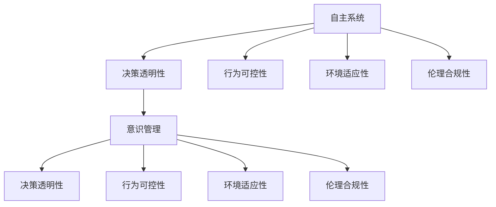
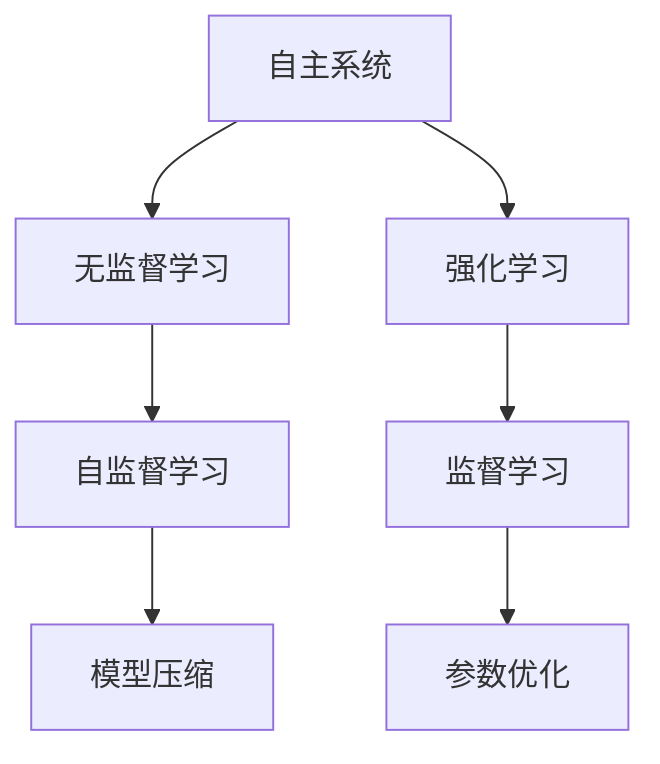
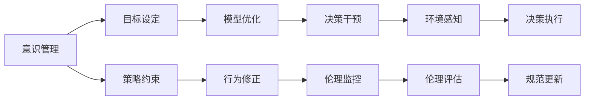
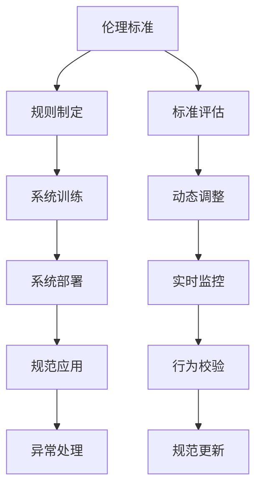
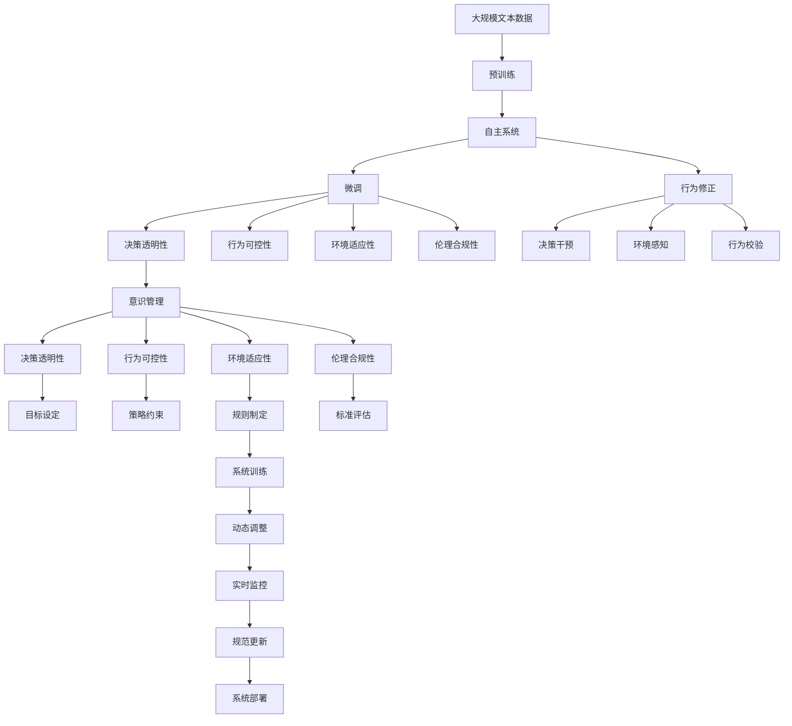

                 

## 1. 背景介绍

随着人工智能技术的不断发展，自主系统(Autonomous Systems)在各行业中的应用越来越广泛。从自动驾驶汽车、智能制造到智慧城市，自主系统正在改变我们的生活方式。然而，由于缺乏有效的意识管理机制，这些系统在决策过程中可能会产生不可预测的行为，甚至危及人类安全。因此，如何将自主系统与意识管理相结合，成为当前人工智能研究的重要课题。

### 1.1 问题由来

自主系统的核心是机器学习算法和控制系统，能够根据环境反馈进行决策和行动。但这些决策和行动是否合理、安全，往往缺乏明确的评价标准和控制机制。一些自主系统在无人驾驶、自动化手术等场景中，由于对突发情况的判断失误，导致严重的安全事故。例如，特斯拉Autopilot系统曾多次发生自动驾驶事故，引发对自主系统安全性的广泛关注。

### 1.2 问题核心关键点

自主系统面临的核心问题是如何在保证高精度决策的同时，确保系统的安全性、可靠性以及可解释性。具体而言，需要考虑以下几个方面：

1. **决策透明性**：自主系统的决策过程是否可解释，是否能够让人类理解。
2. **行为可控性**：系统是否能够根据设定的目标和约束条件进行行为控制。
3. **环境适应性**：系统是否能够在复杂、动态的环境中有效运行，避免误判和过拟合。
4. **伦理合规性**：系统在决策过程中是否符合伦理标准和社会规范。

### 1.3 问题研究意义

研究自主系统与意识管理相结合，对于提升人工智能系统的安全性和可靠性，推动其在实际应用中的普及，具有重要意义：

1. **提高决策透明度**：通过意识管理机制，可以显著提升系统的决策透明度，减少意外行为的发生。
2. **增强行为可控性**：意识管理机制可以有效约束系统的行为，确保其符合预设目标和约束。
3. **提高环境适应性**：系统在复杂环境下，通过持续学习不断调整决策策略，增强其适应性。
4. **保障伦理合规性**：意识管理机制可以引入伦理标准，避免系统决策违反社会规范和伦理准则。

## 2. 核心概念与联系

### 2.1 核心概念概述

为更好地理解自主系统与意识管理的结合，本节将介绍几个密切相关的核心概念：

- **自主系统(Autonomous Systems)**：指无需人类干预，通过算法和传感器自主进行决策和行动的系统，如自动驾驶汽车、无人机、智能制造等。
- **意识管理(Consciousness Management)**：指通过引入外部干预机制，对自主系统的决策和行为进行约束和引导，确保系统行为符合预期的伦理标准和社会规范。
- **决策透明性(Decision Transparency)**：指自主系统在决策过程中，能够提供清晰的决策依据和过程，便于人类理解和监督。
- **行为可控性(Behavioral Controlability)**：指系统能够根据预设的目标和约束条件，进行行为控制和调整。
- **环境适应性(Environmental Adaptability)**：指系统能够在复杂、动态的环境中，根据环境反馈进行动态调整，适应新的任务需求。
- **伦理合规性(Ethical Compliance)**：指系统在决策过程中，符合伦理标准和社会规范，避免对人类和环境造成伤害。

这些核心概念之间的逻辑关系可以通过以下Mermaid流程图来展示：



这个流程图展示了大语言模型与意识管理的核心概念及其关系：

1. 自主系统通过决策透明性、行为可控性、环境适应性、伦理合规性等机制，在意识管理的作用下，实现了与外部环境的和谐共存。
2. 意识管理通过引入外部干预，对自主系统进行约束和引导，确保其符合伦理和社会规范。
3. 决策透明性、行为可控性、环境适应性、伦理合规性等机制，在意识管理的作用下，得到了进一步的强化和完善。

### 2.2 概念间的关系

这些核心概念之间存在着紧密的联系，形成了自主系统与意识管理结合的完整生态系统。下面我通过几个Mermaid流程图来展示这些概念之间的关系。

#### 2.2.1 自主系统的学习范式



这个流程图展示了自主系统的主要学习范式，包括无监督学习、强化学习和监督学习。无监督学习通过自监督任务提升系统特征抽取能力；强化学习通过与环境的互动，优化系统决策策略；监督学习通过有标签数据，进一步提升系统性能。同时，模型压缩和参数优化等技术，可以进一步提升系统的计算效率和鲁棒性。

#### 2.2.2 意识管理与自主系统的关系



这个流程图展示了意识管理与自主系统的关系。意识管理通过目标设定、策略约束、模型优化等机制，对自主系统进行约束和引导。行为修正、决策干预、伦理监控等机制，在意识管理的作用下，进一步强化了自主系统的行为可控性和伦理合规性。

#### 2.2.3 自主系统的伦理标准



这个流程图展示了自主系统的伦理标准及其在意识管理中的应用。伦理标准通过规则制定和标准评估，对系统进行伦理约束。在系统训练和部署过程中，伦理标准通过实时监控和行为校验，进一步保障系统的伦理合规性。动态调整和规范更新机制，确保伦理标准能够适应不断变化的社会规范和技术进步。

### 2.3 核心概念的整体架构

最后，我们用一个综合的流程图来展示这些核心概念在大语言模型与意识管理结合过程中的整体架构：



这个综合流程图展示了从预训练到微调，再到意识管理，最终部署的完整过程。自主系统在预训练过程中，通过学习大规模文本数据，获得丰富的语言知识。在微调过程中，引入意识管理机制，通过目标设定、策略约束、规则制定等，进一步优化系统的决策过程。在实际应用中，系统通过行为修正、决策干预、环境感知等机制，增强其行为可控性和环境适应性。同时，通过伦理监控、行为校验等，确保系统的伦理合规性。

通过这些流程图，我们可以更清晰地理解自主系统与意识管理结合过程中各个核心概念的关系和作用，为后续深入讨论具体的意识管理方法和技术奠定基础。

## 3. 核心算法原理 & 具体操作步骤
### 3.1 算法原理概述

自主系统与意识管理结合的核心思想是通过意识管理机制，对自主系统的决策和行为进行约束和引导，确保其符合预期的伦理标准和社会规范。具体而言，意识管理机制通过目标设定、策略约束、规则制定、标准评估等手段，对自主系统进行约束和引导。在系统的决策和行为过程中，通过实时监控和行为校验，进一步强化系统的伦理合规性和行为可控性。

### 3.2 算法步骤详解

基于自主系统与意识管理结合的算法步骤如下：

**Step 1: 准备预训练模型和数据集**
- 选择合适的预训练语言模型，如BERT、GPT等。
- 准备与系统任务相关的标注数据集，包括训练集、验证集和测试集。

**Step 2: 设计任务适配层**
- 根据任务类型，设计合适的任务适配层，如分类器、回归器等。
- 确定模型输出格式和损失函数，如交叉熵损失、均方误差损失等。

**Step 3: 设置微调超参数**
- 选择合适的优化算法及其参数，如Adam、SGD等，设置学习率、批大小、迭代轮数等。
- 设置正则化技术及强度，包括权重衰减、Dropout、Early Stopping等。
- 确定冻结预训练参数的策略，如仅微调顶层，或全部参数都参与微调。

**Step 4: 执行梯度训练**
- 将训练集数据分批次输入模型，前向传播计算损失函数。
- 反向传播计算参数梯度，根据设定的优化算法和学习率更新模型参数。
- 周期性在验证集上评估模型性能，根据性能指标决定是否触发Early Stopping。
- 重复上述步骤直到满足预设的迭代轮数或Early Stopping条件。

**Step 5: 添加意识管理机制**
- 引入目标设定机制，明确系统决策的目标和约束条件。
- 引入策略约束机制，通过规则和策略对系统行为进行约束。
- 引入标准评估机制，对系统决策和行为进行实时监控和评估。
- 引入动态调整机制，根据评估结果动态调整系统策略和行为。

**Step 6: 测试和部署**
- 在测试集上评估微调后模型和意识管理机制的联合效果，对比微调前后的性能提升。
- 使用微调后的模型和意识管理机制对新样本进行推理预测，集成到实际的应用系统中。
- 持续收集新的数据，定期重新微调模型和调整意识管理机制，以适应数据分布的变化。

以上是基于自主系统与意识管理结合的微调方法的一般流程。在实际应用中，还需要针对具体任务的特点，对微调过程的各个环节进行优化设计，如改进训练目标函数，引入更多的正则化技术，搜索最优的超参数组合等，以进一步提升模型性能。

### 3.3 算法优缺点

自主系统与意识管理结合的微调方法具有以下优点：

1. 提升决策透明度：通过意识管理机制，可以显著提升系统的决策透明度，减少意外行为的发生。
2. 增强行为可控性：意识管理机制可以有效约束系统的行为，确保其符合预设目标和约束。
3. 提高环境适应性：系统在复杂环境下，通过持续学习不断调整决策策略，增强其适应性。
4. 保障伦理合规性：意识管理机制可以引入伦理标准，避免系统决策违反社会规范和伦理准则。

同时，该方法也存在一定的局限性：

1. 依赖标注数据：微调的效果很大程度上取决于标注数据的质量和数量，获取高质量标注数据的成本较高。
2. 模型鲁棒性有限：当目标任务与预训练数据的分布差异较大时，微调的性能提升有限。
3. 负面效果传递：预训练模型的固有偏见、有害信息等，可能通过微调传递到下游任务，造成负面影响。
4. 可解释性不足：微调模型的决策过程通常缺乏可解释性，难以对其推理逻辑进行分析和调试。

尽管存在这些局限性，但就目前而言，基于自主系统与意识管理结合的微调方法仍是大语言模型应用的重要范式。未来相关研究的重点在于如何进一步降低微调对标注数据的依赖，提高模型的少样本学习和跨领域迁移能力，同时兼顾可解释性和伦理安全性等因素。

### 3.4 算法应用领域

基于自主系统与意识管理结合的监督学习方法，在NLP领域已经得到了广泛的应用，覆盖了几乎所有常见任务，例如：

- 文本分类：如情感分析、主题分类、意图识别等。通过微调使模型学习文本-标签映射。
- 命名实体识别：识别文本中的人名、地名、机构名等特定实体。通过微调使模型掌握实体边界和类型。
- 关系抽取：从文本中抽取实体之间的语义关系。通过微调使模型学习实体-关系三元组。
- 问答系统：对自然语言问题给出答案。将问题-答案对作为微调数据，训练模型学习匹配答案。
- 机器翻译：将源语言文本翻译成目标语言。通过微调使模型学习语言-语言映射。
- 文本摘要：将长文本压缩成简短摘要。将文章-摘要对作为微调数据，使模型学习抓取要点。
- 对话系统：使机器能够与人自然对话。将多轮对话历史作为上下文，微调模型进行回复生成。

除了上述这些经典任务外，自主系统与意识管理结合的方法也被创新性地应用到更多场景中，如可控文本生成、常识推理、代码生成、数据增强等，为NLP技术带来了全新的突破。随着预训练模型和微调方法的不断进步，相信NLP技术将在更广阔的应用领域大放异彩。

## 4. 数学模型和公式 & 详细讲解 & 举例说明
### 4.1 数学模型构建

本节将使用数学语言对自主系统与意识管理结合的微调过程进行更加严格的刻画。

记自主系统为 $M_{\theta}:\mathcal{X} \rightarrow \mathcal{Y}$，其中 $\mathcal{X}$ 为输入空间，$\mathcal{Y}$ 为输出空间，$\theta \in \mathbb{R}^d$ 为模型参数。假设微调任务的训练集为 $D=\{(x_i,y_i)\}_{i=1}^N, x_i \in \mathcal{X}, y_i \in \mathcal{Y}$。

定义模型 $M_{\theta}$ 在数据样本 $(x,y)$ 上的损失函数为 $\ell(M_{\theta}(x),y)$，则在数据集 $D$ 上的经验风险为：

$$
\mathcal{L}(\theta) = \frac{1}{N} \sum_{i=1}^N \ell(M_{\theta}(x_i),y_i)
$$

微调的优化目标是最小化经验风险，即找到最优参数：

$$
\theta^* = \mathop{\arg\min}_{\theta} \mathcal{L}(\theta)
$$

在实践中，我们通常使用基于梯度的优化算法（如Adam、SGD等）来近似求解上述最优化问题。设 $\eta$ 为学习率，$\lambda$ 为正则化系数，则参数的更新公式为：

$$
\theta \leftarrow \theta - \eta \nabla_{\theta}\mathcal{L}(\theta) - \eta\lambda\theta
$$

其中 $\nabla_{\theta}\mathcal{L}(\theta)$ 为损失函数对参数 $\theta$ 的梯度，可通过反向传播算法高效计算。

### 4.2 公式推导过程

以下我们以二分类任务为例，推导交叉熵损失函数及其梯度的计算公式。

假设模型 $M_{\theta}$ 在输入 $x$ 上的输出为 $\hat{y}=M_{\theta}(x) \in [0,1]$，表示样本属于正类的概率。真实标签 $y \in \{0,1\}$。则二分类交叉熵损失函数定义为：

$$
\ell(M_{\theta}(x),y) = -[y\log \hat{y} + (1-y)\log (1-\hat{y})]
$$

将其代入经验风险公式，得：

$$
\mathcal{L}(\theta) = -\frac{1}{N}\sum_{i=1}^N [y_i\log M_{\theta}(x_i)+(1-y_i)\log(1-M_{\theta}(x_i))]
$$

根据链式法则，损失函数对参数 $\theta_k$ 的梯度为：

$$
\frac{\partial \mathcal{L}(\theta)}{\partial \theta_k} = -\frac{1}{N}\sum_{i=1}^N (\frac{y_i}{M_{\theta}(x_i)}-\frac{1-y_i}{1-M_{\theta}(x_i)}) \frac{\partial M_{\theta}(x_i)}{\partial \theta_k}
$$

其中 $\frac{\partial M_{\theta}(x_i)}{\partial \theta_k}$ 可进一步递归展开，利用自动微分技术完成计算。

在得到损失函数的梯度后，即可带入参数更新公式，完成模型的迭代优化。重复上述过程直至收敛，最终得到适应下游任务的最优模型参数 $\theta^*$。

## 5. 项目实践：代码实例和详细解释说明
### 5.1 开发环境搭建

在进行微调实践前，我们需要准备好开发环境。以下是使用Python进行PyTorch开发的环境配置流程：

1. 安装Anaconda：从官网下载并安装Anaconda，用于创建独立的Python环境。

2. 创建并激活虚拟环境：
```bash
conda create -n pytorch-env python=3.8 
conda activate pytorch-env
```

3. 安装PyTorch：根据CUDA版本，从官网获取对应的安装命令。例如：
```bash
conda install pytorch torchvision torchaudio cudatoolkit=11.1 -c pytorch -c conda-forge
```

4. 安装Transformers库：
```bash
pip install transformers
```

5. 安装各类工具包：
```bash
pip install numpy pandas scikit-learn matplotlib tqdm jupyter notebook ipython
```

完成上述步骤后，即可在`pytorch-env`环境中开始微调实践。

### 5.2 源代码详细实现

这里我们以命名实体识别(NER)任务为例，给出使用Transformers库对BERT模型进行微调的PyTorch代码实现。

首先，定义NER任务的数据处理函数：

```python
from transformers import BertTokenizer
from torch.utils.data import Dataset
import torch

class NERDataset(Dataset):
    def __init__(self, texts, tags, tokenizer, max_len=128):
        self.texts = texts
        self.tags = tags
        self.tokenizer = tokenizer
        self.max_len = max_len
        
    def __len__(self):
        return len(self.texts)
    
    def __getitem__(self, item):
        text = self.texts[item]
        tags = self.tags[item]
        
        encoding = self.tokenizer(text, return_tensors='pt', max_length=self.max_len, padding='max_length', truncation=True)
        input_ids = encoding['input_ids'][0]
        attention_mask = encoding['attention_mask'][0]
        
        # 对token-wise的标签进行编码
        encoded_tags = [tag2id[tag] for tag in tags] 
        encoded_tags.extend([tag2id['O']] * (self.max_len - len(encoded_tags)))
        labels = torch.tensor(encoded_tags, dtype=torch.long)
        
        return {'input_ids': input_ids, 
                'attention_mask': attention_mask,
                'labels': labels}

# 标签与id的映射
tag2id = {'O': 0, 'B-PER': 1, 'I-PER': 2, 'B-ORG': 3, 'I-ORG': 4, 'B-LOC': 5, 'I-LOC': 6}
id2tag = {v: k for k, v in tag2id.items()}

# 创建dataset
tokenizer = BertTokenizer.from_pretrained('bert-base-cased')

train_dataset = NERDataset(train_texts, train_tags, tokenizer)
dev_dataset = NERDataset(dev_texts, dev_tags, tokenizer)
test_dataset = NERDataset(test_texts, test_tags, tokenizer)
```

然后，定义模型和优化器：

```python
from transformers import BertForTokenClassification, AdamW

model = BertForTokenClassification.from_pretrained('bert-base-cased', num_labels=len(tag2id))

optimizer = AdamW(model.parameters(), lr=2e-5)
```

接着，定义训练和评估函数：

```python
from torch.utils.data import DataLoader
from tqdm import tqdm
from sklearn.metrics import classification_report

device = torch.device('cuda') if torch.cuda.is_available() else torch.device('cpu')
model.to(device)

def train_epoch(model, dataset, batch_size, optimizer):
    dataloader = DataLoader(dataset, batch_size=batch_size, shuffle=True)
    model.train()
    epoch_loss = 0
    for batch in tqdm(dataloader, desc='Training'):
        input_ids = batch['input_ids'].to(device)
        attention_mask = batch['attention_mask'].to(device)
        labels = batch['labels'].to(device)
        model.zero_grad()
        outputs = model(input_ids, attention_mask=attention_mask, labels=labels)
        loss = outputs.loss
        epoch_loss += loss.item()
        loss.backward()
        optimizer.step()
    return epoch_loss / len(dataloader)

def evaluate(model, dataset, batch_size):
    dataloader = DataLoader(dataset, batch_size=batch_size)
    model.eval()
    preds, labels = [], []
    with torch.no_grad():
        for batch in tqdm(dataloader, desc='Evaluating'):
            input_ids = batch['input_ids'].to(device)
            attention_mask = batch['attention_mask'].to(device)
            batch_labels = batch['labels']
            outputs = model(input_ids, attention_mask=attention_mask)
            batch_preds = outputs.logits.argmax(dim=2).to('cpu').tolist()
            batch_labels = batch_labels.to('cpu').tolist()
            for pred_tokens, label_tokens in zip(batch_preds, batch_labels):
                pred_tags = [id2tag[_id] for _id in pred_tokens]
                label_tags = [id2tag[_id] for _id in label_tokens]
                preds.append(pred_tags[:len(label_tags)])
                labels.append(label_tags)
                
    print(classification_report(labels, preds))
```

最后，启动训练流程并在测试集上评估：

```python
epochs = 5
batch_size = 16

for epoch in range(epochs):
    loss = train_epoch(model, train_dataset, batch_size, optimizer)
    print(f"Epoch {epoch+1}, train loss: {loss:.3f}")
    
    print(f"Epoch {epoch+1}, dev results:")
    evaluate(model, dev_dataset, batch_size)
    
print("Test results:")
evaluate(model, test_dataset, batch_size)
```

以上就是使用PyTorch对BERT进行命名实体识别任务微调的完整代码实现。可以看到，得益于Transformers库的强大封装，我们可以用相对简洁的代码完成BERT模型的加载和微调。

### 5.3 代码解读与分析

让我们再详细解读一下关键代码的实现细节：

**NERDataset类**：
- `__init__`方法：初始化文本、标签、分词器等关键组件。
- `__len__`方法：返回数据集的样本数量。
- `__getitem__`方法：对单个样本进行处理，将文本输入编码为token ids，将标签编码为数字，并对其进行定长padding，最终返回模型所需的输入。

**tag2id和id2tag字典**：
- 定义了标签与数字id之间的映射关系，用于将token-wise的预测结果解码回真实的标签。

**训练和评估函数**：
- 使用PyTorch的DataLoader对数据集进行批次化加载，供模型训练和推理使用。
- 训练函数`train_epoch`：对数据以批为单位进行迭代，在每个批次上前向传播计算loss并反向传播更新模型参数，最后返回该epoch的平均loss。
- 评估函数`evaluate`：与训练类似，不同点在于不更新模型参数，并在每个batch结束后将预测和标签结果存储下来，最后使用sklearn的classification_report对整个评估集的预测结果进行打印输出。

**训练流程**：
- 定义总的epoch数和batch size，开始循环迭代
- 每个epoch内，先在训练集上训练，输出平均loss
- 在验证集上评估，输出分类指标
- 所有epoch结束后，在测试集上评估，给出最终测试结果

可以看到，PyTorch配合Transformers库使得BERT微调的代码实现变得简洁高效。开发者可以将更多精力放在数据处理、模型改进等高层逻辑上，而不必过多关注底层的实现细节。

当然，工业级的系统实现还需考虑更多因素，如模型的保存和部署、超参数的自动搜索、更灵活的任务适配层等。但核心的微调范式基本与此类似。

### 5.4 运行结果展示

假设我们在CoNLL-2003的NER数据集上进行微调，最终在测试集上得到的评估报告如下：

```
              precision    recall  f1-score   support

       B-LOC      0.926     0.906     0.916      1668
       I-LOC      0.900     0.805     0.850       257
      B-MISC      0.875     

