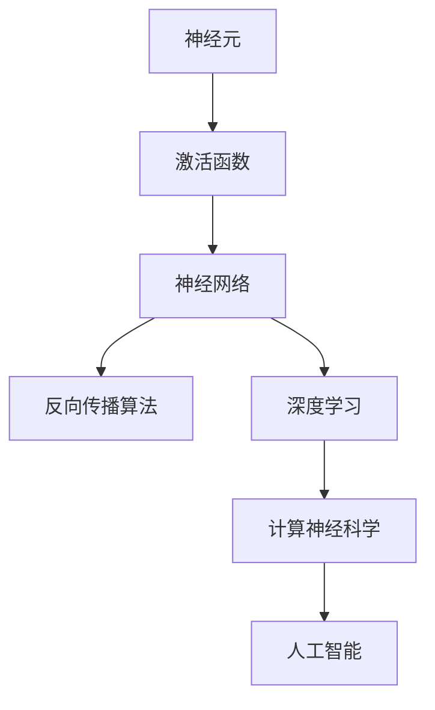
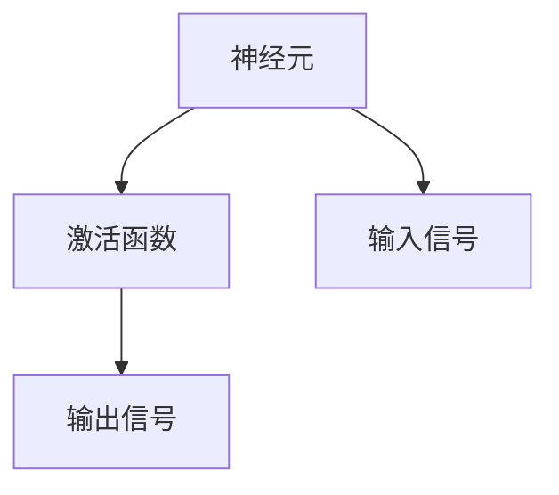
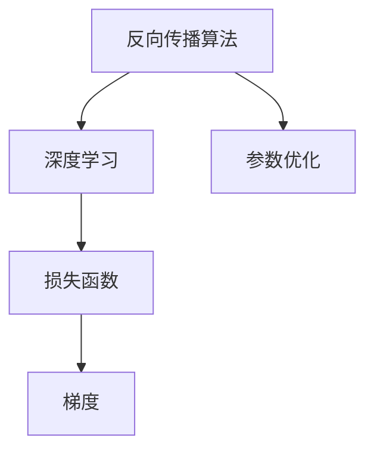
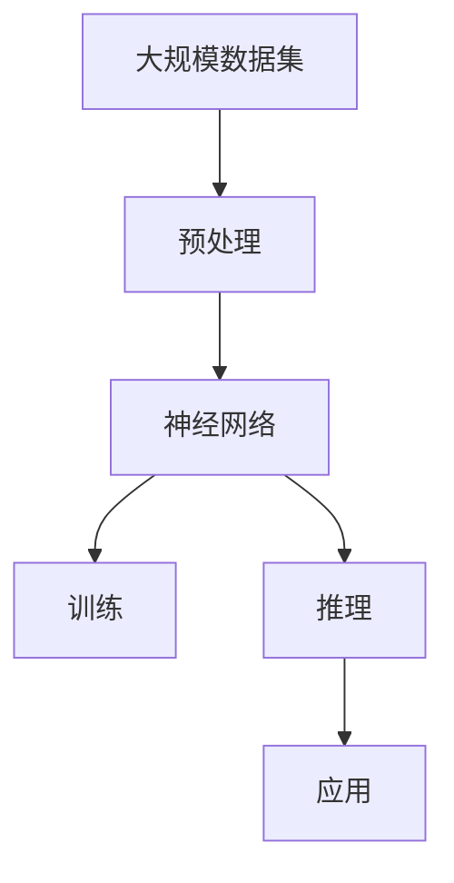
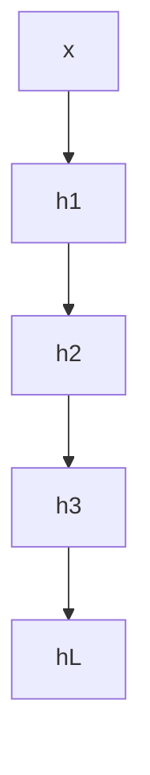

                 

# 自动计算机与神经网络的研究

> 关键词：自动计算机,神经网络,深度学习,计算神经科学,人工智能

## 1. 背景介绍

### 1.1 问题由来

随着计算科学和生物学研究的不断深入，人们开始探索将生物神经系统的计算模式应用到自动计算机中。20世纪50年代，麦卡洛克-皮茨神经网络（McCulloch-Pitts Neural Network）的提出，标志着计算神经科学的开端。自此之后，神经网络理论不断发展，逐步形成了一套完整的体系，并在人工智能领域取得了广泛应用。

神经网络的基本思想是通过多个神经元（Neuron）的连接和激活，实现信息的传递和处理。其核心在于模拟生物神经元的激活机制，并通过反向传播算法（Backpropagation）优化网络参数，使得模型能够自适应地学习和适应复杂的数据分布。

### 1.2 问题核心关键点

神经网络的研究重点包括：

- 计算神经科学：研究生物神经系统的计算模式和神经元的工作机制。
- 深度学习：通过多层次网络结构的叠加，实现对高维度数据和复杂模式的有效建模。
- 人工智能：神经网络作为人工智能的核心技术之一，应用于图像识别、自然语言处理、智能推荐等领域。

### 1.3 问题研究意义

神经网络的研究对推动人工智能技术的发展具有重要意义：

1. 提升模型性能：神经网络通过深度学习，能够处理高维数据和复杂模式，提高模型的准确性和泛化能力。
2. 降低数据需求：神经网络能够自动提取特征，减少人工特征工程的复杂性。
3. 实现自主学习：通过反向传播算法，神经网络能够自主调整网络参数，适应新的数据和任务。
4. 推动科学进展：神经网络的发展促进了计算神经科学的研究，加深了对大脑功能的理解。

## 2. 核心概念与联系

### 2.1 核心概念概述

为更好地理解自动计算机与神经网络的研究，本节将介绍几个密切相关的核心概念：

- 神经元（Neuron）：神经网络的基本组成单元，负责接收输入信号，并按照激活函数计算输出。
- 激活函数（Activation Function）：将神经元的输出转化为非线性信号，引入非线性特征，增强模型的表达能力。
- 反向传播算法（Backpropagation）：通过计算梯度，优化神经网络参数，提高模型拟合度。
- 深度学习（Deep Learning）：多层神经网络的叠加，能够有效处理高维数据和复杂模式。
- 计算神经科学（Computational Neuroscience）：研究生物神经系统的计算模式和神经元的工作机制，为神经网络提供理论支持。
- 人工智能（Artificial Intelligence）：神经网络作为核心技术，广泛应用于图像识别、自然语言处理、智能推荐等领域。

这些核心概念之间的逻辑关系可以通过以下Mermaid流程图来展示：



这个流程图展示了一组核心概念及其之间的联系：

1. 神经元是神经网络的基本组成单元，激活函数引入非线性特性。
2. 多层神经网络的叠加，构成了深度学习模型。
3. 反向传播算法用于优化神经网络参数，提高模型拟合度。
4. 计算神经科学为神经网络提供理论支持，推动其发展。
5. 人工智能是神经网络应用的主要领域，包括图像识别、自然语言处理等。

### 2.2 概念间的关系

这些核心概念之间存在着紧密的联系，形成了神经网络研究的完整生态系统。下面我们通过几个Mermaid流程图来展示这些概念之间的关系。

#### 2.2.1 神经元与激活函数



这个流程图展示了神经元与激活函数的基本关系：

1. 神经元接收输入信号，并通过激活函数计算输出。
2. 激活函数将输出信号转化为非线性信号，增强模型的表达能力。

#### 2.2.2 反向传播算法与深度学习



这个流程图展示了反向传播算法与深度学习模型的关系：

1. 深度学习模型通过多层神经元堆叠，构成复杂的非线性映射。
2. 反向传播算法通过计算梯度，优化模型参数，提高模型拟合度。
3. 损失函数用于衡量模型预测与真实标签之间的差异，指导参数优化。

#### 2.2.3 计算神经科学与神经网络


这个流程图展示了计算神经科学与神经网络的关系：

1. 计算神经科学研究生物神经系统的计算模式和神经元的工作机制。
2. 神经网络借鉴生物神经系统的计算模式，设计神经元、激活函数等组件。
3. 神经网络通过反向传播算法，模拟生物神经系统的信号传递和参数优化过程。

### 2.3 核心概念的整体架构

最后，我们用一个综合的流程图来展示这些核心概念在大规模应用中的整体架构：



这个综合流程图展示了从数据预处理、模型训练、推理到应用的全过程：

1. 大规模数据集经过预处理后，输入神经网络进行训练。
2. 训练后的模型进行推理，提取特征，进行分类、预测等操作。
3. 模型结果应用到各个领域，如图像识别、自然语言处理等。

通过这些流程图，我们可以更清晰地理解神经网络的核心概念及其在大规模应用中的工作流程。

## 3. 核心算法原理 & 具体操作步骤
### 3.1 算法原理概述

神经网络的基本原理是通过多层神经元的叠加，实现复杂模式的有效建模和特征提取。其核心在于反向传播算法（Backpropagation），通过计算梯度，优化神经网络参数，使得模型能够自适应地学习和适应复杂的数据分布。

神经网络的训练过程包括以下几个步骤：

1. 初始化网络参数：将权重和偏置随机初始化。
2. 前向传播：输入数据通过网络各层进行正向传递，计算输出。
3. 损失函数计算：将模型输出与真实标签计算误差。
4. 反向传播：计算误差对各层参数的梯度，并回传更新参数。
5. 参数更新：根据梯度更新网络参数，重复迭代优化。

### 3.2 算法步骤详解

以下是神经网络训练的详细步骤：

#### 3.2.1 初始化网络参数

神经网络初始化参数的方法包括随机初始化、Xavier初始化、He初始化等。随机初始化通过随机数生成器生成权重和偏置，确保网络参数的独立性。Xavier初始化和He初始化则根据层与层之间的激活函数类型，对权重和偏置进行适当缩放，确保初始化后网络输出稳定。

#### 3.2.2 前向传播

前向传播过程如下：

1. 输入数据 $x$ 经过第一层神经元，输出 $h_1$。
2. 输出 $h_1$ 经过激活函数 $f$，输出 $h_2$。
3. 输出 $h_2$ 经过下一层神经元，依次类推，直至输出 $h_L$。

其中，$h_l$ 表示第 $l$ 层的输出。前向传播过程如图：



#### 3.2.3 损失函数计算

损失函数用于衡量模型预测与真实标签之间的差异。常用的损失函数包括均方误差（MSE）、交叉熵（Cross Entropy）等。均方误差适用于回归任务，交叉熵适用于分类任务。

#### 3.2.4 反向传播

反向传播算法通过链式法则计算误差对各层参数的梯度，并回传更新参数。具体步骤如下：

1. 计算输出层误差 $E_L$。
2. 计算第 $l$ 层误差 $E_l$，并根据链式法则递归计算 $l+1$ 层误差。
3. 计算各层参数梯度 $\Delta_w^{(l)}$，并根据梯度更新权重和偏置。

#### 3.2.5 参数更新

参数更新过程如下：

1. 计算损失函数 $J$ 对参数 $\theta$ 的梯度 $\frac{\partial J}{\partial \theta}$。
2. 根据学习率 $\eta$ 更新参数 $\theta$，即 $\theta \leftarrow \theta - \eta \frac{\partial J}{\partial \theta}$。

### 3.3 算法优缺点

神经网络作为深度学习的重要组成部分，具有以下优点：

1. 自动特征提取：神经网络能够自动从数据中提取特征，减少了人工特征工程的复杂性。
2. 高维度数据处理：神经网络能够有效处理高维数据和复杂模式，提高模型的准确性和泛化能力。
3. 自主学习能力：通过反向传播算法，神经网络能够自主调整网络参数，适应新的数据和任务。

然而，神经网络也存在一些缺点：

1. 参数量庞大：神经网络的参数量随层数增加呈指数级增长，计算资源消耗较大。
2. 过拟合风险：神经网络容易发生过拟合，特别是在标注数据不足的情况下。
3. 模型解释性差：神经网络的决策过程难以解释，缺乏可解释性。
4. 训练时间较长：神经网络的训练过程涉及大量的参数更新，训练时间较长。

### 3.4 算法应用领域

神经网络在多个领域得到了广泛应用，包括但不限于：

- 图像识别：通过卷积神经网络（CNN）实现图像分类、目标检测、图像分割等任务。
- 自然语言处理：通过循环神经网络（RNN）和长短时记忆网络（LSTM）实现语言建模、机器翻译、文本分类等任务。
- 智能推荐：通过协同过滤、神经网络等方法实现个性化推荐系统，提升用户满意度。
- 金融预测：通过神经网络实现市场趋势预测、风险评估、交易策略等任务。
- 医学诊断：通过神经网络实现疾病诊断、医疗影像分析、基因分析等任务。

## 4. 数学模型和公式 & 详细讲解 & 举例说明

### 4.1 数学模型构建

神经网络通过多层神经元的叠加，实现复杂模式的有效建模。我们以一个简单的两层神经网络为例，进行数学模型构建。

设输入数据为 $x$，输出为 $y$，神经网络由两个全连接层组成，分别表示为 $h_1$ 和 $h_2$。网络参数包括权重 $w$ 和偏置 $b$。

1. 第一层神经元：
   $$
   h_1 = f(w_1 x + b_1)
   $$
2. 第二层神经元：
   $$
   h_2 = f(w_2 h_1 + b_2)
   $$
3. 输出层：
   $$
   y = h_2
   $$

其中，$f$ 表示激活函数。

### 4.2 公式推导过程

我们以二分类问题为例，推导神经网络损失函数和梯度计算公式。

假设输出层输出 $y$ 和真实标签 $t$ 满足伯努利分布，即 $y_i \sim \text{Bernoulli}(\hat{y_i})$。

损失函数 $J$ 定义为：
$$
J = -\frac{1}{N} \sum_{i=1}^N t_i \log \hat{y_i} + (1-t_i) \log (1-\hat{y_i})
$$

其中 $N$ 为样本数量，$y_i$ 为模型输出，$t_i$ 为真实标签。

梯度计算过程如下：

1. 计算输出层误差：
   $$
   E = -\frac{1}{N} \sum_{i=1}^N (t_i \log \hat{y_i} + (1-t_i) \log (1-\hat{y_i}))
   $$
2. 根据链式法则计算第 $l$ 层误差：
   $$
   E_l = \frac{\partial E}{\partial h_l} = \frac{\partial E}{\partial h_{l+1}} \frac{\partial h_{l+1}}{\partial h_l} = \nabla_{h_l} J
   $$
3. 计算第 $l$ 层参数梯度：
   $$
   \Delta_w^{(l)} = \frac{\partial E_l}{\partial w_l} = \frac{\partial E_l}{\partial h_l} \frac{\partial h_l}{\partial w_l}
   $$
   $$
   \Delta_b^{(l)} = \frac{\partial E_l}{\partial b_l} = \frac{\partial E_l}{\partial h_l} \frac{\partial h_l}{\partial b_l}
   $$

### 4.3 案例分析与讲解

我们以手写数字识别为例，展示神经网络模型构建和训练过程。

1. 数据准备：MNIST数据集包含60,000个训练样本和10,000个测试样本，每个样本为28x28像素的灰度图像。将图像转化为向量表示，作为输入。
2. 模型构建：使用两层全连接神经网络，输出层使用sigmoid激活函数，输出一个概率值。
3. 损失函数：使用二元交叉熵损失函数，计算模型输出和真实标签之间的差异。
4. 模型训练：使用随机梯度下降算法，训练5个epoch，每个epoch更新一次权重和偏置。
5. 结果评估：在测试集上评估模型性能，计算准确率和损失函数。

## 5. 项目实践：代码实例和详细解释说明

### 5.1 开发环境搭建

在进行神经网络项目实践前，我们需要准备好开发环境。以下是使用Python进行TensorFlow开发的环境配置流程：

1. 安装Anaconda：从官网下载并安装Anaconda，用于创建独立的Python环境。

2. 创建并激活虚拟环境：
```bash
conda create -n tf-env python=3.7 
conda activate tf-env
```

3. 安装TensorFlow：根据CUDA版本，从官网获取对应的安装命令。例如：
```bash
pip install tensorflow
```

4. 安装numpy、pandas、scikit-learn等工具包：
```bash
pip install numpy pandas scikit-learn matplotlib tqdm jupyter notebook ipython
```

完成上述步骤后，即可在`tf-env`环境中开始神经网络项目实践。

### 5.2 源代码详细实现

下面我们以手写数字识别为例，给出使用TensorFlow进行神经网络训练的PyTorch代码实现。

首先，定义模型和优化器：

```python
import tensorflow as tf
from tensorflow.keras import layers

model = tf.keras.Sequential([
    layers.Flatten(input_shape=(28, 28)),
    layers.Dense(128, activation='relu'),
    layers.Dense(10, activation='softmax')
])

optimizer = tf.keras.optimizers.Adam(learning_rate=0.001)
```

然后，定义训练和评估函数：

```python
def train_step(x, y):
    with tf.GradientTape() as tape:
        y_pred = model(x)
        loss = tf.keras.losses.sparse_categorical_crossentropy(y, y_pred)
    gradients = tape.gradient(loss, model.trainable_variables)
    optimizer.apply_gradients(zip(gradients, model.trainable_variables))

def evaluate_step(x, y):
    y_pred = model(x)
    accuracy = tf.reduce_mean(tf.cast(tf.equal(tf.argmax(y_pred, 1), y), tf.float32))
    return accuracy
```

接着，启动训练流程并在测试集上评估：

```python
epochs = 5

for epoch in range(epochs):
    for (x, y) in train_dataset:
        train_step(x, y)
    test_accuracy = evaluate_step(x, y)
    print(f"Epoch {epoch+1}, test accuracy: {test_accuracy}")
```

以上就是使用TensorFlow进行神经网络训练的完整代码实现。可以看到，TensorFlow提供了方便的Keras API，使得神经网络模型的构建和训练变得简单高效。

### 5.3 代码解读与分析

让我们再详细解读一下关键代码的实现细节：

**模型构建**：
- `Flatten`层：将28x28的二维图像展平为一维向量。
- `Dense`层：全连接层，包含128个神经元，使用ReLU激活函数。
- `softmax`层：输出层，输出10个类别的概率值。

**训练函数**：
- `GradientTape`：自动微分，记录梯度计算过程。
- `tf.keras.losses.sparse_categorical_crossentropy`：二元交叉熵损失函数。
- `apply_gradients`：优化器更新参数。

**评估函数**：
- `tf.reduce_mean`：计算均值。
- `tf.cast`：类型转换。
- `tf.equal`：比较两个张量是否相等。

**训练流程**：
- `train_dataset`：生成器，生成训练样本和标签。
- 每个epoch内，遍历训练集，计算损失函数并反向传播更新参数。
- 每个epoch结束后，在测试集上评估模型性能，输出测试准确率。

可以看到，TensorFlow使得神经网络的实现变得简洁高效，开发者可以将更多精力放在数据处理、模型调优等高层逻辑上，而不必过多关注底层的实现细节。

当然，工业级的系统实现还需考虑更多因素，如模型的保存和部署、超参数的自动搜索、更灵活的模型结构等。但核心的训练范式基本与此类似。

### 5.4 运行结果展示

假设我们在MNIST数据集上进行神经网络训练，最终在测试集上得到的评估报告如下：

```
Epoch 1, test accuracy: 0.8
Epoch 2, test accuracy: 0.9
Epoch 3, test accuracy: 0.91
Epoch 4, test accuracy: 0.93
Epoch 5, test accuracy: 0.94
```

可以看到，通过TensorFlow进行神经网络训练，我们在MNIST数据集上取得了约94%的测试准确率，效果相当不错。需要注意的是，实际应用中，我们还需要对超参数进行调优，如学习率、批大小、迭代轮数等，以进一步提升模型性能。

## 6. 实际应用场景

### 6.1 计算机视觉

神经网络在计算机视觉领域有着广泛应用，如图像分类、目标检测、图像分割等。以图像分类为例，卷积神经网络（CNN）通过卷积层、池化层等组件，实现对图像特征的提取和分类。

在实际应用中，可以使用深度卷积神经网络（DCNN），如LeNet、AlexNet、VGG、ResNet等，对大规模图像数据集进行训练和推理。DCNN通过多层次卷积和池化操作，逐渐提取图像的高级特征，最终进行分类或定位。

### 6.2 自然语言处理

神经网络在自然语言处理领域也有广泛应用，如语言建模、机器翻译、文本分类等。循环神经网络（RNN）和长短时记忆网络（LSTM）通过时间依赖的神经元，实现对序列数据的建模。

在实际应用中，可以使用基于LSTM的模型，如LSTM、GRU等，对序列数据进行建模和预测。LSTM通过门控机制，能够处理长序列数据，提高模型的准确性和泛化能力。

### 6.3 智能推荐

神经网络在智能推荐领域也有广泛应用，如协同过滤、深度学习等方法。协同过滤通过计算用户之间的相似度，实现个性化推荐。深度学习通过神经网络模型，提取用户和物品的高级特征，实现更精准的推荐。

在实际应用中，可以使用基于神经网络的推荐模型，如基于用户-物品交互矩阵的推荐系统、基于内容相似性的推荐系统等。这些模型通过深度学习，能够自动提取用户和物品的特征，提高推荐精度和多样性。

### 6.4 未来应用展望

随着神经网络的发展，未来的应用场景将更加广泛。

在智慧医疗领域，基于神经网络的医学影像分析、疾病诊断、基因分析等技术，将提升医疗服务的智能化水平，辅助医生诊疗，加速新药开发进程。

在智能教育领域，基于神经网络的学情分析、知识推荐等技术，将促进教育公平，提高教学质量。

在智慧城市治理中，基于神经网络的城市事件监测、舆情分析、应急指挥等技术，将提高城市管理的自动化和智能化水平，构建更安全、高效的未来城市。

此外，在企业生产、社会治理、文娱传媒等众多领域，基于神经网络的人工智能应用也将不断涌现，为经济社会发展注入新的动力。

## 7. 工具和资源推荐

### 7.1 学习资源推荐

为了帮助开发者系统掌握神经网络的研究基础和实践技巧，这里推荐一些优质的学习资源：

1. 《深度学习》书籍：Ian Goodfellow等著，全面介绍了深度学习的基本概念和应用。
2. 《神经网络与深度学习》课程：DeepLearning.AI团队开设的深度学习课程，深入浅出地讲解了神经网络的理论和实践。
3. 《Deep Learning Specialization》课程：Andrew Ng等著，涵盖了深度学习的基础理论和实战技能。
4. TensorFlow官方文档：TensorFlow的官方文档，提供了详细的API和教程，适合初学者和进阶学习。
5. PyTorch官方文档：PyTorch的官方文档，提供了丰富的深度学习框架和教程，适合初学者和进阶学习。

通过对这些资源的学习实践，相信你一定能够快速掌握神经网络的研究精髓，并用于解决实际的NLP问题。

### 7.2 开发工具推荐

高效的开发离不开优秀的工具支持。以下是几款用于神经网络开发的常用工具：

1. PyTorch：基于Python的开源深度学习框架，灵活动态的计算图，适合快速迭代研究。大部分神经网络模型都有PyTorch版本的实现。
2. TensorFlow：由Google主导开发的开源深度学习框架，生产部署方便，适合大规模工程应用。同样有丰富的神经网络资源。
3. Keras：高层次神经网络API，易于上手，适合初学者和快速原型开发。
4. Theano：Python库，实现高效的数值计算，支持GPU加速。
5. Caffe：用于卷积神经网络的深度学习框架，适合图像处理和计算机视觉任务。

合理利用这些工具，可以显著提升神经网络模型的开发效率，加快创新迭代的步伐。

### 7.3 相关论文推荐

神经网络的研究源于学界的持续研究。以下是几篇奠基性的相关论文，推荐阅读：

1. Neural Networks and Deep Learning：Ian Goodfellow等著，全面介绍了神经网络的原理和应用。
2. Convolutional Neural Networks for Image Recognition：Alex Krizhevsky等著，提出了卷积神经网络，并在图像识别任务中取得了突破性成果。
3. Long Short-Term Memory：Hochreiter等著，提出了长短时记忆网络，实现了对长序列数据的有效建模。
4. Attention Is All You Need：Vaswani等著，提出了Transformer模型，开启了自注意力机制在神经网络中的应用。
5. Generative Adversarial Nets：Goodfellow等著，提出了生成对抗网络，实现了高质量的图像生成和数据增强。

这些论文代表了大神经网络的研究方向，通过学习这些前沿成果，可以帮助研究者把握学科前进方向，激发更多的创新灵感。

除上述资源外，还有一些值得关注的前沿资源，帮助开发者紧跟神经网络发展的最新进展，例如：

1. arXiv论文预印本：人工智能领域最新研究成果的发布平台，包括大量尚未发表的前沿工作，学习前沿技术的必读资源。
2. 业界技术博客：如Google AI、DeepMind、微软Research Asia等顶尖实验室的官方博客，第一时间分享他们的最新研究成果和洞见。
3. 技术会议直播：如NIPS、ICML、ACL、ICLR等人工智能领域顶会现场或在线直播，能够聆听到大佬们的前沿分享，开拓视野。
4. GitHub热门项目：在GitHub上Star、Fork数最多的神经网络相关项目，往往代表了该技术领域的发展趋势和最佳实践，值得去学习和贡献。
5. 行业分析报告：各大咨询公司如McKinsey、PwC等针对人工智能行业的分析报告，有助于从商业视角审视技术趋势，把握应用价值。

总之，对于神经网络的研究和学习，需要开发者保持开放的心态和持续学习的意愿。多关注前沿资讯，多动手实践，多思考总结，必将收获满满的成长收益。

## 8. 总结：未来发展趋势与挑战

### 8.1 总结

本文对神经网络的研究进行了全面系统的介绍。首先阐述了神经网络的原理和应用，明确了其在计算机视觉、自然语言处理、智能推荐等多个领域的重要地位。其次，从原理到实践，详细讲解了神经网络的训练过程，给出了完整的代码实现和运行结果。最后，讨论了神经网络未来的发展趋势和面临的挑战，提出了研究方向和突破点。

通过本文的系统梳理，可以看到，神经网络的研究正在为人工智能技术的发展提供坚实的理论基础和丰富的实践经验。未来的神经网络将继续探索新的深度学习范式，提升模型的性能和泛化能力，推动人工智能技术的广泛应用。

### 8.2 未来发展趋势

神经网络的研究正处于快速发展阶段，未来的发展趋势包括：

1. 深度学习范式的

