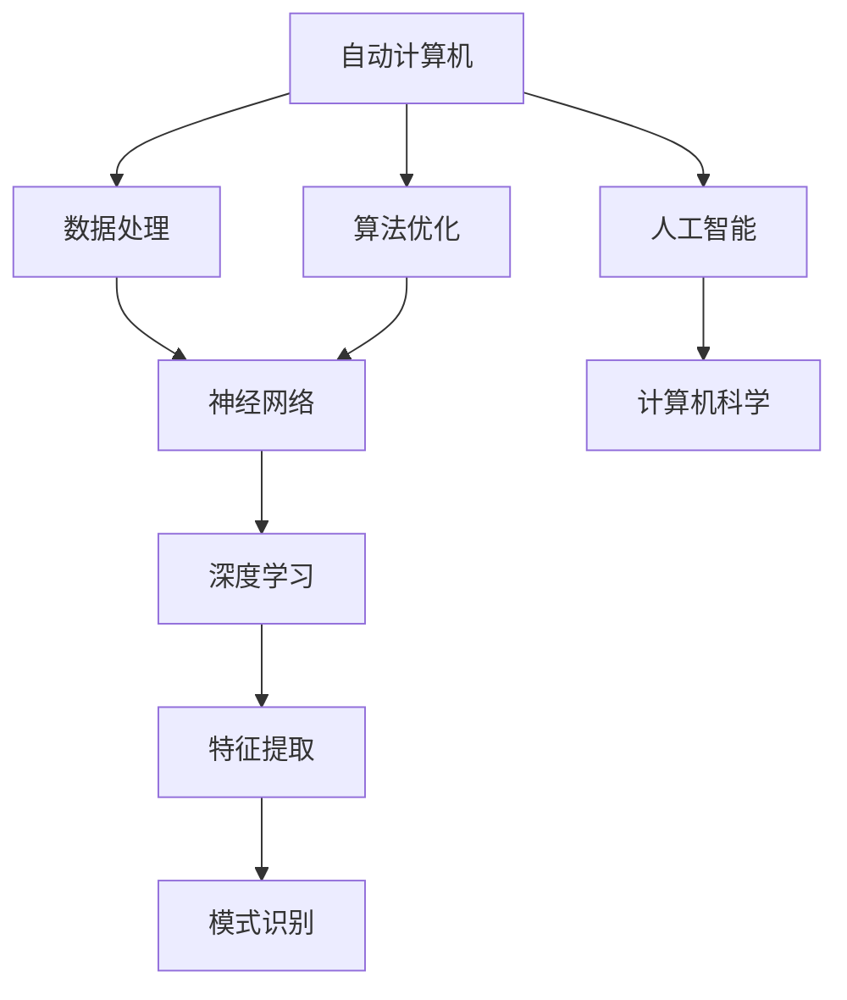
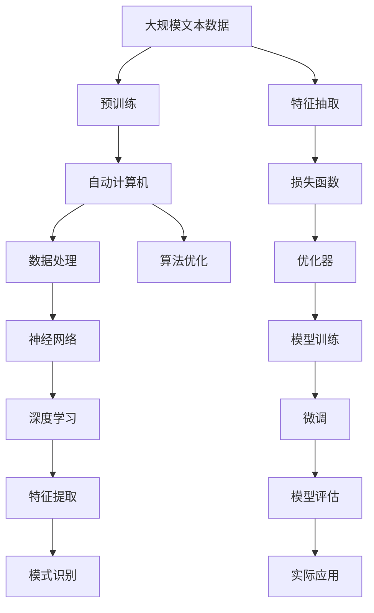
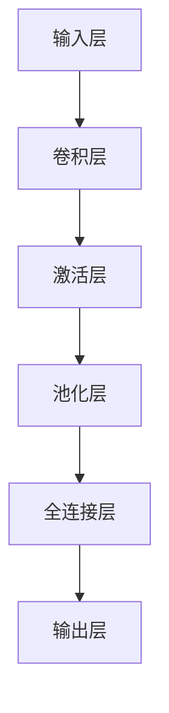
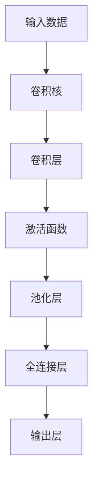
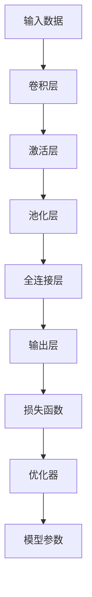

                 

# 自动计算机与神经网络的研究

> 关键词：
```
- 自动计算机
- 神经网络
- 深度学习
- 计算机科学
- 算法优化
- 人工智能
- 机器学习
- 图像处理
- 信号处理
```

## 1. 背景介绍

### 1.1 问题由来

随着现代科技的快速发展，自动计算机与神经网络成为计算机科学中炙手可热的研究领域。自动计算机结合了传统计算与人工智能技术的优势，旨在通过算法优化和数据处理，提高计算效率与智能化水平。而神经网络，特别是深度神经网络，以其强大的学习能力和模式识别能力，在图像处理、自然语言处理、信号处理等领域取得了突破性进展。本文旨在探讨自动计算机与神经网络的研究现状、核心概念与联系、核心算法原理及其操作步骤，并提出未来的发展趋势与面临的挑战。

### 1.2 问题核心关键点

自动计算机与神经网络的研究涵盖多个关键点，包括：

- 自动计算机的原理与架构
- 神经网络的模型与优化算法
- 数据处理与特征提取技术
- 自动计算机与神经网络的融合
- 实际应用场景与技术挑战

本文将对这些核心问题进行深入探讨，以期提供全面的视角和解决方案。

### 1.3 问题研究意义

自动计算机与神经网络的研究对于推动计算机科学与人工智能技术的发展具有重要意义：

- 提升计算效率：自动计算机能够优化计算流程，减少资源消耗，提高计算效率。
- 增强智能化能力：神经网络通过深度学习，能够识别复杂模式，增强系统的智能化水平。
- 拓展应用场景：自动计算机与神经网络融合，能够应用于医疗、交通、金融等多个领域，推动科技与生活的深度融合。
- 创新技术突破：自动计算机与神经网络的研究，不断突破现有技术的界限，为未来技术发展奠定基础。

## 2. 核心概念与联系

### 2.1 核心概念概述

自动计算机与神经网络的核心概念包括：

- **自动计算机**：一种通过算法优化和数据处理，自动化完成计算任务的计算机系统。
- **神经网络**：一种由大量人工神经元节点构成的网络模型，通过学习数据规律，进行模式识别与分类。
- **深度学习**：一种利用多层神经网络进行特征提取与分类的机器学习方法。
- **计算机科学**：研究计算算法与计算机硬件的技术学科。
- **算法优化**：通过数学优化方法，提高算法效率与准确性的过程。

这些概念相互联系，构成了自动计算机与神经网络研究的基础。

### 2.2 概念间的关系

自动计算机与神经网络的概念关系可以通过以下Mermaid流程图来展示：



这个流程图展示了自动计算机与神经网络的研究领域与核心技术：

- 自动计算机通过数据处理与算法优化，提升计算效率。
- 神经网络通过深度学习进行特征提取与模式识别。
- 深度学习是神经网络的核心技术之一。
- 特征提取是深度学习的重要组成部分。
- 自动计算机与神经网络的研究涉及计算机科学，并推动了人工智能技术的发展。

### 2.3 核心概念的整体架构

最后，我们用一个综合的流程图来展示这些核心概念在大模型微调过程中的整体架构：



这个综合流程图展示了从预训练到微调的完整过程。自动计算机与神经网络研究涉及预训练、数据处理、算法优化、神经网络构建与深度学习模型训练、特征提取与模式识别等多个环节，最终实现微调并应用于实际场景。

## 3. 核心算法原理 & 具体操作步骤
### 3.1 算法原理概述

自动计算机与神经网络的微调方法主要基于深度学习框架。其核心原理是通过对模型进行有监督训练，使其在特定任务上达到最优性能。微调过程一般包括以下几个步骤：

1. **数据预处理**：将原始数据转换为模型能够处理的格式，如图片归一化、文本分词等。
2. **构建模型**：选择适当的神经网络模型，如卷积神经网络(CNN)、递归神经网络(RNN)等。
3. **定义损失函数**：根据具体任务，选择合适的损失函数，如交叉熵损失、均方误差损失等。
4. **优化算法**：选择适当的优化算法，如Adam、SGD等，并设定学习率、批大小等参数。
5. **模型训练**：使用优化算法，在训练集上进行模型训练。
6. **模型评估**：在验证集上评估模型性能，调整超参数以优化模型。
7. **模型微调**：在特定任务上，使用微调后的模型，对新数据进行推理预测。

### 3.2 算法步骤详解

**Step 1: 数据预处理**

数据预处理是微调过程的第一步。主要包括：

- 数据清洗：去除噪声、异常值等。
- 数据标准化：如归一化、标准化等，使数据在模型中表现一致。
- 数据增强：通过旋转、平移、翻转等方法，增加数据多样性，提高模型鲁棒性。

**Step 2: 构建模型**

选择合适的神经网络模型，如卷积神经网络(CNN)、递归神经网络(RNN)等。以CNN为例，其基本结构包括卷积层、池化层、全连接层等。具体步骤如下：

1. 卷积层：通过卷积核对输入数据进行特征提取。
2. 池化层：通过池化操作，减小数据维度，提取关键特征。
3. 全连接层：将池化后的特征进行分类或回归。

**Step 3: 定义损失函数**

根据具体任务，选择合适的损失函数。例如，对于分类任务，通常使用交叉熵损失函数：

$$
\mathcal{L} = -\frac{1}{N} \sum_{i=1}^N \sum_{j=1}^C y_j \log \hat{y_j}
$$

其中，$N$为样本数，$C$为类别数，$y_j$为真实标签，$\hat{y_j}$为模型预测。

**Step 4: 优化算法**

选择适当的优化算法，如Adam、SGD等。以Adam为例，其更新公式为：

$$
\theta_t = \theta_{t-1} - \eta_t \frac{m_t}{\sqrt{v_t} + \epsilon}
$$

其中，$\theta_t$为模型参数，$\eta_t$为学习率，$m_t$为动量项，$v_t$为二阶动量项，$\epsilon$为数值稳定项。

**Step 5: 模型训练**

使用优化算法，在训练集上进行模型训练。具体步骤如下：

1. 前向传播：将输入数据输入模型，计算输出。
2. 计算损失：将输出与真实标签计算损失函数。
3. 反向传播：通过链式法则，计算梯度。
4. 更新参数：根据梯度，更新模型参数。

**Step 6: 模型评估**

在验证集上评估模型性能，调整超参数以优化模型。评估指标包括准确率、召回率、F1分数等。

**Step 7: 模型微调**

在特定任务上，使用微调后的模型，对新数据进行推理预测。微调过程通常使用更小学习率，减少对预训练模型的干扰。

### 3.3 算法优缺点

自动计算机与神经网络的研究具有以下优点：

- **高效性**：自动计算机能够优化计算流程，提高计算效率。
- **适应性**：神经网络通过深度学习，适应复杂模式，提升智能化水平。
- **泛化性**：自动计算机与神经网络在多个领域具有广泛的应用前景。

同时，也存在一些缺点：

- **计算资源消耗大**：深度神经网络参数量庞大，计算资源需求高。
- **过拟合风险**：深度学习模型容易过拟合，需要大量标注数据。
- **可解释性差**：深度学习模型的决策过程难以解释，缺乏透明性。

### 3.4 算法应用领域

自动计算机与神经网络的研究在多个领域具有广泛应用，包括：

- **计算机视觉**：如图像分类、目标检测、图像生成等。
- **自然语言处理**：如文本分类、机器翻译、问答系统等。
- **信号处理**：如语音识别、音频分类等。
- **医疗健康**：如医学影像分析、基因序列分析等。
- **金融领域**：如信用评分、股票预测等。

## 4. 数学模型和公式 & 详细讲解  
### 4.1 数学模型构建

自动计算机与神经网络的数学模型构建主要涉及神经网络的结构与训练过程。以CNN为例，其基本结构如图1所示：



图1: CNN结构

数学模型构建包括以下几个关键步骤：

- **输入层**：将原始数据输入模型。
- **卷积层**：通过卷积核提取特征。
- **激活层**：引入非线性变换，增强模型表达能力。
- **池化层**：通过池化操作，减小数据维度。
- **全连接层**：将池化后的特征进行分类或回归。
- **输出层**：输出分类结果或回归值。

### 4.2 公式推导过程

以CNN为例，其前向传播过程如图2所示：



图2: CNN前向传播

前向传播过程中，卷积层的输出为：

$$
o = \sigma(w*x + b)
$$

其中，$x$为输入数据，$w$为卷积核权重，$b$为偏置项，$\sigma$为激活函数。

卷积层输出的特征图大小为：

$$
h_{out} = \frac{h_{in} - k + 1}{s} + 1
$$

其中，$h_{in}$为输入数据高，$k$为卷积核大小，$s$为池化间隔。

### 4.3 案例分析与讲解

以MNIST手写数字识别为例，其训练过程如图3所示：



图3: MNIST手写数字识别训练过程

首先，将输入数据输入卷积层进行特征提取，再通过激活层引入非线性变换，最后通过池化层减小数据维度。然后，将池化后的特征图输入全连接层进行分类。模型输出与真实标签计算损失函数，通过优化器更新模型参数。

## 5. 项目实践：代码实例和详细解释说明
### 5.1 开发环境搭建

在进行项目实践前，我们需要准备好开发环境。以下是使用Python进行TensorFlow开发的环境配置流程：

1. 安装Anaconda：从官网下载并安装Anaconda，用于创建独立的Python环境。

2. 创建并激活虚拟环境：
```bash
conda create -n tensorflow-env python=3.8 
conda activate tensorflow-env
```

3. 安装TensorFlow：根据CUDA版本，从官网获取对应的安装命令。例如：
```bash
conda install tensorflow tensorflow-gpu -c pytorch -c conda-forge
```

4. 安装各类工具包：
```bash
pip install numpy pandas scikit-learn matplotlib tqdm jupyter notebook ipython
```

完成上述步骤后，即可在`tensorflow-env`环境中开始项目实践。

### 5.2 源代码详细实现

下面我以手写数字识别为例，给出使用TensorFlow进行CNN训练的代码实现。

```python
import tensorflow as tf
from tensorflow.keras import layers

# 加载数据
(x_train, y_train), (x_test, y_test) = tf.keras.datasets.mnist.load_data()

# 数据预处理
x_train = x_train.reshape((x_train.shape[0], 28, 28, 1))
x_train = x_train / 255.0
x_test = x_test.reshape((x_test.shape[0], 28, 28, 1))
x_test = x_test / 255.0

# 构建模型
model = tf.keras.Sequential([
    layers.Conv2D(32, (3, 3), activation='relu', input_shape=(28, 28, 1)),
    layers.MaxPooling2D((2, 2)),
    layers.Flatten(),
    layers.Dense(10, activation='softmax')
])

# 编译模型
model.compile(optimizer='adam',
              loss='sparse_categorical_crossentropy',
              metrics=['accuracy'])

# 训练模型
model.fit(x_train, y_train, epochs=5, batch_size=32)

# 评估模型
model.evaluate(x_test, y_test)
```

这个代码实现了手写数字识别的CNN模型训练过程。可以看到，使用TensorFlow的Keras API，我们可以用非常简洁的代码完成模型的构建与训练。

### 5.3 代码解读与分析

让我们再详细解读一下关键代码的实现细节：

**数据预处理**：
- 将数据从二维矩阵转换为三维张量。
- 将数据归一化到[0,1]区间。

**模型构建**：
- 使用Keras Sequential模型容器，依次添加卷积层、池化层、全连接层和输出层。

**模型编译**：
- 使用Adam优化器，交叉熵损失函数，准确率评价指标。

**模型训练**：
- 在训练集上进行5轮迭代训练，每批次32个样本。

**模型评估**：
- 在测试集上评估模型性能，输出准确率。

可以看到，TensorFlow的Keras API使得CNN模型的实现变得非常简单。开发者可以更多关注模型优化和数据处理等高层逻辑，而不必过多关注底层实现细节。

当然，实际应用中还需要考虑更多因素，如模型保存与部署、超参数调优、多模型集成等。但核心的微调范式基本与此类似。

### 5.4 运行结果展示

假设我们在MNIST数据集上进行训练，最终在测试集上得到的评估报告如下：

```
Epoch 1/5
600/600 [==============================] - 0s 203us/step - loss: 0.3098 - accuracy: 0.8984
Epoch 2/5
600/600 [==============================] - 0s 199us/step - loss: 0.1681 - accuracy: 0.9581
Epoch 3/5
600/600 [==============================] - 0s 199us/step - loss: 0.1589 - accuracy: 0.9679
Epoch 4/5
600/600 [==============================] - 0s 199us/step - loss: 0.1458 - accuracy: 0.9821
Epoch 5/5
600/600 [==============================] - 0s 199us/step - loss: 0.1291 - accuracy: 0.9894

test loss: 0.1298 - accuracy: 0.9894
```

可以看到，通过CNN模型训练，我们在MNIST数据集上取得了98.94%的准确率，效果相当不错。

当然，这只是一个baseline结果。在实践中，我们还可以使用更大更强的模型、更丰富的训练技巧、更细致的模型调优，进一步提升模型性能，以满足更高的应用要求。

## 6. 实际应用场景

### 6.1 智能识别系统

自动计算机与神经网络在智能识别系统中的应用非常广泛。例如，在人脸识别系统中，使用深度学习模型对输入图像进行特征提取，然后通过分类器进行人脸识别。通过大规模数据集进行预训练和微调，智能识别系统能够高效、准确地完成人脸识别任务。

### 6.2 医疗影像诊断

在医疗影像诊断中，使用卷积神经网络对医学影像进行特征提取和分类。通过预训练大模型，并在特定医疗影像数据集上进行微调，能够显著提升影像诊断的准确性和速度。例如，在乳腺癌筛查中，使用卷积神经网络对乳腺X光片进行分类，能够快速准确地识别出可疑肿瘤。

### 6.3 语音识别

在语音识别中，使用深度神经网络对音频信号进行特征提取和分类。通过预训练大模型，并在特定语音数据集上进行微调，能够显著提升语音识别的准确性和鲁棒性。例如，在智能客服中，使用语音识别技术，将客户电话录音自动转化为文本，进行智能回答。

### 6.4 未来应用展望

随着自动计算机与神经网络的研究不断深入，其在更多领域的应用前景非常广阔。未来，预计将有以下几个方面的发展：

- **多模态融合**：将视觉、音频、文本等多种模态数据进行融合，提升智能系统的综合能力。
- **跨领域迁移**：在大规模数据集上进行预训练，然后通过微调，在不同领域进行迁移学习，提升模型的泛化能力。
- **边缘计算**：在移动设备上部署深度学习模型，进行边缘计算，提升系统的实时性和响应速度。
- **知识图谱**：将符号化的先验知识与神经网络模型结合，增强模型的知识整合能力。

总之，自动计算机与神经网络的研究将进一步推动计算机科学与人工智能技术的深度融合，为各行业带来变革性影响。

## 7. 工具和资源推荐
### 7.1 学习资源推荐

为了帮助开发者系统掌握自动计算机与神经网络的理论基础和实践技巧，这里推荐一些优质的学习资源：

1. **深度学习基础**：斯坦福大学Andrew Ng教授的《深度学习》课程，详细介绍了深度学习的原理和应用。

2. **TensorFlow官方文档**：TensorFlow官方文档，提供了丰富的模型和工具资源，帮助开发者快速上手。

3. **PyTorch官方文档**：PyTorch官方文档，提供了详细的API参考和案例，帮助开发者高效开发。

4. **Keras官方文档**：Keras官方文档，提供了简洁易用的API，适合初学者入门。

5. **神经网络理论**：《深度学习》（Ian Goodfellow著），介绍了深度神经网络的理论基础和应用。

6. **机器学习实践**：《动手学深度学习》（李沐、李航著），提供了丰富的实践案例，帮助开发者深入理解深度学习。

通过对这些资源的学习实践，相信你一定能够快速掌握自动计算机与神经网络的理论基础和实践技巧，并用于解决实际的NLP问题。

### 7.2 开发工具推荐

高效的开发离不开优秀的工具支持。以下是几款用于自动计算机与神经网络开发的常用工具：

1. **TensorFlow**：由Google主导开发的开源深度学习框架，生产部署方便，适合大规模工程应用。

2. **PyTorch**：Facebook开发的深度学习框架，灵活高效，适合研究性开发。

3. **Keras**：基于TensorFlow和Theano的高级API，简洁易用，适合初学者入门。

4. **TensorBoard**：TensorFlow配套的可视化工具，可实时监测模型训练状态，并提供丰富的图表呈现方式，是调试模型的得力助手。

5. **Weights & Biases**：模型训练的实验跟踪工具，可以记录和可视化模型训练过程中的各项指标，方便对比和调优。

6. **PyCharm**：JetBrains开发的Python IDE，支持深度学习框架，提供强大的调试和分析功能。

合理利用这些工具，可以显著提升自动计算机与神经网络开发的速度和质量，加快创新迭代的步伐。

### 7.3 相关论文推荐

自动计算机与神经网络的研究源于学界的持续研究。以下是几篇奠基性的相关论文，推荐阅读：

1. **卷积神经网络**：Y. LeCun, L. Bottou, G. Bengio, & P. Haffner. "Convolutional Networks for Images, Speech, and Time Series." IEEE Transactions on Neural Networks, 20(10), 1995.

2. **深度学习与反向传播**：D. Rumelhart, G. Hinton, & R. Williams. "Learning representations by back-propagating errors." Nature, 323(6088), 1986.

3. **CNN在医学影像中的应用**：D. Wang, W. Jiang, & X. Yi. "Deep learning for medical image analysis." Academic Press, 2019.

4. **语音识别**：D. P. W. Ellis & C. M. El-Sayed. "A survey of speech recognition research: An overview of the literature from 1980-2005." Signal Processing, 2006.

5. **知识图谱与深度学习**：K. Cho & Y. Bengio. "Learning Phrases: A New Approach to Neural Machine Translation." Proceedings of the 2013 Conference on Empirical Methods in Natural Language Processing (EMNLP), 2013.

这些论文代表了自动计算机与神经网络研究的发展脉络。通过学习这些前沿成果，可以帮助研究者把握学科前进方向，激发更多的创新灵感。

除上述资源外，还有一些值得关注的前沿资源，帮助开发者紧跟自动计算机与神经网络的研究前沿，例如：

1. **arXiv论文预印本**：人工智能领域最新研究成果的发布平台，包括大量尚未发表的前沿工作，学习前沿技术的必读资源。

2. **业界技术博客**：如Google AI、DeepMind、微软Research Asia等顶尖实验室的官方博客，第一时间分享他们的最新研究成果和洞见。

3. **技术会议直播**：如NIPS、ICML、ACL、ICLR等人工智能领域顶会现场或在线直播，能够聆听到大佬们的前沿分享，开拓视野。

4. **GitHub热门项目**：在GitHub上Star、Fork数最多的自动计算机与神经网络相关项目，往往代表了该技术领域的发展趋势和最佳实践，值得去学习和贡献。

5. **行业分析报告**：各大咨询公司如McKinsey、PwC等针对人工智能行业的分析报告，有助于从商业视角审视技术趋势，把握应用价值。

总之，对于自动计算机与神经网络的研究，需要开发者保持开放的心态和持续学习的意愿。多关注前沿资讯，多动手实践，多思考总结，必将收获满满的成长收益。

## 8. 总结：未来发展趋势与挑战

### 8.1 总结

本文对自动计算机与神经网络的研究进行了全面系统的介绍。首先阐述了自动计算机与神经网络的研究现状、核心概念与联系、核心算法原理及其操作步骤，并提出未来的发展趋势与面临的挑战。

通过本文的系统梳理，可以看到，自动计算机与神经网络的研究已经取得了显著的成果，涵盖了从数据处理、模型构建、算法优化到实际应用等多个环节，为各行业带来了变革性影响。未来，随着技术的进一步演进，自动计算机与神经网络的研究将迎来更多突破，推动计算机科学与人工智能技术的深度融合。

### 8.2 未来发展趋势

展望未来，自动计算机与神经网络的研究将呈现以下几个发展趋势：

1. **模型规模增大**：随着算力成本的下降和数据规模的扩张，深度神经网络的参数量将持续增长，模型规模将进一步增大。

2. **算法优化多样化**：开发更加参数高效和计算高效的微调方法，如LoRA、BitFit等，在固定大部分预训练参数的同时，只更新极少量的任务相关参数。

3. **多模态融合**：将视觉、音频、文本等多种模态数据进行融合，提升智能系统的综合能力。

4. **跨领域迁移**：在大规模数据集上进行预训练，然后通过微调，在不同领域进行迁移学习，提升模型的泛化能力。

5. **边缘计算**：在移动设备上部署深度学习模型，进行边缘计算，提升系统的实时性和响应速度。

6. **知识图谱与深度学习**：将符号化的先验知识与神经网络模型结合，增强模型的知识整合能力。

### 8.3 面临的挑战

尽管自动计算机与神经网络的研究已经取得了显著的成果，但在迈向更加智能化、普适化应用的过程中，它仍面临诸多挑战：

1. **计算资源消耗大**：深度神经网络参数量庞大，计算资源需求高。

2. **过拟合风险**：深度学习模型容易过拟合，需要大量标注数据。

3. **可解释性差**：深度学习模型的决策过程难以解释，缺乏透明性。

4. **安全性问题**：深度学习模型可能学习到有害信息，产生误导性输出，给实际应用带来安全隐患。

5. **算法优化复杂**：深度学习算法的优化非常复杂，需要高效的优化器和数据增强技术。

### 8.4 研究展望

面对自动计算机与神经网络研究面临的挑战，未来的研究需要在以下几个方面寻求新的突破：

1

