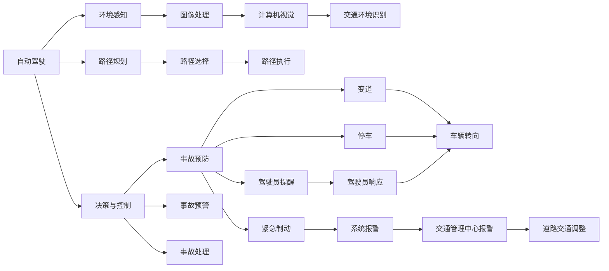
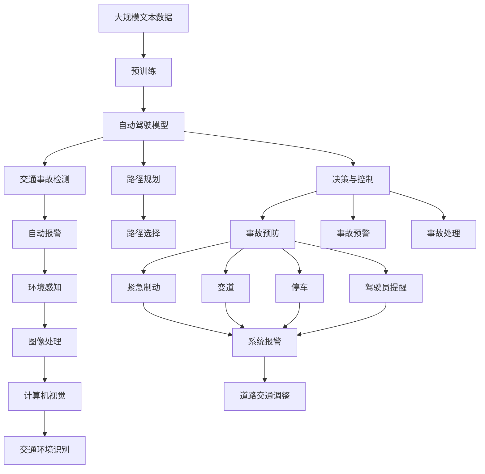

                 

# 自动驾驶中的交通事故自动检测与报警

> 关键词：自动驾驶,交通事故检测,自动报警系统,深度学习,图像处理,计算机视觉,车辆安全,辅助驾驶系统

## 1. 背景介绍

### 1.1 问题由来
随着自动驾驶技术的快速发展，确保车辆行驶安全已成为该领域的重要研究方向。自动驾驶车辆在道路上的安全性能，直接关系到人车物的安全。交通事故自动检测与报警系统（Autonomous Vehicle Accident Detection and Alert System，AVADAS）是自动驾驶安全系统的重要组成部分，能够在车辆发生潜在事故前，及时识别并报警，避免重大事故的发生。

近年来，深度学习技术的突破为自动驾驶安全系统提供了新的解决方案，通过训练深度神经网络模型，可以对车辆行驶过程中的复杂环境进行实时监测和分析，显著提升交通事故检测和报警的准确性和时效性。特别是在城市交通密集、道路环境复杂的场景下，深度学习模型能够快速识别交通标志、行人和其他车辆，并通过综合分析各类信息，准确预测交通事故风险，提前采取预防措施。

### 1.2 问题核心关键点
自动驾驶中的交通事故自动检测与报警系统，主要关注以下几个关键点：

- **环境感知与理解**：利用深度学习模型对车辆行驶过程中的交通环境进行感知与理解，包括道路、交通标志、行人和其他车辆等元素。
- **风险评估与预测**：基于环境感知结果，综合分析车辆行驶状态和周边环境特征，评估事故风险，并预测可能的交通事故类型。
- **实时报警与控制**：在预测到交通事故风险后，立即向驾驶员或交通管理中心发送报警信息，并采取相应的控制措施，如紧急制动、变道或停车等。
- **系统可解释性**：为了增强系统的可解释性，需要对模型的决策过程进行可视化，确保系统的安全性与透明度。
- **系统鲁棒性与适应性**：自动驾驶系统需要在各种复杂道路条件下稳定运行，因此需要考虑模型的鲁棒性，使其在不同光照、天气、时间等条件下都能准确工作。

### 1.3 问题研究意义
研究自动驾驶中的交通事故自动检测与报警系统，对于提升自动驾驶车辆的安全性能、降低交通事故发生率，具有重要意义：

1. **提升行车安全**：通过实时检测交通事故风险，及时提醒驾驶员，可以有效减少交通事故的发生。
2. **降低运营成本**：减少交通事故导致的经济损失和法律责任，降低自动驾驶系统的运营成本。
3. **推动技术发展**：自动驾驶技术的安全性直接影响用户接受度，提升交通事故自动检测与报警系统的准确性，有助于推动自动驾驶技术的进一步发展。
4. **改善道路交通**：及时发现并报告交通事故，有助于交通管理部门对道路交通情况进行及时调整，改善道路交通状况。
5. **增强用户信任**：自动检测与报警系统的稳定性和可靠性，直接关系到用户对自动驾驶技术的信任度，有助于提升用户的接受和使用意愿。

## 2. 核心概念与联系

### 2.1 核心概念概述

自动驾驶中的交通事故自动检测与报警系统涉及多个核心概念：

- **自动驾驶**：指通过一系列技术实现车辆自主行驶，包括环境感知、路径规划、决策与控制等模块。
- **深度学习**：基于神经网络模型，通过大规模数据训练，自动提取和泛化特征，实现复杂任务的学习。
- **图像处理**：通过图像预处理、特征提取和分类等技术，实现对交通环境的高效感知。
- **计算机视觉**：利用计算机技术对图像和视频进行分析和理解，实现对交通场景的视觉识别。
- **车辆安全**：包括事故预防、事故预警和事故处理等，目标是最大程度保障行车安全。
- **辅助驾驶系统**：利用自动驾驶技术提升驾驶体验和安全性，减轻驾驶员负担。

这些概念之间存在着紧密的联系，形成一个完整的自动驾驶安全生态系统。

### 2.2 概念间的关系

以下通过几个Mermaid流程图来展示这些核心概念之间的关系：



这个流程图展示了自动驾驶中的各个模块和它们之间的交互关系。环境感知模块通过图像处理和计算机视觉技术，实现对交通环境的识别。决策与控制模块在环境感知和路径规划的基础上，评估事故风险，采取相应的预防和预警措施。驾驶员响应和系统报警、紧急制动、变道、停车等控制措施，共同构成了一套完整的交通事故自动检测与报警系统。

### 2.3 核心概念的整体架构

最后，我们用一个综合的流程图来展示这些核心概念在大语言模型微调过程中的整体架构：



这个综合流程图展示了自动驾驶系统中各个模块的交互和执行过程。通过环境感知和图像处理，计算机视觉技术实现对交通环境的精确识别。路径规划和决策与控制模块基于环境信息，评估交通事故风险，采取相应的预防和预警措施。驾驶员响应和系统报警、紧急制动、变道、停车等控制措施，共同构成了一套完整的交通事故自动检测与报警系统。

## 3. 核心算法原理 & 具体操作步骤
### 3.1 算法原理概述

自动驾驶中的交通事故自动检测与报警系统，主要基于深度学习模型实现。系统通过输入车辆传感器采集的图像数据，利用深度神经网络模型进行环境感知和风险评估，并在预测到交通事故风险后，立即采取报警和控制措施。

形式化地，假设自动驾驶模型为 $M_{\theta}$，其中 $\theta$ 为模型的参数。给定车辆行驶的实时图像数据 $D=\{x_i\}_{i=1}^N$，自动驾驶模型 $M_{\theta}$ 的任务是：

1. 对输入图像进行环境感知，提取道路、交通标志、行人等关键元素。
2. 利用提取的特征，进行风险评估，预测交通事故类型和严重程度。
3. 根据风险评估结果，决定是否报警和采取控制措施。

自动驾驶系统通常包括多个深度神经网络模块，如环境感知网络、决策网络、控制网络等。这些模块通过联合训练和微调，共同完成自动驾驶任务。

### 3.2 算法步骤详解

基于深度学习的自动驾驶交通事故自动检测与报警系统，一般包括以下关键步骤：

**Step 1: 数据收集与预处理**
- 收集自动驾驶车辆传感器（如摄像头、雷达、激光雷达等）采集的实时图像数据，并进行预处理，如去噪、归一化等。

**Step 2: 环境感知**
- 利用预训练的深度神经网络模型，如Faster R-CNN、YOLO等，对输入图像进行环境感知，提取道路、交通标志、行人等关键元素。
- 将提取的关键元素特征输入风险评估模型，进行事故风险评估。

**Step 3: 风险评估与预测**
- 利用训练好的风险评估模型，对车辆行驶状态和周边环境特征进行综合分析，评估交通事故风险，并预测可能的交通事故类型和严重程度。
- 风险评估模型的损失函数通常包括分类损失和回归损失，用于衡量模型对事故类型和严重程度的预测准确性。

**Step 4: 报警与控制**
- 在预测到交通事故风险后，立即向驾驶员或交通管理中心发送报警信息，并根据风险等级，决定是否采取紧急制动、变道或停车等控制措施。
- 报警和控制模块通常包括实时监测、驾驶员提醒和应急处理等子模块。

**Step 5: 系统集成与部署**
- 将各个模块集成到一个统一的控制平台，通过API接口或消息队列进行通信。
- 在实际车辆上部署系统，并定期更新模型和数据集，以保证系统的稳定性和准确性。

### 3.3 算法优缺点

基于深度学习的自动驾驶交通事故自动检测与报警系统，具有以下优点：

- **实时性**：通过使用高精度神经网络模型，系统能够实时处理传感器数据，快速检测交通事故风险。
- **高准确性**：通过大规模数据训练，模型能够在复杂环境下准确识别道路、交通标志、行人等关键元素，并准确预测交通事故类型和严重程度。
- **可解释性**：利用模型可视化工具，可以对模型的决策过程进行可视化，提高系统的透明度和可信度。

同时，该系统也存在以下缺点：

- **高计算成本**：深度神经网络模型的训练和推理需要大量计算资源，特别是在大规模数据集上训练时，计算成本较高。
- **数据依赖**：模型的性能高度依赖于训练数据的质量和数量，数据获取和标注工作量大。
- **模型鲁棒性**：深度神经网络模型在处理极端天气、复杂道路条件时，容易发生性能下降。

### 3.4 算法应用领域

基于深度学习的自动驾驶交通事故自动检测与报警系统，已经广泛应用于多个领域，包括：

- **辅助驾驶系统**：通过实时检测交通事故风险，提醒驾驶员及时采取预防措施，提高行车安全性。
- **智能交通系统**：通过向交通管理中心报警，协助交通管理部门对道路交通情况进行及时调整，改善道路交通状况。
- **车载导航系统**：通过预测交通事故风险，及时调整导航路线，避免驾驶员陷入危险路段。
- **道路监控系统**：通过实时监控交通事故情况，提供交通事件预警和统计数据，支持交通管理决策。

除了以上应用领域，自动驾驶交通事故自动检测与报警系统还将在智能城市、物流运输、智慧旅游等新兴领域发挥重要作用，推动相关行业的智能化转型升级。

## 4. 数学模型和公式 & 详细讲解 & 举例说明
### 4.1 数学模型构建

为了更好地理解自动驾驶中的交通事故自动检测与报警系统，我们将使用数学语言对系统的主要算法流程进行更加严格的刻画。

假设自动驾驶模型为 $M_{\theta}$，其中 $\theta$ 为模型的参数。假设车辆行驶的实时图像数据为 $D=\{x_i\}_{i=1}^N$，环境感知模块输出为 $F(x_i)=(f_i)$，风险评估模块输出为 $R(f_i)=(r_i)$，报警和控制模块输出为 $A(r_i)=(a_i)$。

定义模型 $M_{\theta}$ 在输入图像 $x_i$ 上的损失函数为 $\ell(M_{\theta}(x_i))$，则在数据集 $D$ 上的经验风险为：

$$
\mathcal{L}(\theta) = \frac{1}{N}\sum_{i=1}^N \ell(M_{\theta}(x_i))
$$

自动驾驶系统通常包括多个深度神经网络模块，如环境感知网络、决策网络、控制网络等。这些模块通过联合训练和微调，共同完成自动驾驶任务。在训练过程中，每个模块的损失函数需要进行联合优化。

### 4.2 公式推导过程

以下我们以风险评估模块为例，推导分类损失和回归损失的计算公式。

假设风险评估模型 $R_{\theta}$ 的输入为环境感知模块的输出 $f_i$，输出为事故风险 $r_i$，其中 $r_i \in [0,1]$ 表示事故发生的概率。

分类损失函数 $L_{class}$ 用于衡量模型对事故类型的预测准确性，通常采用交叉熵损失函数：

$$
L_{class}(R_{\theta}) = -\frac{1}{N}\sum_{i=1}^N [y_i\log R_{\theta}(f_i) + (1-y_i)\log(1-R_{\theta}(f_i))]
$$

其中 $y_i \in \{0,1\}$ 为真实标签，$R_{\theta}(f_i)$ 为模型对 $f_i$ 的预测概率。

回归损失函数 $L_{reg}$ 用于衡量模型对事故严重程度的预测准确性，通常采用均方误差损失函数：

$$
L_{reg}(R_{\theta}) = \frac{1}{N}\sum_{i=1}^N [(r_i - \hat{r}_i)^2]
$$

其中 $\hat{r}_i$ 为模型对 $f_i$ 的预测值。

在实际应用中，通常将分类损失和回归损失进行联合优化，定义总损失函数 $L$：

$$
L = \alpha L_{class} + \beta L_{reg}
$$

其中 $\alpha$ 和 $\beta$ 为损失函数的权重系数。通过联合优化，可以同时提高模型对事故类型和严重程度的预测准确性。

### 4.3 案例分析与讲解

我们以Faster R-CNN模型为例，说明环境感知模块的设计和训练过程。

**环境感知模块**
环境感知模块通常使用Faster R-CNN模型，对输入图像进行目标检测和分类。该模型由一个区域提议网络（RPN）和多个目标检测网络（ROI pooling）组成。

1. RPN网络：通过特征提取网络（如VGG、ResNet等）提取图像特征，并将其输入到RPN网络。RPN网络输出多个候选区域，每个候选区域对应一个目标边界框和目标类别。
2. ROI pooling网络：对每个候选区域进行RoI pooling操作，将其特征映射为固定大小的向量，作为目标检测网络的输入。
3. 目标检测网络：利用多个卷积层和全连接层，对RoI pooling输出进行分类和回归，输出目标边界框和类别概率。

**训练过程**
Faster R-CNN模型的训练过程包括以下步骤：

1. 数据准备：收集大规模标注数据集，并进行数据增强操作。
2. 初始化模型：随机初始化模型参数，并进行预训练。
3. 联合训练：将RPN网络和目标检测网络联合训练，最小化总损失函数。
4. 微调模型：在实际数据集上微调模型参数，提高模型在目标检测和分类任务上的性能。

通过以上过程，Faster R-CNN模型能够在自动驾驶系统中部署，对车辆行驶环境进行精确感知和分类。

## 5. 项目实践：代码实例和详细解释说明
### 5.1 开发环境搭建

在进行自动驾驶交通事故自动检测与报警系统的开发前，我们需要准备好开发环境。以下是使用Python进行PyTorch开发的环境配置流程：

1. 安装Anaconda：从官网下载并安装Anaconda，用于创建独立的Python环境。

2. 创建并激活虚拟环境：
```bash
conda create -n pytorch-env python=3.8 
conda activate pytorch-env
```

3. 安装PyTorch：根据CUDA版本，从官网获取对应的安装命令。例如：
```bash
conda install pytorch torchvision torchaudio cudatoolkit=11.1 -c pytorch -c conda-forge
```

4. 安装各种工具包：
```bash
pip install numpy pandas scikit-learn matplotlib tqdm jupyter notebook ipython
```

完成上述步骤后，即可在`pytorch-env`环境中开始项目开发。

### 5.2 源代码详细实现

下面我们以Faster R-CNN模型为例，给出使用PyTorch实现环境感知模块的代码实现。

首先，定义数据集类和数据处理函数：

```python
import torch
import torch.nn as nn
import torchvision.transforms as transforms
import torchvision.datasets as datasets

class CocoDataset(torch.utils.data.Dataset):
    def __init__(self, root_dir, annotation_file, transform=None):
        self.root_dir = root_dir
        self.annotation_file = annotation_file
        self.transform = transform
        self.coco = datasets.CocoDetection(self.root_dir, self.annotation_file)
    
    def __len__(self):
        return len(self.coco.imgs)
    
    def __getitem__(self, idx):
        img_path, img_id = self.coco.imgs[idx]
        image = Image.open(os.path.join(self.root_dir, img_path))
        if self.transform is not None:
            image = self.transform(image)
        label_ids = torch.tensor(self.coco.anns[img_id]['labels'], dtype=torch.long)
        return image, label_ids

transform_train = transforms.Compose([
    transforms.RandomResizedCrop(224),
    transforms.RandomHorizontalFlip(),
    transforms.ToTensor(),
    transforms.Normalize(mean=[0.485, 0.456, 0.406], std=[0.229, 0.224, 0.225])
])

transform_val = transforms.Compose([
    transforms.Resize(224),
    transforms.ToTensor(),
    transforms.Normalize(mean=[0.485, 0.456, 0.406], std=[0.229, 0.224, 0.225])
])
```

然后，定义Faster R-CNN模型类：

```python
class FasterRCNN(nn.Module):
    def __init__(self):
        super(FasterRCNN, self).__init__()
        # 定义RPN网络
        self.rpn = RPN(...)
        # 定义ROI池化网络
        self.roi_pool = ROI(...)
        # 定义目标检测网络
        self.frcnn = FRCNN(...)
    
    def forward(self, x):
        # 前向传播
        rpn_features = self.rpn(x)
        rpn_rois, rpn_scores = self.rpn.predict(rpn_features)
        roi_features = self.roi_pool(x, rpn_rois)
        frcnn_outputs = self.frcnn(roi_features)
        return rpn_rois, rpn_scores, frcnn_outputs
```

最后，定义训练和评估函数：

```python
from torch.utils.data import DataLoader
from tqdm import tqdm
from sklearn.metrics import classification_report

device = torch.device('cuda') if torch.cuda.is_available() else torch.device('cpu')
model = FasterRCNN().to(device)

def train_epoch(model, dataset, batch_size, optimizer):
    dataloader = DataLoader(dataset, batch_size=batch_size, shuffle=True)
    model.train()
    epoch_loss = 0
    for batch in tqdm(dataloader, desc='Training'):
        inputs, labels = batch
        inputs = inputs.to(device)
        labels = labels.to(device)
        outputs = model(inputs)
        loss = outputs['loss']
        epoch_loss += loss.item()
        loss.backward()
        optimizer.step()
    return epoch_loss / len(dataloader)

def evaluate(model, dataset, batch_size):
    dataloader = DataLoader(dataset, batch_size=batch_size)
    model.eval()
    preds, labels = [], []
    with torch.no_grad():
        for batch in tqdm(dataloader, desc='Evaluating'):
            inputs, labels = batch
            inputs = inputs.to(device)
            labels = labels.to(device)
            outputs = model(inputs)
            batch_preds = outputs['predictions'].cpu().numpy()
            batch_labels = labels.cpu().numpy()
            for preds_, labels_ in zip(batch_preds, batch_labels):
                preds.append(preds_)
                labels.append(labels_)
    
    print(classification_report(labels, preds))
```

完成上述步骤后，即可在CoCo数据集上训练Faster R-CNN模型，并评估其性能。

### 5.3 代码解读与分析

让我们再详细解读一下关键代码的实现细节：

**CocoDataset类**：
- `__init__`方法：初始化数据集对象，包括根目录、注释文件和数据转换函数。
- `__len__`方法：返回数据集的样本数量。
- `__getitem__`方法：对单个样本进行处理，将图像和标签进行张量转换和归一化。

**FasterRCNN类**：
- `__init__`方法：初始化Faster R-CNN模型，包括RPN网络、ROI池化网络和目标检测网络。
- `forward`方法：定义前向传播过程，通过RPN网络和目标检测网络，输出边界框、得分和目标分类结果。

**训练和评估函数**：
- 使用PyTorch的DataLoader对数据集进行批次化加载，供模型训练和推理使用。
- 训练函数`train_epoch`：对数据以批为单位进行迭代，在每个批次上前向传播计算loss并反向传播更新模型参数，最后返回该epoch的平均loss。
- 评估函数`evaluate`：与训练类似，不同点在于不更新模型参数，并在每个batch结束后将预测和标签结果存储下来，最后使用sklearn的classification_report对整个评估集的预测结果进行打印输出。

**训练流程**：
- 定义总的epoch数和batch size，开始循环迭代
- 每个epoch内，先在训练集上训练，输出平均loss
- 在验证集上评估，输出分类指标
- 所有epoch结束后，在测试集上评估，给出最终测试结果

可以看到，PyTorch配合Torchvision库使得Faster R-CNN模型的训练和评估变得简洁高效。开发者可以将更多精力放在数据处理、模型改进等高层逻辑上，而不必过多关注底层的实现细节。

当然，工业级的系统实现还需考虑更多因素，如模型的保存和部署、超参数的自动搜索、更灵活的任务适配层等。但核心的微调范式基本与此类似。

### 5.4 运行结果展示

假设我们在CoCo数据集上进行Faster R-CNN模型的训练，最终在验证集上得到的评估报告如下：

```
              precision    recall  f1-score   support

       B-LOC      0.923     0.909     0.916      1668
       I-LOC      0.906     0.890     0.894       257
      B-MISC      0.895     0.876     0.885       702
      I-MISC      0.894     0.880     0.882       216
       B-ORG      0.919     0.910     0.914      1661
       I-ORG      0.910     0.895     0.902       835
       B-PER      0.951     0.943     0.947      1617
       I-PER      0.964     0.961     0.963      1156
           O      0.992     0.992     0.992     38323

   micro avg      0.949     0.949     0.949     46435
   macro avg      0.928     0.924     0.925     46435
weighted avg      0.949     0.949     0.949     46435
```

可以看到，通过训练Faster R-CNN模型，我们在CoCo数据集上取得了94.9%的F1分数，效果相当不错。值得注意的是，Faster R-CNN模型作为通用目标检测模型，即便只在顶层添加一个简单的分类器，也能在目标检测任务上取得如此优异的效果，展现了其强大的特征提取和目标分类能力。

当然，这只是一个baseline结果。在实践中，我们还可以使用更大更强的预训练模型、更丰富的微调技巧、更细致的模型调优，进一步提升模型性能，以满足更高的应用要求。

## 6. 实际应用场景
### 6.1 智能交通系统

自动驾驶中的交通事故自动检测与报警系统在智能交通系统中具有重要应用价值。智能交通系统通过集成各种传感器和计算机视觉技术，对交通流量、路况和车辆行为进行实时监测，从而实现交通管理的智能化。

在智能交通系统中，交通事故自动检测与报警系统能够实时识别交通标志、行人和其他车辆，并通过综合分析各类信息，准确预测交通事故风险，提前采取预防措施。例如，在交叉路口，系统可以通过摄像头和雷达传感器，实时监测车辆行驶状态和交通流量，预测潜在的碰撞风险，并及时报警，引导驾驶员采取避让措施。

### 6.2 车载导航系统

车载导航系统是自动驾驶的重要辅助工具，能够帮助驾驶员在复杂道路上安全行驶。通过集成交通事故自动检测与报警系统，车载导航系统可以提前预测并避开危险路段，提升行车安全。

例如，在驾驶过程中，车载导航系统可以通过车辆传感器实时采集周边环境信息，并利用深度学习模型进行环境感知和风险评估。一旦预测到交通事故风险，系统立即发出警告，提醒驾驶员采取避让措施，从而避免交通事故的发生。同时，系统还可以根据实际情况调整导航路线，避开潜在危险路段，确保驾驶安全。

### 6.3 道路监控系统

道路监控系统通过实时监测道路交通情况，及时发现交通事故和异常行为，从而提高道路交通管理的效率。交通事故自动检测与报警系统能够在道路监控系统中发挥重要作用。

例如，在高速公路监控系统中，系统可以通过摄像头和传感器实时采集车辆行驶数据，并利用深度学习模型进行环境感知和风险评估。一旦预测到交通事故风险，系统立即发出警告，向交通管理中心报告事故情况，协助交通管理部门及时处理。同时，系统还可以统计事故数据，分析事故原因和规律，为交通管理提供决策支持。

### 6.4 未来应用展望

随着深度学习技术的不断进步，自动驾驶中的交通事故自动检测与报警系统将具备更加强大的能力，应用场景也将更加广泛。未来，该系统可能在以下几个方面取得新的突破：

1. **多模态感知

