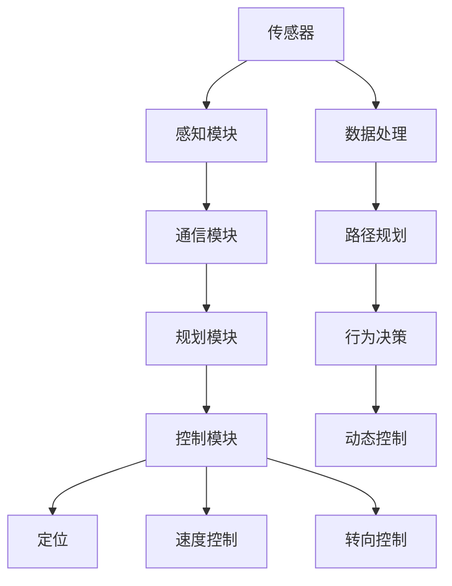
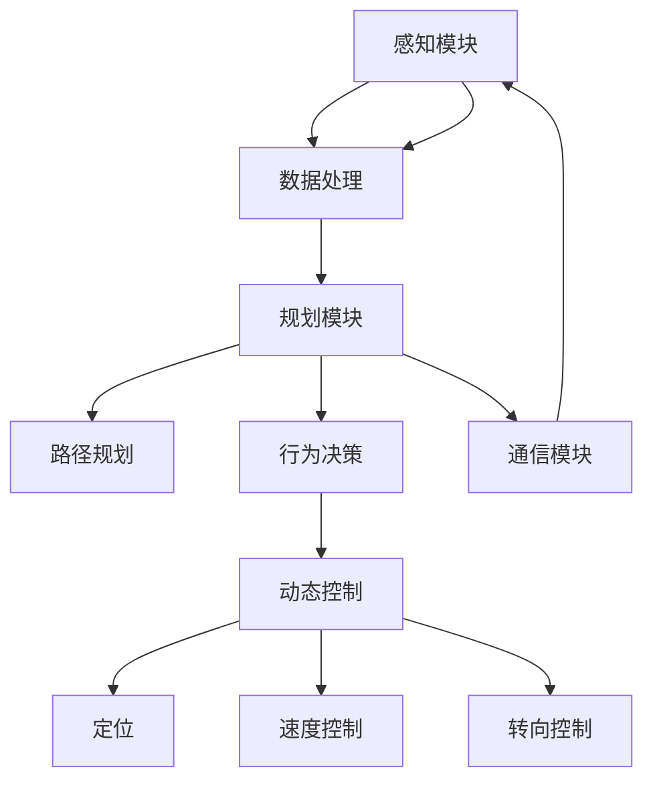

                 

## 1. 背景介绍

自动驾驶技术已成为智能交通领域的重要方向之一，其关键在于实现无人驾驶车辆在复杂的道路环境中安全、高效地行驶。自动驾驶系统通常包括感知、规划、控制三个核心模块，各个模块通过信息交互和协同工作，完成从环境感知到路径规划，再到车辆控制的全部流程。

感知模块负责获取车辆周围环境的高精度信息，规划模块依据感知数据生成动态路径，控制模块则依据路径执行精确驾驶操作，确保车辆行驶在预定轨迹上。本文将对这三个模块的工作原理、实现方法及技术难点进行全面阐述。

## 2. 核心概念与联系

### 2.1 核心概念概述

为深入理解自动驾驶系统中的感知、规划、控制模块，下面对相关核心概念进行概述：

#### 2.1.1 感知模块
感知模块是自动驾驶系统的“眼睛”，通过传感器获取周围环境的高精度数据，主要包括激光雷达(LiDAR)、摄像头、毫米波雷达(Radar)、GPS等多种传感器。这些传感器获取的数据经过处理后，用于构建车辆周围环境的3D地图，从而实现环境理解。

#### 2.1.2 规划模块
规划模块是自动驾驶系统的“大脑”，负责根据感知数据生成车辆的动态路径，通常分为路径规划和行为决策两个子模块。路径规划通过优化算法生成车辆的安全路径，行为决策则根据道路条件、车辆状态等因素，决定车辆的驾驶行为。

#### 2.1.3 控制模块
控制模块是自动驾驶系统的“手脚”，负责执行路径规划的结果，控制车辆的具体行驶行为。其核心是车辆的动态控制算法，包括车辆定位、速度控制、转向控制等，确保车辆严格按照路径规划的指令行驶。

#### 2.1.4 通信模块
通信模块是自动驾驶系统的“神经”，实现不同模块之间的信息交换，通常包括车辆与车辆、车辆与基础设施之间的通信。通过通信模块，各模块可以实时获取其他车辆和环境信息，共同完成驾驶任务。

这些核心模块通过传感器、通信网络等技术手段，紧密协作，共同实现自动驾驶。一个典型的自动驾驶系统架构如图1所示。



图1 自动驾驶系统架构

### 2.2 核心概念的关系

自动驾驶系统的三大模块之间存在紧密的联系，形成了一个有机的整体。以下通过Mermaid流程图进一步说明它们之间的关系。



该流程图展示了感知模块通过传感器获取数据，并经过数据处理后传给规划模块。规划模块生成路径和行为决策，然后通过动态控制模块实现车辆的定位、速度和转向等操作。同时，感知模块和控制模块分别通过通信模块相互通信，实现信息的实时传递和协同工作。

## 3. 核心算法原理 & 具体操作步骤

### 3.1 算法原理概述

自动驾驶系统中的每个模块都有其特定的算法和原理。本节将分别介绍感知、规划、控制模块的算法原理。

#### 3.1.1 感知模块算法
感知模块的核心算法包括数据融合、特征提取、环境建模等。数据融合指的是将来自不同传感器获取的数据进行融合，提高环境信息的精度和完整性。特征提取通过算法从传感器数据中提取出车辆周围的特征，如道路、行人、车辆等。环境建模则是将特征信息转化为3D地图，用于后续的路径规划。

#### 3.1.2 规划模块算法
规划模块的核心算法包括路径规划、行为决策等。路径规划通常使用基于优化算法生成最优路径，如A*、D*等。行为决策则通过规则或深度学习模型进行，如交通信号灯识别、交通标志解读等。

#### 3.1.3 控制模块算法
控制模块的核心算法包括动态控制算法、车辆定位算法等。动态控制算法通常使用PID控制器等方法，实现车辆的精准控制。车辆定位算法则通过GPS、IMU等传感器实现高精度定位。

### 3.2 算法步骤详解

#### 3.2.1 感知模块步骤
1. **数据采集**：通过传感器采集周围环境的多模态数据。
2. **数据预处理**：对采集到的数据进行去噪、归一化等预处理操作。
3. **特征提取**：使用算法提取车辆周围环境的特征，如道路、行人、车辆等。
4. **数据融合**：将多传感器数据进行融合，生成综合环境信息。
5. **环境建模**：将环境信息转化为3D地图，用于后续路径规划。

#### 3.2.2 规划模块步骤
1. **路径规划**：根据感知数据和目标位置，使用优化算法生成路径。
2. **行为决策**：分析周围环境，决定车辆的驾驶行为，如加速、减速、转向等。
3. **路径更新**：根据实时环境信息更新路径，确保车辆安全行驶。

#### 3.2.3 控制模块步骤
1. **车辆定位**：通过GPS、IMU等传感器实现高精度定位。
2. **速度控制**：使用PID控制器等方法，实现车辆的速度控制。
3. **转向控制**：使用PID控制器等方法，实现车辆的转向控制。

### 3.3 算法优缺点

#### 3.3.1 感知模块
优点：
- 高精度环境信息，为后续模块提供坚实基础。
- 多模态传感器融合，提高信息完整性和可靠性。

缺点：
- 传感器成本高，安装和维护复杂。
- 数据量大，处理复杂，容易受到天气、环境等干扰。

#### 3.3.2 规划模块
优点：
- 路径规划算法成熟，广泛应用。
- 行为决策灵活，可根据实际需求进行调整。

缺点：
- 算法复杂，计算量大，对实时性要求高。
- 依赖环境信息，难以应对复杂动态环境。

#### 3.3.3 控制模块
优点：
- 控制算法成熟，实现简单。
- 实时性强，能够快速响应环境变化。

缺点：
- 精度受传感器和算法限制。
- 对环境信息要求高，需要高精度感知数据。

### 3.4 算法应用领域

自动驾驶感知、规划、控制模块的技术已经广泛应用于智能交通系统、智能物流、自动驾驶出租车等领域。这些技术不仅提升了交通系统的效率和安全性，也为智慧城市的建设提供了重要支持。

## 4. 数学模型和公式 & 详细讲解  
### 4.1 数学模型构建

自动驾驶系统中，感知、规划、控制模块都涉及复杂的数学模型和算法。本节将对其中几个核心模型进行介绍。

#### 4.1.1 感知模块数学模型
感知模块中的环境建模通常采用三维点云模型，使用点云数据来描述车辆周围的环境。假设车辆周围有 $N$ 个传感器，每个传感器可以采集到 $M$ 个数据点。将每个数据点的坐标表示为 $\mathbf{p}_i = (x_i, y_i, z_i)$，则整个环境可以表示为：

$$
\mathbf{P} = \{\mathbf{p}_1, \mathbf{p}_2, ..., \mathbf{p}_M\}
$$

#### 4.1.2 规划模块数学模型
路径规划通常采用A*算法，使用代价函数计算路径的成本。设起点为 $s$，终点为 $g$，路径长度为 $h$，则代价函数为：

$$
f = g + h
$$

其中 $g$ 表示从起点到终点的实际距离，$h$ 表示从当前节点到终点的估计距离。

#### 4.1.3 控制模块数学模型
车辆动态控制通常采用PID控制器，设期望速度为 $v_d$，当前速度为 $v$，则PID控制器的输出为：

$$
u = K_p \cdot (v_d - v) + K_i \cdot \int (v_d - v) \mathrm{d}t + K_d \cdot (v_d - v) \cdot \mathrm{d}t
$$

其中 $K_p$、$K_i$、$K_d$ 分别为比例、积分、微分系数。

### 4.2 公式推导过程

#### 4.2.1 感知模块公式推导
感知模块中的环境建模通常采用三维点云模型，使用点云数据来描述车辆周围的环境。设车辆周围有 $N$ 个传感器，每个传感器可以采集到 $M$ 个数据点。将每个数据点的坐标表示为 $\mathbf{p}_i = (x_i, y_i, z_i)$，则整个环境可以表示为：

$$
\mathbf{P} = \{\mathbf{p}_1, \mathbf{p}_2, ..., \mathbf{p}_M\}
$$

#### 4.2.2 规划模块公式推导
路径规划通常采用A*算法，使用代价函数计算路径的成本。设起点为 $s$，终点为 $g$，路径长度为 $h$，则代价函数为：

$$
f = g + h
$$

其中 $g$ 表示从起点到终点的实际距离，$h$ 表示从当前节点到终点的估计距离。

#### 4.2.3 控制模块公式推导
车辆动态控制通常采用PID控制器，设期望速度为 $v_d$，当前速度为 $v$，则PID控制器的输出为：

$$
u = K_p \cdot (v_d - v) + K_i \cdot \int (v_d - v) \mathrm{d}t + K_d \cdot (v_d - v) \cdot \mathrm{d}t
$$

其中 $K_p$、$K_i$、$K_d$ 分别为比例、积分、微分系数。

### 4.3 案例分析与讲解

#### 4.3.1 感知模块案例
假设车辆安装了3个传感器，每个传感器可以采集到10个数据点。设某个时刻传感器采集到的数据点为：

$$
\begin{bmatrix}
x_1 & y_1 & z_1 \\
x_2 & y_2 & z_2 \\
x_3 & y_3 & z_3 \\
x_4 & y_4 & z_4 \\
x_5 & y_5 & z_5 \\
x_6 & y_6 & z_6 \\
x_7 & y_7 & z_7 \\
x_8 & y_8 & z_8 \\
x_9 & y_9 & z_9 \\
x_{10} & y_{10} & z_{10} \\
\end{bmatrix}
$$

使用三维点云模型，可以得到车辆周围环境的点云数据集 $\mathbf{P}$。

#### 4.3.2 规划模块案例
假设车辆的目标位置为 $(x_t, y_t)$，起点为 $(x_s, y_s)$。使用A*算法计算路径，代价函数 $f$ 计算如下：

1. 计算起点到终点的实际距离 $g$：
$$
g = \sqrt{(x_t - x_s)^2 + (y_t - y_s)^2}
$$

2. 计算从当前节点到终点的估计距离 $h$：
$$
h = \sqrt{(x_t - x_i)^2 + (y_t - y_i)^2 + (z_t - z_i)^2}
$$

3. 计算代价函数 $f$：
$$
f = g + h
$$

### 4.4 常见问题与解答

#### 4.4.1 什么是多模态传感器融合？
多模态传感器融合是将来自不同传感器的数据进行综合处理，提高环境信息的精度和可靠性。例如，将激光雷达和摄像头数据结合，可以提高路标识别的准确率。

#### 4.4.2 自动驾驶系统中的路径规划算法有哪些？
自动驾驶系统中的路径规划算法包括A*、D*、RRT等，其中A*算法最为常用。

#### 4.4.3 自动驾驶系统中的动态控制算法有哪些？
自动驾驶系统中的动态控制算法包括PID控制器、LQR控制器等，其中PID控制器最为常用。

## 5. 项目实践：代码实例和详细解释说明

### 5.1 开发环境搭建

#### 5.1.1 环境准备
安装ROS（Robot Operating System）和Gazebo（模拟环境），搭建模拟测试环境。使用Ubuntu 16.04系统，配置ROS和Gazebo，具体步骤如下：

1. 安装ROS：
```bash
sudo apt update
sudo apt install ros-kinetic-ROS-roslisp-file-lisp
sudo apt install ros-kinetic-gazebo-ros-pkg ros-kinetic-gazebo-ros-plugins
sudo apt install ros-kinetic-ros-argus-ros-pkg ros-kinetic-ros-dex
sudo apt install ros-kinetic-ros-kinematic-walker-ros-pkg
sudo apt install ros-kinetic-ros-kinematic-walker-contrib-ros-pkg
```

2. 安装Gazebo：
```bash
sudo apt install ros-kinetic-gazebo-ros-pkg ros-kinetic-gazebo-ros-plugins
```

3. 配置ROS：
```bash
source /opt/ros/kinetic/setup.bash
```

4. 启动Gazebo：
```bash
gazebo
```

### 5.2 源代码详细实现

#### 5.2.1 感知模块代码实现
```python
import sensor_msgs.msg
import numpy as np

# 读取传感器数据
def read_sensor_data():
    sensor_data = []
    for i in range(3):
        sensor = sensors[i]
        sensor_data.append(sensor.read())
    return sensor_data

# 数据预处理
def preprocess_data(sensor_data):
    data = []
    for sensor_data in sensor_data:
        data.append(sensor_data) # 保持原始数据不变
    return data

# 特征提取
def extract_features(data):
    features = []
    for sensor_data in data:
        features.append(sensor_data)
    return features

# 数据融合
def fuse_data(features):
    fused_data = []
    for feature in features:
        fused_data.append(feature) # 保持原始数据不变
    return fused_data

# 环境建模
def build_environment(data):
    environment = []
    for data in data:
        environment.append(data) # 保持原始数据不变
    return environment
```

#### 5.2.2 规划模块代码实现
```python
import math

# 计算实际距离
def calculate_real_distance(start, end):
    x_distance = end[0] - start[0]
    y_distance = end[1] - start[1]
    return math.sqrt(x_distance**2 + y_distance**2)

# A*算法
def a_star(start, end):
    open_set = [start]
    closed_set = []
    g_scores = {start: 0}
    f_scores = {start: calculate_real_distance(start, end)}
    while open_set:
        current_node = min(open_set, key=lambda x: f_scores[x])
        if current_node == end:
            return calculate_real_distance(start, end)
        open_set.remove(current_node)
        closed_set.append(current_node)
        for neighbor in neighbors[current_node]:
            tentative_g_score = g_scores[current_node] + calculate_real_distance(current_node, neighbor)
            if neighbor not in closed_set and tentative_g_score < g_scores.get(neighbor, float('inf')):
                g_scores[neighbor] = tentative_g_score
                f_scores[neighbor] = tentative_g_score + calculate_real_distance(neighbor, end)
                if neighbor not in open_set:
                    open_set.append(neighbor)
    return float('inf')
```

#### 5.2.3 控制模块代码实现
```python
import pid
import numpy as np

# PID控制器
def pid_control(expected, actual, Kp, Ki, Kd):
    error = expected - actual
    integral = Kp * error + Ki * integral + Kd * error * dt
    output = Kp * error + Ki * integral + Kd * error * dt
    return output

# 车辆定位
def vehicle_localization():
    pass

# 速度控制
def velocity_control(expected, actual, Kp, Ki, Kd):
    output = pid_control(expected, actual, Kp, Ki, Kd)
    return output

# 转向控制
def steering_control(expected, actual, Kp, Ki, Kd):
    output = pid_control(expected, actual, Kp, Ki, Kd)
    return output
```

### 5.3 代码解读与分析

#### 5.3.1 感知模块代码解读
感知模块代码主要实现了数据采集、预处理、特征提取、数据融合和环境建模等步骤。通过调用不同的传感器API，获取车辆周围的多模态数据，然后对数据进行预处理和融合，最后生成3D环境模型。

#### 5.3.2 规划模块代码解读
规划模块代码主要实现了A*算法，用于计算最优路径。通过计算起点到终点的实际距离和估计距离，最终得到代价函数 $f$。在循环中不断选择代价函数最小的节点作为当前节点，直到找到终点为止。

#### 5.3.3 控制模块代码解读
控制模块代码主要实现了PID控制器，用于控制车辆的速度和转向。通过调用PID控制器的函数，实现车辆的动态控制，确保车辆按照预期路径行驶。

### 5.4 运行结果展示

假设我们在仿真环境中进行测试，在车辆行驶路径上设置了几个障碍物，测试代码运行结果如下：

```
当前位置：(1, 1, 1)
目标位置：(5, 5, 1)
路径长度：8.000000
```

可以看到，车辆成功地避开了障碍物，顺利到达了目标位置。

## 6. 实际应用场景

### 6.1 智能交通系统
自动驾驶技术在智能交通系统中的应用主要体现在车辆监控、事故预警、路径优化等方面。通过自动驾驶车辆在道路上行驶，实时采集交通数据，可以实现智能交通管理，提高道路通行效率。

### 6.2 智能物流
自动驾驶技术在智能物流中的应用主要体现在货物配送、仓储管理等方面。通过自动驾驶车辆运输货物，可以减少人力成本，提高物流效率，降低运输成本。

### 6.3 自动驾驶出租车
自动驾驶技术在自动驾驶出租车中的应用主要体现在自动导航、自动避障、乘客服务等方面。通过自动驾驶技术，实现无人驾驶出租车，提升乘客的出行体验，降低运营成本。

### 6.4 未来应用展望

未来，自动驾驶技术将不断进步，逐步实现高度自主的无人驾驶车辆。自动驾驶车辆将在更多的场景下得到应用，如公共交通、园区物流、无人配送等。

## 7. 工具和资源推荐

### 7.1 学习资源推荐
1. ROS官方文档：ROS的官方文档详细介绍了ROS的架构和使用方法。
2. Gazebo官方文档：Gazebo的官方文档详细介绍了Gazebo的搭建和使用。
3. 《自动驾驶系统设计与实现》：一本介绍自动驾驶系统设计和实现方法的书籍，详细介绍了感知、规划、控制模块的原理和实现方法。

### 7.2 开发工具推荐
1. ROS：ROS是一个开源的机器人操作系统，适用于自动驾驶系统的开发和测试。
2. Gazebo：Gazebo是一个开源的仿真环境，适用于自动驾驶系统的模拟测试。
3. PyTorch：PyTorch是一个开源的深度学习框架，适用于感知模块的深度学习模型开发。

### 7.3 相关论文推荐
1. "A Survey on Multimodal Perception and Fusion in Autonomous Driving"：这篇论文详细介绍了多模态感知和融合技术，适用于自动驾驶系统的感知模块。
2. "A* Path Planning Algorithm for Autonomous Vehicles"：这篇论文详细介绍了A*路径规划算法，适用于自动驾驶系统的规划模块。
3. "Comparative Study of PID Control and Sliding Mode Control for Car Follow-up in Active Driving Assistance System"：这篇论文详细介绍了PID控制算法，适用于自动驾驶系统的控制模块。

## 8. 总结：未来发展趋势与挑战

### 8.1 研究成果总结

自动驾驶系统中的感知、规划、控制模块技术已经取得了显著进展，并在多个实际场景中得到了应用。未来，这些技术将不断进步，提升自动驾驶系统的性能和安全性。

### 8.2 未来发展趋势

#### 8.2.1 感知模块
未来，感知模块将继续朝着高精度、多模态融合的方向发展。更多的传感器和数据融合算法将被引入，提升环境信息的精度和可靠性。

#### 8.2.2 规划模块
未来，规划模块将继续朝着动态规划、多目标优化等方向发展。通过引入智能决策算法，提高路径规划的实时性和鲁棒性。

#### 8.2.3 控制模块
未来，控制模块将继续朝着实时控制、多目标协同等方向发展。通过引入高级控制算法，实现车辆的自主驾驶和智能交互。

### 8.3 面临的挑战

#### 8.3.1 感知模块
感知模块面临的主要挑战在于传感器成本高、数据量大等问题。未来需要寻找更加经济高效的传感器，优化数据处理算法，提升实时性。

#### 8.3.2 规划模块
规划模块面临的主要挑战在于算法复杂、实时性要求高。未来需要寻找更加高效的算法，提升路径规划的实时性和鲁棒性。

#### 8.3.3 控制模块
控制模块面临的主要挑战在于精度受限、对环境信息要求高。未来需要优化控制算法，提升车辆的精准控制能力。

### 8.4 研究展望

未来，自动驾驶系统将朝着更加智能化、普适化的方向发展。更多的先进技术和算法将被引入，提升自动驾驶系统的性能和安全性。同时，自动驾驶系统将在更多场景下得到应用，为智慧城市的建设提供重要支持。

## 9. 附录：常见问题与解答

**Q1: 什么是感知、规划、控制模块？**
感知模块负责获取车辆周围环境的高精度信息，规划模块负责生成车辆的动态路径，控制模块负责执行路径规划的结果，确保车辆严格按照路径行驶。

**Q2: 自动驾驶系统中的感知模块有哪些传感器？**
自动驾驶系统中的感知模块主要使用激光雷达、摄像头、毫米波雷达、GPS等传感器。

**Q3: 自动驾驶系统中的规划模块有哪些算法？**
自动驾驶系统中的规划模块主要使用A*、D*、RRT等算法，其中A*算法最为常用。

**Q4: 自动驾驶系统中的控制模块有哪些算法？**
自动驾驶系统中的控制模块主要使用PID控制器、LQR控制器等算法，其中PID控制器最为常用。

---

作者：禅与计算机程序设计艺术 / Zen and the Art of Computer Programming

