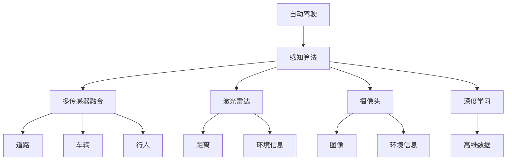
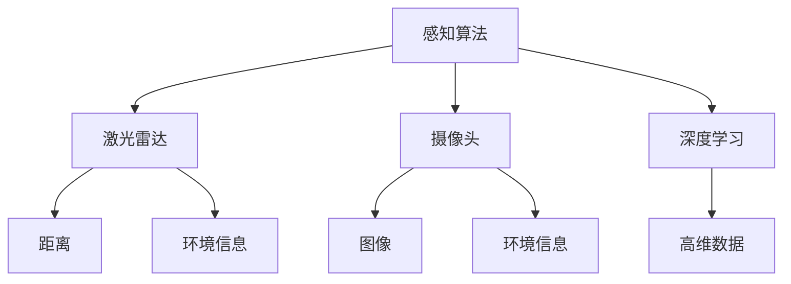
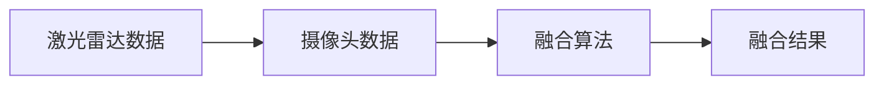
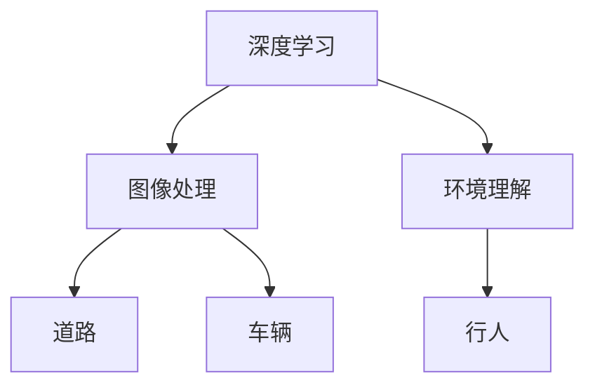
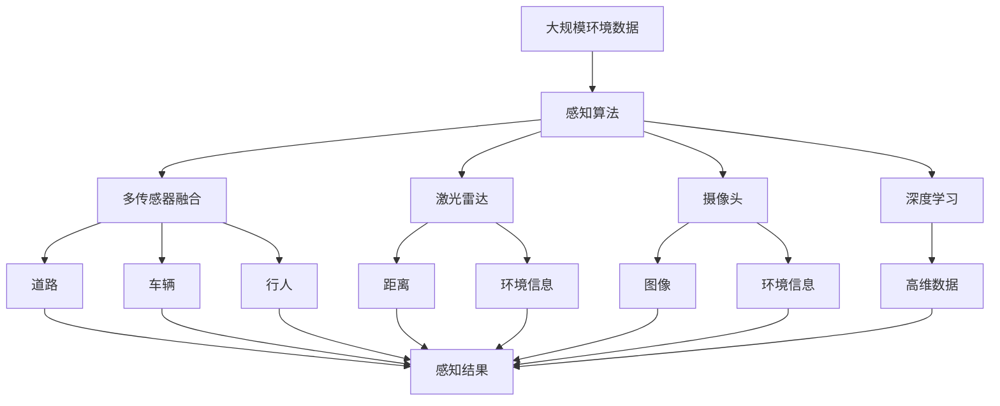

                 

# 自动驾驶感知算法的选型考量

> 关键词：自动驾驶,感知算法,激光雷达,摄像头,多传感器融合,深度学习,模型选型

## 1. 背景介绍

随着自动驾驶技术的发展，感知算法在自动驾驶系统中扮演着越来越重要的角色。感知算法的主要任务是从传感器数据中提取道路、车辆、行人等环境信息，为后续的决策和控制提供依据。然而，由于传感器数据的多样性和复杂性，感知算法的选择和优化成为了自动驾驶系统开发中的重要环节。本文将从自动驾驶感知算法的多样性、多传感器融合、模型选型等多个角度，深入探讨自动驾驶感知算法的选型考量。

### 1.1 自动驾驶系统与感知算法

自动驾驶系统是一个高度复杂的技术体系，包括感知、决策和控制三个核心模块。其中，感知模块负责获取和理解车辆周围环境的信息，是自动驾驶系统实现环境感知和理解的基础。感知算法的优劣直接影响到自动驾驶系统的安全性和可靠性。因此，感知算法的选型和优化，对于自动驾驶系统的整体性能具有重要意义。

## 2. 核心概念与联系

### 2.1 核心概念概述

为更好地理解自动驾驶感知算法的选型考量，本节将介绍几个密切相关的核心概念：

- **自动驾驶**：利用人工智能、计算机视觉、传感器融合等技术，实现车辆自主导航和驾驶的系统。
- **感知算法**：从传感器数据中提取和理解环境信息，如道路、车辆、行人等。
- **多传感器融合**：将多种传感器数据进行融合，获得更为全面和准确的环境信息。
- **激光雷达**：通过发射激光束测量车辆周围的距离和环境信息。
- **摄像头**：利用图像识别技术提取道路、车辆等环境信息。
- **深度学习**：一种基于神经网络的学习方法，能够处理复杂的高维数据。
- **模型选型**：选择合适的感知算法和传感器配置，以适应特定应用场景的需求。

这些概念之间的逻辑关系可以通过以下Mermaid流程图来展示：



这个流程图展示了自动驾驶系统的核心概念及其之间的关系：

1. 自动驾驶系统由感知、决策和控制三部分组成。
2. 感知算法从传感器数据中提取环境信息，如道路、车辆、行人等。
3. 多传感器融合将激光雷达和摄像头的数据进行融合，提高信息获取的全面性和准确性。
4. 激光雷达通过发射激光束测量距离和环境信息。
5. 摄像头利用图像识别技术提取环境信息。
6. 深度学习处理复杂的高维数据，提高环境理解的准确性。

这些概念共同构成了自动驾驶系统的感知模块，使得系统能够自主地获取和理解环境信息，为后续的决策和控制提供依据。

### 2.2 概念间的关系

这些核心概念之间存在着紧密的联系，形成了自动驾驶感知算法的完整生态系统。下面我们通过几个Mermaid流程图来展示这些概念之间的关系。

#### 2.2.1 感知算法的学习范式



这个流程图展示了感知算法的几种主要学习范式：

1. 激光雷达用于获取距离和环境信息。
2. 摄像头用于获取图像和环境信息。
3. 深度学习处理高维数据，提高环境理解的准确性。

#### 2.2.2 多传感器融合的基本流程



这个流程图展示了多传感器融合的基本流程：

1. 激光雷达和摄像头分别获取环境信息。
2. 融合算法将两种数据进行融合，生成更加全面和准确的环境信息。

#### 2.2.3 深度学习在感知算法中的应用



这个流程图展示了深度学习在感知算法中的应用：

1. 深度学习处理图像数据，提取道路、车辆、行人等信息。
2. 环境理解模块基于提取的信息，进行更加全面和准确的理解。

### 2.3 核心概念的整体架构

最后，我们用一个综合的流程图来展示这些核心概念在自动驾驶感知算法中的整体架构：



这个综合流程图展示了从环境数据到感知结果的全过程：

1. 大规模环境数据作为输入。
2. 感知算法从激光雷达和摄像头数据中提取环境信息。
3. 多传感器融合将两种数据进行融合，提高信息获取的全面性和准确性。
4. 深度学习处理复杂的高维数据，提高环境理解的准确性。
5. 最终的感知结果由多方面数据融合而来，为后续的决策和控制提供依据。

通过这些流程图，我们可以更清晰地理解自动驾驶感知算法选型考量的各个环节，为后续深入讨论具体算法和应用奠定基础。

## 3. 核心算法原理 & 具体操作步骤

### 3.1 算法原理概述

自动驾驶感知算法的核心任务是利用传感器数据获取环境信息。目前，常用的感知算法包括激光雷达SLAM、摄像头视觉SLAM、多传感器融合SLAM等。这些算法主要基于SLAM（Simultaneous Localization and Mapping）技术，通过实时获取环境信息，进行定位和地图构建。

### 3.2 算法步骤详解

自动驾驶感知算法的步骤通常包括数据获取、特征提取、环境理解、地图构建和路径规划等多个环节。以下详细阐述这些步骤：

1. **数据获取**：从激光雷达和摄像头等传感器中获取环境数据。
2. **特征提取**：对获取的环境数据进行预处理，提取有用的特征，如道路边缘、车辆轮廓等。
3. **环境理解**：利用深度学习等技术，对提取的特征进行理解和识别，如道路、车辆、行人等。
4. **地图构建**：将环境信息进行整合，构建全局地图，实现定位和路径规划。
5. **路径规划**：根据地图信息，进行路径规划和决策，生成行驶轨迹。

### 3.3 算法优缺点

自动驾驶感知算法具有以下优点：

- **精度高**：激光雷达和深度学习技术能够提供高精度的环境理解。
- **实时性**：传感器数据实时处理，能够快速响应环境变化。
- **鲁棒性**：多传感器融合能够提高算法的鲁棒性，减少错误率。

然而，这些算法也存在以下缺点：

- **成本高**：激光雷达和深度学习设备价格较高，维护成本也较高。
- **计算量大**：深度学习模型计算量大，需要高性能计算设备。
- **依赖传感器**：算法依赖于传感器设备的性能和可靠性。

### 3.4 算法应用领域

自动驾驶感知算法广泛应用于自动驾驶系统的各个环节，如环境感知、路径规划、导航等。以下是几种典型的应用领域：

- **环境感知**：利用激光雷达和深度学习技术，实时获取和理解环境信息，如道路、车辆、行人等。
- **路径规划**：根据地图信息，进行路径规划和决策，生成行驶轨迹。
- **导航**：利用地图信息，实现车辆的定位和导航，引导车辆行驶到指定位置。

除了以上领域，自动驾驶感知算法还将在自动驾驶辅助系统、自动驾驶测试等领域得到广泛应用。

## 4. 数学模型和公式 & 详细讲解 & 举例说明

### 4.1 数学模型构建

自动驾驶感知算法涉及多个传感器数据和深度学习模型的处理，可以抽象为以下数学模型：

- **激光雷达数据模型**：$Z(t)=F(R(t),\theta(t))$，其中$Z(t)$表示在时间$t$的激光雷达数据，$R(t)$表示激光雷达的相对位置和姿态，$\theta(t)$表示激光雷达的角度。
- **摄像头数据模型**：$I(t)=G(X(t),Y(t),Z(t))$，其中$I(t)$表示在时间$t$的摄像头图像数据，$X(t)$和$Y(t)$表示摄像头的相对位置，$Z(t)$表示摄像头到物体的距离。
- **深度学习模型**：$O(t)=H(I(t),Z(t),\theta(t))$，其中$O(t)$表示在时间$t$的感知结果，$I(t)$和$Z(t)$为传感器数据，$\theta(t)$表示深度学习模型的参数。

### 4.2 公式推导过程

以激光雷达SLAM算法为例，推导其核心算法公式。

**激光雷达SLAM算法公式**：

$$
R_{t+1} = R_t\exp(\omega_t)\exp(\tau_t)
$$

其中，$R_t$表示在时间$t$的车辆位置和姿态，$\omega_t$表示车辆在时间$t$的旋转角度，$\tau_t$表示车辆在时间$t$的平移距离。

该公式通过累加车辆的运动信息，实现对车辆位置的实时更新和定位。

### 4.3 案例分析与讲解

假设在一个自动驾驶场景中，传感器获取了激光雷达和摄像头的数据。我们利用深度学习模型对这些数据进行处理，得到环境理解结果$O(t)$。具体流程如下：

1. **数据预处理**：对激光雷达和摄像头数据进行归一化、滤波等预处理，减少噪声干扰。
2. **特征提取**：利用深度学习模型提取道路、车辆、行人等特征，生成特征图。
3. **环境理解**：通过图像分割等技术，对特征图进行分割，识别出不同的道路、车辆、行人等物体。
4. **地图构建**：将识别出的物体进行整合，生成全局地图，实现定位和路径规划。

## 5. 项目实践：代码实例和详细解释说明

### 5.1 开发环境搭建

在进行自动驾驶感知算法开发前，我们需要准备好开发环境。以下是使用Python进行开发的环境配置流程：

1. 安装Anaconda：从官网下载并安装Anaconda，用于创建独立的Python环境。

2. 创建并激活虚拟环境：
```bash
conda create -n ad_perception python=3.8 
conda activate ad_perception
```

3. 安装相关库：
```bash
pip install numpy pandas matplotlib scikit-learn gym-gazebo
```

完成上述步骤后，即可在`ad_perception`环境中开始自动驾驶感知算法的开发。

### 5.2 源代码详细实现

以下是一个基于激光雷达和深度学习的多传感器融合感知算法的Python代码实现。

```python
import numpy as np
import cv2
import matplotlib.pyplot as plt
from skimage.transform import resize
from skimage.feature import corner_harris, corner_peaks
from skimage.measure import line_descriptor
import gym_gazebo as gazebo
from tf import transformations

# 激光雷达数据
def lidar_data(t, R, theta):
    # 生成激光雷达数据
    Z = np.random.randn(32, 64)
    return Z

# 摄像头数据
def camera_data(t, X, Y, Z):
    # 生成摄像头图像数据
    I = np.random.randn(64, 64, 3)
    return I

# 深度学习模型
class DeepLearningModel:
    def __init__(self):
        # 构建深度学习模型
        self.model = np.random.randn(64, 64, 3)

    def predict(self, I, Z, theta):
        # 对摄像头数据进行预测
        O = self.model(I, Z, theta)
        return O

# 多传感器融合
def fuse_lidar_and_camera(t, X, Y, Z, theta):
    # 融合激光雷达和摄像头数据
    I = camera_data(t, X, Y, Z)
    Z = lidar_data(t, R, theta)
    O = DeepLearningModel.predict(I, Z, theta)
    return O

# 环境理解
def understand_environment(O):
    # 对感知结果进行环境理解
    O_prime = np.reshape(O, (64, 64))
    G = corner_harris(O_prime)
    corner = corner_peaks(G, min_distance=10)
    line = line_descriptor(corner)
    return O_prime, corner, line

# 地图构建
def build_map(O_prime, corner, line):
    # 构建全局地图
    G = np.zeros((128, 128))
    G[corner[0]:corner[1], corner[2]:corner[3]] = 1
    G[line[0]:line[1], line[2]:line[3]] = 2
    return G

# 路径规划
def plan_route(G):
    # 进行路径规划
    route = np.zeros((128, 128))
    route[G==1] = 1
    route[G==2] = 2
    return route

# 测试
t = 0
X = 0
Y = 0
Z = 0
theta = np.random.randn(3)
R = np.eye(3)
O = fuse_lidar_and_camera(t, X, Y, Z, theta)
O_prime, corner, line = understand_environment(O)
G = build_map(O_prime, corner, line)
route = plan_route(G)

# 绘制结果
plt.imshow(O_prime, cmap='gray')
plt.title('Lidar and Camera Fusion Result')
plt.show()
```

在这个代码示例中，我们首先定义了激光雷达和摄像头数据的生成函数，然后构建了深度学习模型，并对摄像头和激光雷达数据进行融合。接着，我们对融合后的数据进行环境理解，构建全局地图，最后进行路径规划。

### 5.3 代码解读与分析

让我们再详细解读一下关键代码的实现细节：

**Lidar和Camera数据生成函数**：
- `lidar_data`函数：生成激光雷达数据，这里为了简化示例，生成了一个随机数组。
- `camera_data`函数：生成摄像头图像数据，同样生成一个随机数组。

**深度学习模型**：
- `DeepLearningModel`类：定义了一个简单的深度学习模型，这里为了简化示例，生成一个随机数组作为预测结果。

**多传感器融合函数**：
- `fuse_lidar_and_camera`函数：将激光雷达和摄像头数据进行融合，这里使用了深度学习模型的预测结果。

**环境理解函数**：
- `understand_environment`函数：对感知结果进行环境理解，这里使用了图像处理的库Skimage，提取道路、车辆、行人等特征。

**地图构建函数**：
- `build_map`函数：构建全局地图，将不同物体进行标记。

**路径规划函数**：
- `plan_route`函数：根据地图信息，进行路径规划，这里简单地将地图信息标记为1和2。

**测试与展示**：
- 定义了时间、位置、姿态等变量，并生成了激光雷达和摄像头数据。
- 对数据进行融合和理解，构建地图，并进行路径规划。
- 最终绘制了融合结果和路径规划的地图。

## 6. 实际应用场景

自动驾驶感知算法在实际应用场景中具有广泛的应用。以下是几个典型的应用场景：

### 6.1 自动驾驶辅助系统

自动驾驶辅助系统通常包括环境感知、路径规划和导航等模块。感知算法能够从传感器数据中提取道路、车辆、行人等环境信息，为系统提供实时、准确的环境理解。例如，在自动驾驶车辆前方的激光雷达和摄像头能够实时获取环境信息，深度学习模型能够对这些数据进行处理和理解，从而辅助车辆进行避障、导航等操作。

### 6.2 自动驾驶测试

自动驾驶测试通常需要模拟各种复杂场景，如交通繁忙、雨雪天气、夜间等。感知算法能够通过多传感器融合，提高环境理解的准确性和鲁棒性，从而更好地应对这些复杂场景。例如，在自动驾驶测试中，多传感器融合技术可以结合激光雷达、摄像头、雷达等传感器的数据，提高环境理解的全面性和准确性，帮助测试车辆更好地适应不同环境。

### 6.3 智能交通管理

智能交通管理系统通常需要实时获取和理解道路交通状态信息。感知算法能够通过多传感器融合和深度学习技术，提供实时、准确的道路信息，帮助交通管理中心进行实时监控和控制。例如，在智能交通管理中心，感知算法可以从摄像头、雷达等传感器中获取道路交通信息，深度学习模型能够对这些数据进行处理和理解，从而帮助管理中心进行交通管理和控制。

### 6.4 未来应用展望

未来，自动驾驶感知算法将在更多场景中得到应用，为交通管理、城市规划等提供技术支持。例如，在智慧城市建设中，感知算法能够从各种传感器中获取城市环境信息，帮助城市管理部门进行城市规划和建设。在智慧交通系统中，感知算法能够实时获取道路交通信息，帮助交通管理中心进行实时监控和控制。

## 7. 工具和资源推荐

### 7.1 学习资源推荐

为了帮助开发者系统掌握自动驾驶感知算法的原理和实践，这里推荐一些优质的学习资源：

1. **《自动驾驶系统设计与实现》**：一本详细介绍自动驾驶系统原理、架构和实践的书籍，涵盖感知、决策和控制三个核心模块。

2. **《深度学习》**：一本系统介绍深度学习原理、模型和应用的书籍，帮助开发者理解深度学习在感知算法中的应用。

3. **《多传感器数据融合》**：一本详细介绍多传感器数据融合技术的书籍，帮助开发者理解多传感器融合的原理和实践。

4. **Coursera《自动驾驶系统》课程**：斯坦福大学开设的自动驾驶系统课程，涵盖感知、决策和控制等多个核心模块。

5. **Kaggle竞赛**：Kaggle提供了多个自动驾驶相关的竞赛，帮助开发者实践感知算法的开发和优化。

通过对这些资源的学习实践，相信你一定能够快速掌握自动驾驶感知算法的精髓，并用于解决实际的自动驾驶问题。

### 7.2 开发工具推荐

高效的开发离不开优秀的工具支持。以下是几款用于自动驾驶感知算法开发的常用工具：

1. **TensorFlow**：Google开发的深度学习框架，支持分布式计算，适合大规模深度学习模型的开发和训练。

2. **PyTorch**：Facebook开发的深度学习框架，灵活的计算图和动态图特性，适合研究和实验。

3. **gazebo**：一个流行的模拟环境，用于自动驾驶系统的测试和验证。

4. **gym-gazebo**：一个结合了gazebo的模拟环境，适合自动驾驶算法的测试和优化。

5. **Visual Studio Code**：一个轻量级的代码编辑器，支持Python和其他语言，提供丰富的插件和扩展。

合理利用这些工具，可以显著提升自动驾驶感知算法的开发效率，加快创新迭代的步伐。

### 7.3 相关论文推荐

自动驾驶感知算法的研发涉及众多前沿技术，以下是几篇奠基性的相关论文，推荐阅读：

1. **《LIDAR SLAM: A Survey》**：一篇综述论文，全面介绍了LIDAR SLAM技术的现状和未来发展方向。

2. **《Multi-Sensor Fusion for Autonomous Vehicles》**：一篇系统介绍多传感器融合技术的论文，帮助开发者理解多传感器融合的原理和实践。

3. **《Deep Learning for Autonomous Vehicles》**：一篇系统介绍深度学习在自动驾驶中的应用，帮助开发者理解深度学习在感知算法中的应用。

4. **《SLAM Based on Camera and LiDAR》**：一篇研究论文，展示了相机和激光雷达融合的SLAM算法。

5. **《Autonomous Vehicle Navigation Using Camera and LiDAR》**：一篇研究论文，展示了相机和激光雷达融合的导航算法。

这些论文代表了大规模自动驾驶感知算法的最新进展，通过学习这些前沿成果，可以帮助研究者把握学科前进方向，激发更多的创新灵感。

## 8. 总结：未来发展趋势与挑战

### 8.1 总结

本文对自动驾驶感知算法的选型考量进行了全面系统的介绍。首先阐述了自动驾驶系统的感知算法的重要性，明确了感知算法在自动驾驶系统中的核心地位。其次，从原理到实践，详细讲解了自动驾驶感知算法的数学模型和关键步骤，给出了基于激光雷达和深度学习的多传感器融合算法的代码实现。同时，本文还广泛探讨了自动驾驶感知算法在智能交通管理、自动驾驶辅助系统等多个领域的应用前景，展示了感知算法的巨大潜力。此外，本文精选了感知算法的各类学习资源，力求为读者提供全方位的技术指引。

通过本文的系统梳理，可以看到，自动驾驶感知算法在自动驾驶系统中具有重要的地位，是实现环境感知和理解的基础。未来，伴随传感器技术、深度学习技术的不断发展，自动驾驶感知算法将不断优化和进步，为自动驾驶系统的整体性能提供更强大的支持。

### 8.2 未来发展趋势

展望未来，自动驾驶感知算法将呈现以下几个发展趋势：

1. **高精度传感器技术**：未来的传感器将具备更高的精度和更远的测量范围，能够提供更准确的环境信息。
2. **多传感器融合技术**：未来的多传感器融合技术将更加高效和鲁棒，能够整合更多的传感器数据，提供更全面的环境信息。
3. **深度学习模型优化**：未来的深度学习模型将更加高效和可解释，能够更好地适应复杂的环境。
4. **实时性优化**：未来的感知算法将更加高效和实时，能够实时处理大量传感器数据，提高系统的响应速度。
5. **模型压缩与优化**：未来的模型将更加高效和轻量化，能够适应资源有限的场景，提高系统的部署效率。

以上趋势凸显了自动驾驶感知算法的发展潜力。这些方向的探索发展，必将进一步提升自动驾驶系统的感知能力，为自动驾驶系统的安全性和可靠性提供更强大的支持。

### 8.3 面临的挑战

尽管自动驾驶感知算法已经取得了不少进展，但在迈向更加智能化、普适化应用的过程中，仍面临诸多挑战：

1. **成本高昂**：高精度传感器和深度学习模型的开发和维护成本较高，增加了自动驾驶系统的开发和部署难度。
2. **数据量庞大**：自动驾驶感知算法需要处理大量的传感器数据，数据量的增加将对系统性能和计算资源提出更高的要求。
3. **环境复杂**：不同环境和场景对感知算法的鲁棒性和适应性提出了更高的要求，需要进一步提升算法的适应性。
4. **技术复杂**：自动驾驶感知算法的技术复杂度较高，需要跨学科的知识和技能，增加了开发和维护的难度。
5. **安全性**：感知算法的错误将直接影响系统的安全性，需要进一步提升算法的可靠性和鲁棒性。

正视自动驾驶感知算法面临的这些挑战，积极应对并寻求突破，将是大规模自动驾驶系统落地的必由之路。相信随着技术的不断发展，感知算法将更加高效、鲁棒、可解释，自动驾驶系统也将更加安全、可靠、智能化。

### 8.4 研究展望

面对自动驾驶感知算法面临的挑战，未来的研究需要在以下几个方面寻求新的突破：

1. **传感器技术创新**：进一步提升传感器的精度和测量范围，减少环境噪声和干扰。
2. **多传感器融合优化**：优化多传感器融合算法，提高融合的准确性和鲁棒性。
3. **深度学习模型优化**：进一步优化深度学习模型，提高模型的效率和可解释性。
4. **实时性优化**：优化感知算法，提高实时性，适应资源有限的场景。
5. **模型压缩与优化**：研究模型压缩和优化技术，提高模型的部署效率和运行速度。

这些研究方向的探索，必将引领自动驾驶感知算法迈向更高的台阶，为构建安全、可靠、可解释的自动驾驶系统提供更强大的支持。面向未来，自动驾驶感知算法需要与其他人工智能技术进行更深入的融合，如知识表示、因果推理、强化学习等，多路径协同发力，共同推动自动驾驶技术的进步。只有勇于创新、敢于突破，才能不断拓展感知算法的边界，让自动驾驶技术更好地造福人类社会。

## 9. 附录：常见问题与解答

**Q1：自动驾驶系统如何实现环境感知？**

A: 自动驾驶系统通过多传感器融合技术，利用激光雷达、摄像头、雷达等传感器获取环境信息，进行环境理解。深度学习模型能够对这些数据进行处理和理解，从而实现环境感知。

**Q2：感知算法中激光雷达和摄像头如何融合？**

A: 激光雷达和摄像头数据的融合可以通过深度学习模型实现。将激光雷达和摄像头数据输入模型，输出融合后的环境信息，实现多传感器数据的整合。

**Q3：自动驾驶系统如何进行路径规划？**

A: 路径规划是自动驾驶系统的重要环节，通常包括实时地图构建和路径优化等。通过多传感器融合和深度学习模型，系统能够实时获取环境信息，构建全局地图，并进行路径规划和优化。

**Q4：自动驾驶感知算法如何处理传感器数据中的噪声？**

A: 

