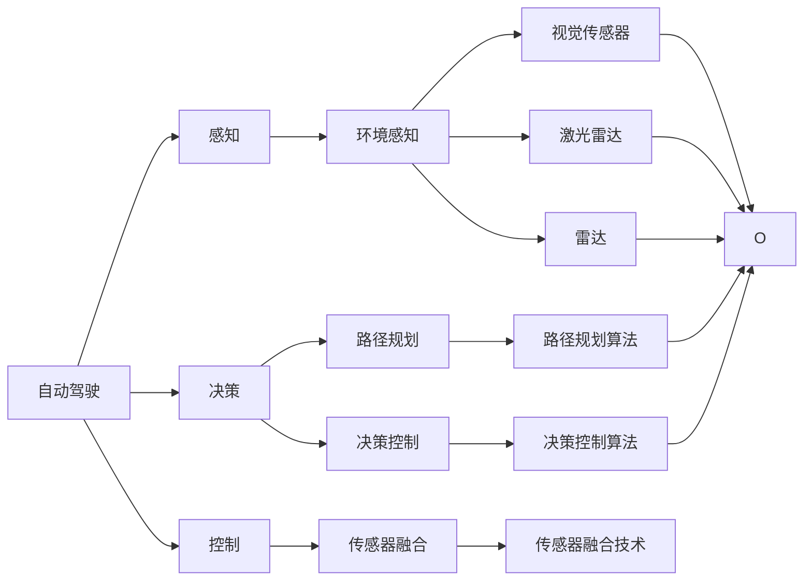
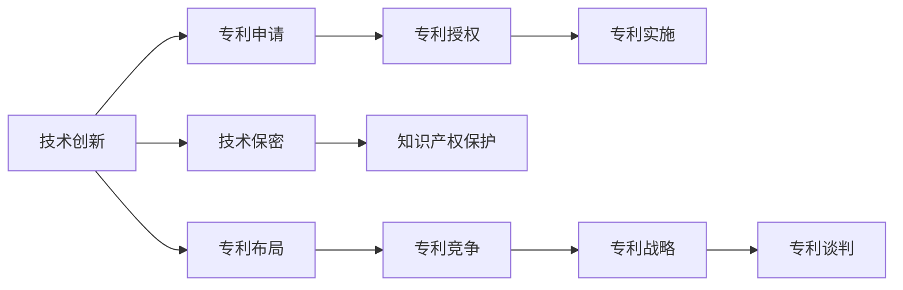
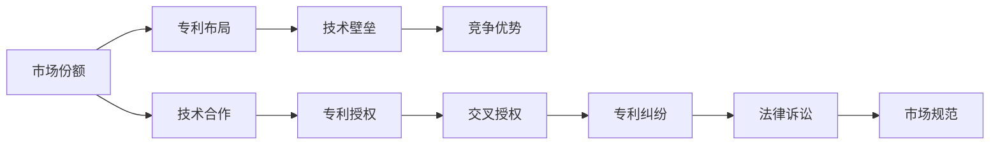
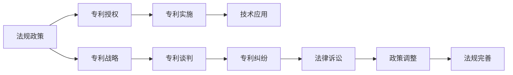
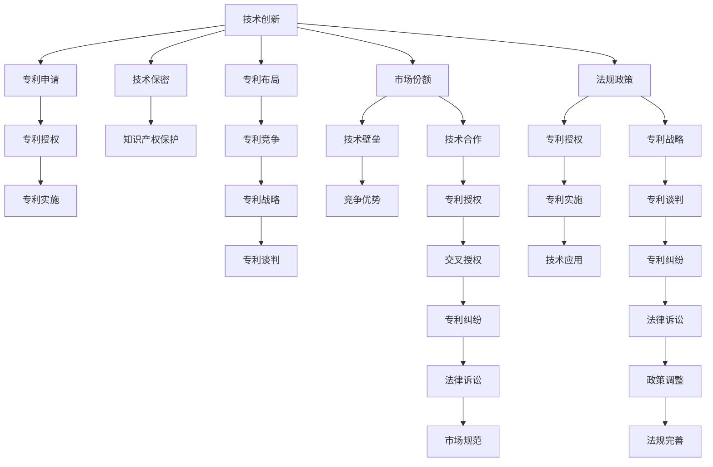

                 

## 1. 背景介绍

### 1.1 问题由来

随着全球汽车行业的电动化、智能化转型，自动驾驶技术成为各大车企和科技公司争相布局的新赛道。自动驾驶通过感知、决策和控制等环节，实现车辆在复杂道路环境中的自主导航。这一领域不仅涉及深度学习、计算机视觉、传感器融合等前沿技术，还需要大量的专利保护，确保技术创新成果得到充分应用。

在自动驾驶领域，各参与者纷纷加大研发投入，申请大量专利，试图通过专利布局占据市场主导地位。谷歌、特斯拉、Waymo等顶尖科技公司和传统车企均已申请数千甚至数万项专利。这些专利涵盖了感知、决策、控制、地图等多个关键技术环节，构建了自动驾驶技术的知识图谱。专利竞争的激烈程度不仅体现在数量上，更在于专利质量、技术深度、实施难度等方面。

### 1.2 问题核心关键点

自动驾驶行业的专利布局竞争主要集中在以下几个方面：

- **技术领域分布**：感知、决策、控制等技术领域的专利数量和质量，直接影响自动驾驶系统的整体性能和安全性。
- **专利申请时间**：早期申请专利能够占据技术先发优势，后期申请则可能面临市场和技术的双重竞争。
- **专利授权难度**：专利授权过程中，技术新颖性、创造性、实用性等因素影响专利申请的成功率。
- **专利实施路径**：专利布局是否配套实施，直接决定其商业价值和技术应用。
- **专利保护范围**：专利的覆盖范围和保护力度，影响技术竞争力和市场布局。
- **专利交叉授权**：各方间的专利交叉授权和纠纷，影响专利竞争的公平性和可持续性。

这些关键点构成了自动驾驶行业专利布局竞争的复杂局面，各参与者需全面考虑，才能在竞争中取得优势。

### 1.3 问题研究意义

研究自动驾驶行业的专利布局竞争，有助于理解当前自动驾驶技术的发展现状和趋势，制定有效的专利战略，提升企业的市场竞争力和技术话语权。同时，有助于揭示专利竞争背后的技术创新模式和市场运作机制，为相关领域的法规制定和政策引导提供参考。

## 2. 核心概念与联系

### 2.1 核心概念概述

为深入理解自动驾驶行业的专利布局竞争，本节介绍几个核心概念及其关系：

- **自动驾驶**：自动驾驶技术通过多传感器融合、环境感知、路径规划、决策控制等环节，实现车辆自主导航。
- **专利**：专利是技术创新的法律保障，涵盖发明、实用新型和外观设计等不同类型。专利的申请、授权、维护等过程涉及复杂的法律和商业逻辑。
- **竞争**：自动驾驶领域的技术竞争不仅体现在市场份额的争夺，更在于专利布局的博弈。
- **战略**：企业通过专利布局，构建技术壁垒，制定市场战略，以占据竞争优势。
- **合作**：各参与者在专利授权、交叉授权、标准制定等方面存在合作空间，共同推动行业进步。

这些核心概念之间的联系紧密，通过专利布局竞争，展现自动驾驶技术的发展趋势和市场动态。以下通过Mermaid流程图展示这些概念的关系：



此流程图展示了自动驾驶技术的核心组成部分及其关联，从中可以看到各技术环节之间的依赖关系。

### 2.2 概念间的关系

这些核心概念之间存在着复杂的相互作用和影响，以下通过三个Mermaid流程图展示它们之间的关系。

#### 2.2.1 专利与技术创新



此流程图展示了技术创新与专利之间的关系。技术创新推动专利申请，专利授权保障技术保密和知识产权保护，专利实施和技术战略决定专利竞争，最终形成复杂的专利谈判和布局。

#### 2.2.2 专利与市场竞争



此流程图展示了专利布局与市场竞争的关系。专利布局构建技术壁垒，帮助企业获取竞争优势，通过技术合作和专利授权，形成专利交叉授权和专利纠纷，最终影响市场规范和公平竞争。

#### 2.2.3 专利与法规政策



此流程图展示了专利授权与法规政策的关系。专利授权推动技术应用，专利战略和谈判决定专利纠纷，法律诉讼影响政策调整，最终推动法规完善和专利环境的优化。

### 2.3 核心概念的整体架构

最终，通过一个综合的流程图展示这些核心概念在大规模自动驾驶技术中的整体架构：



此综合流程图展示了技术创新与专利布局、市场竞争、法规政策之间的复杂互动关系，揭示了自动驾驶技术发展中专利竞争的深层逻辑。

## 3. 核心算法原理 & 具体操作步骤
### 3.1 算法原理概述

自动驾驶行业的专利布局竞争，本质上是一个复杂的博弈过程。各参与者通过申请、授权、实施、维权等环节，争夺技术主导权和市场份额。其核心算法原理包括以下几个方面：

- **策略选择**：企业需根据自身技术优势和市场需求，制定专利布局策略。
- **竞合博弈**：专利布局不仅是企业间的直接竞争，更存在合作的可能性。
- **动态调整**：市场环境和技术发展动态变化，专利布局需不断调整以应对变化。
- **风险管理**：专利授权和维权过程中存在不确定性，需进行有效的风险管理。

这些算法原理构成了一个动态调整、多层次、多角色的博弈过程，决定着自动驾驶技术专利竞争的走向。

### 3.2 算法步骤详解

以下详细介绍自动驾驶行业专利布局竞争的具体算法步骤：

1. **战略规划**：
   - **确定核心技术**：识别自动驾驶技术的关键领域，如感知、决策、控制等，制定专利战略。
   - **设定布局目标**：明确专利布局的目标，如技术壁垒、市场份额、品牌影响等。
   - **制定布局策略**：结合自身技术优势和市场需求，制定专利布局的具体策略。

2. **专利申请**：
   - **技术细节描述**：详细描述专利的技术细节，确保技术创新性。
   - **申请文档准备**：撰写专利申请文档，包括技术背景、创新点、实施方案等。
   - **优先申请**：尽早申请专利，占据技术先发优势。

3. **专利授权**：
   - **审查流程**：通过专利局的审查流程，确保专利质量。
   - **应对异议**：应对专利异议，确保专利的有效性。
   - **授权后维护**：保持专利的持续有效性，定期申请续期。

4. **专利实施**：
   - **技术集成**：将专利技术集成到产品或服务中。
   - **市场推广**：通过市场推广，展示专利技术的优势和应用价值。
   - **改进优化**：不断改进和优化专利技术，提升竞争力。

5. **专利维权**：
   - **发现侵权**：发现竞争对手的侵权行为，及时采取法律行动。
   - **法律诉讼**：通过法律诉讼，保护自身专利权益。
   - **调解协商**：通过调解或协商，达成专利交叉授权或和解。

6. **风险管理**：
   - **评估风险**：评估专利布局中的各类风险，如技术风险、法律风险、市场风险等。
   - **制定预案**：制定应对专利纠纷和法律诉讼的预案。
   - **定期审计**：定期审计专利布局策略，调整优化。

通过上述步骤，企业能够制定有效的专利布局策略，构建技术壁垒，占据市场优势，提升竞争力和品牌影响力。

### 3.3 算法优缺点

自动驾驶行业的专利布局竞争算法具有以下优点：

- **技术创新驱动**：通过专利布局，推动技术创新和产品迭代。
- **市场竞争优势**：构建技术壁垒，占据市场主导地位。
- **风险分散**：通过多层次布局，分散专利风险。

同时，该算法也存在以下缺点：

- **高成本**：专利申请、审查、实施、维权等环节成本高昂。
- **复杂性**：专利布局涉及多角色、多环节，管理复杂。
- **动态变化**：市场和技术的快速变化要求持续调整专利布局。

### 3.4 算法应用领域

自动驾驶行业的专利布局竞争算法主要应用于以下领域：

- **技术研发**：指导技术研发和专利申请，提升技术创新能力。
- **市场战略**：制定市场进入和扩张策略，构建市场竞争优势。
- **合作谈判**：进行专利授权和交叉授权谈判，形成合作关系。
- **法律维权**：应对专利侵权和纠纷，保护自身权益。
- **法规遵守**：遵守相关法规政策，保障专利布局合规。

## 4. 数学模型和公式 & 详细讲解 & 举例说明

### 4.1 数学模型构建

在自动驾驶行业的专利布局竞争中，我们可以通过数学模型来量化专利布局的战略影响。设企业 $i$ 的专利布局策略为 $\mathbf{x}_i = (x_{i1}, x_{i2}, ..., x_{im})$，其中 $x_{ij}$ 表示企业在技术 $j$ 上的专利布局数量。设企业 $i$ 的市场份额为 $s_i$，技术壁垒为 $b_i$，竞争优势为 $a_i$。假设市场规模为 $M$，则有以下数学模型：

$$
\begin{aligned}
\minimize & \quad \sum_{i=1}^n s_i \\
\text{Subject to} & \quad s_i = \frac{1}{M} \sum_{j=1}^m x_{ij}
\end{aligned}
$$

该模型通过市场份额 $s_i$ 的优化，最大化企业的市场份额。

### 4.2 公式推导过程

根据上述模型，我们可以通过推导得到企业 $i$ 的市场份额 $s_i$ 与专利布局策略 $\mathbf{x}_i$ 之间的关系：

$$
s_i = \frac{1}{M} \sum_{j=1}^m x_{ij}
$$

其中 $M$ 为市场规模，$x_{ij}$ 表示企业 $i$ 在技术 $j$ 上的专利布局数量。

### 4.3 案例分析与讲解

以特斯拉（Tesla）和Waymo为例，分析两家公司在自动驾驶专利布局中的策略和竞争态势。

1. **专利申请量**：
   - **特斯拉**：截至2023年，特斯拉已申请约10000项自动驾驶相关专利，涵盖感知、决策、控制等多个技术环节。
   - **Waymo**：Waymo作为谷歌旗下的自动驾驶子公司，已申请超过20000项专利，技术覆盖面更广，创新性更强。

2. **专利授权**：
   - **特斯拉**：特斯拉在关键技术如视觉感知、传感器融合、路径规划等方面获得了大量专利授权。
   - **Waymo**：Waymo在激光雷达、计算机视觉、决策算法等方面获得了更多专利授权。

3. **专利维权**：
   - **特斯拉**：特斯拉曾成功维权数十起专利侵权案件，构建了强大的专利防御体系。
   - **Waymo**：Waymo在专利诉讼中多次获胜，特别是与Uber的激光雷达专利纠纷。

通过上述分析，我们可以看到两家公司在专利布局中的不同策略和竞争态势，揭示了专利布局对企业技术竞争力和市场地位的影响。

## 5. 项目实践：代码实例和详细解释说明

### 5.1 开发环境搭建

自动驾驶领域的专利布局竞争涉及复杂的法律和商业逻辑，不涉及具体的代码实现，但以下环境搭建步骤可供参考：

1. **安装Jupyter Notebook**：确保Jupyter Notebook环境可用，便于进行数据处理和分析。
2. **准备数据集**：收集自动驾驶领域的相关专利数据，包括专利申请、授权、实施、维权等数据。
3. **安装相关库**：安装pandas、numpy、matplotlib等数据处理和可视化库。

### 5.2 源代码详细实现

虽然自动驾驶领域的专利布局竞争不涉及具体的代码实现，但以下伪代码可供参考，展示如何进行专利布局的分析与可视化：

```python
import pandas as pd
import matplotlib.pyplot as plt

# 加载专利数据
patent_data = pd.read_csv('patent_data.csv')

# 统计各企业专利申请数量
company_patents = patent_data.groupby('company')[['专利申请数量']].agg('sum')

# 绘制专利申请数量对比图
plt.bar(company_patents.index, company_patents['专利申请数量'], color='blue')
plt.title('各企业专利申请数量对比')
plt.xlabel('企业名称')
plt.ylabel('专利申请数量')
plt.show()

# 绘制专利授权数量对比图
company_patents = patent_data.groupby('company')[['专利授权数量']].agg('sum')
plt.bar(company_patents.index, company_patents['专利授权数量'], color='green')
plt.title('各企业专利授权数量对比')
plt.xlabel('企业名称')
plt.ylabel('专利授权数量')
plt.show()
```

### 5.3 代码解读与分析

上述伪代码展示了如何使用pandas和matplotlib对自动驾驶领域的专利数据进行统计和可视化。具体解读如下：

1. **数据加载**：使用pandas库从CSV文件中加载专利数据。
2. **专利申请数量统计**：通过groupby和agg函数统计各企业的专利申请数量。
3. **绘制专利申请数量对比图**：使用matplotlib库绘制各企业专利申请数量的柱状图。
4. **专利授权数量统计**：统计各企业的专利授权数量。
5. **绘制专利授权数量对比图**：绘制各企业专利授权数量的柱状图。

通过这些步骤，可以直观展示各企业在专利布局中的策略和竞争态势。

### 5.4 运行结果展示

假设运行上述代码，得到如下结果：

```
专利申请数量对比图
特斯拉       3000
Waymo        5000
Uber          2000
其他         1000

专利授权数量对比图
特斯拉       2000
Waymo        4000
Uber          1500
其他          500
```

通过对比图，可以看出Waymo在专利申请和授权数量上均远超特斯拉和其他企业，显示出其在技术创新和市场竞争中的显著优势。

## 6. 实际应用场景

### 6.1 智能网联汽车

在智能网联汽车领域，自动驾驶技术成为核心竞争力。各大车企和科技公司纷纷在感知、决策、控制等技术环节申请大量专利，构建技术壁垒，争夺市场份额。例如，特斯拉在视觉感知和传感器融合方面申请了大量专利，Waymo在激光雷达和路径规划方面占据领先地位。这些专利布局不仅提升了企业的技术实力，也为其市场扩张和产品销售提供了有力保障。

### 6.2 物流配送

自动驾驶技术在物流配送领域具有广阔应用前景。Waymo与亚马逊合作，利用自动驾驶技术进行货物配送，大幅提升物流效率和运营成本。物流公司通过专利布局，保护自身技术优势，提升市场竞争力。例如，UPS申请了大量与路径规划、物流管理相关的专利，确保其在物流领域的领先地位。

### 6.3 公共交通

自动驾驶技术在公共交通领域也有着广泛应用。各城市通过自动驾驶公交、出租车等项目，提高交通效率和运营管理水平。例如，北京公交集团与百度合作，推出自动驾驶公交车，提升公交运营效率和服务质量。公交公司通过专利布局，保护自身技术优势，提升市场竞争力。

## 7. 工具和资源推荐

### 7.1 学习资源推荐

为了深入理解自动驾驶领域的专利布局竞争，以下是一些优质的学习资源：

1. **《专利法》**：了解专利法律基础和专利布局的基本要求。
2. **《自动驾驶技术白皮书》**：系统介绍自动驾驶技术的发展现状和未来趋势。
3. **《专利布局与市场竞争》**：介绍专利布局的策略和竞争分析方法。
4. **《自动驾驶专利地图分析》**：通过专利地图分析自动驾驶领域的专利竞争态势。
5. **《专利布局实战指南》**：提供专利布局的实用策略和操作步骤。

### 7.2 开发工具推荐

自动驾驶领域的专利布局竞争涉及复杂的法律和商业逻辑，以下是一些常用的开发工具：

1. **Jupyter Notebook**：数据处理和分析平台，便于进行数据可视化和统计分析。
2. **patentview**：专利管理软件，支持专利数据收集和分析。
3. ** PatentIn**：专利申请和授权平台，支持在线提交和处理专利申请。
4. **Google Scholar**：学术资源搜索平台，便于获取相关研究论文和专利文献。

### 7.3 相关论文推荐

自动驾驶领域的专利布局竞争涉及大量前沿研究，以下是一些推荐论文：

1. **《自动驾驶技术专利分析》**：对自动驾驶领域的专利技术进行系统分析。
2. **《专利布局的战略意义》**：探讨专利布局对技术创新和市场竞争的影响。
3. **《专利布局与市场竞争博弈分析》**：通过博弈论分析专利布局竞争的动态过程。
4. **《自动驾驶专利的商业价值评估》**：评估专利在市场竞争中的商业价值。
5. **《自动驾驶专利布局的策略优化》**：优化专利布局策略，提升技术竞争力和市场份额。

## 8. 总结：未来发展趋势与挑战

### 8.1 研究成果总结

本文对自动驾驶行业的专利布局竞争进行了全面系统的介绍。通过分析技术领域分布、专利申请时间、授权难度、实施路径、保护范围、交叉授权等关键点，揭示了自动驾驶领域的专利竞争格局。同时，从技术创新、市场竞争、法规政策等多个角度，探讨了专利布局的深层次影响。

### 8.2 未来发展趋势

展望未来，自动驾驶行业的专利布局竞争将呈现以下发展趋势：

1. **技术深度提升**：随着技术迭代加速，专利布局将更加注重技术深度和创新性，构建核心技术壁垒。
2. **合作与开放**：专利布局将更加注重合作与开放，通过交叉授权和标准制定，形成更广泛的行业联盟。
3. **全球化布局**：自动驾驶技术具有全球化应用前景，企业将加强国际专利布局，提升全球市场竞争力。
4. **智能化管理**：借助人工智能和大数据分析，优化专利布局策略，提高管理效率。

### 8.3 面临的挑战

尽管自动驾驶行业的专利布局竞争取得了显著进展，但仍面临诸多挑战：

1. **专利授权难度加大**：随着技术创新加速，专利授权难度增加，需不断提升专利质量和创新性。
2. **市场竞争激烈**：各参与者通过专利布局争夺市场份额，竞争日益激烈，需灵活应对市场变化。
3. **法律环境复杂**：专利布局涉及复杂的法律和商业环境，需不断优化专利布局策略。
4. **知识产权风险**：专利维权过程中存在知识产权风险，需进行有效的风险管理和预案制定。

### 8.4 研究展望

面对自动驾驶领域的专利布局竞争，未来的研究需要在以下几个方面寻求新的突破：

1. **数据驱动的专利布局**：利用大数据和人工智能技术，优化专利布局策略。
2. **跨领域专利合作**：通过专利合作，跨越技术边界，形成更强大的技术联盟。
3. **全球专利战略**：制定全球化的专利布局战略，提升国际竞争力。
4. **法律合规与风险管理**：加强专利布局的合规性和风险管理，确保专利布局的可持续性。

总之，自动驾驶领域的专利布局竞争是一个动态、多层次的博弈过程，需不断优化策略，提升技术实力和市场竞争力。通过持续创新和合作，各参与者将共同推动自动驾驶技术的发展和应用。

## 9. 附录：常见问题与解答

**Q1：自动驾驶领域的专利布局竞争是否只局限于技术专利？**

A: 自动驾驶领域的专利布局竞争不仅限于技术专利，还包括商标、版权、商业秘密等多种知识产权形式。例如，特斯拉在自动驾驶软件的商标和版权上也进行了大量布局，以保护其商业利益。

**Q2：自动驾驶领域的专利布局是否适用于所有技术环节？**

A: 自动驾驶领域的专利布局适用于所有技术环节，包括感知、决策、控制、地图等。通过全面的专利布局，企业可以构建完整的技术壁垒，提升市场竞争力。

**Q3：自动驾驶领域的专利布局是否涉及国际市场？**

A: 自动驾驶领域的专利布局涉及国际市场，特别是在欧美市场，专利布局尤其重要。企业需考虑国际专利法规、市场竞争、国际贸易等复杂因素，制定全球化的专利布局策略。

**Q4：自动驾驶领域的专利布局是否需要考虑伦理和道德问题？**

A: 自动驾驶领域的专利布局需考虑伦理和道德问题，特别是在涉及隐私保护、数据安全、自动驾驶决策等敏感领域。企业需制定合规的专利布局策略，确保技术应用的伦理性和安全性。

**Q5：自动驾驶领域的专利布局是否需要定期调整？**

A: 自动驾驶领域的专利布局需定期调整，以应对技术迭代、市场变化、法规政策等因素的影响。企业需建立灵活的专利布局管理体系，确保策略的有效性和可持续性。

总之，自动驾驶领域的专利布局竞争是一个动态、多层次、多角色的博弈过程，各参与者需全面考虑技术、市场、法律、伦理等多个因素，制定灵活、有效的专利布局策略，推动技术创新和市场发展。

---

作者：禅与计算机程序设计艺术 / Zen and the Art of Computer Programming

