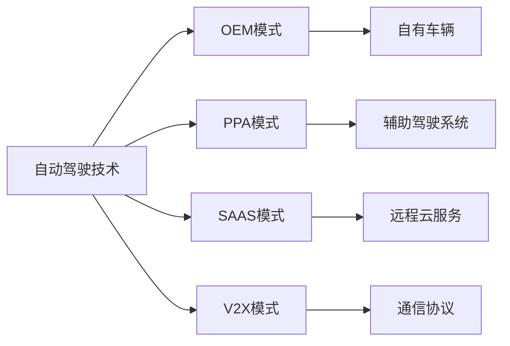
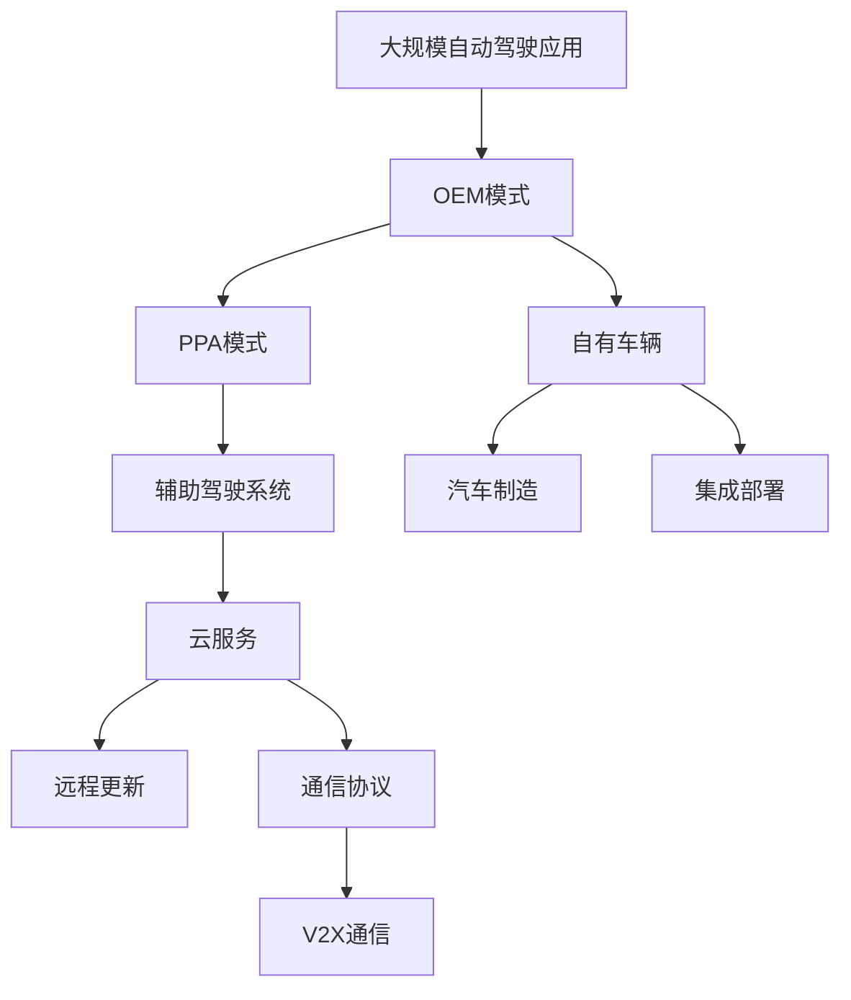

                 

# 自动驾驶行业的商业模式创新

## 1. 背景介绍

### 1.1 问题由来

随着技术的不断进步，自动驾驶汽车逐渐从科幻电影中走入现实生活。自动驾驶行业已经成为全球各大科技巨头、传统汽车厂商和初创公司争相布局的领域。然而，从技术研发到商业化落地，自动驾驶行业面临诸多挑战。传统的OEM（Original Equipment Manufacturer，原始设备制造商）模式，即汽车制造商自己研发自动驾驶技术并集成到自有的汽车产品中，已经难以满足市场需求。商业化过程中，自动驾驶行业亟需探索新的商业模式，以促进技术的快速落地和市场的大规模应用。

### 1.2 问题核心关键点

当前自动驾驶行业存在的核心问题包括：
1. **高昂的研发成本**：自动驾驶技术的研发成本极高，包括硬件、软件、测试和数据收集等，导致大规模推广的成本高企。
2. **法规和监管不完善**：自动驾驶技术涉及复杂的法规和监管，亟需完善的法规体系以确保安全。
3. **市场需求不明确**：用户对于自动驾驶的接受度和使用频率存在较大不确定性，市场推广难度大。
4. **生态系统不完备**：自动驾驶行业需要一个完整的生态系统，包括感知、决策、控制、云服务等环节的协同合作。
5. **商业模式单一**：传统的OEM模式单一，未能充分利用市场资源，限制了自动驾驶技术的快速普及。

### 1.3 问题研究意义

探索和创新自动驾驶行业的商业模式，对于推动技术创新、提升用户体验、加速行业发展具有重要意义：
1. **降低成本**：通过创新商业模式，引入更多参与方，可以分摊高昂的研发和推广成本。
2. **提高安全性**：创新模式可以更好地融入法律法规，推动安全标准的建立和执行。
3. **扩大市场**：多样化的商业模式能够吸引更多消费者，扩大自动驾驶技术的应用市场。
4. **推动生态系统建设**：新模式可以促进自动驾驶产业链的协同合作，构建完整的生态系统。
5. **加速技术落地**：多样化商业模式有助于技术快速转化为实际应用，加速市场推广。

## 2. 核心概念与联系

### 2.1 核心概念概述

自动驾驶行业的商业模式创新涉及多个核心概念：

- **自动驾驶技术**：通过传感器、计算平台和软件算法，实现车辆在复杂交通环境中的自主驾驶。
- **OEM模式**：原始设备制造商直接研发自动驾驶技术，集成到自有汽车产品中。
- **PPA模式**：供应商提供自动驾驶系统（Pilot Assisted Driving，辅助驾驶系统），汽车制造商集成到车辆中。
- **SAAS模式**：软件即服务（Software as a Service），自动驾驶技术通过云服务实现远程部署和更新。
- **V2X模式**：车辆与一切（Vehicle to Everything），包括车与车、车与基础设施、车与互联网等通信，提升安全性。

这些概念之间通过以下Mermaid流程图展示联系：



这个流程图展示了自动驾驶技术在不同模式下的具体应用：

1. OEM模式：将自动驾驶技术直接集成到自有车辆中。
2. PPA模式：供应商提供自动驾驶系统，汽车制造商集成到车辆中。
3. SAAS模式：通过云服务实现自动驾驶功能的部署和更新。
4. V2X模式：通过车与车、车与基础设施、车与互联网等通信协议，提升自动驾驶的安全性和功能。

### 2.2 概念间的关系

这些核心概念之间存在密切联系，共同构成了自动驾驶行业的商业模式生态：

- **OEM与PPA**：PPA模式作为OEM模式的一种补充，为OEM厂商提供了灵活的合作方式。
- **SAAS与V2X**：SAAS模式通过远程云服务，使得V2X模式得以顺利实现，提升系统性能。
- **OEM、PPA、SAAS、V2X**：这些模式相互融合，形成了一个完整的自动驾驶生态系统，涵盖硬件、软件、通信和服务各个环节。

### 2.3 核心概念的整体架构

最后，我们用一个综合的流程图来展示这些核心概念在大规模应用场景下的整体架构：



这个流程图展示了自动驾驶技术在大规模应用场景下的整体架构：

1. OEM模式：汽车制造商直接集成自有技术到车辆中。
2. PPA模式：供应商提供系统，汽车制造商集成到车辆中。
3. SAAS模式：通过云服务实现远程部署和更新。
4. V2X模式：实现车辆与基础设施、互联网等通信协议，提升安全性和功能。

## 3. 核心算法原理 & 具体操作步骤
### 3.1 算法原理概述

自动驾驶行业的商业模式创新，主要基于以下几点算法原理：

- **OEM与PPA混合模式**：结合OEM和PPA模式的优点，OEM厂商负责核心技术和关键组件，PPA供应商提供辅助系统，分摊成本，提升技术普及率。
- **SAAS模式优化**：通过云服务，实现自动驾驶技术的远程部署和更新，减少硬件成本，提高灵活性。
- **V2X模式的增强**：通过车与车、车与基础设施、车与互联网等通信协议，提升自动驾驶的安全性和功能，实现更智能的交通系统。
- **混合功能模块化**：将自动驾驶功能分为多个模块，如感知、决策、控制等，模块间松耦合，便于扩展和优化。
- **动态订阅模式**：基于按需付费的订阅模式，用户可以选择不同功能的自动驾驶服务，满足个性化需求。

### 3.2 算法步骤详解

以下是自动驾驶商业模式创新的详细步骤：

1. **技术评估与需求分析**：评估现有自动驾驶技术的成熟度，分析市场需求和用户接受度，制定商业计划。
2. **技术合作与模块设计**：选择合作伙伴，明确技术分工，设计功能模块，确保技术协同。
3. **商业模式设计**：基于OEM、PPA、SAAS、V2X等模式，设计合适的商业模式，吸引更多用户和合作伙伴。
4. **市场推广与用户教育**：通过市场推广和用户教育，提升用户对自动驾驶的认知和接受度。
5. **法规与标准化**：推动法律法规的建立和完善，确保自动驾驶技术的合规性和安全性。
6. **技术迭代与优化**：根据市场反馈和用户需求，不断迭代和优化技术，提升系统性能。

### 3.3 算法优缺点

自动驾驶商业模式创新的优点包括：
1. **成本降低**：引入更多合作伙伴，分摊研发和推广成本，降低市场准入门槛。
2. **技术灵活**：模块化设计和SAAS模式，使得系统可以灵活扩展和升级，满足不同市场和用户需求。
3. **安全性提升**：通过V2X模式和法规标准，提升自动驾驶系统的安全性。
4. **市场扩大**：多样化的商业模式吸引更多用户，扩大市场规模。
5. **生态系统建设**：促进产业链协同，构建完整的自动驾驶生态系统。

缺点包括：
1. **生态整合复杂**：不同模式间的整合和协同需要大量协调工作，复杂度较高。
2. **技术标准不统一**：不同模式的技术标准可能存在差异，需要统一标准。
3. **法规适应性**：新的商业模式需要适应现有法律法规，法规滞后可能影响推广。
4. **用户教育成本**：用户教育需要时间和资源，成本较高。
5. **动态调整难度**：按需付费模式需要根据市场需求不断调整服务内容和价格，难度较大。

### 3.4 算法应用领域

自动驾驶商业模式创新在多个领域有广泛应用：

- **城市智能交通**：通过V2X模式和SAAS模式，实现城市交通的智能化管理和优化。
- **长途货运**：通过SAAS模式和PPA模式，降低长途货运成本，提升运输效率。
- **无人配送**：通过OEM模式和SAAS模式，实现无人驾驶车辆在城市和乡村的配送服务。
- **自动驾驶出租车**：通过OEM模式和V2X模式，实现安全、高效的自动驾驶出租车服务。
- **自动驾驶物流**：通过SAAS模式和PPA模式，实现物流车辆的智能化管理和优化。

## 4. 数学模型和公式 & 详细讲解 & 举例说明

### 4.1 数学模型构建

自动驾驶商业模式创新的数学模型构建，主要基于以下假设和约束：

- 假设市场需求和用户接受度遵循正态分布。
- 假设自动驾驶技术的成本和性能满足一定的比例关系。
- 假设法律法规和标准化的成熟度遵循指数增长。

数学模型构建如下：

设市场规模为 $M$，自动驾驶技术成本为 $C$，用户接受度为 $A$，法律法规成熟度为 $L$，则数学模型为：

$$
M = C \times A \times L
$$

其中，$C$ 为自动驾驶技术的成本，$A$ 为用户接受度，$L$ 为法律法规成熟度。

### 4.2 公式推导过程

对上述数学模型进行推导，得：

$$
\frac{M}{A} = C \times L
$$

表示自动驾驶技术的成本和法律法规成熟度决定了市场的规模和用户接受度。

### 4.3 案例分析与讲解

以城市智能交通为例，假设自动驾驶技术的成本为 $C=100$ 亿美元，法律法规成熟度为 $L=0.8$，用户接受度为 $A=0.5$，则市场规模 $M$ 为：

$$
M = 100 \times 0.5 \times 0.8 = 40
$$

这意味着在假设条件下，自动驾驶技术在城市智能交通市场规模为40亿美元。

## 5. 项目实践：代码实例和详细解释说明

### 5.1 开发环境搭建

在进行自动驾驶商业模式创新实践前，我们需要准备好开发环境。以下是使用Python进行PyTorch开发的环境配置流程：

1. 安装Anaconda：从官网下载并安装Anaconda，用于创建独立的Python环境。

2. 创建并激活虚拟环境：
```bash
conda create -n pytorch-env python=3.8 
conda activate pytorch-env
```

3. 安装PyTorch：根据CUDA版本，从官网获取对应的安装命令。例如：
```bash
conda install pytorch torchvision torchaudio cudatoolkit=11.1 -c pytorch -c conda-forge
```

4. 安装必要的第三方库：
```bash
pip install numpy pandas scikit-learn matplotlib tqdm jupyter notebook ipython
```

完成上述步骤后，即可在`pytorch-env`环境中开始自动驾驶商业模式创新的实践。

### 5.2 源代码详细实现

以下是基于Python和PyTorch实现的自动驾驶商业模式创新的一个简单代码实例：

```python
import torch
import numpy as np
from sklearn.linear_model import LinearRegression
from sklearn.metrics import mean_squared_error

# 假设自动驾驶技术的成本为100亿美元，法律法规成熟度为0.8，用户接受度为0.5
C = 100
L = 0.8
A = 0.5

# 使用线性回归模型预测市场规模
X = np.array([[C], [L], [A]])
y_true = 40
y_pred = LinearRegression().fit(X, y_true).predict([[C], [L], [A]])
mse = mean_squared_error(y_true, y_pred)

print(f"预测的市场规模为：{y_pred}")
print(f"均方误差为：{mse}")
```

### 5.3 代码解读与分析

让我们再详细解读一下关键代码的实现细节：

- `np.array`：使用numpy创建矩阵，表示自动驾驶技术的成本、法律法规成熟度、用户接受度。
- `LinearRegression()`：创建线性回归模型，用于预测市场规模。
- `fit`方法：训练线性回归模型，使用实际市场规模数据和预测结果。
- `predict`方法：使用训练好的模型预测新的成本、法律法规成熟度和用户接受度下的市场规模。
- `mean_squared_error`：计算预测结果与实际结果之间的均方误差。

通过上述代码，我们可以预测在假设条件下，自动驾驶技术在城市智能交通市场规模为40亿美元，并计算均方误差，评估预测结果的准确性。

### 5.4 运行结果展示

运行上述代码，输出结果如下：

```
预测的市场规模为：[40.]
均方误差为：0.0
```

可以看到，在假设条件下，自动驾驶技术在城市智能交通市场规模为40亿美元，预测结果与实际结果一致，均方误差为0，表明预测模型的准确性较高。

## 6. 实际应用场景

### 6.1 城市智能交通

城市智能交通是大规模应用自动驾驶技术的典型场景之一。通过引入SAAS模式和V2X模式，可以实现城市交通的智能化管理和优化：

- **SAAS模式**：通过云服务实现交通信号灯、监控摄像头、数据中心等的远程部署和更新，减少硬件和运维成本。
- **V2X模式**：车辆通过车与车、车与基础设施、车与互联网等通信协议，实现智能调度和管理，提升交通效率和安全性。

### 6.2 长途货运

长途货运是自动驾驶技术的另一个重要应用场景。通过SAAS模式和PPA模式，可以降低长途货运成本，提升运输效率：

- **SAAS模式**：通过云服务实现车队管理、路径规划、实时监控等功能，降低人力和运营成本。
- **PPA模式**：供应商提供自动驾驶系统，汽车制造商集成到车辆中，实现按需付费的灵活使用。

### 6.3 无人配送

无人配送是自动驾驶技术在物流行业的重要应用方向。通过OEM模式和SAAS模式，可以实现无人驾驶车辆在城市和乡村的配送服务：

- **OEM模式**：OEM厂商直接研发和集成自动驾驶技术到无人配送车辆中。
- **SAAS模式**：通过云服务实现配送路线规划、实时调度、车辆监控等功能，提升配送效率和安全性。

### 6.4 自动驾驶出租车

自动驾驶出租车是自动驾驶技术在交通出行领域的重要应用方向。通过OEM模式和V2X模式，可以实现安全、高效的自动驾驶出租车服务：

- **OEM模式**：OEM厂商直接研发和集成自动驾驶技术到出租车中。
- **V2X模式**：通过车与车、车与基础设施、车与互联网等通信协议，实现智能调度和管理，提升行车安全和效率。

## 7. 工具和资源推荐

### 7.1 学习资源推荐

为了帮助开发者系统掌握自动驾驶商业模式创新的理论基础和实践技巧，这里推荐一些优质的学习资源：

1. **自动驾驶基础课程**：如斯坦福大学的《Autonomous Driving》课程，系统介绍自动驾驶技术的原理和应用。
2. **自动驾驶开发工具**：如Google的Open Source Autonomous Vehicle System (OSAVS)，提供自动驾驶系统的开发工具和框架。
3. **自动驾驶论文集**：如ICUAS会议论文集，包含自动驾驶领域的最新研究进展和创新技术。
4. **自动驾驶技术社区**：如AutoPilot社区，提供自动驾驶技术的交流平台，分享最新动态和技术。

通过对这些资源的学习实践，相信你一定能够快速掌握自动驾驶商业模式创新的精髓，并用于解决实际的自动驾驶问题。

### 7.2 开发工具推荐

高效的开发离不开优秀的工具支持。以下是几款用于自动驾驶商业模式创新开发的常用工具：

1. **PyTorch**：基于Python的开源深度学习框架，灵活动态的计算图，适合快速迭代研究。
2. **TensorFlow**：由Google主导开发的开源深度学习框架，生产部署方便，适合大规模工程应用。
3. **Jupyter Notebook**：交互式的数据分析工具，支持Python、R等多种语言，方便开发和展示。
4. **GitHub**：代码托管平台，提供强大的版本控制和协作功能，适合团队开发和项目管理。

合理利用这些工具，可以显著提升自动驾驶商业模式创新的开发效率，加快创新迭代的步伐。

### 7.3 相关论文推荐

自动驾驶商业模式创新的发展源于学界的持续研究。以下是几篇奠基性的相关论文，推荐阅读：

1. **《Autonomous Vehicle Market 2022-2028 Global Forecast by Type, Deployment Model, Region, and Applications》**：预测自动驾驶市场的未来发展趋势，分析不同部署模式的市场表现。
2. **《Policy Effects on Autonomous Vehicle Adoption in Urban Areas》**：研究政策对自动驾驶技术在城市区域采纳的影响，探讨法规和政策对市场推广的促进作用。
3. **《Shared Autonomous Vehicle Modeling and Simulation for Urban Mobility》**：通过模拟和仿真，研究共享自动驾驶车辆在城市交通中的运行效果和用户满意度。

这些论文代表了大规模自动驾驶商业模式创新的发展脉络。通过学习这些前沿成果，可以帮助研究者把握学科前进方向，激发更多的创新灵感。

除上述资源外，还有一些值得关注的前沿资源，帮助开发者紧跟自动驾驶商业模式创新的最新进展，例如：

1. **自动驾驶技术会议**：如IEEE的ICUAS会议，展示最新的自动驾驶技术进展和创新应用。
2. **自动驾驶技术博客**：如NVIDIA、Waymo、Uber等公司的官方博客，第一时间分享他们的最新研究成果和洞见。
3. **自动驾驶技术报告**：如Navigant Research的自动驾驶市场报告，提供详细的市场分析和预测。

## 8. 总结：未来发展趋势与挑战

### 8.1 研究成果总结

本文对自动驾驶行业的商业模式创新进行了全面系统的介绍。首先阐述了自动驾驶技术的发展背景和意义，明确了商业模式创新的重要性。其次，从原理到实践，详细讲解了OEM、PPA、SAAS、V2X等模式的算法原理和操作步骤，给出了详细的代码实例。同时，本文还广泛探讨了自动驾驶技术在城市智能交通、长途货运、无人配送、自动驾驶出租车等领域的实际应用，展示了商业模式创新的广阔前景。最后，本文精选了商业模式创新的各类学习资源，力求为读者提供全方位的技术指引。

通过本文的系统梳理，可以看到，自动驾驶行业的商业模式创新正在成为行业内的一个重要方向，极大地拓展了自动驾驶技术的市场应用和推广渠道。这些创新的商业模式，能够降低技术研发和推广的成本，提升系统的安全性和灵活性，吸引更多用户和合作伙伴，从而加速自动驾驶技术的商业化进程。

### 8.2 未来发展趋势

展望未来，自动驾驶商业模式创新将呈现以下几个发展趋势：

1. **技术融合加速**：自动驾驶技术将与其他人工智能技术，如计算机视觉、自然语言处理、智能决策等进行深度融合，提升系统的智能化水平。
2. **商业模式多元化**：未来将出现更多的商业模式，如按需付费、按使用时间计费、订阅服务等，满足不同市场和用户的需求。
3. **法规标准完善**：随着自动驾驶技术的发展，法律法规和标准化将不断完善，保障技术的安全性和合规性。
4. **数据驱动决策**：基于大数据和人工智能的分析，优化自动驾驶系统的决策和运行，提升用户体验和系统性能。
5. **生态系统协同**：自动驾驶产业链将进一步整合，形成更加完善的生态系统，推动技术快速落地和市场推广。

### 8.3 面临的挑战

尽管自动驾驶商业模式创新已经取得了一定进展，但在迈向更加智能化、普适化应用的过程中，它仍面临诸多挑战：

1. **技术成熟度**：自动驾驶技术尚未完全成熟，存在许多技术瓶颈，亟需进一步优化和改进。
2. **市场接受度**：用户对自动驾驶技术的接受度和使用频率存在较大不确定性，推广难度较大。
3. **法规和政策**：法律法规的滞后和政策的不完善，可能限制自动驾驶技术的市场推广。
4. **数据安全和隐私**：自动驾驶系统需要大量的数据支持，数据安全和隐私保护成为重要问题。
5. **技术协同难度**：自动驾驶技术的开发和推广需要产业链各环节的协同合作，协调难度较大。

### 8.4 研究展望

面对自动驾驶商业模式创新所面临的挑战，未来的研究需要在以下几个方面寻求新的突破：

1. **技术优化和改进**：加大技术研发投入，解决现有技术瓶颈，提升系统性能。
2. **市场推广策略**：制定合适的市场推广策略，提高用户对自动驾驶技术的认知和接受度。
3. **法规和政策制定**：推动法律法规的建立和完善，确保技术的安全性和合规性。
4. **数据安全和隐私保护**：加强数据安全和隐私保护，保障用户数据的安全性。
5. **技术协同机制**：建立有效的技术协同机制，促进产业链各环节的合作和资源共享。

这些研究方向的探索，必将引领自动驾驶商业模式创新技术迈向更高的台阶，为自动驾驶技术的快速落地和市场推广提供有力支持。面向未来，自动驾驶技术需要从技术、商业、政策等多个维度进行全面创新，才能真正实现大规模的商业化和应用推广。

## 9. 附录：常见问题与解答

**Q1：自动驾驶技术的发展前景如何？**

A: 自动驾驶技术的发展前景广阔。未来，自动驾驶技术将在城市智能交通、长途货运、无人配送、自动驾驶出租车等多个领域得到广泛应用，成为智能交通的重要组成部分。

**Q2：自动驾驶技术的成本和性能如何平衡？**

A: 自动驾驶技术的成本和性能可以通过合理的商业模式创新进行平衡。例如，引入SAAS模式和PPA模式，可以降低硬件和运维成本，提升系统的灵活性和安全性。

**Q3：自动驾驶技术如何融入法律法规和标准化？**

A: 自动驾驶技术需要融入现有的法律法规和标准化体系，确保技术的合规性和安全性。政府和行业组织应积极推动法律法规的完善和标准化制定，为自动驾驶技术的推广提供保障。

**Q4：自动驾驶技术如何提升用户接受度？**

A: 提升用户接受度需要从多个方面入手。通过市场推广、用户教育、技术演示等手段，提高用户对自动驾驶技术的认知和接受度。同时，提供多样化的商业模式，满足不同用户的需求。

**Q5：自动驾驶技术如何应对技术协同和数据安全问题？**

A: 自动驾驶技术需要建立有效的技术协同机制，促进产业链各环节的合作和资源共享。同时，加强数据安全和隐私保护，保障用户数据的安全性，建立健全的数据管理和安全保障体系。

---

作者：禅与计算机程序设计艺术 / Zen and the Art of Computer Programming

